# Bulut Nedir? Kendi Makinenin Sınırı

Bu derse bir tanımla değil, bir dosyayla başlıyoruz.

Elimizde bir büyükşehrin **saatlik trafik yoğunluğu** kaydı var: açık veri
portalından indirilmiş, sıradan bir CSV dosyası. Şehri kaplayan konum
ızgarasının her hücresi için, her saat başı bir ölçüm satırı tutuyor.

Aralık ayına ait dosyanın boyutu **96,9 MB**. Telefonunuzdaki tek bir video
bundan büyüktür. Üstelik bu yalnızca bir ay; ocak dosyası 134,9 MB, ikisi
birlikte 232 MB ediyor.

Yani ortada devasa bir dosya yok. O hâlde sorun ne?

Sorun şu: **bu dosyayı bilgisayarınızda açamıyorsunuz.**

---

## 1. Önce Deneyelim

Dosyayı çift tıklayın. Bilgisayarınız onu Excel ile açmaya çalışacak.
Birkaç dakika bekledikten sonra şu üçünden biri olur:

1. Excel bir uyarı verir: dosya tamamen yüklenemedi
2. Program yanıt vermez, imleç döner durur
3. Dosya açılır ama **eksik** açılır — ve bunu fark etmezsiniz

Üçüncüsü en tehlikelisidir. Ekranda bir tablo görürsünüz, aşağı kaydırırsınız,
sayılar durur. Her şey yolunda görünür. Oysa verinin bir kısmı hiç
yüklenmemiştir ve yaptığınız her hesap yanlıştır.

> **Sessiz hata, gürültülü hatadan kötüdür.** Program çökseydi bir sorun
> olduğunu anlardınız. Yarım yüklenmiş bir tablo, size yanlış bir cevabı
> güvenle verir.

---

## 2. Excel Neden Açamıyor?

İki ayrı sınıra aynı anda çarpıyoruz.

### Satır sınırı

Excel'in bir çalışma sayfası en fazla **1.048.576 satır** tutabilir. Bu sayı
keyfî değildir: 2<sup>20</sup>, yani programın satır numarasını saklamak için
ayırdığı yerin doğal sınırı. Sütun sınırı da benzer biçimde 16.384'tür.

Aralık dosyasında **1.266.396 satır** var. Aralık ayı 744 saat sürer; demek
ki her saat için şehrin yaklaşık 1.700 noktasında ölçüm yapılmış.

Sayıya dikkat edin: sınırın yalnızca **yüzde yirmi** üstündeyiz. Dosyanın dev
olması gerekmiyor — bir aylık sıradan bir ölçüm kaydı bir milyon satırı
aşmaya yetiyor.

Ocak dosyasında ise **1.763.963** satır var. İkisi birlikte **3.030.359**
satır eder: Excel'in sınırının neredeyse üç katı.

Burada akla hemen şu geliyor: *"O hâlde bölerim."* Bölebilirsiniz — üç ayrı
çalışma sayfası açarsınız. Ama bölünmüş veri artık tek bir tablo değildir:
"aralık ve ocakta en yoğun saat hangisiydi" sorusunu cevaplamak için üç
sayfayı birlikte hesaplamanız gerekir ve bunun kolay bir yolu yoktur.
**Bölmek sorunu çözmez, ertelemektir.**

### Bellek sınırı

Diskteki 96,9 MB, bellekte **çok daha fazla** yer kaplar. Excel dosyayı olduğu
gibi tutmaz; her hücreyi biçimiyle, tipiyle, formülüyle birlikte bellekte
canlandırır. Kabaca üç-dört katı bir yer gerekir.

Buradaki asıl fikir şudur: **bir programın işleyebileceği veri, o makinenin
belleğinden büyük olamaz.** Dosya diske sığar, ama işlenmek için belleğe
girmesi gerekir ve bellek diskten çok daha küçüktür.

### Peki başka bir programla açsak?

Açarsınız. Satır sınırı olmayan araçlar var. Ama bellek sınırı durur — o
programın da aynı belleği kullanması gerekir. Ve bir sınır daha vardır:
**zaman**. Tek bir işlemci çekirdeği milyonlarca satırı tek tek gezerken
saatler harcayabilir.

---

## 3. Makineyi Büyütmek Çözüm mü?

Akla gelen ilk cevap budur: daha çok bellekli bir bilgisayar alalım.

Bir düğün düşünün. İki yüz kişilik bir salon gerekiyor. Salonu **satın
almak** bir seçenektir. Kimse yapmaz — çünkü:

- Salon pahalıdır ve parayı bir kerede ödemek gerekir
- Yılda bir gün kullanılır, geri kalan 364 gün boş durur
- Davetli sayısı beklenmedik biçimde artarsa salon büyümez

Bilgisayar için de aynısı geçerlidir:

| Satın almanın sorunu | Karşılığı |
| -------------------- | --------- |
| Peşin ve yüksek maliyet | 256 GB bellekli bir makinenin fiyatı |
| Düşük kullanım oranı | Dönemde birkaç kez lazım, gerisinde boş |
| Yukarıya doğru sınır | Bir makineye sonsuz bellek takılamaz |
| Değişen ihtiyaç | Veri iki katına çıkarsa makineyi değiştirmek gerekir |

Son madde en önemlisidir. Bir makineyi büyütmenin **fiziksel bir tavanı**
vardır. Veri o tavanın üstüne çıktığında satın alma yolu tamamen kapanır;
tek çare işi **birden çok makineye bölmektir**.



---

## 4. Bulut Nedir?

Salon örneğine dönelim. Kimse salon satın almaz; **kiralar.** Kiralarken de
şunlar olur: telefon açarsınız, tarihi söylersiniz, salon o gün sizindir.
İhtiyacınız iki yüz kişilikse iki yüz kişilik olanı tutarsınız. Gün biter,
anahtarı bırakırsınız, ertesi güne ödeme yapmazsınız.

Bulut bilişim, aynı ilişkinin bilgi işlem kaynakları için kurulmuş hâlidir.

> **Bulut bilişim:** Bilgi işlem kaynaklarına (işlem gücü, depolama, ağ)
> **ağ üzerinden**, **ihtiyaç duyulduğu anda** ve **kullanıldığı kadar**
> ödeyerek erişme biçimidir. Donanım sizin değildir; hizmet olarak alınır.

Tanımdaki üç vurgu birlikte anlam taşır. Ağ üzerinden erişilen ama bir yıl
peşin kiraladığınız bir sunucu bu tanıma tam uymaz; ihtiyaç anında açılıp
iş bitince kapanabilmesi gerekir.

### Kiralanan şey yalnızca disk değildir

Bu dersin ayırt edici noktası burasıdır. Buluta veri koymak, veriyi uzaktaki
bir diske koymak demek değildir. Asıl kiralanan şey **işlem gücüdür**: veriyi
okuyup hesaplayacak makineler.

Bizim dosyamız zaten diskinize sığıyordu. Sığmayan şey işti.

---

## 5. Bulut Ne Değildir?

Yaygın bir espri vardır: *"Bulut diye bir şey yok, o sadece başkasının
bilgisayarı."* Espri kısmen doğrudur ve tam da bu yüzden yanıltıcıdır.

**Doğru olan kısmı:** Evet, donanım fiziksel olarak bir yerde duruyor.
Sihir yok, elektrik var, kablo var, soğutma var.

**Eksik bıraktığı kısım:** Önemli olan donanımın kime ait olduğu değil,
**hangi ilişkiyle kullanıldığıdır.** Komşunuzun bilgisayarını da
kullanabilirsiniz; ama onu gecenin üçünde, kimseye sormadan, on dakikalığına
on katına çıkarıp sonra bırakamazsınız.

Bulut hakkında sık karşılaşılan üç yanlış:

| Yanlış | Doğrusu |
| ------ | ------- |
| "Bulut = uzaktaki depolama" | Depolama bir parçasıdır; asıl kiralanan işlem gücüdür |
| "Bulut her işi hızlandırır" | Küçük işler bulutta **daha yavaştır**; kurulum süresi eklenir |
| "Bulut sınırsızdır" | Ölçülür ve faturalanır; sınırsız olan tek şey fatura olabilir |

İkinci satırı deneyerek göreceksiniz. Not defterinde (notebook) sıradan bir
Python satırı anında çalışır; ama veriye dokunan **ilk** komut kırk saniye
kadar sürer. **Aynı komutu hemen tekrar çalıştırın: on iki saniyeye iner.**

Aradaki otuz saniye, işi bölecek makinelerin sizin için ayağa
kaldırılmasıdır — ve bu ders için altın değerinde bir ölçümdür, çünkü
"kaynak havuzu" dediğimiz şeyin saniye cinsinden karşılığı tam olarak budur.
Makineler size ait değil; her oturumda yeniden isteniyor.

Kendi bilgisayarınızda böyle bir bekleme yoktur — çünkü makine zaten açıktır
ve yalnızca sizindir. Bedava olan şey hız değil, **büyüyebilmektir.**

---

## 6. Bulutun Beş Temel Özelliği

Bir hizmetin "bulut" sayılıp sayılmadığını beş ölçüte bakarak anlarız. Bu
beşli, konuyu tanımlayan standart metinden gelir ve dönem boyunca ölçüt
olarak kullanacağız.

| Özellik | Anlamı | Salon örneğindeki karşılığı |
| ------- | ------ | --------------------------- |
| **İsteğe bağlı self servis** | Kaynağı kimseye sormadan, kendiniz açarsınız | Rezervasyonu siteden kendiniz yaparsınız |
| **Geniş ağ erişimi** | Standart ağ üzerinden, her cihazdan erişilir | Salona her yoldan gidilebilir |
| **Kaynak havuzu** | Donanım çok kullanıcı arasında paylaşılır | Aynı salon her hafta başkasına kiralanır |
| **Hızlı elastikiyet** | İhtiyaç arttığında hızla büyür, azaldığında küçülür | Yan salon açılır, gerekmezse kapalı kalır |
| **Ölçülen hizmet** | Kullanım ölçülür, ödeme kullanıma göre yapılır | Saat başına ödersiniz |

Bu beş özellik **birlikte** aranır. Dördünü sağlayıp beşincisini sağlamayan
bir hizmet vardır ve sınıfta tartışmaya değer: kurumunuzun size verdiği
sabit boyutlu bir ağ sürücüsü. Erişim geniştir, havuzdadır, kendiniz
kullanırsınız — ama büyümez ve ölçülmez.

> **Sınıfa sorulacak soru:** Google Drive bu beş ölçütten kaçını sağlıyor?
> Cevabı acele vermeyin; hangi ölçütte takıldığınızı fark etmek, tanımı
> ezberlemekten daha çok iş görür.

---

## 7. Bu Derste Neyi Kullanacağız?

Bu dönem boyunca tek bir ortamda çalışacağız: **Databricks Free Edition.**
Ortam **tarayıcıdan** açılıyor:

- Bilgisayarınıza hiçbir şey kurmuyorsunuz
- Çalışma alanınız (workspace) hesabınıza bağlı; evden de laboratuvardan da
  aynı yere giriyorsunuz
- Kodu **not defteri** (notebook) içinde, hücre hücre yazıyorsunuz
- Diliniz Python ve SQL — ikisini de aynı not defterinde kullanabilirsiniz

Dosyayı işleyecek satır, dönem boyunca kuracağımız her şeyin ilk tuğlası
olacak. Bugün yalnızca bakıyoruz, yazmıyoruz:

```python
print(trafik.count())
```

Bu satır, ikinci bölümde verdiğimiz sayıyı — Excel'in açamadığı
1.266.396'yı — ilk çalıştırmada kırk, ısınmış bir oturumda on iki saniyede
ekrana yazar. `trafik` bir dosya adı
değil; veriye verdiğimiz addır. `count()` ise sayma işini **tek başına
yapmaz** — işi bölüp birden çok makineye dağıtır, sonuçları toplar ve size
tek bir sayı döndürür.

Bu cümlenin her parçasını ilerleyen haftalarda tek tek açacağız. Bugün
bilmeniz gereken tek şey şu: **satırın kısalığı, işin küçüklüğü anlamına
gelmiyor.**

---

## 8. Laboratuvar: Ortamı Açmak

Bu haftanın uygulaması ilk derste yapıldı. Derste olamadıysanız veya
tekrarlamak isterseniz adımlar aşağıda. **Bu adımlar bir kez yapılır;**
dönem boyunca aynı hesapla devam edeceksiniz.

### 8.1. Hesap açma

Adres: **`databricks.com/learn/free-edition`** → *Sign up for Free Edition*

Açılan sayfada **iki kart** görürsünüz. Doğru olanı seçmek önemli:

| Kart | Ne verir | Bizim için |
| ---- | -------- | ---------- |
| **Work** — *Start a trial* | 14 günlük deneme, 400 $ kredi | **Seçmeyin.** Dönem ortasında süresi biter |
| **Personal** — *Get Free Edition* | Süresiz ücretsiz sürüm | **Bunu seçin** |

Ardından giriş bilgilerinizi girersiniz:

1. **Okul e-posta adresinizi** yazın
2. Gelen kutunuza düşen **tek kullanımlık kodu** girin

> **Yalnızca okul e-postası çalışır.** Databricks ayrıca Google ve Microsoft
> hesabıyla giriş sunar, ama üniversitenin e-posta altyapısı bu iki
> sağlayıcının üzerinde değildir; o düğmeler okul adresinizle çalışmaz. Kod
> webmail'inize gelir — **okul e-postasına giremiyorsanız ortama da
> giremezsiniz.** Bu durumdaysanız derse gelmeden önce çözün.

Giriş yaptıktan sonra **sağ üst → hesap simgesi → Workspace** ile çalışma
alanınızın açıldığını doğrulayın.

### 8.2. İlk not defteri

1. Sol menü → **New → Notebook**
2. Sağ üstten dili **Python** seçin
3. İlk hücreye tek satır yazın ve **Shift + Enter** ile çalıştırın

```python
print("Merhaba bulut")
```

Bu satır neredeyse anında döner; arka planda hazır bir makineye bağlısınız.
Asıl bekleme **veriye dokununca** başlıyor — onu ilerleyen haftalarda
göreceksiniz.

Not defterinizi **kaydetmeniz gerekmez**, kendiliğinden kalır.

### 8.3. Veriyi görmek

Dersin veri kümesi çalışma alanına önceden yüklendi. Yeni bir hücrede:

```python
dbutils.fs.ls("/Volumes/workspace/default/trafik/")
```

Çıktı şudur:

```text
[FileInfo(path='dbfs:/Volumes/workspace/default/trafik/traffic_density_202412.csv',
          name='traffic_density_202412.csv',
          size=101566492, modificationTime=1790003821000),
 FileInfo(path='dbfs:/Volumes/workspace/default/trafik/traffic_density_202501.csv',
          name='traffic_density_202501.csv',
          size=141440536, modificationTime=1790003825000)]
```

Okuması rahat değil ama üç şey söylüyor. Üçüne de dikkat edin:

**1. İki dosya var, birleştirilmiş değiller.** Aralık ve ocak ayrı duruyor.
Derste Excel'de açmayı denediğimiz, bunlardan yalnızca **aralık** olanıydı.

**2. Boyut bayt cinsinden.** `size=101566492` — bu sayıyı okunur hale getirmek
size düşüyor. Bölün:

```
101.566.492 ÷ 1024 ÷ 1024 = 96,9 MB
141.440.536 ÷ 1024 ÷ 1024 = 134,9 MB
                             ───────
                             231,8 MB
```

Bu sayıları tanıdınız mı? Dersin başında verdiğimiz rakamlar bunlar. Artık
onları bana güvenerek değil, **kendiniz ölçerek** biliyorsunuz. Bir dosyayla
karşılaştığınızda yapılacak ilk iş buydu.

**3. Yolun başına `dbfs:` eklenmiş.** Biz `/Volumes/...` yazdık, çıktı
`dbfs:/Volumes/...` döndürdü. Şaşırmayın, aynı yer. Neden iki farklı yazım
olduğunu **üçüncü haftada** konuşacağız.

Bugün **yalnızca bakıyoruz** — dosyayı açmıyoruz, satır saymıyoruz. Onlar
gelecek haftaların işi.

> `/Volumes/...` yolunun ne anlama geldiğini ve verinin neden orada
> durduğunu da üçüncü haftada konuşacağız. Şimdilik "veri burada" demek yeterli.

### Bu bölümün hedefi

Tek bir şey: **dersten çıkarken çalışan bir çalışma alanınız olsun.** Yukarıdaki
üç adımı tamamladıysanız bu haftanın uygulaması bitmiştir.

---

## 9. İyi Pratikler ve Sık Yapılan Hatalar

**İyi pratikler**

- Bir dosyayla karşılaştığınızda önce **boyutunu ve satır sayısını** öğrenin.
  "Büyük mü?" sorusunun cevabı dosyanın kendisinde değil, onu işleyecek
  makinenin sınırlarındadır.
- Bir aracın sınırına çarptığınızda aracı suçlamadan önce sınırı öğrenin.
  Excel kötü bir program değildir; milyonlarca satır için tasarlanmamıştır.
- Bir hizmetin bulut olup olmadığını tartışırken beş ölçütü tek tek uygulayın.
  Tartışma böyle bir dakikada biter.

**Sık yapılan hatalar**

- **Yarım açılan dosyayla çalışmak.** En sinsi hata budur. Satır sayısını
  doğrulamadan hiçbir hesaba başlamayın.
- **Bulutu depolama sanmak.** "Dosyayı yükledim, artık buluttayım" doğru
  değildir. Yüklemek başlangıçtır; işlemeyi kiralamadıysanız bir şey
  kiralamış olmazsınız.
- **Küçük işi buluta taşımak.** Yüz satırlık bir dosya için bulut ortamı
  açmak, iki kişilik yemek için salon kiralamaya benzer. Aracın maliyeti
  işin maliyetini aşar.
- **"Sınırsız" sanmak.** Her bulut hizmetinde kota vardır. Kotanın nerede
  başladığını bilmeden çalışmak, dersin ortasında durmak demektir.

---

## 10. İsteğe Bağlı Ev Uygulaması

Kod yazmayı gerektirmez; gözlem ve muhakeme ister.

1. Kendi bilgisayarınızın **belleğini** (RAM) öğrenin. Kaç GB?
2. Bu belleğe göre, kabaca kaç GB'lık bir CSV dosyasını rahatça
   işleyebileceğinizi tahmin edin. Tahmininizin gerekçesini bir cümleyle yazın.
3. Kullandığınız üç dijital hizmeti seçin (örneğin bir müzik uygulaması, bir
   e-posta hizmeti, telefonunuzun yedekleme özelliği). Her biri için beş
   ölçütü tek tek işaretleyin. Hangisi beşini de sağlıyor?

**Düşündürücü soru:** Bir hizmet, beş ölçütten yalnızca **ölçülen hizmet**
maddesini sağlamıyorsa (yani sabit ücretliyse), bulut sayılır mı? Cevabınızı
savunacak bir örnek bulun.

---

## Gelecek Hafta

Bu hafta "bulut" dedik ve tek bir şeyden bahsediyormuşuz gibi konuştuk. Oysa
kiralanabilen üç farklı şey vardır: **çıplak bir makine**, **üzerinde
çalışmaya hazır bir ortam** ve **doğrudan kullanılan bir uygulama**.

Salon örneğiyle: boş bir salon kiralayabilirsiniz, masaları kurulmuş bir
salon kiralayabilirsiniz, ya da yemeği de servisi de dahil bir paket
alabilirsiniz. Üçü de kiralamadır, üçünde de sorumluluk sınırı farklı yerdedir.

Gelecek hafta bu üç modeli — ve sorumluluğun tam olarak nerede el
değiştirdiğini — konuşacağız.

---

## Kaynaklar

- Mell, P. ve Grance, T. *The NIST Definition of Cloud Computing* (SP 800-145).
  https://doi.org/10.6028/NIST.SP.800-145
- Microsoft. *Excel belirtimleri ve sınırları.*
  https://support.microsoft.com/tr-tr/office/excel-belirtimleri-ve-s%C4%B1n%C4%B1rlar%C4%B1-1672b34d-7043-467e-8e27-269d656771c3
- Apache Software Foundation. *Apache Spark — Overview.*
  https://spark.apache.org/docs/latest/

---

*Öğr. Gör. Turgay Taymaz · Afyon Kocatepe Üniversitesi*
*Bu materyal CC BY-NC-SA 4.0 ile lisanslanmıştır. Kullanırken kaynak gösteriniz.*
*Kaynak: https://github.com/ttaymaz/ders-notlari*
