# Hizmet Modelleri: IaaS, PaaS, SaaS

Geçen hafta bir soru ortada kalmıştı: **Google Drive bulut mudur?**

Cevabı bilerek ertelemiştik, çünkü cevap tek kelime değil. "Bulut" dediğimiz
şeyin içinde birbirinden çok farklı üç kiralama biçimi var ve Drive bunlardan
yalnızca birine giriyor. Bu haftanın sonunda soruyu kendiniz
cevaplayabileceksiniz — hem de gerekçesiyle.

---

## 1. Üç Salon

Geçen haftayı düğün salonuyla kapatmıştık. Salonu üç farklı biçimde
kiralayabilirsiniz:

| Kiraladığınız | Size düşen | Size düşmeyen |
| ------------- | ---------- | ------------- |
| **Boş salon** | Masa, sandalye, yemek, servis, temizlik | Bina, elektrik, ısıtma |
| **Kurulu salon** | Yemek ve servis | Bina, masa düzeni, temizlik |
| **Her şey dahil paket** | Yalnızca davetli listesi | Geri kalan her şey |

Üçü de kiralamadır. Üçünde de bina sizin değildir. Fark **sorumluluğun nerede
el değiştirdiğidir.**

Bilgi işlemde bu üç biçimin adları var: **IaaS**, **PaaS**, **SaaS**.

---

## 2. Sorumluluk Sınırı

Bir programın çalışabilmesi için üst üste duran birkaç katman gerekir:

- **Donanım** — makine, disk, ağ
- **İşletim sistemi** — makineyi çalıştıran yazılım
- **Çalışma ortamı** — dil, kütüphaneler, veri tabanı sunucusu
- **Uygulama** — sizin yazdığınız şey

Üç model, bu katmanları **nerede ikiye böldüğünüzle** birbirinden ayrılır.

> Şemadaki koyu kutular sağlayıcının, mavi kutular sizin yönettiğiniz
> katmanlardır. Sınır soldan sağa yukarı kayar.

**Veri her üç modelde de sizindir.** Sağlayıcı katmanları devralır, veriyi
devralmaz — ve bu, dönem boyunca aklınızda tutmanız gereken bir ayrımdır.

---

## 3. IaaS — Hizmet Olarak Altyapı

> **IaaS** (Infrastructure as a Service): Size çıplak bir makine verilir.
> İşletim sistemini siz kurarsınız, gerekli yazılımları siz yüklersiniz,
> güncellemeleri siz yaparsınız.

Boş salon budur. Elinizde dört duvar var; masayı da yemeği de siz
getireceksiniz.

**Nasıl görünür:** Bir sağlayıcıdan sanal sunucu kiralarsınız. Saatler içinde
bir makine açılır, size bir adres ve bir parola verilir. Gerisi sizin işiniz.

**Ne zaman seçilir:** Makinenin üzerinde tam denetim gerektiğinde. Özel bir
işletim sistemi ayarı, sıra dışı bir yazılım, ya da bir kurumun kendi
güvenlik kuralları.

**Bedeli:** Kurulum, güncelleme ve bakım size kalır. Bir sunucuyu yıllarca
sağlıklı tutmak küçümsenecek bir iş değildir.

---

## 4. PaaS — Hizmet Olarak Platform

> **PaaS** (Platform as a Service): Size çalışmaya hazır bir ortam verilir.
> Kodunuzu yüklersiniz, çalışır. İşletim sistemini, güncellemeleri ve
> ölçeklemeyi sağlayıcı yönetir.

Kurulu salon budur. Masalar dizilmiş, ışıklar ayarlanmış; siz yemeği
getiriyorsunuz.

**Nasıl görünür:** Yazdığınız uygulamayı bir platforma gönderirsiniz.
Hangi makinede çalıştığını, kaç kopya açıldığını bilmezsiniz.

**Ne zaman seçilir:** Asıl işiniz uygulamayı yazmaksa ve sunucu yönetmek
istemiyorsanız.

**Bedeli:** Platformun kurallarına uymak zorundasınız. Desteklenmeyen bir
kütüphane kullanamaz, makineye istediğiniz ayarı yapamazsınız.

---

## 5. SaaS — Hizmet Olarak Yazılım

> **SaaS** (Software as a Service): Hazır bir yazılımı doğrudan
> kullanırsınız. Kurulum yok, yönetim yok; tarayıcıyı açar, işinizi
> yaparsınız.

Her şey dahil paket budur. Siz yalnızca davetli listesini veriyorsunuz.

**Nasıl görünür:** Tarayıcıdan bir adrese girersiniz, hesabınızla oturum
açarsınız, kullanırsınız. Arkasında kaç makine olduğu hiç gündeminize gelmez.

**Ne zaman seçilir:** İhtiyacınızı karşılayan hazır bir yazılım varsa.
Kendi e-posta sunucunuzu kurmak teknik olarak mümkündür; kimse yapmaz.

**Bedeli:** Yazılımın yapmadığı şeyi yaptıramazsınız. Sağlayıcı arayüzü
değiştirirse sizin de alışkanlığınız değişir.

---

## 6. Yukarı Çıktıkça Ne Oluyor?

| | IaaS | PaaS | SaaS |
| --- | :--: | :--: | :--: |
| **Denetim** | En çok | Orta | En az |
| **Yönetim yükü** | En çok | Orta | En az |
| **Başlama hızı** | En yavaş | Orta | En hızlı |
| **Esneklik** | En çok | Orta | En az |

Tablodaki simetriye dikkat edin: **denetim ile yük birlikte artar.** Daha
fazla söz hakkı istiyorsanız daha fazla iş yapacaksınız. Daha az uğraşmak
istiyorsanız daha az karar vereceksiniz.

Bu bir üstünlük sıralaması **değildir.** SaaS, IaaS'ın gelişmiş hâli değil;
farklı bir tercihtir. Yanlış olan, ihtiyacınıza uymayan modeli seçmektir.

---

## 7. Bizim Ortamımız Nerede Duruyor?

Bu dersteki ortamı düşünün. Tarayıcıdan giriyorsunuz, hiçbir şey kurmuyorsunuz,
makineleri siz ayarlamıyorsunuz — ama **kod yazıyorsunuz.**

Bu, tam olarak hangi kutuya girer?

Dürüst cevap: **tam olarak birine girmez.** Kod yazdığınız için PaaS'a
benziyor; hiçbir şeyi yönetmediğiniz ve hazır bir arayüzden kullandığınız için
SaaS'a benziyor. Sunucusuz çalışması onu SaaS'a doğru itiyor.

> **Üç model bir dolap değil, bir haritadır.** Gerçek sistemler çoğu zaman
> ikisinin arasında bir yerde durur. Soru "hangi kutu" değil, **"sınır nerede
> çizilmiş"** sorusudur.

Ve asıl kazanç burada: ortamınızın kuralları artık keyfî görünmüyor.

| Yaşadığınız şey | Sebebi |
| --------------- | ------ |
| Bilgisayara bir şey kuramıyorsunuz | İşletim sistemi katmanı sizde değil |
| Makineleri yapılandıramıyorsunuz | Donanım ve çalışma ortamı sağlayıcıda |
| İşlem gücü ölçülüyor | Kaynak sizin değil, kullandığınız kadar veriliyor |
| Verinizi siz yüklüyorsunuz | Veri her modelde sizin sorumluluğunuzda |

Bunlar engel değil, seçilen modelin **sonuçlarıdır.**

---

## 8. Cevap: Google Drive Bulut mudur?

**Evet — ve bir SaaS'tır.**

Geçen haftanın beş ölçütünü tek tek uygulayalım:

| Ölçüt | Drive'da karşılığı |
| ----- | ------------------ |
| İsteğe bağlı self servis | Hesabı kendiniz açarsınız, kimseden izin almazsınız |
| Geniş ağ erişimi | Telefondan, bilgisayardan, tarayıcıdan |
| Kaynak havuzu | Dosyanız hangi diskte, bilmiyorsunuz |
| Hızlı elastikiyet | Alan dolunca daha fazlasını anında alırsınız |
| Ölçülen hizmet | Belli bir boyuta kadar ücretsiz, üstü ücretli |

Beşi de tutuyor. Drive bir bulut hizmetidir ve kullandığınız katman hazır
yazılımın kendisidir — yani SaaS.

Buradan çıkan ikinci sonuç daha önemli: **"bulut kullanmadım" diyenlerin çoğu
aslında kullanıyor.** Telefonunuzun yedeklemesi, e-postanız, ders yönetim
sisteminiz — hepsi SaaS. Fark etmiyor olmanız, SaaS'ın iyi çalıştığının
işareti; görünmez olmak onun tasarım hedefi.

---

## 9. Hangi Durumda Hangisi?

| İhtiyaç | Uygun model |
| ------- | ----------- |
| Hazır bir yazılım işinizi görüyor | **SaaS** |
| Kendi uygulamanızı yazdınız, sunucu yönetmek istemiyorsunuz | **PaaS** |
| Makine üzerinde tam denetim gerekiyor | **IaaS** |
| Bir hafta sonra kapatacağınız bir deneme | **IaaS** veya **PaaS** |
| Kurumun tüm çalışanlarının kullanacağı e-posta | **SaaS** |

Seçimi kolaylaştıran tek bir soru var: **yönetmek istediğiniz en alt katman
hangisi?** Cevabınız "hiçbiri" ise SaaS, "uygulamam" ise PaaS, "makinem" ise
IaaS.

---

## 10. Laboratuvar: Ortam Künyesi

Bu hafta yeni bir araç öğrenmiyoruz; öğrendiğimiz şeyi kendi ortamımıza
uyguluyoruz. Çıkan metin, dönem sonundaki projenin **ortam bölümü** olacak.

Not defterinizde bir metin hücresi açın ve şunları yazın:

1. Kullandığımız ortam hangi modele daha yakın? **Gerekçenizi yazın** —
   "sunucusuz olduğu için" gibi tek cümlelik bir gerekçe yeterli.
2. Denetleyemediğiniz **üç şey** sayın ve her biri için hangi katmanın sizde
   olmadığını yazın.
3. Bu ortamda **sizin sorumluluğunuzda** olan nedir? En az iki madde.

> Cevaplar tek değildir. "PaaS'a yakın ama sunucusuz olduğu için SaaS tarafına
> kayıyor" da doğrudur, "SaaS ama içinde kod yazdığımız için sınırda" da.
> Değerlendirilen şey gerekçedir, etiket değil.

---

## 11. İyi Pratikler ve Sık Yapılan Hatalar

**İyi pratikler**

- Bir hizmete baktığınızda önce sorun: **hangi katmandan aşağısını sağlayıcı
  yönetiyor?** Model kendiliğinden ortaya çıkar.
- Modeli, ihtiyacınıza göre seçin — modaya göre değil.
- "Bu ortamda şunu yapamıyorum" dediğinizde bunun bir **kısıt** mı yoksa
  modelin **doğal sonucu** mu olduğunu ayırt edin.

**Sık yapılan hatalar**

- **Üçünü bir sıralama sanmak.** SaaS, IaaS'ın ileri sürümü değildir.
- **Her sistemi tek bir kutuya sokmaya çalışmak.** Gerçek sistemler sınırda
  durur; önemli olan sınırın nerede çizildiğidir.
- **Veriyi de sağlayıcıya devredildi sanmak.** Katmanlar devredilir, veri
  devredilmez. Yedek ve içerik her modelde sizin sorumluluğunuzdadır.
- **"Bulut = SaaS" sanmak.** En çok görünen model SaaS olduğu için bu yanılgı
  yaygındır; diğer ikisi görünmez olduğu için yok sanılır.

---

## 12. İsteğe Bağlı Ev Uygulaması

1. Son bir haftada kullandığınız **beş dijital hizmeti** listeleyin. Her biri
   için model tahmini yapın ve gerekçesini tek cümleyle yazın.
2. Listenizde IaaS var mı? Yoksa sebebi ne olabilir?
3. Kendi telefonunuzun fotoğraf yedeklemesini düşünün: siz hangi katmanı
   yönetiyorsunuz?

**Düşündürücü soru:** Bir kurum kendi sunucusunu kendi binasında çalıştırıyor,
kendi işletim sistemini kuruyor ve kendi uygulamasını yazıyor. Bu, IaaS'ın
"kendi kendine yapılmış" hâli midir, yoksa hiç bulut değil midir? Cevabınızı
geçen haftanın **beş ölçütüyle** savunun.

---

## Gelecek Hafta

Bu hafta sorumluluğun nerede el değiştirdiğini konuştuk. Ortamımızda
donanımı da işletim sistemini de sağlayıcının yönettiğini gördük.

Peki **veri** nerede duruyor?

Gelecek hafta dosyanın bulutta tam olarak nereye konduğunu, o yerin adının ne
olduğunu ve niçin sıradan bir klasör olmadığını göreceğiz. Veriyi kendi
elinizle yükleyip ilk kez kendi yazdığınız satırla okuyacaksınız.

---

## Kaynaklar

- Mell, P. ve Grance, T. *The NIST Definition of Cloud Computing* (SP 800-145).
  https://doi.org/10.6028/NIST.SP.800-145
- Microsoft. *IaaS, PaaS ve SaaS nedir?*
  https://azure.microsoft.com/tr-tr/resources/cloud-computing-dictionary/what-is-iaas
- Google Cloud. *IaaS vs PaaS vs SaaS.*
  https://cloud.google.com/learn/paas-vs-iaas-vs-saas

---

*Öğr. Gör. Turgay Taymaz · Afyon Kocatepe Üniversitesi*
*Bu materyal CC BY-NC-SA 4.0 ile lisanslanmıştır. Kullanırken kaynak gösteriniz.*
*Kaynak: https://github.com/ttaymaz/ders-notlari*
