# Çalışma Alanı, Not Defteri ve Nesne Depolama

Kendi bilgisayarınızda bir dosyanın nerede olduğunu sorarsam cevabınız hazırdır:
`C:\Kullanıcılar\...\Belgeler\trafik.csv`. Adresi bilirsiniz, çünkü dosya
elinizin altındaki bir diskte durur.

Bulutta aynı soruyu sorayım: **dosyanız tam olarak nerede?**

Bu haftanın konusu bu sorunun cevabı. Cevap yalnızca bir adres değil; adresin
biçimi, verinin niçin oraya konduğu ve oraya konmazsa neyin çalışmayacağı.

---

## 1. Dosya Nerede Duruyor?

Bulut ortamında bir dosya birkaç farklı yerde durabilir ve bu yerler
**birbirinin yerine geçmez.** İkisi bizim için önemli:

| Yer | Ne için | İçine ne konur |
| --- | ------- | -------------- |
| **Çalışma alanı** (workspace) | Kod | Not defterleri, küçük metin dosyaları |
| **Volume** | Veri | CSV, tablo, görüntü — işlenecek her şey |

Çalışma alanı, kendi bilgisayarınızdaki "Belgeler" klasörüne benzer: sizindir,
düzenlidir, içinde yazdığınız şeyler durur. Volume ise bir **depo**dur.

Burada can sıkıcı bir ayrıntı var: veriyi yanlış yere koyarsanız **program
yine de çalışabilir.** Çalışma alanı klasörüne konmuş bir CSV çoğu zaman
okunur. Ama bu, oraya konması gerektiği anlamına gelmez — tıpkı yemeği
çamaşır makinesinin üstüne koyabilmenizin, mutfağın orası olduğu anlamına
gelmemesi gibi.

> **"Çalışıyor" ile "doğru yer" aynı şey değildir.** Bu ayrım dönem boyunca
> birkaç kez daha karşımıza çıkacak.

---

## 2. Nesne Depolama Nedir?

Bir konser ya da düğün düşünün. Girişte vestiyer var: montunuzu verirsiniz,
elinize bir numara alırsınız. Çıkarken numarayı gösterip montunuzu alırsınız.

Bu basit işleyişin üç özelliği var ve üçü de tesadüf değil:

1. **Montunuzun hangi askıda durduğunu bilmezsiniz** — ve bilmenize gerek
   yoktur. Numara yeter.
2. **Aynı anda birçok kişiye hizmet verilir.** Vestiyer tek kişiye kilitli
   değildir.
3. **Vestiyer sizden bağımsızdır.** Siz salondan çıksanız da orada durur.

**Nesne depolama** (object storage) tam olarak böyle çalışır. Dosyayı bir
diske değil, bir **hizmete** verirsiniz. Karşılığında bir **adres** alırsınız.
Dosyanın fiziksel olarak hangi makinede, hangi diskte durduğunu bilmezsiniz —
ve bilmeniz gerekmez.

> **Nesne depolama:** Dosyaların ağ üzerinden, adıyla istenen nesneler olarak
> saklandığı depolama biçimidir. Klasör ağacı gibi görünse de altında bir
> disk yoktur; her nesne bağımsızdır ve aynı anda birçok makine tarafından
> okunabilir.

Bu ortamda nesne depolamanın adı **volume**'dür. Kelimeyi Türkçeleştirmiyoruz,
çünkü ekrandaki menüde yazan kelime budur.

---

## 3. Neden Ortak Adres Şart?

İlk haftada şunu söylemiştik: tek makinenin yapamadığı işi birden çok makineye
bölerek yaptırıyoruz. Şimdi o cümlenin eksik kalan yarısını tamamlayalım.

Makineleri böldünüz diyelim. Peki **veriyi nereden okuyacaklar?**

Veri sizin kendi diskinizde olsaydı, diğer makineler ona erişemezdi. Her
birine bir kopya göndermek gerekirdi — üç makineye üç kopya, on makineye on
kopya. Veri büyüdükçe kopyalama, işin kendisinden uzun sürerdi.



Nesne depolama bu sorunu ortadan kaldırır: **tek kopya, ortak adres.** Her
makine aynı yerden, aynı anda okur.

> Dağıtık işleme ile nesne depolama birbirinden ayrılamaz. Birincisi işi
> böler, ikincisi bölünen işin okuyacağı yeri sağlar. Biri olmadan diğeri
> anlamsızdır.

---

## 4. Yolun Anatomisi

Volume'daki bir dosyanın adresi şöyle görünür:

```
/Volumes/workspace/default/trafik/traffic_density_202412.csv
```

Uzun görünüyor ama rastgele değil. Parçalara ayıralım:

| Parça | Adı | Karşılığı |
| ----- | --- | --------- |
| `/Volumes` | sabit ön ek | "Burası nesne depolama" demek |
| `workspace` | katalog (catalog) | En dıştaki kap |
| `default` | şema (schema) | Kataloğun içindeki bölüm |
| `trafik` | volume | Dosyaların durduğu yer |
| `traffic_density_202412.csv` | dosya | Nesnenin kendisi |

Veri tabanı dersinden tanıdık gelecek: **katalog → şema → volume** üçlüsü,
`sunucu → veritabanı → tablo` üçlüsüyle aynı mantıkta çalışır. İsimler üç
katmanlı, çünkü aynı adı taşıyan iki şeyin çakışmaması gerekir.

> **Yolu elle yazmayın.** Volume sayfasının üstünde tam yolu panoya alan bir
> kopyalama düğmesi var. Elle yazılan yollardaki hataların çoğu bir harf ya
> da bir bölü işaretidir ve hata mesajı size hangisi olduğunu söylemez.

---

## 5. Volume Oluşturmak

Menü yolu şudur:

1. Sol menü → **Catalog**
2. `workspace` kataloğunu açın → `default` şeması
3. Sağ üst → **Create** → **Volume**
4. Ad: **`trafik`** · Tür: **Managed**
5. **Create**

Adın `trafik` olması bir kural değil, bir **anlaşmadır.** Herkes aynı adı
kullanırsa, bir arkadaşınızın kodunu kendi ortamınızda çalıştırabilirsiniz ve
derste tek bir yol üzerinden konuşabiliriz. Farklı bir ad verirseniz kodunuz
yine çalışır — ama yolu yazan satırı düzeltmeniz gerekir.

---

## 6. Dosya Yüklemek

Volume sayfasındayken:

1. Sağ üst → **Upload to this volume**
2. Dosyaları seçin
3. Yükleme bitince listede göründüklerini doğrulayın

> **Bu adımı iyi bir bağlantıyla yapın.** Yüklediğimiz dosyalar yüz megabaytın
> üzerinde; mobil bir bağlantıda yükleme uzun sürer ve yarıda kesilirse
> baştan başlamak gerekir. Laboratuvardaysanız bu işi burada bitirin.

Yükleme **arayüzden** yapılır. Bu ortamda not defterinin içinden dosya
indirmek mümkün değildir; internette bulacağınız örneklerin çoğu bir indirme
satırıyla başlar ve burada çalışmaz. Bu bir arıza değil, ortamın kuralıdır.

---

## 7. İlk Hücre: Yolu Tek Bir Yerde Tutmak

Not defterinizin ilk hücresi her zaman şöyle başlar:

```python
# Veri yolu — volume adınız farklıysa YALNIZCA bu satırı değiştirin
VERI = "/Volumes/workspace/default/trafik"
```

Sonraki hücrelerde yolu tekrar yazmazsınız; `VERI` değişkenini kullanırsınız:

```python
trafik = spark.read.csv(f"{VERI}/traffic_density_202412.csv", header=True)
```

**Neden?** Çünkü yol değişir. Volume'a başka bir ad vermişsinizdir, dosya
başka bir klasöre taşınmıştır, ya da sonraki dönemde veri yenilenmiştir.
Yol on hücreye dağılmışsa on yeri düzeltirsiniz ve birini kaçırırsınız.
Tek yerde toplanmışsa düzeltme bir satırdır.

Bu, programlamanın en eski kurallarından birinin bu derse düşen hâlidir:
**değişebilecek bir şeyi tek bir yerde tut.**

---

## 8. Okumak ve Saymak

Dosyayı okumayı tarif eden satır anında biter:

```python
trafik = spark.read.csv(f"{VERI}/traffic_density_202412.csv", header=True)
```

Bu satır veriyi belleğe **almaz.** Yalnızca "şu dosyayı, ilk satırı başlık
sayarak okuyacağız" der ve durur. İş, sonuç istendiğinde yapılır:

```python
print(trafik.count())
```

Bu komut ilk çalıştırıldığında kırk saniye kadar sürer. Aynı hücreyi hemen
tekrar çalıştırın: on iki saniyeye iner. Aradaki fark, ilk seferde makinelerin
ayağa kaldırılmasıdır — ikinci seferde zaten ayaktadırlar.

Bu ayrım (tarif etmek ile yapmak) ilerleyen haftaların ana konularından biri
olacak. Bugün fark etmeniz yeter.

---

## 9. İyi Pratikler ve Sık Yapılan Hatalar

**İyi pratikler**

- Yolu **kopyalayın**, elle yazmayın. Bir harflik hata, anlaşılmaz bir hata
  mesajı üretir.
- Yeni bir not defterine her zaman `VERI` satırıyla başlayın.
- Dosya yüklemeyi iyi bir bağlantının olduğu yerde bitirin.
- Bir şey bulunamıyorsa önce **listeleyin**: `dbutils.fs.ls(VERI)` yolun doğru
  olup olmadığını iki saniyede söyler.

**Sık yapılan hatalar**

- **Veriyi çalışma alanı klasörüne koymak.** Çalışabilir, ama orası kodun
  yeri. Veri volume'da durur.
- **Yolu koda gömmek.** Volume adı farklı olan bir arkadaşınız kodunuzu
  çalıştıramaz; siz de bir düzeltmeyi on yerde yaparsınız.
- **Yükleme bitmeden okumaya çalışmak.** Liste boş görünüyorsa dosya henüz
  yüklenmemiş olabilir; önce listeyi yenileyin.
- **Not defterinde indirme satırı aramak.** Bu ortamda veri arayüzden yüklenir.
- **Yolu büyük-küçük harf farkıyla yazmak.** `Trafik` ile `trafik` aynı şey
  değildir.

---

## 10. İsteğe Bağlı Ev Uygulaması

Bu uygulama **dosya yüklemeyi gerektirmez** — veri zaten volume'unuzda.

1. Yeni bir not defteri açın ve ilk hücreye `VERI` satırını yazın.
2. Ocak dosyasını okuyun ve satır sayısını yazdırın.
3. İki ayın satır sayısını toplayın. Sonuç, Excel'in satır sınırının kaç
   katı?
4. `dbutils.fs.ls(VERI)` çıktısındaki dosya boyutlarına bakın. Hangi ay
   daha büyük ve bu, satır sayısıyla uyumlu mu?

**Düşündürücü soru:** Volume'unuzdaki dosyayı silerseniz, not defteriniz de
silinir mi? Neden? Bu sorunun cevabı, çalışma alanı ile volume arasındaki
farkın tam olarak ne olduğunu söylüyor.

---

## Gelecek Hafta

Bu hafta veriyi **yerine koyduk** ve adresini öğrendik. Satır sayısını da
gördük — ama bir dosyanın kaç satır olduğunu bilmek hiçbir soruya cevap
vermez.

Gelecek hafta veriye ilk gerçek soruları soracağız: hangi saatte trafik en
yoğun, hangi ölçüm noktası en kalabalık, hafta sonu ile hafta içi arasında
fark var mı. Python ve SQL ile aynı soruyu iki ayrı yoldan soracağız.

---

## Kaynaklar

- Databricks. *What are Unity Catalog volumes?*
  https://docs.databricks.com/aws/en/volumes/
- Databricks. *Load data using Spark.*
  https://docs.databricks.com/aws/en/getting-started/dataframes
- Apache Software Foundation. *Spark SQL — Data Sources: CSV.*
  https://spark.apache.org/docs/latest/sql-data-sources-csv.html

---

*Öğr. Gör. Turgay Taymaz · Afyon Kocatepe Üniversitesi, Sinanpaşa MYO*
*Bu materyal CC BY-NC-SA 4.0 ile lisanslanmıştır. Kullanırken kaynak gösteriniz.*
*Kaynak: https://github.com/ttaymaz/ders-notlari*
