# Veriye İlk Sorular: Python ve SQL

Geçen hafta veriyi yerine koyduk ve kaç satır olduğunu gördük: bir milyon iki
yüz altmış altı bin üç yüz doksan altı.

Güzel bir sayı. Ama şunu sorayım: **bu sayı hangi sorunuzu cevapladı?**

Hiçbirini. Satır saymak, verinin orada olduğunu doğrular — anlattığını değil.
Bu hafta veriye gerçek sorular soruyoruz.

---

## 1. Soracağımız Üç Soru

Elimizdeki veri bir şehrin saatlik trafik ölçümü. Üç soru seçtik:

1. **Günün hangi saatinde en çok araç geçiyor?**
2. **En kalabalık ölçüm noktası hangisi?**
3. **Hafta sonu ile hafta içi arasında fark var mı?**

Üçü de gündelik sorular. Üçünün de cevabı elimizdeki dosyada duruyor ve
şimdiye kadar hiçbirine bakamadık — çünkü dosyayı açamıyorduk.

> Sorularınızı önce **Türkçe** yazın, sonra koda çevirin. Ters sırayla
> çalışan öğrenci, kodun cevapladığı soruyu sonradan uydurur.

---

## 2. Önce Tipler: Metin Sayı Değildir

Geçen hafta `printSchema()` çıktısına bakmıştık. Her sütun `string`
görünüyordu — araç sayısı da, hız da.

Bunun bir bedeli var: **metin toplanamaz.** `"140" + "62"` işlemi bir
programlama dilinde ya hata verir ya da `"14062"` üretir. İkisi de istediğimiz
şey değil.

Çözüm okuma satırında:

```python
trafik = spark.read.csv(
    f"{VERI}/traffic_density_202412.csv",
    header=True,
    inferSchema=True,
)
```

`inferSchema=True`, Spark'a "sütun tiplerini sen tahmin et" der. Artık araç
sayısı tam sayı, hız ondalık sayı olarak gelir ve toplanabilirler.

> **Bedava değil.** Spark tipleri tahmin edebilmek için dosyayı **bir kez
> fazladan okur.** İlk hücre geçen haftakinden uzun sürecek. Büyük veride bu
> maliyet ciddidir; profesyonel işlerde tipler elle yazılır. Bizim boyutumuzda
> tahmin ettirmek makul bir tercih.

`printSchema()` ile doğrulayın. Tipler değişmediyse sorgular çalışmaz.

---

## 3. Bildiğiniz Dilden Başlayalım: SQL

Veri tabanı dersinden `SELECT`, `WHERE`, `GROUP BY` biliyorsunuz. İyi haber:
**aynı SQL burada da çalışıyor.** Üstelik milyonlarca satır üzerinde.

İki hazırlık gerekiyor. Birincisi, veriye bir tablo adı vermek:

```python
trafik.createOrReplaceTempView("ham")
```

Bu satır **kopya oluşturmaz.** Veri volume'da durmaya devam eder; yalnızca
`ham` adıyla sorgulanabilir hâle gelir. Adı bir etikete benzetin: kutunun
içindekini değiştirmez, çağırmanızı kolaylaştırır.

İkincisi, tarihi düzeltmek. `DATE_TIME` sütunu `"2024-12-01 00:00:00"`
biçiminde bir **metin**; saati almak için önce tarihe çevirmek gerekiyor.
Bunu her sorguda tekrarlamak yerine bir kez yapıp bir **görünüm** (view)
oluşturuyoruz:

```sql
CREATE OR REPLACE TEMP VIEW trafik AS
SELECT to_timestamp(DATE_TIME, 'yyyy-MM-dd HH:mm:ss') AS zaman,
       GEOHASH, AVERAGE_SPEED, NUMBER_OF_VEHICLES
FROM ham
```

Görünüm de veri kopyalamaz; hazır bir sorgunun adıdır. Bundan sonra `zaman`
sütunu doğrudan kullanılabilir.

> Databricks'te bir hücrenin başına `%sql` yazarsanız o hücreye doğrudan SQL
> yazabilirsiniz, tırnak içine almanız gerekmez. İkisi de aynı işi yapar;
> derste tırnaklı biçimi kullanıyoruz ki iki dili tek dosyada
> karşılaştırabilelim.

---

## 4. Soru 1: Hangi Saatte En Yoğun?

```sql
SELECT hour(zaman) AS saat,
       SUM(NUMBER_OF_VEHICLES) AS toplam_arac
FROM trafik
GROUP BY saat
ORDER BY toplam_arac DESC
```

`hour` tarihten saati çeker. Gerisi bildiğiniz `GROUP BY`.

Cevabı burada yazmıyorum. Çalıştırın ve **tahmininizle karşılaştırın** —
sabah zirvesi mi yoksa akşam zirvesi mi daha yüksek çıkacak, sınıfta
tartışmaya değer.

---

## 5. Soru 2: En Kalabalık Nokta

```sql
SELECT GEOHASH,
       SUM(NUMBER_OF_VEHICLES) AS toplam_arac,
       ROUND(AVG(AVERAGE_SPEED), 1) AS ortalama_hiz
FROM trafik
GROUP BY GEOHASH
ORDER BY toplam_arac DESC
LIMIT 10
```

Çıktıda `sxk9jr` gibi kodlar göreceksiniz. Bunlar **geohash** — bir konumu
kısa bir metne çeviren kodlama biçimi. Yan yana duran iki nokta benzer kodlara
sahiptir.

Ama dürüst olalım: bu kodlara bakarak **nerede olduğunu göremiyoruz.** Sayıyı
bulduk, yeri bulamadık. Veriyi haritaya dökmek ilerleyen haftaların konusu;
şimdilik bir eksik olarak not edin.

> Bir sonucun doğru olması, **anlaşılır** olduğu anlamına gelmez. Bu ayrım
> dönem sonundaki projede işinize yarayacak.

---

## 6. Soru 3: Hafta İçi ve Hafta Sonu

```sql
SELECT CASE
         WHEN dayofweek(zaman) IN (1, 7) THEN 'hafta sonu'
         ELSE 'hafta ici'
       END AS gun_turu,
       ROUND(AVG(AVERAGE_SPEED), 1) AS ortalama_hiz,
       SUM(NUMBER_OF_VEHICLES) AS toplam_arac
FROM trafik
GROUP BY gun_turu
```

`dayofweek` haftanın gününü sayı olarak verir: 1 pazar, 7 cumartesi.

Burada bir tuzak var ve sınıfta konuşmaya değer: **iki ölçüt farklı cevap
verebilir.** Hafta sonu araç sayısı düşebilir ama ortalama hız yükselebilir.
Hangisi "fark var" demektir? Sorunuzu netleştirmeden ölçüt seçemezsiniz.

---

## 7. Aynı Soru, Python ile

Şimdi ilginç kısım. Aynı üç soruyu Python ile soruyoruz ve **çıktılar birebir
aynı** çıkıyor. Değişen yalnızca yazma biçimi.

| SQL | Python (DataFrame) |
| --- | ------------------ |
| `SELECT a, b` | `.select("a", "b")` |
| `WHERE koşul` | `.where(koşul)` |
| `GROUP BY a` | `.groupBy("a")` |
| `SUM(x)`, `AVG(x)` | `.agg(sum("x"), avg("x"))` |
| `AS ad` | `.alias("ad")` |
| `ORDER BY x DESC` | `.orderBy(col("x").desc())` |
| `LIMIT 10` | `.limit(10)` |
| `CASE WHEN ... ELSE ... END` | `when(...).otherwise(...)` |

Soru 1'in Python karşılığı:

```python
display(
    trafik
    .withColumn("saat", hour(col("zaman")))
    .groupBy("saat")
    .agg(sum("NUMBER_OF_VEHICLES").alias("toplam_arac"))
    .orderBy(col("toplam_arac").desc())
)
```

Okurken SQL'deki sırayı izleyin: grupla, topla, sırala. Aynı düşünce, farklı
kabuk.

**Hangisini kullanmalı?** İkisi de doğru. SQL, tek bir soruyu sormak için
genellikle daha kısadır. Python, sorguyu parçalara bölüp bir değişkende
saklamak ya da adım adım kurmak gerektiğinde daha rahattır. Bu dönem ikisini
de kullanacağız.

---

## 8. Tarif ve Eylem

Geçen hafta bir şey fark etmiştik: okuma satırı anında bitiyor, `count()` ise
kırk saniye sürüyordu. Şimdi buna ad verelim.

- **Dönüşüm** (transformation): `select`, `where`, `groupBy`, `orderBy`.
  Hiçbiri çalışmaz. Yalnızca **tarifi** büyütür.
- **Eylem** (action): `display`, `count`, `show`. İşi başlatan budur.



On satırlık bir dönüşüm zinciri yazabilirsiniz; hiçbiri çalışmaz. Sonuna bir
eylem koyduğunuz anda Spark **zincirin tamamına bakar**, nasıl yapacağını
planlar ve tek seferde çalıştırır.

Bu tembellik bir kusur değil, **tasarım**. Spark zincirin tamamını gördüğü
için gereksiz işi atlayabilir: `LIMIT 10` varsa bütün veriyi sıralamaya
kalkışmaz.

> Bir hücre anında bittiyse muhtemelen **hiçbir şey yapmadı.** Sonucu
> görmediyseniz iş de yapılmamıştır.

---

## 9. Laboratuvar: Kendi Sorunuz

Üç soruyu birlikte sorduk. Dördüncüsü sizin.

1. Veriye sormak istediğiniz **bir soru** yazın — önce Türkçe, tek cümle.
2. Sorguyu **SQL ile** yazın ve çalıştırın.
3. Aynı sorguyu **Python ile** yazın. Çıktılar aynı mı?
4. Sonucu bir cümleyle yorumlayın: sayı ne söylüyor?

> Soru seçerken bir ölçüt: **cevabını önceden bilmediğiniz** bir soru seçin.
> Cevabını bildiğiniz soru sorgu alıştırması olur, veri analizi olmaz.

Bu dört madde dönem sonundaki projenin **ilk analiz parçasıdır.** Not
defterinizi saklayın; proje, bu parçaların birikmesiyle oluşacak.

---

## 10. İyi Pratikler ve Sık Yapılan Hatalar

**İyi pratikler**

- Soruyu önce Türkçe yazın, sonra koda çevirin.
- Sorgu yazdıktan sonra **birkaç satırına gözle bakın.** Toplam doğru görünse
  de gruplama yanlış olabilir.
- Sütun adlarına `alias` verin. `sum(NUMBER_OF_VEHICLES)` başlığı okunmaz;
  `toplam_arac` okunur.
- Büyük çıktıları `LIMIT` ile sınırlayın. Üç milyon satırı ekrana basmanın
  kimseye faydası yok.

**Sık yapılan hatalar**

- **`inferSchema` olmadan toplama yapmak.** Sütun metinse `SUM` ya hata verir
  ya da anlamsız bir sonuç üretir.
- **Ortalamanın ortalamasını almak.** Saatlik ortalama hızların ortalaması,
  günün ortalama hızı **değildir** — her satırdaki araç sayısı farklıdır.
- **Sonucu görmeden "çalıştı" demek.** Eylem koymadıysanız hiçbir şey
  çalışmadı.
- **Sıralamayı unutmak.** `GROUP BY` sonucu sıralı gelmez; "en çok" diyorsanız
  `ORDER BY` yazmanız gerekir.
- **Soruyu koda göre uydurmak.** Önce soru, sonra sorgu.

---

## 11. İsteğe Bağlı Ev Uygulaması

1. Soru 1'i **ocak dosyası** için tekrarlayın. En yoğun saat değişti mi?
2. İki ayı birlikte okuyun ve aynı soruyu sorun. *(İpucu: dosya adı yerine
   klasör yolu verirseniz Spark klasördeki dosyaların hepsini okur.)*
3. Kendi sorunuzu bir de **en düşük** değerden sıralayın. Beklediğiniz cevabı
   mı verdi?

**Düşündürücü soru:** Bir ölçüm noktasında ortalama hız çok yüksek, araç
sayısı çok düşük çıktı. Bu nokta "trafiğin akıcı olduğu bir yol" mu, yoksa
"neredeyse hiç kullanılmayan bir yol" mu? Veriye bakarak ikisini nasıl ayırt
ederdiniz?

---

## Gelecek Hafta

Bu hafta sorularımızın cevabını **tablo olarak** aldık. Yirmi dört satırlık
bir tabloya bakıp "en yoğun saat şu" demek mümkün — ama yirmi dört satır
zaten azdı.

Ya cevap yüzlerce satırsa? Ya da bir eğilimi görmek istiyorsanız?

Gelecek hafta sonucu **tabloyla değil, şekille** okumaya başlıyoruz: aynı
sorgu, farklı bir bakış.

---

## Kaynaklar

- Databricks. *DataFrames tutorial.*
  https://docs.databricks.com/aws/en/getting-started/dataframes
- Apache Software Foundation. *Spark SQL Guide — Getting Started.*
  https://spark.apache.org/docs/latest/sql-getting-started.html
- Apache Software Foundation. *Built-in Functions (datetime).*
  https://spark.apache.org/docs/latest/api/sql/index.html

---

*Öğr. Gör. Turgay Taymaz · Afyon Kocatepe Üniversitesi*
*Bu materyal CC BY-NC-SA 4.0 ile lisanslanmıştır. Kullanırken kaynak gösteriniz.*
*Kaynak: https://github.com/ttaymaz/ders-notlari*
