# Sonucu Görmek: Tablo Yerine Şekil

Geçen hafta üç soru sorduk ve üç tablo aldık. Saatlik tablo yirmi dört
satırdı; ona bakıp "en yoğun saat şu" demek mümkündü.

Ölçüm noktası tablosu ise binlerce satır. O tabloya bakıp bir şey söyleyebilir
misiniz?

Bu hafta sorgu değişmiyor. **Sonuca bakma biçimimiz değişiyor.**

---

## 1. Yirmi Dört Satır Okunur, Üç Bin Satır Okunmaz

Tablo kötü bir şey değildir. Doğru boyutta mükemmeldir: kesin sayıyı verir,
karşılaştırmaya izin verir, kopyalanabilir.

Ama tablonun bir sınırı vardır ve bu sınır **insanın** sınırıdır:

| Satır sayısı | Tablo işe yarar mı? |
| ------------ | ------------------- |
| 2–10 | Evet, en iyi seçenek |
| 10–50 | Genellikle evet |
| 50–500 | Zor; eğilim kaybolur |
| 500+ | Hayır |

Yirmi dört satırlık saat tablosunda gün içindeki dalgalanmayı görebilirsiniz —
ama gerçekten "görüyor" musunuz, yoksa sayıları tek tek mi okuyorsunuz?

> Grafik, **karşılaştırmayı bakışa devreder.** Sayıları okuyup kafanızda
> sıralamak yerine, yüksekliğe bakıp anlarsınız.

---

## 2. İki Ay Birden: Klasör Yolu

Küçük bir adım atalım. Şimdiye kadar tek dosya okuyorduk:

```python
trafik = spark.read.csv(f"{VERI}/traffic_density_202412.csv", header=True)
```

Dosya adı yerine **klasörün kendisini** verirseniz Spark içindeki bütün
CSV'leri okur:

```python
trafik = spark.read.csv(VERI, header=True, inferSchema=True)
```

Artık elimizde iki ay var: **3.030.359 satır.** Sorgular değişmedi, veri
büyüdü. Kodunuzun veri büyüdüğünde aynı kalması, bu dersin sessiz
kazanımlarından biri.

---

## 3. Aynı Sorgu, Farklı Bakış

Saatlik sorguyu çalıştırıp `display()` ile gösterdiğinizde çıktının üstünde
bir tablo sekmesi ve yanında bir **+** düğmesi görürsünüz.

Menü yolu:

> **Table** sekmesinin yanındaki **+** → **Visualization**
>
> Açılan **Visualization Editor** penceresinde:
> **Visualization type: Bar** · **X column:** `saat` ·
> **Y columns:** `toplam_arac` → sağ altta **Save**

İki ayrıntı takılma sebebidir: pencere **Scatter** ile açılır, tür seçimini
siz değiştirirsiniz; ve **Save**'e basmadan kapatırsanız grafik kaydedilmez.

Kod yazmadan grafik çıkar. Aynı sorgu, aynı sonuç — farklı bakış.

> **Ama bu grafik kod değildir.** Not defterine bağlı bir ayardır; başkasına
> gönderdiğinizde ya da kodu bir başka yerde çalıştırdığınızda yeniden
> kurmanız gerekir. Aşağıda kodla çizmeyi de göreceğiz ve projede kodla
> çizilmiş olanı isteyeceğiz.

---

## 4. Hangi Soru, Hangi Grafik?

Grafik seçmek süsleme değil, **soru seçmektir.** Yanlış grafik doğru veriyi
okunmaz hâle getirir.

| Sorunuz | Uygun grafik |
| ------- | ------------ |
| Zaman içinde nasıl değişiyor? | **Çizgi** |
| Kategoriler nasıl karşılaştırılıyor? | **Sütun** |
| İki ölçü arasında ilişki var mı? | **Dağılım** (scatter) |
| Değerler nasıl dağılmış? | **Histogram** |
| Nerede oluyor? | **Harita** (koordinat varsa) |

Saatlik yoğunluk için ikisi de savunulabilir: saat bir zaman ekseni olduğu
için çizgi, yirmi dört ayrı kategori olduğu için sütun. Derste ikisini de
deneyip hangisinin daha çok şey söylediğine birlikte karar vereceğiz.

> Pasta grafiğini bu derste kullanmıyoruz. İnsan gözü açı karşılaştırmada
> kötüdür; aynı veriyi sütun grafiği her zaman daha okunaklı gösterir.

---

## 5. Grafiği Kim Çiziyor? Önce Küçült

Burada dersin en önemli fikirlerinden biri var.

Veri **makinelerde** duruyor: üç milyon satır, bölünmüş hâlde. Grafik ise
**sizin tarayıcınızda** çiziliyor. Arada bir yerde verinin makinelerden
tarayıcıya gelmesi gerekiyor.

Üç milyon satır tarayıcıya sığmaz. Sığsa bile çizilmez — üst üste binmiş üç
milyon nokta bir leke üretir.

Çözüm sıralamadadır: **önce küçült, sonra çek.**



Gruplama işini makineler yapar. Tarayıcıya yalnızca yirmi dört satır gelir.
Grafiği çizen şey o yirmi dört satırdır.

> Bu, dönem boyunca tekrarlayacak bir kalıp: **ağır iş orada, hafif sonuç
> burada.**

---

## 6. `toPandas()` Tuzağı

Sonucu koda almak için kullandığımız satır şudur:

```python
p = saatlik.toPandas()
```

`toPandas()` veriyi **makinelerden alıp tarayıcı tarafına getirir.** Yirmi
dört satır için mükemmel. Üç milyon satır için felaket.

Şunu **yazmayın**:

```python
p = trafik.toPandas()        # üç milyon satır — oturumu düşürür
```

Hata mesajı da size bunu söylemez; ortam yavaşlar, yanıt vermez, sonra
kopar. Sebebini bilmeyen öğrenci "Spark bozuk" diye düşünür.

> Kural basit: **`toPandas()` yalnızca gruplanmış, küçültülmüş sonuçlara
> uygulanır.** Emin değilseniz önce `count()` ile kaç satır olduğuna bakın.

---

## 7. Kodla Çizmek

Arayüzden çizilen grafik hızlıdır ama kod değildir. Kodla çizmek altı satır
alır ve karşılığında **tekrar üretilebilirlik** verir:

```python
import matplotlib.pyplot as plt

p = saatlik.toPandas()

fig, ax = plt.subplots(figsize=(10, 4))
ax.bar(p["saat"], p["toplam_arac"])
ax.set_xlabel("Saat")
ax.set_ylabel("Toplam araç")
display(fig)
```

Eksen adlarını yazmayı alışkanlık hâline getirin. Başlıksız bir grafik,
yanında siz olmadığınızda hiçbir şey anlatmaz — ve projeyi okuyan kişinin
yanında olmayacaksınız.

---

## 8. Yeri Bulmak: Harita Aslında Dağılım Grafiğidir

Geçen hafta bir eksikle kapatmıştık: `sxk9jr` gibi kodlar buluyorduk ama
nerede olduklarını göremiyorduk.

Çözüm veride zaten duruyordu. `LATITUDE` ve `LONGITUDE` sütunları her ölçümün
koordinatını taşıyor.

Ve burada güzel bir şey var: **harita, özel bir grafik türü değildir.** Yatay
eksene boylamı, dikey eksene enlemi koyun — çıkan dağılım grafiği şehrin
şeklini verir. Yollar, köprüler, kıyı çizgisi; hepsi noktaların dağılımından
belirir.

```python
ax.scatter(n["boylam"], n["enlem"], s=..., alpha=0.5)
```

Noktaları önce grupladık: her ölçüm noktası için tek satır. Yoksa aynı nokta
binlerce kez üst üste çizilirdi.

`alpha=0.5` saydamlık verir. Üst üste binen noktalar koyulaşır, yoğunluk
kendiliğinden görünür hâle gelir.

---

## 9. Grafik Yalan Söyleyebilir

Grafik, veriyi anlatmanın en hızlı yoludur — ve yanlış anlatmanın da.

**Dikkat edilecek dört şey:**

1. **Eksen sıfırdan başlamıyorsa** küçük bir fark dev görünür. Sütun
   grafiğinde dikey eksen her zaman sıfırdan başlamalıdır.
2. **Ortalamanın ortalaması** yanlıştır. Saatlik ortalama hızların ortalaması
   günün ortalama hızı değildir; her satırın ağırlığı farklıdır.
3. **Çok fazla kategori** grafiği okunmaz yapar. Binlerce ölçüm noktasını
   sütun grafiğine dökmeyin; ya ilk onu alın ya da haritaya geçin.
4. **Üst üste binen noktalar** yoğunluğu gizler. Saydamlık olmadan bin nokta
   ile on bin nokta aynı görünür.

> Bir grafiği bitirdiğinizde kendinize sorun: **bu şekle bakan biri yanlış
> bir sonuç çıkarabilir mi?** Çıkarabiliyorsa grafik henüz bitmemiştir.

---

## 10. Laboratuvar: Kendi Sorunuzun Grafiği

Geçen hafta kendi sorunuzu sorup tablo aldınız. Bu hafta onu görünür
yapıyoruz.

1. Geçen haftaki sorunuzun sorgusunu açın.
2. Sonuç kaç satır? `count()` ile bakın. **500'ün üstündeyse** sorguyu
   gruplayıp küçültün.
3. Uygun grafik türünü seçin ve **gerekçesini bir cümleyle yazın.**
4. Grafiği **kodla** çizin; eksen adlarını ve başlığı yazın.
5. Grafiğe bakıp tabloda **göremediğiniz** bir şey bulun. Bulamadıysanız
   grafik gereksiz demektir — bunu da yazın, geçerli bir sonuçtur.

> Beşinci madde bu haftanın asıl sorusu. Grafik süs değildir; tablonun
> söyleyemediğini söylemek için vardır.

Bu adımlar dönem sonundaki projenin **ikinci parçasıdır.** Geçen haftaki
analiz parçasının üstüne ekleyin.

---

## 11. İyi Pratikler ve Sık Yapılan Hatalar

**İyi pratikler**

- Önce grupla, sonra çek. `toPandas()` küçültülmüş sonuca uygulanır.
- Her grafiğe **eksen adı ve başlık** yazın.
- Grafik türünü sorunuza göre seçin, alışkanlığa göre değil.
- Projeye girecek grafiği **kodla** çizin; arayüz ayarı taşınmaz.
- Grafiği bitirince yanlış okunabilir mi diye bakın.

**Sık yapılan hatalar**

- **Tüm veriyi `toPandas()` ile çekmek.** Oturumu düşürür ve sebebi
  anlaşılmaz görünür.
- **Sıfırdan başlamayan eksen.** Farkı olduğundan büyük gösterir.
- **Başlıksız grafik.** Üç hafta sonra kendiniz de ne olduğunu
  hatırlamazsınız.
- **Binlerce kategoriyi sütun grafiğine dökmek.**
- **Grafiği süs olarak eklemek.** Tabloda görünen bir şeyi tekrar etmek
  değer katmaz.

---

## 12. İsteğe Bağlı Ev Uygulaması

1. Saatlik grafiği **hafta içi ve hafta sonu için ayrı ayrı** çizin. İki
   eğri arasındaki fark ne söylüyor?
2. Dağılım grafiğinde nokta büyüklüğünü araç sayısı yerine **ortalama hıza**
   göre ayarlayın. Şehrin şekli değişti mi?
3. Aynı grafiği hem sütun hem çizgi olarak çizin. Hangisini bir sunumda
   kullanırdınız ve neden?

**Düşündürücü soru:** Dağılım grafiğinin kenarlarında noktalar seyrekleşiyor.
Bu, oralarda **trafik az olduğu** için mi, yoksa oralarda **ölçüm yapılmadığı**
için mi? İkisi çok farklı şeyler — ve grafiğe bakarak ayırt edemezsiniz.
Ayırt etmek için ne bilmeniz gerekirdi?

---

## Gelecek Hafta

Grafikler bir şey daha yapar: **verinin size ne söylemediğini** görünür kılar.

Bu hafta çizdiğiniz grafiklerde üç soru doğdu:

- Saatlik grafikte sabahtan akşama uzanan **plato** gerçek mi, yoksa ölçme
  biçiminden mi geliyor?
- Bir şehir yolunda **saatte 175 km** ölçülmüş. Bu bir araç mı, bir hata mı?
- Haritanın kenarlarında noktalar seyreliyor: trafik mi yok, **ölçüm mü** yok?

Üçünün de cevabı veriye bakmakla bulunmuyor; **veriye güvenip güvenmeyeceğinize**
karar vermekle bulunuyor. Gelecek hafta bunu konuşacağız: eksik değerler,
aykırı ölçümler ve bir analizi çürüten sessiz hatalar.

> Bir analiz, verinin doğru olduğu varsayımı kadar sağlamdır.

---

## Kaynaklar

- Databricks. *Visualization types in notebooks.*
  https://docs.databricks.com/aws/en/visualizations/
- Databricks. *Convert between PySpark and pandas DataFrames.*
  https://docs.databricks.com/aws/en/pandas/pyspark-pandas-conversion
- Matplotlib. *Pyplot tutorial.*
  https://matplotlib.org/stable/tutorials/pyplot.html

---

*Öğr. Gör. Turgay Taymaz · Afyon Kocatepe Üniversitesi*
*Bu materyal CC BY-NC-SA 4.0 ile lisanslanmıştır. Kullanırken kaynak gösteriniz.*
*Kaynak: https://github.com/ttaymaz/ders-notlari*
