# Veri Kalitesi: Veriye Güvenebilir miyiz?

Geçen hafta grafikler çizdik ve grafikler işini yaptı: **bakmadığımız şeyleri
görünür kıldılar.** Üç soru doğdu.

1. Saatlik grafikte sabahtan akşama uzanan **plato** gerçek mi?
2. Bir şehir yolunda **saatte 175 km** ölçülmüş. Bu bir araç mı, bir hata mı?
3. Haritanın kenarlarında noktalar seyreliyor: **trafik mi yok, ölçüm mü yok?**

Üçünün ortak yanı şu: hiçbirinin cevabı sayıların içinde değil. Bu hafta
sayılara değil, **sayıların nereden geldiğine** bakıyoruz.

> Bir analiz, verinin doğru olduğu varsayımı kadar sağlamdır. Şimdiye kadar
> o varsayımı hiç sorgulamadık.

---

## 1. Eksik Değer Var mı?

En sık karşılaşılan sorun budur: bir hücre boştur. Veri tabanı dersinden
tanıdık olan **NULL**.

SQL'in güzel bir ayrıntısı bunu tek sorguda ortaya çıkarır:

```sql
SELECT COUNT(*)             AS satir_sayisi,
       COUNT(AVERAGE_SPEED) AS hiz_dolu
FROM trafik
```

`COUNT(*)` bütün satırları sayar. `COUNT(sütun)` ise **boş olanları saymaz.**
İki sayı eşitse o sütunda eksik yok; farklıysa fark size kaç tane eksik
olduğunu söyler.

> Bunu her yeni veri kümesinde **ilk iş** olarak yapın. Eksik değerin varlığı
> hesabınızı sessizce değiştirir: ortalama alırken boş satırlar paydadan
> düşer ve sonuç beklediğinizden farklı çıkar.

---

## 2. Sıfır mı, Boş mu, Yok mu?

Bu haftanın en ince noktası burası ve çoğu kişi kariyeri boyunca fark etmez.

Bir saatte bir ölçüm noktasında trafik görünmüyor diyelim. Üç farklı şey
olmuş olabilir:

| Durum | Ne oldu | Verideki görünümü |
| ----- | ------- | ----------------- |
| **Sıfır** | Ölçüldü, gerçekten araç geçmedi | Satır var, değer `0` |
| **Boş** | Ölçülemedi, cihaz veri göndermemiş | Satır var, değer boş (`NULL`) |
| **Yok** | Hiç ölçülmedi, orada cihaz yok | **Satır hiç yok** |



Grafikte üçü de aynı görünür: bir boşluk ya da düşük bir değer.

Ama anlamları taban tabana zıttır. "Burada trafik yok" demekle "burayı
ölçmüyoruz" demek arasındaki fark, bir belediyenin yol yapıp yapmama kararını
değiştirebilir.

> **Üçüncüsü en tehlikelisidir**, çünkü veride hiçbir iz bırakmaz. Eksik
> değeri sorguyla bulabilirsiniz; **hiç olmayan satırı bulamazsınız.**
> Onu ancak verinin nasıl toplandığını bilerek fark edersiniz.

İşte bu yüzden veri kümesiyle birlikte gelen açıklama belgesi — hangi cihazlar,
nerede, hangi aralıkla ölçüyor — verinin kendisi kadar değerlidir.

---

## 3. Aykırı Değer: Saatte 175 km

İkinci sorumuza gelelim. Şehir içi bir yolda 175 km/sa ölçülmüş.

Önce yaygınlığına bakalım:

```sql
SELECT COUNT(*) AS cok_hizli_olcum
FROM trafik
WHERE MAXIMUM_SPEED > 150
```

Cevap iki şeyden biridir ve ikisi farklı şey söyler:

- **Birkaç satır** → tekil olaylar. Gerçekten hızlı giden bir araç olabilir.
- **Binlerce satır** → sistematik bir durum. Ya ölçüm yöntemi böyle çalışıyor,
  ya da o yol gerçekten hızlı bir yol.

**Peki bu bir hata mı?** Dürüst cevap: **veriye bakarak bilemezsiniz.**
175 km/sa bir şehir yolunda şüphelidir ama imkânsız değildir. Bir çevre
yolunda gece üçte gayet mümkündür.

> Aykırı değer **silinecek bir şey değil, açıklanacak bir şeydir.** Sildiğiniz
> anda bir iddiada bulunmuş olursunuz: "bu ölçüm yanlıştı." O iddiayı
> savunabiliyor musunuz?

En kötü seçenek sessizce silmektir. Rapora "150 km/sa üstü ölçümler
çıkarıldı" diye yazarsanız, okuyan kişi kararınızı tartışabilir. Yazmazsanız
tartışamaz — ve tartışılamayan karar, yanlış olduğunda da fark edilmez.

---

## 4. Ortalama mı, Medyan mı?

Aykırı değerler ortalamayı çeker. Medyan ise çekilmez: sıraya dizip
ortadakini alır.

```sql
SELECT ROUND(AVG(AVERAGE_SPEED), 1) AS ortalama,
       percentile_approx(AVERAGE_SPEED, 0.5) AS medyan
FROM trafik
```

İki sayı birbirine yakınsa veri dengelidir. Aralarında belirgin fark varsa
uçlar ortalamayı kaydırıyor demektir.

Günlük hayattan örnek: bir kafede on kişi oturuyor, hepsinin geliri ortalama.
İçeri bir milyarder girdiğinde **ortalama gelir** fırlar, **medyan gelir**
neredeyse değişmez. Hangisi kafedeki tipik insanı anlatıyor?

> Rapora hangisini yazacağınız bir üslup tercihi değil, bir **doğruluk**
> tercihidir. Uçlar varsa medyan tipik olanı daha iyi anlatır; ama toplam
> yükü merak ediyorsanız ortalama gerekir.

---

## 5. Kapsama: Plato Gerçek mi?

Şimdi birinci soruya dönelim — ve bu, haftanın en öğretici sorgusudur.

Geçen hafta saat başına **toplam araç sayısını** çizmiştik. Ama toplam iki
şeye birden bağlıdır: her noktadan kaç araç geçtiğine **ve kaç nokta
ölçüldüğüne.**

```sql
SELECT hour(zaman) AS saat,
       COUNT(*) AS olcum_sayisi,
       SUM(NUMBER_OF_VEHICLES) AS toplam_arac,
       ROUND(AVG(NUMBER_OF_VEHICLES), 1) AS nokta_basina_ortalama
FROM trafik
GROUP BY saat
ORDER BY saat
```

`olcum_sayisi` saatten saate değişiyorsa, saatleri **toplamla karşılaştırmak
yanıltıcıdır.** Gece daha az nokta ölçülüyorsa gece toplamı düşük çıkar —
trafik az olduğu için değil, ölçüm az olduğu için.

Adil karşılaştırma `nokta_basina_ortalama` sütunudur.

> **İki sütun farklı saati en yoğun gösteriyorsa**, geçen haftaki cevabımız
> eksikti. Bu, bir analizin nasıl düzeltildiğinin canlı örneğidir — ve
> utanılacak bir şey değildir. Utanılacak olan, hiç bakmamaktır.

---

## 6. Yinelenen Kayıt

Hızlı bir kontrol daha. Aynı noktada aynı saatte iki ölçüm olmamalı:

```sql
SELECT COUNT(*) AS satir_sayisi,
       COUNT(DISTINCT zaman, GEOHASH) AS benzersiz_olcum
FROM trafik
```

İki sayı eşitse sorun yok. `satir_sayisi` büyükse yinelenen kayıt var demektir
ve bu, toplamları **şişirir**. Fark ettirmeden.

Yinelenen kayıtlar genellikle veri birleştirmeden doğar: aynı dosya iki kez
yüklenmiştir, ya da iki kaynak çakışmıştır.

---

## 7. Temizlemek Bir Karardır

Bu haftanın not defteri **hiçbir satır silmiyor.** Bu bilinçli.

Veri temizleme, teknik bir işlem gibi görünür ama değildir. Her adımı bir
karardır ve her karar bir iddiadır:

| Yaptığınız | İddia ettiğiniz |
| ---------- | --------------- |
| Eksik satırı silmek | "Bu satırlar analizi bozar, yokluğu bozmaz" |
| Eksiği ortalamayla doldurmak | "Bu satırlar tipiktir" |
| Aykırı değeri çıkarmak | "Bu ölçüm yanlıştı" |
| Hiçbir şey yapmamak | "Veri olduğu gibi kullanılabilir" |

Dördüncüsü de bir karardır — ve çoğu zaman yapılan budur, farkında
olunmadan.

> Kural: **ne yaptığınızı yazın.** Hangi satırları neden çıkardığınız, hangi
> varsayımla doldurduğunuz. Bir analiz, yöntemi yazılmadığında
> doğrulanamaz — ve doğrulanamayan bir sonuç, sonuç değildir.

---

## 8. Laboratuvar: Veri Künyesi

Dönem sonundaki projenin üçüncü parçasını üretiyoruz: kullandığınız verinin
**künyesi**.

Not defterinizde bir metin hücresi açın ve şunları yazın:

1. **Eksik değer:** Hangi sütunda kaç tane? Yoksa "yok" yazın.
2. **Aralık:** Hız ve araç sayısı hangi değerler arasında?
3. **Aykırı değerler:** Şüpheli bulduğunuz bir değer var mı? Kaç satırda?
4. **Kapsama:** Ölçüm sayısı saatten saate değişiyor mu? Değişiyorsa bu,
   geçen haftaki grafiğinizi nasıl etkiliyor?
5. **Kararınız:** Bu veriyle analiz yapılabilir mi? Yapılabilirse hangi
   uyarıyla?

> Beşinci madde en önemlisi ve tek kelimelik cevabı yok. "Evet ama gece
> saatlerindeki toplamlara güvenmemek gerekir" gibi bir cümle, tam not
> alır — çünkü hem karar verir hem sınırını söyler.

---

## 9. İyi Pratikler ve Sık Yapılan Hatalar

**İyi pratikler**

- Yeni bir veri kümesinde **ilk iş** eksik değer ve aralık kontrolü.
- Ortalamayı medyanla birlikte okuyun.
- Toplamla karşılaştırma yapmadan önce **kapsamanın eşit olduğunu**
  doğrulayın.
- Ne çıkardığınızı, neden çıkardığınızı yazın.
- Veriyle birlikte gelen açıklama belgesini okuyun. Verinin nasıl toplandığı,
  verinin kendisi kadar önemlidir.

**Sık yapılan hatalar**

- **Sıfır ile boşu aynı saymak.** Ortalama hesabında ikisi çok farklı davranır.
- **Olmayan satırı aramamak.** En tehlikeli eksik, iz bırakmayan eksiktir.
- **Aykırı değeri sessizce silmek.** Sildiğiniz şey hata değil, ender olay
  olabilir — ve ender olaylar bazen analizin asıl konusudur.
- **Farklı kapsamadaki grupları toplamla karşılaştırmak.**
- **Temizliği tarif etmeden rapor yazmak.** Yöntemi olmayan sonuç
  doğrulanamaz.

---

## 10. İsteğe Bağlı Ev Uygulaması

1. Aynı kapsama kontrolünü **haftanın günleri** için yapın. Ölçüm sayısı
   günden güne değişiyor mu?
2. `MINIMUM_SPEED` sütununda sıfır kaç kez geçiyor? Sıfır hız ne anlama
   gelebilir — duran trafik mi, ölçülememiş mi?
3. İki ay arasında kapsama farkı var mı? Aralık ve ocak aynı sayıda nokta mı
   ölçüyor?

**Düşündürücü soru:** Bir ölçüm noktası iki ay boyunca hiç veri göndermemiş
olsaydı, bunu verinin içinde nasıl fark ederdiniz? Fark edemiyorsanız, kaç
noktanın eksik olduğunu nasıl bilebilirsiniz?

---

## Gelecek Hafta

Altı haftada bir yol aldık: kendi makinemizin sınırından başladık, bulutun ne
olduğunu tanımladık, veriyi yerine koyduk, sorular sorduk, sonucu görünür
yaptık ve son olarak verinin kendisine güvenip güvenmeyeceğimizi konuştuk.

Gelecek hafta yeni konu yok. **Geriye dönüp bütün parçaları birbirine
bağlayacağız** ve şimdiye kadar öğrendiklerimizi bir arada kullanacağız.

---

## Kaynaklar

- Apache Software Foundation. *Spark SQL — Aggregate Functions.*
  https://spark.apache.org/docs/latest/api/sql/index.html
- Databricks. *Data quality management.*
  https://docs.databricks.com/aws/en/lakehouse-architecture/data-quality/
- Wickham, H. *Tidy Data.* Journal of Statistical Software, 59(10).
  https://doi.org/10.18637/jss.v059.i10

---

*Öğr. Gör. Turgay Taymaz · Afyon Kocatepe Üniversitesi*
*Bu materyal CC BY-NC-SA 4.0 ile lisanslanmıştır. Kullanırken kaynak gösteriniz.*
*Kaynak: https://github.com/ttaymaz/ders-notlari*
