# Ara Sınav Öncesi Genel Tekrar

Bu hafta yeni konu yok. Altı haftada öğrendiklerimizi **birbirine
bağlayacağız** — çünkü parçaları öğrenmek ile parçaların nasıl birleştiğini
görmek ayrı işlerdir.

Bu notu bir özet olarak değil, bir **kontrol listesi** olarak kullanın:
okurken "bunu anlatabilir miyim?" diye sorun. Anlatamadığınız yerde durun ve
o haftanın notuna dönün.

---

## 1. Altı Haftanın Yolu

Dersin hiçbir haftası tek başına durmuyor. Her hafta, bir önceki haftanın
açtığı soruyu cevaplıyor:

| Hafta | Açtığı soru | Verdiği cevap |
| :---: | ----------- | ------------- |
| 1 | Dosyayı neden açamıyorum? | Makinenin sınırı; kaynağı kiralamak |
| 2 | "Bulut" tek bir şey mi? | Üç model, tek fark: sorumluluk sınırı |
| 3 | Veri tam olarak nerede durur? | Nesne depolama, ortak adres |
| 4 | Veriye ne soracağım? | Gruplama, özetleme; dönüşüm ve eylem |
| 5 | Sonucu nasıl okurum? | Önce küçült, sonra çiz |
| 6 | Bu veriye güvenebilir miyim? | Eksik, aykırı, kapsama |

Sondan başa doğru da okuyabilirsiniz: 6. hafta olmasaydı 5. haftanın
grafiklerine güvenirdik; 3. hafta olmasaydı 4. haftanın sorgusu çalışmazdı.

> **Sınavda en çok işinize yarayacak şey bu bağlantılardır.** Tek tek tanımlar
> ezberlenebilir; hangi kavramın hangisini gerektirdiğini bilmek ezberlenemez.

---

## 2. Kavram Kontrol Listesi

Her birini **bir cümleyle** tanımlayabiliyor musunuz? Yapamadığınızı
işaretleyin.

**1. hafta**
Satır sınırı · bellek sınırı · ölçeklenme tavanı · bulut bilişim tanımı ·
isteğe bağlı self servis · geniş ağ erişimi · kaynak havuzu · hızlı
elastikiyet · ölçülen hizmet

**2. hafta**
IaaS · PaaS · SaaS · sorumluluk sınırı · donanım / işletim sistemi / çalışma
ortamı / uygulama katmanları

**3. hafta**
Çalışma alanı · volume · nesne depolama · katalog · şema · yol anatomisi ·
yol değişkeni

**4. hafta**
`inferSchema` · geçici görünüm (view) · `GROUP BY` · `ORDER BY` · dönüşüm ·
eylem · DataFrame

**5. hafta**
`toPandas` · grafik türü seçimi · eksen · dağılım grafiği · "önce küçült"

**6. hafta**
`NULL` · sıfır / boş / yok ayrımı · aykırı değer · medyan · yüzdelik ·
kapsama · yinelenen kayıt

---

## 3. Sık Karışan Ayrımlar

Bu tablo bu haftanın en değerli parçasıdır. Aşağıdaki çiftlerin **her biri**
birbirine benzer ve **hiçbiri** aynı şey değildir.

| Karıştırılan | Ayıran soru | Fark |
| ------------ | ----------- | ---- |
| **Dönüşüm / Eylem** | Sonuç ekrana geldi mi? | Dönüşüm tarif eder, eylem çalıştırır |
| **Çalışma alanı / Volume** | Kod mu, veri mi? | Biri kodun evi, diğeri verinin deposu |
| **Sıfır / Boş / Yok** | Satır var mı, değer var mı? | Ölçüldü / ölçülemedi / hiç ölçülmedi |
| **IaaS / PaaS / SaaS** | En alt hangi katman sizde? | Sınırın yeri değişir, kiralama aynı kalır |
| **Ortalama / Medyan** | Uçlar var mı? | Ortalama çekilir, medyan çekilmez |
| **Toplam / Nokta başına ortalama** | Kapsama eşit mi? | Eşit değilse toplam yanıltır |
| **Tablo / Grafik** | Kesin sayı mı, karşılaştırma mı? | Biri değeri, diğeri ilişkiyi verir |
| **Katalog / Şema / Volume** | Hangi katman? | Üç katmanlı ad: dıştan içe |
| **Veriye ad / Sorguya ad** | Ne adlandırılıyor? | `createOrReplaceTempView` veriye, görünüm sorguya ad verir |

> Her satırdaki **ayıran soruyu** ezberleyin, tanımı değil. Tanım unutulur,
> soru hatırlanır — ve soru sizi tanıma geri götürür.

---

## 4. Uçtan Uca: Bütün Parçalar Bir Arada

Altı haftanın tamamı altı adımda toplanıyor:

| Adım | Ne yapar | Hangi hafta |
| :--: | -------- | ----------- |
| 1 | **Oku** — klasör yolu, `inferSchema` | 3 ve 5 |
| 2 | **Hazırla** — görünüm, tarih çevirme | 4 |
| 3 | **Güven** — eksik, kapsama, yinelenen | 6 |
| 4 | **Sor** — grupla, özetle | 4 ve 6 |
| 5 | **Göster** — önce küçült, sonra çiz | 5 |
| 6 | **Yorumla** — sonuç + gerekçe + sınır | 6 |

Sıra tesadüf değil. **Güven adımı sorudan önce gelir:** güvenmediğiniz veriye
soru sormanın anlamı yok.

Bu altı adımın çalışan hâli [`kod/01-uctan-uca.py`](kod/01-uctan-uca.py)
dosyasında. Aynı dosya dönem sonundaki projenin de iskeletidir.

---

## 5. Ara Sınav Biçimi

| | |
| --- | --- |
| **Biçim** | Çoktan seçmeli |
| **Soru sayısı** | 20 |
| **Seçenek** | 5 seçenek, **yalnızca biri doğru** |
| **Kapsam** | 1–6. hafta |

**Altı haftanın hepsinden soru gelir.** "Şu hafta çıkmaz" diyebileceğiniz bir
hafta yok; eksik bıraktığınız hafta sınavda karşınıza çıkar.

Tanım ezberlemek tek başına yetmez. Sorular çoğunlukla **iki benzer kavramı
ayırt etmenizi** ya da **önünüze konan bir sorguyu veya çıktıyı yorumlamanızı**
ister. İkincisi için tek hazırlık, not defterlerini kendiniz çalıştırmaktır —
daha önce görmediğiniz bir sorguyu takip edebilmek okuyarak kazanılmıyor.

> Süre ve oturum bilgisi ders sayfasından ayrıca duyurulur.

---

## 6. Nasıl Çalışmalı?

**İşe yarayan**

1. Kontrol listesindeki her kavramı **kendi cümlenizle** yazın. Not defterine
   bakmadan yazamıyorsanız öğrenilmemiştir.
2. Ayrımlar tablosundaki çiftleri **kapatıp** kendinize sorun.
3. Not defterlerini **yeniden çalıştırın** — okumak yetmez. Bir hücreyi
   bilerek bozup hata mesajını okuyun.
4. Her haftanın "Sık Yapılan Hatalar" bölümünü okuyun. Sorular sıklıkla
   oradaki yanılgılardan türer.

**İşe yaramayan**

- Notları baştan sona okumak. Tanıma dönüşmeyen okuma sınavda bulunmaz.
- Yalnızca kodu ezberlemek. Aynı sorgu farklı sütun adlarıyla gelir.
- Grafik türlerini listelemek. Sorulan şey liste değil, **seçim gerekçesi**.

---

## 7. Kendinizi Sınayın

Aşağıdaki soruların cevapları burada yazmıyor — kasıtlı. Cevaplayamadığınız
her soru, dönmeniz gereken haftayı gösteriyor.

1. 96,9 MB'lık bir dosya neden açılamıyor da 4 GB'lık bir video açılıyor?
2. Bir hizmetin bulut olup olmadığına hangi beş ölçütle karar verirsiniz?
3. Tarayıcıdan girilen, kod yazdığınız bir ortam hangi modele girer? Tek bir
   cevabı var mı?
4. `createOrReplaceTempView` çağrısı veriyi kopyalar mı?
5. On satırlık bir dönüşüm zinciri yazdınız, hücre anında bitti. Ne oldu?
6. `SUM(NUMBER_OF_VEHICLES)` sorgusu hata veriyor. İlk nereye bakarsınız?
7. Üç milyon satırlık bir sonucu neden grafiğe dökemezsiniz?
8. Bir ölçüm noktasında değer sıfır. Orada trafik yok diyebilir misiniz?
9. Ortalama 62, medyan 45 çıktı. Bu ne anlatıyor?
10. İki saat dilimini toplam araç sayısıyla karşılaştırmadan önce neyi
    doğrulamanız gerekir?

---

## 8. Laboratuvar

Bu haftanın laboratuvarı bir tekrar değil, bir **prova**.

1. [`kod/01-uctan-uca.py`](kod/01-uctan-uca.py) dosyasını içe aktarın ve
   baştan sona çalıştırın.
2. ADIM 4'teki sorguyu **kendi sorunuzla** değiştirin.
3. ADIM 5'teki grafiği kendi sorunuza göre yeniden çizin.
4. ADIM 6'daki cümleyi yazın: **sonuç + gerekçe + sınır.**

Çıkan not defteri, dönem sonundaki projenin ilk taslağıdır. Bugüne kadar
ürettiğiniz üç parçayı (analiz, grafik, veri künyesi) bu iskelete
yerleştirin.

> Sınavdan sonra proje ikinci yarıda büyüyecek. Bu hafta elinizde çalışan bir
> iskelet olması, ikinci yarıyı çok kolaylaştırır.

---

## Gelecek Hafta

Ara sınav.

Sınavdan sonra dersin ikinci yarısına geçiyoruz: veriyi zaman içinde
incelemek, birden fazla veri kümesini birleştirmek, dağıtık işlemenin içine
bakmak ve projeyi tamamlamak.

---

## Kaynaklar

Bu hafta yeni kaynak yok. Altı haftanın ders notları ve not defterleri
`tymz.org/dersler` adresinde; çalışırken **notu değil, not defterini** açın —
okumak ile çalıştırmak arasındaki fark sınavda görünüyor.

---

*Öğr. Gör. Turgay Taymaz · Afyon Kocatepe Üniversitesi*
*Bu materyal CC BY-NC-SA 4.0 ile lisanslanmıştır. Kullanırken kaynak gösteriniz.*
*Kaynak: https://github.com/ttaymaz/ders-notlari*
