# Zaman Serisi Olarak Veri

Şimdiye kadar `zaman` sütununu diğerleri gibi kullandık: ondan saati çekip
grupladık. Bu hafta ona farklı bakıyoruz.

**Zaman sıradan bir sütun değildir.** Diğer sütunlarda satırların sırası
önemsizdir — bölge adlarını karıştırsanız sonuç değişmez. Zamanda sıra
bilginin kendisidir: bir değerin bir öncekinden büyük olması "arttı" demektir
ve bu, hiçbir sütunda olmayan bir anlamdır.

Zaman bir sütun değil, bir **eksendir.**

---

## 1. Tarihten Parça Çıkarmak

Tek bir zaman değeri birçok soruya cevap taşır:

```sql
SELECT zaman,
       year(zaman)       AS yil,
       month(zaman)      AS ay,
       day(zaman)        AS gun,
       hour(zaman)       AS saat,
       dayofweek(zaman)  AS haftanin_gunu,
       weekofyear(zaman) AS hafta_no
FROM trafik
```

Dördüncü haftada `hour` ve `dayofweek` kullanmıştık. Şimdi bunların bir
ailenin üyeleri olduğunu görüyoruz: her biri zamanın bir yüzünü açıyor.

> Hangisini seçeceğiniz sorunuza bağlı. "Sabah mı akşam mı" diye soruyorsanız
> `hour`, "hafta sonu mu" diye soruyorsanız `dayofweek`, "kış boyunca arttı
> mı" diye soruyorsanız `weekofyear` gerekir.

---

## 2. Çözünürlük Seçmek

Elimizde saatlik veri var: üç milyon satır. Beşinci haftada öğrendik ki bu
boyut çizilemez. Öyleyse küçültmemiz gerekiyor — ama **nasıl** küçülttüğümüz
neyi göreceğimizi belirliyor.



| Çözünürlük | Satır | Görünen | Kaybolan |
| ---------- | ----: | ------- | -------- |
| Saatlik | 3.030.359 | Gün içi zirveler | — |
| Günlük | 62 | Hafta ritmi | Gün içi dalgalanma |
| Haftalık | 9 | Eğilim | Hafta içi ve hafta sonu farkı |

Her basamakta bir şey görünür hâle gelir, bir şey kaybolur. **Çözünürlük
seçmek, ne göreceğinizi seçmektir** — ve bu bir analiz kararıdır, teknik bir
ayrıntı değil.

Günlük seriye inmek tek satırlık bir iş:

```sql
SELECT to_date(zaman) AS gun,
       SUM(NUMBER_OF_VEHICLES) AS toplam_arac
FROM trafik
GROUP BY gun
```

`to_date` saati atar, geriye yalnızca gün kalır. Aynı günün 24 saati tek
satırda toplanır.

---

## 3. Seriyi Çizmek

62 satırlık bir seri artık rahatça çizilir. Ve çizildiğinde saatlik tabloda
hiç görünmeyen bir şey ortaya çıkar: **haftanın ritmi.** Beş yüksek gün, iki
düşük gün, tekrar tekrar.

Bu ritmi görmek için hiçbir istatistik gerekmedi; yalnızca doğru çözünürlük
gerekti.

> **Çizgi grafiği bir şey varsayar:** iki nokta arasındaki çizgi, aradaki
> değerlerin düzgün geçtiğini söyler. Veride o aralık gerçekten ölçüldüyse
> doğrudur. **Ölçülmediyse çizgi bir yalandır** — ve bakan kişi bunu
> anlayamaz.

Altıncı haftada "hiç ölçülmemiş" boşluğun veride iz bırakmadığını söylemiştik.
Zaman serisinde o boşluk **görünür hâle gelmez, daha da gizlenir**: grafik
boşluğu düz bir çizgiyle kapatır.

---

## 4. Kaç Gün Var?

O hâlde saymak gerekiyor. Aralık 31, Ocak 31 gün: **62 gün bekliyoruz.**

```sql
SELECT COUNT(*) AS gun_sayisi FROM gunluk
```

Sayı 62 ise seride boşluk yok. Daha azsa bazı günler hiç ölçülmemiş demektir
ve çizdiğiniz grafik o günlerin üstünden düz bir çizgiyle geçmiştir.

**Peki hangi günler eksik?** Bu soruyu şu anda cevaplayamıyoruz. Elimizde
olmayan bir şeyi aramak için, olması gerekenlerin listesine ihtiyaç var —
yani ikinci bir tabloya. İki tabloyu karşılaştırmak gelecek haftanın konusu.

---

## 5. Hareketli Ortalama

Günlük seri dalgalıdır: hafta içi yüksek, hafta sonu düşük. Bu dalgalanma
gerçektir ama eğilimi gizler. "Ocak ayında trafik arttı mı?" sorusunu bu
grafikte cevaplamak zordur, çünkü göz hafta ritmine takılır.

**Hareketli ortalama** dalgalanmayı yumuşatır: her günü, kendisi ve önceki
altı günün ortalamasıyla değiştirir.

```sql
SELECT gun,
       toplam_arac,
       ROUND(AVG(toplam_arac) OVER (
           ORDER BY gun ROWS BETWEEN 6 PRECEDING AND CURRENT ROW
       ), 0) AS yedi_gun_ortalama
FROM gunluk
```

Buradaki `OVER (...)` yapısı yeni. Aradaki farkı kurun:

| | `GROUP BY` | `OVER (...)` |
| --- | ---------- | ------------ |
| Satır sayısı | **Azalır** | **Değişmez** |
| Ne yapar | Satırları birleştirir | Her satıra komşularından bir değer ekler |
| Örnek | Günlük toplam | Yedi günlük ortalama |

Yedi gün seçmek tesadüf değil: hafta ritmini tam bir döngü olarak içine
aldığı için hafta içi/sonu farkını nötrler. Üç gün seçseydiniz dalgalanma
kalırdı, otuz gün seçseydiniz eğilim de silinirdi.

> **İlk altı gün eksiktir.** Birinci günün "yedi günlük ortalaması" yalnızca
> bir günden, ikincisininki iki günden alınır. Serinin başındaki bu bölüm
> güvenilir değildir; grafikte gösterirken bilmeniz gerekir.

---

## 6. Profil Karşılaştırma

Dördüncü haftada hafta içi ile hafta sonunu tek bir sayıyla karşılaştırmıştık.
Şimdi daha iyisini yapabiliriz: **ikisinin gün profilini** yan yana koymak.

```sql
SELECT hour(zaman) AS saat,
       CASE WHEN dayofweek(zaman) IN (1, 7) THEN 'hafta sonu'
            ELSE 'hafta ici' END AS gun_turu,
       ROUND(AVG(NUMBER_OF_VEHICLES), 1) AS ortalama_arac
FROM trafik
GROUP BY saat, gun_turu
```

İki eğri çıkar. Aralarındaki fark tek bir sayıdan çok daha fazlasını anlatır:
farkın **hangi saatlerde** açıldığını gösterir.

Dikkat: toplam değil **ortalama** aldık. Altıncı haftanın kuralı burada da
geçerli — hafta içi günlerin sayısı hafta sonundan fazla olduğu için toplam
karşılaştırması baştan yanlı olurdu.

---

## 7. Laboratuvar: Kendi Zaman Sorunuz

Dönem sonundaki projenin dördüncü parçası.

1. Veriye **zamanla ilgili bir soru** sorun — önce Türkçe. ("Ocak ayında
   trafik aralıktan yoğun mu?" gibi.)
2. Sorunuz için **doğru çözünürlüğü** seçin ve gerekçesini yazın. Saatlik mi,
   günlük mü, haftalık mı?
3. Seriyi çizin.
4. Grafiğe bakıp **bir eğilim** ifade edin: arttı, azaldı, değişmedi,
   dalgalandı — ve hangi kanıtla.

> Dördüncü madde en zoru. "Dalgalandı" demek kolay; **hangi aralıkta, ne
> kadar** dalgalandığını söylemek analiz. Sayı verin.

---

## 8. İyi Pratikler ve Sık Yapılan Hatalar

**İyi pratikler**

- Çözünürlüğü **sorunuza göre** seçin, veriye göre değil.
- Zaman serisi çizmeden önce **kaç nokta beklediğinizi** hesaplayın ve sayın.
- Hareketli ortalamanın pencere genişliğini veriye göre seçin: ritim
  haftalıksa yedi gün.
- Serinin **başındaki eksik pencereyi** bilin ve gerekiyorsa grafikte
  belirtin.
- Zaman eksenli karşılaştırmalarda toplam yerine ortalama kullanın; gün
  sayıları eşit olmayabilir.

**Sık yapılan hatalar**

- **Boşluğu çizgiyle kapatmak.** Ölçülmemiş gün, grafikte düz bir çizgi
  olarak görünür ve kimse fark etmez.
- **Sırayı bozmak.** Zaman serisinde `ORDER BY` unutulursa çizgi ileri geri
  zıplar; grafik anlamsızlaşır ama hata vermez.
- **Yanlış çözünürlük.** Gün içi soruyu günlük seride aramak, cevabın zaten
  silindiği yerde aramaktır.
- **Hareketli ortalamayı ham veri sanmak.** Yumuşatılmış eğri gerçek
  değerleri göstermez; eğilimi gösterir.
- **Hafta içi ile hafta sonunu toplamla karşılaştırmak.** Gün sayıları farklı.

---

## 9. İsteğe Bağlı Ev Uygulaması

1. Günlük seriyi **ortalama hız** için çizin. Araç sayısıyla aynı şekli mi
   veriyor, ters mi?
2. Haftalık çözünürlüğe inin (`weekofyear` ile gruplayın). Kaç satır kaldı ve
   günlük seride gördüğünüz hangi bilgi kayboldu?
3. Hareketli ortalamanın penceresini 3, 7 ve 14 gün için ayrı ayrı çizin.
   Hangisi sorunuza en uygun?

**Düşündürücü soru:** Yılbaşı gecesi verinin içinde. Günlük seride o günü
bulun. Değer beklediğiniz gibi mi çıktı? Çıkmadıysa bu, verinin mi yoksa
beklentinizin mi sorunu?

---

## Gelecek Hafta

Bu hafta bir soruyu cevaplayamadık: **hangi günler eksik?**

Elimizde olan bir listeyi (ölçülen günler), olması gereken bir listeyle
(takvimdeki bütün günler) karşılaştırmak gerekiyor. Bu, tek bir tabloyla
yapılamaz.

Gelecek hafta iki tabloyu birleştirmeyi öğreneceğiz — ve bu, yalnızca eksik
gün bulmak için değil, veriye dışarıdan bilgi eklemek için de gereken
temel işlem.

---

## Kaynaklar

- Apache Software Foundation. *Spark SQL — Datetime Patterns.*
  https://spark.apache.org/docs/latest/sql-ref-datetime-pattern.html
- Apache Software Foundation. *Window Functions.*
  https://spark.apache.org/docs/latest/sql-ref-syntax-qry-select-window.html
- Databricks. *Date and time functions.*
  https://docs.databricks.com/aws/en/sql/language-manual/sql-ref-functions-builtin

---

*Öğr. Gör. Turgay Taymaz · Afyon Kocatepe Üniversitesi*
*Bu materyal CC BY-NC-SA 4.0 ile lisanslanmıştır. Kullanırken kaynak gösteriniz.*
*Kaynak: https://github.com/ttaymaz/ders-notlari*
