# Profesyonel C# Çalışma Düzeni: Tek Dosyadan Çözüme

Bu hafta yeni bir dil özelliği öğrenmiyoruz; dili kullandığımız **ortamı** öğreniyoruz. Bir programın nasıl derlendiğini, projelerin birbirine nasıl bağlandığını, dışarıdan kodun nasıl alındığını ve — en önemlisi — derleyicinin size söylemeye çalıştığı şeyleri nasıl duyacağınızı. Dönemin geri kalanındaki her örnek bu düzenin üzerinde çalışacak.

---

## 1. Açılış: Derlenen Ama Yanlış Olan Kod

Aşağıdaki program uyarısız derlenir ve çalışır:

```csharp
string komut = "i";
Console.WriteLine(komut.ToUpper() == "I");

double fiyat = double.Parse("12.5");
Console.WriteLine(fiyat);
```

Türkçe ayarlı bir bilgisayarda çıktısı şudur:

```
False
125
```

İki satır da yanlış, ama program çökmüyor. Türkçede `i` harfinin büyüğü `İ`'dir; `I` değil. Türkçede ondalık ayırıcı virgüldür; `12.5` metnindeki nokta binlik ayırıcı sayılır ve sayı **yüz yirmi beş** okunur. Bir fiyat, bir ölçüm, bir not ortalaması sessizce on kat büyür.

Derleyici bu hataları görmüyor, çünkü C# dilinin kurallarına göre ortada hata yok. Ama aynı derleme hattına bağlanan başka bir araç — **kod çözümleyici** — dört ayrı uyarıyla bu iki satırı işaretler. Yalnızca açılması gerekir.

Bu haftanın konusu budur: dili bilmek yetmez; dilin etrafındaki araçları, onların size ne söylediğini duyacak biçimde kurmak gerekir.

> **Düşünün:** Aynı program İngilizce ayarlı bir bilgisayarda `True` ve `12.5` yazar. Programı yazan kişi kendi bilgisayarında hatayı hiç görmezse, hatayı kim ve ne zaman fark eder?

---

## 2. `dotnet` Komut Satırı

Visual Studio'da *Çalıştır* düğmesine bastığınızda arka planda çalışan şey, komut satırından da çağırabileceğiniz tek bir programdır: `dotnet`. IDE'ler değişir, sürüm atlar, menüleri yer değiştirir; `dotnet` komutları yıllardır aynıdır. Bu derste her şeyi önce komut satırıyla gösteriyoruz, çünkü:

- Hangi IDE'yi kullanırsanız kullanın aynı sonucu verir
- Bir sunucuda, bir CI hattında veya laboratuvar bilgisayarında IDE olmayabilir
- IDE'nin bir düğmeye bastığınızda ne yaptığını anlamanın yolu, aynı işi elle yapmaktır

### SDK ve çalışma zamanı

İki ayrı şey kurulur ve karıştırılır:

| | Ne işe yarar | Kimin için |
| - | - | - |
| **Çalışma zamanı** (runtime) | Derlenmiş programı çalıştırır | Programı kullanan herkes |
| **SDK** | Derler, proje açar, paket indirir; çalışma zamanını da içerir | Programı yazan kişi |

Kurulu olanları görmek için:

```
dotnet --version        SDK sürümü (ör. 10.0.401)
dotnet --list-sdks      kurulu tüm SDK'lar
dotnet --list-runtimes  kurulu tüm çalışma zamanları
```

Bir bilgisayarda birden fazla SDK ve çalışma zamanı yan yana durabilir. Bu derste **.NET 10 SDK** kullanıyoruz; `dotnet --version` çıktısı `10.` ile başlamalı.

### Komut ailesi

| Komut | Ne yapar |
| ----- | -------- |
| `dotnet new <şablon>` | Şablondan yeni proje veya dosya üretir |
| `dotnet build` | Derler; uyarıları ve hataları gösterir |
| `dotnet run` | Gerekirse derler, sonra çalıştırır |
| `dotnet package add <ad>` | Projeye NuGet paketi ekler |
| `dotnet sln add <proje>` | Çözüme proje ekler |
| `dotnet add <proje> reference <proje>` | Bir projeden diğerine başvuru ekler |

---

## 3. Tek Dosyalık Program

.NET 10 ile en küçük C# programı tek bir dosyadır:

```csharp
Console.WriteLine("Merhaba");
```

```
dotnet run merhaba.cs
```

Sınıf yok, `Main` yok, proje dosyası yok. Bu biçime **dosya tabanlı uygulama** (file-based app) denir. Kısa örnekler, denemeler ve küçük araçlar için idealdir; bu dersteki örnek kodların çoğu bu biçimde.

### Proje görünmüyor ama var

Derleyici bir proje dosyası olmadan çalışamaz. `dotnet run merhaba.cs` komutu bu dosyayı sizin yerinize, geçici bir klasörde üretir. Windows'ta derlenmiş program `%TEMP%\dotnet\runfile\` altına düşer. Gizli projeyi görünür yapmak için:

```
dotnet project convert merhaba.cs
```

Bu komut `merhaba/` klasörü açar ve içine `merhaba.csproj` dosyasını yazar. Açtığınızda, sizin yazmadığınız ayarları görürsünüz: hedef .NET sürümü, `Nullable` ve `ImplicitUsings` açık. Tek dosya bir kısayoldur; kuralları değiştirmez, yalnızca gizler.

### Dosyanın içinden ayar vermek: `#:` yönergeleri

Tek dosyada `.csproj` olmadığı için ayarlar dosyanın başına `#:` ile başlayan satırlarla yazılır:

```csharp
#:package Spectre.Console@0.57.2
#:property AnalysisLevel=latest-recommended
```

| Yönerge | Projedeki karşılığı |
| ------- | ------------------- |
| `#:package Ad@sürüm` | `<PackageReference Include="Ad" Version="sürüm" />` |
| `#:property Ad=değer` | `<PropertyGroup>` içinde `<Ad>değer</Ad>` |

Bu satırlar `using` satırlarından **önce** gelir.

> **Tek dosya ne zaman yetmez?** Kod birden fazla dosyaya bölünmek istediğinde, başka projeler bu kodu kullanmak istediğinde, ya da test projesi eklemek gerektiğinde. O noktada gerçek projeye geçilir.

---

## 4. Proje ve `.csproj` Dosyası

```
dotnet new console -o Uygulama
```

Bu komut `Uygulama/` klasörüne iki dosya yazar: `Program.cs` ve `Uygulama.csproj`. Proje dosyasının tamamı şudur:

```xml
<Project Sdk="Microsoft.NET.Sdk">

  <PropertyGroup>
    <OutputType>Exe</OutputType>
    <TargetFramework>net10.0</TargetFramework>
    <ImplicitUsings>enable</ImplicitUsings>
    <Nullable>enable</Nullable>
  </PropertyGroup>

</Project>
```

| Satır | Anlamı |
| ----- | ------ |
| `Sdk="Microsoft.NET.Sdk"` | Derleme kurallarının geri kalanı buradan gelir; dosya bu yüzden kısa |
| `OutputType` = `Exe` | Çalıştırılabilir program üret. Yoksa **kitaplık** (`.dll`) üretilir |
| `TargetFramework` | Hangi .NET sürümü için derleneceği |
| `ImplicitUsings` | Sık kullanılan `using` satırlarını sizin yerinize ekler |
| `Nullable` | Nullable referans tipi denetimini açar (7. bölüm) |

### Görünmeyen `using` satırları

`ImplicitUsings` açıkken derleyici, projenin `obj/` klasöründe şu dosyayı üretir ve her kaynak dosyanın başına eklenmiş gibi davranır:

```csharp
global using System;
global using System.Collections.Generic;
global using System.IO;
global using System.Linq;
global using System.Net.Http;
global using System.Threading;
global using System.Threading.Tasks;
```

`List<T>` veya `File.ReadAllText` için `using` yazmamanıza rağmen kodun derlenmesinin sebebi budur.

### `bin/` ve `obj/`

`dotnet build` iki klasör üretir:

- **`obj/`** — ara dosyalar: paket listesi, üretilmiş `using` dosyası, derleyicinin yarım işleri
- **`bin/`** — sonuç: `Debug/net10.0/` altında `.dll`, `.exe` ve yanlarındaki yapılandırma dosyaları

İkisi de her derlemede yeniden üretilir. **Sürüm kontrolüne girmez, başkasına gönderilmez**; bir projeyi arkadaşınıza verirken bu iki klasörü silin.

---

## 5. Çözüm: Birden Fazla Proje

Gerçek bir uygulama tek projeden oluşmaz. En basit ayrım bile ikidir: **iş kuralları** (kitap nedir, ödünç nasıl verilir) ve **kullanıcı arayüzü** (konsol, masaüstü, web). İş kuralları bir arayüze bağlı olmamalıdır; aynı kitap sınıfı yarın bir web sitesinde de kullanılabilmeli.

**Çözüm** (solution), birlikte geliştirilen projelerin listesidir. .NET 10'da çözüm dosyası `.slnx` uzantılıdır ve okunabilir bir XML'dir.



### Adım adım

```
dotnet new sln -n Kutuphane
dotnet new classlib -o Kutuphane.Cekirdek
dotnet new console  -o Kutuphane.Konsol
dotnet sln add Kutuphane.Cekirdek Kutuphane.Konsol
dotnet add Kutuphane.Konsol reference Kutuphane.Cekirdek
```

Son komut, konsol projesinin `.csproj` dosyasına şu satırı ekler:

```xml
<ProjectReference Include="..\Kutuphane.Cekirdek\Kutuphane.Cekirdek.csproj" />
```

Oluşan `Kutuphane.slnx`:

```xml
<Solution>
  <Project Path="Kutuphane.Cekirdek/Kutuphane.Cekirdek.csproj" />
  <Project Path="Kutuphane.Konsol/Kutuphane.Konsol.csproj" />
</Solution>
```

### Kitaplıktaki sınıfı kullanmak

`Kutuphane.Cekirdek/Kitap.cs`:

```csharp
namespace Kutuphane.Cekirdek;

public class Kitap
{
    public string Baslik { get; }
    public string Yazar { get; }

    public Kitap(string baslik, string yazar)
    {
        Baslik = baslik;
        Yazar = yazar;
    }
}
```

`Kutuphane.Konsol/Program.cs`:

```csharp
using Kutuphane.Cekirdek;

var kitap = new Kitap("Tutunamayanlar", "Oğuz Atay");
Console.WriteLine($"{kitap.Baslik} — {kitap.Yazar}");
```

```
dotnet build
dotnet run --project Kutuphane.Konsol
```

İki ayrıntı sık unutulur:

- Sınıf `public` olmalıdır. Varsayılan erişim `internal`'dır: sınıf yalnızca kendi projesinden görünür, başvuru eklemiş olsanız bile.
- Başvurunun **yönü** önemlidir. Konsol çekirdeği bilir; çekirdek konsolu bilmez. Ters yönde de başvuru eklerseniz `dotnet add reference` **itiraz etmez**, satırı ekler. Hata ancak derlemede gelir ve sebebini açıkça söylemez: `error MSB4006: ... bağımlılık grafiğinde döngüsel bağımlılık var`. Bu mesajı görürseniz iki `.csproj` dosyasındaki `ProjectReference` satırlarına bakın.

### Ortak ayarlar: `Directory.Build.props`

Çözümdeki her projeye aynı ayarı tek tek yazmak yerine, çözüm klasörüne bu adla bir dosya koyarsınız. Alt klasörlerdeki bütün projeler onu kendiliğinden okur:

```xml
<Project>
  <PropertyGroup>
    <AnalysisLevel>latest-recommended</AnalysisLevel>
    <TreatWarningsAsErrors>true</TreatWarningsAsErrors>
  </PropertyGroup>
</Project>
```

Bu iki ayarın ne yaptığı 8. bölümde.

---

## 6. NuGet Paketleri

Her şeyi sıfırdan yazmazsınız. .NET dünyasında hazır kitaplıklar **NuGet** adlı paket deposunda (`nuget.org`) paylaşılır. Bir projeye paket eklemek:

```
dotnet package add Spectre.Console --project Kutuphane.Konsol
```

Bu komut paketi indirir ve `.csproj` dosyasına bir satır yazar:

```xml
<PackageReference Include="Spectre.Console" Version="0.57.2" />
```

> Eski biçim `dotnet add Kutuphane.Konsol package Spectre.Console` de hâlâ çalışır; internette çoğu örnek bu biçimle yazılmıştır.

### Sürüm neden sabitlenir?

`.csproj` dosyasında sürüm açıkça yazar. Aynı projeyi altı ay sonra açan kişi — ya da sınavdan önce kodu yeniden derleyen siz — **aynı** kitaplığı alır. Sürüm yazılmasaydı, paketin yeni sürümündeki bir değişiklik kodunuzu habersizce bozabilirdi.

İndirilen paketler projenin içine değil, kullanıcı klasöründeki ortak bir önbelleğe gider. Projeyi başkasına verirken paketleri göndermezsiniz; karşı taraf `dotnet build` dediğinde `.csproj` dosyasındaki listeye bakılıp paketler yeniden indirilir. Bu adıma **geri yükleme** (restore) denir.

### Paket seçerken

Bir paket, sizin programınızın içinde sizin yetkinizle çalışan başkasının kodudur. Eklemeden önce üç şeye bakın: indirme sayısı, son güncelleme tarihi, kaynak kodun açık olup olmadığı. Adı popüler bir pakete çok benzeyen ama az indirilmiş paketlere dikkat edin — kötü niyetli paketler çoğunlukla bu yolu kullanır.

---

## 7. Nullable Referans Tipleri

`NullReferenceException`, .NET programlarında en sık karşılaşılan çalışma zamanı hatalarından biridir. Sebebi hep aynıdır: bir değişkende nesne olduğunu sandınız, `null` vardı.

### Soru: bu değişken `null` olabilir mi?

`Nullable` açıkken derleyici her referans tipi değişkene bu soruyu sorar ve cevabı **tipten** okur:

| Yazım | Anlamı |
| ----- | ------ |
| `string ad` | `ad` asla `null` olmayacak — söz veriyorum |
| `string? ad` | `ad` `null` olabilir — kullanmadan önce denetleyeceğim |

Derleyici bu sözlerin tutulup tutulmadığını izler. Tutulmayan her yerde uyarı verir.

### Örnek: rafta olmayan kitap

```csharp
Kitap? kitap = Bul("KTP-999");
Console.WriteLine(kitap.Baslik);   // CS8602
```

`Bul` metodu `Kitap?` döndürüyor: kitap bulunamazsa `null`. Derleyici, `kitap.Baslik` satırında `kitap`'ın `null` olabileceğini görür ve uyarır:

```
warning CS8602: Olası bir null başvurunun başvurma işlemi.
```

Uyarıyı okumadan çalıştırırsanız program tam bu satırda `NullReferenceException` ile çöker. Derleyici, hatayı program çalışmadan **önce** söylemişti.

Dikkat edin: derleyici aynı uyarıyı, rafta **var olan** kitap için de verir. Derleyici hangi kodun rafta olduğunu bilemez; bilebileceği tek şey metodun imzasıdır ve imza "bulamayabilirim" diyor.

### Sık görülen üç uyarı

| Kod | Ne diyor | Tipik sebep |
| --- | -------- | ----------- |
| `CS8600` | `null` olabilecek bir değeri `null` olamayacak bir değişkene atıyorsunuz | `string ad = null;` |
| `CS8602` | `null` olabilecek bir değişkenin üyesine erişiyorsunuz | `kitap.Baslik`, `kitap` ise `Kitap?` |
| `CS8618` | `null` olamaz dediğiniz alan, kurucu bittiğinde hâlâ boş | Kurucuda değer verilmeyen `string` özellik |

Mesajlar Türkçe veya İngilizce görünebilir; SDK'nın diline bağlıdır. **Kod** her dilde aynıdır — aramayı kodla yapın.

### Düzeltmenin araçları

```csharp
if (kitap is not null)                              // denetle, sonra kullan
    Console.WriteLine(kitap.Baslik);

Console.WriteLine(kitap?.Baslik ?? "(bulunamadı)"); // null ise yedek değer

public string? Ozet { get; set; }                   // gerçeği tipe yaz
```

| Araç | Anlamı |
| ---- | ------ |
| `is not null` | Denetimden sonra derleyici değişkenin dolu olduğunu bilir |
| `?.` | Sol taraf `null` ise üyeye erişme, sonucu `null` yap |
| `??` | Sol taraf `null` ise sağdaki değeri kullan |
| `!` | "Bu değer `null` değil, bana güven" — derleyiciyi susturur, denetim yapmaz |

`!` işaretinden kaçının. Derleyiciyi susturur ama programı korumaz; `null` gelirse program yine çöker, üstelik artık uyarı da yoktur.

> **Nullable yalnızca derleme zamanı denetimidir.** `string?` ile `string` çalışma zamanında aynı tiptir. Denetim, programınıza tek bir satır kod eklemez; yalnızca derleyicinin size sorduğu sorudur.

---

## 8. Kod Çözümleyicileri

Derleyicinin işi, kodun **dilin kurallarına** uyup uymadığına bakmaktır. Kodun **iyi** olup olmadığına bakmaz. `double.Parse("12.5")` dil kurallarına tamamen uygundur.

**Kod çözümleyicileri** (analyzers), derlemeye bağlanan ve iyi pratikleri denetleyen kurallardır. .NET SDK ile birlikte gelirler, ayrıca kurulum gerektirmezler. Kuralların kodu `CA` ile başlar (Code Analysis).

### Varsayılan ayar az şey söyler

Açılıştaki programı hiçbir ayar vermeden derlerseniz uyarı çıkmaz. Proje dosyasına — veya tek dosyanın başına — bir satır eklemek yeterlidir:

```xml
<AnalysisLevel>latest-recommended</AnalysisLevel>
```

```
warning CA1304: 'string.ToUpper()' öğesinin davranışı, geçerli kullanıcının
                yerel ayarlarına göre farklılık gösterebilir ...
warning CA1305: 'double.Parse(string)' öğesinin davranışı, geçerli kullanıcının
                yerel ayarlarına göre farklılık gösterebilir ...
warning CA1311: Geçerli kültürde örtük bağımlılıktan kaçınmak için bir kültür
                belirtin veya sabit bir sürüm kullanın
warning CA1862: Büyük/küçük harfe duyarsız bir karşılaştırma gerçekleştirmek
                için 'string.Equals(string, StringComparison)' kullanmayı
                tercih edin ...
```

Her uyarının sonunda bir bağlantı vardır; kuralın neden var olduğunu ve nasıl düzeltileceğini anlatır.

| Değer | Ne açılır |
| ----- | --------- |
| *(yazılmazsa)* | Az sayıda temel kural |
| `latest-recommended` | Önerilen kurallar — **bu dersin varsayılanı** |
| `latest-all` | Bütün kurallar; çoğu projede fazla gürültülü |

### Düzeltme: kültürü açıkça söylemek

```csharp
Console.WriteLine(string.Equals(komut, "I", StringComparison.OrdinalIgnoreCase));

double fiyat = double.Parse("12.5", CultureInfo.InvariantCulture);
```

Kural basittir: **makinenin diline bağlı olmaması gereken** her karşılaştırma ve dönüşümde kültürü açıkça verin. Dosyadan, ağdan veya yapılandırmadan okunan veri için `CultureInfo.InvariantCulture`; kullanıcıya gösterilen metin için kullanıcının kültürü.

### Uyarıyı hataya çevirmek

```xml
<TreatWarningsAsErrors>true</TreatWarningsAsErrors>
```

Bu satırla her uyarı derlemeyi durduran bir hataya dönüşür. İlk bakışta sert görünür; ama uyarıların birikmesine izin verilen bir projede otuzuncu uyarı artık okunmaz, ve önemli olan o otuzun içinde kaybolur. **Sıfır uyarı**, uyarıların okunduğu tek durumdur.

> Bu dönem kalite ve test tarafında Python için statik analiz araçları görüyorsunuz. Aynı fikrin C# karşılığı budur; fark, araçların SDK'nın içinde gelmesi ve derlemenin bir parçası olmasıdır.

---

## 9. İyi Pratikler ve Sık Yapılan Hatalar

**İyi pratikler**

- Yeni projede ilk iş: `Nullable` açık mı, `AnalysisLevel` yazılı mı, bakın. Çözüm varsa bunları `Directory.Build.props` dosyasına yazın
- Uyarıları okuyun, **kodu** ile arayın; mesajı değil
- Paket sürümünü sabit tutun, paketi eklemeden önce kaynağına bakın
- İş kurallarını arayüzden ayrı bir projeye koyun; başvuru arayüzden çekirdeğe doğrudur
- Metin ↔ sayı dönüşümünde ve harf karşılaştırmasında kültürü açıkça verin

**Sık yapılan hatalar**

- `dotnet run` çıktısında uyarıların kaydığını görmemek. Uyarılar için `dotnet build` kullanın
- Aynı dosyayı değiştirmeden ikinci kez derleyip uyarı görmeyince "düzeldi" sanmak. Derleme önbellekten gelir; yeniden görmek için `--no-incremental`
- Uyarıyı `!` ile susturmak
- Kitaplıktaki sınıfı `public` yapmayı unutmak: başvuru eklenmiştir ama sınıf görünmez
- `bin/` ve `obj/` klasörlerini sürüm kontrolüne eklemek veya ödev olarak göndermek
- `dotnet --version` 10 değilken `dotnet run dosya.cs` denemek. Dosya tabanlı uygulama .NET 10 ile geldi; eski SDK bu komutu anlamaz

---

## 10. Örnek Kodlar

`kod/` klasöründe; çalıştırma ve denemeler için klasördeki `README.md`.

| Dosya | Konu |
| ----- | ---- |
| `01-tek-dosya.cs` | Proje açmadan tek dosya çalıştırmak |
| `02-paket-yonergesi.cs` | Tek dosyada NuGet paketi: `#:package` |
| `03-nullable-uyarilar.cs` | Derleyicinin null uyarıları |
| `04-nullable-duzeltme.cs` | Aynı program, uyarısız |
| `05-kultur-tuzagi.cs` | Derleyicinin görmediği, çözümleyicinin gördüğü hata |
| `06-kultur-duzeltme.cs` | Aynı program, uyarısız |
| `hatali/01-uyari-hata-olsun.cs` | Kasıtlı olarak derlenmez |

---

## 11. Denemeniz İçin

Önce tahmin edin, sonra çalıştırın.

1. `dotnet project convert 01-tek-dosya.cs` çalıştırın. Oluşan `.csproj` dosyasında `dotnet new console` şablonunda olmayan hangi satırlar var?
2. 5. bölümdeki iki projeli çözümü kurun. `Kitap` sınıfının başındaki `public` kelimesini silip derleyin. Hata hangi projede çıkıyor?
3. Aynı çözümde çekirdek projeden konsol projesine de başvuru ekleyin. Ekleme komutu ne diyor? `dotnet build` ne diyor? Hata mesajı sebebi size söylüyor mu?
4. `03-nullable-uyarilar.cs` dosyasındaki `Ozet` özelliğine kurucuda değer vermeden `CS8618` uyarısını gidermenin iki yolunu bulun. Hangisi daha dürüst?
5. `05-kultur-tuzagi.cs` içinde `"tr-TR"` yerine `"en-US"` yazın. Program doğru mu çalışıyor? Kod doğru mu?
6. `double.Parse("12,5")` Türkçe kültürde ne döndürür? İngilizce kültürde?

### İsteğe bağlı ev uygulaması

5. bölümdeki `Kutuphane` çözümüne `Directory.Build.props` ekleyin (`AnalysisLevel` ve `TreatWarningsAsErrors`). Konsol projesine `Spectre.Console` paketini ekleyip `02-paket-yonergesi.cs` dosyasındaki tabloyu, çekirdekteki `Kitap` nesnelerinden oluşan bir listeden üretin. Çözüm **sıfır uyarıyla** derlenmeli.

---

## Gelecek Hafta

**Tip sistemi ve bellek.** Tanıtım dersindeki ilk ısınma sorusunun cevabı: iki tip neredeyse aynı yazılıyor, biri `struct`, diğeri `class`; atama birinde değeri kopyalıyor, diğerinde aynı nesneye ikinci bir yol açıyor. Değer ve referans tipleri, `record`, eşitlik ve çöp toplayıcı.

---

## Kaynaklar

- Microsoft Learn — .NET CLI genel bakış: <https://learn.microsoft.com/dotnet/core/tools/>
- Microsoft Learn — Dosya tabanlı uygulamalar: <https://learn.microsoft.com/dotnet/core/sdk/file-based-apps>
- Microsoft Learn — Nullable referans tipleri: <https://learn.microsoft.com/dotnet/csharp/nullable-references>
- Microsoft Learn — Kod analizi kuralları: <https://learn.microsoft.com/dotnet/fundamentals/code-analysis/overview>

---

*Öğr. Gör. Turgay Taymaz · Afyon Kocatepe Üniversitesi*
*Bu materyal CC BY-NC-SA 4.0 ile lisanslanmıştır. Kullanırken kaynak gösteriniz.*
*Kaynak: https://github.com/ttaymaz/ders-notlari*
