# Tip Sistemi ve Bellek: Değer, Referans ve Eşitlik

C#'ta her tip iki aileden birine aittir ve bu aidiyet, kodun görünüşünü hiç değiştirmeden davranışını değiştirir. Aynı üç satır bir tiple `1` yazar, ötekiyle `5`. Bu hafta o iki aileyi, belleğin onları nasıl tuttuğunu ve "eşit" kelimesinin iki ayrı anlamını öğreniyoruz. Dönemin geri kalanında — jenerikler, LINQ, eşzamanlılık — karşımıza çıkacak şaşırtıcı sonuçların çoğu buradaki ayrıma dayanır.

---

## 1. Açılış: Aynı Kod, İki Sonuç

```csharp
var a = new NoktaS(1);
var b = a;
b.X = 5;

var c = new NoktaC(1);
var d = c;
d.X = 5;

Console.WriteLine($"{a.X} {c.X}");   // 1 5

struct NoktaS(int x) { public int X = x; }
class NoktaC(int x) { public int X = x; }
```

İki blok harfi harfine aynı. Tek fark, tip tanımındaki `struct` ve `class` kelimesi. Buna rağmen `b` değiştiğinde `a` etkilenmiyor, `d` değiştiğinde `c` etkileniyor.

Sebep tek cümle: **`struct` bir değer tipidir, `class` bir referans tipidir.** Bu haftanın geri kalanı bu cümlenin açılımıdır.

> **Düşünün:** `int x = 1; int y = x; y = 5;` yazdığınızda `x`'in değişmesini beklemezsiniz. `NoktaS` ile `int` arasında bu açıdan bir fark var mı?

---

## 2. İki Tip Ailesi

### Günlük hayattan

Bir arkadaşınıza ders notunuzun **fotokopisini** verirseniz, o kendi kopyasının üzerine ne yazarsa yazsın sizin notunuz değişmez. Ama ona evinizin **adresini** bir kâğıda yazıp verirseniz, o adrese gidip kapıyı boyadığında kapınız boyanmış olur. Kâğıt kopyalandı; ev kopyalanmadı.

- **Değer tipi** fotokopidir: değişken verinin kendisini taşır, atama veriyi kopyalar.
- **Referans tipi** adres kâğıdıdır: değişken verinin nerede olduğunu taşır, atama yalnızca adresi kopyalar. Veri tektir.

### Hangisi hangisi?

| Değer tipleri | Referans tipleri |
| ------------- | ---------------- |
| `int`, `double`, `bool`, `char`, `decimal` | `string` |
| `DateTime`, `TimeSpan`, `Guid` | Diziler: `int[]`, `Kitap[]` |
| `enum` | `class` ile tanımlanan her şey |
| `struct` ile tanımlanan her şey | `record` (ya da `record class`) |
| `record struct` | `List<T>`, `Dictionary<K,V>`, arayüzler, delegeler |

İki şaşırtıcı satır var. **`string` bir referans tipidir** ama çoğu zaman değer tipi gibi davranır; 7. bölümde nedenini göreceğiz. **Dizi her zaman referans tipidir**, elemanları `int` olsa bile.

---

## 3. Atama ve Bellek



Şemada `a` ile `b` iki ayrı kutu, içlerinde iki ayrı `X` var. `c` ile `d` ise iki ayrı kutu ama içlerinde yalnızca **adres** var; ikisi de aynı nesneyi gösteriyor. `d.X = 5` yazmak "d'nin gösterdiği nesnenin X'ini 5 yap" demektir, ve o nesne `c`'nin de gösterdiği nesnedir.

### `new` ne yapar?

- Değer tipinde `new NoktaS(1)` yalnızca bir değer üretir; değişken o değeri **içinde** tutar.
- Referans tipinde `new NoktaC(1)` **heap** adı verilen bellek bölgesinde bir nesne oluşturur ve onun adresini döndürür; değişken bu adresi tutar.

`NoktaC d = c;` satırında `new` yok. Yeni nesne oluşmaz; yalnızca ikinci bir adres kâğıdı yazılır.

### Kutulama

Bir değer tipini `object` tipinde bir değişkene koyduğunuzda C#, değerin bir **kopyasını** heap'e taşır ve adresini `object` değişkenine verir. Buna **kutulama** (boxing) denir.

```csharp
object kutu = a;     // a'nın o anki kopyası heap'e
a.X = 7;
Console.WriteLine(((NoktaS)kutu).X);   // 1
```

Kutudaki kopya, kutulandığı andaki değeri taşır; `a` sonradan değişse de kutu değişmez. Kutulama eski kodda, `ArrayList` gibi jenerik olmayan koleksiyonlarda sık görülür; gelecek hafta jeneriklerin bu sorunu nasıl ortadan kaldırdığını göreceğiz.

---

## 4. Metoda Geçirmek de Bir Atamadır

C#'ta bir argüman metoda varsayılan olarak **değerle** geçirilir: parametre, çağıran taraftaki değişkenin kopyasıdır. Kopyanın ne olduğu tipe bağlıdır.

```csharp
void DegistirS(NoktaS n) => n.X = 99;      // kopyayı değiştirir
void DegistirC(NoktaC n) => n.X = 99;      // adresin gösterdiği nesneyi değiştirir
void Yenile(NoktaC n)    => n = new NoktaC(-1);   // yalnızca kopya adresi değiştirir
void RefDegistir(ref NoktaS n) => n.X = 99;       // değişkenin kendisini değiştirir
```

| Çağrı | Sonuç | Neden |
| ----- | ----- | ----- |
| `DegistirS(ns)` | `ns.X` 1 kalır | Metot değerin kopyasıyla çalıştı |
| `DegistirC(nc)` | `nc.X` 99 olur | Kopya adres, ama aynı nesneyi gösteriyor |
| `Yenile(nc)` | `nc.X` 99 kalır | Metot kendi adres kopyasını yeni nesneye çevirdi; `nc` eski nesneyi göstermeye devam ediyor |
| `RefDegistir(ref ns)` | `ns.X` 99 olur | `ref` kopya değil, değişkenin kendisini verdi |

Üçüncü satır en sık yanlış bilinen satırdır. "Referans tipleri referansla geçirilir" cümlesi yanlıştır. **Referans tiplerinde referans, değerle geçirilir.** Metot nesneyi değiştirebilir, ama çağıranın değişkenini başka bir nesneye çeviremez; bunun için `ref` gerekir.

> Örnek kodda `Degistir` iki ayrı adla (`DegistirS`, `DegistirC`) yazıldı, çünkü üst düzey ifadelerin içindeki **yerel fonksiyonlar aşırı yüklenemez.** Aynı ada iki parametre tipi vermek için metotların bir sınıfın içinde olması gerekir.

---

## 5. Koleksiyonda `struct`

```csharp
NoktaS[] dizi = [new NoktaS(1)];
dizi[0].X = 5;                    // çalışır: dizinin elemanı yerinde değişir

var liste = new List<NoktaS> { new NoktaS(1) };
liste[0].X = 5;                   // DERLENMEZ
```

İki satır aynı görünüyor ama farklı şeyler oluyor. Dizinin elemanı dizinin içinde durur; `dizi[0]` o yere doğrudan erişir. `List<T>` ise elemanı bir **metotla** (indeksleyici) döndürür ve metot, değer tipini döndürürken bir kopya verir. `liste[0].X = 5` yazmak o kopyayı değiştirip hemen çöpe atmak demektir. Derleyici bu anlamsız işi reddeder:

```
error CS1612: Bir değişken olmadığından 'List<NoktaS>.this[int]' öğesinin
dönüş değeri değiştirilemez
```

Doğru yol kopyayı alıp değiştirmek ve geri yazmaktır:

```csharp
var p = liste[0];
p.X = 5;
liste[0] = p;
```

Bu hantallık, değiştirilebilir `struct` tasarlamamak için güçlü bir sebeptir (6. bölümdeki kurala bakın).

---

## 6. Stack, Heap ve Çöp Toplayıcı

### Basit model ve inceliği

Sık duyacağınız cümle şudur: "Değer tipleri stack'te, referans tipleri heap'te durur." Başlangıç için işe yarar ama tam doğru değildir. Doğrusu:

- **Referans tipinin nesnesi** her zaman heap'tedir.
- **Değer tipi, tanımlandığı yerde durur.** Bir metodun yerel değişkeniyse o metodun çalışma alanında (stack), bir sınıfın alanıysa o nesnenin içinde (heap), bir dizinin elemanıysa dizinin içinde (heap).

Yani `class Kitap { public int Yil; }` içindeki `Yil` bir `int`'tir ama heap'tedir, çünkü içinde bulunduğu `Kitap` nesnesi heap'tedir. Önemli olan yer değil, **davranıştır:** değer tipi atamada kopyalanır, referans tipi paylaşılır.

### Çöp toplayıcı

Heap'te oluşturduğunuz nesneleri siz silmezsiniz. .NET'in **çöp toplayıcısı** (garbage collector) ara sıra çalışır, programın hiçbir değişkeninden ulaşılamayan nesneleri bulur ve belleklerini geri alır.

```csharp
var c = new NoktaC(1);   // nesne 1
c = new NoktaC(2);       // nesne 1'e artık kimse ulaşamıyor → toplanabilir
```

Üç şeyi bilmek yeter:

- Toplama **ne zaman** olacağını bilemezsiniz. Nesneye ulaşılamaz olması "hemen silinir" demek değildir.
- Çoğu nesne kısa ömürlüdür. Çöp toplayıcı bu yüzden nesneleri yaşlarına göre üç **nesilde** (0, 1, 2) tutar ve en sık genç nesli tarar.
- `GC.Collect()` çağırmayın. Çöp toplayıcı ne zaman çalışacağını sizden iyi bilir; elle çağırmak neredeyse her zaman programı yavaşlatır.

### `struct` ne zaman?

Değer tipi heap'e gitmediği için çöp toplayıcıya yük olmaz; bu yüzden "`struct` hızlıdır" diye düşünülür. Ama her atamada kopyalandığı için büyük bir `struct` pahalıdır. Microsoft'un tasarım kuralı: **aşağıdakilerin hepsi doğru değilse `class` kullanın.**

- Tek bir değeri temsil ediyor (`int`, `double` gibi)
- Boyutu 16 baytın altında
- Değiştirilemez (immutable)
- Sık sık kutulanmayacak

`NoktaS` bu derste davranışı göstermek için değiştirilebilir yazıldı; gerçek bir projede `X` ve `Y` salt okunur olurdu.

---

## 7. Eşitlik: İki Ayrı Soru

"Bu iki şey eşit mi?" sorusu iki ayrı soruyu saklar:

- **Referans eşitliği:** Aynı nesne mi? (Aynı adres mi?)
- **Değer eşitliği:** İçerikleri aynı mı?

```csharp
var k1 = new KitapC("Nutuk", 1927);
var k2 = new KitapC("Nutuk", 1927);
Console.WriteLine(k1 == k2);        // False
Console.WriteLine(k1.Equals(k2));   // False
```

`class` için `==` ve `Equals` varsayılan olarak **referans eşitliğine** bakar. İki ayrı `new`, iki ayrı nesne demektir; içerik aynı olsa da eşit değildirler.

| Araç | Neye bakar |
| ---- | ---------- |
| `ReferenceEquals(a, b)` | Her zaman referans eşitliği |
| `a.Equals(b)` | Tipin tanımladığı eşitlik; `class` için varsayılan referans |
| `a == b` | Tipin tanımladığı işleç; `class` için varsayılan referans |

### `string` neden farklı?

`string` bir referans tipidir ama `==` işlecini ve `Equals` metodunu **değer eşitliğine** çevirmiştir. İki ayrı `string` nesnesi aynı harfleri taşıyorsa `==` `true` döndürür; `ReferenceEquals` ise `false`. Ayrıca `string` **değiştirilemez**: `ToUpper()` gibi her işlem yeni bir `string` üretir, eskisine dokunmaz. Değiştirilemez ve değerle karşılaştırılan bir referans tipi, pratikte değer tipi gibi davranır.

---

## 8. `record`: Değer Gibi Davranan Sınıf

Bir kitabı, bir koordinatı, bir sipariş satırını temsil eden tipler çoğunlukla **veri taşır**: kimlikleri değil içerikleri önemlidir. Bu tipler için C#'ın kısa bir yazımı vardır:

```csharp
record Kitap(string Baslik, string Yazar, int Yil);
```

Bu tek satırdan derleyici şunları üretir:

| Üretilen | Anlamı |
| -------- | ------ |
| Kurucu ve üç özellik | `Baslik`, `Yazar`, `Yil`; yalnızca kurulurken verilir (`init`) |
| **Değer eşitliği** | `==` ve `Equals` bütün özellikleri karşılaştırır |
| Okunaklı `ToString` | `Kitap { Baslik = ..., Yazar = ..., Yil = ... }` |
| `with` ifadesi | Bir kopyanın bazı özelliklerini değiştirerek yeni kayıt üretir |
| Ayrıştırma | `var (baslik, yazar, yil) = kitap;` |

```csharp
var kitap = new Kitap("İnce Memed", "Yaşar Kemal", 1955);
var ikinciCilt = kitap with { Baslik = "İnce Memed 2", Yil = 1969 };
```

`with` asıl kaydı **değiştirmez**; yeni bir kayıt üretir. Değiştirilemez veriyle çalışmanın doğal yolu budur.

### `record` hâlâ bir sınıftır

`record` (ya da açık yazımıyla `record class`) bir referans tipidir. Atamada kopyalanmaz, paylaşılır; yalnızca **eşitliği** değer eşitliğidir. Değer tipi bir kayıt istiyorsanız `record struct` yazarsınız.

| | Atama | `==` |
| - | ----- | ---- |
| `class` | Paylaşır | Referans |
| `record` | Paylaşır | Değer |
| `struct` | Kopyalar | Tanımlanmazsa yok |
| `record struct` | Kopyalar | Değer |

> **Ne zaman hangisi?** Kimliği olan, zamanla değişen varlıklar (bir üye, bir ödünç işlemi) için `class`. Kimliği olmayan, içeriğiyle tanımlanan veriler (bir kitap bilgisi, bir tarih aralığı, bir fiyat) için `record`.

---

## 9. Eşitlik ve Özet Kodu: Kaybolan Eleman

`HashSet<T>` ve `Dictionary<K,V>` elemanları hızlı bulmak için her elemanın **özet kodunu** (`GetHashCode()`) hesaplar ve elemanı o koda karşılık gelen bir "çekmeceye" koyar. Aramada önce çekmece bulunur, sonra içinde `Equals` ile karşılaştırılır.

Bunun bir sonucu var: **eleman kümeye girdikten sonra eşitliğini belirleyen bir özelliği değişirse, özet kodu da değişir** ve eleman yanlış çekmecede kalır.

```csharp
var uyeler = new HashSet<Uye>();
var ayse = new Uye { Ad = "Ayşe", Numara = 101 };
uyeler.Add(ayse);

ayse.Numara = 202;
Console.WriteLine(uyeler.Contains(ayse));   // False
Console.WriteLine(uyeler.Count);            // 1
```

Ayşe kümede duruyor — `foreach` onu bulur — ama `Contains` bulamıyor, çünkü yeni özet koduyla başka bir çekmeceye bakıyor. Hata vermez, program çökmez; üye sessizce "kaybolur". `Uye` bir `record` olduğu için eşitliği ve özet kodu özelliklerden hesaplanıyor; özellik `set` ile yazıldığı için bu hata mümkün oldu.

Kural: **Küme veya sözlük anahtarı olarak kullanılan tipin eşitliğe katılan özellikleri değiştirilemez olmalıdır.** Konumsal `record` (`record Uye(string Ad, int Numara)`) bunu kendiliğinden sağlar.

---

## 10. Bellek Dışı Kaynaklar: `IDisposable` ve `using`

Çöp toplayıcı **belleği** geri alır. Ama bir programın tuttuğu tek şey bellek değildir: açık dosyalar, veritabanı bağlantıları, ağ soketleri işletim sisteminden alınan kaynaklardır ve sayıları sınırlıdır. Çöp toplayıcı bunları ne zaman kapatacağını bilmez; bilseydi bile ne zaman çalışacağı belli değildir.

Bu tür kaynakları tutan tipler `IDisposable` arayüzünü uygular ve tek bir metot sunar: `Dispose()`. `using` ile tanımlanan değişken, bulunduğu blok bitince — hata olsa bile — `Dispose` edilir:

```csharp
void Calis()
{
    using var veritabani = new Kaynak("Veritabanı");
    using var dosya = new Kaynak("Günlük dosyası");
    Console.WriteLine("İş yapılıyor");
}
```

```
Veritabanı açıldı
Günlük dosyası açıldı
İş yapılıyor
Günlük dosyası kapatıldı
Veritabanı kapatıldı
```

Kapanma sırası açılma sırasının **tersidir**. Mantığı şudur: sonra açılan kaynak önce açılana bağlı olabilir (günlük dosyası veritabanına yazıyor olabilir), bu yüzden önce o kapanır.

`StreamReader`, `StreamWriter`, `FileStream`, `HttpClient` yanıtları ve veritabanı bağlantıları `IDisposable`'dır. Bir tipin `Dispose` metodu varsa onu `using` ile kullanın.

---

## 11. İyi Pratikler ve Sık Yapılan Hatalar

**İyi pratikler**

- Varsayılan seçim `class`; `struct` yalnızca 6. bölümdeki dört koşul sağlanıyorsa
- Veri taşıyan tipler için `record`; eşitlik ve `ToString` elle yazılmaz
- `struct` yazacaksanız değiştirilemez yazın (`readonly struct`, `init`)
- Küme ve sözlük anahtarları değiştirilemez olsun
- `Dispose` metodu olan her nesneyi `using` ile kullanın

**Sık yapılan hatalar**

- "Referans tipleri referansla geçirilir" sanmak. Referans, değerle geçirilir; metot çağıranın değişkenini başka nesneye çeviremez
- İki `class` nesnesini `==` ile karşılaştırıp içeriklerin karşılaştırıldığını sanmak
- `record` tipini değer tipi sanmak; `record` atamada paylaşılır
- `List<struct>` içindeki elemanı yerinde değiştirmeye çalışmak (`CS1612`)
- Kümeye eklenmiş bir nesnenin eşitliğe katılan özelliğini değiştirmek
- Çöp toplayıcının dosyayı kapatacağına güvenmek

---

## 12. Örnek Kodlar

`kod/` klasöründe; çalıştırma, .NET 9 yolu ve Denemeniz için soruları klasördeki `README.md` içinde.

| Dosya | Konu |
| ----- | ---- |
| `01-atama-farki.cs` | Atama ve kutulama |
| `02-metoda-gecirme.cs` | Parametre bir kopyadır · `ref` |
| `03-liste-ve-struct.cs` | Dizide ve listede `struct` |
| `04-esitlik.cs` | Referans ve değer eşitliği |
| `05-record.cs` | `record`, `with`, ayrıştırma |
| `06-kaybolan-eleman.cs` | `HashSet` ve değişen eleman |
| `07-using-sirasi.cs` | `IDisposable` ve kapanma sırası |
| `hatali/01-listede-struct.cs` | Kasıtlı olarak derlenmez |

---

## 13. İsteğe Bağlı Ev Uygulaması

1. haftanın `Kutuphane` çözümünde `Kitap` sınıfını konumsal bir `record` yapın. Konsol projesinde aynı başlık ve yazarla iki ayrı `Kitap` oluşturup `==` ile karşılaştırın; değişiklikten önce ve sonra ne yazdığını not edin.

Sonra çekirdek projeye bir `Uye` sınıfı ekleyin (`class`, çünkü üyenin kimliği var ve zamanla değişir). Üyelerin ödünç aldığı kitapları bir `HashSet<Kitap>` içinde tutun. Aynı kitabı iki kez eklemeyi deneyin: küme kaç eleman tutuyor? `Kitap` `class` olsaydı kaç tutardı?

---

## Gelecek Hafta

**Jenerik programlama.** `List<Kitap>` yazarken kullandığınız `<T>` sözdiziminin kendi sınıflarınızda ve metotlarınızda nasıl kullanıldığı; kısıtlar (`where T : ...`), jenerik arayüzler ve bu haftanın kutulama sorununa jeneriklerin getirdiği çözüm.

---

## Kaynaklar

- Microsoft Learn — Değer tipleri: <https://learn.microsoft.com/dotnet/csharp/language-reference/builtin-types/value-types>
- Microsoft Learn — Referans tipleri: <https://learn.microsoft.com/dotnet/csharp/language-reference/keywords/reference-types>
- Microsoft Learn — Kayıtlar (`record`): <https://learn.microsoft.com/dotnet/csharp/language-reference/builtin-types/record>
- Microsoft Learn — Eşitlik karşılaştırmaları: <https://learn.microsoft.com/dotnet/csharp/programming-guide/statements-expressions-operators/equality-comparisons>
- Microsoft Learn — Çöp toplamanın temelleri: <https://learn.microsoft.com/dotnet/standard/garbage-collection/fundamentals>
- Microsoft Learn — `IDisposable` uygulayan nesneleri kullanmak: <https://learn.microsoft.com/dotnet/standard/garbage-collection/using-objects>
- Microsoft Learn — Sınıf ile struct arasında seçim: <https://learn.microsoft.com/dotnet/standard/design-guidelines/choosing-between-class-and-struct>

---

*Öğr. Gör. Turgay Taymaz · Afyon Kocatepe Üniversitesi*
*Bu materyal CC BY-NC-SA 4.0 ile lisanslanmıştır. Kullanırken kaynak gösteriniz.*
*Kaynak: https://github.com/ttaymaz/ders-notlari*
