# İşletim Sistemleri: İşletim Sistemine Giriş ve Proses Kavramı

Bu hafta dönemin haritasını çiziyoruz ve haritanın ilk durağına iniyoruz: **proses**. Dönem boyunca göreceğiniz her konu — zamanlama, bellek, kilitler, dosya sistemleri — bu haftanın sorduğu tek bir sorunun farklı cevaplarıdır: *Tek bir makine, aynı anda çalışmak isteyen onlarca programa nasıl paylaştırılır?*

---

## 1. Açılış: Sekiz Çekirdek, Yüzlerce Program

Bilgisayarınızda Görev Yöneticisi'ni (Windows) ya da `ps aux` komutunu (Linux, macOS) açın ve çalışan proseslerin sayısına bakın. Genellikle yüzlerce satır görürsünüz. Sonra işlemcinizin kaç çekirdeği olduğuna bakın: dört, sekiz, belki on altı.

Bir çekirdek aynı anda **tek bir** komut akışını yürütür. Öyleyse yüzlerce program aynı anda nasıl çalışıyor? Müzik çalarken tarayıcı nasıl sayfa yüklüyor, derleyici nasıl derliyor?

Kısa cevap: **çalışmıyorlar** — en azından aynı anda değil. Çekirdek bir programı birkaç milisaniye çalıştırır, durdurur, bir sonrakine geçer. Bu geçiş saniyede yüzlerce kez olduğu için her program kendi işlemcisi varmış gibi ilerler. Bu yanılsamayı kuran, sürdüren ve kimsenin kimseyi ezmemesini sağlayan yazılım **işletim sistemidir**.

> **Düşünün:** Tek çekirdekli bir bilgisayarda iki program "aynı anda" çalışıyorsa, bu ifadedeki "aynı anda" kelimesi tam olarak neyi anlatıyor?

---

## 2. İşletim Sistemi Nedir? İki Bakış

İşletim sistemini iki farklı yerden bakarak tanımlayabiliriz. İkisi de doğrudur; hangisinin öne çıktığı, sorunun kimin gözünden sorulduğuna bağlıdır.

### Uygulamanın gözünden: soyutlama sağlayıcı

Bir C programında `fopen("notlar.txt", "r")` yazdığınızda diskin hangi yüzeyindeki hangi sektörün okunacağını düşünmezsiniz. Diskin dönme hızını, okuma kafasının konumunu, hatta dosyanın bir SSD'de mi yoksa bir USB bellekte mi durduğunu bilmezsiniz. İşletim sistemi size **dosya** adında bir soyutlama verir; gerisini kendisi halleder.

Aynı şekilde `malloc` ile bellek istediğinizde fiziksel belleğin hangi baytlarının size ayrıldığını bilmezsiniz. Ekrana `printf` ile yazdığınızda ekran kartına komut göndermezsiniz. İşletim sistemi donanımın karmaşıklığını **kullanımı kolay, genel ve güçlü** soyutlamaların arkasına saklar: proses, adres uzayı, dosya, soket.

### Donanımın gözünden: kaynak yöneticisi

İşlemci zamanı, bellek ve disk sınırlı kaynaklardır. Aynı anda onlarca program bu kaynakları ister. İşletim sistemi bu isteklere **hakemlik** eder: kime ne kadar verileceğine, sıranın kime geleceğine, kimin neye dokunamayacağına karar verir.

Bu bakış açısı işletim sistemine bazen **kaynak yöneticisi** adını verdirir. Dönemin algoritma ağırlıklı haftaları — CPU zamanlama, sayfa değiştirme, disk zamanlama — bu rolün farklı kaynaklar için verdiği kararlardır.

> **Tanım:** İşletim sistemi, donanımı uygulamalar için kullanımı kolay soyutlamalara dönüştüren ve sınırlı donanım kaynaklarını bu uygulamalar arasında adil, verimli ve güvenli biçimde paylaştıran yazılımdır.

İşletim sistemi masaüstü arayüzü değildir. Pencereler, simgeler ve başlat menüsü işletim sistemiyle birlikte gelen **uygulamalardır**. Bu derste "işletim sistemi" dediğimizde çoğunlukla onun kalbini, **çekirdeği** (kernel) kastedeceğiz.

---

## 3. Katmanlar: Uygulama, Çekirdek, Donanım



Şemada üç katman ve dört ok var. Okların her biri dönem içinde ayrı bir konu olacak:

- **Sistem çağrısı:** Uygulama donanıma doğrudan dokunmaz. Diskten okumak, bellek istemek, yeni bir program başlatmak gibi her ayrıcalıklı işi çekirdekten **ister**. Bu isteğin adı sistem çağrısıdır (system call). 2. haftanın konusu.
- **Sonuç:** Çekirdek işi yapar ve sonucu uygulamaya döndürür. Uygulama açısından bu, sıradan bir fonksiyon çağrısı gibi görünür.
- **Yazmaçlar ve aygıt komutları:** Donanımla yalnızca çekirdek konuşur.
- **Kesme:** Donanım bir işi bitirdiğinde (diskten veri geldi, bir tuşa basıldı, zamanlayıcı süresi doldu) çekirdeğe haber verir. Bu habere kesme (interrupt) denir.

Neden uygulamaların donanıma doğrudan dokunmasına izin verilmiyor? Çünkü o zaman bir programdaki tek bir hata — ya da kötü niyetli bir program — diskin tamamını silebilir, başka bir programın belleğini okuyabilir veya işlemciyi hiç bırakmayabilir. Bu yüzden işlemci iki farklı yetki düzeyinde çalışır: **kullanıcı modu** ve **çekirdek modu**. Uygulamalar kullanıcı modunda, çekirdek ise tüm yetkilerle çekirdek modunda çalışır. Bu ayrımın nasıl sağlandığını 2. haftada göreceğiz.

---

## 4. Dönemin Haritası: Üç Kavram

İşletim sisteminin yaptığı her şey üç başlık altında toplanabilir. Ders kitabımız *Operating Systems: Three Easy Pieces* adını bu üç parçadan alır ve dönemin sırası da budur.



### 4.1 Sanallaştırma: İşlemci

**Günlük hayattan:** Simultane satranç gösterisinde bir usta, yirmi masaya dizilmiş yirmi rakiple aynı anda oynar. Masadan masaya yürür, her birinde bir hamle yapar, geçer. Her rakip kendi oyununa odaklanmış bir usta karşısında oynadığını hisseder; oysa usta tektir.

İşletim sistemi işlemciyle aynısını yapar. Tek bir çekirdeği çok kısa zaman dilimlerine böler ve prosesler arasında dolaştırır. Her proses **kendi işlemcisi varmış** gibi çalışır. Buna **zaman paylaşımı** (time sharing) ve bu yanılsamanın tamamına **CPU sanallaştırması** denir.

Bu işin iki ayrı katmanı vardır ve dönem boyunca ikisini ayrı tutacağız:

- **Mekanizma — nasıl?** Bir prosesi durdurup diğerine geçmenin düşük düzeyli yöntemi: yazmaçların saklanması, zamanlayıcı kesmesi, bağlam değişimi. *2. hafta.*
- **Politika — hangisi?** Sıradaki proses hangisi olsun? Kısa işler öne mi alınsın, herkes sırayla mı çalışsın? *3. ve 4. hafta.*

> **Neden ayrı?** Mekanizma bir kez yazılır ve nadiren değişir. Politika ise iş yüküne göre değişir: bir sunucu için doğru olan, bir telefon için yanlış olabilir. İkisi ayrı tutulursa politikayı değiştirmek için mekanizmaya dokunmak gerekmez.

### 4.2 Sanallaştırma: Bellek

**Günlük hayattan:** Bir apartmanda her dairenin planı aynıdır: girişte salon, solda mutfak, sağda yatak odası. Bir misafire "mutfak girişten sonra soldaki ilk kapı" demek her dairede doğrudur. Ama "üçüncü kattaki dairenin mutfağı" ile "beşinci kattaki dairenin mutfağı" farklı yerlerdir. Daire içindeki tarif aynı, binadaki gerçek konum farklı.

Bellek de böyle sanallaştırılır. Her proses belleği sıfırdan başlayan, yalnızca kendisine ait bir dizi gibi görür — buna prosesin **adres uzayı** (address space) denir. İki farklı proses aynı adresteki bir değişkeni yazdırabilir ve iki farklı değer görür. Çünkü o adres her proses için ayrı bir **sanal adrestir**; işletim sistemi ve donanım onu her proses için farklı bir fiziksel adrese çevirir.

(Güncel sistemler güvenlik için adresleri her çalıştırmada rastgele kaydırır. Bu özellik kapatıldığında iki proses gerçekten aynı sayıyı yazdırır ve yine de birbirinin değerini bozmaz.)

Bu çevirinin nasıl yapıldığı — taban ve sınır, segmentasyon, sayfalama — 5., 6. ve 7. haftaların konusudur.

### 4.3 Eşzamanlılık

İki iş parçacığının aynı sayacı birer milyon kez artırdığını düşünün. Beklenen sonuç iki milyondur. Çok çekirdekli bir makinede bu programı çalıştırdığınızda çoğu zaman daha küçük bir sayı görürsünüz — ve her çalıştırmada **farklı** bir sayı.

Kodda hata yok gibi görünür: `sayac = sayac + 1`. Ama bu tek satır, işlemci düzeyinde üç ayrı adımdır: oku, bir ekle, geri yaz. İki iş parçacığı bu üç adımı iç içe geçirirse bazı artışlar kaybolur. Bu olgunun adı **yarış durumudur** (race condition) ve eşzamanlı programlamanın temel problemidir. 9. haftada bu programı derste çalıştırıp nedenini adım adım izleyeceğiz.

### 4.4 Kalıcılık

Bellek geçicidir: güç kesildiğinde içindeki her şey kaybolur. Veriyi kalıcı tutmak için disk veya SSD kullanırız. Ama diske yazmak basit değildir:

- Programınız "yazdım" dediği anda veri gerçekten diske ulaşmış mıdır, yoksa hâlâ bellekte bekliyor mudur?
- Bir dosyayı güncellerken tam ortasında elektrik kesilirse dosya sistemi tutarlı kalır mı?

Dosya sistemleri bu soruların cevaplarıdır. 12. ve 13. haftaların konusu.

---

## 5. Tasarım Hedefleri

Bir işletim sistemi tasarlanırken birbiriyle çekişen birkaç hedef gözetilir:

| Hedef | Ne demek | Çekiştiği şey |
| ----- | -------- | ------------- |
| **Soyutlama** | Donanımı kullanımı kolay kavramlarla sunmak | Her soyutlama katmanı biraz zaman ve bellek harcar |
| **Başarım** | İşletim sisteminin kendi ek yükünü küçük tutmak | Koruma ve güvenilirlik ek denetim ister |
| **Koruma ve yalıtım** | Bir proses diğerine ve işletim sistemine zarar veremesin | Başarım |
| **Güvenilirlik** | İşletim sistemi çökerse her şey çöker; çökmemeli | Karmaşıklık |
| **Enerji verimliliği** | Özellikle telefon ve dizüstüde pil ömrü | Başarım |

Dönem boyunca her tasarım kararında bu tabloya döneceğiz. Bir algoritmanın "en iyisi" genellikle yoktur; hangi hedefe ne kadar ağırlık verildiğine göre değişen bir **ödünleşim** (trade-off) vardır.

---

## 6. Proses: Çalışan Program

### Program ile proses

**Program**, diskte duran cansız bir dosyadır: komutlar ve başlangıç verileri. Bir tarif kitabındaki tarif gibidir. **Proses** ise o programın çalışan bir örneğidir: tarifin şu an mutfakta, belirli malzemelerle, belirli bir adımında pişirilmekte olan hali.

Aynı programdan birden fazla proses oluşabilir. Tarayıcıyı iki kez açtığınızda diskte tek bir program, bellekte iki ayrı proses vardır. Her birinin kendi durumu, kendi belleği, kendi açık sekmeleri vardır.

> **Tanım:** Proses (process), çalışmakta olan bir programın işletim sistemi tarafından sağlanan soyutlamasıdır. Programın kodu, o anki verileri ve çalışma durumunun tamamıdır.

### Bir prosesin sahip oldukları

Bir prosesi durdurup daha sonra kaldığı yerden devam ettirebilmek için işletim sisteminin onun hakkında neyi bilmesi gerekir? Bu sorunun cevabı prosesin **makine durumudur**:

- **Adres uzayı:** Prosesin görebildiği bellek. İçinde programın kodu, genel değişkenler, `malloc` ile ayrılan alan (*heap*) ve fonksiyon çağrılarının yerel değişkenlerini tutan alan (*stack*) bulunur.
- **Yazmaçlar** (register, kaydedici): İşlemcinin içindeki küçük ve çok hızlı saklama alanları. Özellikle ikisi önemlidir:
  - **Program sayacı** (program counter, PC): Sıradaki komutun adresi.
  - **Stack işaretçisi** (stack pointer): Stack'in şu anki tepesi.
- **Açık dosyalar ve aygıtlar:** Prosesin o an okuduğu, yazdığı dosyaların listesi.

Bir prosesi durdurmak, bu durumu bir kenara kaydetmek demektir. Devam ettirmek ise kaydı işlemciye geri yüklemektir. Bu kaydetme ve geri yükleme işlemine **bağlam değişimi** (context switch) denir.

---

## 7. Proses Durumları

Bir proses ömrü boyunca birkaç durumdan geçer. En temel üçü şunlardır:

- **Çalışıyor** (running): İşlemci şu an bu prosesin komutlarını yürütüyor.
- **Hazır** (ready): Proses çalışmaya hazır, ama işlemci şu an başkasında. Sırasını bekliyor.
- **Bloke** (blocked): Proses, bir olayın gerçekleşmesini bekliyor — genellikle bir G/Ç işleminin bitmesini. İşlemci ona verilse bile yapabileceği bir şey yoktur.



Geçişleri tek tek okuyalım:

| Geçiş | Kim tetikler | Ne olur |
| ----- | ------------ | ------- |
| Hazır → Çalışıyor | Zamanlayıcı (scheduler) | Proses seçildi, işlemci ona verildi |
| Çalışıyor → Hazır | Zamanlayıcı | Prosesin süresi doldu, işlemci geri alındı |
| Çalışıyor → Bloke | Prosesin kendisi | Diskten okuma gibi bir G/Ç başlattı |
| Bloke → Hazır | İşletim sistemi (kesme ile) | Beklenen G/Ç bitti |

Dikkat edin: **Bloke → Çalışıyor** diye bir ok yoktur. G/Ç'si biten proses doğrudan çalışmaya geçmez; önce hazır kuyruğuna girer ve sırasını bekler. Hangi hazır prosesin ne zaman seçileceği zamanlayıcının kararıdır.

Gerçek sistemlerde bu üçüne ek durumlar da vardır: oluşturulmakta olan proses (**yeni**) ve bitmiş ama kaydı henüz silinmemiş proses (Unix'te **zombi**). Zombi durumunun neden var olduğunu 2. haftada `wait` çağrısıyla birlikte göreceğiz.

---

## 8. Proses Listesi: İşletim Sisteminin Defteri

İşletim sistemi her proses için bir kayıt tutar ve bu kayıtları bir listede toplar. Bu kayda çoğu kaynakta **proses kontrol bloğu** (process control block, PCB) denir. C bildiğiniz için kaydı bir `struct` olarak düşünmek en kolayı. Gerçek bir çekirdekteki yapı çok daha kalabalıktır ama özü aşağıdaki gibidir:

```c
enum proses_durumu { YENI, HAZIR, CALISIYOR, BLOKE, BITTI };

struct baglam {                  /* proses durdurulunca yazmaçlar buraya saklanır */
    unsigned long pc;            /* program sayacı: sıradaki komutun adresi */
    unsigned long sp;            /* stack işaretçisi */
    /* ... diğer yazmaçlar ... */
};

struct proses {
    int pid;                     /* proses kimliği */
    enum proses_durumu durum;
    struct baglam baglam;        /* bağlam değişiminde kaydedilen yazmaçlar */
    void *bellek;                /* adres uzayının yeri (5. hafta) */
    int acik_dosyalar[16];       /* dosya tanımlayıcıları (13. hafta) */
    struct proses *sonraki;      /* listedeki bir sonraki proses */
};
```

Bu yapıyı okurken üç şeye dikkat edin:

- `baglam` alanı, bağlam değişiminin kaydettiği şeydir. Proses işlemciden alınırken yazmaçlar buraya yazılır, geri verilirken buradan okunur.
- `durum` alanı, bir önceki bölümdeki şemanın bellekteki karşılığıdır. Zamanlayıcı yalnızca durumu `HAZIR` olan prosesler arasından seçim yapar.
- `sonraki` işaretçisi, bu kayıtların bir bağlı listede tutulduğunu gösterir. Bağlı liste, işletim sisteminin kalbinde de karşınıza çıkar.

---

## 9. Elle İzleme: İki Proses, Bir İşlemci

Proses durumlarının neden önemli olduğunu küçük bir örnekle görelim.

**Kurulum:** Tek bir işlemci ve iki proses var.

- **Proses A:** Tek bir iş yapar — bir G/Ç başlatır (örneğin diskten okuma).
- **Proses B:** Dört adım boyunca yalnızca işlemci kullanır, hiç G/Ç yapmaz.
- Bir G/Ç işlemi **5 zaman birimi** sürer.
- A, G/Ç'yi başlatmak için 1 birim işlemci kullanır. G/Ç bittiğinde de sonucu işlemek için 1 birim daha işlemci kullanır.
- A listede önce gelir.

**Soru:** İki prosesin tamamı kaç birimde biter? İşlemci bu sürenin yüzde kaçında gerçekten iş yapar?

Cevap, işletim sisteminin bir kararına bağlıdır: A bloke olduğunda işlemci ne yapacak?

### Politika 1: Proses bitene kadar işlemciyi bırakmaz

| Zaman | A | B | İşlemci | G/Ç |
| :---: | - | - | :-----: | :-: |
| 1 | çalışıyor (G/Ç başlatır) | hazır | meşgul | |
| 2–6 | bloke | hazır | **boş** | meşgul |
| 7 | çalışıyor (G/Ç sonucunu işler) | hazır | meşgul | |
| 8–11 | bitti | çalışıyor | meşgul | |

- Toplam süre: **11 birim**
- İşlemci meşgul: 1 + 1 + 4 = 6 birim → 6 ÷ 11 ≈ **%54,5**
- G/Ç meşgul: 5 birim → 5 ÷ 11 ≈ **%45,5**

2–6 arasında B hazırdır, çalışmak ister, ama işlemci boş bekler. Beş birimlik israf.

### Politika 2: Proses bloke olunca diğerine geç

| Zaman | A | B | İşlemci | G/Ç |
| :---: | - | - | :-----: | :-: |
| 1 | çalışıyor (G/Ç başlatır) | hazır | meşgul | |
| 2–5 | bloke | çalışıyor | meşgul | meşgul |
| 6 | bloke | bitti | **boş** | meşgul |
| 7 | çalışıyor (G/Ç sonucunu işler) | bitti | meşgul | |

- Toplam süre: **7 birim**
- İşlemci meşgul: 6 birim → 6 ÷ 7 ≈ **%85,7**
- G/Ç meşgul: 5 birim → 5 ÷ 7 ≈ **%71,4**

Aynı iş, aynı donanım: 11 birim yerine 7 birim. Kazanç, işlemci ile G/Ç aygıtının **aynı anda** çalışmasından geliyor — 2–5 arasında biri hesaplarken diğeri diskten okuyor. Bu örtüşme, çok programlı (multiprogramming) sistemlerin varlık sebebidir.

6. zamanda işlemci yine boş kalıyor. Neden? Çünkü B bitmiş, A hâlâ bloke; hazır kuyruğunda kimse yok. İşletim sistemi boşluğu ancak çalışmaya hazır bir proses varsa doldurabilir.

### Sıra da fark eder

Politika 2'yi koruyalım ama B'yi listede öne alalım:

| Zaman | A | B | İşlemci | G/Ç |
| :---: | - | - | :-----: | :-: |
| 1–4 | hazır | çalışıyor | meşgul | |
| 5 | çalışıyor (G/Ç başlatır) | bitti | meşgul | |
| 6–10 | bloke | bitti | **boş** | meşgul |
| 11 | çalışıyor (G/Ç sonucunu işler) | bitti | meşgul | |

Yine **11 birim**. G/Ç'yi başlatacak proses sona kaldığı için örtüşecek bir iş kalmadı. Hangi prosesin ne zaman çalışacağına karar vermek — **zamanlama** — 3. haftanın konusudur. Bu örnek o haftanın ilk dersidir: *Aynı iş yükü, sadece sıra değişince çok farklı sürelerde biter.*

---

## 10. Simülatörle Deneyin

Yukarıdaki üç tablonun her biri OSTEP'in `process-run.py` simülatörüyle birebir üretilebilir. Kurulum için [çalışma ortamı](../00-calisma-ortami/not.md) belgesine bakın. `cpu-intro` klasöründe:

```
python process-run.py -l 1:0,4:100 -S SWITCH_ON_END -c -p
python process-run.py -l 1:0,4:100 -S SWITCH_ON_IO -c -p
python process-run.py -l 4:100,1:0 -S SWITCH_ON_IO -c -p
```

Komutları okumak:

- `-l 1:0,4:100` iki proses tanımlar. `1:0` "1 komut, bunların %0'ı işlemci kullanır" yani tek bir G/Ç demektir. `4:100` "4 komut, hepsi işlemci" demektir.
- `-S SWITCH_ON_END` politika 1, `-S SWITCH_ON_IO` politika 2'dir. `-S` verilmezse simülatör **politika 2** ile çalışır.
- `-c` cevabı hesaplar, `-p` istatistikleri yazdırır. Önce `-c` olmadan çalıştırıp tabloyu kâğıtta kendiniz doldurun, sonra `-c -p` ile karşılaştırın.

Simülatör çıktısında G/Ç sonucunun işlendiği adım `RUN:io_done` olarak görünür ve zaman sütununda `*` ile işaretlenir: o anda G/Ç bitmiş, proses hazıra geçmiş ve hemen seçilmiştir.

---

## 11. İyi Pratikler ve Sık Yapılan Hatalar

- **"Program ile proses aynı şeydir."** Değildir. Program diskteki dosyadır, proses onun çalışan örneğidir. Aynı programdan aynı anda birçok proses olabilir.
- **"Bloke proses işlemciyi meşgul eder."** Etmez — etmemesi, işletim sisteminin bütün meselesidir. Bloke proses zamanlayıcının seçebileceği prosesler arasında bile değildir.
- **"G/Ç'si biten proses hemen çalışır."** Hemen çalışmaz, hazır kuyruğuna girer. Hemen seçilip seçilmeyeceği zamanlayıcının kararıdır.
- **"Çok çekirdekli makinede sanallaştırmaya gerek yok."** Sekiz çekirdek yüzlerce prosese yetmez. Çekirdek sayısı arttıkça sanallaştırma ortadan kalkmaz; zamanlama problemi daha da ilginç hale gelir (4. hafta).
- **"İşletim sistemi = masaüstü arayüzü."** Arayüz, işletim sistemiyle gelen bir uygulamadır. Sunucularda çoğu zaman hiç grafik arayüz yoktur; işletim sistemi yine oradadır.
- **Mekanizma ile politikayı karıştırmak.** "Proses nasıl durdurulur?" ile "Hangi proses çalışsın?" iki ayrı sorudur. Bir soruyu okurken önce hangisinin sorulduğunu belirleyin.

---

## 12. Kendinizi Sınayın

Bu soruların cevabı verilmez. Elle çözün, sonra simülatörle kendiniz kontrol edin.

1. `python process-run.py -l 5:100,5:100` komutunda işlemci kullanım oranı yüzde kaç olur? Önce tahmin edin, sonra `-c -p` ile doğrulayın. Bu iş yükünde politika 1 ile politika 2 arasında fark olur mu? Neden?
2. Bölüm 9'daki örneği G/Ç süresi 5 yerine 2 birim olacak şekilde yeniden çizin (`-L 2`). Sonra G/Ç süresini 1'den 8'e kadar değiştirerek iki politikanın toplam sürelerini karşılaştırın. Politika 2'nin kazancı G/Ç süresiyle birlikte hep büyür mü? Bir noktadan sonra büyümüyorsa, o nokta neye bağlıdır?
3. `python process-run.py -l 3:0,5:100,5:100,5:100 -S SWITCH_ON_IO -I IO_RUN_LATER` ile aynı komutu `-I IO_RUN_IMMEDIATE` ile çalıştırın. İki seçenek arasındaki fark nedir? Bu iş yükünde hangisi daha iyidir ve neden?
4. Bölüm 8'deki `struct proses` yapısında `baglam` alanı olmasaydı, işletim sistemi bir prosesi durdurup devam ettirebilir miydi? Neyi kaybederdi?
5. Proses durum şemasında neden "Bloke → Çalışıyor" oku yoktur? Olsaydı hangi sorun doğardı?
6. Kendi bilgisayarınızdaki proses sayısını ve çekirdek sayısını bulun. Oranı nedir? Bu proseslerin çoğu şu an hangi durumdadır sizce?

---

## İleri Okuma

- OSTEP, 2. bölüm — *Introduction to Operating Systems*: <https://pages.cs.wisc.edu/~remzi/OSTEP/intro.pdf>
- OSTEP, 4. bölüm — *The Abstraction: The Process*: <https://pages.cs.wisc.edu/~remzi/OSTEP/cpu-intro.pdf>

Kitap İngilizcedir ve ders notu kendi başına yeterlidir. Bölümleri, notu okuduktan sonra ikinci bir anlatım olarak okuyun. Her bölümün sonundaki "Homework (Simulation)" kısmı, bu notun 12. bölümündeki soruların kaynağı olan simülatörleri kullanır.

---

## Gelecek Hafta

Bu hafta prosesi dışarıdan tanımladık. Gelecek hafta prosesin **içinden** bakacağız: bir proses nasıl yeni bir proses doğurur (`fork`), başka bir programa nasıl dönüşür (`exec`), çocuğunun bitmesini nasıl bekler (`wait`)? Ve en önemlisi: kullanıcı modundaki bir program, yetkisi olmayan bir işi çekirdekten nasıl ister — **sistem çağrısı** ve **çekirdek modu**.

Derste ilk C gösterimini çalıştıracağız. Kendi bilgisayarınızda da denemek istiyorsanız [çalışma ortamı](../00-calisma-ortami/not.md) belgesindeki C derleyicisi bölümünü bu hafta tamamlayın.

---

*Öğr. Gör. Turgay Taymaz · Afyon Kocatepe Üniversitesi*
*Bu materyal CC BY-NC-SA 4.0 ile lisanslanmıştır. Kullanırken kaynak gösteriniz.*
*Kaynak: https://github.com/ttaymaz/ders-notlari*
