# İşletim Sistemleri: Proses API'si ve Sistem Çağrıları

Geçen hafta prosesi dışarıdan tanımladık: çalışan program, üç durum, bir kayıt. Bu hafta iki soruya cevap arıyoruz. Birincisi programcının sorusu: *Bir program yeni bir prosesi nasıl başlatır?* İkincisi işletim sisteminin sorusu: *Kullanıcı modundaki bir program, yetkisi olmayan bir işi çekirdekten nasıl ister — ve çekirdek işlemciyi ondan nasıl geri alır?*

Bu haftanın C örnekleri `kod/` klasöründedir. Kendi bilgisayarınızda çalıştırmak için [çalışma ortamı](../00-calisma-ortami/not.md) belgesindeki C derleyicisi bölümüne bakın; çalıştırmasanız da her örneğin çıktısı bu notta yazılıdır. Kodlarda geçen `&durum` ve `char *argumanlar[]` gibi ifadeler size yabancıysa [Bu Ders İçin Yeterli C](../00-c-isaretci-ve-struct/not.md) notunun 3. ve 7. bölümlerine bakın.

---

## 1. Açılış: Kabuğa `ls` Yazınca Ne Olur?

Linux terminalinde `ls` yazıp Enter'a bastığınızda ekranda dosyalar listelenir ve kabuk yeni bir komut bekler. Bu sıradan olayın içinde üç adım saklıdır:

1. Kabuk (shell) **kendisinin bir kopyasını** oluşturur.
2. Kopya, kendini `ls` programına **dönüştürür**.
3. Asıl kabuk, kopyanın işini bitirmesini **bekler**, sonra yeni komut ister.

Unix bu üç adımın her biri için ayrı bir sistem çağrısı sunar: `fork`, `exec` ve `wait`. Bu üçlü, 1970'lerden beri Unix türevi bütün sistemlerde proses oluşturmanın temelidir.

---

## 2. `fork`: Bir Kez Çağrılır, İki Kez Döner

`fork()` çağrıldığında işletim sistemi çağıran prosesin neredeyse birebir bir kopyasını oluşturur. Artık iki proses vardır ve **ikisi de `fork`'un döndüğü satırdan** devam eder. Yeni prosese **çocuk** (child), onu doğurana **ebeveyn** (parent) denir.

İki proses aynı kodu çalıştırıyorsa, hangisinin hangisi olduğunu nasıl bilir? Cevap `fork`'un dönüş değerindedir:

| Dönüş değeri | Nerede | Anlamı |
| ------------ | ------ | ------ |
| `0` | Çocukta | "Sen çocuksun" |
| Pozitif sayı | Ebeveynde | Çocuğun PID'i — ebeveyn çocuğunu bununla tanır |
| `-1` | Ebeveynde | Hata: çocuk oluşturulamadı |



`kod/01-fork.c` bu davranışı gösterir. Program önce `x = 100` atar, sonra `fork` çağırır. Çocuk `x`'i bir artırır, ebeveyn bir azaltır. Bir çalıştırmanın çıktısı (PID'ler sizde farklı olacaktır):

```
fork öncesi : pid 581, x = 100
ebeveyn     : pid 581, fork dönüşü 582, x = 99
çocuk       : pid 582, fork dönüşü 0, x = 101
```

Bu çıktıdan üç sonuç çıkar:

- **"fork öncesi" bir kez yazıldı.** Çocuk programın başından değil, `fork`'un döndüğü yerden başladı.
- **`x` iki farklı değer aldı.** Çocuk, ebeveynin adres uzayının bir **kopyasıyla** başlar; biri diğerinin değişkenini değiştiremez. Geçen haftaki apartman benzetmesiyle: aynı plan, iki ayrı daire.
- **Hangi satırın önce yazılacağı belli değildir.** `fork`'tan sonra iki hazır proses vardır; hangisinin önce çalışacağına zamanlayıcı karar verir. Programı birkaç kez çalıştırırsanız sıranın değiştiğini görebilirsiniz. Bu **belirlenemezlik** (nondeterminism), eşzamanlılık haftalarının habercisidir.

---

## 3. `wait`: Sırayı Garanti Etmek

Ebeveyn, çocuğun işini bitirmesini beklemek istiyorsa `wait()` çağırır. `wait` çocuk bitene kadar ebeveyni **bloke** eder — geçen haftanın proses durumlarını hatırlayın. Çocuk bitince `wait` onun PID'ini döndürür ve çocuğun `exit` ile bıraktığı **çıkış kodunu** ebeveyne verir. Kodda `wait(&durum)` yazılır: `wait`'e `durum` değişkeninin **adresi** verilir ki çıkış bilgisini oraya yazabilsin.

`kod/02-fork-wait.c` çıktısı:

```
ebeveyn     : pid 584, başlıyor
çocuk       : pid 585, işini yapıyor
ebeveyn     : pid 585 bitti, çıkış kodu 7
```

Bu sefer sıra **her çalıştırmada aynıdır**. Zamanlayıcı ebeveyni önce seçse bile ebeveyn `wait`'te bloke olur ve çocuk çalışmak zorunda kalır. Çocuğun `exit(7)` ile verdiği 7, ebeveyne ulaşır; kabuktaki `$?` değişkeni de bir önceki komutun çıkış kodunu tam olarak bu yolla öğrenir.

### Zombi ve yetim

- **Zombi:** Çocuk bitmiş ama ebeveyni henüz `wait` çağırmamışsa, çocuğun kaydı silinemez — çıkış kodunu birinin okuması gerekir. Bu arada kalan prosese **zombi** denir. Kod çalıştırmaz, bellek tutmaz, yalnızca proses listesinde bir satırdır. Ama çok sayıda birikirse proses tablosu dolar.
- **Yetim:** Ebeveyn çocuğundan önce biterse, çocuk **yetim** (orphan) kalır. Linux bu çocukları sistemin ilk prosesine (PID 1) ya da onun yerine atanmış bir prosese evlat verir; o proses de düzenli olarak `wait` çağırarak zombileri temizler.

---

## 4. `exec`: Başka Bir Programa Dönüşmek

`fork` aynı programın bir kopyasını üretir. Farklı bir program çalıştırmak için `exec` gerekir. `exec`, çağıran prosesin kodunu, verisini, heap ve stack'ini **tamamen** yeni programınkiyle değiştirir. Yeni bir proses oluşturmaz: **PID aynı kalır**, açık dosyalar da (aksi istenmedikçe) korunur.

`kod/03-exec.c` çocukta `execvp("ls", ...)` çağırır:

```
çocuk       : pid 587, ls programına dönüşüyor
total 104
-rwxr-xr-x 1 ...  01-fork.c
...
ebeveyn     : çocuk bitti, kabuk yeni komut bekleyebilir
```

Koddaki `execvp` satırından sonra bir `printf` daha vardır: *"bu satır yalnızca exec başarısız olursa yazılır"*. Çıktıda görünmez. Çünkü **başarılı bir `exec` asla geri dönmez** — dönecek bir yer kalmamıştır, eski program bellekten silinmiştir.

`exec` tek bir çağrı değil, bir ailedir: `execl`, `execv`, `execvp`, `execve`... Farkları argümanların liste mi dizi mi verildiği ve programın `PATH` içinde aranıp aranmadığıdır. Linux'ta hepsi sonunda tek bir sistem çağrısına, `execve`'ye iner.

---

## 5. Neden `fork` ve `exec` Ayrı?

"Yeni bir program başlat" tek bir çağrı olsaydı daha basit olmaz mıydı? Windows'un `CreateProcess` çağrısı tam olarak budur. Unix'in iki ayrı çağrıyı tercih etmesinin sebebi, **ikisinin arasındaki boşluktur**. Çocuk, `fork`'tan sonra ama `exec`'ten önce, hâlâ kabuğun kodunu çalıştırırken kendi ortamını istediği gibi düzenleyebilir.

En güzel örnek **çıktı yönlendirmedir**. Kabukta `wc -l notlar.txt > cikti.txt` yazdığınızda `wc` programı ekrana yazdığını sanır, ama çıktı dosyaya gider. `wc`'nin kodunda yönlendirmeyle ilgili tek satır yoktur. Hile, `kod/04-yonlendirme.c` içindeki iki satırdadır:

```c
close(STDOUT_FILENO);                                    /* 1 numara boşaldı */
open("cikti.txt", O_CREAT | O_WRONLY | O_TRUNC, 0644);   /* 1 numarayı alır */
```

Unix'te her prosesin açık dosyaları küçük tamsayılarla, **dosya tanımlayıcılarıyla** (file descriptor) anılır: 0 standart girdi, 1 standart çıktı, 2 standart hatadır. Yeni açılan bir dosya **en küçük boş numarayı** alır. Çocuk 1 numarayı kapatıp hemen bir dosya açınca, dosya 1 numaraya oturur. Ardından gelen `exec` açık dosyaları koruduğu için `wc` "1 numaraya yaz" dediğinde dosyaya yazmış olur.

```
wc bitti; çıktısı ekranda değil, cikti.txt dosyasında
$ cat cikti.txt
41 04-yonlendirme.c
```

Borular (`ls | wc -l`) da aynı fikirle çalışır: kabuk iki çocuk oluşturur, birinin 1 numarasını ötekinin 0 numarasına bağlar, sonra ikisi de `exec` eder.

> **Tasarım dersi:** İki küçük, birleştirilebilir parça, bir büyük ve her şeyi yapan parçadan daha güçlü olabilir. Yönlendirmeyi, boruları, ortam değişkenlerini ayarlamak için `exec`'e tek bir yeni parametre eklemek gerekmedi.

---

## 6. Elle İzleme: Döngü İçinde `fork`

`kod/05-fork-dongusu.c`:

```c
for (int i = 0; i < 3; i++) {
    fork();
}
printf("merhaba, ben pid %d\n", (int) getpid());
```

**Soru:** Kaç satır "merhaba" yazılır?

İlk tahmin genellikle 3 ya da 4'tür. İzlemenin anahtarı şudur: döngünün her turunda **o an var olan her proses** `fork` eder ve her çocuk döngüye **kaldığı turdan** devam eder.

| Tur | Turdan önce proses | Bu turda fork eden | Turdan sonra proses |
| :-: | :----------------: | :----------------: | :-----------------: |
| 0 | 1 | 1 | 2 |
| 1 | 2 | 2 | 4 |
| 2 | 4 | 4 | 8 |

Döngüden 8 proses çıkar ve her biri bir kez `printf` çalıştırır: **8 satır**. Genel olarak `n` turluk döngü 2ⁿ proses üretir.

Prosesleri a'dan h'ye adlandırıp kimin kimi doğurduğunu çizersek:



Bu ağaç OSTEP'in `fork.py` simülatörüyle birebir üretilebilir (bölüm 11). Program çalıştırılınca da 8 satır çıkar; bunu `./05-fork-dongusu.out | wc -l` ile saydırarak doğrulayabilirsiniz.

### İkinci örnek: `printf` döngünün içinde

`printf` döngünün **içine**, `fork`'un hemen arkasına alınırsa ve döngü 2 tur dönerse:

| Tur | Turdan sonra proses | Bu turda yazılan satır |
| :-: | :-----------------: | :--------------------: |
| 0 | 2 | 2 |
| 1 | 4 | 4 |

Toplam **2 + 4 = 6 satır** — 2 satır "tur 0", 4 satır "tur 1". Bu sürüm de derlenip çalıştırıldı ve tam bu sayılar çıktı.

---

## 7. Tampon Tuzağı

`01-fork.c` dosyasında `fork`'tan hemen önce şu satır vardır:

```c
fflush(stdout);                     /* tamponu fork'tan önce boşalt */
```

Bu satır silinip program iki farklı biçimde çalıştırıldığında **"fork öncesi" satırının kaç kez yazıldığı** ölçüldü:

| Nasıl çalıştırıldı | "fork öncesi" sayısı |
| ------------------ | :------------------: |
| Terminalde: `./01-fork.out` | 1 |
| Boruya: `./01-fork.out \| cat` | **2** |

Kodu değiştirmediğimiz halde sonuç değişti. Neden?

`printf` her çağrıldığında doğrudan işletim sistemine gitmez; metni önce prosesin kendi belleğindeki bir **tampona** (buffer) yazar, tampon dolunca ya da belirli bir anda topluca yazar. C kütüphanesi bu anı çıktının nereye gittiğine göre seçer:

- **Terminale** gidiyorsa her satır sonunda (`\n`) boşaltır.
- **Dosyaya veya boruya** gidiyorsa tampon dolana ya da program bitene kadar bekler.

Boru durumunda "fork öncesi" satırı `fork` anında hâlâ tampondadır. Tampon adres uzayının bir parçası olduğu için `fork` onu da **kopyalar**. Program bitince her iki proses kendi tamponunu boşaltır ve satır iki kez yazılır.

> **Kural:** `fork` çağırmadan önce `fflush(stdout)` ile tamponu boşaltın. Aynı sebeple `exec` öncesinde de boşaltılır — `exec` eski programı bellekle birlikte sildiği için tampondaki metin hiç yazılmadan kaybolur (`03-exec.c` bu yüzden `fflush` çağırır).

---

## 8. Perdenin Arkası: `strace`

`fork`, `wait` ve `printf` birer C kütüphanesi fonksiyonudur. Gerçekte hangi sistem çağrılarının yapıldığını Linux'taki `strace` aracı gösterir. `02-fork-wait.out` için (çıktı kısaltıldı; `strace` Türkçe karakterleri sekizlik kodlarla yazar, burada okunur hale getirildi):

```
$ strace -f -e trace=execve,clone,write,wait4,exit_group ./02-fork-wait.out
execve("./02-fork-wait.out", ...)                    = 0
write(1, "ebeveyn     : pid 733, başlıyor\n", 34)       = 34
clone(...)                                           = 734
[pid   733] wait4(-1,  <unfinished ...>
[pid   734] write(1, "çocuk       : pid 734, işini yapıyor\n", 40)
[pid   734] exit_group(7)
<... wait4 resumed> ... WEXITSTATUS(s) == 7 ...)     = 734
write(1, "ebeveyn     : pid 734 bitti, çıkış kodu 7\n", 46)
```

Dört şey görülür:

- `printf` aslında **`write(1, ...)`** sistem çağrısıdır — 1, standart çıktının tanımlayıcısı.
- `fork` Linux'ta **`clone`** adlı daha genel bir sistem çağrısıyla gerçekleştirilir; dönüş değeri 734, çocuğun PID'idir.
- `wait` **`wait4`** olarak görünür ve çocuk bitene kadar "unfinished" kalır — ebeveyn bloke.
- Çocuğun `exit(7)` çağrısı `exit_group(7)` olur ve 7 ebeveynin `wait4`'üne ulaşır.

Basit bir `ls` komutu bile yüzlerce sistem çağrısı yapar. `strace -c ls` bu makinede ölçüldüğünde **151** çağrı saydı (sayı sistemden sisteme değişir); çoğu dosya açma, bellek eşleme ve okuma.

---

## 9. Sistem Çağrısı Nasıl Çalışır?

Buraya kadar sistem çağrılarını kullandık. Şimdi işletim sisteminin gözünden bakalım.

### Doğrudan yürütme ve iki sorunu

Bir programı en hızlı çalıştırmanın yolu onu **doğrudan işlemcide** çalıştırmaktır: belleğe yükle, `main`'e atla, bırak koşsun. Ama bu iki soru doğurur:

1. **Kısıtlı işlemler:** Program diske yazmak isterse ne olacak? Doğrudan donanıma erişmesine izin verirsek koruma diye bir şey kalmaz.
2. **Prosesler arası geçiş:** Program işlemcide koşarken işletim sistemi **çalışmıyordur**. Çalışmayan bir işletim sistemi işlemciyi nasıl geri alır?

İşletim sisteminin cevabına **sınırlı doğrudan yürütme** (limited direct execution) denir: program doğrudan çalışır, ama iki sınırla.

### 9.1 Kısıtlı işlemler: tuzak

İşlemci geçen hafta gördüğümüz iki modda çalışır. Kullanıcı modunda ayrıcalıklı komutlar — aygıtlara erişim, sayfa tablosunu değiştirmek, kesmeleri kapatmak — yasaktır; denenirse işlemci bir istisna üretir ve işletim sistemi prosesi sonlandırır.

Program ayrıcalıklı bir iş istediğinde özel bir **tuzak** (trap) komutu çalıştırır:



1. Tuzak komutu programın yazmaçlarını saklar, işlemciyi **çekirdek moduna** geçirir ve çekirdeğe atlar.
2. Çekirdek, istenen çağrının **işleyicisini** (handler) tuzak tablosunda bulur ve işi yapar.
3. **Tuzaktan dönüş** (return-from-trap) komutu yazmaçları geri yükler, işlemciyi **kullanıcı moduna** döndürür ve programı kaldığı yerden sürdürür.

Burada kritik bir ayrıntı vardır: program çekirdekte **hangi adrese** atlanacağını söyleyemez. Söyleyebilseydi, çekirdeğin ortasında izin denetiminin hemen arkasına atlayabilirdi. Bunun yerine program yalnızca bir **sistem çağrısı numarası** verir ("1 numara: write"). Numaradan adrese giden tabloyu işletim sistemi **açılışta**, henüz çekirdek modundayken kurar ve tabloyu değiştirmek de ayrıcalıklı bir işlemdir.

> Bir sistem çağrısı dışarıdan fonksiyon çağrısına benzer, ama bedeli çok daha yüksektir: mod değişir, yazmaçlar saklanıp yüklenir. Sık yapılan küçük `write`'lar yerine tampon kullanılmasının — bir önceki bölümün tamponunun — asıl sebebi budur.

### 9.2 Prosesler arası geçiş: zamanlayıcı kesmesi

İşletim sistemi işlemciyi geri almak için iki yol düşünebilir:

- **İşbirlikçi yaklaşım:** Proses bir sistem çağrısı yaptığında ya da gönüllü olarak işlemciyi bıraktığında işletim sistemi araya girer. Ama sonsuz döngüye giren bir proses **hiç** sistem çağrısı yapmaz — tek çare bilgisayarı yeniden başlatmaktır. Eski Mac OS sürümleri böyle çalışıyordu.
- **Zamanlayıcı kesmesi:** İşletim sistemi açılışta donanımdaki bir zamanlayıcıyı kurar; zamanlayıcı birkaç milisaniyede bir **kesme** üretir. Kesme geldiğinde çalışan proses nerede olursa olsun durdurulur ve kontrol çekirdeğe geçer. Proses iş birliği etmese bile işletim sistemi işlemciyi geri alabilir.

Kesmeyle kontrolü alan çekirdek iki karar verir. Hangi proses çalışsın? Bu **politikadır**, 3. ve 4. haftanın konusu. Başka bir proses seçildiyse **bağlam değişimi** yapılır — bu **mekanizmadır**:



Bağlam değişiminde A'nın yazmaçları A'nın proses kaydına (geçen haftanın `struct proses` yapısındaki `baglam` alanına) yazılır, B'nin kaydındaki yazmaçlar işlemciye yüklenir. Tuzaktan dönüş komutu çalıştığında işlemci artık B'nin kaldığı yerden devam eder. B açısından hiçbir şey olmamıştır.

---

## 10. Çekirdeğin Yapısı

Çekirdekte ne kadar kod bulunacağı da bir tasarım kararıdır:

| Yapı | Fikir | Örnek | Ödünleşim |
| ---- | ----- | ----- | --------- |
| **Monolitik** | Dosya sistemi, sürücüler, ağ — hepsi çekirdek modunda tek program | Linux | Hızlı; ama bir sürücüdeki hata bütün sistemi çökertebilir |
| **Mikroçekirdek** | Çekirdekte yalnızca en temel işler; gerisi kullanıcı modunda ayrı prosesler | MINIX 3, QNX | Bir parça çökerse yeniden başlatılır; ama parçalar arası mesajlaşma yavaştır |
| **Hibrit** | İkisinin arası: çoğu servis çekirdekte, bazıları dışarıda | Windows, macOS | Pratik bir uzlaşma |

Geçen haftanın tasarım hedefleri tablosu burada somutlaşır: monolitik yapı **başarımı**, mikroçekirdek **güvenilirliği ve yalıtımı** öne koyar.

---

## 11. Simülatörle Deneyin

`cpu-api` klasöründeki `fork.py`, proses ağaçları üretir. Bölüm 6'daki ağacı üretmek için:

```
python fork.py -A a+b,a+c,b+d,a+e,b+f,c+g,d+h -F -c
```

- `-A` eylem listesidir: `a+b` "a, b'yi fork eder" demektir. `b-` ise "b çıkar" anlamına gelir.
- `-F` yalnızca son ağacı gösterir, `-c` cevabı hesaplar.
- `python fork.py -s 1 -a 5` rastgele beş eylem üretir. Önce `-c` olmadan çalıştırıp her adımdan sonra ağacı kâğıtta çizin, sonra karşılaştırın.

> **Windows'ta hata alırsanız:** `UnicodeEncodeError: 'charmap' codec...` mesajı, simülatörün ağaç çizerken kullandığı özel karakterlerin Türkçe Windows kod sayfasına sığmamasındandır. Komutun sonuna `-P basic` ekleyin ya da PowerShell'de önce `$env:PYTHONUTF8=1` yazın.

---

## 12. İyi Pratikler ve Sık Yapılan Hatalar

- **`fork`'un dönüş değerini denetlememek.** Değer `-1` ise çocuk yoktur; kod iki proses varmış gibi devam ederse ebeveyn çocuğun işini de yapmaya kalkar.
- **"Çocuk ebeveynin değişkenlerini paylaşır."** Paylaşmaz, kopyasını alır. Paylaşılan bellek isteniyorsa iş parçacıkları gerekir (9. hafta).
- **`exec`'ten sonraki satırın çalışacağını sanmak.** Başarılı `exec` dönmez; sonraki satır yalnızca hata durumunda çalışır ve orada `exit` çağrılmalıdır.
- **`wait` etmeyip zombi bırakmak.** Uzun süre çalışan bir sunucu her isteği bir çocuğa veriyor ve beklemiyorsa proses tablosu zamanla dolar.
- **`fork`'tan önce `fflush` unutmak.** Program terminalde doğru, dosyaya yönlendirilince yanlış çalışır — hatanın en zor bulunan türü.
- **"Sistem çağrısı sıradan bir fonksiyon çağrısıdır."** Mod değişimi ve yazmaç kaydı yüzünden çok daha pahalıdır. Döngü içinde tek baytlık `write` yapan bir program bunu hissettirir.

---

## 13. Kendinizi Sınayın

Cevaplar verilmez. Elle çözün, sonra programı ya da simülatörü çalıştırarak kontrol edin.

1. `05-fork-dongusu.c` dosyasında döngü 4 tur dönseydi kaç satır yazılırdı? `n` tur için genel ifade nedir?
2. Bölüm 6'daki ikinci örnekte döngü 3 tur dönerse kaç satır yazılır? Her turdan kaç satır gelir? `n` tur için genel ifadeyi bulabilir misiniz?
3. `01-fork.c` dosyasındaki `fflush` satırını silin. `./01-fork.out` ile `./01-fork.out > sonuc.txt` çıktılarını karşılaştırın. Farkı bu notun hangi bölümü açıklıyor?
4. `04-yonlendirme.c` dosyasındaki `close` satırını silerseniz `wc`'nin çıktısı nereye gider? `cikti.txt` hangi numarayı alır?
5. `python fork.py -s 6 -a 6` komutunun ürettiği eylemleri izleyip son ağacı çizin; `-F -c` ile kontrol edin. Aynı komutu `-R` ile çalıştırın: çıkan prosesin çocuğu iki durumda nereye bağlanıyor? Hangisi bölüm 3'te anlatılan yetim davranışına karşılık gelir?
6. Sistem çağrıları neden çekirdekteki bir adresle değil de bir numarayla yapılır? Numara yerine adres verilseydi kötü niyetli bir program ne yapabilirdi?
7. İşbirlikçi yaklaşımda bir proses sonsuz döngüye girerse işletim sistemi ne yapabilir? Zamanlayıcı kesmesi bu sorunu nasıl çözer?

---

## İleri Okuma

- OSTEP, 5. bölüm — *Interlude: Process API*: <https://pages.cs.wisc.edu/~remzi/OSTEP/cpu-api.pdf>
- OSTEP, 6. bölüm — *Mechanism: Limited Direct Execution*: <https://pages.cs.wisc.edu/~remzi/OSTEP/cpu-mechanisms.pdf>
- Çekirdek yapıları için: Tanenbaum ve Bos, *Modern Operating Systems*, 1.7 "Operating System Structure"

---

## Gelecek Hafta

Bu hafta işletim sisteminin işlemciyi **nasıl** geri aldığını gördük: zamanlayıcı kesmesi ve bağlam değişimi. Gelecek hafta asıl soruya geçiyoruz: geri aldıktan sonra **kime** vermeli? İlk gelen mi, en kısa iş mi, herkes sırayla mı? Her politikayı küçük bir iş yükü üzerinde elle izleyip **dönüş süresi** ve **yanıt süresi** ile karşılaştıracağız. Kâğıt ve kalem gerekecek.

---

*Öğr. Gör. Turgay Taymaz · Afyon Kocatepe Üniversitesi*
*Bu materyal CC BY-NC-SA 4.0 ile lisanslanmıştır. Kullanırken kaynak gösteriniz.*
*Kaynak: https://github.com/ttaymaz/ders-notlari*
