# İşletim Sistemleri: Adres Uzayı, Adres Çevirme ve Segmentasyon

İşlemcinin sanallaştırılmasını geçen hafta bitirdik. Bu hafta sanallaştırmanın ikinci yarısına, **belleğe** geçiyoruz. 1. haftada bir iddiada bulunmuştuk: *iki proses aynı adresi yazdırır ve farklı değerler görür.* Bu hafta bu iddiayı önce bir programla kanıtlayacak, sonra donanımın ve işletim sisteminin bunu nasıl mümkün kıldığını adım adım hesaplayacağız.

Bu haftanın C örnekleri `kod/` klasöründedir. Adres hesaplarında ikilik ve onaltılık sayılar kullanılacak; hesap makinesi işinizi kolaylaştırır.

---

## 1. Neden Belleği Sanallaştırıyoruz?

İlk bilgisayarlarda tek bir program çalışırdı ve belleğin tamamı onundu. Birden çok program aynı anda çalışmaya başlayınca üç istek ortaya çıktı:

- **Şeffaflık:** Program, belleği paylaştığını bilmeden yazılabilmeli. Her program kendi değişkeninin adresini 0'dan başlayan bir düzende görmeli.
- **Verimlilik:** Bu yanılsama yavaş olmamalı; her bellek erişimi zaten saniyede milyarlarca kez yapılıyor.
- **Koruma:** Bir proses başka bir prosesin — ya da işletim sisteminin — belleğini okuyamamalı, yazamamalı.

Bu üç isteği birlikte karşılayan soyutlamanın adı **adres uzayıdır**.

---

## 2. Adres Uzayı

**Adres uzayı** (address space), çalışan bir programın kendi belleği olarak gördüğü şeydir: 0'dan başlayan, kendine ait bir bayt dizisi. İçinde dört bölge bulunur:


| Bölge | Ne tutar | Boyutu |
| ----- | -------- | ------ |
| **Kod** | Programın komutları | Sabit — program çalışırken değişmez |
| **Veri** | Genel (global) değişkenler | Sabit |
| **Heap** | `malloc` ile ayrılan bellek | Program çalışırken büyür, küçülür |
| **Stack** | Fonksiyonların yerel değişkenleri, dönüş adresleri | Fonksiyon çağrıldıkça büyür, döndükçe küçülür |

Heap ve stack **birbirine doğru** büyür: heap büyük adreslere, stack küçük adreslere doğru. Aralarındaki boşluk ikisinin de ihtiyacına göre kullanılır.

### Adresleri görmek: `kod/01-adresler.c`

Program her bölgeden bir nesnenin adresini yazdırır. WSL'de, adres rastgeleleştirmesi kapatılarak (`setarch ... -R`) çalıştırıldığında:

```
kod   (main)    : 0x5555555551a9
veri  (genel)   : 0x555555558010
heap  (malloc)  : 0x5555555592a0
stack (yerel)   : 0x7fffffffdc6c
```

Sıra, şemadaki gibidir: kod < veri < heap, ve stack çok yukarıda. Heap ile stack arasında **büyük bir boşluk** vardır: iki adresin farkı yaklaşık 47 trilyon bayttır (0x7fffffffdc6c − 0x5555555592a0).

Bu adreslerin hepsi **sanal adreslerdir**. Bilgisayarda bu kadar bellek yoktur; `0x7fffffffdc6c` fiziksel belleğin herhangi bir yerine denk gelebilir. Aynı programı rastgeleleştirme açıkken iki kez çalıştırınca adresler her seferinde değişir:

```
kod   (main)    : 0x635abebcb1a9          kod   (main)    : 0x6140e55671a9
stack (yerel)   : 0x7fff47f01c9c          stack (yerel)   : 0x7ffe8aa6610c
```

Buna **adres uzayı rastgeleleştirmesi** (ASLR) denir: saldırganın bir fonksiyonun ya da tamponun adresini önceden bilmesini zorlaştıran bir güvenlik önlemi. Adresleri kimin seçtiği fark etmez — program her durumda doğru çalışır, çünkü programın gördüğü sanaldır.

> **Kural:** Bir C programında yazdırdığınız her işaretçi bir **sanal adrestir**. Kullanıcı modundaki hiçbir program fiziksel adresi göremez.

---

## 3. Aynı Adres, Farklı Değer

`kod/02-ayni-adres.c`, 1. haftadaki iddiayı kanıtlar. Program bir `sayi` değişkeni tanımlar ve `fork` çağırır. Çocuk `sayi`'ya 111, ebeveyn 999 yazar; ikisi de değişkenin adresini ve değerini yazdırır:

```
çocuk   : adres 0x7fffb320acb0, değer 111
ebeveyn : adres 0x7fffb320acb0, değer 999
```

**Adresler aynı, değerler farklı.** Çocuğun adres uzayı ebeveyninkinin kopyası olduğu için `sayi` iki proseste de aynı sanal adrestedir. Ama işletim sistemi bu sanal adresi iki prosese **iki farklı fiziksel yere** çevirir. Biri diğerinin değerini göremez.

Bu çeviri nasıl yapılır? En basit yöntemden başlayalım.

---

## 4. Taban ve Sınır ile Adres Çevirme

### Fikir

1. haftadaki apartman benzetmesini hatırlayın: "mutfak, girişten sonra soldaki ilk kapı" her dairede doğrudur ama her dairenin mutfağı başka yerdedir. Daire içindeki tarif **sanal adres**, binadaki gerçek konum **fiziksel adrestir**. Aradaki fark dairenin **binadaki başlangıç yeri**dir.

En basit donanım desteği tam olarak bunu yapar. İşlemcide iki yazmaç bulunur:

- **Taban** (base): prosesin adres uzayının fiziksel bellekte başladığı yer
- **Sınır** (bounds, limit): adres uzayının boyutu

Program bir bellek adresine her eriştiğinde — her komut okuması, her değişken okuması ve yazması — donanım iki şey yapar:



> **fiziksel adres = taban + sanal adres**, ancak **sanal adres < sınır** ise. Değilse işlemci bir **istisna** üretir ve çekirdek prosesi sonlandırır.

Bu işi yapan donanım parçasına **bellek yönetim birimi** (Memory Management Unit, MMU) denir. Çeviri program farkında olmadan, her erişimde ve donanım hızında yapılır — yazılım karışmaz. Buna **dinamik yer değiştirme** (dynamic relocation) de denir: proses fiziksel bellekte başka bir yere taşınırsa yalnızca taban yazmacı değişir, program aynı kalır.

### Elle izleme

Adres uzayı 1 KB (1024 bayt), fiziksel bellek 16 KB. Prosesin **tabanı 4096**, **sınırı 700**. Aşağıdaki sanal adresler geçerli mi, geçerliyse hangi fiziksel adrese çevrilir?

| Sanal adres | Onaltılık | < 700? | Fiziksel adres | Onaltılık |
| :---------: | :-------: | :----: | :------------: | :-------: |
| 137 | 0x089 | evet | 4096 + 137 = **4233** | 0x1089 |
| 867 | 0x363 | **hayır** | istisna | — |
| 782 | 0x30e | **hayır** | istisna | — |
| 261 | 0x105 | evet | 4096 + 261 = **4357** | 0x1105 |
| 507 | 0x1fb | evet | 4096 + 507 = **4603** | 0x11fb |

Onaltılık sütunlara bakın: taban 4096 = 0x1000 olduğu için toplama, sanal adresin önüne "1" koymak kadar kolaydır. Bu tablo OSTEP'in `relocation.py` simülatörüyle birebir üretilir (bölüm 9).

Dikkat: 867 adresi 1 KB'lık adres uzayının **içindedir**, ama sınır 700 olduğu için yine hatalıdır. Sınır, adres uzayının kuramsal boyutunu değil, prosese **gerçekten ayrılmış** kısmı gösterir.

### Donanım ve işletim sisteminin işbölümü

| Donanım sağlar | İşletim sistemi yapar |
| -------------- | --------------------- |
| Taban ve sınır yazmaçları | Proses oluşturulurken fiziksel bellekte **boş yer bulur** |
| Her erişimde toplama ve karşılaştırma | Proses bittiğinde belleği **geri alır** |
| Yazmaçları değiştiren **ayrıcalıklı** komutlar | Bağlam değişiminde taban ve sınırı **kaydeder ve yükler** |
| Sınır aşıldığında **istisna** | İstisnayı **işler** (genellikle prosesi sonlandırır) |

Bağlam değişimi satırında durun: geçen haftaki `struct proses` yapısındaki `bellek` alanı tam olarak bunun içindi. Bir prosesin taban ve sınır değerleri, işlemciden alınırken kaydına yazılır ve geri döndüğünde yüklenir. Taban yazmacını değiştiren komutun **ayrıcalıklı** olması da şarttır: kullanıcı modundaki bir program tabanını değiştirebilseydi başka bir prosesin belleğine erişebilirdi.

### Taban ve sınırın sorunu

Adres uzayının tamamı fiziksel bellekte **tek parça** halinde yer kaplar — heap ile stack arasındaki kullanılmayan boşluk dahil. 64 bitlik bir sistemde bu boşluğun terabaytlarca olduğunu gördük. Ayrılmış ama kullanılmayan bu alana **iç parçalanma** (internal fragmentation) denir. Taban ve sınır basit ve hızlıdır, ama belleği israf eder.

---

## 5. Segmentasyon

Çözüm: adres uzayını tek parça olarak değil, **mantıksal parçalar** halinde yerleştirmek. Her parçaya **segment** denir ve her segmentin **kendi taban ve sınır** çifti olur. Kod, heap ve stack fiziksel belleğin farklı yerlerine konabilir; aralarındaki boşluk hiç yer kaplamaz.

### Hangi segment?

Donanım bir sanal adresin hangi segmente ait olduğunu nasıl bilir? En yaygın yöntem, adresin **en üstteki bitlerine** bakmaktır.

Bu haftanın örneğinde adres uzayı 1 KB = 2¹⁰ bayttır, yani sanal adres **10 bittir**. İki segment kullanıyoruz ve **en üst bit** segmenti seçer:

- En üst bit **0** → **Segment 0**: kod ve heap (adres 0–511)
- En üst bit **1** → **Segment 1**: stack (adres 512–1023)

Üç segmentli bir düzende (kod, heap, stack ayrı) en üstteki **iki** bit kullanılır: örneğin 00 kod, 01 heap, 11 stack.

### Stack ters yönde büyür

Stack küçük adreslere doğru büyüdüğü için segment 1'in ofseti **negatif** hesaplanır: adres uzayının sonundan geriye doğru. 10 bitlik adres uzayında:

> **Segment 1 ofseti = sanal adres − 1024**

Sanal adres 1023 → ofset −1 (stack'in ilk baytı), sanal adres 900 → ofset −124. Fiziksel adres yine **taban + ofset**tir; ofset negatif olduğu için tabandan geriye doğru gidilir. Sınır denetimi ofsetin mutlak değeriyle yapılır.



### Elle izleme

| Segment | Taban | Sınır | Büyüme yönü |
| :-----: | :---: | :---: | :---------: |
| 0 (kod ve heap) | 2048 | 300 | pozitif |
| 1 (stack) | 8192 | 200 | negatif |

| Sanal adres | İkilik (10 bit) | Segment | Ofset | Geçerli mi? | Fiziksel adres |
| :---------: | :-------------: | :-----: | :---: | :---------: | :------------: |
| 100 | **0**0 0110 0100 | 0 | 100 | 100 < 300 evet | 2048 + 100 = **2148** |
| 299 | **0**1 0010 1011 | 0 | 299 | 299 < 300 evet | 2048 + 299 = **2347** |
| 300 | **0**1 0010 1100 | 0 | 300 | 300 < 300 **hayır** | segmentasyon hatası |
| 1023 | **1**1 1111 1111 | 1 | −1 | 1 ≤ 200 evet | 8192 − 1 = **8191** |
| 900 | **1**1 1000 0100 | 1 | −124 | 124 ≤ 200 evet | 8192 − 124 = **8068** |
| 823 | **1**1 0011 0111 | 1 | −201 | 201 ≤ 200 **hayır** | segmentasyon hatası |

İki satıra dikkat edin:

- **300:** Segment 0'ın sınırı 300 olduğu için geçerli ofsetler 0–299'dur. Son geçerli adres 299; bir fazlası hatadır. Sınır "kaç bayt" demektir, "son geçerli adres" değil.
- **823:** Segment 1'e aittir ama tabandan 201 bayt geri gider; stack yalnızca 200 bayt büyümüştür.

C programlarında gördüğünüz **"Segmentation fault"** mesajının adı buradan gelir. Bugünkü sistemler segmentasyon yerine gelecek haftanın konusu olan sayfalamayı kullanır, ama hata mesajının adı değişmedi.

Tablonun tamamı `segmentation.py` ile birebir üretilir (bölüm 9).

### Koruma ve paylaşım

Segmentlere **koruma bitleri** eklenebilir: okuma, yazma, çalıştırma.

| Segment | Koruma |
| ------- | ------ |
| Kod | okuma + çalıştırma |
| Heap | okuma + yazma |
| Stack | okuma + yazma |

Kod segmenti **yazılamaz** olduğu için güvenle **paylaşılabilir**: aynı programı çalıştıran on proses, kod segmentlerinin tabanını aynı fiziksel yere gösterir. Tarayıcıyı on sekmede açtığınızda programın kodu bellekte bir kez durur. Yazmaya çalışan program koruma hatası alır.

---

## 6. Dış Parçalanma

Segmentasyon iç parçalanmayı çözer ama yeni bir sorun getirir. Segmentlerin boyutları farklıdır ve prosesler gelip gittikçe fiziksel bellekte **farklı boyutlarda boşluklar** kalır.


Şemada 12 KB'lık bellekte toplam **5 KB** boş yer var: 3, 6–7, 9 ve 11. Şimdi **3 KB**'lık bir segment gelsin. Toplamda yer olduğu halde yerleştirilemez, çünkü en büyük **bitişik** boşluk 2 KB'tır. Bu duruma **dış parçalanma** (external fragmentation) denir.

İki yaklaşım vardır:

- **Sıkıştırma** (compaction): Çalışan segmentleri kaydırarak boşlukları bir araya toplamak. İşe yarar ama pahalıdır — kaydırılan her segmentin verisi kopyalanır ve taban yazmacı güncellenir.
- **Akıllı yerleştirme:** Boş alanları bir listede tutup yeni segmente uygun boşluğu seçmek. İlk sığan (first fit), en iyi sığan (best fit), en kötü sığan (worst fit) gibi stratejiler vardır. Hiçbiri dış parçalanmayı tamamen önleyemez.

Kalıcı çözüm, belleği **eşit boyutlu** parçalara bölmektir. Bütün parçalar aynı boyutta olursa herhangi bir boşluk herhangi bir parçaya uyar. Bu fikrin adı **sayfalamadır** ve gelecek haftanın konusudur.

---

## 7. Üç Yaklaşımın Karşılaştırması

| Yaklaşım | Adres uzayı fiziksel bellekte | Parçalanma | Paylaşım |
| -------- | ----------------------------- | ---------- | -------- |
| Taban ve sınır | Tek parça | **İç:** heap–stack boşluğu israf | Yok |
| Segmentasyon | Segment başına bir parça | **Dış:** farklı boyutlu boşluklar | Kod segmenti paylaşılabilir |
| Sayfalama (gelecek hafta) | Eşit boyutlu sayfalar | Dış parçalanma yok | Sayfa düzeyinde |

---

## 8. İyi Pratikler ve Sık Yapılan Hatalar

- **"Yazdırdığım işaretçi fiziksel adrestir."** Değildir; kullanıcı modunda gördüğünüz her adres sanaldır.
- **Sınır denetimini `≤` ile yapmak.** Sınır bir **boyuttur**: sınırı 300 olan segmentte son geçerli ofset 299'dur.
- **Stack ofsetini pozitif hesaplamak.** Negatif büyüyen segmentte ofset = sanal adres − adres uzayı boyutu.
- **Segmenti yanlış bitten seçmek.** 10 bitlik adreste en üst bit 9. bittir (değeri 512). Sayıyı ikiliğe çevirmeden önce adresin **kaç bit** olduğunu belirleyin.
- **"Adres uzayı içindeyse geçerlidir."** Taban ve sınırda da segmentasyonda da ölçüt **sınırdır**, adres uzayının boyutu değil.
- **"Taban yazmacını program ayarlar."** Taban ve sınırı yalnızca çekirdek, ayrıcalıklı komutlarla değiştirebilir.

---

## 9. Simülatörle Deneyin

**Taban ve sınır** — `vm-mechanism` klasörü. Bölüm 4'teki tablo:

```
python relocation.py -a 1k -p 16k -b 4096 -l 700 -n 5 -s 1 -c
```

- `-a` adres uzayı, `-p` fiziksel bellek boyutu; `k` kilobayt demektir
- `-b` taban, `-l` sınır, `-n` üretilecek adres sayısı, `-s` rastgele tohum
- `-b` ve `-l` vermezseniz simülatör onları da rastgele seçer

**Segmentasyon** — `vm-segmentation` klasörü. Bölüm 5'teki tablo:

```
python segmentation.py -a 1k -p 16k -b 2048 -l 300 -B 8192 -L 200 -A 100,299,300,1023,900,823 -c
```

- `-b`/`-l` segment 0'ın, `-B`/`-L` segment 1'in tabanı ve sınırı
- `-A` çevrilecek sanal adresleri verir; vermezseniz rastgele üretilir
- Çıktıda `SEGMENTATION VIOLATION` sınır aşımıdır

**C örnekleri** — WSL'de, `kod/` klasöründe:

```
gcc 01-adresler.c -o 01-adresler.out
./01-adresler.out
setarch $(uname -m) -R ./01-adresler.out
```

---

## 10. Kendinizi Sınayın

Cevaplar verilmez. Elle çözün, sonra simülatörle kontrol edin.

1. `python relocation.py -a 1k -p 16k -b 4096 -l 700 -n 5 -s 2` komutunun ürettiği adresleri elle çevirin, `-c` ile kontrol edin.
2. Aynı komutta sınırı öyle bir değere ayarlayın ki üretilen **bütün** adresler geçerli olsun. En küçük sınır nedir?
3. 16 KB fiziksel bellekte, 1 KB'lık adres uzayı ve 700 baytlık sınırla tabanın alabileceği **en büyük** değer nedir? (`-b` ile deneyin; simülatör uyarı verirse nedenini açıklayın.)
4. Bölüm 5'teki segment tablosuyla şu adresleri çevirin: 0, 511, 512, 824. Önce her birini 10 bitlik ikiliğe yazın. `segmentation.py -A` ile kontrol edin.
5. Segment 1'in sınırı 200 iken stack'in kullanabileceği **en küçük** sanal adres kaçtır?
6. `01-adresler.c` programına bir fonksiyon ekleyin ve o fonksiyonun içindeki yerel bir değişkenin adresini yazdırın. `main`'deki yerel değişkenden büyük mü, küçük mü? Bu, stack hakkında ne söylüyor?
7. Dış parçalanma şemasında hangi **iki** segmenti kaydırırsanız 3 KB'lık bitişik bir boşluk açılır? En az kaç KB veri kopyalamak gerekir?

---

## İleri Okuma

- OSTEP, 13. bölüm — *The Abstraction: Address Spaces*: <https://pages.cs.wisc.edu/~remzi/OSTEP/vm-intro.pdf>
- OSTEP, 15. bölüm — *Mechanism: Address Translation*: <https://pages.cs.wisc.edu/~remzi/OSTEP/vm-mechanism.pdf>
- OSTEP, 16. bölüm — *Segmentation*: <https://pages.cs.wisc.edu/~remzi/OSTEP/vm-segmentation.pdf>
- Boş alan stratejileri için isteğe bağlı: OSTEP, 17. bölüm — *Free-Space Management*

---

## Gelecek Hafta

Segmentasyonun dış parçalanma sorununu, belleği **eşit boyutlu sayfalara** bölerek çözeceğiz. Ama sayfalamanın da bir bedeli var: her bellek erişiminde bir **tabloya** bakmak gerekir ve bu tablo da bellekte durur. Her erişimi iki erişime çıkaran bu yükü azaltmak için donanımın küçük bir hızlı belleği vardır: **TLB**. 4. haftada çok çekirdekten bahsederken adını andığımız "son kullanılanı yakında tut" fikrini gelecek hafta ilk kez sayılarla göreceğiz.

---

*Öğr. Gör. Turgay Taymaz · Afyon Kocatepe Üniversitesi*
*Bu materyal CC BY-NC-SA 4.0 ile lisanslanmıştır. Kullanırken kaynak gösteriniz.*
*Kaynak: https://github.com/ttaymaz/ders-notlari*
