# İşletim Sistemleri: Sayfalama ve TLB

Geçen hafta segmentasyonun iki derdini gördük: segmentlerin boyutları farklı olduğu için fiziksel bellekte kullanılamayan boşluklar kalıyordu (**dış parçalanma**). Bu hafta bu derdi kökünden çözen fikre geçiyoruz: belleği **eşit boyutlu parçalara** bölmek. Buna **sayfalama** denir. Sayfalamanın da bir bedeli var — her bellek erişimi iki erişime dönüşür — ve bu bedeli ödemek için donanımın sakladığı küçük, hızlı bir belleği tanıyacağız: **TLB**.

Bu hafta ikilik sayılar yine bol kullanılacak. Adresleri bitlere bölerken kâğıt ve kalem, onaltılık çevirmeler için hesap makinesi işinizi kolaylaştırır.

---

## 1. Fikir: Eşit Boyutlu Parçalar

Bir otoparkı düşünün. Her araç farklı uzunlukta olsaydı ve araçlar istedikleri yere park etselerdi, bir süre sonra araçların arasında hiçbir aracın sığmadığı boşluklar kalırdı. Otoparklar bu yüzden **çizgilerle eşit yerlere** bölünür: bir yer boşsa herhangi bir araç oraya girer.

Sayfalama belleğe aynı kuralı uygular:

- Prosesin **adres uzayı** eşit boyutlu parçalara bölünür. Her birine **sayfa** (page) denir.
- **Fiziksel bellek** de aynı boyutta parçalara bölünür. Her birine **çerçeve** (frame) denir.
- Her sanal sayfa, fiziksel belleğin **herhangi bir** çerçevesine konabilir.

Bütün parçalar aynı boyutta olduğu için dış parçalanma diye bir şey kalmaz: boş bir çerçeve varsa, herhangi bir sayfa oraya sığar. İşletim sisteminin tek yapması gereken boş çerçevelerin bir listesini tutmaktır.

Gerçek sistemlerde sayfa boyutu genellikle **4 KB**'tır. Bu haftanın elle izleme örneklerinde, sayılar küçük kalsın diye **1 KB**'lık sayfalar kullanacağız.

---

## 2. Adresi Bölmek

Sayfalamada bir sanal adres iki parçaya bölünür:

- **Sanal sayfa numarası** (virtual page number, VPN): adres hangi sayfada?
- **Ofset**: sayfanın içinde kaçıncı baytta?

Sayfa boyutu ikinin kuvveti seçildiği için bu bölme **bitlerle** yapılır, bölme işlemi gerekmez. Sayfa boyutu 2ᵏ bayt ise adresin **alt k biti ofset**, üstteki bitler sayfa numarasıdır.

Bu haftanın örneğinde:

| | Boyut | Bit sayısı | Bölünüşü |
| - | ----- | :--------: | -------- |
| Sanal adres uzayı | 4 KB = 2¹² | 12 | 2 bit sayfa numarası + 10 bit ofset |
| Fiziksel bellek | 16 KB = 2¹⁴ | 14 | 4 bit çerçeve numarası + 10 bit ofset |
| Sayfa ve çerçeve | 1 KB = 2¹⁰ | — | ofset 10 bit |

Adres uzayında 2² = **4 sanal sayfa**, fiziksel bellekte 2⁴ = **16 çerçeve** vardır.

**Çeviri yalnızca sayfa numarasını değiştirir; ofset aynen kalır.** Sayfanın içindeki düzen, çerçevenin içinde de aynıdır.



Şemada **SA** sanal adres 1500'ü, **FA** onun çevrildiği fiziksel adres 4572'yi gösterir. SA'nın üst iki biti (01) sanal sayfa 1'dir; sayfa tablosu bu sayfayı çerçeve 4'e götürür. FA'nın üst dört biti (0100) çerçeve 4'tür. Alt on bit — ofset 476 — iki satırda da aynıdır.

Onluk tabanda aynı hesap:

> **ofset = sanal adres mod sayfa boyutu** → 1500 mod 1024 = 476<br>
> **sanal sayfa no = sanal adres ÷ sayfa boyutu** (tam bölüm) → 1500 ÷ 1024 = 1<br>
> **fiziksel adres = çerçeve no × sayfa boyutu + ofset** → 4 × 1024 + 476 = 4572

---

## 3. Sayfa Tablosu

Hangi sanal sayfanın hangi çerçevede olduğunu tutan yapıya **sayfa tablosu** (page table) denir. Her prosesin **kendi** sayfa tablosu vardır — iki prosesin aynı sanal sayfa numarası farklı çerçevelere gidebilir. Geçen hafta `fork` sonrası aynı adreste farklı değer görmemizin sayfalamadaki karşılığı budur.

Bu haftanın en basit biçimi **doğrusal sayfa tablosudur**: sanal sayfa numarasıyla indislenen bir dizi. Dizinin her elemanına **sayfa tablosu girişi** (page table entry, PTE) denir. Bir girişte çerçeve numarasının yanında birkaç bit bulunur:

| Bit | Anlamı | Nerede önemli |
| --- | ------ | ------------- |
| **Geçerli** (valid) | Bu sanal sayfa kullanılıyor mu? Kullanılmıyorsa erişim istisna üretir | Bu hafta |
| **Koruma** | Okuma, yazma, çalıştırma izinleri | Geçen haftanın koruma bitleri |
| **Mevcut** (present) | Sayfa şu an bellekte mi, yoksa diske mi taşındı? | 7. hafta |
| **Kirli** (dirty) | Sayfa belleğe getirildikten sonra değiştirildi mi? | 7. hafta |
| **Erişildi** (accessed) | Sayfaya son zamanlarda dokunuldu mu? | 7. hafta, sayfa değiştirme |

**Geçerli** biti, sayfalamanın sessiz bir kazancıdır. Geçen hafta heap ile stack arasındaki kullanılmayan boşluğun taban ve sınırda yer kapladığını görmüştük. Sayfalamada o boşluktaki sayfaların girişleri yalnızca "geçersiz" diye işaretlenir; onlar için **hiç çerçeve ayrılmaz**.

Sayfa tablosu **bellekte** durur. İşlemcideki bir yazmaç, çalışan prosesin sayfa tablosunun başlangıç adresini tutar; bağlam değişiminde çekirdek bu yazmacı yeni prosesin tablosuna ayarlar.

---

## 4. Elle İzleme: Sayfa Tablosuyla Çeviri

Adres uzayı 4 KB, fiziksel bellek 16 KB, sayfa 1 KB. Prosesin sayfa tablosu:

| Sanal sayfa | Geçerli | Çerçeve |
| :---------: | :-----: | :-----: |
| 0 | evet | 13 |
| 1 | evet | 4 |
| 2 | **hayır** | — |
| 3 | evet | 7 |

Aşağıdaki sanal adresleri çevirin:

| Sanal adres | İkilik (12 bit) | Sanal sayfa | Ofset | Çerçeve | Fiziksel adres |
| :---------: | :-------------: | :---------: | :---: | :-----: | :------------: |
| 165 | **00** 00 1010 0101 | 0 | 165 | 13 | 13 × 1024 + 165 = **13477** |
| 1500 | **01** 01 1101 1100 | 1 | 476 | 4 | 4 × 1024 + 476 = **4572** |
| 2100 | **10** 00 0011 0100 | 2 | 52 | — | geçersiz → **istisna** |
| 3100 | **11** 00 0001 1100 | 3 | 28 | 7 | 7 × 1024 + 28 = **7196** |
| 1024 | **01** 00 0000 0000 | 1 | 0 | 4 | 4 × 1024 + 0 = **4096** |

Birkaç gözlem:

- **1024** adresi sanal sayfa 1'in **ilk baytıdır** (ofset 0); çerçeve 4'ün ilk baytına, 4096'ya gider.
- **2100** adres uzayının içindedir ama sayfası geçersizdir. Geçen haftanın sınır denetiminin yerini artık **geçerli biti** almıştır.
- Sanal sayfa 0 çerçeve 13'te, sayfa 1 çerçeve 4'te: sanal olarak **bitişik** sayfalar fiziksel bellekte **herhangi bir sırada** durabilir.

Tablonun tamamı OSTEP'in `paging-linear-translate.py` simülatörüyle birebir üretilir (bölüm 12).

---

## 5. Sayfalamanın İki Bedeli



Şemadaki mavi kutuya dikkat edin: **sayfa tablosundan girişi okumak bir bellek erişimidir.** Buradan iki sorun doğar.

### Birinci bedel: her erişim iki erişim

Program `x = dizi[5]` gibi tek bir bellek okuması yapmak istediğinde önce sayfa tablosundan ilgili giriş okunur, sonra asıl veri. Komutların kendisi de bellekten okunduğu için bu, programın her adımında olur. Başka bir önlem alınmazsa sayfalama programları **iki kat yavaşlatır**.

### İkinci bedel: tablonun boyutu

Doğrusal bir sayfa tablosu, kullanılmayanlar dahil **her sanal sayfa için** bir giriş tutar:

- 32 bitlik adres, 4 KB sayfa → 2³² ÷ 2¹² = 2²⁰ ≈ 1 milyon giriş. Giriş 4 bayt ise **proses başına 4 MB**. Yüz proses için 400 MB yalnızca sayfa tablolarına gider.
- 64 bitlik sistemlerde kullanılan 48 bitlik adres, 4 KB sayfa, 8 baytlık giriş → 2³⁶ giriş × 8 bayt = **512 GB**. Proses başına. Olanaksız.

İkinci bedelin çözümü, sayfa tablosunun **kendisini de sayfalara bölmek** ve yalnızca kullanılan parçalarını bellekte tutmaktır. Buna **çok düzeyli sayfa tablosu** (multi-level page table) denir. Heap ile stack arasındaki geniş boşluğa düşen tablo parçaları hiç oluşturulmaz. Günümüzün 64 bitlik işlemcileri dört ya da beş düzeyli tablolar kullanır. Bunun da bir bedeli vardır: çeviri artık tabloda **birden çok** erişim ister. Bu da bizi birinci bedelin çözümüne götürür.

---

## 6. TLB: Son Çevrileni Yakında Tut

4. haftada çok çekirdekten söz ederken bir fikre değinmiştik: masanızın üstündeki kitaplar ile kütüphane rafı. Sık kullandığınız kitabı her seferinde raftan getirmek yerine masada tutarsınız. Masa küçüktür ama elinizin altındadır.

İşlemcinin bellek yönetim birimi de aynısını yapar. Son yapılan birkaç çevirinin sonucunu — **"sanal sayfa X → çerçeve Y"** — işlemcinin içindeki küçük ve çok hızlı bir tabloda saklar. Bu tabloya **TLB** (Translation Lookaside Buffer, çeviri yan arabelleği) denir. Her çeviride önce TLB'ye bakılır:

- Çeviri TLB'de varsa buna **isabet** (hit) denir: sayfa tablosuna hiç gidilmez, çeviri neredeyse bedavadır.
- Yoksa buna **ıska** (miss) denir: sayfa tablosu bellekten okunur, sonuç TLB'ye yazılır ve komut yeniden denenir. Bu sefer isabet olur.



TLB'nin genel adı **önbellektir** (cache): yavaş ama büyük bir kaynağın küçük bir kısmını hızlı ve yakın bir yerde tutan yapı. Bilgisayarda birçok önbellek vardır; donanım tarafını gelecek dönem mimari derslerinde göreceksiniz. Bu dersteki ilk önbellek TLB'dir.

TLB'ler küçüktür: tipik olarak birkaç düzine ile birkaç bin arası giriş. Bu kadar küçük bir tablonun işe yaramasının sebebi programların davranışındaki bir düzenliliktir.

---

## 7. Yerellik

Programlar belleğe rastgele erişmez. İki tür düzenlilik vardır:

- **Zamansal yerellik** (temporal locality): Bir veriye erişen program, **kısa süre sonra** ona yine erişir. Döngü sayacı, döngünün komutları, sık çağrılan bir fonksiyon.
- **Uzamsal yerellik** (spatial locality): Bir adrese erişen program, **yakınındaki** adreslere de erişir. Bir dizinin elemanları, art arda gelen komutlar.

Her iki yerellik de TLB'nin işine yarar: aynı sayfaya tekrar tekrar dokunulur.

### Elle izleme: dizi üzerinde döngü

Bir C programı 12 elemanlı bir `int` dizisini (her eleman 4 bayt) baştan sona okuyor. Dizi sanal adres **104**'ten başlıyor. Sayfalar **16 bayt**lık (örnek büyük olmasın diye küçük tutuldu), TLB **4 girişli** ve başta boş.

| Eleman | Adres | Sayfa (adres ÷ 16) |
| :----: | :---: | :----------------: |
| a[0], a[1] | 104, 108 | 6 |
| a[2] … a[5] | 112 … 124 | 7 |
| a[6] … a[9] | 128 … 140 | 8 |
| a[10], a[11] | 144, 148 | 9 |

Dizi sayfa 6'nın ortasından başlar, 7 ve 8'i tamamen doldurur, 9'un başında biter. Her sayfaya **ilk** erişim ıskadır; aynı sayfadaki sonraki erişimler isabettir:


- **4 ıska** (her sayfa için bir), **8 isabet**
- İsabet oranı: 8 ÷ 12 ≈ **%66,7**

Bu isabetlerin hepsi **uzamsal yerelliktir**: dizinin elemanları bitişik olduğu için aynı sayfayı paylaşırlar. Sayfalar 16 değil 4096 bayt olsaydı, 12 elemanın hepsi büyük olasılıkla tek bir sayfada olurdu: 1 ıska, 11 isabet.

### Diziyi iki kez okumak

Aynı döngü **iki kez** çalışırsa, ikinci turda sonuç TLB'nin boyutuna bağlıdır:

| TLB | Birinci tur | İkinci tur | Toplam isabet oranı |
| --- | ----------- | ---------- | ------------------- |
| 4 giriş | 4 ıska, 8 isabet | 0 ıska, 12 isabet | 20 ÷ 24 ≈ **%83,3** |
| 2 giriş, en eski çıkar | 4 ıska, 8 isabet | 4 ıska, 8 isabet | 16 ÷ 24 ≈ **%66,7** |

4 girişli TLB'de dört sayfanın çevirisi de ikinci tura kadar kalır: **zamansal yerellik** tam olarak işe yarar. 2 girişli TLB'de ise ikinci tur başladığında TLB'de sayfa 8 ve 9 vardır; sayfa 6 gelince en eski olan 8 çıkarılır, sonra 9, sonra 6... Her sayfa, yeniden gerekmeden hemen önce çıkarılmış olur. Zamansal yerellik vardır ama TLB onu **tutacak kadar büyük değildir**.

İkinci satırdaki "en eski çıkar" kuralına **LRU** (Least Recently Used, en uzun süredir kullanılmayan) denir. Önbellek dolduğunda neyin çıkarılacağı sorusu gelecek haftanın ana konusu olacak — bu sefer TLB için değil, belleğin kendisi için.

---

## 8. Etkin Erişim Süresi

TLB'nin kazancını bir sayıyla görelim. Bir bellek erişimi 100 ns sürsün, TLB'ye bakmak ise ihmal edilecek kadar kısa olsun. Doğrusal sayfa tablosunda:

- İsabet: yalnızca veri erişimi → **100 ns**
- Iska: tablo erişimi + veri erişimi → **200 ns**

İsabet oranı **h** ise ortalama erişim süresi:

> **ortalama = h × 100 + (1 − h) × 200** ns

| İsabet oranı | Ortalama erişim |
| :----------: | :-------------: |
| %99 | 101 ns |
| %90 | 110 ns |
| %80 | 120 ns |
| %66,7 | ≈ 133,3 ns |

Gerçek programlarda TLB isabet oranı genellikle %99'un üzerindedir. Sayfalamanın "her erişim iki erişim" bedeli böylece neredeyse sıfıra iner — ama yalnızca program yerellik gösterdiği sürece.

---

## 9. Bağlam Değişimi ve TLB

TLB'de "sanal sayfa 1 → çerçeve 4" yazıyor. Ama bu, **hangi prosesin** sanal sayfa 1'i? Başka bir prosesin sanal sayfa 1'i bambaşka bir çerçevededir.

İki çözüm vardır:

- **Bağlam değişiminde TLB'yi boşaltmak.** Doğrudur ama pahalıdır: her geçişten sonra yeni proses bir süre sürekli ıska yaşar.
- **Girişleri etiketlemek.** Her TLB girişinin yanına bir **adres uzayı kimliği** (address space identifier, ASID) yazılır. TLB yalnızca çalışan prosesin kimliğini taşıyan girişleri kabul eder. Böylece iki prosesin girişleri TLB'de yan yana durabilir.

3. haftada bağlam değişiminin gerçek bedelinin yazmaç kaydetmekten büyük olduğunu söylemiştik. TLB'nin boşalması veya başka bir prosesin girişleriyle dolması bu bedelin bir parçasıdır.

---

## 10. İleri: TLB'yi Ölçmeyi Deneyin

`kod/01-tlb-olcumu.c` programı giderek artan sayıda sayfanın her birine **bir kez** dokunur ve erişim başına ortalama süreyi yazdırır. Dolaşılan sayfa sayısı TLB'nin tutabileceğini aştığında erişimler ıskaya dönmeli ve süre artmalıdır.

Bu notun hazırlandığı makinede (AMD Ryzen 7 5800HS, WSL) ölçülen:

| Sayfa sayısı | Erişim başına |
| -----------: | :-----------: |
| 1 … 2048 | ≈ 3,6 ns |
| 4096 | ≈ 4,7 ns |
| 8192 | ≈ 5,1–5,3 ns |
| 16384 | ≈ 5,3 ns |

Süre 2048 sayfaya kadar düz kalıyor, sonra artıyor. Bu işlemcinin ikinci düzey TLB'si 2048 girişlidir; sıçrama tam o noktada.

Bu ölçümü yorumlarken dikkatli olun:

- **Sayıların kendisi değil, sıçramanın yeri önemlidir.** Değerler çalıştırmadan çalıştırmaya ve makineden makineye değişir.
- **Programın ilk sürümü yanıltıcıydı.** Her sayfanın **aynı ofsetine** dokunduğunda süre 8'den 16 sayfaya geçerken on kat arttı — ama bunun sebebi TLB değil, işlemcinin veri önbelleğinin aynı bölgesine çarpan erişimlerdi. Program bu yüzden her sayfada farklı bir ofsete dokunacak şekilde düzeltildi. Bir ölçümün **neyi** ölçtüğünden emin olmak, ölçümün kendisi kadar zordur.

Programı kendi bilgisayarınızda çalıştırın: sıçrama nerede? İşlemcinizin TLB boyutunu bulup karşılaştırın.

---

## 11. İyi Pratikler ve Sık Yapılan Hatalar

- **Ofseti de çevirmek.** Çeviri yalnızca sayfa numarasını değiştirir; ofset aynen kalır.
- **Bit sayısını yanlış belirlemek.** Ofset bit sayısı **sayfa boyutundan**, sayfa numarası bit sayısı **adres uzayı boyutundan** gelir. Önce ikisini ayrı ayrı hesaplayın.
- **Sanal sayfa ile çerçeve numarasını karıştırmak.** Sanal sayfa prosesin gözünden, çerçeve fiziksel belleğin gözündendir; sayıları farklıdır.
- **"Sayfa tablosu donanımın içindedir."** Sayfa tablosu **bellekte** durur; donanımda yalnızca onun adresini tutan bir yazmaç ve TLB vardır.
- **"TLB sayfaların içeriğini tutar."** TLB yalnızca **çevirileri** tutar: sanal sayfa → çerçeve. Verinin kendisi bellekte kalır.
- **İsabet oranını erişim değil sayfa üzerinden saymak.** Oran, **bütün erişimler** içinde isabet olanların payıdır.

---

## 12. Simülatörle Deneyin

`vm-paging` klasöründe `paging-linear-translate.py`. Bölüm 4'teki tablo:

```
python paging-linear-translate.py -a 4k -p 16k -P 1k -u 75 -s 6 -A 165,1500,2100,3100,1024 -c
```

- `-a` adres uzayı, `-p` fiziksel bellek, `-P` sayfa boyutu; `k` kilobayt
- `-u` adres uzayının yüzde kaçının kullanıldığı (geçerli sayfa oranı), `-s` tohum
- `-A` çevrilecek adresler; vermezseniz rastgele üretilir

Simülatör sayfa tablosunu onaltılık yazar: `0x8000000d` gibi bir girişte **en üst bit geçerli bitidir** (8 → 1000), alt bitler çerçeve numarasıdır (0xd = 13). `0x00000000` geçersiz bir giriştir.

---

## 13. Kendinizi Sınayın

Cevaplar verilmez. Elle çözün, sonra simülatörle kontrol edin.

1. Bölüm 4'teki sayfa tablosuyla şu adresleri çevirin: 0, 1023, 2047, 3072, 4095. Önce her birini 12 bitlik ikiliğe yazın. `-A` ile kontrol edin.
2. `python paging-linear-translate.py -a 4k -p 16k -P 1k -u 75 -s 7 -n 5` komutunun ürettiği sayfa tablosunu ve adresleri elle çevirin.
3. Adres uzayı yine 4 KB, fiziksel bellek 16 KB, ama sayfa **2 KB** olsaydı: sayfa numarası ve ofset kaçar bit olurdu? Sayfa tablosunda kaç giriş olurdu?
4. 32 bitlik adres, **8 KB**'lık sayfa ve 4 baytlık girişle doğrusal sayfa tablosu kaç bayt tutar?
5. Bölüm 7'deki dizi örneğinde sayfalar **32 bayt** olsaydı birinci turda kaç ıska olurdu? Dizi 104 yerine **112**'den başlasaydı?
6. Aynı örnekte TLB **3 girişli** (LRU) olsaydı ve dizi iki kez okunsaydı toplam isabet oranı ne olurdu? Tabloyu adım adım doldurun.
7. İsabet oranı %95 ise bölüm 8'deki modelle ortalama erişim süresi kaçtır? Sayfa tablosu çok düzeyli olsaydı ve bir ıska tabloya **dört** erişim gerektirseydi ne değişirdi?

---

## İleri Okuma

- OSTEP, 18. bölüm — *Paging: Introduction*: <https://pages.cs.wisc.edu/~remzi/OSTEP/vm-paging.pdf>
- OSTEP, 19. bölüm — *Paging: Faster Translations (TLBs)*: <https://pages.cs.wisc.edu/~remzi/OSTEP/vm-tlbs.pdf>
- Çok düzeyli tablolar için isteğe bağlı: OSTEP, 20. bölüm — *Paging: Smaller Tables*: <https://pages.cs.wisc.edu/~remzi/OSTEP/vm-smalltables.pdf>

---

## Gelecek Hafta

Şimdiye kadar prosesin bütün sayfalarının fiziksel bellekte bir çerçevesi olduğunu varsaydık. Peki bellek yetmezse? Onlarca proses, her biri yüzlerce sayfa... Gelecek hafta işletim sisteminin bazı sayfaları **diske taşıdığını**, gerektiğinde geri getirdiğini göreceğiz: **takas** ve **sayfa hatası**. Asıl soru yine bir politika sorusu olacak: bellek dolduğunda **hangi sayfa** diske gitmeli? Bu haftanın sonunda TLB için gördüğümüz LRU, gelecek hafta FIFO, OPT ve saat algoritmasıyla yarışacak — her birini elle izleyerek.

---

*Öğr. Gör. Turgay Taymaz · Afyon Kocatepe Üniversitesi*
*Bu materyal CC BY-NC-SA 4.0 ile lisanslanmıştır. Kullanırken kaynak gösteriniz.*
*Kaynak: https://github.com/ttaymaz/ders-notlari*
