# İşletim Sistemleri: Takas, Sayfa Hatası ve Sayfa Değiştirme

Şimdiye kadar bir prosesin bütün sayfalarının fiziksel bellekte bir çerçevesi olduğunu varsaydık. Oysa bilgisayarınızda açık olan programların toplam istediği bellek, çoğu zaman fiziksel belleği aşar. Bu hafta işletim sisteminin bu açığı nasıl kapattığını göreceğiz: bazı sayfaları **diske taşıyarak**. Asıl soru yine bir politika sorusu olacak: bellek dolduğunda **hangi sayfa** gitmeli?

Bu hafta sanallaştırma bölümünün son haftası. Notun sonunda yedi haftayı tek bir şemada toparlıyoruz.

---

## 1. Bellekten Büyük Adres Uzayları

Bellek hızlı ama küçük ve pahalıdır; disk yavaş ama büyük ve ucuzdur. İşletim sistemi bu ikisini birlikte kullanarak her prosese fiziksel bellekten **daha büyük** bir adres uzayı yanılsaması verir:

- Diskte, sayfaların geçici olarak durduğu bir alan ayrılır: **takas alanı** (swap space). Windows'ta bu bir sayfa dosyasıdır, Linux'ta genellikle ayrı bir bölüm ya da dosya.
- Sık kullanılan sayfalar bellekte, uzun süredir dokunulmayanlar takas alanında durur.
- Program hangi sayfasının nerede olduğunu **bilmez**; bütün sayfalarının bellekte olduğunu sanar.

Günlük bir benzetme: masanızda yalnızca birkaç kitap açık durur, geri kalanlar raftadır. Rafta bir kitaba ihtiyacınız olursa kalkıp getirirsiniz — masa doluysa önce birini rafa geri koyarak.

---

## 2. Mevcut Biti ve Sayfa Hatası

Geçen hafta sayfa tablosu girişinde bir **mevcut** (present) biti olduğunu söylemiştik. Sayfa bellekteyse bit 1, takas alanındaysa 0'dır. Program mevcut biti 0 olan bir sayfaya eriştiğinde donanım çeviriyi tamamlayamaz ve bir tuzak üretir. Buna **sayfa hatası** (page fault) denir.

Adı yanıltıcıdır: sayfa hatası bir **hata değildir**, programın yanlış bir şey yaptığı anlamına gelmez. Yalnızca "bu sayfa şu an bellekte değil, getir" demektir.



Çekirdeğin yaptıkları:

1. Boş bir çerçeve arar. Yoksa bir **kurban** sayfa seçer — bu, haftanın asıl konusu olan **politikadır**.
2. Kurban sayfa belleğe geldikten sonra değiştirildiyse, yani **kirli** (dirty) ise, önce diske yazılır. Değişmemişse diskteki kopyası zaten günceldir; yazmaya gerek yoktur.
3. İstenen sayfayı diskten okur. Bu bir G/Ç işlemidir ve milisaniyeler sürer; proses bu sırada **bloke** olur. 1. haftanın proses durumlarını hatırlayın: işlemci bu sürede başka bir prosese verilir.
4. Sayfa tablosunu günceller (mevcut = 1, çerçeve numarası) ve hatayı üreten komutu **yeniden çalıştırır**.

### Sayfa hatası ne kadar pahalı?

Bir bellek erişimi yaklaşık 100 ns, sabit diskten bir sayfa okumak ise yaklaşık 10 ms sürer — **yüz bin kat** fark. Sayfa hatası oranı **p** ise ortalama erişim süresi:

> **ortalama = (1 − p) × 100 ns + p × 10 ms**

| Sayfa hatası oranı | Ortalama erişim | Hatasız erişime göre |
| :----------------: | :-------------: | :------------------: |
| binde 1 (0,001) | ≈ 10.100 ns | ≈ **101 kat** yavaş |
| on binde 1 (0,0001) | ≈ 1.100 ns | ≈ 11 kat yavaş |
| yüz binde 1 (0,00001) | ≈ 200 ns | ≈ 2 kat yavaş |

Binde bir hata bile belleği yüz kat yavaşlatır. SSD'ler bu farkı yüz kat kadar azaltır, ama sayfa hatası yine de pahalı bir olay olarak kalır. Bu yüzden hangi sayfanın diske gönderileceği sorusu çok önemlidir: yakında yeniden gerekecek bir sayfayı gönderen politika, hemen ardından yeni bir sayfa hatasına yol açar.

---

## 3. Sayfa Değiştirme Politikaları

Politikaları aynı küçük örnek üzerinde karşılaştıracağız:

> **Başvuru dizisi:** 1, 4, 0, 1, 3, 2, 1, 4, 2, 0, 2, 1<br>
> **Bellek:** 3 çerçeve, başta boş

Başvuru dizisi, programın hangi sayfalara hangi sırayla eriştiğini gösterir. Boş çerçeve varken gelen ilk üç sayfa her politikada aynıdır ve üçü de **zorunlu hatadır** (compulsory miss): sayfa hiç belleğe gelmemiştir. Politikalar dördüncü adımdan sonra ayrışır.

Aşağıdaki çizelgelerde satırlar çerçevelerdir (Ç0, Ç1, Ç2), sütunlar başvurulardır. **Koyu mavi** kutu o adımda yüklenen sayfadır; **H** sayfa hatası demektir.

### 3.1 OPT: gelecekte en geç kullanılacak olanı çıkar

**OPT** (optimal) ya da Belady'nin algoritması: kurban olarak, **gelecekte en geç** kullanılacak — ya da hiç kullanılmayacak — sayfayı seçer. Kanıtlanmış olarak en az sayfa hatasını verir.



| Adım | Gelen | Bellekte | Sonraki kullanımlar | Kurban |
| :--: | :---: | -------- | ------------------- | :----: |
| 4 | 3 | 1, 4, 0 | 1 → adım 6 · 4 → 7 · 0 → 9 | **0** |
| 5 | 2 | 1, 4, 3 | 1 → 6 · 4 → 7 · 3 → hiç | **3** |
| 9 | 0 | 1, 4, 2 | 1 → 11 · 4 → hiç · 2 → 10 | **4** |

**6 sayfa hatası** (3 zorunlu + 3). İsabet oranı 6 ÷ 12 = %50.

OPT'nin bir sorunu vardır: **geleceği bilmek** gerekir. Gerçek bir işletim sistemi programın bundan sonra hangi sayfaya erişeceğini bilemez — 3. haftadaki SJF'nin iş süresini bilememesi gibi. OPT bu yüzden bir **ölçüttür**: başka bir politikanın ne kadar iyi olduğunu "OPT'ye ne kadar yakın?" diye sorarak değerlendiririz.

### 3.2 FIFO: en önce gelen çıkar

En basit politika: belleğe **en önce yüklenen** sayfayı çıkar.


Kurbanlar sırasıyla: 1, 4, 0, 3, 2, 1, 4. **10 sayfa hatası**, isabet oranı 2 ÷ 12 ≈ %16,7.

Adım 4'e bakın: FIFO sayfa 1'i çıkarır, çünkü en eski odur. Oysa sayfa 1 bir adım önce kullanılmıştı ve iki adım sonra yeniden gerekecek. FIFO, bir sayfanın **ne kadar sık kullanıldığına hiç bakmaz**; yalnızca ne zaman geldiğine bakar.

### 3.3 LRU: en uzun süredir kullanılmayan çıkar

Geleceği bilemiyorsak geçmişe bakarız — 4. haftadaki MLFQ'nun fikri. **LRU** (Least Recently Used): **en uzun süredir kullanılmayan** sayfayı çıkarır. Arkasındaki varsayım geçen haftanın **zamansal yerelliğidir**: yakın zamanda kullanılan sayfa yakında yine kullanılır.


| Adım | Gelen | Bellekte | Son kullanım | Kurban |
| :--: | :---: | -------- | ------------ | :----: |
| 4 | 3 | 1, 4, 0 | 1 → adım 3 · 4 → 1 · 0 → 2 | **4** |
| 5 | 2 | 1, 3, 0 | 1 → 3 · 3 → 4 · 0 → 2 | **0** |
| 7 | 4 | 1, 3, 2 | 1 → 6 · 3 → 4 · 2 → 5 | **3** |
| 9 | 0 | 1, 4, 2 | 1 → 6 · 4 → 7 · 2 → 8 | **1** |
| 11 | 1 | 0, 4, 2 | 0 → 9 · 4 → 7 · 2 → 10 | **4** |

**8 sayfa hatası**, isabet oranı 4 ÷ 12 ≈ %33,3. FIFO'nun adım 4'te yaptığı hatayı LRU yapmaz: sayfa 1 az önce kullanıldığı için korunur.

LRU'nun da bir bedeli vardır: her bellek erişiminde "bu sayfa şimdi kullanıldı" bilgisini güncellemek gerekir. Milyarlarca erişimde bunu tam olarak yapmak çok pahalıdır. Gerçek sistemler LRU'ya **yaklaşan** daha ucuz bir yöntem kullanır.

### 3.4 Saat: LRU'nun ucuz yaklaşığı

Donanım, bir sayfaya her erişildiğinde sayfa tablosu girişindeki **erişildi** (referans) bitini 1 yapar — bu bedavadır, zaten çeviri sırasında olur. **Saat** algoritması bu tek biti kullanır:

- Çerçeveler bir saat kadranı gibi dairesel dizilir; bir **akrep** sıradaki adayı gösterir.
- Bir sayfaya erişilince referans biti **1** olur.
- Kurban gerektiğinde akrep dolaşır: gösterdiği sayfanın biti **1** ise biti 0 yapar ve ilerler ("ikinci bir şans"); biti **0** ise o sayfayı çıkarır, yeni sayfayı oraya koyar (biti 1) ve bir ilerler.
- Başlangıçta çerçeveler sırayla dolar ve akrep Ç0'da bekler.


Çizelgede parantez içindeki sayı referans bitidir; en alt satır adımdan **sonra** akrebin nerede durduğunu gösterir. İki adımı yakından izleyelim:

- **Adım 4 (3 gelir):** Üç sayfanın biti de 1. Akrep Ç0'dan başlar, üçünün de bitini 0 yapıp tam bir tur atar, yeniden Ç0'a gelir. Artık biti 0 olan sayfa 1 çıkar, yerine 3 gelir. Akrep Ç1'e geçer.
- **Adım 7 (4 gelir):** Akrep Ç0'da, bellekte 3 (1), 2 (1), 1 (1). Yine tam bir tur, bütün bitler 0 olur; Ç0'daki 3 çıkar.

**9 sayfa hatası**, isabet oranı 3 ÷ 12 = %25. Beklendiği gibi FIFO'dan iyi, LRU'dan biraz kötü: saat bir **yaklaşımdır**.

### 3.5 Karşılaştırma

| Politika | Sayfa hatası | İsabet oranı | Neye bakar? | Uygulanabilir mi? |
| -------- | :----------: | :----------: | ----------- | ----------------- |
| OPT | **6** | %50 | Geleceğe | Hayır — ölçüt |
| LRU | 8 | %33,3 | Son kullanım zamanına | Tam hali çok pahalı |
| Saat | 9 | %25 | Tek bir referans bitine | **Evet** — gerçek sistemler |
| FIFO | 10 | %16,7 | Yüklenme sırasına | Evet, ama zayıf |

Bu sayılar yalnızca **bu** başvuru dizisi içindir. Farklı bir dizide aradaki farklar değişir; sıralama çoğu gerçek iş yükünde bu tablodaki gibidir.

---

## 4. Belady Anomalisi

Belleği büyütmek sayfa hatasını her zaman azaltır mı? Sezgi "evet" der. FIFO için cevap **hayır**:

> **Başvuru dizisi:** 1, 2, 3, 4, 1, 2, 5, 1, 2, 3, 4, 5



| Politika | 3 çerçeve | 4 çerçeve |
| -------- | :-------: | :-------: |
| FIFO | 9 | **10** |
| LRU | 10 | 8 |
| OPT | 7 | 6 |

FIFO'da çerçeve sayısı **arttığı** halde sayfa hatası da **arttı**. Buna **Belady anomalisi** denir. LRU ve OPT'de bu olmaz: bu algoritmalarda k çerçeveli bellekteki sayfalar, k + 1 çerçeveli bellekteki sayfaların her zaman bir **alt kümesidir** — büyük bellek, küçüğün tuttuğu her şeyi de tutar. FIFO bu özelliğe sahip değildir.

---

## 5. Kirli Sayfalar ve Önceden Getirme

**Kirli sayfanın bedeli iki katıdır.** Temiz bir kurban sayfa doğrudan atılabilir, çünkü diskteki kopyası günceldir. Kirli bir kurban ise önce diske yazılmalıdır: bir sayfa hatası iki disk işlemine dönüşür. Bu yüzden saat algoritmasının gerçek sürümleri, iki bit de 0 olan sayfalar arasında **temiz olanları** tercih eder.

**Önceden getirme** (prefetching): Program sayfa 5'e eriştiyse büyük olasılıkla birazdan sayfa 6'ya da erişecektir — geçen haftanın **uzamsal yerelliği**. İşletim sistemi bir sayfayı getirirken yanındakileri de getirebilir; tahmin tutarsa bir sayfa hatası hiç yaşanmaz.

**Arka planda yer açmak:** Çoğu sistem bellek tamamen dolana kadar beklemez. Boş çerçeve sayısı belirli bir eşiğin altına düşünce arka planda çalışan bir çekirdek iş parçacığı sayfaları önceden diske gönderir; sayfa hatası geldiğinde boş çerçeve hazır bekler.

---

## 6. Aşırı Sayfa Değiştirme

Bir prosesin kısa bir zaman aralığında gerçekten kullandığı sayfaların kümesine **çalışma kümesi** (working set) denir. Çalışan bütün proseslerin çalışma kümelerinin toplamı fiziksel belleği aşarsa ilginç ve kötü bir şey olur:

- Her proses sayfa hatası yaşar, sayfasını getirir, ama o sayfayı getirmek için başka bir prosesin **hâlâ kullandığı** bir sayfayı çıkarır.
- O proses de hemen sayfa hatası yaşar...
- Sistem neredeyse bütün zamanını diskten sayfa taşımakla geçirir; işlemci boş durur, programlar ilerlemez.

Buna **aşırı sayfa değiştirme** (thrashing) denir. Belirtisi tanıdıktır: bilgisayar birden donmuş gibi olur, disk ışığı sürekli yanar. Çözüm daha iyi bir değiştirme politikası değil, **daha az proses** çalıştırmaktır: bazı prosesleri tamamen askıya almak ya da — Linux'un yaptığı gibi — bellek tükendiğinde bir prosesi sonlandırmak.

---

## 7. Sanallaştırmanın Özeti

Yedi haftada işletim sisteminin iki kaynağı nasıl sanallaştırdığını gördük. Her iki kaynakta da aynı ayrım vardı: **mekanizma** (nasıl?) ve **politika** (hangisi?).


| Hafta | Konu | Anahtar soru |
| :---: | ---- | ------------ |
| 1 | İşletim sistemi, proses, proses durumları | Bir işlemci çok programa nasıl paylaştırılır? |
| 2 | `fork`, `exec`, `wait`; sistem çağrısı, zamanlayıcı kesmesi | Çekirdek işlemciyi nasıl geri alır? |
| 3 | FIFO, SJF, STCF, RR | İşlemci kime verilmeli? |
| 4 | MLFQ, piyango, adım, çok çekirdek | Süreyi bilmeden nasıl iyi zamanlanır? |
| 5 | Adres uzayı, taban ve sınır, segmentasyon | Sanal adres nasıl fiziksele çevrilir? |
| 6 | Sayfalama, sayfa tablosu, TLB | Çeviri nasıl hızlı ve küçük yapılır? |
| 7 | Takas, sayfa hatası, OPT · FIFO · LRU · saat | Bellek yetmezse hangi sayfa gider? |

İki bölümde de aynı fikirler tekrar etti:

- **Geleceği bilemiyorsak geçmişe bakarız:** MLFQ işin süresini, LRU sayfanın geleceğini geçmişten tahmin eder.
- **İdeal bir ölçüt, uygulanabilir bir yaklaşık:** SJF ile STCF işlemci için, OPT bellek için ölçüttür; MLFQ ve saat uygulanabilir yaklaşıklarıdır.
- **Yerellik:** TLB, önbellek ve LRU'nun hepsi programların belleğe rastgele erişmediği gözlemine dayanır.
- **Ödünleşim:** Hiçbir politika her ölçütte en iyi değildir.

---

## 8. Simülatörle Deneyin

`vm-beyondphys-policy` klasöründe `paging-policy.py`:

```
python paging-policy.py -a 1,4,0,1,3,2,1,4,2,0,2,1 -p OPT -C 3 -c
python paging-policy.py -a 1,4,0,1,3,2,1,4,2,0,2,1 -p FIFO -C 3 -c
python paging-policy.py -a 1,4,0,1,3,2,1,4,2,0,2,1 -p LRU -C 3 -c
python paging-policy.py -a 1,2,3,4,1,2,5,1,2,3,4,5 -p FIFO -C 4 -c
```

- `-a` başvuru dizisi, `-p` politika, `-C` çerçeve sayısı
- `-a` vermezseniz rastgele dizi üretilir: `-n` uzunluk, `-m` en büyük sayfa numarası, `-s` tohum
- Çıktıda `HIT` isabet, `MISS` sayfa hatası; en altta toplamlar

> **Saat algoritmasını bu simülatörle doğrulamayın.** Simülatörün `CLOCK` politikası bu notta anlatılan klasik saat değildir: akrep yerine çerçeveleri **rastgele** seçerek dolaşır, bu yüzden sonucu tohuma göre değişir. Bu nottaki saat örneği elle izlenip ayrı bir programla doğrulanmıştır. Saat sorularını kâğıtta çözün.

---

## 9. İyi Pratikler ve Sık Yapılan Hatalar

- **"Sayfa hatası programın hatasıdır."** Değildir; yalnızca sayfanın bellekte olmadığını söyler.
- **Zorunlu hataları saymayı unutmak.** Boş belleğe gelen ilk sayfalar da sayfa hatasıdır.
- **FIFO ile LRU'yu karıştırmak.** FIFO **yüklenme** zamanına, LRU **son kullanım** zamanına bakar. Bir isabet FIFO sırasını değiştirmez, LRU sırasını değiştirir.
- **OPT'de geçmişe bakmak.** OPT geleceğe bakar: "en geç **kullanılacak**", "en uzun süredir kullanılmayan" değil.
- **Saatte isabeti atlamak.** İsabet de referans bitini 1 yapar; bir sonraki kurban seçimini değiştirir.
- **Saatte akrebi yeni sayfada bırakmak.** Yeni sayfa konduktan sonra akrep **bir ilerler**.
- **"Daha çok bellek her zaman daha az hata demektir."** FIFO için değil — Belady anomalisi.

---

## 10. Kendinizi Sınayın

Cevaplar verilmez. Elle çözün, sonra simülatörle kontrol edin (saat soruları elle).

1. Bölüm 3'teki diziyi **4 çerçeveyle** OPT, FIFO ve LRU için çözün. Hangisinde kaç hata azaldı?
2. Aynı diziyi 3 çerçeveli **saat** algoritmasıyla, ama akrep başlangıçta **Ç2**'de olacak şekilde çözün. Sonuç değişti mi?
3. `python paging-policy.py -n 12 -m 5 -s 3 -p LRU -C 3` ile rastgele bir dizi üretin. Aynı diziyi FIFO ve OPT için de elle çözün, sonra `-c` ile kontrol edin.
4. Bölüm 4'teki Belady dizisini 3 ve 4 çerçeveli **saat** algoritmasıyla çözün. Saat algoritmasında anomali görülüyor mu?
5. Sayfa hatası oranı 0,0005 ise bölüm 2'deki modelle ortalama erişim süresi kaçtır? Disk yerine erişimi 0,1 ms süren bir SSD kullanılsaydı?
6. FIFO'nun LRU'dan **daha az** hata verdiği bir başvuru dizisi kurabilir misiniz? (İpucu: bölüm 4'teki diziye 3 çerçeveyle bakın.)
7. 4 çerçeveli bir sistemde çalışma kümeleri 2, 2 ve 3 sayfa olan üç proses aynı anda çalışırsa ne beklersiniz? Hangisini askıya alırdınız?

---

## İleri Okuma

- OSTEP, 21. bölüm — *Beyond Physical Memory: Mechanisms*: <https://pages.cs.wisc.edu/~remzi/OSTEP/vm-beyondphys.pdf>
- OSTEP, 22. bölüm — *Beyond Physical Memory: Policies*: <https://pages.cs.wisc.edu/~remzi/OSTEP/vm-beyondphys-policy.pdf>

---

## Sonraki Konu

Sanallaştırma bölümü bitti. Sonraki konu dersin ikinci büyük parçası: **eşzamanlılık**. 1. haftada bir soru bırakmıştık: iki iş parçacığı aynı sayacı birer milyon kez artırınca neden iki milyon çıkmıyor? Artık iş parçacıklarının **aynı adres uzayını paylaşan** akışlar olduğunu anlayacak kadar bellek biliyoruz. Bir sonraki konuda o programı çalıştıracak, kaybolan artışların nedenini adım adım izleyecek ve ilk çözümü kuracağız: **kilitler**.

---

*Öğr. Gör. Turgay Taymaz · Afyon Kocatepe Üniversitesi*
*Bu materyal CC BY-NC-SA 4.0 ile lisanslanmıştır. Kullanırken kaynak gösteriniz.*
*Kaynak: https://github.com/ttaymaz/ders-notlari*
