# Prosedürel Programlamadan Nesne Tabanlıya: Sınıf ve Nesne

Geçen yıl, aşırı yükleme haftasında metotlarımızı küçük bir kutuya koymak zorunda kalmıştık:

```csharp
static class Hesap
{
    public static int Topla(int a, int b) { return a + b; }
    public static int Topla(int a, int b, int c) { return a + b + c; }
}
```

O kutunun yanına şu notu düşmüştük:

> *"Bunları şimdi ezberlemeyin. İkinci sınıfta nesne tabanlı programlamada her birinin ne anlama geldiğini ayrıntısıyla öğreneceksiniz."*

Bu dönem o kutuyu açıyoruz. `class`, `static`, `public` — üçünün de ne olduğunu, neden var olduklarını ve ne zaman kullanılacağını göreceğiz.

Ama işe kelimelerin tanımıyla başlamayacağız. Önce şu soruyu cevaplayacağız: **geçen yılki yazma biçimimizin nesi eksikti?**

---

## 1. Geçen Yıl Neden `class` Yazmadık?

Birinci sınıfta programlarımızı **üst düzey ifadelerle** yazdık. Dosyayı açtık, doğrudan kodu yazdık:

```csharp
int sayi = 10;
Console.WriteLine(sayi * 2);
```

Bu, C#'ın sunduğu bir kolaylıktır ve gerçek bir tercihtir — oyuncak bir sözdizimi değildir. Küçük programlar için en okunaklı biçim budur.

`class` kalıbını bilinçli olarak erteledik. Sebebi şuydu: **bir kavramı, ona ihtiyaç duymadan öğretmek ezber üretir.** İlk haftada "her programın başına `class Program` yaz, içine `static void Main` koy, şimdilik anlamını sorma" deseydik, yıl boyunca anlamını sormadan yazardınız.

Bu dönem o ihtiyacı üreteceğiz. Sonra kavramı getireceğiz.

> **Üst düzey ifadeler kaybolmuyor.** Bu dönem de dosyalarımız doğrudan kodla başlayacak. Sınıflarımızı o kodun **altına** yazacağız. Yani programın giriş noktası aynı kalıyor, yanına yeni bir bölüm ekleniyor.

---

## 2. Prosedürel Bir Program ve Sınırları

Geçen yılın bilgisiyle yazılmış bir program düşünün: üç öğrencinin adı, vize ve final notu tutulacak, ortalama hesaplanıp durumu yazdırılacak.

```csharp
string[] adlar = { "Ayşe Yılmaz", "Mehmet Demir", "Zeynep Kaya" };
int[] vizeler = { 70, 45, 88 };
int[] finaller = { 80, 40, 92 };

double Ortalama(int vize, int final)
{
    return vize * 0.4 + final * 0.6;
}

void SatirYazdir(string ad, int vize, int final)
{
    double ort = Ortalama(vize, final);
    Console.WriteLine($"{ad} {ort:F1}");
}

for (int i = 0; i < adlar.Length; i++)
{
    SatirYazdir(adlar[i], vizeler[i], finaller[i]);
}
```

Bu kod **çalışıyor** ve geçen yılın standartlarına göre iyi yazılmış: metotlar ayrılmış, tekrar yok, isimler anlaşılır.

Sorun kodun yanlış olması değil. Sorun, **büyüdüğünde ne olacağı**.

### Sorun 1: Üç dizi elle senkron tutuluyor

`adlar[1]`, `vizeler[1]` ve `finaller[1]` aynı kişiye ait olmak zorunda. Bunu garanti eden hiçbir şey yok — yalnızca programcının dikkati.

Listeden bir öğrenci silmeniz gerektiğinde üç diziden de aynı indisi silmelisiniz. Birini unutursanız program **çökmez**. Mehmet'in vizesi Zeynep'in adıyla yazılır. Hata sessizdir ve genellikle notlar ilan edildikten sonra fark edilir.

### Sorun 2: Yeni bir bilgi eklemek her yere dokunmak demek

Öğrencinin bölümünü de tutmak istediniz. Yapmanız gerekenler:

1. Yeni bir `string[] bolumler` dizisi açmak
2. `SatirYazdir` metodunun imzasına yeni parametre eklemek
3. Bu metodu çağıran **her satırı** güncellemek

Tek bir bilgi eklemek, birbirinden uzaktaki üç yere dokunmayı gerektirdi.

### Sorun 3: Veri korumasız

```csharp
vizeler[0] = -500;
```

Bu satırı yazan hiçbir şey engellemiyor. Dizi, içine ne konduğuyla ilgilenmez. Notun 0–100 aralığında olması gerektiğini bilen tek yer, programcının aklıdır.

### Ortak sebep



Üç sorunun da kökeni aynı: **veri bir yanda, o veriyi işleyen davranış başka yanda.** Diziler veriyi tutuyor, metotlar işi yapıyor, ikisini birbirine bağlayan tek şey programcının her çağrıda doğru indisi doğru diziden çekmesi.

Nesne tabanlı programlamanın çözümü tek cümleyle şudur: **veriyi ve onu işleyen davranışı tek bir parçada birleştir.**

---

## 3. Sınıf ve Nesne

### Günlük hayattan

Bir kurabiye kalıbı düşünün. Kalıp kurabiye değildir — yenmez, tabağa konmaz. Kalıp, kurabiyenin **nasıl olacağını** tarif eder: şu şekil, şu boyut.

O kalıptan yüz tane kurabiye çıkarırsınız. Her biri ayrı bir kurabiyedir. Birini yemeniz diğerlerini etkilemez; birinin üstüne çikolata koymanız kalıbı değiştirmez.

- **Sınıf (class)** kalıptır: hangi bilgiler tutulacak, hangi davranışlar olacak.
- **Nesne (object)** o kalıptan üretilen tek tek örneklerdir.

### Teknik tanım

**Sınıf**, yeni bir **veri tipi** tanımıdır. `int` ve `string` gibi hazır tipleri kullanıyordunuz; sınıf yazmak, kendi tipinizi tanımlamaktır.

Sınıf bellekte yer kaplamaz — yalnızca bir tariftir. Yer kaplayan, `new` ile ondan üretilen nesnelerdir.



### Sınıfın iki tür üyesi

| Üye | İngilizcesi | Ne tutar | Örnek |
| --- | ----------- | -------- | ----- |
| **Alan** | field | Nesnenin verisi | `Ad`, `Vize`, `Final` |
| **Metot** | method | Nesnenin davranışı | `Ortalama()`, `SatirYazdir()` |

Alanlar nesnenin **ne olduğunu**, metotlar **ne yapabildiğini** anlatır.

---

## 4. Aynı Program, Nesnelerle

Şimdi aynı öğrenci programını sınıfla yazalım:

```csharp
Ogrenci ogr1 = new Ogrenci();
ogr1.Ad = "Ayşe Yılmaz";
ogr1.Vize = 70;
ogr1.Final = 80;

ogr1.SatirYazdir();


class Ogrenci
{
    // Alanlar — nesnenin verisi
    public string Ad = "";
    public int Vize;
    public int Final;

    // Metotlar — nesnenin davranışı
    public double Ortalama()
    {
        return Vize * 0.4 + Final * 0.6;
    }

    public void SatirYazdir()
    {
        Console.WriteLine($"{Ad} {Ortalama():F1}");
    }
}
```

Dikkat edin: **`Ortalama()` metodu parametre almıyor.**

Prosedürel versiyonda `Ortalama(vize, final)` yazıyorduk, çünkü metot verinin nerede olduğunu bilmiyordu. Şimdi metot nesnenin **içinde**; kendi `Vize` ve `Final` alanlarına doğrudan erişiyor.

### Üç sorun ne oldu?

| Sorun | Nesnelerle durumu |
| ----- | ----------------- |
| Diziler senkron tutulacak | Bitti. Bir öğrenci = bir nesne, bilgileri ayrılamaz |
| Yeni bilgi = her yere dokun | Sınıfa tek satır: `public string Bolum = "";` |
| Veri korumasız | **Henüz çözülmedi** — kapsülleme haftasına kaldı |

Üçüncü satır önemli: `public` yazdığımız sürece `ogr1.Vize = -500;` hâlâ mümkün. Bu dönemin üçüncü haftasında bu kapıyı kapatacağız. Şimdilik açık bırakıyoruz, çünkü kapatmak için henüz aracımız yok.

---

## 5. `new` ve Nesne Üretmek

```csharp
Ogrenci ogr1 = new Ogrenci();
```

Bu satırda üç ayrı şey oluyor:

1. `new Ogrenci()` — bellekte yeni bir `Ogrenci` nesnesi doğuyor
2. `Ogrenci ogr1` — bu nesneyi gösterecek bir değişken tanımlanıyor
3. `=` — değişken, üretilen nesneye bağlanıyor

`new` her çağrıldığında **ayrı bir nesne** doğar. Üç kez `new Ogrenci()` yazarsanız, birbirinden tamamen bağımsız üç nesneniz olur.

### Sık yapılan hata: dizi açmak nesne üretmez

```csharp
Ogrenci[] sinif = new Ogrenci[3];
sinif[0].Ad = "Ayşe";        // ÇALIŞMA ZAMANI HATASI
```

`new Ogrenci[3]` yalnızca **üç boş hücre** açar; içlerine nesne koymaz. Her hücre için ayrıca `new` gerekir:

```csharp
Ogrenci[] sinif = new Ogrenci[3];
sinif[0] = new Ogrenci();     // şimdi hücrenin içinde nesne var
sinif[0].Ad = "Ayşe";
```

Boş hücrenin içeriğine `null` denir ve olmayan bir nesneden davranış istediğinizde program şu hatayı verir: *"Object reference not set to an instance of an object."* Bu hatanın kökenine değer ve referans tiplerini işlediğimiz haftada ineceğiz.

---

## 6. Kütüphane Otomasyonuna İlk Adım: `Kitap`

Dönem boyunca örneklerimizi rastgele seçmeyeceğiz. Bahar döneminde Windows Forms ve veritabanıyla bir otomasyon yazılımı geliştireceğiz; bu dönem tasarladığımız sınıflar oranın provasıdır.

```csharp
class Kitap
{
    public string Baslik = "";
    public string Yazar = "";
    public int SayfaSayisi;
    public bool OduncVerildi = false;

    public void OduncVer()
    {
        if (OduncVerildi)
        {
            Console.WriteLine($"\"{Baslik}\" zaten ödünçte, verilemez.");
        }
        else
        {
            OduncVerildi = true;
            Console.WriteLine($"\"{Baslik}\" ödünç verildi.");
        }
    }

    public void IadeAl()
    {
        OduncVerildi = false;
    }
}
```

Buradaki `OduncVer` metoduna dikkat edin: karar vermek için **kendi alanına** bakıyor. Kitabın ödünçte olup olmadığını dışarıdan sormaya gerek yok; nesne kendi durumunu biliyor.

Bu, nesne tabanlı düşünmenin özüdür: **soruyu veriyi taşıyana sor.**

> `Baslik`, `Yazar`, `SayfaSayisi` alanları baharda veritabanındaki bir tablonun sütunları olacak. Bugün yazdığınız sınıf, o tablonun ilk taslağıdır.

---

## 7. İyi Pratikler ve Sık Yapılan Hatalar

**Sık yapılan hata: `new` yazmayı unutmak.** `Ogrenci ogr1;` yalnızca değişken tanımlar, nesne üretmez. Kullanmadan önce `new Ogrenci()` gerekir.

**Sık yapılan hata: dizi açıp hücreleri doldurmamak.** `new Ogrenci[3]` üç boş hücre açar. Her hücre ayrıca `new` ister.

**Sık yapılan hata: sınıf ile nesneyi karıştırmak.** `Kitap` bir tariftir, `kitap1` bir kitaptır. Tarife sayfa sayısı yazamazsınız.

**Sık yapılan hata: metodun içinde gereksiz parametre taşımak.** Nesnenin kendi alanına erişen bir metot, o alanı parametre olarak almaz. `Ortalama(Vize, Final)` yazıyorsanız metodu yanlış yere koymuşsunuz demektir.

**İyi pratik: sınıf adları tekil ve büyük harfle başlar.** `Ogrenci`, `Kitap`, `BankaHesabi` — `Ogrenciler` değil. Sınıf bir kalıptır; kalıp tekildir.

**İyi pratik: bir sınıf tek bir şeyi temsil etsin.** `Ogrenci` sınıfının içine kütüphane işlemleri koymayın. "Bu sınıf neyi temsil ediyor?" sorusuna tek cümleyle cevap veremiyorsanız, sınıf büyümüş demektir.

**İyi pratik: alan adları nesnenin neyi olduğunu söylesin.** `Ad`, `Baslik`, `SayfaSayisi` iyi; `veri1`, `deger`, `x` kötü.

---

## 8. Örnek Kodlar

Bu haftanın kodları [`kod/`](kod/) klasöründe:

| Dosya | Konu |
| ----- | ---- |
| [`01-prosedurel-ogrenci.cs`](kod/01-prosedurel-ogrenci.cs) | Geçen yılın yöntemi ve üç sınırı |
| [`02-nesne-ogrenci.cs`](kod/02-nesne-ogrenci.cs) | Aynı program, nesnelerle |
| [`03-kitap-sinifi.cs`](kod/03-kitap-sinifi.cs) | Kütüphane otomasyonunun ilk sınıfı |
| [`04-nesneler-bagimsiz.cs`](kod/04-nesneler-bagimsiz.cs) | Her nesnenin kendi verisi vardır |

İlk iki dosyayı **yan yana açın**. Çıktıları birebir aynıdır; farklı olan kodun şeklidir.

---

## 9. İsteğe Bağlı Ev Uygulaması

**Problem:** Bir `Urun` sınıfı yazın. Alanları: `Ad`, `Fiyat`, `StokAdedi`.

Metotları:

1. `StokGiris(int adet)` — stoğu artırır
2. `StokCikis(int adet)` — stoğu azaltır, ama stok yetmiyorsa uyarı yazar ve azaltmaz
3. `BilgiYazdir()` — ürünün durumunu ekrana basar

Ana programda üç ürün üretin, birkaç giriş-çıkış yapın ve sonucu yazdırın.

**Kritik soru:** `StokCikis` metodunun stok yetip yetmediğini kontrol edebilmesi için parametre olarak mevcut stoğu alması gerekir mi? Neden?

**Zorlayıcı ekler:**

1. `ToplamDeger()` adında, `Fiyat * StokAdedi` döndüren bir metot ekleyin.
2. Beş ürünü bir dizide toplayın ve döngüyle toplam stok değerini hesaplayın.
3. Aynı programı diziler ve metotlarla (geçen yılın yöntemiyle) yazmayı deneyin. Hangisi daha uzun sürdü? Hangisine ürün eklemek daha kolay?

---

## Gelecek Hafta

Bu hafta nesneleri ürettikten **sonra** alanlarını tek tek doldurduk:

```csharp
Ogrenci ogr1 = new Ogrenci();
ogr1.Ad = "Ayşe Yılmaz";
ogr1.Vize = 70;
ogr1.Final = 80;
```

Dört satır, tek bir öğrenci için. Üstelik `Ad` yazmayı unutursanız kimse uyarmaz — nesne yarım kalır ve program öyle devam eder.

Gelecek hafta nesneyi **doğarken** kuracağız: kurucu metotlar (constructors). Tek satırda, eksiksiz.

---

## Kaynaklar

- Microsoft. *Sınıflar.* https://learn.microsoft.com/tr-tr/dotnet/csharp/fundamentals/types/classes
- Microsoft. *Nesneler.* https://learn.microsoft.com/tr-tr/dotnet/csharp/fundamentals/types/objects
- Microsoft. *Üst düzey deyimler.* https://learn.microsoft.com/tr-tr/dotnet/csharp/fundamentals/program-structure/top-level-statements

---

*Öğr. Gör. Turgay Taymaz · Afyon Kocatepe Üniversitesi, Sinanpaşa MYO*
*Bu materyal CC BY-NC-SA 4.0 ile lisanslanmıştır. Kullanırken kaynak gösteriniz.*
*Kaynak: https://github.com/ttaymaz/ders-notlari*
