# Sınıfın Yapısı: Alanlar, Metotlar ve Kurucu Metotlar

Geçen hafta bir nesne ürettikten sonra alanlarını tek tek doldurduk:

```csharp
Ogrenci ogr1 = new Ogrenci();
ogr1.Ad = "Ayşe Yılmaz";
ogr1.Vize = 70;
ogr1.Final = 80;
```

Dört satır, tek bir öğrenci için. Üç öğrenci olsa on iki satır.

Asıl sorun uzunluk değil. Şu satırı unuttuğunuzu düşünün:

```csharp
ogr1.Vize = 70;
```

Program uyarmaz. `Vize` alanı `0` kalır, ortalama yanlış hesaplanır, öğrenci kalmış görünür. **Nesne yarım doğar ve hiçbir şey bunu fark etmez.**

Bu hafta nesneleri doğarken kuracağız.

---

## 1. Alanlar: Nesnenin Verisi

**Alan (field)**, bir sınıfın içinde tanımlanan değişkendir. Nesnenin taşıdığı veriyi tutar.

```csharp
class Urun
{
    public string Ad;
    public decimal Fiyat;
    public int StokAdedi;
}
```

### Varsayılan değerler

Bir alana değer vermezseniz boş kalmaz; tipinin **varsayılan değerini** alır:

| Tip | Varsayılan |
| --- | ---------- |
| `int`, `decimal`, `double` | `0` |
| `bool` | `false` |
| `string` ve diğer sınıflar | `null` (boş referans) |

Bu, geçen haftaki sessiz hatanın kaynağıdır: eksik bırakılan `Fiyat` alanı `0` olur ve program bunu geçerli bir fiyat sanır.

### Başlangıç değeri verebilirsiniz

```csharp
public int StokAdedi = 5;
public bool Aktif = true;
```

Bu değerler kurucu çalışmadan **önce** atanır.

> **Para için `decimal` kullanın, `double` değil.** `double` ondalık sayıları yaklaşık tutar ve para hesabında kuruş kayması yapar. `decimal` sabitlerin sonuna `m` yazılır: `750m`. Bahar döneminde veritabanındaki para sütunları da bu tiple eşleşecek.

---

## 2. Metotlar: Nesnenin Davranışı

Metotları geçen yıl öğrendiniz; değişen tek şey artık bir sınıfın içinde olmaları.

```csharp
public decimal ToplamDeger()
{
    return Fiyat * StokAdedi;
}
```

Dikkat edin: `Fiyat` ve `StokAdedi` **parametre olarak gelmiyor.** Metot nesnenin içinde olduğu için kendi alanlarına doğrudan erişiyor.

> **Kural:** Bir metot, ait olduğu nesnenin alanını parametre olarak almaz. `ToplamDeger(Fiyat, StokAdedi)` yazıyorsanız, ya metot yanlış yerdedir ya da alan yanlış yerdedir.

---

## 3. Kurucu Metot Nedir?

**Kurucu metot (constructor)**, nesne üretilirken otomatik çalışan özel bir metottur. Görevi nesneyi **kullanıma hazır** hâle getirmektir.

```csharp
class Urun
{
    public string Ad;
    public decimal Fiyat;
    public int StokAdedi;

    public Urun(string ad, decimal fiyat, int stok)
    {
        Ad = ad;
        Fiyat = fiyat;
        StokAdedi = stok;
    }
}
```

Artık nesne tek satırda kuruluyor:

```csharp
Urun klavye = new Urun("Klavye", 750m, 12);
```

### Kurucunun üç kuralı

1. **Adı sınıfın adıyla birebir aynıdır.** `Urun` sınıfının kurucusu `Urun`'dur.
2. **Dönüş tipi yoktur.** `void` bile yazılmaz.
3. **`new` ile otomatik çağrılır.** Elle `klavye.Urun()` diye çağıramazsınız.

### Neden kurucu?

| Kurucusuz | Kuruculu |
| --------- | -------- |
| Alanlar tek tek doldurulur | Tek satırda kurulur |
| Bir alanı unutmak **sessiz hata** üretir | Argüman eksikse **derlenmez** |
| "Bir ürün için ne gerekir?" cevabı dağınık | Cevap kurucunun imzasında yazar |

En önemlisi ikinci satır: hata **derleme zamanına** taşındı. Geçen yıl öğrendiğiniz ayrımın tam uygulaması — derleyicinin yakaladığı hata, çalışırken ortaya çıkan hatadan her zaman iyidir.

---

## 4. Nesne Doğarken Ne Oluyor?



`new Urun("Klavye", 750m, 12)` yazdığınızda sırayla şunlar olur:

1. Bellekte nesne için yer ayrılır, alanlar **varsayılan** değerlerini alır
2. Alan **başlangıç değerleri** işlenir (`public int StokAdedi = 5;` gibi)
3. Argümanlara uyan **kurucu** çalışır ve alanları doldurur
4. Nesne hazırdır

Uyan bir kurucu yoksa program çalışmaz — **derleme hatası** alırsınız.

---

## 5. Varsayılan Kurucu ve Kaybolma Tuzağı

Geçen hafta hiç kurucu yazmadığımız hâlde `new Ogrenci()` çalışıyordu. Çünkü:

> Bir sınıfta **hiç** kurucu yoksa, C# görünmez bir parametresiz kurucu ekler.

Peki kendi kurucunuzu yazarsanız?



```csharp
class Defter
{
    public string Ad;

    public Defter(string ad)
    {
        Ad = ad;
    }
}

Defter d = new Defter();     // DERLEME HATASI
```

Hata: *'Defter' does not contain a constructor that takes 0 arguments*

**Sebep:** Elle bir kurucu yazdığınız anda C# görünmez kurucuyu artık eklemez. Bir şey bozulmadı; devreden çıktı.

İhtiyacınız varsa parametresiz kurucuyu **elle** geri eklersiniz:

```csharp
public Defter()
{
    Ad = "(isimsiz)";
}
```

> Bu tuzak dönem boyunca en sık karşılaşacağınız derleme hatalarından biridir. Hata mesajını gördüğünüzde "sınıfa kurucu ekledim mi?" diye sorun.

---

## 6. Kurucuların Aşırı Yüklenmesi

Geçen yıl aşırı yüklemeyi öğrenirken metotları `static class` kutusuna koymak zorunda kalmıştık — yerel fonksiyonlar aşırı yüklenemiyordu.

Şimdi o kutunun ne olduğunu biliyoruz: **bir sınıf.** Ve sınıfın içinde aşırı yükleme doğal olarak çalışır. Kurucular da dahil:

```csharp
public Urun(string ad, decimal fiyat, int stok) { ... }
public Urun(string ad, decimal fiyat)           { ... }
public Urun(string ad)                          { ... }
```

Üçü de geçerli:

```csharp
Urun u1 = new Urun("Klavye", 750m, 12);
Urun u2 = new Urun("Mouse", 320m);
Urun u3 = new Urun("Monitör");
```

### İmza kuralları değişmedi

Geçen yılki kural aynen geçerli: iki kurucunun parametrelerinin **sayısı, tipi veya sırası** farklı olmalıdır. Parametre **adı** imzaya dahil değildir:

```csharp
public Urun(string ad, decimal fiyat)      { }
public Urun(string urunAdi, decimal tutar) { }   // AYNI İMZA — derleme hatası
```

### Tekrar eden kod sorunu

Üç kurucunun gövdesi birbirine benziyor. Bu tekrarı bir kurucunun diğerini çağırmasıyla ortadan kaldırabiliriz — ama bunun için `this` anahtar kelimesi gerekiyor. O konuya iki hafta sonra geleceğiz.

---

## 7. İyi Pratikler ve Sık Yapılan Hatalar

**Sık yapılan hata: kurucuya dönüş tipi yazmak.** `public void Urun(...)` bir kurucu değil, `Urun` adında sıradan bir metottur. Derleyici şikâyet etmez, ama `new` onu çağırmaz.

**Sık yapılan hata: kurucu yazdıktan sonra `new Sinif()` kullanmaya devam etmek.** Görünmez kurucu kayboldu; ya argüman verin ya parametresiz kurucuyu elle ekleyin.

**Sık yapılan hata: aynı imzalı iki kurucu yazmak.** Parametre adını değiştirmek imzayı değiştirmez.

**Sık yapılan hata: alanı metoda parametre olarak taşımak.** `ToplamDeger(Fiyat, StokAdedi)` yazma ihtiyacı duyuyorsanız nesne kavramı henüz oturmamış demektir.

**Sık yapılan hata: para için `double` kullanmak.** Kuruş kayması yapar; `decimal` kullanın.

**İyi pratik: kurucu nesneyi tutarlı bırakmalı.** Kurucu bittiğinde nesne kullanılabilir olmalıdır. Yarım kurulmuş nesne üreten bir kurucu, kurucu olmamasından iyi değildir.

**İyi pratik: çok fazla kurucu yazmayın.** Üç-dört kurucu makul; yedi kurucu, sınıfın çok şey yapmaya çalıştığının işaretidir.

**İyi pratik: kurucuda ağır iş yapmayın.** Kurucu alanları doldurur. Dosya okumak, veritabanına bağlanmak gibi işler kurucunun görevi değildir — bu kural bahar döneminde veritabanına bağlanırken işinize yarayacak.

---

## 8. Örnek Kodlar

Bu haftanın kodları [`kod/`](kod/) klasöründe:

| Dosya | Konu |
| ----- | ---- |
| [`01-kurucu-nedir.cs`](kod/01-kurucu-nedir.cs) | Kurucusuz ve kuruculu aynı sınıf |
| [`02-varsayilan-kurucu.cs`](kod/02-varsayilan-kurucu.cs) | Görünmez kurucu ne zaman kaybolur |
| [`03-kurucu-asiri-yukleme.cs`](kod/03-kurucu-asiri-yukleme.cs) | Aynı sınıf, üç kuruluş biçimi |
| [`04-urun-tam.cs`](kod/04-urun-tam.cs) | Alanlar, metotlar ve kurucular bir arada |

---

## 9. İsteğe Bağlı Ev Uygulaması

**Problem:** Geçen haftaki `Kitap` sınıfını kurucularla yeniden yazın.

1. `Kitap(string baslik, string yazar, int sayfaSayisi)` — tam kurucu
2. `Kitap(string baslik, string yazar)` — sayfa sayısı bilinmiyor, `0` olsun
3. Her iki kurucu da `OduncVerildi` alanını `false` yapsın

Ana programda üç kitap üretin, birini ödünç verin ve hepsinin bilgisini yazdırın.

**Kritik soru:** İkinci kurucuyu yazdıktan sonra `new Kitap()` çalışır mı? Neden?

**Zorlayıcı ekler:**

1. `Kitap` sınıfına `RafKodu` alanı ekleyin ve kurucuda otomatik üretin: yazarın ilk üç harfi + sayfa sayısı (örneğin `OĞU724`).
2. Beş kitabı bir dizide toplayıp ödünçte olanları listeleyen bir döngü yazın.
3. Aynı imzaya sahip iki kurucu yazmayı deneyin. Derleyici ne diyor? Mesajı not edin.

---

## Gelecek Hafta

Bu haftanın sonunda hâlâ çözülmemiş bir sorun var:

```csharp
Urun klavye = new Urun("Klavye", 750m, 12);
klavye.StokAdedi = -50;
```

`StokCikis` metodunun içine stok kontrolü yazdık, ama kimse o metodu kullanmak zorunda değil. Alan `public` olduğu sürece dışarıdan doğrudan değiştirilebilir ve kontrolümüz devre dışı kalır.

Gelecek hafta bu kapıyı kapatacağız: **kapsülleme**, erişim belirleyiciler ve özellikler.

---

## Kaynaklar

- Microsoft. *Oluşturucular.* https://learn.microsoft.com/tr-tr/dotnet/csharp/programming-guide/classes-and-structs/constructors
- Microsoft. *Alanlar.* https://learn.microsoft.com/tr-tr/dotnet/csharp/programming-guide/classes-and-structs/fields
- Microsoft. *decimal türü.* https://learn.microsoft.com/tr-tr/dotnet/csharp/language-reference/builtin-types/floating-point-numeric-types

---

*Öğr. Gör. Turgay Taymaz · Afyon Kocatepe Üniversitesi, Sinanpaşa MYO*
*Bu materyal CC BY-NC-SA 4.0 ile lisanslanmıştır. Kullanırken kaynak gösteriniz.*
*Kaynak: https://github.com/ttaymaz/ders-notlari*
