# Kapsülleme: Erişim Belirleyiciler ve Özellikler

Geçen hafta `Urun` sınıfına güzel bir stok kontrolü yazmıştık:

```csharp
public void StokCikis(int adet)
{
    if (adet > StokAdedi)
    {
        Console.WriteLine("Stok yetersiz!");
        return;
    }
    StokAdedi = StokAdedi - adet;
}
```

Kontrol çalışıyor. Ama şu satırı hiçbir şey engellemiyor:

```csharp
klavye.StokAdedi = -50;
```

Kural metodun içinde duruyor, ama kuralı **atlamanın yolu açık.** Bu hafta o yolu kapatacağız.

İlk haftada "veri korumasız" diye bıraktığımız üçüncü sınırın sırası geldi.

---

## 1. Kapsülleme Nedir?

**Kapsülleme (encapsulation)**, bir nesnenin verisini dışarıdan doğrudan erişime kapatıp, erişimi nesnenin kendi koyduğu kurallardan geçirmektir.

### Günlük hayattan

Bir ATM düşünün. Hesabınızdaki bakiyeyi görebilirsiniz. Para yatırabilir, çekebilirsiniz. Ama **bakiyeyi doğrudan yazamazsınız** — "bakiyem 1.000.000 olsun" diyemezsiniz.

Bakiye bir sayıdır ve bankanın bilgisayarında bir yerde duruyordur. Size kapalı olmasının sebebi, o sayının **üzerinde kural olması**: eksiye düşemez, yalnızca belirli işlemlerle değişir, her değişimi kaydedilir.

Kapsülleme tam olarak budur: **kuralı verinin yanına koymak ve kuralsız yolu kapatmak.**

### Neden bu kadar önemli?

Bir kuralı metoda yazmak, o kuralı **uygulatmaz.** Metot yalnızca onu kullanmayı seçenler için geçerlidir.

"Ama ben o satırı yazmam ki" demeyin. Üç ay sonra kendi kodunuza döndüğünüzde yazarsınız. Baharda projeyi bir arkadaşınızla yazarken o yazar. **Sınıf kendini korumalıdır.**

---

## 2. Erişim Belirleyiciler

**Erişim belirleyici (access modifier)**, bir üyeye kimin erişebileceğini söyler.

| Belirleyici | Kim erişebilir |
| ----------- | -------------- |
| `public` | Herkes — sınıfın dışı dahil |
| `private` | Yalnızca sınıfın kendi içi |
| `protected` | Sınıfın kendisi ve ondan türeyenler |

`protected`'ı kalıtım haftasında göreceğiz; şimdilik ilk ikisi yeterli.



### Varsayılan `private`'tır

Bir üyeye belirleyici yazmazsanız `private` kabul edilir:

```csharp
class Ornek
{
    int sayi;              // private
    private int sayi2;     // aynı şey, açıkça yazılmış
    public int sayi3;      // dışarıya açık
}
```

> **Alışkanlık:** belirleyiciyi her zaman açıkça yazın. Niyetiniz okunur olsun.

### İlk çözüm: `private` alan + metotlar

```csharp
class Urun
{
    private int stokAdedi;

    public int StokAdediGetir()
    {
        return stokAdedi;
    }

    public void StokCikis(int adet)
    {
        if (adet > stokAdedi) { return; }
        stokAdedi = stokAdedi - adet;
    }
}
```

Artık `klavye.stokAdedi = -50;` **derlenmez**:

> *'Urun.stokAdedi' is inaccessible due to its protection level*

Kapı kapandı. Ama bu çözümün bir zahmeti var: her alan için okuma ve yazma metodu yazmak gerekiyor. On alanlı bir sınıfta yirmi metot demek.

Üstelik kullanımı da doğal değil. `klavye.StokAdediGetir()` yerine `klavye.StokAdedi` yazabilmek isterdik.

---

## 3. Özellikler (Properties)

**Özellik (property)**, dışarıdan alan gibi görünen ama içeride metot gibi çalışan bir üyedir.

```csharp
private int vize;

public int Vize
{
    get { return vize; }
    set { vize = value; }
}
```

Kullanımı alan gibidir:

```csharp
ogr.Vize = 70;          // set bloğu çalışır
int n = ogr.Vize;       // get bloğu çalışır
```

### `value` nedir?

`set` bloğunun gizli parametresidir. `ogr.Vize = 70;` yazdığınızda `value` değişkeni `70` olur.

### Asıl kazanç: araya kural koymak



```csharp
public int Vize
{
    get { return vize; }
    set
    {
        if (value < 0 || value > 100)
        {
            Console.WriteLine($"Not 0-100 arasında olmalı, gelen: {value}");
            return;
        }
        vize = value;
    }
}
```

Artık `ogr.Vize = 150;` yazılabilir — ama **işe yaramaz.** Değer reddedilir, alan değişmez, nesne geçerli durumda kalır.

> Dışarısı alan kullanıyormuş gibi yazar, araya sınıfın koyduğu kural girer. Kullanım kolaylığı ile denetimi aynı anda elde ediyoruz.

---

## 4. Özelliğin Dört Biçimi

### Otomatik özellik (auto-property)

Kontrol gerekmiyorsa en kısa yol:

```csharp
public string Ad { get; set; }
```

C# arkadaki alanı kendisi üretir; siz görmezsiniz. Sonradan kural eklemek gerekirse tam biçime çevirirsiniz — **dışarıdaki kod değişmez.** Bu, özelliklerin en değerli tarafıdır.

### Dışarıdan yalnızca okunabilen

```csharp
public int Numara { get; private set; }
```

Dışarısı okur, yalnızca sınıfın kendisi yazar. Kurucuda atanır, sonra sabit kalır.

### Tam özellik (kurallı)

```csharp
public int Vize
{
    get { return vize; }
    set { /* kontrol + atama */ }
}
```

### Hesaplanan özellik

Depolanmaz; sorulduğunda hesaplanır:

```csharp
public string Durum
{
    get { return Ortalama() >= 50 ? "Geçti" : "Kaldı"; }
}
```

`Durum` diye bir alan yoktur. Her sorulduğunda yeniden hesaplanır — böylece notlar değişince durum da kendiliğinden güncellenir.

---

## 5. `BankaHesabi`: Kapsüllemenin Klasik Örneği

```csharp
class BankaHesabi
{
    private decimal bakiye;

    public string HesapNo { get; private set; }

    public decimal Bakiye
    {
        get { return bakiye; }
        private set { bakiye = value; }
    }

    public void ParaCek(decimal tutar)
    {
        if (tutar <= 0m)     { return; }
        if (tutar > bakiye)  { return; }
        bakiye = bakiye - tutar;
    }
}
```

Bakiyeyi değiştirmenin **tek yolu** `ParaYatir` ve `ParaCek` metotlarıdır. Kurallar orada, tek yerde durur.

> Bu sınıfı aklınızda tutun. Bahar döneminde `bakiye` bir veritabanı sütunu, `ParaCek` bir formdaki düğme olacak. **Kural yine burada duracak** — arayüz ve veritabanı değişse de değişmeyecek.

---

## 6. Ne Zaman `public` Alan Kullanılır?

Kısa cevap: **neredeyse hiç.**

Sorabileceğiniz soru şu: *"Bu veri dışarıdan herhangi bir değere ayarlanabilir mi? Yanlış bir değer nesneyi tutarsız yapar mı?"*

| Durum | Yaklaşım |
| ----- | -------- |
| Üzerinde kural yok, her değer geçerli | Otomatik özellik: `{ get; set; }` |
| Kural var (aralık, işaret, uzunluk) | Tam özellik, `set` içinde kontrol |
| Yalnızca sınıf değiştirmeli | `{ get; private set; }` |
| Başka alanlardan türüyor | Hesaplanan özellik, yalnızca `get` |

Alanları `private`, erişimi özelliklerle vermek varsayılan alışkanlığınız olsun. `public` alan yazacaksanız, bunun bilinçli bir karar olduğundan emin olun.

---

## 7. İyi Pratikler ve Sık Yapılan Hatalar

**Sık yapılan hata: özelliğin `get` bloğunda özelliğin kendisini çağırmak.**

```csharp
public int Vize
{
    get { return Vize; }      // SONSUZ DÖNGÜ — program kilitlenir
}
```

`Vize` yerine arkadaki alanı (`vize`) döndürmelisiniz. Büyük-küçük harf farkı burada hayatidir.

**Sık yapılan hata: alanı `private` yapıp özelliği yazmayı unutmak.** Sınıf dışarıya hiçbir şey vermez hâle gelir.

**Sık yapılan hata: `set` içinde kontrol yapıp sonra yine de atamak.** `return` yazmayı unutursanız kontrol süs olur.

**Sık yapılan hata: kontrolü `get` bloğuna yazmak.** Kontrol `set`'e aittir; `get` yalnızca okur.

**Sık yapılan hata: her alanı otomatik özelliğe çevirip iş bitti sanmak.** `{ get; set; }` bir kapsülleme değil, kapsülleme için hazırlıktır. Kural varsa `set` bloğunu yazmanız gerekir.

**İyi pratik: özellik adları PascalCase, arkadaki alanlar camelCase.** `Bakiye` özelliği, `bakiye` alanı. Bakışta hangisinin dışa açık olduğu anlaşılır.

**İyi pratik: nesne her an geçerli durumda olsun.** Kurucudan çıktığı andan itibaren, hangi sırayla ne yapılırsa yapılsın nesne tutarsız duruma düşmemeli.

**İyi pratik: kuralı tek yerde tutun.** Aynı kontrolü hem `set` bloğunda hem çağıran kodda yapıyorsanız, ikisi bir gün ayrışır.

---

## 8. Örnek Kodlar

Bu haftanın kodları [`kod/`](kod/) klasöründe:

| Dosya | Konu |
| ----- | ---- |
| [`01-acik-kapi.cs`](kod/01-acik-kapi.cs) | `public` alan neden yetersiz |
| [`02-private-ve-metot.cs`](kod/02-private-ve-metot.cs) | İlk çözüm: `private` alan + metotlar |
| [`03-ozellikler.cs`](kod/03-ozellikler.cs) | Özelliğin dört biçimi |
| [`04-banka-hesabi.cs`](kod/04-banka-hesabi.cs) | Kapsüllemenin klasik örneği |
| [`hatali/01-private-alana-erisim.cs`](kod/hatali/01-private-alana-erisim.cs) | **Kasıtlı olarak bozuk** — hatayı okuyun |

---

## 9. İsteğe Bağlı Ev Uygulaması

**Problem:** İlk haftaki `Kitap` sınıfını kapsülleyin.

1. `Baslik` ve `Yazar` — dışarıdan okunabilsin, yalnızca kurucuda atansın
2. `SayfaSayisi` — özellik olsun, `set` bloğunda sıfır veya eksi değerleri reddetsin
3. `OduncVerildi` — dışarıdan **okunabilsin ama yazılamasın.** Yalnızca `OduncVer()` ve `IadeAl()` metotları değiştirebilsin
4. `Durum` adında hesaplanan bir özellik: ödünçteyse `"ödünçte"`, değilse `"rafta"`

**Kritik soru:** `OduncVerildi` özelliğini `{ get; set; }` yapsaydınız, `OduncVer()` metodundaki "zaten ödünçte" kontrolü hâlâ bir işe yarar mıydı?

**Zorlayıcı ekler:**

1. `Kitap` sınıfına `OduncAlanKisi` alanı ekleyin. Kitap iade edilince bu alan temizlensin. Dışarıdan yazılabilmeli mi?
2. `SayfaSayisi` için geçersiz bir değer geldiğinde ekrana yazmak yerine **hiçbir şey yapmayan** bir sürüm yazın. Hangisi daha iyi? Hangi durumda hangisi?
3. Bir `Ogrenci` sınıfı yazın: `Vize` ve `Final` 0–100 aralığında olsun, `Ortalama` ve `Durum` hesaplanan özellikler olsun.

---

## Gelecek Hafta

Bu hafta kurucuda şöyle yazmak zorunda kaldık:

```csharp
public Urun(string urunAdi, decimal urunFiyati)
{
    ad = urunAdi;
    fiyat = urunFiyati;
}
```

Parametre adlarını alan adlarından farklı seçtik, çünkü ikisi aynı olsaydı hangisini kastettiğimiz belirsiz kalırdı. `urunAdi`, `baslangicStogu` gibi zorlama isimler bu yüzden çıktı.

Gelecek hafta bu sorunu çözen anahtar kelimeyi göreceğiz: **`this`**. Aynı hafta, geçen yıldan kalan son borcu da ödeyeceğiz — `static` gerçekte ne demek?

---

## Kaynaklar

- Microsoft. *Erişim Değiştiricileri.* https://learn.microsoft.com/tr-tr/dotnet/csharp/programming-guide/classes-and-structs/access-modifiers
- Microsoft. *Özellikler.* https://learn.microsoft.com/tr-tr/dotnet/csharp/properties
- Microsoft. *Otomatik Uygulanan Özellikler.* https://learn.microsoft.com/tr-tr/dotnet/csharp/programming-guide/classes-and-structs/auto-implemented-properties

---

*Öğr. Gör. Turgay Taymaz · Afyon Kocatepe Üniversitesi, Sinanpaşa MYO*
*Bu materyal CC BY-NC-SA 4.0 ile lisanslanmıştır. Kullanırken kaynak gösteriniz.*
*Kaynak: https://github.com/ttaymaz/ders-notlari*
