# Statik Üyeler ve `this` Anahtar Kelimesi

Bu hafta iki borç ödüyoruz.

**Birincisi geçen üç haftadan:** kurucularda `urunAdi`, `baslangicStogu` gibi zorlama isimler kullandık. Sebebi alan adıyla parametre adının çakışmasıydı. Bu hafta çakışmayı çözen anahtar kelimeyi öğreneceğiz.

**İkincisi geçen yıldan:** aşırı yükleme haftasında metotlarımızı `static class` kutusuna koymuş ve *"ikinci sınıfta ayrıntısıyla öğreneceksiniz"* demiştik. Sıra geldi.

---

## 1. `this` Nedir?

**`this`**, bir metodun o anda **üzerinde çalıştığı nesneyi** gösterir.

```csharp
klavye.BilgiYazdir();    // metodun içinde this = klavye
mouse.BilgiYazdir();     // aynı metot, bu kez this = mouse
```

Her nesne için ayrı bir metot kopyası yoktur. Tek metot vardır ve hangi nesne üzerinden çağrıldığını `this` ile bilir.

### Asıl kullanım: isim çakışması

Şu kurucuyu inceleyin:

```csharp
class UrunBozuk
{
    private string ad = "";

    public UrunBozuk(string ad)
    {
        ad = ad;        // ← burada ne oluyor?
    }
}
```

C# **"en yakın kapsam kazanır"** kuralını uygular. Kurucunun içinde `ad` denince en yakın tanım parametredir. Yani bu satır **parametreyi kendine atıyor**, alana hiç dokunmuyor.

Sonuç:

```
[bozuk]  Ad: ""  Fiyat: ₺0,00
```

Kurucuya değerleri verdiğimiz hâlde nesne boş doğdu. **Derleyici bunu hata saymaz.**



### Çözüm

```csharp
public Urun(string ad, decimal fiyat)
{
    this.ad = ad;         // this.ad → ALAN, ad → parametre
    this.fiyat = fiyat;
}
```

Artık kurucularda zorlama isimler uydurmak zorunda değiliz. Parametre, temsil ettiği alanla aynı adı taşıyabilir — bu okunabilirliği artırır.

> **Ne zaman yazılır?** Alan adı ile parametre adı aynıysa **zorunlu**, diğer her yerde **isteğe bağlı**. `this.ad` ile `ad` aynı şeydir.

---

## 2. Kurucu Zinciri: `: this(...)`

İkinci haftada üç kurucu yazmış ve gövdelerinin birbirini tekrar ettiğini not etmiştik. `this` bunu da çözer:

```csharp
class Urun
{
    private string ad;
    private decimal fiyat;
    private int stokAdedi;

    // ASIL KURUCU — atamalar yalnızca burada
    public Urun(string ad, decimal fiyat, int stok)
    {
        this.ad = ad;
        this.fiyat = fiyat;
        stokAdedi = stok;
    }

    public Urun(string ad, decimal fiyat) : this(ad, fiyat, 0) { }

    public Urun(string ad) : this(ad, 0m, 0) { }
}
```

`: this(ad, fiyat, 0)` şu demektir: *"önce bu argümanlarla asıl kurucuyu çalıştır, sonra benim gövdeme dön."*

### Çalışma sırası

`new Urun("Mouse", 320m)` çağrıldığında:

1. Önce `: this(ad, fiyat, 0)` çalışır → asıl kurucu alanları doldurur
2. Sonra iki parametreli kurucunun kendi gövdesi çalışır

### Neden değerli?

Alanlara atama **tek yerde** yapılıyor. Yarın bir alan eklerseniz ya da kurulum kuralı değişirse yalnızca asıl kurucuyu düzeltirsiniz. Eski hâlde üç kurucuyu da düzeltmeniz gerekirdi — ve biri unutulurdu.

---

## 3. Statik Üyeler

Şimdiye kadar yazdığımız her alan ve metot **nesneye** aitti. Her `Urun` nesnesinin kendi `ad` alanı, her `BankaHesabi` nesnesinin kendi `bakiye` alanı vardı.

**Statik üye**, nesneye değil **sınıfa** aittir. Kaç nesne üretilirse üretilsin **tek kopyası** vardır.



### Klasik örnek: üretilen nesne sayacı

```csharp
class BankaHesabi
{
    private static int uretilenHesapSayisi = 0;   // TEK kopya

    private decimal bakiye;                        // her nesnede AYRI
    public int HesapNo { get; private set; }

    public BankaHesabi(string sahipAdi, decimal acilisBakiyesi)
    {
        this.SahipAdi = sahipAdi;
        bakiye = acilisBakiyesi;

        uretilenHesapSayisi = uretilenHesapSayisi + 1;
        HesapNo = 1000 + uretilenHesapSayisi;
    }
}
```

Üç hesap açtığınızda:

```
#1001 Ayşe Yılmaz     bakiye: ₺1.000,00
#1002 Mehmet Demir    bakiye: ₺2.500,00
#1003 Zeynep Kaya     bakiye:   ₺400,00
```

Her hesabın **kendi** bakiyesi var, ama numaraları üreten sayaç **ortak**. Bu tam olarak statik alanın işidir.

### Statik üye nesne üzerinden çağrılmaz

```csharp
Console.WriteLine(BankaHesabi.ToplamHesapSayisi);   // DOĞRU — sınıf adıyla
Console.WriteLine(h1.ToplamHesapSayisi);            // DERLEME HATASI
```

Statik üye sınıfa ait olduğu için sınıf adıyla çağrılır.

---

## 4. Statik Metotlar ve Altın Kural

```csharp
public static bool SayiCiftMi(int sayi)
{
    return sayi % 2 == 0;
}
```

Bu metot kendi başına anlamlı bir hesap yapıyor ve **hiçbir nesnenin verisine ihtiyaç duymuyor**. Bu yüzden statik olması doğru.

### Kural: statik metot, örnek üyesine erişemez

```csharp
public static bool SayiCiftMi(int sayi)
{
    Console.WriteLine(bakiye);      // DERLEME HATASI
    return sayi % 2 == 0;
}
```

> *An object reference is required for the non-static field 'bakiye'*

Sebebi mantıklı: statik metot **nesne olmadan** çağrılır. Ortada nesne yokken `bakiye` denince **hangi hesabın** bakiyesi kastedilecek?

**Tersi serbesttir.** Örnek metodu statik üyeye erişebilir — çünkü nesne varsa sınıf da vardır.

| | Örnek üyesine erişir mi? | Statik üyeye erişir mi? |
| --- | :---: | :---: |
| **Örnek metodu** | Evet | Evet |
| **Statik metot** | **Hayır** | Evet |

---

## 5. Statik Sınıflar

```csharp
static class MatematikselIslemler
{
    public const double Pi = 3.14159;

    public static int Kare(int sayi)
    {
        return sayi * sayi;
    }

    public static double Ortalama(int a, int b)      { return (a + b) / 2.0; }
    public static double Ortalama(int a, int b, int c) { return (a + b + c) / 3.0; }
}
```

`static class` şu iki şeyi getirir:

1. **Bu sınıftan nesne üretilemez.** `new MatematikselIslemler()` derlenmez.
2. **Tüm üyeleri statik olmak zorundadır.** Derleyici bunu denetler.

### Zaten kullanıyordunuz

```csharp
Math.Max(3, 9);
Math.Sqrt(144);
Console.WriteLine("merhaba");
```

`Math` bir statik sınıftır. `Console` da öyle. Dönemin ilk gününden beri statik sınıf kullanıyordunuz.

### Ne zaman statik sınıf?

Sınıfın tuttuğu bir **durum** yoksa ve yalnızca girdi alıp çıktı veren metotlar barındırıyorsa statik sınıf doğru tercihtir.

`BankaHesabi` statik olamaz: her hesabın kendi bakiyesi, yani **durumu** vardır. `MatematikselIslemler`'in durumu yoktur — `Kare(7)` her zaman `49`'dur, hangi "matematik nesnesi" üzerinden sorduğunuz fark etmez.

---

## 6. Geçen Yılın Üç Kelimesi

Şimdi o kutuyu tam olarak okuyabiliriz:

```csharp
static class Hesap
{
    public static int Topla(int a, int b) { return a + b; }
    public static int Topla(int a, int b, int c) { return a + b + c; }
}
```

| Kelime | Gerçek anlamı |
| ------ | ------------- |
| `class` | Üyeleri bir arada tutan tip. Aşırı yükleme bir **tip üyesi** özelliğidir; yerel fonksiyonlar tip üyesi değildir, bu yüzden aşırı yüklenemiyorlardı |
| `static` | "Bu üye nesneye değil sınıfa aittir." İki farklı "hesap nesnesi" olmasının anlamı yoktu |
| `public` | Sınıfın dışından erişilebilir — üçüncü haftada gördük |

Geçen yıl "şimdilik böyle kabul edin" dediğimiz her şeyin karşılığı buydu.

---

## 7. İyi Pratikler ve Sık Yapılan Hatalar

**Sık yapılan hata: `this` yazmayı unutup `ad = ad;` yazmak.** Derleyici hata vermez, nesne boş doğar. Bu hafta gördüğünüz en sinsi hata budur.

**Sık yapılan hata: statik üyeyi nesne üzerinden çağırmak.** `h1.ToplamHesapSayisi` değil, `BankaHesabi.ToplamHesapSayisi`.

**Sık yapılan hata: statik metottan örnek alanına erişmeye çalışmak.** Hata mesajı *"An object reference is required"* diyorsa sebep budur.

**Sık yapılan hata: her şeyi statik yapmak.** Statik metotlar nesne gerektirmediği için kolay görünür. Ama durumu olan bir şeyi statik yaparsanız, o durumu **tüm program paylaşır** — iki farklı hesap açamazsınız.

**Sık yapılan hata: statik alanı sayaç dışında paylaşılan veri için kullanmak.** Paylaşılan değiştirilebilir durum, bulunması en zor hataların kaynağıdır.

**İyi pratik: kurucu zinciri kullanın.** Birden fazla kurucu varsa atamaları tek kurucuda toplayın, diğerleri `: this(...)` ile ona yönlensin.

**İyi pratik: `this`'i yalnızca gerektiğinde yazın.** İsim çakışması yoksa `this.ad` yerine `ad` yazmak daha okunaklıdır. Bazı ekipler her yerde yazmayı tercih eder; önemli olan tutarlılıktır.

**İyi pratik: statik sınıf kararını "durum var mı?" sorusuyla verin.** Durum varsa örnek, yoksa statik.

---

## 8. Örnek Kodlar

Bu haftanın kodları [`kod/`](kod/) klasöründe:

| Dosya | Konu |
| ----- | ---- |
| [`01-this-isim-cakismasi.cs`](kod/01-this-isim-cakismasi.cs) | `ad = ad;` neden çalışmaz |
| [`02-kurucu-zinciri.cs`](kod/02-kurucu-zinciri.cs) | `: this(...)` ile tekrarı bitirmek |
| [`03-statik-uyeler.cs`](kod/03-statik-uyeler.cs) | Paylaşılan sayaç, statik metot kuralı |
| [`04-matematiksel-islemler.cs`](kod/04-matematiksel-islemler.cs) | Statik sınıf ve geçen yılın kutusu |

---

## 9. İsteğe Bağlı Ev Uygulaması

**Problem:** `Kitap` sınıfını bu haftanın araçlarıyla tamamlayın.

1. Tüm kurucularda `this` kullanın, zorlama parametre adlarını temizleyin
2. Kurucu zinciri kurun: asıl kurucu üç parametreli olsun, diğerleri ona yönlensin
3. `static int ToplamKitapSayisi` ekleyin; her kitap üretildiğinde artsın
4. Her kitaba otomatik `DemirbasNo` verin: `1000 + sayaç`
5. `static class KutuphaneKurallari` yazın: `MaksimumOduncGun` sabiti ve `GecikmeCezasiHesapla(int gecikenGun)` metodu

**Kritik soru:** `ToplamKitapSayisi` alanını statik yapmasaydınız ne olurdu? Her kitabın sayacı kaç olurdu?

**Zorlayıcı ekler:**

1. `GecikmeCezasiHesapla` metodunun içinden bir kitabın başlığına erişmeye çalışın. Derleyici ne diyor? Neden haklı?
2. `KutuphaneKurallari` sınıfına statik olmayan bir alan eklemeyi deneyin. Hata mesajını not edin.
3. Ödünç verilmiş kitap sayısını tutan ikinci bir statik sayaç ekleyin. `OduncVer()` ve `IadeAl()` metotları bu sayacı doğru güncellesin. Aynı kitabı iki kez ödünç vermeye çalışırsanız sayaç bozulur mu?

---

## Gelecek Hafta

Dört haftada tek bir sınıfı doğru tasarlamayı öğrendik: alanları, metotları, kurucuları ve kapsüllemesiyle.

Şimdi şu duruma bakın. Bir kütüphanede kitap var, dergi var, DVD var. Üçünün de demirbaş numarası, rafı, ödünç durumu var. Üçü için de ayrı sınıf yazarsanız aynı alanları ve aynı `OduncVer` metodunu **üç kez** yazmış olursunuz.

Gelecek hafta ortak olanı bir kez yazıp farklı olanı ayrıca eklemeyi öğreneceğiz: **kalıtım**.

---

## Kaynaklar

- Microsoft. *this anahtar sözcüğü.* https://learn.microsoft.com/tr-tr/dotnet/csharp/language-reference/keywords/this
- Microsoft. *Statik Sınıflar ve Statik Sınıf Üyeleri.* https://learn.microsoft.com/tr-tr/dotnet/csharp/programming-guide/classes-and-structs/static-classes-and-static-class-members
- Microsoft. *Oluşturucular.* https://learn.microsoft.com/tr-tr/dotnet/csharp/programming-guide/classes-and-structs/constructors

---

*Öğr. Gör. Turgay Taymaz · Afyon Kocatepe Üniversitesi, Sinanpaşa MYO*
*Bu materyal CC BY-NC-SA 4.0 ile lisanslanmıştır. Kullanırken kaynak gösteriniz.*
*Kaynak: https://github.com/ttaymaz/ders-notlari*
