# Kalıtım: Temel Sınıf ve Türetilmiş Sınıf

Bir kütüphane düşünün. Rafında kitap var, dergi var, DVD var.

Üçünün de demirbaş numarası var. Üçünün de rafı var. Üçü de ödünç verilir, iade alınır. Ve üçü de farklı: kitabın yazarı, derginin sayısı, DVD'nin süresi var.

Bu üç türü şimdiye kadar öğrendiklerimizle yazarsanız üç sınıf yazarsınız — ve **ortak kısmı üç kez** yazmış olursunuz.

Bu hafta o tekrarı bitiriyoruz.

---

## 1. Tekrarın Bedeli

Üç sınıfı ayrı ayrı yazdığınızda `OduncVer` metodu üç kez kopyalanır:

```csharp
public void OduncVer()
{
    if (OduncVerildi) { Console.WriteLine($"{Baslik}: zaten ödünçte."); return; }
    OduncVerildi = true;
    Console.WriteLine($"{Baslik}: ödünç verildi.");
}
```

Şimdi kütüphane şu kuralı koysun: *"ceza borcu olan üye ödünç alamaz."*

Üç metodu da düzelteceksiniz. Biri unutulacak ve **o tür için kural çalışmayacak** — üstelik program hata vermeden çalışmaya devam edecek.

Yeni bir ortak alan (`KayitTarihi`) eklemek yine üç sınıfa dokunmak demek. Dördüncü bir tür (`Harita`) eklemek ortak kodu bir kez daha kopyalamak demek.

> Bu, birinci haftadaki **paralel dizi** sorununun bir üst katmandaki hâlidir: aynı bilgi birden fazla yerde duruyor ve senkron kalması programcının dikkatine bırakılmış.

---

## 2. Kalıtım Nedir?

**Kalıtım (inheritance)**, bir sınıfın başka bir sınıfın tüm üyelerini devralmasıdır.

- **Temel sınıf (base class):** ortak olanı tutan sınıf
- **Türetilmiş sınıf (derived class):** temel sınıfı devralıp üzerine kendi eklerini koyan sınıf



### Sözdizimi: iki nokta üst üste

```csharp
class Demirbas
{
    public int DemirbasNo { get; private set; }
    public string Baslik { get; private set; }

    public void OduncVer() { ... }
    public void IadeAl() { ... }
}

class Kitap : Demirbas          // "Demirbas'tan türüyor"
{
    public string Yazar { get; private set; }
}
```

`Kitap` sınıfının içinde `OduncVer` metodu **yazılmadı** — ama çalışır:

```csharp
Kitap k = new Kitap(101, "Tutunamayanlar", "A-12", "Oğuz Atay");
k.OduncVer();      // Demirbas'tan devralındı
Console.WriteLine(k.Yazar);   // Kitap'a özgü
```

### "Bir ... -dır" ilişkisi

Kalıtımın doğru kullanıldığını anlamanın basit bir testi var: cümleyi kurun.

- "Bir **kitap**, bir **demirbaştır**." → doğru, kalıtım uygun
- "Bir **yönetici**, bir **personeldir**." → doğru, kalıtım uygun
- "Bir **kitap**, bir **raftır**." → yanlış, kalıtım uygun değil

Buna **is-a** (bir ... -dır) ilişkisi denir. Cümle kulağa saçma geliyorsa kalıtım yanlış araçtır.

---

## 3. `protected`: Üçüncü Haftada Verilen Söz

Üçüncü haftada erişim belirleyicileri gördük ve `protected`'ı *"kalıtım haftasında"* diye ertelemiştik.

| Belirleyici | Sınıfın içi | Türetilmiş sınıf | Dışarısı |
| ----------- | :---------: | :--------------: | :------: |
| `private` | Evet | **Hayır** | Hayır |
| `protected` | Evet | **Evet** | Hayır |
| `public` | Evet | Evet | Evet |

`protected`, "dışarıya kapalı ama aileye açık" demektir:

```csharp
class Personel
{
    protected decimal temelMaas;      // türetilmişler erişebilir
}

class Yonetici : Personel
{
    public decimal ToplamMaas()
    {
        return temelMaas + YoneticiTazminati;    // doğrudan erişim
    }
}
```

`temelMaas` alanı `private` olsaydı bu satır **derlenmezdi**.

> **Dikkat:** `protected` kapsüllemeyi gevşetir. Türetilmiş sınıfın gerçekten doğrudan erişmesi gerekiyorsa kullanın; okuması yetiyorsa `public` bir özellik daha iyidir.

---

## 4. Kurucular ve `base`

Türetilmiş sınıfın kurucusu, temel sınıfın kurucusunu çağırmak zorundadır:

```csharp
class Kitap : Demirbas
{
    public string Yazar { get; private set; }

    public Kitap(int no, string baslik, string raf, string yazar)
        : base(no, baslik, raf)
    {
        Yazar = yazar;
    }
}
```

### Çalışma sırası



`new Kitap(...)` çağrıldığında:

1. `Kitap` kurucusu çağrılır ama gövdesi **henüz çalışmaz**
2. `: base(...)` ile `Demirbas` kurucusuna gidilir
3. **Temel sınıfın** kurucusu çalışır, ortak alanlar dolar
4. **Sonra** `Kitap` kurucusunun gövdesi çalışır, `Yazar` dolar

Sıra hep aynıdır: **önce temel, sonra türetilmiş.** Mantıklı da: temel sınıf hazır olmadan üzerine ekleme yapamazsınız.

### `base(...)` yazmazsanız

C# temel sınıfın **parametresiz** kurucusunu çağırmayı dener. `Demirbas` sınıfında elle kurucu yazdığımız için görünmez kurucu kaybolmuştu (ikinci haftanın tuzağı). Sonuç:

> *'Demirbas' does not contain a constructor that takes 0 arguments*

İkinci haftanın tuzağı kalıtımda ikinci kez karşınıza çıkıyor.

---

## 5. Ne Devralınır, Ne Devralınmaz?

| Üye | Devralınır mı? |
| --- | -------------- |
| `public` ve `protected` alanlar, özellikler, metotlar | Evet |
| `private` üyeler | **Hayır** — nesnede vardır ama erişilemez |
| Kurucular | **Hayır** — `base` ile çağrılır |

`private` satırı ince bir ayrım içerir: `Demirbas` sınıfının `private` bir alanı varsa o alan `Kitap` nesnesinin içinde **fiziksel olarak vardır**, ama `Kitap` kodundan erişilemez. Temel sınıfın `public` metotları o alana erişmeye devam eder.

### Tek kalıtım kuralı

C#'ta bir sınıf **yalnızca bir** sınıftan türeyebilir:

```csharp
class Kitap : Demirbas, Urun     // DERLEME HATASI
```

Birden fazla kaynaktan davranış devralmanın yolu **arayüzlerdir**; onları on birinci haftada göreceğiz.

---

## 6. Kalıtım Ne Zaman Yanlış?

Kalıtım güçlü bir araçtır ve tam da bu yüzden fazla kullanılır. İki yaygın hata:

**"Ortak alanları var" diye kalıtım kurmak.** `Ogrenci` ile `Urun` sınıflarının ikisinde de `Ad` alanı olabilir; bu onları akraba yapmaz. Test yine aynı: "Bir öğrenci, bir ürün müdür?" Hayır.

**"Kodu tekrar kullanmak için" kalıtım kurmak.** Kalıtımın amacı kod paylaşmak değil, **bir kavram hiyerarşisi** kurmaktır. Yalnızca kodu paylaşmak istiyorsanız, o kodu ayrı bir sınıfa koyup **kullanmak** (nesnesini içinde tutmak) genellikle daha doğrudur.

> Beşinci haftada kalıtımı sevmeniz normal ve iyi. Onuncu ve on birinci haftalarda sınırlarını da göreceğiz; o zaman "her şeyi kalıtımla çözme" eğilimi kendiliğinden düzelecek.

---

## 7. İyi Pratikler ve Sık Yapılan Hatalar

**Sık yapılan hata: `: base(...)` yazmayı unutmak.** Temel sınıfın parametresiz kurucusu yoksa derleme hatası alırsınız.

**Sık yapılan hata: temel sınıfın `private` alanına türetilmiş sınıftan erişmeye çalışmak.** `protected` yapmanız gerekir — ama önce gerçekten gerekli mi diye sorun.

**Sık yapılan hata: is-a testini yapmadan kalıtım kurmak.** "Bir X, bir Y'dir" cümlesi saçmaysa tasarım yanlıştır.

**Sık yapılan hata: iki türetilmiş sınıfa aynı adlı ama ilgisiz metotlar yazmak.** `Yonetici.ToplamMaas()` ile `Memur.ToplamMaas()` aynı adı taşıyorsa, bu metot muhtemelen temel sınıfa ait olmalı ve türetilmişlerde **ezilmelidir**. Gelecek haftanın konusu.

**İyi pratik: temel sınıfa yalnızca gerçekten ortak olanı koyun.** Türetilmiş sınıfların yarısı bir üyeyi kullanmıyorsa, o üye yanlış yerdedir.

**İyi pratik: hiyerarşiyi sığ tutun.** İki, en fazla üç katman. Beş katmanlı bir hiyerarşide bir metodun nereden geldiğini kimse takip edemez.

**İyi pratik: `protected` yerine önce `public` özelliği düşünün.** Türetilmiş sınıfın alanı yalnızca okuması gerekiyorsa `public` bir `get` yeterlidir.

---

## 8. Örnek Kodlar

Bu haftanın kodları [`kod/`](kod/) klasöründe:

| Dosya | Konu |
| ----- | ---- |
| [`01-tekrar-sorunu.cs`](kod/01-tekrar-sorunu.cs) | Üç sınıf, aynı kod üç kez |
| [`02-kalitim-temel.cs`](kod/02-kalitim-temel.cs) | Aynı program, üçte bir kod |
| [`03-base-kurucu.cs`](kod/03-base-kurucu.cs) | Kurucu sırası ve `base` |
| [`04-personel-hiyerarsisi.cs`](kod/04-personel-hiyerarsisi.cs) | `protected` ve ikinci bir örnek alan |

İlk iki dosyayı **yan yana açın**: çıktı aynı, kod uzunluğu üçte bir.

---

## 9. İsteğe Bağlı Ev Uygulaması

**Problem:** Bir okul otomasyonu için hiyerarşi kurun.

1. `Kisi` temel sınıfı: `AdSoyad`, `TcNo`, `BilgiYazdir()`
2. `Ogrenci : Kisi` — `OgrenciNo`, `Bolum`
3. `Ogretmen : Kisi` — `SicilNo`, `Brans`
4. Her türetilmiş sınıfın kurucusu `: base(...)` kullansın

Ana programda iki öğrenci, bir öğretmen üretip bilgilerini yazdırın.

**Kritik soru:** `TcNo` alanını `private` yaparsanız `Ogrenci` sınıfı ona erişebilir mi? Peki `BilgiYazdir` metodu (temel sınıfta) erişebilir mi? İkisi neden farklı?

**Zorlayıcı ekler:**

1. `Kisi` sınıfına `protected int dogumYili` ekleyin ve `Ogrenci` sınıfına yaş hesaplayan bir metot yazın.
2. `Ogrenci` sınıfından `LisansOgrencisi` türetin. Üç katmanlı hiyerarşide kurucular hangi sırayla çalışıyor? Ekrana yazdırarak doğrulayın.
3. `class Ogrenci : Kisi, Ogretmen` yazmayı deneyin. Derleyici ne diyor? Bu kısıt neden var olabilir?

---

## Gelecek Hafta

Bu haftanın örneklerinde bir eksik kaldı. `BilgiYazdir` metodu temel sınıfta olduğu için kitabın **yazarını**, derginin **sayısını** yazmıyor:

```
#101 Tutunamayanlar [A-12] — rafta
```

Oysa kitabın satırında yazarı da görmek isterdik. Metodu her türetilmiş sınıfta yeniden yazmak tekrara geri dönmek olur.

Aynı sorun `Yonetici` ve `Memur` sınıflarındaki ilgisiz `ToplamMaas` metotlarında da var: *"her personelin bir toplam maaşı vardır ama hesaplanışı türe göre değişir"* demek istiyoruz.

Gelecek hafta bunu söylemenin doğru yolunu öğreneceğiz: **metot ezme** (`virtual` / `override`) ve `base`.

---

## Kaynaklar

- Microsoft. *Devralma.* https://learn.microsoft.com/tr-tr/dotnet/csharp/fundamentals/object-oriented/inheritance
- Microsoft. *base anahtar sözcüğü.* https://learn.microsoft.com/tr-tr/dotnet/csharp/language-reference/keywords/base
- Microsoft. *Erişim Değiştiricileri.* https://learn.microsoft.com/tr-tr/dotnet/csharp/programming-guide/classes-and-structs/access-modifiers

---

*Öğr. Gör. Turgay Taymaz · Afyon Kocatepe Üniversitesi*
*Bu materyal CC BY-NC-SA 4.0 ile lisanslanmıştır. Kullanırken kaynak gösteriniz.*
*Kaynak: https://github.com/ttaymaz/ders-notlari*
