# Kalıtımda Metot Ezme ve `base`

Geçen hafta kalıtımla tekrarı bitirdik. Ama bir eksik kaldı.

`BilgiYazdir` metodu temel sınıftaydı ve kitabın yazarını yazmıyordu:

```
#101 Tutunamayanlar [A-12] — rafta
```

Yazarı da görmek istiyoruz. Metodu her türetilmiş sınıfta baştan yazmak tekrara geri dönmek olur.

Aynı sorun `Yonetici` ve `Memur` sınıflarındaki birbiriyle ilgisiz `ToplamMaas` metotlarında da vardı. Söylemek istediğimiz şuydu: *"her personelin bir toplam maaşı vardır, ama hesaplanışı türe göre değişir."*

Bu hafta bunu söylemenin yolunu öğreniyoruz.

---

## 1. Metot Ezme Nedir?

**Metot ezme (method overriding)**, temel sınıftan devralınan bir metodun türetilmiş sınıfta **yeniden tanımlanmasıdır**.

İki anahtar kelime gerekir:

| Kelime | Nerede yazılır | Anlamı |
| ------ | -------------- | ------ |
| `virtual` | Temel sınıfta | "Bu metot ezilebilir" |
| `override` | Türetilmiş sınıfta | "Ben bunu eziyorum" |

```csharp
class Demirbas
{
    public virtual void BilgiYazdir()
    {
        Console.WriteLine($"#{DemirbasNo} {Baslik} [{Raf}]");
    }
}

class Kitap : Demirbas
{
    public override void BilgiYazdir()
    {
        Console.WriteLine($"#{DemirbasNo} {Baslik} / {Yazar} [{Raf}]");
    }
}
```

Artık her tür kendi biçiminde yazıyor.

### İkisi de gerekli

`virtual` yazmadan `override` yazamazsınız:

> *'Kitap.BilgiYazdir()': cannot override inherited member 'Demirbas.BilgiYazdir()' because it is not marked virtual, abstract, or override*

### Ezmek zorunlu değil

Türetilmiş sınıf metodu ezmezse temel sınıfın versiyonunu kullanmaya devam eder. Örnekteki `Harita` sınıfı `BilgiYazdir`'ı ezmez ve ortak biçimde yazdırır.

### Aşırı yükleme ile karıştırmayın

Geçen yıl **aşırı yüklemeyi** (overloading) öğrenmiştiniz. İkisi farklı şeylerdir:

| | Aşırı yükleme | Ezme |
| --- | --- | --- |
| Nerede | Aynı sınıf içinde | Temel ve türetilmiş sınıf arasında |
| İmza | **Farklı** olmalı | **Aynı** olmalı |
| Amaç | Aynı işi farklı verilerle yapmak | Aynı işi türe göre farklı yapmak |

---

## 2. `base`: Ezmek Silmek Değildir

İlk örnekte bir sorun var. Üç `BilgiYazdir` metoduna bakın: durum satırı (`ödünçte` / `rafta`) üçünde de tekrar ediyor. Tekrarı bitirmek için başladığımız yere geri döndük.

Çözüm: ezilen metodun içinden **temel sınıfın versiyonunu çağırmak**.

```csharp
public override void BilgiYazdir()
{
    base.BilgiYazdir();                       // önce ortak kısım
    Console.WriteLine($"  | yazar: {Yazar}");  // sonra kendi eki
}
```



### Maaş örneği

```csharp
class Personel
{
    public virtual decimal ToplamMaas()
    {
        return temelMaas;
    }
}

class Yonetici : Personel
{
    public override decimal ToplamMaas()
    {
        return base.ToplamMaas() + Tazminat;
    }
}

class Memur : Personel
{
    public override decimal ToplamMaas()
    {
        return base.ToplamMaas() + (MesaiSaati * 250m);
    }
}
```

Geçen haftaki iki ilgisiz metot, artık **tek bir kavramın iki biçimi**.

### Neden `base` çağırmak önemli?

Temel maaş hesabına yarın bir kesinti eklendiğini düşünün. Kuralı `Personel.ToplamMaas` içinde değiştirirsiniz — her iki türetilmiş sınıf da otomatik uyar, çünkü ikisi de `base`'i çağırıyor.

`base` çağırmayıp hesabı baştan yazsalardı, kesintiyi iki yere daha eklemeniz gerekirdi.

### `base` her zaman çağrılmaz

Türetilmiş sınıf temel sınıfın davranışını **gerçekten tamamen** değiştirecekse `base` çağırmaz. Karar ölçütü şu: *üst sınıfın yaptığı iş hâlâ geçerli mi?* Geçerliyse `base` çağırın, üzerine ekleyin.

---

## 3. `virtual` Olmadan Ne Olur?

Bu, dönemin en ince ayrımlarından biri.

`virtual` yazmadan türetilmiş sınıfta aynı adla bir metot yazarsanız program yine derlenir. Bu **ezme değil, gizlemedir** (hiding). Derleyici uyarı verir; `new` anahtar kelimesiyle "bilerek yapıyorum" diyebilirsiniz.

Fark, nesneyi **temel sınıf tipinde bir değişkende** tuttuğunuzda ortaya çıkar:

```csharp
DogruKitap dk = new DogruKitap("Tutunamayanlar", "Oğuz Atay");
DogruDemirbas dd = dk;        // aynı nesne, temel sınıf tipinde değişken

dk.BilgiYazdir();             // [kitap] Tutunamayanlar / Oğuz Atay
dd.BilgiYazdir();             // [kitap] Tutunamayanlar / Oğuz Atay   ← ezme
```

```csharp
YanlisKitap yk = new YanlisKitap("Tutunamayanlar", "Oğuz Atay");
YanlisDemirbas yd = yk;

yk.BilgiYazdir();             // [kitap] Tutunamayanlar / Oğuz Atay
yd.BilgiYazdir();             // [temel] Tutunamayanlar              ← gizleme
```

**Aynı nesne, iki farklı çıktı.**



> **Kural:** gizleme **değişkenin tipine** bakar, ezme **nesnenin gerçek tipine** bakar.

### Bu neden önemli olacak?

Bir kütüphane otomasyonunda bütün demirbaşları tek bir listede tutup hepsini aynı döngüde yazdırmak istersiniz. O liste `Demirbas` tipindedir — yani tam olarak yukarıdaki durumdasınızdır.

> Nesneleri temel sınıf tipinde tutup gerçek türlerine göre davranmalarını sağlamanın adı **polimorfizmdir** ve dokuzuncu haftanın konusudur. Bu hafta yalnızca `virtual`'ın neden gerekli olduğunu görecek kadarına baktık.

---

## 4. Hazır Bir Metodu Ezmek: `ToString()`

C#'ta her sınıf, siz yazmasanız bile bazı metotları devralır. En çok işe yarayanı `ToString()`'dir ve **`virtual` tanımlanmıştır** — yani ezilmek üzere yazılmıştır.

```csharp
class Kitap
{
    public override string ToString()
    {
        return $"{Baslik} / {Yazar} ({SayfaSayisi} s.)";
    }
}
```

Ezmeden önce:

```
Kitap
```

Ezdikten sonra:

```
Tutunamayanlar / Oğuz Atay (724 s.)
```

`Console.WriteLine(nesne)` yazdığınızda C# arka planda `nesne.ToString()` çağırır. `$"{kitap}"` ifadesi de aynısını yapar.

> Bahar döneminde bu metot daha da işe yarayacak: bir listeyi ekrandaki bir kutuya doldurduğunuzda, kutu her nesne için `ToString` çağırır. Ezmezseniz listede sınıf adı görünür.

---

## 5. İyi Pratikler ve Sık Yapılan Hatalar

**Sık yapılan hata: `virtual` yazmayı unutup `override` yazmak.** Derleyici net söyler: *"because it is not marked virtual"*.

**Sık yapılan hata: `override` yerine sessizce aynı metodu yazmak.** Program derlenir, kendi tipinde çalışırken doğru görünür, temel sınıf tipinde yanlış davranır. Derleyici uyarısını (CS0108) okuyun.

**Sık yapılan hata: ezerken `base` çağırmayı unutup ortak kodu kopyalamak.** Tekrar geri gelir.

**Sık yapılan hata: ezme ile aşırı yüklemeyi karıştırmak.** İmza **aynıysa** ezme, **farklıysa** aşırı yüklemedir. Ezmek isterken imzayı değiştirirseniz ezmiş olmazsınız — yeni bir metot yazmış olursunuz.

**İyi pratik: ezilen metodun sözleşmesini bozmayın.** `ToplamMaas` adlı bir metot her türetilmiş sınıfta maaş döndürmeli. Biri maaş döndürüp diğeri ekrana yazdırıyorsa hiyerarşi güvenilmez olur.

**İyi pratik: `virtual`'ı bilinçli verin.** Her metodu `virtual` yapmak "her davranışım değiştirilebilir" demektir. Yalnızca gerçekten türe göre değişmesi gereken metotları işaretleyin.

**İyi pratik: `ToString`'i veri taşıyan her sınıfta ezin.** Hata ayıklarken kazandırdığı zaman, yazma maliyetinden kat kat fazladır.

---

## 6. Örnek Kodlar

Bu haftanın kodları [`kod/`](kod/) klasöründe:

| Dosya | Konu |
| ----- | ---- |
| [`01-ezme-temel.cs`](kod/01-ezme-temel.cs) | `virtual` / `override` ve ezmeyen sınıf |
| [`02-base-cagrisi.cs`](kod/02-base-cagrisi.cs) | Ezmek silmek değil, üzerine eklemek |
| [`03-virtual-olmadan.cs`](kod/03-virtual-olmadan.cs) | Ezme ile gizleme arasındaki fark |
| [`04-tostring-ezme.cs`](kod/04-tostring-ezme.cs) | Hazır bir metodu ezmek |

---

## 7. İsteğe Bağlı Ev Uygulaması

**Problem:** Geçen haftaki okul hiyerarşisini ezmeyle tamamlayın.

1. `Kisi` sınıfındaki `BilgiYazdir` metodunu `virtual` yapın
2. `Ogrenci` ve `Ogretmen` sınıflarında ezin; her biri `base.BilgiYazdir()` çağırıp kendi bilgisini eklesin
3. `Kisi` sınıfına `virtual string Unvan()` ekleyin: varsayılan `"Kişi"`, `Ogrenci` için `"Öğrenci"`, `Ogretmen` için `"Öğretim Elemanı"` döndürsün
4. Üç sınıfta da `ToString()` ezin

**Kritik soru:** `Unvan` metodunu `virtual` yapmayı unutursanız, `Ogretmen` nesnesini `Kisi` tipinde bir değişkende tutup `Unvan()` çağırdığınızda ne yazar? Neden?

**Zorlayıcı ekler:**

1. `Ogrenci` sınıfından `LisansOgrencisi` türetin ve `BilgiYazdir`'ı orada da ezin. `base.BilgiYazdir()` çağırdığında hangi versiyon çalışır — `Kisi`'nin mi, `Ogrenci`'nin mi? Ekrana yazdırarak doğrulayın.
2. `Ogrenci` sınıfında `BilgiYazdir` metodunu `override` yerine `new` ile yazın. Kendi tipinde ve `Kisi` tipinde çağırıp iki çıktıyı karşılaştırın.
3. `ToString()` ezilmiş nesneleri bir dizide toplayıp `foreach` ile yazdırın. `Console.WriteLine(nesne)` neden doğru metni yazıyor?

---

## Gelecek Hafta

Önümüzdeki hafta yeni konu yok: **ara sınav öncesi genel tekrar ve sınav provası** yapacağız.

İlk altı haftanın haritasını çıkaracak, sınav formatını netleştirecek ve sınavdakiyle aynı formatta örnekler çözeceğiz.

Bu haftaya kadar eksik kalan bir konunuz varsa, tekrar haftasından önce gözden geçirin — provada hepsini birlikte kullanacağız.

---

## Kaynaklar

- Microsoft. *override değiştiricisi.* https://learn.microsoft.com/tr-tr/dotnet/csharp/language-reference/keywords/override
- Microsoft. *virtual değiştiricisi.* https://learn.microsoft.com/tr-tr/dotnet/csharp/language-reference/keywords/virtual
- Microsoft. *Object.ToString yöntemini geçersiz kılma.* https://learn.microsoft.com/tr-tr/dotnet/csharp/how-to/override-tostring

---

*Öğr. Gör. Turgay Taymaz · Afyon Kocatepe Üniversitesi, Sinanpaşa MYO*
*Bu materyal CC BY-NC-SA 4.0 ile lisanslanmıştır. Kullanırken kaynak gösteriniz.*
*Kaynak: https://github.com/ttaymaz/ders-notlari*
