# Ara Sınav Öncesi Genel Tekrar ve Sınav Provası

Bu hafta yeni bir konu işlemiyoruz.

Hedefimiz üç şey: dönemin ilk yarısında öğrendiklerimizin haritasını çıkarmak, sınav formatını netleştirmek ve gerçek sınav sorularının aynısı biçimde örnekler çözmek.

Sınav tarihi ve saati ders sayfanızda duyurulmaktadır.

---

## 1. Sınav Formatı

Ara sınav **iki bölümden** oluşur. Amaç hem kod okuma becerinizi hem de sınıf tasarlayıp yazabilme becerinizi ölçmektir.

### Bölüm A — Çoktan Seçmeli (15 soru · 60 puan)

Her soru **beş seçeneklidir** ve **4 puan** değerindedir.

**Neyi ölçer:** Kod okuma, çıktı tahmini, kavram bilgisi.

Örnek soru tipleri: Bu kodun çıktısı nedir? Hangi kurucu çalışır? `private` bir alana dışarıdan erişilirse ne olur? `virtual` yazılmazsa hangi versiyon çalışır?

**Nasıl hazırlanılır:** [`kod/01-cikti-tahmini.cs`](kod/01-cikti-tahmini.cs) dosyası tam olarak bu bölümün provasıdır. Çalıştırmadan önce çıktıyı kağıda yazın.

### Bölüm B — Kod Yazma (2 soru · 40 puan)

Her soru **20 puan** değerindedir ve **kısmi puan verilir** — yarım kalan bir çözüm de puan alır.

**Neyi ölçer:** Verilen bir problemi sınıf olarak tasarlayıp C# kodunu yazabilmek.

Bu bölümde **kod yazacaksınız.** Küçük sözdizimi hataları (noktalı virgül, büyük-küçük harf) puan kaybettirmez; değerlendirilen şey tasarımın doğruluğudur.

**Nasıl hazırlanılır:** [`kod/02-sinif-yazma-provasi.cs`](kod/02-sinif-yazma-provasi.cs) gerçek bir sınav sorusudur. Önce kendiniz çözün, sonra [`kod/03-karma-cozum.cs`](kod/03-karma-cozum.cs) ile karşılaştırın.

#### Kısmi puan nasıl veriliyor?

Her kod yazma sorusu dört ölçüte bölünür:

| Ölçüt | Puan |
| ----- | :--: |
| Kapsülleme ve kurallı özellik | 5 |
| Kurucu, `this`, statik üye | 5 |
| Kalıtım ve `base` kullanımı | 5 |
| Ezme (`override`) ve `ToString` | 5 |

Kalıtımı kurup ezmeyi yapamadıysanız kalıtım puanını alırsınız. **Boş bırakmayın** — kurduğunuz her doğru parça puan getirir.

### Sınav Düzeni

Ders iki ayrı programda okutulduğu için sınav **birden fazla oturumda** ve her oturumda **birden fazla grupta** yapılacaktır. Gruplar arasında sorular farklıdır ancak **konu dağılımı ve zorluk dengesi aynıdır** — hiçbir grup avantajlı veya dezavantajlı değildir.

Kitapçığınızın **grup kodunu optik forma işaretlemeyi unutmayın.** İşaretlenmemiş form değerlendirilemez.

### Bölüm A Konu Dağılımı

Her grupta soru sayısı hafta bazında aynıdır:

| Hafta | Konu | Soru |
| :---: | ---- | :--: |
| 1 | Sınıf, nesne, `new`, alan ve metot ayrımı | 2 |
| 2 | Kurucular, varsayılan kurucu, kurucu aşırı yüklemesi | 3 |
| 3 | `private`/`public`, özellikler, `value`, kurallı `set` | 3 |
| 4 | `this`, statik üye, statik metot kuralı | 3 |
| 5 | Kalıtım, `base`, `protected`, is-a ilişkisi | 2 |
| 6 | `virtual`/`override`, `base.Metot()`, `ToString` | 2 |

Zorluk dağılımı da her grupta aynıdır: yaklaşık **3 kolay, 9 orta, 3 zor.**

---

## 2. Konu Haritası

Kesikli oklara dikkat edin. Bu ders bir konu listesi değil, birbirini gerektiren bir zincirdir:

- İkinci haftada kurucularda oluşan **tekrar**, dördüncü haftada `this` ile kurucu zincirine dönüştü
- Üçüncü haftada ertelediğimiz **`protected`**, beşinci haftada kalıtımla anlam kazandı
- Beşinci haftada temel sınıfa koyduğumuz **ortak metot**, altıncı haftada türe göre özelleşti

Bir haftayı eksik bıraktıysanız sonraki haftalar da eksik kalmıştır.

### Hafta Hafta Özet

| Hafta | Ana fikir | Anahtar kelimeler |
| :---: | --------- | ----------------- |
| 1 | Veriyi ve davranışı tek parçada birleştir | `class`, `new`, alan, metot |
| 2 | Nesne yarım doğmasın | kurucu, aşırı yükleme |
| 3 | Kuralı verinin yanına koy, kuralsız yolu kapat | `private`, özellik, `value` |
| 4 | Nesneye ait olan ile sınıfa ait olanı ayır | `this`, `static`, `: this(...)` |
| 5 | Ortak olanı bir kez yaz | `:`, `base`, `protected` |
| 6 | Aynı metot, türe göre farklı davranış | `virtual`, `override`, `base.` |

---

## 3. Sık Karıştırılan Ayrımlar

Sınavda en çok ayırt etme sorusu bu çiftlerden gelir.

| | Birincisi | İkincisi |
| --- | --- | --- |
| **Sınıf / nesne** | Kalıp, bellekte yer kaplamaz | `new` ile üretilen örnek |
| **Alan / özellik** | Veriyi tutar, genelde `private` | Erişimi kurallı biçimde açar |
| **Aşırı yükleme / ezme** | Aynı sınıf, **farklı** imza | Temel↔türetilmiş, **aynı** imza |
| **Örnek üye / statik üye** | Her nesnede ayrı kopya | Sınıfta tek kopya |
| **`this` / `base`** | Bu nesne | Temel sınıf |
| **Ezme / gizleme** | `virtual`+`override`, gerçek tipe bakar | `new`, değişkenin tipine bakar |
| **`private` / `protected`** | Türetilmiş sınıf **erişemez** | Türetilmiş sınıf erişir |

---

## 4. İlk Yarının Sık Yapılan Hataları

Bu liste, dönem boyunca laboratuvarda en çok karşılaştığımız hatalardır. Sınavda da aynıları çıkar.

**`ad = ad;` yazıp `this` koymamak.** Parametre kendine atanır, alan boş kalır, derleyici susar.

**Kurucu yazdıktan sonra `new Sinif()` kullanmaya devam etmek.** Görünmez kurucu kayboldu; ya argüman verin ya parametresizi elle ekleyin.

**Kurucuya `void` yazmak.** Kurucu değil, sıradan bir metot olur. `new` onu çalıştırmaz.

**`set` içinde kontrol yapıp `return` yazmamak.** Kontrol süs olur, geçersiz değer yine atanır.

**`get { return Vize; }` yazmak.** Sonsuz döngü — program kilitlenir, hata mesajı bile alamazsınız. Arkadaki **alanı** döndürün.

**Statik metottan örnek alanına erişmeye çalışmak.** *"An object reference is required"* hatası tam olarak bunu söyler.

**Kurucuda özellik yerine doğrudan alana atamak.** Kuruluş anındaki geçersiz değer kontrolden kaçar.

**`: base(...)` yazmayı unutmak.** Temel sınıfın parametresiz kurucusu yoksa derlenmez.

**`virtual` yazmadan türetilmiş sınıfta aynı metodu yazmak.** Ezme değil gizleme olur; temel sınıf tipinde yanlış davranır.

**Ezerken `base` çağırmayıp ortak kodu kopyalamak.** Kalıtımla bitirdiğiniz tekrar geri gelir.

---

## 5. Prova: Sınıf Yazma Sorusunu Nasıl Çözersiniz?

Sınavda "şu sınıfı yazınız" sorusuyla karşılaştığınızda **koda hemen başlamayın.** Sıra şu:

1. **Hangi veri tutulacak?** Alanları listeleyin.
2. **Veride kural var mı?** Aralık, işaret, uzunluk kuralı varsa `private` alan + kurallı özellik; yoksa otomatik özellik.
3. **Nesne nasıl kurulacak?** Kurucuyu yazın, `this` kullanın. Kurucuda **özellik üzerinden** atayın ki kural kuruluşta da işlesin.
4. **Hangi davranış gerekli?** Metotları yazın.
5. **Başka bir türün özel hâli mi?** Öyleyse temel sınıftan türetin, `base` çağırın, gerekirse `override` edin.
6. **Ana programda deneyin.**

Bu sırayı izlerseniz kısmi puan ölçütlerinin dördünü de doğal olarak karşılarsınız.

---

## 6. Örnek Kodlar

Bu haftanın kodları [`kod/`](kod/) klasöründe:

| Dosya | Konu |
| ----- | ---- |
| [`01-cikti-tahmini.cs`](kod/01-cikti-tahmini.cs) | **Bölüm A provası** — on bölüm, çıktıyı önce tahmin edin |
| [`02-sinif-yazma-provasi.cs`](kod/02-sinif-yazma-provasi.cs) | **Bölüm B provası** — gerçek bir sınav sorusu |
| [`03-karma-cozum.cs`](kod/03-karma-cozum.cs) | Provanın çözümü ve puanlama ölçütleri |

> `02` dosyasını çözmeden `03`'e bakmayın. Çözümü okumak, çözmek değildir.

---

## 7. Nasıl Çalışmalı?

**Kod okuyun, ezberlemeyin.** Bölüm A'nın tamamı kod okumaya dayanır. `01-cikti-tahmini.cs` dosyasındaki on bölümü kağıt kalemle çözün.

**Kendi sınıfınızı yazın.** Bölüm B'ye hazırlanmanın tek yolu sınıf yazmaktır. Ev uygulamalarını yapmadıysanız şimdi yapın: `Kitap`, `Urun`, `Kisi` hiyerarşisi.

**Hata mesajlarını tanıyın.** Bu dönem gördüğünüz her derleme hatası bir kavramın karşılığıdır. *"inaccessible due to its protection level"* deyince aklınıza `private` gelmeli.

**Kodu bozun.** `virtual`'ı silin, `this`'i kaldırın, `base`'i çıkarın ve ne olduğuna bakın. Neyin ne işe yaradığını en hızlı böyle öğrenirsiniz.

**Yedinci haftaya kadar eksik kalan konu varsa şimdi kapatın.** Sınavdan sonra dokuzuncu haftada polimorfizme geçiyoruz ve o konu kalıtım ile ezmenin üzerine kuruluyor.

---

## Gelecek Hafta

**Ara sınav haftası.** Yeni konu işlenmeyecektir.

Sınavdan sonra dokuzuncu haftada **polimorfizm** ile devam edeceğiz. Altıncı haftada "aynı nesne, iki farklı çıktı" örneğinde gördüğünüz davranışın adı odur — ve bir kütüphane otomasyonunda bütün demirbaşları tek listede tutmayı mümkün kılan şey de o.

---

## Kaynaklar

- Microsoft. *Nesne Odaklı Programlama.* https://learn.microsoft.com/tr-tr/dotnet/csharp/fundamentals/tutorials/oop
- Microsoft. *Sınıflar ve nesneler.* https://learn.microsoft.com/tr-tr/dotnet/csharp/fundamentals/types/classes

---

*Öğr. Gör. Turgay Taymaz · Afyon Kocatepe Üniversitesi, Sinanpaşa MYO*
*Bu materyal CC BY-NC-SA 4.0 ile lisanslanmıştır. Kullanırken kaynak gösteriniz.*
*Kaynak: https://github.com/ttaymaz/ders-notlari*
