# Polimorfizm (Çok Biçimlilik)

Altıncı haftada şu örneği görmüştük:

```csharp
DogruKitap dk = new DogruKitap("Tutunamayanlar", "Oğuz Atay");
DogruDemirbas dd = dk;        // aynı nesne, temel sınıf tipinde değişken

dd.BilgiYazdir();             // yine Kitap'ın versiyonu çalıştı
```

O zaman "bunun adı polimorfizm, dokuzuncu haftada göreceğiz" demiştik. Sıra geldi.

Ama önce şunu soralım: **nesneyi neden temel sınıf tipinde bir değişkende tutmak isteyelim?** Kendi tipinde tutmak daha doğal görünüyor.

Cevap bir kütüphanede saklı.

---

## 1. Sorun: Üç Tür, Üç Liste

Bir kütüphanede kitap, dergi ve DVD var. Hepsini listelemek istiyorsunuz.

Şimdiye kadar öğrendiklerinizle:

```csharp
Kitap[] kitaplar = { ... };
Dergi[] dergiler = { ... };
DVD[] dvdler = { ... };

foreach (Kitap k in kitaplar)  { k.BilgiYazdir(); }
foreach (Dergi d in dergiler)  { d.BilgiYazdir(); }
foreach (DVD v in dvdler)      { v.BilgiYazdir(); }
```

Üç dizi, üç döngü. Dördüncü bir tür eklendiğinde dördüncü dizi ve dördüncü döngü.

Üstelik "tüm demirbaşları demirbaş numarasına göre sırala" gibi bir istek geldiğinde ne yapacaksınız? Üç ayrı listeyi birleştirmek gerekir.

Beşinci haftadaki tekrar sorununun bir üst katmandaki hâli: **aynı iş birden fazla yerde yazılıyor.**

---

## 2. Çözüm: Tek Liste

`Kitap`, `Dergi` ve `DVD` sınıflarının üçü de `Demirbas`tan türüyor. Yani üçü de **birer demirbaştır.**

Öyleyse üçü de bir `Demirbas` dizisine konabilir:

```csharp
Demirbas[] demirbaslar =
{
    new Kitap(101, "Tutunamayanlar", "Oğuz Atay"),
    new Dergi(102, "Bilim ve Teknik", 745),
    new DVD(103, "Kış Uykusu", 196),
};

foreach (Demirbas d in demirbaslar)
{
    d.BilgiYazdir();
}
```

Çıktı:

```
#101 Tutunamayanlar / Oğuz Atay
#102 Bilim ve Teknik sayı 745
#103 Kış Uykusu (196 dk)
```



**Döngü tek.** Ama her satır farklı biçimde yazıldı — çünkü `BilgiYazdir` her sınıfta ezilmiş ve **hangi versiyonun çalışacağına nesnenin gerçek türü karar veriyor.**

`d.BilgiYazdir();` satırı hangi sınıfın metodunu çağıracağını **bilmiyor.** Karar çalışma anında veriliyor.

---

## 3. Tanım ve Üç Koşul

**Polimorfizm**, bir temel sınıf referansı üzerinden çağrılan metodun, nesnenin **gerçek türüne** göre çalışmasıdır. Kelime Yunanca "çok biçimlilik" demektir: aynı çağrı, farklı biçimlerde sonuçlanır.

Üç şey bir arada gerekir:

| Koşul | Olmazsa |
| ----- | ------- |
| **Kalıtım** — `Kitap : Demirbas` | Aynı diziye konamazlar |
| **`virtual` / `override`** | Temel sınıfın versiyonu çalışır (6. haftanın tuzağı) |
| **Temel tip referans** | Fark hiç ortaya çıkmaz |

Altıncı haftada üçüncü koşulu tek bir örnekle görmüştük; bu hafta onun ne işe yaradığını görüyoruz.

---

## 4. Alternatifi: Tür Soran `if` Zinciri

Polimorfizm olmasaydı, türe göre değişen davranışı şöyle yazardık:

```csharp
foreach (Demirbas d in liste)
{
    if (d is Kitap)      { Console.WriteLine("14 gün"); }
    else if (d is Dergi) { Console.WriteLine("7 gün"); }
    else if (d is DVD)   { Console.WriteLine("3 gün"); }
}
```

Bu kod **çalışır.** Sorun yine büyüdüğünde ortaya çıkıyor.



### Yeni bir tür ekleyelim: `Harita`, 30 gün

**Polimorfik yöntemde:**

```csharp
class Harita : Demirbas
{
    public Harita(int no, string baslik) : base(no, baslik) { }
    public override int OduncSuresi() { return 30; }
}
```

Yeni sınıfı yazıp listeye eklersiniz. **Döngüye dokunmazsınız.**

**`if` zincirinde:** zincire bir `else if` eklersiniz. Peki o zincir tek kopya mı? Gerçek bir programda ödünç süresi; ceza hesabında, uyarı e-postasında, raporda da sorulur. Her birinde ayrı bir zincir vardır ve **birini güncellemeyi unutursunuz.**

> **Ölçüt:** Kodunuzda "bu nesne hangi türden?" diye soran bir `if` zinciri görürseniz, orada büyük ihtimalle ezilmesi gereken bir metot vardır. Soruyu siz sormayın — **nesneye sorun**, o kendi cevabını bilsin.

---

## 5. Temel Tip Referansın Sınırı

Polimorfizmin bir bedeli var:

```csharp
Demirbas d = new Kitap(101, "Tutunamayanlar", "Oğuz Atay");
Console.WriteLine(d.Yazar);        // DERLEME HATASI
```

> *'Demirbas' does not contain a definition for 'Yazar'*

**Sebep:** değişkenin tipi `Demirbas`. Derleyici o tipte ne varsa ona izin verir. Nesnenin gerçekte `Kitap` olduğu **derleme anında bilinmez.**

### Tür kontrolü ve dönüşüm

| Yazım | Ne yapar |
| ----- | -------- |
| `d is Kitap` | `true`/`false` döner, güvenli |
| `d is Kitap k` | Hem kontrol eder hem dönüştürür — **en temiz yol** |
| `d as Kitap` | Dönüştürür, olmazsa `null` (çökmez) |
| `(Kitap)d` | Dönüştürür, olmazsa **çöker** (`InvalidCastException`) |

Desen eşleme biçimi en kullanışlısıdır:

```csharp
foreach (Demirbas x in liste)
{
    if (x is Kitap kitap)
    {
        Console.WriteLine($"{kitap.Baslik} — {kitap.Yazar}");
    }
}
```

> **Dikkat:** tür dönüşümü polimorfizmin yerine geçmez. Dönüşüme ihtiyaç duyduğunuzda önce şunu sorun: *bu davranış temel sınıfta `virtual` bir metot olabilir miydi?* Cevap genellikle evettir ve o zaman `is` kontrolüne hiç gerek kalmaz.
>
> Dönüşüm yalnızca gerçekten **tek bir alt türe ait** bir bilgiye erişmek gerektiğinde makuldür — yukarıdaki "kitapların yazarlarını listele" örneği gibi.

---

## 6. Hangi Metot Ezilir, Hangisi Ezilmez?

Bu ayrım iyi tasarımın özüdür. Kütüphane raporu örneğine bakın:

```csharp
class Demirbas
{
    public virtual int OduncSuresi()   { return 14; }    // türe göre DEĞİŞİR
    public virtual decimal GunlukCeza() { return 1m; }   // türe göre DEĞİŞİR

    public int GecikenGun()                               // her tür için AYNI
    {
        int gecikme = gecenGun - OduncSuresi();
        return gecikme > 0 ? gecikme : 0;
    }

    public decimal CezaHesapla()                          // her tür için AYNI
    {
        return GecikenGun() * GunlukCeza();
    }
}
```

`CezaHesapla` metodu **ezilmiyor** — ama ezilen iki metodu çağırdığı için her tür için doğru sonuç veriyor.

Yeni bir tür eklediğinizde `CezaHesapla` metoduna dokunmazsınız. O metot, kendisi değişmeden yeni türle çalışır.

> **Kural:** Değişen şeyi `virtual` yapın, değişmeyen şeyi değişenlerin üzerine kurun.

---

## 7. İyi Pratikler ve Sık Yapılan Hatalar

**Sık yapılan hata: `virtual` yazmayı unutmak.** Polimorfizmin üç koşulundan biri eksik olur ve temel sınıfın versiyonu çalışır. Bu, altıncı haftanın tuzağının listede ortaya çıkan hâlidir — ve gözden kaçması daha kolaydır.

**Sık yapılan hata: temel tip referanstan alt sınıfın üyesine erişmeye çalışmak.** Derleyici durdurur; `is` ile desen eşleme kullanın.

**Sık yapılan hata: `(Kitap)d` ile zorla dönüştürmek.** Yanlış türse program çöker. `is` veya `as` güvenlidir.

**Sık yapılan hata: tür soran `if` zinciri yazmak.** Neredeyse her zaman ezilmesi gereken bir metodun işaretidir.

**İyi pratik: listeleri temel tiple tanımlayın.** `Demirbas[]` yazmak, `Kitap[]` yazmaktan daha esnektir ve yeni türlere kapı açar.

**İyi pratik: ezilen metotların sözleşmesini koruyun.** `OduncSuresi` her türde gün sayısı döndürmeli. Biri gün, diğeri saat döndürürse liste üzerinde yapılan hiçbir hesap güvenilir olmaz.

**İyi pratik: `ToString` ezerken `base.ToString()` çağırın.** Ortak kısım tek yerde kalır; kütüphane raporu örneğinde bunu yaptık.

---

## 8. Örnek Kodlar

Bu haftanın kodları [`kod/`](kod/) klasöründe:

| Dosya | Konu |
| ----- | ---- |
| [`01-tek-liste.cs`](kod/01-tek-liste.cs) | Farklı türler tek listede, tek döngüde |
| [`02-if-zinciri-vs-polimorfizm.cs`](kod/02-if-zinciri-vs-polimorfizm.cs) | Aynı iş iki yöntemle; yeni tür eklendiğinde fark |
| [`03-tip-donusumu.cs`](kod/03-tip-donusumu.cs) | `is`, `as`, `(Tur)` ve temel tip referansın sınırı |
| [`04-kutuphane-raporu.cs`](kod/04-kutuphane-raporu.cs) | Tek listeden tam bir rapor |

---

## 9. İsteğe Bağlı Ev Uygulaması

**Problem:** Bir okul otomasyonu için polimorfik bir yoklama raporu yazın.

1. `Kisi` temel sınıfı: `AdSoyad`, `virtual string Rol()` → `"Kişi"`
2. `Ogrenci : Kisi` — `Rol()` → `"Öğrenci"`, ayrıca `Bolum` alanı
3. `Ogretmen : Kisi` — `Rol()` → `"Öğretim Elemanı"`, ayrıca `Brans` alanı
4. `Gorevli : Kisi` — `Rol()` ezilmesin (varsayılan kalsın)
5. Dördünü tek bir `Kisi[]` dizisinde toplayın ve tek döngüyle listeleyin

**Kritik soru:** `Gorevli` sınıfı `Rol()` metodunu ezmediği hâlde listede hata vermeden çalışıyor. Neden?

**Zorlayıcı ekler:**

1. `Kisi` sınıfına `virtual decimal AylikOdeme()` ekleyin: öğrenci `0`, öğretmen maaş, görevli maaş döndürsün. Tek döngüyle toplam ödemeyi hesaplayın.
2. Listeden yalnızca öğrencilerin bölümlerini yazdıran bir döngü yazın. Hangi aracı kullandınız — `is` mi, `as` mı? Neden?
3. Aynı raporu `is` zinciriyle yazın, sonra dördüncü bir tür (`Stajyer`) ekleyin. İki yöntemde kaç yere dokundunuz?

---

## Gelecek Hafta

Bu hafta `Demirbas` sınıfının kendisinden nesne üretebiliyorduk:

```csharp
Demirbas d = new Demirbas(999, "Belirsiz");
```

Peki bunun anlamı var mı? "Kitap olmayan, dergi olmayan, DVD olmayan, sadece demirbaş olan bir şey" nedir?

Aynı sorun `BilgiYazdir` metodunda da var: `Demirbas` sınıfındaki versiyon hangi bilgiyi yazmalı? Her tür kendi biçiminde yazıyorsa temel sınıftaki gövde ne işe yarıyor?

Gelecek hafta bu iki soruyu birden çözen aracı göreceğiz: **soyut sınıflar ve soyut metotlar.**

---

## Kaynaklar

- Microsoft. *Polimorfizm.* https://learn.microsoft.com/tr-tr/dotnet/csharp/fundamentals/object-oriented/polymorphism
- Microsoft. *Tür denetimi ve atama.* https://learn.microsoft.com/tr-tr/dotnet/csharp/language-reference/operators/patterns
- Microsoft. *is işleci.* https://learn.microsoft.com/tr-tr/dotnet/csharp/language-reference/operators/is

---

*Öğr. Gör. Turgay Taymaz · Afyon Kocatepe Üniversitesi*
*Bu materyal CC BY-NC-SA 4.0 ile lisanslanmıştır. Kullanırken kaynak gösteriniz.*
*Kaynak: https://github.com/ttaymaz/ders-notlari*
