# Soyutlama: Soyut Sınıflar ve Soyut Metotlar

Geçen hafta polimorfizmi kurduk. Ama bir şeyi fark etmeden bıraktık:

```csharp
Demirbas d = new Demirbas(999, "Belirsiz");
```

Bu satır **çalışıyor.** Peki ne ürettik? *"Kitap olmayan, dergi olmayan, DVD olmayan, sadece demirbaş olan şey"* nedir?

Aynı rahatsızlık `OduncSuresi` metodunda da var:

```csharp
public virtual int OduncSuresi()
{
    return 14;      // bu 14 nereden geliyor?
}
```

Kitaptan. Yani temel sınıf, alt türlerinden birinin değerini "varsayılan" diye taşıyor.

Bu hafta iki sorunu birden çözüyoruz.

---

## 1. Üç Sorun

### Sorun 1: Anlamsız nesne üretilebiliyor

`Demirbas` bir **kavramdır**, bir şey değildir. Kütüphanede rafa koyabileceğiniz "demirbaş" diye bir nesne yoktur; kitap vardır, dergi vardır.

### Sorun 2: Temel sınıftaki gövde uydurma

`OduncSuresi` metodundaki `14` sayısına kimse karar vermedi. Kitaptan kopyalandı ve temel sınıfa yerleşti. Temel sınıf, alt türlerinden birini kayırıyor.

### Sorun 3: Ezmeyi unutmak sessiz hata üretiyor

Yeni bir tür yazıp `OduncSuresi` ezmeyi unutursanız derleyici uyarmaz. Türünüz sessizce 14 gün kullanır ve bunu aylar sonra fark edersiniz.

---

## 2. `abstract class`: Nesne Üretilemeyen Sınıf

```csharp
abstract class Demirbas
{
    // ...
}
```

`abstract` anahtar kelimesi tek bir şey söyler: **bu sınıftan nesne üretilemez.**

```csharp
Demirbas d = new Demirbas(999, "Belirsiz");
```

> *Cannot create an instance of the abstract type or interface 'Demirbas'*

Soyut sınıf yalnızca **türetilmek için** vardır.



### Soyut sınıf yine de her şeyi taşıyabilir

Yaygın bir yanlış anlama: soyut sınıfın "boş" olması gerektiği sanılır. Tam tersine — soyut sınıf alan, kurucu ve **gövdeli metot** taşıyabilir, taşımalıdır:

```csharp
abstract class Demirbas
{
    public int DemirbasNo { get; private set; }
    public bool OduncVerildi { get; private set; }

    public Demirbas(int no, string baslik) { ... }     // kurucu

    public void OduncVer(int gunOnce) { ... }          // somut metot

    public abstract int OduncSuresi();                 // soyut metot
}
```

Ortak olan her şey burada durur. Değişen şey soyut bırakılır.

> **Soyut sınıfın kurucusu neden var?** Nesne üretilemese de türetilmiş sınıfın kurucusu `: base(...)` ile onu çağırır. Kurucu, nesneyi değil nesnenin **temel sınıf kısmını** kurar.

---

## 3. `abstract` Metot: Gövdesiz Sözleşme

```csharp
public abstract int OduncSuresi();
```

Dikkat edin: **süslü parantez yok, noktalı virgülle bitiyor.** Gövde yazılmaz.

Anlamı şudur: *"Her demirbaşın bir ödünç süresi vardır. Ama ne olduğunu ben bilemem — sen söyleyeceksin."*

### Yazmayan sınıf derlenmez

```csharp
class Harita : Demirbas
{
    public Harita(int no, string b) : base(no, b) { }
    // OduncSuresi yazılmadı
}
```

> *'Harita' does not implement inherited abstract member 'Demirbas.OduncSuresi()'*

**Üçüncü sorun çözüldü:** ezmeyi unutmak artık sessiz değil. Hata çalışma zamanından **derleme zamanına** taşındı — ikinci haftadan beri tekrarladığımız ilkenin bir uygulaması daha.

### Soyut metot içeren sınıf soyut olmak zorundadır

Bir sınıfta tek bir soyut metot varsa, sınıfın kendisi de `abstract` olmalıdır. Mantıklı: gövdesiz bir metodu olan nesne üretilemez, çünkü o metot çağrıldığında çalışacak kod yoktur.

---

## 4. `virtual` mı, `abstract` mı?

Karar tek bir soruda:

> **"Her tür için anlamlı bir varsayılan yazabiliyor muyum?"**

| Cevap | Kullanılacak | Sonuç |
| ----- | ------------ | ----- |
| **Evet** | `virtual` | Gövdeyi yaz, ezmek isteğe bağlı |
| **Hayır** | `abstract` | Gövde yazma, ezmek **zorunlu** |



### Örnek: ödeme yöntemleri

```csharp
abstract class Odeme
{
    public abstract string YontemAdi();      // ortak ad YOK
    public abstract decimal Komisyon();      // ortak formül YOK

    public virtual void MakbuzYazdir()       // ortak biçim VAR
    {
        Console.WriteLine($"  [{YontemAdi()}] {ToplamTutar():C} tahsil edildi.");
    }

    public decimal ToplamTutar()             // hesap her tür için AYNI
    {
        return Tutar + Komisyon();
    }
}
```

- `YontemAdi` → **abstract.** "Ödeme" diye bir yöntem adı yoktur.
- `Komisyon` → **abstract.** Ortak bir komisyon formülü yoktur.
- `MakbuzYazdir` → **virtual.** Ortak bir makbuz biçimi vardır; `Havale` ve `Nakit` onu olduğu gibi kullanır, `KrediKarti` üzerine kart numarası ekler.
- `ToplamTutar` → **ne abstract ne virtual.** Formül her tür için aynı; yalnızca girdisi (`Komisyon`) değişiyor.

### Üçüncü seçeneği unutmayın

Her metodu ezilebilir yapmak zorunda değilsiniz. `ToplamTutar` gibi metotlar **ezilmemelidir**: ezilirse formül türden türe ayrışır ve tutarlılık kaybolur.

Dokuzuncu haftadaki kuralın devamı: **değişeni soyut bırakın, değişmeyeni değişenlerin üzerine kurun.**

---

## 5. Soyut Sınıf Ne Zaman Kullanılır?

Üç işaret birlikte görünüyorsa soyut sınıf doğru araçtır:

1. Temel sınıftan nesne üretmenin **anlamı yok** (`Demirbas`, `Sekil`, `Odeme`)
2. Türetilmiş sınıfların **paylaştığı somut kod var** (alanlar, kurucu, ortak metotlar)
3. Her türetilmiş sınıfın **yazmak zorunda olduğu** davranışlar var

Üçüncüsü yoksa normal sınıf yeterlidir. İkincisi yoksa — yani paylaşılan hiç kod yoksa — muhtemelen **arayüz** daha uygundur; onu gelecek hafta göreceğiz.

---

## 6. İyi Pratikler ve Sık Yapılan Hatalar

**Sık yapılan hata: soyut metoda gövde yazmak.** `public abstract int OduncSuresi() { return 14; }` derlenmez. Soyut metot noktalı virgülle biter.

**Sık yapılan hata: soyut metot içeren sınıfı `abstract` yapmamak.** Derleyici net söyler; sınıfa `abstract` ekleyin.

**Sık yapılan hata: türetilmiş sınıfta soyut metodu yazmayı unutmak.** Hata mesajı hangi üyenin eksik olduğunu adıyla söyler — okuyun.

**Sık yapılan hata: soyut sınıfı boş bırakmak.** Ortak alanları ve metotları da oraya koyun; soyut sınıfın değeri tam olarak budur.

**Sık yapılan hata: her şeyi `abstract` yapmak.** Anlamlı bir varsayılan varsa `virtual` kullanın; her alt sınıfa aynı kodu yazdırmak tekrar üretir.

**İyi pratik: soyut sınıfın adı bir kavram olsun.** `Sekil`, `Odeme`, `Demirbas` — hepsi kavram. `SekilTemel` veya `BaseSekil` gibi adlar teknik ayrıntıyı isme taşır.

**İyi pratik: soyut metotları az tutun.** Her soyut metot, türetilmiş sınıfa yüklenen bir zorunluluktur. Beş soyut metot yazdıysanız, yeni bir tür eklemek beş metot yazmayı gerektirir.

**İyi pratik: soyut sınıfın somut metotları soyut metotları çağırsın.** `CezaHesapla` ve `ToplamTutar` bunun örneği. Böylece ortak akış tek yerde kalır, değişen kısımlar alt sınıflardan gelir.

---

## 7. Örnek Kodlar

Bu haftanın kodları [`kod/`](kod/) klasöründe:

| Dosya | Konu |
| ----- | ---- |
| [`01-anlamsiz-nesne.cs`](kod/01-anlamsiz-nesne.cs) | Üç sorun: anlamsız nesne, uydurma varsayılan, sessiz hata |
| [`02-soyut-sinif.cs`](kod/02-soyut-sinif.cs) | Aynı program, üç sorun da çözülmüş |
| [`03-virtual-mi-abstract-mi.cs`](kod/03-virtual-mi-abstract-mi.cs) | Karar ölçütü: ödeme yöntemleri |
| [`04-sekil-hiyerarsisi.cs`](kod/04-sekil-hiyerarsisi.cs) | Klasik örnek: geometrik şekiller |

İlk iki dosyayı **yan yana açın.**

---

## 8. İsteğe Bağlı Ev Uygulaması

**Problem:** Bir kargo firması için soyut hiyerarşi kurun.

1. `abstract class Gonderi` — `TakipNo`, `AgirlikKg` alanları, kurucu
2. `abstract decimal Ucret()` — her gönderi türü kendi ücretini hesaplasın
3. `abstract string TeslimSuresi()` — her tür kendi süresini söylesin
4. `virtual void EtiketYazdir()` — ortak bir etiket biçimi olsun
5. Üç somut tür: `Standart` (kg × 20 TL), `Ekspres` (kg × 35 TL), `Ayni Gun` (kg × 60 TL + 50 TL sabit)
6. Hepsini tek bir `Gonderi[]` dizisinde toplayıp toplam ciroyu hesaplayın

**Kritik soru:** `EtiketYazdir` metodunu neden `virtual` yaptık da `abstract` yapmadık? Hangi durumda `abstract` yapmak doğru olurdu?

**Zorlayıcı ekler:**

1. `Gonderi` sınıfına `decimal SigortaBedeli()` ekleyin: ücretin %5'i olsun ve **ezilemesin**. Neden ezilemez olmalı?
2. Yeni bir tür ekleyin ama `Ucret` metodunu yazmayın. Derleyici mesajını not edin.
3. `Ekspres` sınıfında `EtiketYazdir` metodunu ezin ve `base.EtiketYazdir()` çağırdıktan sonra `"ACELE"` damgası ekleyin.

---

## Gelecek Hafta

Soyut sınıf güçlü ama bir sınırı var: **bir sınıf yalnızca bir sınıftan türeyebilir.**

Şu durumu düşünün. Kütüphanedeki bazı demirbaşlar **dijital**: e-kitap, veritabanı aboneliği. Bunlar hem birer demirbaştır hem de "indirilebilir" olma özelliğini paylaşır. Ama indirilebilirlik dergilerin bir kısmında da var, DVD'lerde yok.

`Demirbas` hiyerarşisini bozmadan "indirilebilir olma" davranışını nasıl ekleyeceğiz?

Gelecek hafta bunun cevabını göreceğiz: **arayüzler** ve neden birden fazla arayüz uygulanabildiği hâlde birden fazla sınıftan türetilemediği.

---

## Kaynaklar

- Microsoft. *abstract.* https://learn.microsoft.com/tr-tr/dotnet/csharp/language-reference/keywords/abstract
- Microsoft. *Soyut ve Korumalı Sınıflar.* https://learn.microsoft.com/tr-tr/dotnet/csharp/programming-guide/classes-and-structs/abstract-and-sealed-classes-and-class-members

---

*Öğr. Gör. Turgay Taymaz · Afyon Kocatepe Üniversitesi, Sinanpaşa MYO*
*Bu materyal CC BY-NC-SA 4.0 ile lisanslanmıştır. Kullanırken kaynak gösteriniz.*
*Kaynak: https://github.com/ttaymaz/ders-notlari*
