# Arayüzler (Interfaces) ve Kalıtımdan Farkları

Geçen hafta soyut sınıfla güçlü bir araç kazandık. Ama bir sınırı var:

> **Bir sınıf yalnızca bir sınıftan türeyebilir.**

Bu sınır çoğu zaman sorun çıkarmaz. Çıkardığı yeri görelim.

---

## 1. Sorun: Kalıtım Dikey, Bazı Özellikler Yatay

Kütüphanedeki demirbaşların bir kısmı **dijital**: e-kitap, dijital dergi, sesli kitap. Bunlar **indirilebilir.**

Ama indirilebilirlik `Demirbas` hiyerarşisini **dik kesiyor:**

- Kitapların bir kısmında var (e-kitap), bir kısmında yok (basılı kitap)
- Dergilerin bir kısmında var (dijital dergi), bir kısmında yok
- DVD'de yok



### Üç deneme, üç başarısızlık

**1. Ara sınıf yapalım:** `Demirbas → IndirilebilirDemirbas → EKitap, DijitalDergi`

O zaman `DijitalDergi`, `Dergi` sınıfından türeyemez. Dergiye ait her şeyi (sayı, ay, cilt) yeniden yazmak gerekir. **Bir sınıf yalnızca bir sınıftan türeyebilir.**

**2. `Indir` metodunu `Demirbas`'a koyalım:**

O zaman DVD'nin ve basılı kitabın da `Indir` metodu olur. Basılı bir kitabı indirmek ne demek? Metot "desteklenmiyor" diye hata atmak zorunda kalır — yani sınıf, **tutamayacağı bir söz** vermiş olur.

**3. Tür soralım:** `if (d is EKitap ek) { ... }`

Dokuzuncu haftada bunun neden kötü olduğunu görmüştük. Yeni bir indirilebilir tür eklendiğinde bu zinciri bulup güncellemek gerekir.

### İhtiyacımız olan

*"İndirilebilir olma" davranışını, **kalıtım hiyerarşisinden bağımsız** olarak ifade edebilmek.*

---

## 2. Arayüz: Yalnızca Sözleşme

```csharp
interface IIndirilebilir
{
    void Indir();
    double BoyutMB();
}
```

Arayüzde **gövde yok, alan yok, kurucu yok.** Yalnızca "ne yapılabilir" listesi.

> Ad başına `I` koymak C# geleneğidir (Interface). Zorunlu değil ama her yerde uygulanır; siz de uyun.

### Uygulamak

```csharp
class EKitap : Demirbas, IIndirilebilir
{
    public void Indir() { ... }
    public double BoyutMB() { ... }
}
```

Sınıf adından sonra **önce temel sınıf, sonra arayüzler** yazılır.

Arayüzdeki üyeleri yazmak **zorunludur**; yazmazsanız derlenmez. Ama `override` yazılmaz — ortada ezilecek bir gövde yoktur, sözleşme **uygulanır.**

### Kazanç

```csharp
foreach (Demirbas d in koleksiyon)
{
    if (d is IIndirilebilir indirilebilir)
    {
        indirilebilir.Indir();
    }
}
```

Artık **tür sormuyoruz, sözleşme soruyoruz.** "Bu nesne `IIndirilebilir` mi?" — türü ne olursa olsun.

`DijitalDergi` hem `Dergi`dir hem indirilebilirdir; hiyerarşi bozulmadı, `Sayi` alanı yerinde kaldı.

### Arayüz tipinde dizi

```csharp
IIndirilebilir[] indirilebilirler =
{
    new EKitap(103, "Suç ve Ceza", 5.1),
    new DijitalDergi(202, "Arkitekt", 512, 22.0),
};
```

İkisinin ortak temel sınıfı farklı, ama ikisi de aynı sözleşmeyi uyguluyor.

---

## 3. Birden Fazla Arayüz ve Elmas Problemi

Kalıtımda "tek sınıf" kuralı vardı. Arayüzde böyle bir sınır **yok:**

```csharp
class SesliKitap : Demirbas, IIndirilebilir, IDinlenebilir
{
    // her iki sözleşmenin de üyelerini yazar
}
```

### Neden sınıflarda yasak, arayüzlerde serbest?

Buna **elmas problemi** denir. İki sınıftan türemek serbest olsaydı:

```
       A  (Yazdir metodu var)
      / \
     B   C  (ikisi de Yazdir'ı farklı ezmiş)
      \ /
       D
```

`D` sınıfında `Yazdir` çağrıldığında `B`'nin mi `C`'nin mi versiyonu çalışacak? **Cevabı yok.** Bu yüzden C# çoklu sınıf kalıtımını yasaklar.

Arayüzlerde bu sorun yoktur çünkü **arayüz gövde taşımaz.** İki arayüz aynı adlı metodu isterse, sınıf o metodu bir kez yazar ve ikisini de karşılar. Çakışacak bir gövde yoktur.

> **Bedeli:** arayüze yeni bir üye eklemek, o arayüzü uygulayan **her sınıfı** derlenemez hâle getirir. Bu yüzden arayüzleri **küçük tutun.**

---

## 4. Soyut Sınıf mı, Arayüz mü?



| | Soyut sınıf | Arayüz |
| --- | --- | --- |
| **Söylediği** | Bu **nedir** | Bu **ne yapar** |
| Alan taşır | Evet | Hayır |
| Kurucu | Var | Yok |
| Gövdeli metot | Var | Yok |
| Kaç tane | **Bir** | **Sınırsız** |
| Adlandırma | İsim (`Demirbas`) | Yetenek (`IIndirilebilir`) |

### Karar ölçütü

**Paylaşılan somut kod var mı?**

- **Var** ve türler gerçekten aynı ailedense → **soyut sınıf**
- **Yok**, yalnızca sözleşme gerekiyorsa → **arayüz**

Beşinci haftadaki is-a testi burada da işe yarar:

- "Bir e-kitap, bir **demirbaştır**" → kalıtım
- "Bir e-kitap, **indirilebilirdir**" → arayüz

İkisi birlikte de kullanılır — `EKitap` örneğinde tam olarak bunu yaptık.

---

## 5. Hazır Arayüzler: `IComparable`

Arayüzleri yalnızca siz yazmazsınız. .NET'in kendi arayüzlerini uygulayarak **hazır altyapıya bağlanırsınız.**

```csharp
class Kitap : IComparable<Kitap>
{
    public int CompareTo(Kitap? digeri)
    {
        if (digeri == null) { return 1; }
        return SayfaSayisi.CompareTo(digeri.SayfaSayisi);
    }
}

Array.Sort(raf);      // artık çalışıyor
```

`Array.Sort` metodunu Microsoft yazdı ve sizin `Kitap` sınıfınızı **tanımıyor.** Buna rağmen onu sıralayabildi.

Sebebi: `Array.Sort`, "sıralanabilir olmak" için bir sözleşme tanımlamış (`IComparable`) ve yalnızca ona güveniyor. Siz sözleşmeyi uygularsanız kodunuz onun altyapısına bağlanır.

Uygulamayan bir sınıfı sıralatmaya çalışırsanız:

> *InvalidOperationException: Failed to compare two elements in the array.*

> **Arayüzlerin asıl gücü budur:** birbirini tanımayan iki kodun ortak bir sözleşme üzerinden çalışabilmesi.
>
> Bahar döneminde Windows Forms'ta bir listeyi ekrana bağladığınızda, form sizin sınıfınızı tanımaz; belirli arayüzlere güvenir. Veritabanı katmanı da öyle.

---

## 6. İyi Pratikler ve Sık Yapılan Hatalar

**Sık yapılan hata: arayüz üyesine `override` yazmak.** Ortada ezilecek gövde yok; sözleşme uygulanıyor. `public void Indir()` yeterlidir.

**Sık yapılan hata: arayüz üyesini `public` yapmayı unutmak.** Arayüz üyeleri sınıfta `public` olmak zorundadır.

**Sık yapılan hata: sıralamayı `: Demirbas, IIndirilebilir` yerine ters yazmak.** Önce temel sınıf, sonra arayüzler gelir.

**Sık yapılan hata: arayüze alan koymaya çalışmak.** Arayüz veri tutmaz. Veri gerekiyorsa soyut sınıf düşünün.

**Sık yapılan hata: her şey için arayüz yazmak.** Tek bir sınıfın uyguladığı arayüz genellikle gereksizdir; soyutlama bir maliyet getirir ve karşılığında esneklik verir. Karşılık yoksa yazmayın.

**İyi pratik: arayüzleri küçük tutun.** İki-üç üye idealdir. Büyük arayüz, onu uygulayan her sınıfa yük bindirir ve çoğu sınıf üyelerin bir kısmını anlamsızca doldurur.

**İyi pratik: arayüz adı yetenek bildirsin.** `IIndirilebilir`, `IDinlenebilir`, `IKarsilastirilabilir`. `IKitap` gibi bir ad, arayüzün yanlış kullanıldığının işaretidir.

**İyi pratik: sözleşmeye göre programlayın.** Değişkeni `EKitap` yerine `IIndirilebilir` tipinde tutmak, kodu tek bir sınıfa bağımlı olmaktan kurtarır.

---

## 7. Örnek Kodlar

Bu haftanın kodları [`kod/`](kod/) klasöründe:

| Dosya | Konu |
| ----- | ---- |
| [`01-kalitimin-siniri.cs`](kod/01-kalitimin-siniri.cs) | Kalıtımla çözülemeyen durum |
| [`02-arayuz-temel.cs`](kod/02-arayuz-temel.cs) | Aynı program, arayüzle çözülmüş |
| [`03-coklu-arayuz.cs`](kod/03-coklu-arayuz.cs) | Birden fazla sözleşme ve elmas problemi |
| [`04-hazir-arayuz.cs`](kod/04-hazir-arayuz.cs) | `IComparable` ile hazır altyapıya bağlanmak |

İlk iki dosyayı **yan yana açın.**

---

## 8. İsteğe Bağlı Ev Uygulaması

**Problem:** Bir müzik uygulaması için arayüz tasarlayın.

1. `abstract class Icerik` — `Baslik`, `SureDakika`, kurucu
2. `interface IIndirilebilir` — `void Indir()`, `double BoyutMB()`
3. `interface IPaylasilabilir` — `string BaglantiUret()`
4. Somut türler:
   - `Sarki : Icerik, IIndirilebilir, IPaylasilabilir`
   - `CanliYayin : Icerik, IPaylasilabilir` *(indirilemez)*
   - `Podcast : Icerik, IIndirilebilir`
5. Tek bir `Icerik[]` dizisinde toplayıp yalnızca indirilebilirleri indirin

**Kritik soru:** `CanliYayin` sınıfına `Indir()` metodunu yazarsanız ne olur? Yazmanız gerekir mi? Neden canlı yayın `IIndirilebilir` uygulamıyor?

**Zorlayıcı ekler:**

1. `Icerik` sınıfına `IComparable<Icerik>` uygulatın, süreye göre sıralasın. `Array.Sort` ile deneyin.
2. `IIndirilebilir` arayüzüne `void IndirmeyiIptalEt();` ekleyin. Kaç sınıf derlenmez oldu? Bu, arayüzü küçük tutma kuralının nedeni.
3. `IPaylasilabilir` tipinde bir dizi kurun ve içine `Sarki` ile `CanliYayin` koyun. Ortak temel sınıfları var mı? Dizinin çalışması için buna gerek var mı?

---

## Gelecek Hafta

Dönem boyunca yazdığımız her tip bir **sınıftı** ve sınıflar `new` ile üretiliyordu. Ama ilk günden beri `int`, `double`, `bool` kullanıyorsunuz ve onları `new` ile üretmiyorsunuz.

Şu davranışı hiç düşündünüz mü?

```csharp
int a = 5;
int b = a;
b = 10;
Console.WriteLine(a);        // 5 — a değişmedi
```

```csharp
Kitap k1 = new Kitap("Tutunamayanlar");
Kitap k2 = k1;
k2.Baslik = "Sefiller";
Console.WriteLine(k1.Baslik);   // Sefiller — k1 DEĞİŞTİ
```

Aynı görünen iki atama, farklı sonuç veriyor. Birinci haftada "iki değişken aynı nesneyi gösterirse ne olur" sorusunu ertelemiştik.

Gelecek hafta cevabını vereceğiz: **değer tipleri ve referans tipleri, `struct` ile `class`.**

---

## Kaynaklar

- Microsoft. *Arabirimler.* https://learn.microsoft.com/tr-tr/dotnet/csharp/fundamentals/types/interfaces
- Microsoft. *interface.* https://learn.microsoft.com/tr-tr/dotnet/csharp/language-reference/keywords/interface
- Microsoft. *IComparable.* https://learn.microsoft.com/tr-tr/dotnet/api/system.icomparable-1

---

*Öğr. Gör. Turgay Taymaz · Afyon Kocatepe Üniversitesi, Sinanpaşa MYO*
*Bu materyal CC BY-NC-SA 4.0 ile lisanslanmıştır. Kullanırken kaynak gösteriniz.*
*Kaynak: https://github.com/ttaymaz/ders-notlari*
