# Değer Tipleri ve Referans Tipleri: `struct` ile `class`

Şu iki kod bloğunu karşılaştırın:

```csharp
int a = 5;
int b = a;
b = 10;
Console.WriteLine(a);            // 5 — a değişmedi
```

```csharp
Kitap k1 = new Kitap("Tutunamayanlar");
Kitap k2 = k1;
k2.Baslik = "Sefiller";
Console.WriteLine(k1.Baslik);    // Sefiller — k1 DEĞİŞTİ
```

İkisi de aynı şeyi yapıyor gibi görünüyor: bir değişkeni diğerine atamak, sonra ikincisini değiştirmek. Ama sonuçlar zıt.

Bu haftanın konusu, dönem boyunca biriken üç sorunun ortak cevabı:

- **Birinci hafta:** *"İki değişken aynı nesneyi gösterirse ne olur?"*
- **Birinci hafta:** *"`new Ogrenci[3]` neden nesne üretmiyor?"*
- **Her dönem sorulur:** *"Diziyi metoda gönderdim, içeride değiştirdim, dışarıda da değişti — neden?"*

---

## 1. Tek Cümlelik Fark

| | Atamada ne kopyalanır | Sonuç |
| --- | --- | --- |
| **Değer tipi** | **Değerin kendisi** | İki ayrı kutu |
| **Referans tipi** | Nesnenin **adresi** | Tek nesne, iki etiket |



### Hangisi ne?

| Değer tipi | Referans tipi |
| ---------- | ------------- |
| `int`, `double`, `decimal` | `class` (sizin sınıflarınız) |
| `bool`, `char` | **dizi** |
| `struct`, `enum` | `string` |
| `DateTime`, `TimeSpan` | `interface`, `List<T>` |

> **Dizinin referans tipi olması**, üçüncü sorunun cevabıdır: bir diziyi metoda gönderip içeriğini değiştirdiğinizde dışarıdaki dizi de değişir. Dizi bir nesnedir; metoda giden şey o nesnenin adresidir.

---

## 2. Metoda Gönderince

```csharp
void DegeriDegistir(int x)   { x = 999; }
void NesneyiDegistir(Kitap k) { k.Baslik = "değişti"; }
```

```csharp
int sayi = 5;
DegeriDegistir(sayi);
Console.WriteLine(sayi);              // 5 — değişmedi

Kitap kitap = new Kitap("Tutunamayanlar");
NesneyiDegistir(kitap);
Console.WriteLine(kitap.Baslik);      // "değişti" — DEĞİŞTİ
```

Metoda parametre göndermek de bir atamadır. Değer tipinde değerin kopyası gider; referans tipinde adresin kopyası gider — ve o adres **aynı nesneyi** gösterir.

---

## 3. `struct`: Sınıf Gibi Yazılır, `int` Gibi Davranır

```csharp
struct Nokta
{
    public int X { get; }
    public int Y { get; }

    public Nokta(int x, int y) { X = x; Y = y; }

    public double Uzaklik(Nokta digeri) { ... }
}
```

Alanları var, kurucusu var, metodu var — sınıfa çok benziyor. Ama **değer tipidir:**

```csharp
Nokta n1 = new Nokta(3, 4);
Nokta n2 = n1;
n2.X = 99;
Console.WriteLine(n1.X);      // 3 — n1 değişmedi
```

### `struct` ile `class` farkları

| | `struct` | `class` |
| --- | --- | --- |
| Tip | Değer | Referans |
| Atamada | Kopyalanır | Adres paylaşılır |
| `null` olabilir mi | Hayır | Evet |
| Kalıtım | **Yok** | Var |
| Arayüz uygulama | Var | Var |

`struct` kalıtımı desteklemez — yani bu dönem öğrendiğimiz `virtual`/`override`/`abstract` mekanizmasının hiçbiri `struct` üzerinde çalışmaz. Arayüz uygulayabilir ama türetilemez.

---

## 4. Hangisini Seçmeli?



`struct` seçin, **eğer üçü birden doğruysa:**

1. Tek bir **değeri** temsil ediyor (nokta, para, tarih, renk)
2. **Küçük** (kabaca 16 bayt altı)
3. Üretildikten sonra **değişmeyecek**

Aksi hâlde `class` seçin.

> **Şüphedeyseniz `class` seçin.** `struct` dar bir durum için vardır ve yanlış kullanıldığında bulunması zor hatalar üretir.

### Neden değiştirilebilir `struct` kötü?

`struct` kopyalanarak taşınır. Bir `struct`'ı metoda gönderdiğinizde, bir listeye koyduğunuzda veya `foreach` ile gezdiğinizde **kopyası** üzerinde çalışırsınız:

```csharp
foreach (Ayar a in ayarlar)
{
    a.Deger = 0;      // DERLEME HATASI: foreach değişkeni salt okunur
}
```

C# bu hatayı derleme zamanında yakalar — çünkü kopyayı değiştirmenin hiçbir anlamı yoktur.

Değişmez (immutable) `struct`'ta bu sorun **hiç doğmaz:** zaten değiştirmezsiniz, yenisini üretirsiniz. `DateTime` bunun örneğidir: `tarih.AddDays(1)` tarihi değiştirmez, **yeni** bir tarih döndürür.

---

## 5. `null`: Yalnızca Referans Tipinde

```csharp
Kitap? bos = null;      // geçerli
int sayi = null;        // DERLEME HATASI
```

**Neden?** Değer tipi bir **kutudur**: içinde bir değer vardır, boş olamaz. Referans tipi bir **etikettir**: bir nesneyi gösterir ya da hiçbir şeyi.

### Birinci haftanın hatası

```csharp
Ogrenci[] sinif = new Ogrenci[3];   // üç BOŞ etiket
sinif[0].Ad = "Ayşe";               // boş etiketten üye istemek
```

> *NullReferenceException: Object reference not set to an instance of an object.*

Çeviri: **elinizde nesne yok, boş bir referans var.** Diziyi açmak etiketleri üretir, nesneleri değil.

### Değer tipini `null` yapmak: `?`

```csharp
int? belkiSayi = null;
Console.WriteLine(belkiSayi.HasValue);   // False

belkiSayi = 42;
Console.WriteLine(belkiSayi.Value);      // 42
```

Soru işareti "boş olabilir" demektir. Veritabanından gelen ve dolu olmayabilecek alanlar için baharda çok kullanacaksınız.

### Güvenli erişim

```csharp
Console.WriteLine(belki?.Baslik ?? "(kitap yok)");
```

`?.` — nesne `null` ise üyeyi istemez, `null` döner.
`??` — soldaki `null` ise sağdakini kullanır.

---

## 6. Eşitlik

```csharp
Kitap k1 = new Kitap("Tutunamayanlar");
Kitap k2 = new Kitap("Tutunamayanlar");

Console.WriteLine(k1 == k2);      // False
```

Başlıkları aynı ama **ayrı nesneler.** Referans tipinde `==`, "aynı nesne mi?" diye sorar.

| Tip | `==` ne yapar |
| --- | ------------- |
| Değer tipi | Değerleri karşılaştırır |
| Referans tipi | **Aynı nesne mi** diye bakar |
| `string` | Referans tipi ama **değeri** karşılaştırır *(özel durum)* |

`string`'in özel davranışının sebebi **değişmez** olmasıdır: bir string'i "değiştirdiğinizde" aslında yeni bir string üretilir, bu yüzden yan etki görmezsiniz.

---

## 7. Pratikte Ne Fark Eder? Sığ ve Derin Kopya

Bu hatayı bahar projesinde mutlaka yapacaksınız:

```csharp
Urun[] YedekAl(Urun[] kaynak)
{
    Urun[] hedef = new Urun[kaynak.Length];
    for (int i = 0; i < kaynak.Length; i++)
    {
        hedef[i] = kaynak[i];      // ADRES kopyalanıyor
    }
    return hedef;
}
```

Kod doğru **görünüyor:** yeni bir dizi açtık, elemanları kopyaladık. Ama zam yaptığınızda:

```
katalog: Klavye ₺1.125,00   Mouse ₺480,00
yedek  : Klavye ₺1.125,00   Mouse ₺480,00      ← yedek de zamlandı
```

Dizinin içindeki şey nesne değil, nesnenin **adresidir.** Adresi kopyalamak nesneyi kopyalamaz. Buna **sığ kopya** (shallow copy) denir.

### Derin kopya

```csharp
hedef[i] = new Urun(kaynak[i].Ad, kaynak[i].Fiyat);   // YENİ nesne
```

Artık yedek korunur.

> **Ne zaman hangisi?** İki liste bağımsız değişecekse veya "önceki hâli sakla" amacınız varsa **derin kopya** gerekir. Nesneler yalnızca okunacaksa sığ kopya yeterlidir.
>
> Bahar dönemi bağlantısı: bir formda "Düzenle" düğmesine basıldığında nesneyi ekrana bağlarsınız. Kullanıcı "İptal" derse eski değerlere dönmek istersiniz — ama nesneyi doğrudan bağladıysanız eski değerler çoktan kaybolmuştur.

---

## 8. İyi Pratikler ve Sık Yapılan Hatalar

**Sık yapılan hata: dizi/liste kopyalamayı nesne kopyalamak sanmak.** En sinsi hata bu; kod doğru görünür.

**Sık yapılan hata: `new` ile dizi açıp hücreleri doldurmamak.** Birinci haftanın tuzağı; artık sebebini biliyorsunuz.

**Sık yapılan hata: referans tipinde `==` ile içerik karşılaştırmak.** `k1 == k2` içerikleri değil nesneleri karşılaştırır.

**Sık yapılan hata: değiştirilebilir `struct` yazmak.** Kopyalar üzerinde çalışırsınız ve "değiştirdim ama olmadı" hataları üretirsiniz.

**Sık yapılan hata: `struct`'tan kalıtım beklemek.** `struct` türetilemez; bu dönemin kalıtım araçlarının hiçbiri onda çalışmaz.

**İyi pratik: varsayılanınız `class` olsun.** `struct` bilinçli bir karardır, varsayılan değil.

**İyi pratik: `struct` yazacaksanız değişmez yapın.** Alanları yalnızca kurucuda doldurun; `set` koymayın.

**İyi pratik: derin kopya gerekiyorsa sınıfa bir `Kopyala()` metodu yazın.** Kopyalama kuralı nesnenin kendi sorumluluğudur; dışarıda tekrar eden kopyalama döngüleri yazmayın.

---

## 9. Örnek Kodlar

Bu haftanın kodları [`kod/`](kod/) klasöründe:

| Dosya | Konu |
| ----- | ---- |
| [`01-atama-farki.cs`](kod/01-atama-farki.cs) | Aynı görünen iki atama, farklı sonuç |
| [`02-struct-mu-class-mi.cs`](kod/02-struct-mu-class-mi.cs) | Karar ölçütü ve değiştirilebilir `struct` tuzağı |
| [`03-null-ve-esitlik.cs`](kod/03-null-ve-esitlik.cs) | `null`, nullable ve eşitlik davranışı |
| [`04-pratik-yan-etki.cs`](kod/04-pratik-yan-etki.cs) | Sığ ve derin kopya — gerçek bir hata |

---

## 10. İsteğe Bağlı Ev Uygulaması

**Problem:** Bir çizim uygulaması için iki tip yazın.

1. `struct Renk` — `K`, `Y`, `M` (kırmızı, yeşil, mavi) bileşenleri, **değişmez** olsun
2. `class Sekil` — `Ad`, `Renk`, `Alan()` metodu
3. Beş şekli bir dizide toplayın
4. `RenkleriSifirla(Sekil[] liste)` metodu yazın: hepsinin rengini siyah yapsın
5. Metodu çağırmadan önce diziyi yedekleyin ve sonra karşılaştırın

**Kritik soru:** Yedeğiniz korundu mu? Korunmadıysa hangi satırı değiştirmeniz gerekir?

**Zorlayıcı ekler:**

1. `Renk` struct'ına `set` ekleyip değiştirilebilir yapın, sonra bir `foreach` içinde değiştirmeyi deneyin. Derleyici ne diyor?
2. `Sekil` sınıfına `Kopyala()` metodu yazın ve derin yedek almayı tek satıra indirin.
3. `Renk` tipini `class` yapın. Hangi davranışlar değişti? Beş şekle aynı `Renk` nesnesini verip birinin rengini değiştirin — ne oldu?

---

## Gelecek Hafta

Bu haftaya kadar nesneleri hep **dizilerde** tuttuk ve hepsini bellekte tuttuk. İkisinin de bir sınırı var: dizinin boyutu baştan belirlenir, bellekteki her şey ise program kapanınca silinir.

Gelecek hafta iki soruyu birden cevaplıyoruz. Büyüyebilen koleksiyonlar — **`List<T>` ve `Dictionary<TKey, TValue>`**, o `<T>` işaretinin ne anlama geldiği — ve bir **dosyadaki metin satırının** nasıl nesneye dönüştüğü.

Bu haftanın konusu orada bir kez daha karşınıza çıkacak: aynı nesne hem listede hem sözlükte durduğunda kaç tane nesne vardır?

---

## Kaynaklar

- Microsoft. *Değer türleri.* https://learn.microsoft.com/tr-tr/dotnet/csharp/language-reference/builtin-types/value-types
- Microsoft. *Başvuru türleri.* https://learn.microsoft.com/tr-tr/dotnet/csharp/language-reference/keywords/reference-types
- Microsoft. *Yapı türleri.* https://learn.microsoft.com/tr-tr/dotnet/csharp/language-reference/builtin-types/struct
- Microsoft. *Null atanabilir değer türleri.* https://learn.microsoft.com/tr-tr/dotnet/csharp/language-reference/builtin-types/nullable-value-types

---

*Öğr. Gör. Turgay Taymaz · Afyon Kocatepe Üniversitesi*
*Bu materyal CC BY-NC-SA 4.0 ile lisanslanmıştır. Kullanırken kaynak gösteriniz.*
*Kaynak: https://github.com/ttaymaz/ders-notlari*
