# Koleksiyonlar ve Jenerikler: `List<T>` ve `Dictionary<TKey, TValue>`

Geçen hafta bir nesneyi başka bir değişkene atadığınızda ne kopyalandığını gördük. Bu hafta nesneleri **bir arada** tutmanın yolunu değiştiriyoruz.

Şimdiye kadar hep dizi kullandık:

```csharp
Demirbas[] koleksiyon = new Demirbas[5];
```

Bu satır bir söz veriyor: *"tam beş demirbaş olacak."* Kütüphaneye altıncı kitap geldiğinde o söz bozulur.

Bu hafta sözü bozmadan büyüyen iki yapıyı öğreniyoruz.

---

## 1. Dizinin İki Duvarı

**Birinci duvar: boyut sabittir.** `new Demirbas[5]` yazdığınız anda bellekte beş hücre ayrılır ve bu sayı bir daha değişmez. Altıncıyı eklemek için tek yol vardır: daha büyük bir dizi açmak, hepsini kopyalamak, eskisini bırakmak.

**İkinci duvar: ortadan silmek zahmetlidir.** Diziden bir eleman "çıkarmak" diye bir işlem yoktur. Kalanları elle sola kaydırmanız, sayacınızı azaltmanız ve son hücreyi boşaltmanız gerekir.

```csharp
for (int i = 1; i < adet - 1; i++)
{
    raf[i] = raf[i + 1];      // sola kaydır
}
adet--;
```

Üstelik dizide kaç hücrenin **gerçekten dolu** olduğunu `Length` söylemez. Onu ayrı bir `adet` değişkeniyle siz takip edersiniz — ve bu sayacı bir yerde güncellemeyi unuttuğunuz gün program sessizce yanlış çalışır.



---

## 2. `List<T>`: Büyüyebilen Dizi

```csharp
List<string> raf = new List<string>();

raf.Add("Tutunamayanlar");
raf.Add("Sefiller");
raf.Remove("Sefiller");

Console.WriteLine(raf.Count);     // 1
```

Boyut yazılmadı, sayaç tutulmadı, kaydırma yapılmadı. Üç satır, üç iş.

### Sık kullanılan üyeler

| Üye | Ne yapar |
| --- | -------- |
| `Add(x)` | Sona ekler |
| `Insert(i, x)` | `i` indisine sokar, kalanları kaydırır |
| `Remove(x)` | **Değere** göre siler; bulamazsa `false` döner |
| `RemoveAt(i)` | **İndise** göre siler |
| `Count` | Eleman sayısı |
| `Contains(x)` | Var mı? |
| `IndexOf(x)` | Kaçıncı indiste? Yoksa `-1` |
| `Sort()` | Sıralar |
| `Clear()` | Hepsini siler |

> **`Length` değil `Count`.** Dizide `Length`, koleksiyonlarda `Count` kullanılır. İkisi de aynı şeyi söyler; adları farklıdır ve karıştırılır.

İndisle erişim dizideki gibidir: `raf[0]`, `raf[raf.Count - 1]`. Sınır kuralı da aynıdır — son indis `Count - 1`'dir.

### Başlangıç değeriyle kurmak

```csharp
List<int> notlar = new List<int> { 65, 90, 45, 78 };
```

---

## 3. `<T>` Ne Demek? Jenerikler

`List<string>` ifadesindeki köşeli parantezler bir **tür parametresidir**. Listeye "hangi türle çalışacaksın?" diye söylersiniz, o da yalnızca o türü kabul eder.

```csharp
List<Demirbas> koleksiyon = new List<Demirbas>();

koleksiyon.Add(new Kitap(101, "Tutunamayanlar", "Oğuz Atay"));   // olur
koleksiyon.Add("Tutunamayanlar");                                 // DERLENMEZ
```

İkinci satır çalışma zamanında değil, **derleme zamanında** reddedilir. Hatayı siz kod yazarken görürsünüz; kullanıcı görmez.

### Neden var?

C#'ın ilk sürümlerinde `ArrayList` vardı ve her şeyi `object` olarak saklardı. İki sorun çıkarıyordu:

1. **Tip güvenliği yoktu.** Sayı listesine yanlışlıkla metin eklenebiliyor, hata ancak çalışırken ortaya çıkıyordu.
2. **Değer tipleri kutulanıyordu.** Geçen haftadan hatırlayın: `int` bir değer tipidir ve stack'te yaşar. `object` olarak saklanabilmesi için heap'te bir "kutu" açılır ve değer oraya kopyalanır. Buna **boxing** denir ve her eleman için ayrı bir bellek tahsisi demektir.

Jenerikler ikisini birden çözdü. `List<int>` tamsayıları doğrudan tutar; kutu açılmaz.

> `ArrayList` bugün **kullanılmaz.** Eski kodda görürseniz tanıyın, yeni kodda yazmayın.

---

## 4. Liste ve Polimorfizm: Dokuzuncu Haftanın Devamı

Dokuzuncu haftada bir dizide farklı türden demirbaşlar tutup tek döngüyle rapor almıştık. Tek değişiklik dizinin liste olması:

```csharp
List<Demirbas> koleksiyon = new List<Demirbas>();

koleksiyon.Add(new Kitap(101, "Tutunamayanlar", "Oğuz Atay"));
koleksiyon.Add(new Dergi(201, "Bilim ve Teknik", 745));

foreach (Demirbas d in koleksiyon)
{
    Console.WriteLine(d.Etiket());     // her nesne kendi sürümünü çalıştırır
}
```

Liste `Demirbas` tipindedir, ama içine `Kitap` ve `Dergi` girebilir — çünkü ikisi de birer `Demirbas`'tır. **Tip güvenliği ile esneklik aynı anda:** listeye metin giremez, ama `Demirbas` ailesinin her üyesi girebilir.

Dönem boyunca kurduğumuz yapı bu satırda birleşiyor: kalıtım aileyi tanımladı, ezme davranışı türe göre ayırdı, jenerik liste hepsini tek yerde topladı.

> Bahar döneminde bu liste bir formdaki tabloya bağlanacak. Döngü ve hesaplar aynı kalacak; değişen yalnızca çıktının nereye yazıldığı olacak.

---

## 5. `Dictionary<TKey, TValue>`: Anahtarla Erişim

Listede bir kaydı **sırasıyla** bulursunuz. Peki elinizde sıra numarası değil, demirbaş numarası varsa?

Listeyle tek yol vardır: baştan sona gezmek.

```csharp
foreach (Uye u in uyeler)
{
    if (u.UyeNo == aranan) { bulunan = u; break; }
}
```

On bin üyeniz varsa ortalama beş bin karşılaştırma yaparsınız. Oysa bir sözlükte "elma" kelimesini ararken tüm sayfaları okumazsınız — doğrudan "E" harfine gidersiniz.

`Dictionary` tam olarak bunu yapar:

```csharp
Dictionary<int, string> defter = new Dictionary<int, string>();

defter.Add(101, "Tutunamayanlar");
defter.Add(102, "Sefiller");

Console.WriteLine(defter[101]);       // doğrudan, gezmeden
```

İki tür parametresi vardır: **anahtar** (`TKey`) ve **değer** (`TValue`). Anahtar benzersiz olmalıdır.

### Olmayan anahtar

`defter[999]` yazarsanız ve 999 kayıtlı değilse program **çöker** (`KeyNotFoundException`). İki güvenli yol vardır:

```csharp
// Yol 1: önce sor
if (defter.ContainsKey(999)) { Console.WriteLine(defter[999]); }

// Yol 2: tek adımda sor ve al
if (defter.TryGetValue(102, out string? bulunan))
{
    Console.WriteLine(bulunan);
}
```

İkincisi tercih edilir: `ContainsKey` sözlüğe iki kez bakar, `TryGetValue` bir kez.

### `Add` ile indisleyici farkı

| Yazım | Anahtar yoksa | Anahtar varsa |
| ----- | ------------- | ------------- |
| `defter.Add(101, "x")` | Ekler | **Hata verir** |
| `defter[101] = "x"` | Ekler | **Sessizce üzerine yazar** |

Hangisini seçeceğiniz niyetinize bağlıdır. "Bu kayıt zaten varsa bir sorun var" demek istiyorsanız `Add` kullanın — hata sizi uyarsın. Güncelleme yapıyorsanız indisleyici doğrudur.

### Gezme

```csharp
foreach (KeyValuePair<int, string> kayit in defter)
{
    Console.WriteLine($"{kayit.Key} -> {kayit.Value}");
}
```

---

## 6. Hangisini Seçmeli?



| Soru | Cevap |
| ---- | ----- |
| Eleman sayısı baştan belli ve sabit mi? | **Dizi** |
| Sayı değişecek, sırayla gezeceğim | **`List<T>`** |
| Benzersiz bir anahtarla arayacağım | **`Dictionary<TKey, TValue>`** |

Kararsız kaldığınızda `List<T>` seçin. Dizinin kazandırdığı bellek, günlük programlamada ölçülemeyecek kadar küçüktür; kaybettiğiniz esneklik ise her gün canınızı yakar.

---

## 7. Sık Yapılan Hatalar

**Koleksiyonu gezerken değiştirmek.** Bu haftanın en önemli tuzağı:

```csharp
foreach (string kitap in raf)
{
    if (kitap.StartsWith("S")) { raf.Remove(kitap); }   // ÇALIŞMA ZAMANI HATASI
}
```

Derleyici bir şey söylemez. Program çalışır ve *Collection was modified; enumeration operation may not execute* diyerek çöker. `foreach`, koleksiyonun gezinti boyunca değişmeyeceğine güvenir.

Üç çözümü var ve üçü de `kod/hatali/01-foreach-icinde-silme.cs` dosyasında:

1. Sondan başa indisli döngü
2. Önce silinecekleri topla, sonra sil
3. `RemoveAll` kullan

<details><summary>Neden sondan başa? — önce kendiniz düşünün</summary>

Baştan sona indisli döngüde `raf.RemoveAt(i)` yaptığınızda, sonraki elemanlar bir sola kayar. Ama `i` yine de artar — böylece kaydırılan eleman **atlanır.** Sondan başa giderken silinen elemanın solunda kalan indisler kaymadığı için sorun çıkmaz.
</details>

**`Count` yerine `Length` yazmak.** Derleyici yakalar, ama her dönem birkaç kez olur.

**`Remove` başarısız olduğunda fark etmemek.** Bulamazsa hata vermez, `false` döner. Silinip silinmediği önemliyse dönüş değerini kontrol edin.

**Olmayan anahtarı doğrudan okumak.** `defter[x]` yerine `TryGetValue` alışkanlığı edinin.

**`Add` ile indisleyiciyi karıştırmak.** Aynı anahtarı ikinci kez `Add` ile eklemek hata verir; indisleyici sessizce üzerine yazar. İkinci durumda eski kayıt kaybolur ve bunu kimse fark etmez.

**İyi pratik: liste tipini olabildiğince dar tutun.** `List<Demirbas>` yerine `List<object>` yazmak her şeyi kabul eder — jenerik yapının bütün faydasını çöpe atar.

---

## 8. Örnek Kodlar

Bu haftanın kodları [`kod/`](kod/) klasöründe:

| Dosya | Konu |
| ----- | ---- |
| [`01-dizinin-duvari.cs`](kod/01-dizinin-duvari.cs) | Aynı iş, önce diziyle sonra `List<T>` ile |
| [`02-liste-temelleri.cs`](kod/02-liste-temelleri.cs) | Ekleme, silme, arama, gezme, sıralama |
| [`03-liste-ve-polimorfizm.cs`](kod/03-liste-ve-polimorfizm.cs) | `List<Demirbas>` — 9. haftanın raporu, büyüyebilen listeyle |
| [`04-sozluk.cs`](kod/04-sozluk.cs) | `Dictionary` ve güvenli erişim |
| [`hatali/01-foreach-icinde-silme.cs`](kod/hatali/01-foreach-icinde-silme.cs) | **Kasıtlı hatalı** — gezerken silmek |

---

## 9. İsteğe Bağlı Ev Uygulaması

**Problem:** Bir araç filosu yönetin.

1. Geçen haftaların `Tasit`, `Otomobil` ve `Kamyon` sınıflarını kullanın; `Tasit` sınıfında `Plaka` özelliği olsun
2. `List<Tasit>` oluşturun ve içine dört araç ekleyin
3. Listeyi tek döngüyle yazdırın — her araç kendi biçiminde görünsün
4. `Dictionary<string, Tasit>` oluşturun; anahtar **plaka** olsun
5. Kullanıcıdan plaka isteyin, sözlükte arayın, bulunursa detayları yazdırın

**Kritik soru:** Aynı plakayı iki kez eklemeye çalışırsanız ne olmalı — hata mı, güncelleme mi? Seçiminize göre `Add` ya da indisleyici kullanın ve **neden** öyle seçtiğinizi bir yorum satırıyla yazın.

**Zorlayıcı ekler:**

1. Filodan bir aracı plakasına göre silen bir bölüm yazın. Hem listeden hem sözlükten silmeyi unutmayın — iki yapı birbirinden habersizdir.
2. `foreach` içinde silmeyi bilerek deneyin, hatayı görün, sonra üç çözümden birini uygulayın.
3. Yalnızca kamyonları ayrı bir `List<Kamyon>` içinde toplayın. Filoyu gezerken türü nasıl ayırt edeceksiniz?

---

## Gelecek Hafta

Bu hafta son yapı taşını da yerine koyduk. Elinizde artık sınıf, kalıtım, ezme, polimorfizm, soyutlama, arayüz ve koleksiyon var.

Gelecek hafta yeni bir konu yok: **hepsini tek bir tasarımda birleştireceğiz.** Küçük bir sistemi baştan sona kuracak, hangi kararı neden verdiğimizi konuşacağız.

---

## Kaynaklar

- Microsoft. *List\<T\> sınıfı.* https://learn.microsoft.com/tr-tr/dotnet/api/system.collections.generic.list-1
- Microsoft. *Dictionary\<TKey,TValue\> sınıfı.* https://learn.microsoft.com/tr-tr/dotnet/api/system.collections.generic.dictionary-2
- Microsoft. *Jenerikler.* https://learn.microsoft.com/tr-tr/dotnet/csharp/fundamentals/types/generics
- Microsoft. *Koleksiyonlar (C#).* https://learn.microsoft.com/tr-tr/dotnet/csharp/tour-of-csharp/tutorials/collections

---

*Öğr. Gör. Turgay Taymaz · Afyon Kocatepe Üniversitesi, Sinanpaşa MYO*
*Bu materyal CC BY-NC-SA 4.0 ile lisanslanmıştır. Kullanırken kaynak gösteriniz.*
*Kaynak: https://github.com/ttaymaz/ders-notlari*
