# Kapsamlı Sınıf Tasarımı: İlkelerin Birlikte Kullanımı

Bu hafta yeni bir sözdizimi öğrenmiyoruz.

On üç haftada yedi parça topladık: sınıf, kapsülleme, statik üyeler, kalıtım, ezme, polimorfizm, soyutlama, arayüz ve koleksiyonlar. Her birini ayrı ayrı gördük.

Bu hafta hepsini **tek bir sistemde** birleştiriyoruz — ve asıl soruyu soruyoruz:

> Bir problemi sınıflara nasıl bölersiniz? Hangi üye nereye yazılır? Bu kararı neye göre verirsiniz?

Örneğimiz bir **mini ATM**. Küçük ama dönemin her parçasını kullanıyor.

---

## 1. Problemden Sınıfa: İsimler ve Fiiller

Tasarıma koddan başlanmaz. Problemi düz Türkçeyle yazın, sonra **isimlerin** ve **fiillerin** altını çizin.

> *Bir bankada **hesaplar** vardır. Her **hesabın** bir **numarası**, bir **sahibi** ve bir **bakiyesi** vardır. **Hesaba** *para yatırılır* ve **hesaptan** *para çekilir*. **Vadesiz hesaptan** para çekilirken **işlem ücreti** alınır; **vadeli hesaptan** çekilirse **vade** bozulur. **Vadeli hesap** yıl sonunda **faiz** getirir. **ATM** bütün **hesapları** yönetir ve **rapor** üretir.*

| İşaret | Aday | Ne olur |
| ------ | ---- | ------- |
| İsim | Hesap, Vadesiz Hesap, Vadeli Hesap, ATM | **Sınıf** |
| İsim | numara, sahip, bakiye, işlem ücreti, faiz | **Alan / özellik** |
| Fiil | para yatır, para çek, faiz işle, rapor üret | **Metot** |

Bu bir kural değil, bir **başlangıç noktasıdır.** Listede fazlalık çıkabilir; "vade" ayrı bir sınıf olmayabilir. Ama boş sayfaya bakmaktan iyidir.

---

## 2. Karar: Hangi Üye Nereye?



Her üye için **tek bir soru** sorulur ve zincir oradan ilerler:

### Bütün türlerde var mı?

**Hayır, yalnızca bazılarında** → temel sınıfa yazmayın. `Hesap` sınıfına `FaizIsle()` koyarsanız vadesiz hesabın da faiz işlemesi gerekir — ya anlamsız bir sıfır döndürür ya da hata fırlatır. İkisi de yanlıştır.

**Evet, hepsinde var** → bir soru daha:

### Hepsinde aynı mı çalışıyor?

**Aynı** → temel sınıfta **normal metot**. `ParaYatir` her hesapta aynıdır: tutar pozitifse bakiyeye ekle. Ezilmesine gerek yok, tek yerde dursun.

**Türe göre değişiyor** → bir soru daha:

### Temel sınıfta anlamlı bir gövde yazabilir misiniz?

**Yazabiliyorsanız** → `virtual`. Ortak bir davranış var, isteyen tür değiştirir. `Ozet()` böyledir: temel sınıf makul bir satır üretir, türler üzerine ekler.

**Yazamıyorsanız** → `abstract`. "Genel olarak para çekmek" diye bir şey yok; her hesabın kendi kuralı var. Gövdesiz bırakın, yazmayı türetilmiş sınıfa **zorunlu** kılın.

```csharp
public void ParaYatir(decimal tutar) { ... }     // hepsinde aynı
public abstract void ParaCek(decimal tutar);      // hepsinde farklı, ortak gövde yok
public virtual string Ozet() { ... }              // ortak gövde var, değiştirilebilir
```

---

## 3. Karar: `abstract` Sınıf mı, Normal Sınıf mı?

Ölçüt tek cümlelik: **bu sınıftan tek başına bir nesne üretmek anlamlı mı?**

"Hesap" diye bir hesap yoktur. Bankaya gidip "bir hesap açtırayım" derseniz size "vadeli mi vadesiz mi?" diye sorarlar. `Hesap` bir **şablondur**, ürün değildir.

```csharp
abstract class Hesap { ... }

Hesap h = new Hesap("Test", 100m);     // DERLENMEZ — ve doğrusu bu
```

`abstract` yazmazsanız program yine çalışır. Ama bir gün biri `new Hesap(...)` yazar, `ParaCek` çağırır ve hiçbir kural işlemez.

> **Soyutlama, yapılabileni değil yapılamayanı belirlemektir.** Derleyiciye "bu anlamsız" demenin yolu.

---

## 4. Karar: Kalıtım mı, Arayüz mü?

Onbirinci haftanın iki testi burada işe yarıyor:

| Test | Sonuç | Örnek |
| ---- | ----- | ----- |
| "Bir ... **-dır**" | Kalıtım | Vadeli hesap bir **hesaptır** |
| "Bir ... **-ebilir**" | Arayüz | Vadeli hesap faiz **getirebilir** |

Faiz getirmek bir **yetenektir**, bir tür değil. Bütün hesaplarda yok; üstelik yarın hesap olmayan bir şey de (yatırım fonu, altın kasası) faiz getirebilir.

```csharp
interface IFaizGetirir
{
    decimal FaizOrani { get; }
    decimal FaizIsle();
}

class VadeliHesap : Hesap, IFaizGetirir { ... }
```

Kullanırken **türü sormayın, yeteneği sorun**:

```csharp
foreach (Hesap h in hesaplar)
{
    if (h is IFaizGetirir faizli)      // "faiz getirebiliyor musun?"
    {
        faizli.FaizIsle();
    }
}
```

`if (h is VadeliHesap)` yazsaydınız da çalışırdı. Fark, faiz getiren **ikinci** bir tür eklendiği gün ortaya çıkar: arayüz sorulan sürümde bu döngü hiç değişmez.

---

## 5. Karar: Bakiyeyi Kim Değiştirebilir?

Üçüncü haftanın konusu, bu hafta sınavını veriyor.

```csharp
public decimal Bakiye { get; private set; }
```

Dışarıdan okunur, yazılamaz. Değişmesinin tek yolu `ParaYatir` ve `ParaCek` metotlarıdır.

Peki türetilmiş sınıflar? Onların da bakiyeye dokunması gerekiyor — ama serbestçe değil. Bunun için korumalı bir kapı açıyoruz:

```csharp
protected void BakiyeyiDegistir(decimal fark)
{
    if (Bakiye + fark < 0)
    {
        Console.WriteLine("Bakiye yetersiz.");
        return;
    }

    Bakiye = Bakiye + fark;
}
```

Kazanç şu: **"bakiye eksiye düşmez" kuralı tek yerde duruyor.** Beş hesap türü olsa da kuralı beş kez yazmıyorsunuz, birini değiştirmeyi unutma riskiniz yok.

`protected` seçimi bilinçlidir: `private` olsa türetilmiş sınıflar kullanamazdı, `public` olsa dışarıdan çağrılıp kapsülleme delinirdi.

---

## 6. Karar: Veriyi Ne Tutar?

Mini ATM iki şey yapıyor:

1. Bütün hesapların raporunu **sırayla** almak
2. Bir hesaba **numarasından** ulaşmak

Bunlar farklı ihtiyaçlar; bu yüzden iki koleksiyon birden kullanıyoruz:

```csharp
private readonly List<Hesap> liste = new List<Hesap>();
private readonly Dictionary<int, Hesap> defter = new Dictionary<int, Hesap>();
```

> **Bedeli var:** iki koleksiyon birbirinden habersizdir. Hesap eklerken ikisine birden eklemeyi, silerken ikisinden birden silmeyi unutursanız sistem sessizce tutarsız hâle gelir. Bu yüzden ekleme ve silme işleri **tek bir metotta** toplanır — `Atm` sınıfının dışından kimse listelere dokunmaz.

---

## 7. `Atm` Neden Bir `Hesap` Değil?

Yeni başlayanların sık yaptığı hata: her şeyi bir hiyerarşiye bağlamak.

`Atm` hesapları **yönetir**; kendisi bir hesap değildir. "Bir ... -dır" testi başarısız: *ATM bir hesaptır* cümlesi yanlıştır. Aralarındaki ilişki kalıtım değil, **sahiplik**tir — `Atm` içinde hesaplar vardır.

| İlişki | Nasıl kurulur | Örnek |
| ------ | ------------- | ----- |
| "-dır" | Kalıtım | `VadeliHesap : Hesap` |
| "-ebilir" | Arayüz | `VadeliHesap : IFaizGetirir` |
| "sahiptir / içerir" | **Alan olarak tutmak** | `Atm` içinde `List<Hesap>` |

---

## 8. Tamamlanan Tasarım



Dönemin parçaları, sistemdeki yerleriyle:

| İlke | Nerede |
| ---- | ------ |
| Kapsülleme | `Bakiye { get; private set; }` · `protected BakiyeyiDegistir` |
| Statik üye | `Hesap` içinde otomatik numara üreten sayaç |
| Kalıtım | `VadesizHesap : Hesap` · `VadeliHesap : Hesap` |
| Ezme | Her türün kendi `ParaCek` sürümü |
| Polimorfizm | Tek `List<Hesap>`, tek döngü, türe göre davranış |
| Soyutlama | `abstract class Hesap` · `abstract ParaCek` |
| Arayüz | `IFaizGetirir` — yalnızca bazı hesaplarda |
| Koleksiyon | `List` ile rapor, `Dictionary` ile numaradan erişim |

**Tasarımın sınavı şudur:** yeni bir hesap türü eklemek için var olan kaç satırı değiştirmeniz gerekiyor? Doğru kurulmuş bir tasarımda cevap **sıfırdır** — yalnızca yeni sınıfı yazarsınız.

---

## 9. Kötü Tasarım Neye Benzer?

`kod/hatali/01-kotu-tasarim.cs` dosyası aynı ATM'yi ilkeleri **kullanmadan** yazıyor. Derleniyor, çalışıyor, doğru sonucu veriyor. Dört sorunu var:

```csharp
void ParaCek(Hesap h, decimal tutar)
{
    if (h.Tur == "vadesiz")     { h.Bakiye = h.Bakiye - tutar - 2m; }
    else if (h.Tur == "vadeli") { h.Bakiye = h.Bakiye - tutar - tutar * 0.02m; }
}
```

1. **Tür kontrolü zinciri.** Polimorfizmin olmadığı yerde hep bu çıkar. Yeni tür = zincire bir dal daha — hem de zincirin **her kopyasında**.
2. **Her şey `public`.** `hesap.Bakiye = 1000000m;` yazan kimseyi engelleyen yok.
3. **Tür bir metin.** `"vadesız"` yazım hatasını derleyici yakalamaz; program sessizce yanlış dala girer.
4. **Davranış yok, yalnızca veri.** Sınıf bir kutuya dönüşmüş; bütün iş dışarıda yapılıyor.

> **Kötü tasarımın bedeli hatada değil, değişiklikte ortaya çıkar.** Dosyadaki dört görevi hem o dosyada hem `03-mini-atm.cs` içinde yapın ve değiştirdiğiniz satırları sayın.

---

## 10. Sık Yapılan Tasarım Hataları

**Her şeyi temel sınıfa doldurmak.** Bir üyeyi yukarı taşımadan önce sorun: bütün türlerde anlamlı mı? Değilse aşağıda kalsın.

**Hiyerarşiyi gereğinden derin kurmak.** Üç kademeden fazlası genellikle yanlış bölünmüş bir problemin işaretidir.

**Kalıtımı kod paylaşmak için kullanmak.** İki sınıf ortak kod kullanıyor diye biri diğerinden türetilmez. "-dır" testi geçmiyorsa ortak kodu ayrı bir sınıfa alın ve **içinde tutun**.

**Tür kontrolüyle davranış seçmek.** `if (h is VadeliHesap)` gördüğünüz yerde durup düşünün: bu iş nesnenin kendi metodu olamaz mıydı?

**Alanı `public` yapıp sonra kural yazmaya çalışmak.** Kapı açıldıktan sonra kural işlemez. Önce kapat, sonra gerektiği kadar aç.

**İyi pratik: kuralı tek yerde tutun.** "Bakiye eksiye düşmez" cümlesi kodda kaç kez geçiyor? Birden fazlaysa birini değiştirmeyi unutacaksınız.

**İyi pratik: sınıfın tek bir işi olsun.** `Hesap` bakiyesini yönetir; raporu `Atm` üretir. Toplam bakiye hesabı tek bir hesabın işi değildir.

---

## 11. Örnek Kodlar

Bu haftanın kodları [`kod/`](kod/) klasöründe:

| Dosya | Konu |
| ----- | ---- |
| [`01-hesap-hiyerarsisi.cs`](kod/01-hesap-hiyerarsisi.cs) | Hangi üye nereye: `abstract`, `virtual`, normal metot |
| [`02-arayuz-yetenek.cs`](kod/02-arayuz-yetenek.cs) | Kalıtım mı arayüz mü — `IFaizGetirir` |
| [`03-mini-atm.cs`](kod/03-mini-atm.cs) | Tam sistem: `Atm`, `List` + `Dictionary` |
| [`hatali/01-kotu-tasarim.cs`](kod/hatali/01-kotu-tasarim.cs) | **Kasıtlı kötü tasarım** — çalışır ama değiştirilemez |

---

## 12. İsteğe Bağlı Ev Uygulaması

**Problem:** Bir otopark otomasyonu tasarlayın.

Önce **kod yazmayın.** Problemi bir paragrafla yazın, isimlerin ve fiillerin altını çizin, sınıf listenizi çıkarın. Sonra kodlayın.

1. `abstract class Arac` — plaka, giriş saati, `abstract decimal UcretHesapla(int saat)`
2. `Otomobil : Arac` — saatlik 30 TL
3. `Kamyon : Arac` — saatlik 50 TL, ilk saat iki katı
4. `Motosiklet : Arac` — saatlik 15 TL, üç saatten sonra ücretsiz
5. `interface IAbonelik` — `AylikUcret`, `AbonelikIndirimi()`; yalnızca otomobil ve motosiklet uygular
6. `class Otopark` — `List<Arac>` ile doluluk raporu, `Dictionary<string, Arac>` ile plakadan erişim

**Kritik sorular** — her birini bir yorum satırıyla cevaplayın:

- `UcretHesapla` neden `abstract`, `virtual` değil?
- Plaka neden `private set`?
- Abonelik neden arayüz, temel sınıfta bir alan değil?
- `Otopark` neden `Arac` sınıfından türetilmiyor?

**Zorlayıcı ekler:**

1. Dördüncü bir araç türü ekleyin. `Otopark` sınıfında kaç satır değiştirdiniz? Sıfır değilse tasarımınızda bir sorun var.
2. Kapasite sınırı koyun: otopark 50 araç alsın. Bu kuralı nereye yazdınız ve neden oraya?
3. Çıkış işlemi ekleyin: aracı hem listeden hem sözlükten silsin. `foreach` içinde silmeye çalışırsanız ne olur?

---

## Gelecek Hafta

Dönemin son dersi. Yeni konu yok.

On dört haftanın haritasını çıkaracak, final sınavının yapısını konuşacak ve bir prova yapacağız. Bahar dönemindeki görsel programlama dersinde bu yapıların nereye oturduğunu da o gün göreceksiniz.

---

## Kaynaklar

- Microsoft. *Nesne yönelimli programlama.* https://learn.microsoft.com/tr-tr/dotnet/csharp/fundamentals/tutorials/oop
- Microsoft. *Soyut ve korumalı sınıflar.* https://learn.microsoft.com/tr-tr/dotnet/csharp/programming-guide/classes-and-structs/abstract-and-sealed-classes-and-class-members
- Microsoft. *Arayüzler.* https://learn.microsoft.com/tr-tr/dotnet/csharp/fundamentals/types/interfaces
- Microsoft. *Kalıtım.* https://learn.microsoft.com/tr-tr/dotnet/csharp/fundamentals/object-oriented/inheritance

---

*Öğr. Gör. Turgay Taymaz · Afyon Kocatepe Üniversitesi, Sinanpaşa MYO*
*Bu materyal CC BY-NC-SA 4.0 ile lisanslanmıştır. Kullanırken kaynak gösteriniz.*
*Kaynak: https://github.com/ttaymaz/ders-notlari*
