# Dönem Özeti ve Final Öncesi Genel Tekrar

Dönemin son dersine geldik. Bu hafta yeni bir konu işlemiyoruz.

Üç işimiz var: on dört haftanın haritasını çıkarmak, final sınavına hazırlanmak ve bahar dönemine bakmak.

---

## 1. Final Sınavı

**Kapsam:** 1. haftadan 14. haftaya kadar **tüm** konular.
**Ağırlık:** Genel ortalamanın **%60**'ı.
**Format:** **5 klasik soru × 20 puan**, kısmi puan verilir.

Sınav tarihi ve saati ders sayfanızda duyurulmaktadır.

### Soru Yapısı

| Soru | Ne isteniyor | Ağırlıklı haftalar |
| :--: | ------------ | ------------------ |
| **1** | **Sınıf tasarımı** — kapsülleme, kurucu, özellik | 1–4 |
| **2** | **Kalıtım, ezme ve polimorfizm** — hiyerarşi kurma | 5–6, 9 |
| **3** | Verilen kodda **hataları bulup düzeltme** | 1–14 |
| **4** | **Tasarım kararı ve koleksiyonlar** — gerekçelendirme | 10–14 |
| **5** | **Dosyadan koleksiyona** — satırı nesneye çevirmek | 13 |

> **Vizeden farkı:** Vizede çoktan seçmeli bir bölüm vardı. Finalde yok — beş sorunun beşi de klasik. Buna karşılık **kısmi puan** her soruda geçerli: yarım kalan bir çözüm de puan alır.



### Ağırlık Merkezi

Sınav tüm dönemi kapsar, ancak ikinci yarının konuları daha ağırlıklıdır — çünkü onlar birinci yarının üzerine kurulmuştur. Polimorfizm soran bir soru zaten kalıtım ve ezme bilgisi ister; koleksiyon soran bir soru zaten sınıf bilgisi ister.

**Kritik odak noktaları:**

- **`abstract` ile `virtual` ayrımı** — dönemin en çok karıştırılan ikilisi
- **Kalıtım mı arayüz mü** — "-dır" ve "-ebilir" testleri
- **Kapsülleme** — hangi üye `private`, hangisi `protected`, hangisi `public`
- **Polimorfizm** — temel sınıf tipindeki değişkende hangi sürüm çalışır
- **Koleksiyon seçimi** — `List` mi `Dictionary` mi, neden

### Üçüncü soru neden var?

Kontrol listesiyle okunur, hızlı puanlanır ve **dönem boyunca biriktirdiğimiz hata listesini** doğrudan sınar. Aşağıdaki tabloyu çalışan öğrenci o soruda avantajlı olur.

---

## 2. On Dört Haftalık Yolculuğun Haritası


| Aşama | Hafta | Ne öğrendik | Hangi soruyu cevapladı |
| ----- | :---: | ----------- | ---------------------- |
| **1. Nesne** | 1–4 | Sınıf, alan, metot, kurucu, kapsülleme, `this`, `static` | *Veri ve onu işleyen kod nasıl bir arada durur?* |
| **2. Aile** | 5–6 | Kalıtım, `base`, `virtual`, `override` | *Benzer sınıflardaki tekrarı nasıl bitiririm?* |
| **3. Soyutlama** | 9–11 | Polimorfizm, `abstract`, arayüz | *Farklı türleri tek yerde nasıl yönetirim?* |
| **4. Veri ve tasarım** | 12–14 | `struct`/`class`, `List`, `Dictionary`, tasarım kararları | *Nesneleri nasıl saklarım, sistemi nasıl kurarım?* |

Her aşama bir öncekinin bıraktığı sorunu çözüyor. Birinci haftada "iki değişken aynı nesneyi gösterirse ne olur" diye sormuş ve ertelemiştik; cevabı on ikinci haftada verdik. Beşinci haftada kalıtımla tekrarı bitirdik ama `BilgiYazdir` her türde aynı şeyi yazıyordu; altıncı haftada ezmeyi öğrendik.

---

## 3. İkinci Yarının Özeti

### Polimorfizm (9. hafta)

Nesneleri **temel sınıf tipinde** tutup gerçek türlerine göre davranmalarını sağlamak.

```csharp
List<Demirbas> koleksiyon = new List<Demirbas>();   // tip: Demirbas
koleksiyon.Add(new Kitap(...));                      // içerik: Kitap

foreach (Demirbas d in koleksiyon)
{
    Console.WriteLine(d.Etiket());   // Kitap'ın sürümü çalışır
}
```

Çalışmasının şartı: temel sınıftaki metot **`virtual`** (veya `abstract`) olmalı. Değilse ezme değil **gizleme** olur ve değişkenin tipi kazanır.

### Soyutlama (10. hafta)

| | `virtual` | `abstract` |
| --- | --- | --- |
| **Gövde** | Var | Yok |
| **Ezmek** | İsteğe bağlı | **Zorunlu** |
| **Sınıftan nesne** | Üretilebilir | `abstract` sınıftan **üretilemez** |

Ölçüt: temel sınıfta **anlamlı bir gövde yazabiliyor musunuz?** Yazabiliyorsanız `virtual`, yazamıyorsanız `abstract`.

### Arayüzler (11. hafta)

| Test | Sonuç |
| ---- | ----- |
| "Bir ... **-dır**" | Kalıtım |
| "Bir ... **-ebilir**" | Arayüz |

Bir sınıf **tek** sınıftan türeyebilir ama **sınırsız** arayüz uygulayabilir.

### Değer ve referans tipleri (12. hafta)

`struct` atamada **kopyalanır**, `class` atamada **adresi kopyalanır**. `null` yalnızca referans tiplerinde olur.

### Koleksiyonlar (13. hafta)

`List<T>` büyür, `Dictionary<TKey, TValue>` anahtarla erişir. `<T>` tip güvenliğini **derleme zamanında** sağlar.

### Tasarım (14. hafta)

Her üye için tek soru: **bütün türlerde var mı, aynı mı çalışıyor, gövde yazabiliyor muyum?**

---

## 4. Dönemin Tam Hata Listesi

Üçüncü soru doğrudan bu tablodan gelir.

### Derleme hataları

| Hata | Derleyici ne der |
| ---- | ---------------- |
| `virtual` yazmadan `override` | *cannot override ... not marked virtual* |
| `abstract` metoda gövde yazmak | *cannot declare a body because it is marked abstract* |
| `abstract` metodu ezmemek | *does not implement inherited abstract member* |
| Arayüz üyesini yazmamak | *does not implement interface member* |
| Temel sınıfta parametresiz kurucu yokken `base(...)` çağırmamak | *no argument corresponds to required parameter* |
| Elle kurucu yazıp `new Sinif()` demek | *does not contain a constructor that takes 0 arguments* |
| `abstract` sınıftan nesne üretmek | *cannot create an instance of the abstract type* |
| `static` metottan örnek alanına erişmek | *an object reference is required* |
| Yalnızca `get` olan özelliğe atama | *cannot be assigned to — it is read only* |
| Değer atanmamış yerel değişkeni kullanmak | *use of unassigned local variable* |
| Jenerik listeye yanlış tip eklemek | *cannot convert from ... to ...* |
| `foreach` değişkenine atama | *cannot assign to ... it is a foreach iteration variable* |

### Mantık ve tasarım hataları — derleyici bunları bulamaz

| Hata | Sonucu |
| ---- | ------ |
| `override` yerine aynı metodu yazmak | **Gizleme** olur; temel tipte yanlış davranır |
| Ezerken `base` çağırmayı unutmak | Ortak iş tekrar eder veya kaybolur |
| Kurucuda alan yerine parametreye atamak (`ad = ad;`) | Alan hiç dolmaz |
| `set` içindeki kontrolü sınıfın kendi metodunda atlamak | Doğrulama devre dışı kalır |
| Özelliğin `get` bloğunda özelliğin kendini okumak | **Sonsuz özyineleme**, program çöker |
| `new Tip[3]` deyip hücreleri doldurmadan kullanmak | `NullReferenceException` |
| Örnek alan sanıp `static` alan kullanmak | Bütün nesneler aynı değeri paylaşır |
| `struct` nesnesini atayıp aslını değiştirmeyi beklemek | Kopya değişir, asıl değişmez |
| Koleksiyonu `foreach` ile gezerken değiştirmek | **Çalışma zamanı** hatası |
| `Dictionary` içinde olmayan anahtarı doğrudan okumak | `KeyNotFoundException` |
| Aynı anahtarı indisleyiciyle ikinci kez yazmak | Eski kayıt **sessizce** kaybolur |
| Alanı `public` yapıp kuralı metoda yazmak | Kural atlanabilir |
| Polimorfizm yerine tür kontrolü zinciri | Yeni tür = her zinciri açmak |

> **Sınav ipucu:** Üçüncü sorudaki sekiz hatanın yarısından fazlası bu iki tablodan gelecek. Her satırı okuyun ve "neden böyle oluyor?" sorusunu cevaplayabildiğinizden emin olun.

---

## 5. Final Provası

Prova dosyaları **sınavdakiyle aynı formatta**, farklı senaryolarla hazırlandı.

### Bölüm A provası — çıktı tahmini

`kod/01-cikti-tahmini.cs` dosyasında on blok var. Her birinin çıktısını **önce kağıda yazın**, sonra çalıştırıp kontrol edin.

Yanıldığınız blok, dönmeniz gereken haftayı gösterir — eşleme `kod/README.md` dosyasında.

> Bu bölüm sınavda ayrı bir soru olarak sorulmuyor, ama dördünün de içine giriyor: kodu izleyemeyen öğrenci hatayı da bulamaz, tasarımı da gerekçelendiremez.

### 1., 2. ve 4. soru provası — tasarım

`kod/02-tasarim-provasi.cs` dosyasında bir kargo şubesi senaryosu ve dokuz `TODO` var. Dosya derlenir ama iskelet eksiktir; çıktı yanlıştır.

Çözümü ve **puanlama ölçütlerini** `kod/03-prova-cozumu.cs` içinde bulacaksınız. Çözmeden bakmayın.

> Bu prova sınavın **üç sorusunu tek problemde** birleştirir. Gerçek sınavda bunlar ayrı ayrı sorulur ve her biri 20 puandır.

### 3. soru provası — hata avı

`kod/hatali/01-final-hata-avi.cs` dosyasında **8 hata** var; bir kısmı derleme, bir kısmı mantık, biri tasarım hatasıdır.

<details><summary>Cevap anahtarı — önce kendiniz deneyin</summary>

| # | Satır | Hata | Tür |
| :-: | :---: | ---- | --- |
| 1 | 22 | `decimal toplam;` değer atanmadan kullanılıyor → `= 0m` | Derleme |
| 2 | 27 | Satır sonunda `;` yok | Derleme |
| 3 | 63 | `abstract` metot gövde tanımlayamaz → ya gövdeyi sil ya `virtual` yap | Derleme |
| 4 | 74 | `Kitap` kurucusu `: base(ad, fiyat)` çağırmıyor | Derleme |
| 5 | 86 | `Abonelik`, `IIndirimli.IndirimOrani` üyesini uygulamıyor | Derleme |
| 6 | 90 | `Abonelik.Etiket()` `override` değil — ezmiyor, **gizliyor** (CS0114) | Derleme |
| 7 | 37 | `foreach` ile gezerken `sepet.Remove(u)` | **Mantık** (çalışma zamanı) |
| 8 | 55 | `Fiyat { get; set; }` — dışarıdan `sepet[0].Fiyat = 0m;` yazılabiliyor | **Tasarım** |

Yedinci hatayı derleyici bulamaz: program derlenir, çalışır ve *Collection was modified* diyerek çöker. Sekizinci hatayı ise ne derleyici ne de çalışma zamanı bulur — program sessizce yanlış çalışır. Dönem boyunca konuştuğumuz **mantık ve tasarım hatası** budur.
</details>

### 5. soru provası — dosyadan koleksiyona

Bu sorunun provası 13. haftanın kendi dosyalarıdır:

| Dosya | Neyin provası |
| ----- | ------------- |
| `13-koleksiyonlar-ve-jenerikler/kod/05-dosyadan-koleksiyona.cs` | Satırı nesneye çevirmek |
| `13-koleksiyonlar-ve-jenerikler/kod/06-koleksiyonu-kaydetme.cs` | Nesneyi satıra çevirmek |
| `13-koleksiyonlar-ve-jenerikler/kod/hatali/02-satiri-nesneye-cevirme.cs` | Üç ayrıştırma tuzağı |

Hatalı dosyadaki **üçüncü** hatayı bulabiliyorsanız bu soruya hazırsınız: program
çökmeden, hata vermeden bir satırı kaybediyor. Bulmanın tek yolu **saymaktır.**

---

## 6. Bahar Dönemine Bakış

Bahar döneminde görsel programlama dersinde bir **Windows Forms + SQL Server otomasyonu** yazacaksınız. Bu dönem yazdığınız her şey oraya taşınıyor:

| Bu dönem | Baharda |
| -------- | ------- |
| `Kitap`, `Demirbas`, `Hesap` sınıfları | Aynı sınıflar — tek satır değişmeden |
| `List<Demirbas>` ve tek döngülü rapor | Aynı liste, bir tabloya bağlanmış |
| `Dictionary<int, Hesap>` ile numaradan erişim | Veritabanında birincil anahtarla sorgu |
| `ToString()` ezmek | Listedeki her satırın görünen metni |
| Kapsülleme — `private set` | Formdaki doğrulama kurallarının yeri |
| `abstract` ve arayüz | Katmanlar arası sözleşmeler |

Değişen tek şey, çıktının nereye yazıldığı: `Console.WriteLine` yerine bir form, bir tablo, bir veritabanı.

> Bu dönemin örnek kodlarını silmeyin. Baharda ilk gün açacağınız dosyalar onlar.

---

## 7. Çalışma Tavsiyeleri

**Kod okuyun, yazmakla yetinmeyin.** Üçüncü soru tamamen kod okumadır; birinci ve ikinci soruda da verilen iskeleti okumanız gerekir. Örnek kodları açın, çalıştırmadan önce çıktıyı tahmin edin.

**`hatali/` klasörlerini tekrar açın.** Dönem boyunca dört tane biriktirdik: 3. hafta (`private` alana erişim), 13. hafta (gezerken silme), 14. hafta (kötü tasarım) ve bu hafta (final hata avı). Dördü de sınavda işinize yarayacak.

**Kağıt üzerinde tasarlayın.** Birinci, ikinci ve dördüncü soruda önce sınıf listesini çıkarın, sonra kod yazın. On dört haftalık deneyim, "hangi üye nereye" sorusunu otuz saniyede cevaplamanızı sağlar — o otuz saniyeyi ayırın.

**Gerekçe yazın.** Dördüncü soru doğrudan gerekçe istiyor: *neden `abstract`, neden arayüz, neden `Dictionary`?* Doğru kodu yazıp gerekçesini yazmayan öğrenci puan kaybeder.

**Boş bırakmayın.** Kısmi puan her soruda geçerli. Kalıtımı kurup ezmeyi yapamadıysanız kalıtım puanını tam alırsınız. Çalışmayan kod sıfır değildir.

**Sözdizimi için endişelenmeyin.** Noktalı virgül ve büyük-küçük harf hataları puan kaybettirmez. Değerlendirilen şey tasarımın doğruluğudur.

---

## 8. Kapanış

On dört hafta önce elinizde yalnızca prosedürel programlama vardı: değişkenler, döngüler, metotlar ve birbiriyle ilgisi olmayan diziler.

Bugün elinizde şunlar var: bir problemi varlıklara ayırabiliyorsunuz, her varlığın verisini ve davranışını bir arada tutabiliyorsunuz, benzer varlıkları bir aileye bağlayabiliyorsunuz, farklı türleri tek bir listede yönetebiliyorsunuz, hangi üyenin nereye ait olduğunu gerekçelendirebiliyorsunuz ve bir tasarımın iyi mi kötü mü olduğunu değişiklik maliyetiyle ölçebiliyorsunuz.

Birinci haftada sorduğumuz soruyu hatırlayın: *üç paralel dizi yerine ne yapmalıydık?* Cevabı artık bir cümleyle veriyorsunuz.

İyi çalışmalar.

---

## Kaynaklar

- Microsoft. *Nesne yönelimli programlama.* https://learn.microsoft.com/tr-tr/dotnet/csharp/fundamentals/tutorials/oop
- Microsoft. *C# dil turu.* https://learn.microsoft.com/tr-tr/dotnet/csharp/tour-of-csharp/
- Microsoft. *Koleksiyonlar (C#).* https://learn.microsoft.com/tr-tr/dotnet/csharp/tour-of-csharp/tutorials/collections
- Microsoft. *Derleyici hata ve uyarıları.* https://learn.microsoft.com/tr-tr/dotnet/csharp/language-reference/compiler-messages/

---

*Öğr. Gör. Turgay Taymaz · Afyon Kocatepe Üniversitesi*
*Bu materyal CC BY-NC-SA 4.0 ile lisanslanmıştır. Kullanırken kaynak gösteriniz.*
*Kaynak: https://github.com/ttaymaz/ders-notlari*
