# Programlamaya Giriş: Algoritma ve Akış Şemaları

Bu hafta tek satır kod yazmayacağız.

Kulağa tuhaf geliyor olabilir, ama bir programcının en önemli işi kod yazmak değil, **problemi çözmek**. Kod, çözümü bilgisayara anlatmanın son adımıdır. Çözümü bulmadan yazılan kod, adresi bilinmeyen bir yere doğru hızla gitmekten farksızdır.

Bu hafta problemi nasıl çözeceğimizi, çözümü nasıl planlayacağımızı ve planı bilgisayarın anlayacağı hale nasıl getireceğimizi öğreneceğiz. İyi bir programcı olmanın ilk adımı, iyi bir problem çözücü olmaktır.

---

## 1. Program Nedir ve Bilgisayar Nasıl Çalışır?

Cebimizdeki telefonlar, masamızdaki bilgisayarlar "akıllı" değildir. Kendi başlarına düşünemezler, sezgileri yoktur, bir işi yaparken "acaba şöyle mi yapsam" demezler. Yalnızca kendilerine verilen komutları **harfiyen** ve **çok hızlı** yerine getiren makinelerdir.

Bilgisayara bir iş yaptırmak için verdiğimiz, adım adım sıralanmış komut dizisine **program** denir.

### Aşçı Analojisi

Bir bilgisayarın çalışma prensibini bir mutfağa benzetelim. Bu benzetme, aynı dönem aldığınız Bilgisayar Donanımı dersiyle de doğrudan bağlantılıdır.

| Bileşen | Mutfaktaki karşılığı | Ne yapar |
| ------- | -------------------- | -------- |
| **CPU** (Merkezi İşlem Birimi) | Aşçı | Tarifteki adımları sırayla uygular. Tüm matematiksel ve mantıksal işlemleri yapar. |
| **RAM** (Bellek) | Mutfak tezgahı | Malzemeler ve tarif defteri burada durur. Hızlıdır, ama elektrik kesilince üzerindeki her şey silinir. |
| **Girdi birimleri** | Dışarıdan alınan malzemeler | Klavye, fare — bize veri girme imkânı verir. |
| **Çıktı birimleri** | Servis tabağı | Ekran, yazıcı — sonucu bize gösterir. |

Bir program çalıştırdığımızda şu olur: programın komutları RAM'e (tezgaha) yüklenir, CPU (aşçı) bu komutları tek tek okur, işler ve ürettiği sonucu ekran gibi bir çıktı birimine gönderir.

> **Düşünün:** Aşçıya "yemek yap" derseniz ne olur? Hiçbir şey. Çünkü hangi yemek, hangi malzemeyle, hangi sırayla belli değil. Bilgisayar da tam olarak böyledir. Ona ne yapacağını **eksiksiz** anlatmak zorundayız.

---

## 2. Algoritma: Problem Çözmenin Reçetesi

Bir problemi çözmek veya bir işi tamamlamak için izlenmesi gereken, **sonlu** ve **sıralı** adımlar bütününe **algoritma** denir.

Algoritma, programın mantıksal planıdır — iskeletidir. En önemli özelliği şudur: **herhangi bir programlama dilinden bağımsızdır.** Aynı algoritma C#, Python veya Java ile kodlanabilir. Dil değişir, algoritma aynı kalır.

### Bir Algoritmanın Olmazsa Olmazları

**Başlangıç.** Her algoritmanın net bir başlangıç noktası olmalıdır. Nereden başlayacağı belirsiz bir plan, plan değildir.

**Sıralama.** Adımlar mantıksal bir sıra içinde olmalıdır. "Yumurtayı kır" adımı "yumurtayı tavaya at" adımından önce gelmelidir.

**Belirlilik.** Her adım net, anlaşılır ve tek bir anlama gelecek şekilde ifade edilmelidir. "Biraz tuz ekle" bir algoritma adımı değildir; "bir çay kaşığı tuz ekle" adımdır.

**Sonluluk.** Algoritma, sonlu sayıda adımdan sonra mutlaka bir sonuca ulaşıp bitmelidir. Hiç bitmeyen bir plan, çözüm üretmez. (İleride "sonsuz döngü" diye bir hatayla tanışacaksınız — kökeni tam olarak bu kuralın ihlalidir.)

---

## 3. Algoritmayı İfade Etme Yöntemleri

Çözüm planımızı kağıda dökmenin üç yolu vardır. Üçü de aynı şeyi anlatır, farklı okuyucular için farklı netlikte olurlar.

### 3.1 Düz Anlatım (Doğal Dil)

Adımları günlük konuşma dilimizle madde madde yazmaktır. En kolay ve en hızlı yöntemdir; ama uzun problemlerde karmaşıklaşır.

**Örnek — Çay demleme algoritması:**

1. Başla
2. Çaydanlığın alt kısmına su doldur
3. Ocağı yak
4. Çaydanlığı ocağın üzerine koy
5. Su kaynayana kadar bekle
6. Su kaynadı mı? Evet ise 7. adıma git, hayır ise 5. adıma dön
7. Demlik kısmına çay koy
8. Kaynamış suyu demliğe dök
9. Ocağın altını kıs
10. 15 dakika demlenmesini bekle
11. Dur

6. adıma dikkat edin: burada bir **karar** var ve karar sonucuna göre akış geriye dönüyor. Bu iki yapıyı — karar ve tekrar — dönem boyunca defalarca kullanacağız.

### 3.2 Sözde Kod (Pseudo-code)

Programlama diline yakın, standartlaştırılmış bir dil kullanarak algoritmayı metin olarak yazmaktır. Kodlamaya geçmeden önceki en detaylı planlama adımıdır.

**Örnek — İki sayıyı toplama:**

```
BAŞLA
   OKU sayi1
   OKU sayi2
   HESAPLA toplam = sayi1 + sayi2
   YAZ toplam
DUR
```

Gördüğünüz gibi bu yöntem hem düz anlatıma hem de gerçek koda benziyor. İlerleyen haftalarda C# yazmaya başlarken bunu bir köprü olarak kullanacağız.

### 3.3 Akış Şemaları (Flow Chart)

Algoritmanın adımlarını standart geometrik şekillerle **görsel** olarak ifade etme yöntemidir. Şimdi bunu ayrıntılı inceleyeceğiz.

---

## 4. Akış Şemaları: Algoritmanın Görsel Hali

Akış şemaları, programcılar arasında evrensel bir dil gibidir. Farklı diller konuşan iki programcı, aynı akış şemasına bakarak algoritmanın ne yaptığını anlayabilir. Bu yüzden şekillerin anlamları standarttır ve keyfî kullanılmaz.

### 4.1 Temel Şekiller

| Şekil | İsim | Anlamı |
| ----- | ---- | ------ |
| Yuvarlatılmış dikdörtgen | **Başla / Dur** | Algoritmanın başlangıç ve bitiş noktaları |
| Paralelkenar | **Girdi / Çıktı** | Kullanıcıdan veri alma veya ekrana yazdırma |
| Dikdörtgen | **İşlem** | Hesaplama veya bir değişkene değer atama |
| Eşkenar dörtgen | **Karar** | Bir koşulun kontrol edildiği, akışın ikiye ayrıldığı nokta |
| Ok | **Akış yönü** | Hangi adımdan hangi adıma gidildiği |

Şemalarımızda renkler de anlam taşıyor: koyu kutular başlangıç ve bitiş, mavi paralelkenarlar girdi/çıktı, açık mavi dikdörtgenler işlem, **amber eşkenar dörtgenler karar**. Karar kutuları şemadaki tek sıcak renktir — çünkü bir algoritmayı okurken önce kararları görmek istersiniz.

### 4.2 Üç Temel Yapı

Akış şemaları, programın akış mantığına göre üç temel yapıda incelenir. Bu üç yapı, dönem boyunca öğreneceğimiz her konunun temelidir.

#### a) Doğrusal Akış

Komutların sırayla, yukarıdan aşağıya, hiçbir dallanma olmadan çalıştığı en basit yapıdır.

*Örnek: Klavyeden girilen iki sayıyı toplayıp sonucu ekrana yazdıran algoritma.*



Kod karşılığı: [`kod/01-toplama.cs`](kod/01-toplama.cs)

#### b) Mantıksal (Şartlı) Akış

İçerisinde karar yapısı bulunan ve programın akışının bir şarta göre değiştiği yapıdır. Bu yapı, 4. haftada göreceğimiz `if-else` konusunun temelidir.

*Örnek: Girilen bir sayının pozitif mi negatif mi olduğunu bulan algoritma.*



Kod karşılığı: [`kod/02-pozitif-negatif.cs`](kod/02-pozitif-negatif.cs)

> **Bir soru:** Bu şema sıfır girildiğinde ne yapar? Şemayı takip edin. Karar kutusundaki koşul `sayi > 0` — sıfır için bu koşul yanlış olur ve akış "NEGATİF" tarafına gider. Ama sıfır negatif değildir! İşte bu, algoritmanın **eksik** olduğu anlamına gelir. Düzeltmek için ne eklemeniz gerekir?

#### c) Döngüsel Akış

Program akışının, belirli bir koşul sağlandığı sürece aynı işlem adımlarını tekrar etmesini sağlayan yapıdır. Bu yapı, 5. haftada göreceğimiz `for` ve `while` döngülerinin temelidir.

*Örnek: 1'den 5'e kadar olan sayıları ekrana yazdıran algoritma.*



Kod karşılığı: [`kod/03-sayac.cs`](kod/03-sayac.cs)

Bu şemadaki en önemli ayrıntı, `sayac = sayac + 1` kutusundan karar kutusuna geri dönen oktur. O ok olmasaydı ne olurdu? Sayaç hiç artmaz, koşul hep doğru kalır ve program sonsuza kadar "1" yazardı. Sonluluk kuralını hatırlayın.

---

## 5. Programlama Dilleri: Planı Bilgisayara Anlatmak

Algoritmamızı hazırladık. Peki bu planı, yalnızca 0 ve 1'lerden anlayan bir makineye nasıl anlatacağız?

İşte burada **programlama dilleri** devreye girer. Bizim yazdığımız komutları bilgisayarın anlayacağı makine diline çeviren birer tercümandır.

### 5.1 Dillerin Evrimi

**Makine dili (1. nesil).** Tamamen 0 ve 1'lerden oluşan, işlemcinin doğrudan anladığı en temel dildir. İnsan için yazması ve okuması neredeyse imkânsızdır.

```
1011101100010001 0000000110111001
0000110100000000 1011010000001110
1000101000000111 0100001111001101
```

Yukarıdaki dizi ekrana "Hello World" yazdırır. Bir harfini yanlış yazsanız ne olacağını tahmin etmek bile zor.

**Assembly dili (2. nesil).** Makine dilindeki komutlara `ADD` (topla), `MOV` (taşı) gibi kısa isimler verilmiş halidir. Daha okunabilirdir ama hâlâ donanıma sıkı sıkıya bağlıdır.

```asm
mov ah,09
mov dx,yazi
int 21h
yazi db "Hello World$"
```

**Yüksek seviyeli diller (3. nesil ve sonrası).** İnsan diline çok daha yakın, öğrenmesi ve yazması kolay dillerdir. Bu derste öğreneceğimiz C# ile Java, Python, C++ bu kategoriye girer.

```csharp
Console.Write("Hello World");
```

Aynı iş, tek satır. Biz bu satırı yazdığımızda **derleyici (compiler)** adı verilen özel bir program, arka planda onu yukarıdaki 0 ve 1 dizisine dönüştürür.

### 5.2 Hangi Dil En İyisi?

Böyle bir dil yoktur.

Her programlama dilinin bir diğerine göre üstün ve zayıf tarafları vardır. Web sitesi yazarken güçlü olan bir dil, gömülü sistem programlarken zayıf kalabilir. Bir programcı olarak göreviniz "en iyi dili" bulmak değil, **eldeki problem için uygun aracı seçmek**.

Bugün en yaygın kullanılan diller arasında Python, C, C++, C#, Java, JavaScript, Go ve Visual Basic sayılabilir. Bu sıralama her yıl değişir; güncel durumu [TIOBE Index](https://www.tiobe.com/tiobe-index/) üzerinden takip edebilirsiniz.

Bu derste C# öğreneceğiz — ama asıl öğrendiğiniz şey C# değil, **programlama** olacak. Bu haftaki algoritma ve akış şeması bilgisi, hangi dile geçerseniz geçin sizinle kalacak.

---

## 6. İyi Pratikler ve Sık Yapılan Hatalar

**İyi pratik: Önce kağıt-kalem, sonra klavye.** Bir problemi çözmeye başlamadan önce algoritmasını yazın. Bu, düşüncelerinizi netleştirir ve kod yazarken hata yapma olasılığınızı ciddi ölçüde azaltır.

**İyi pratik: Adımları küçük tutun.** "Yemeği yap" gibi büyük bir adım yerine "soğanı doğra", "tencereye yağ koy" gibi küçük adımlara bölün. Bir adımı tek cümleyle net anlatamıyorsanız, o adım hâlâ çok büyüktür.

**Sık yapılan hata: Doğrudan kod yazmaya çalışmak.** Algoritma ve akış şeması adımlarını atlayıp klavyeye saldırmak, genellikle "spagetti kod" denilen karmaşık, anlaşılması zor ve hatalarla dolu programlara yol açar. Önce planı yapın, sonra inşaata başlayın.

**Sık yapılan hata: Şekilleri yanlış kullanmak.** Bir hesaplama işlemi için paralelkenar (girdi/çıktı şekli) kullanmak gibi. Her şeklin standart bir anlamı vardır; şemanın evrensel bir dil olmasının tek sebebi budur.

**Sık yapılan hata: Sonluluğu unutmak.** Döngüsel şemalarda geri dönüş okunu çizip döngüden çıkış koşulunu koymayı unutmak, en sık rastlanan başlangıç hatasıdır.

---

## 7. Örnek Kodları Çalıştırma

Bu haftanın üç şemasının kod karşılığı [`kod/`](kod/) klasöründe. Henüz bu kodları yazmayı bilmiyorsunuz — amaç zaten yazmanız değil, **şemadaki hangi kutunun kodda hangi satıra denk geldiğini görmeniz**.

.NET 10 ile bir C# dosyasını proje kurmadan doğrudan çalıştırabilirsiniz:

```bash
dotnet run kod/01-toplama.cs
```

Bilgisayarınızda .NET kurulu değilse, deponun ana sayfasındaki **Code → Codespaces** düğmesiyle tarayıcıda açabilirsiniz. Hiçbir kurulum gerekmez.

---

## 8. İsteğe Bağlı Ev Uygulaması

**Problem:** Bankamatikten (ATM) para çekme işleminin algoritmasını ve akış şemasını oluşturun.

**Düşünmeniz gereken adımlar:** Kartı takmak, şifreyi girmek, şifrenin doğru olup olmadığını kontrol etmek, hesapta yeterli bakiye olup olmadığını kontrol etmek, parayı vermek.

**İpuçları:**

- Bu şemada **iki** karar noktası olacak. İkisini de bulabildiniz mi?
- Şifre yanlışsa ne olmalı? Bakiye yetersizse ne olmalı? Bu durumlarda akış nereye gider?
- Para verildikten sonra bakiye değişmeli mi? Hangi şekil?
- Hem doğrusal hem mantıksal adımlar bir arada olacak.

Önce kendiniz çizin. Çizmeden aşağıyı açmayın — çözümü görmek öğrenmez, çözmek öğretir.

<details>
<summary><strong>Çözümü görmek için tıklayın</strong></summary>



Kendi çiziminizle karşılaştırın. Aynı olması gerekmiyor — farklı ama doğru çözümler mümkündür. Kontrol edin: her yol bir bitişe ulaşıyor mu? Karar kutularının iki çıkışı da bağlı mı?

</details>

---

## Gelecek Hafta

Planı yapmayı öğrendik; şimdi bilgisayara anlatmaya başlıyoruz. Gelecek hafta C# dünyasına ilk adımı atacak, ilk programımızı yazacak ve bilgileri saklamak için **değişkenler** ile tanışacağız.

---

*Öğr. Gör. Turgay Taymaz · Afyon Kocatepe Üniversitesi*
*Bu materyal CC BY-NC-SA 4.0 ile lisanslanmıştır. Kullanırken kaynak gösteriniz.*
*Kaynak: https://github.com/ttaymaz/ders-notlari*
