# C#'a Giriş: Değişkenler ve Temel Veri Tipleri

Geçen hafta bir problemi çözmek için nasıl plan yapacağımızı ve bu planı nasıl görselleştireceğimizi öğrendik. Bu hafta planları bilgisayarın anlayacağı bir dile dökmeye başlıyoruz.

Artık ilk kodlarımızı yazma zamanı.

---

## 1. C# Nedir ve Neden Kullanıyoruz?

C# (si-şarp diye okunur), Microsoft tarafından geliştirilen modern, nesne yönelimli ve güçlü bir programlama dilidir. Yüksek seviyeli bir dil olduğu için insan diline yakındır ve öğrenmesi görece kolaydır.

C# ile neler yapılabilir:

- Masaüstü uygulamaları (hesap makinesi, stok takip programı, ofis araçları)
- Web siteleri ve web servisleri
- Mobil uygulamalar (iOS, Android)
- Oyunlar — özellikle Unity oyun motoru C# kullanır

Biz bu derste, programlamanın temellerine odaklanabilmek için en sade biçimi olan **konsol uygulamaları** geliştireceğiz. Konsol uygulamaları, komut satırı dediğimiz metin tabanlı ekranda çalışan programlardır. Görsel arayüz olmadığı için dikkatimiz tamamen mantığın üzerinde kalır.

> **Not:** Görsel arayüzlü uygulamalara ikinci sınıfta gireceksiniz. O zamana kadar öğreneceğiniz her şey oraya doğrudan taşınacak.

---

## 2. Geliştirme Ortamımız

Kod yazmak, çalıştırmak ve hataları ayıklamak için bir **IDE** (Integrated Development Environment — Bütünleşik Geliştirme Ortamı) kullanacağız. IDE, içinde metin editörü, derleyici ve hata ayıklayıcı barındıran kapsamlı bir programdır.

Bizim ortamımız **Visual Studio 2026 Community** olacak. Ücretsizdir ve laboratuvar bilgisayarlarında kuruludur.

### İlk Projeyi Oluşturma

1. Visual Studio'yu açın
2. **Yeni proje oluştur** seçeneğine tıklayın
3. Şablonlar arasından **Konsol Uygulaması** (Console App) seçin — C# olduğundan emin olun
4. Projeye bir isim verin (örneğin `Hafta2_IlkProje`) ve konumunu seçin
5. Hedef çerçeve olarak **.NET 10.0 (Uzun Vadeli Destek)** seçin
6. **Oluştur** düğmesine tıklayın

### İkinci Yol: Tek Dosya

.NET 10 ile bir C# dosyasını proje kurmadan doğrudan çalıştırabilirsiniz:

```bash
dotnet run merhaba.cs
```

Bu yöntem hızlı deneme yapmak için idealdir. Bu depodaki tüm örnek kodlar böyle çalışır — bir fikri test etmek istediğinizde proje kurmakla uğraşmazsınız.

Derste Visual Studio kullanacağız çünkü ikinci sınıfta ihtiyacınız olacak. Evde bir şey denemek istediğinizde tek dosya yeterli. İkisi de aynı C#'tır.

---

## 3. İlk Programımız

Projeyi oluşturduğunuzda karşınıza çıkacak kod şu kadar:

```csharp
Console.WriteLine("Merhaba Dünya!");
```

Evet, hepsi bu.

C# eskiden her programın etrafına `namespace`, `class Program` ve `static void Main` gibi kalıplar yazmayı zorunlu tutuyordu. .NET 6'dan beri **üst düzey ifadeler** (top-level statements) sayesinde bu kalıplar arka planda otomatik oluşturuluyor. Yazdığınız satırlar doğrudan programın başlangıç noktası oluyor.

O kalıpların ne işe yaradığını **bahar döneminde** öğreneceksiniz. Orada veri yapılarını — özellikle bağlı listeleri — kurabilmek için `class` yapısına ihtiyacınız olacak; kavram oraya kendiliğinden gelecek.

Şimdilik ihtiyacınız yok, ve bu iyi bir şey: dikkatinizi anlamadığınız kalıplara değil, gerçekten öğrendiğiniz şeye verebiliyorsunuz.

### Komutu Parçalayalım

`Console.WriteLine("Merhaba Dünya!");`

**`Console`** — komutları çalıştıracağımız konsol ekranını temsil eder.

**`WriteLine`** — "ekrana bir satır yaz ve imleci alt satıra geçir" demektir. `Write` kullanırsanız alt satıra geçmez.

**`"Merhaba Dünya!"`** — yazdırılacak metin. Metinler **her zaman çift tırnak** içine yazılır.

**`;`** — noktalı virgül. C#'ta her komutun sonuna konur ve "benim komutum burada bitti" anlamına gelir. Unutursanız program derlenmez.

Programı çalıştırmak için yeşil **Başlat** düğmesine basın veya **F5** tuşuna dokunun. Karşınıza "Merhaba Dünya!" yazan bir konsol ekranı çıkacaktır.

İlk C# programınızı yazdınız.

---

## 4. Değişkenler: Veri Saklama Kutuları

Program yazarken bilgileri geçici olarak saklamamız gerekir. Kullanıcıdan aldığımız bir isim, hesapladığımız bir toplam, bir sayacın o anki değeri... Bu bilgileri program çalışırken bellekte (RAM'de) saklamak için kullandığımız yapılara **değişken** (variable) denir.

Geçen haftaki aşçı analojisini hatırlayın: RAM, mutfak tezgahıydı. Değişkenler o tezgahın üzerindeki etiketli kaplardır.

Bir değişkenin üç bileşeni vardır:

| Bileşen | Karşılığı | Örnek |
| ------- | --------- | ----- |
| **Ad** | Kabın üzerindeki etiket | `ogrenciAdi` |
| **Veri tipi** | Kabın içine ne konabileceği | metin, tam sayı, ondalıklı sayı... |
| **Değer** | Kabın içindeki şey | `"Ahmet"`, `20`, `75.5` |

Veri tipini bir kez belirlersiniz ve değişmez. Şeker kavanozuna zeytin koyamazsınız — C# da buna izin vermez, üstelik programı çalıştırmadan önce uyarır.

---

## 5. Temel Veri Tipleri

C#'ta farklı türde verileri saklamak için farklı kap tipleri vardır.

### string — Metin

Karakter dizilerini saklar. Değerleri **çift tırnak** içine yazılır.

```csharp
string ad = "Ahmet Yılmaz";
string universite = "Afyon Kocatepe Üniversitesi";
string telefon = "0272 123 45 67";
```

Son örneğe dikkat: telefon numarası rakamlardan oluşuyor ama `string`. Çünkü onunla matematik yapmayacağız; başındaki sıfırı da korumamız gerekiyor. **Sayı gibi görünen her şey sayı değildir.**

### int — Tam Sayı

Ondalık kısmı olmayan, pozitif veya negatif tam sayıları saklar.

```csharp
int yas = 20;
int ogrenciSayisi = 2500;
int sicaklik = -12;
```

### double — Ondalıklı Sayı

Ondalıklı sayıları saklar. Ondalık ayracı **nokta**dır, virgül değil.

```csharp
double ortalama = 75.5;
double piSayisi = 3.14159;
```

### decimal — Para

Ondalıklı sayılar için ikinci bir tip. `double` bilimsel hesaplamalar için hızlı ama küçük yuvarlama hataları yapabilir; para hesabında bu kabul edilemez. Para söz konusuysa `decimal` kullanın ve sonuna `m` ekleyin.

```csharp
decimal fiyat = 129.90m;
```

> **Neden önemli?** `double` ile milyonlarca işlem yapan bir muhasebe programı, kuruş düzeyinde sapma üretebilir. Gerçek yazılım projelerinde bu klasik bir hata kaynağıdır.

### char — Tek Karakter

Yalnızca **bir** karakteri saklar. Değerleri **tek tırnak** içine yazılır.

```csharp
char harf = 'A';
char sinifSubesi = 'B';
char isaret = '?';
```

### bool — Doğru / Yanlış

Yalnızca iki değer alabilir: `true` veya `false`. Bir durumun kontrolü için kullanılır.

```csharp
bool mezunMu = false;
bool kapiAcikMi = true;
```

`bool` şu an basit görünüyor ama 4. haftada karar yapılarına geçtiğimizde dersin merkezine oturacak.

### Hangisini Seçmeliyim?

Veri tipi seçimi, geçen hafta öğrendiğimiz karar yapısının günlük hayattaki karşılığıdır:



---

## 6. Değişken Tanımlama ve Değer Atama

Bir değişkeni kullanmadan önce **tanımlamanız** (declare) gerekir.

```csharp
veriTipi degiskenAdi;                 // sadece tanımlama
veriTipi degiskenAdi = deger;         // tanımlama + değer atama
```

Üç yol da geçerlidir:

```csharp
// 1) Önce tanımla, sonra ata
string ogrenciAdi;
ogrenciAdi = "Ayşe Kaya";

// 2) Tek satırda tanımla ve ata  ← tercih edilen yol
int yas = 20;

// 3) Aynı tipte birden fazla değişkeni birlikte tanımla
double vize = 65.0, final = 80.0;
```

İkinci yolu tercih edin. Değişkeni tanımlayıp değer atamayı unutmak sık yapılan bir hatadır ve C# değer atanmamış bir değişkeni okumanıza izin vermez — derleyici hata verir. Bu bir kısıtlama değil, koruma.

### Yazdırma

```csharp
string ad = "Veli";
int yas = 19;

Console.WriteLine(ad);
Console.WriteLine(yas);
```

Değişkenleri metinle birleştirerek anlamlı cümleler kurmak için `$` işaretli metin kullanabilirsiniz:

```csharp
Console.WriteLine($"Adım: {ad}, yaşım: {yas}");
```

Bu yönteme **metin araya ekleme** (string interpolation) denir; ayrıntısına gelecek hafta gireceğiz. Şimdilik süslü parantez içine değişken adını yazdığınızda değerinin oraya yerleştiğini bilmeniz yeterli.

---

## 7. İyi Pratikler ve Sık Yapılan Hatalar

**İyi pratik: Anlamlı isimler verin.** `string x;` yerine `string musteriAdi;` yazın. Kodu altı ay sonra okuyacak kişi büyük ihtimalle sizsiniz ve `x`'in ne olduğunu hatırlamayacaksınız.

**İyi pratik: camelCase kullanın.** Değişken isimleri küçük harfle başlar, sonraki kelimelerin ilk harfi büyük yazılır: `ogrenciAdi`, `toplamTutar`, `sinifiGectiMi`. Bu bir zorunluluk değil, sektör alışkanlığıdır — ama uymamak kodunuzu yabancı gösterir.

**İyi pratik: Türkçe karakter kullanmayın.** `öğrenciAdı` teknik olarak çalışır ama farklı klavye ve sistemlerde sorun çıkarır. `ogrenciAdi` yazın.

**Sık yapılan hata: Noktalı virgülü unutmak.** Yeni başlayanların en sık yaptığı hata. Neyse ki derleyici tam olarak hangi satırda olduğunu söyler.

**Sık yapılan hata: Büyük/küçük harf karışıklığı.** C# büyük/küçük harfe duyarlıdır. `ogrenciAdi` ile `OgrenciAdi` iki farklı değişkendir. `console.WriteLine` da çalışmaz — baş harf büyük olmalı.

**Sık yapılan hata: Yanlış tırnak.** `string` için çift tırnak, `char` için tek tırnak. `string ad = 'Mehmet';` hata verir.

**Sık yapılan hata: Sayıya tırnaklı değer atamak.** `int sayi = "50";` hata verir. Doğrusu `int sayi = 50;`. Tırnak içindeki `"50"` bir metindir, sayı değil.

**Sık yapılan hata: Ondalık ayracı olarak virgül kullanmak.** `double ortalama = 75,5;` yanlıştır. C#'ta ondalık ayracı noktadır: `75.5`.

---

## 8. Örnek Kodlar

Bu haftanın kodları [`kod/`](kod/) klasöründe:

| Dosya | Konu |
| ----- | ---- |
| [`01-merhaba-dunya.cs`](kod/01-merhaba-dunya.cs) | İlk program |
| [`02-degiskenler.cs`](kod/02-degiskenler.cs) | Tanımlama ve değer atama |
| [`03-veri-tipleri.cs`](kod/03-veri-tipleri.cs) | Veri tipleri ve kasıtlı hatalar |

Üçüncü dosyanın sonunda yorum satırına alınmış beş hatalı satır var. Tek tek açın ve hata mesajlarını okuyun. **Hata mesajları düşman değil, yol tarifidir** — okumayı öğrenmek bu dersin en değerli becerilerinden biri.

---

## 9. İsteğe Bağlı Ev Uygulaması

**Problem:** Kendinizi tanıtan bir konsol programı yazın.

Program; adınızı, soyadınızı, yaşınızı, programınızı ve mezun olup olmadığınızı (şimdilik `false`) ayrı değişkenlerde saklamalı ve bunları kullanarak ekrana anlamlı cümleler yazdırmalıdır.

**Beklenen çıktı:**

```
Adım: Veli
Soyadım: Çelik
Yaşım: 19
Programım: Bilgisayar Programcılığı
Mezuniyet durumu: False
```

**İpuçları:**

- Her bilgi için hangi veri tipi uygun? Yaş için `string` kullanırsanız ne kaybedersiniz?
- Mezuniyet durumu için hangi tip? Çıktıda neden `False` büyük harfle başlıyor?
- Cümleleri `$"Adım: {ad}"` biçiminde kurun.

**Zorlayıcı ek:** Programınıza doğum yılınızı `int` olarak ekleyin ve yaşınızı elle yazmak yerine hesaplatın. Bunun için hangi bilgiye daha ihtiyacınız var?

---

## Gelecek Hafta

Değişkenlerimiz var ama şu an değerlerini biz yazıyoruz. Gelecek hafta **kullanıcıdan veri almayı** öğreneceğiz — ve o veriyi işlemek için operatörlerle, tip dönüşümleriyle tanışacağız.

---

## Kaynaklar

- Microsoft. *C# Belgeleri.* https://learn.microsoft.com/tr-tr/dotnet/csharp/
- Microsoft. *.NET 10 Yenilikleri.* https://learn.microsoft.com/tr-tr/dotnet/core/whats-new/

---

*Öğr. Gör. Turgay Taymaz · Afyon Kocatepe Üniversitesi, Sinanpaşa MYO*
*Bu materyal CC BY-NC-SA 4.0 ile lisanslanmıştır. Kullanırken kaynak gösteriniz.*
*Kaynak: https://github.com/ttaymaz/ders-notlari*
