# Operatörler, Tip Dönüşümleri ve Girdi/Çıktı İşlemleri

Geçen hafta değişkenleri ve veri tiplerini öğrendik. Bilgileri nasıl saklayacağımızı biliyoruz — ama şu ana kadar yazdığımız programlar tek yönlüydü: biz ekrana bir şeyler yazdırdık, program bize hiçbir şey sormadı.

Bu hafta programımızı **konuşturuyoruz**. Kullanıcıdan veri almayı, o veriyi işlemeyi ve sonucu geri vermeyi öğreneceğiz.

---

## 1. Kullanıcıdan Veri Alma

`Console.ReadLine()` komutu programın akışını durdurur, kullanıcının klavyeden bir şeyler yazıp Enter'a basmasını bekler ve girilen değeri okur.

```csharp
Console.Write("Adınız: ");
string ad = Console.ReadLine();

Console.WriteLine($"Hoş geldin {ad}!");
```

`Write` ile `WriteLine` farkına dikkat edin: `Write` imleci aynı satırda bırakır, bu yüzden kullanıcıdan veri isterken daha doğal görünür. `WriteLine` alt satıra geçer.

### En Önemli Kural

> **`Console.ReadLine()` her zaman `string` döndürür.**

Kullanıcı klavyeden `123` yazsa bile C# bunu sayı olarak değil, `'1'`, `'2'`, `'3'` karakterlerinden oluşan bir **metin** olarak alır.

Bu kural, bu haftanın tamamının üzerine kurulduğu temel. Aklınızda kalmazsa aşağıdaki her şey karışır.

### Metin Araya Ekleme

Geçen hafta kısaca gördüğümüz `$` işaretli metne şimdi bakalım. İki yol da çalışır:

```csharp
// Birleştirme (concatenation) — eski yöntem
Console.WriteLine("Hoş geldin, " + ad + "!");

// Metin araya ekleme (string interpolation) — tercih edilen yöntem
Console.WriteLine($"Hoş geldin {ad}!");
```

İkincisini tercih edin. Metnin sonunda tırnak ve artı işaretlerini saymak zorunda kalmazsınız, cümle okunurken de anlaşılır kalır. Süslü parantez içine değişken adı yazarsınız, değeri oraya yerleşir.

---

## 2. Tip Dönüşümleri

Kullanıcıdan iki sayı isteyip toplamak istiyoruz. `ReadLine()` bize bu sayıları metin olarak veriyor. Metinle matematik yapamayız — daha doğrusu yaparız ama beklediğimiz sonucu vermez:

```csharp
"5" + "3"   →   "53"      // metin birleştirme
 5  +  3    →    8        // toplama
```

Aynı `+` işareti, veri tipine göre farklı davranıyor. Bu yüzden metni sayıya **dönüştürmemiz** gerekiyor.

### 2.1 Convert ve Parse

İki yöntem vardır ve ikisi de aynı sonucu verir:

```csharp
int sayi1 = Convert.ToInt32("123");    // 123
int sayi2 = int.Parse("123");          // 123

double d1 = Convert.ToDouble("55.45"); // 55.45
double d2 = double.Parse("55.45");     // 55.45
```

Aralarındaki fark küçük ama bilinmesi gerekiyor:

| | `Convert.ToInt32()` | `int.Parse()` |
| --- | --- | --- |
| Değer `null` ise | `0` döndürür | Hata verir, program çöker |
| Değer `"abc"` ise | **Hata verir, program çöker** | Hata verir, program çöker |
| Hız | Biraz daha yavaş | Biraz daha hızlı |

Dikkat edin: `Convert` yalnızca `null` durumunda daha affedicidir. Kullanıcı harf girdiyse **ikisi de çöker**. Yani `Convert` kullanmak sizi "güvende" tutmaz, sadece bir özel durumu halleder.

Başlangıç aşamasında `Convert` kullanmanızı öneriyorum — yazımı biraz daha okunaklı ve `null` durumunu düşünmek zorunda kalmazsınız.

### 2.2 Kullanıcı Harf Girerse Ne Olur?

Çöker. Program kırmızı bir hata mesajıyla durur.

Bu şimdilik normal. Beklenmedik girdiyi düzgün karşılamayı **13. haftada** öğreneceğiz. O zamana kadar programlarınız "kullanıcı doğru şey girer" varsayımıyla çalışacak — ki bu gerçek hayatta asla doğru olmayan bir varsayımdır. Bunu bilerek ilerliyoruz.

### 2.3 Veri Akışının Tamamı

Bu haftanın mantığını tek şemada görelim:



---

## 3. Operatörler

### 3.1 Aritmetik Operatörler

| Operatör | Anlamı | Örnek (`x=10, y=3`) | Sonuç |
| :------: | ------ | ------------------- | ----- |
| `+` | Toplama | `x + y` | `13` |
| `-` | Çıkarma | `x - y` | `7` |
| `*` | Çarpma | `x * y` | `30` |
| `/` | Bölme | `x / y` | `3` |
| `%` | Kalan (mod) | `x % y` | `1` |

İki şey dikkatinizi çekmiş olmalı.

**`10 / 3` neden 3?** Çünkü iki tam sayıyı böldüğünüzde sonuç da tam sayı olur. Ondalık kısım yuvarlanmaz — doğrudan **atılır**. Bu, yeni başlayanların en sık düştüğü tuzaktır.

```csharp
int a = 7, b = 2;

int yanlis = a / b;              // 3    ← 3.5 değil!
double dogru = (double)a / b;    // 3.5
```

`(double)` ifadesine **açık dönüşüm** (explicit cast) denir. Değişkenlerden birini ondalıklıya çevirdiğinizde C# bölmeyi ondalıklı yapar.

**`%` ne işe yarar?** Bölmeden kalanı verir. Şu an gereksiz görünebilir ama ileride sürekli kullanacaksınız — bir sayının çift olup olmadığını anlamanın yolu `sayi % 2 == 0` kontrolüdür.

### 3.2 Atama Operatörleri

`=` işareti atama yapar: sağdaki değeri soldaki değişkene koyar.

Sık kullanılan işlemler için kısayollar vardır:

| Kısayol | Açılımı |
| ------- | ------- |
| `x += 3` | `x = x + 3` |
| `x -= 3` | `x = x - 3` |
| `x *= 2` | `x = x * 2` |
| `x /= 2` | `x = x / 2` |
| `x++` | `x = x + 1` |
| `x--` | `x = x - 1` |

`++` operatörünü döngülerde çok kullanacaksınız. Birinci haftadaki döngü akış şemasındaki `sayac = sayac + 1` kutusunu hatırlayın — C#'taki karşılığı `sayac++`.

### 3.3 Karşılaştırma Operatörleri

Bu operatörlerin sonucu **her zaman `bool`** olur: `true` veya `false`.

| Operatör | Anlamı | Örnek (`x=5, y=8`) | Sonuç |
| :------: | ------ | ------------------ | ----- |
| `==` | Eşit mi? | `x == y` | `false` |
| `!=` | Eşit değil mi? | `x != y` | `true` |
| `>` | Büyük mü? | `x > y` | `false` |
| `<` | Küçük mü? | `x < y` | `true` |
| `>=` | Büyük veya eşit mi? | `x >= y` | `false` |
| `<=` | Küçük veya eşit mi? | `x <= y` | `true` |

> **Kritik ayrım:** Tek eşittir `=` **atamadır**. Çift eşittir `==` **karşılaştırmadır**. Bunları karıştırmak klasik bir hatadır ve bazen hata mesajı bile vermez — program yanlış çalışır, sebebini bulmak zor olur.

### 3.4 Mantıksal Operatörler

Birden fazla koşulu birleştirmek için kullanılır. Sonuçları yine `bool`'dur.

| Operatör | Anlamı | Örnek (`a=true, b=false`) | Sonuç |
| :------: | ------ | ------------------------- | ----- |
| `&&` | VE (AND) — ikisi de doğruysa | `a && b` | `false` |
| `\|\|` | VEYA (OR) — biri doğruysa yeter | `a \|\| b` | `true` |
| `!` | DEĞİL (NOT) — tersine çevirir | `!a` | `false` |

Günlük hayattan karşılığı: "Hem param var **hem de** dükkân açık" → `&&`. "Otobüs **veya** dolmuş gelirse binerim" → `||`.

Karşılaştırma ve mantıksal operatörler asıl gücünü gelecek hafta gösterecek — `if` yapısına geçtiğimizde.

---

## 4. Veri Tipleri Referans Tablosu

Geçen hafta beş temel tipi öğrendik. C#'ta bunların daha ayrıntılı bir ailesi var. Ezberlemenize gerek yok; ihtiyaç duyduğunuzda buraya bakın.

### Tam Sayı Tipleri

| Tür | Boyut | Değer aralığı |
| --- | :---: | ------------- |
| `byte` | 1 bayt | 0 … 255 |
| `sbyte` | 1 bayt | −128 … 127 |
| `short` | 2 bayt | −32.768 … 32.767 |
| `ushort` | 2 bayt | 0 … 65.535 |
| `int` | 4 bayt | ≈ −2,1 milyar … +2,1 milyar |
| `uint` | 4 bayt | 0 … ≈ 4,2 milyar |
| `long` | 8 bayt | çok büyük aralık |
| `ulong` | 8 bayt | 0 … çok büyük |

`u` harfi *unsigned* (işaretsiz) demektir; o tip yalnızca pozitif değer alabilir.

### Ondalıklı Sayı Tipleri

| Tür | Boyut | Hassasiyet | Kullanım |
| --- | :---: | ---------- | -------- |
| `float` | 4 bayt | ~6–9 basamak | Az yer kaplar, az hassas |
| `double` | 8 bayt | ~15–17 basamak | Genel amaçlı, en sık kullanılan |
| `decimal` | 16 bayt | 28–29 basamak | Finansal hesaplamalar |

### Diğer Temel Tipler

| Tür | Boyut | Açıklama |
| --- | :---: | -------- |
| `char` | 2 bayt | Tek bir Unicode karakter — tek tırnak |
| `string` | değişken | Karakter dizisi — çift tırnak |
| `bool` | 1 bayt | Yalnızca `true` veya `false` |

> **Pratik kural:** Tam sayı için `int`, ondalıklı için `double`, para için `decimal`. Diğerlerine özel bir ihtiyaç doğana kadar dokunmayın.

---

## 5. İyi Pratikler ve Sık Yapılan Hatalar

**İyi pratik: Veri isterken `Write` kullanın.** `Console.Write("Yaşınız: ");` yazarsanız imleç aynı satırda kalır ve program daha düzgün görünür.

**İyi pratik: Metin araya ekleme kullanın.** `$"Toplam: {toplam}"`, `"Toplam: " + toplam` yazımından daha okunaklıdır.

**İyi pratik: Ne istediğinizi net söyleyin.** `"Sayı: "` yerine `"Bir tam sayı giriniz: "` yazmak, kullanıcının hatalı girme olasılığını azaltır.

**Sık yapılan hata: Dönüştürmeden matematik yapmak.** `ReadLine()` metin verir. Toplamaya çalışırsanız `5 + 3` yerine `"53"` alırsınız.

**Sık yapılan hata: `=` ile `==` karıştırmak.** Atama ile karşılaştırma farklı şeylerdir.

**Sık yapılan hata: Tam sayı bölmesi.** `7 / 2` sonucu `3`'tür, `3.5` değil. Ondalıklı sonuç istiyorsanız değişkenlerden biri ondalıklı olmalı.

**Sık yapılan hata: Ondalık ayracı olarak virgül.** `double x = 3,14;` yanlıştır. Nokta kullanın.

---

## 6. Örnek Kodlar

Bu haftanın kodları [`kod/`](kod/) klasöründe:

| Dosya | Konu |
| ----- | ---- |
| [`01-kullanicidan-veri.cs`](kod/01-kullanicidan-veri.cs) | `ReadLine()` ve metin araya ekleme |
| [`02-toplama.cs`](kod/02-toplama.cs) | Tip dönüşümü |
| [`03-bolme-tuzagi.cs`](kod/03-bolme-tuzagi.cs) | Tam sayı bölmesi ve `%` |
| [`04-operatorler.cs`](kod/04-operatorler.cs) | Aritmetik ve atama operatörleri |

---

## 7. İsteğe Bağlı Ev Uygulaması

**Problem:** Kullanıcıdan vize ve final notlarını isteyen bir program yazın. Vizenin %40'ını, finalin %60'ını alarak yıl sonu ortalamasını hesaplasın ve ekrana yazdırsın.

**Beklenen çalışma:**

```
Vize notunuz: 65
Final notunuz: 80
Yıl sonu ortalamanız: 74
```

**İpuçları:**

- Notlar ondalıklı olabilir — hangi veri tipi?
- `%40` demek `0.4` ile çarpmak demektir. Yüzde işareti C#'ta çarpma yapmaz, kalan verir!
- Ortalamayı `int` olarak tutarsanız ne kaybedersiniz? Deneyin ve görün.

**Zorlayıcı ek:** Programı, geçme notu 60 varsayarak öğrencinin geçip geçmediğini de yazdıracak şekilde genişletmek isterseniz — bunun için bir karşılaştırma operatörü ve gelecek haftanın konusu olan `if` yapısı gerekiyor. Meraklıysanız araştırın; anlamadıysanız gelecek hafta zaten göreceğiz.

---

## Gelecek Hafta

Bu hafta öğrendiğimiz karşılaştırma operatörleri tek başına bir işe yaramıyordu — `x > y` ifadesi `true` veya `false` üretiyor ama programımız bu sonuca göre farklı davranmıyordu.

Gelecek hafta programımıza **karar verdirmeye** başlıyoruz: `if`, `else` ve `switch-case`. Birinci haftadaki karar kutuları nihayet koda dönüşüyor.

---

## Kaynaklar

- Microsoft. *C# Operatörleri.* https://learn.microsoft.com/tr-tr/dotnet/csharp/language-reference/operators/
- Microsoft. *Tip Dönüşümleri.* https://learn.microsoft.com/tr-tr/dotnet/csharp/programming-guide/types/casting-and-type-conversions
- Albahari, J., & Albahari, B. (2022). *C# 10 in a Nutshell.* O'Reilly Media.

---

*Öğr. Gör. Turgay Taymaz · Afyon Kocatepe Üniversitesi, Sinanpaşa MYO*
*Bu materyal CC BY-NC-SA 4.0 ile lisanslanmıştır. Kullanırken kaynak gösteriniz.*
*Kaynak: https://github.com/ttaymaz/ders-notlari*
