# Karar Yapıları: if, else, switch-case

Geçen hafta karşılaştırma operatörlerini öğrendik. `sayi > 0` yazdığımızda C# bize `true` veya `false` veriyordu — ama programımız bu cevaba göre farklı davranmıyordu. Cevabı alıyorduk, kullanmıyorduk.

Bu hafta o cevabı kullanmaya başlıyoruz. Programımıza **karar verme** yeteneği kazandırıyoruz.

Ve bir şey daha oluyor: birinci haftada çizdiğimiz karar kutuları nihayet koda dönüşüyor. Şemadan koda giden yolu bu hafta tamamlıyoruz.

---

## 1. if Yapısı

En temel karar yapısıdır. Bir koşul yazarsınız; koşul `true` ise süslü parantezler arasındaki kod çalışır, `false` ise o blok tamamen atlanır.

```csharp
if (koşul)
{
    // koşul true ise burası çalışır
}
```

### Örnek

```csharp
Console.Write("Bir sayı giriniz: ");
int sayi = Convert.ToInt32(Console.ReadLine());

if (sayi > 0)
{
    Console.WriteLine("Girdiğiniz sayı pozitiftir.");
}

Console.WriteLine("Program sona erdi.");
```

Son satıra dikkat edin: `if` bloğunun **dışında** olduğu için koşul doğru da olsa yanlış da olsa her zaman çalışır. Süslü parantezler, koşula bağlı olan kodun sınırını çizer.

> **Günlük hayattan:** "Eğer yağmur yağıyorsa şemsiye al." Yağmıyorsa hiçbir şey yapmazsınız, ama yine de evden çıkarsınız. Evden çıkmak `if` bloğunun dışındadır.

---

## 2. if-else Yapısı

`if` yalnızca koşul doğruyken bir şey yapar. Koşul yanlış olduğunda da bir şey yapmak istiyorsak `else` kullanırız.

```csharp
if (koşul)
{
    // true ise burası
}
else
{
    // false ise burası
}
```

Bu yapıda **iki yoldan biri mutlaka çalışır**. İkisi birden çalışmaz, hiçbiri çalışmadan geçilmez.

### Örnek: Tek mi, Çift mi?

```csharp
Console.Write("Bir sayı giriniz: ");
int sayi = Convert.ToInt32(Console.ReadLine());

if (sayi % 2 == 0)
{
    Console.WriteLine($"{sayi} ÇİFT sayıdır.");
}
else
{
    Console.WriteLine($"{sayi} TEK sayıdır.");
}
```

Geçen hafta öğrendiğimiz `%` operatörü burada işe yarıyor: bir sayı 2'ye tam bölünüyorsa kalan `0` olur, yani sayı çifttir.

Akış şeması karşılığı:



Bu şemayı tanıdınız mı? Birinci haftada "mantıksal akış şeması" başlığı altında çizmiştik. O zaman kutuydu, şimdi kod.

---

## 3. else if Zinciri

Bazen ikiden fazla durum vardır. O zaman `if`, `else if` ve `else` bloklarını zincirleriz.

### Örnek: Harf Notu

```csharp
Console.Write("Notunuzu giriniz (0-100): ");
int notu = Convert.ToInt32(Console.ReadLine());

if (notu >= 90)
{
    Console.WriteLine("Harf notunuz: AA");
}
else if (notu >= 80)
{
    Console.WriteLine("Harf notunuz: BA");
}
else if (notu >= 70)
{
    Console.WriteLine("Harf notunuz: BB");
}
else if (notu >= 60)
{
    Console.WriteLine("Harf notunuz: CC");
}
else
{
    Console.WriteLine("Harf notunuz: FF — Kaldınız.");
}
```



### Sıra Neden Önemli?

Bu, bu haftanın en kritik konusu.

Koşullar **yukarıdan aşağıya sırayla** denenir. İlk doğru olan blok çalışır ve zincirin geri kalanı **hiç kontrol edilmez**.

Şimdi aynı zinciri ters sırayla yazalım:

```csharp
if (notu >= 60)       { Console.WriteLine("CC"); }
else if (notu >= 70)  { Console.WriteLine("BB"); }
else if (notu >= 80)  { Console.WriteLine("BA"); }
else if (notu >= 90)  { Console.WriteLine("AA"); }
```

Kullanıcı `95` girdi diyelim. İlk koşul: `95 >= 60` → **doğru**. `CC` yazdırılır ve zincir biter. Öğrenci AA hak ediyordu, CC aldı.

> **Bu kod derlenir ve çalışır.** Hata mesajı yoktur, kırmızı çizgi yoktur. Sadece sonuç yanlıştır.

Bu tür hatalara **mantık hatası** denir ve yeni başlayanlar için en tehlikeli hata türüdür. Derleyici sizi sözdizimi hatalarından korur; mantık hatalarından koruyamaz. Onlardan sizi ancak dikkatli düşünmek ve programı test etmek korur.

**Kural:** `else if` zincirinde en **dar** (en zor sağlanan) koşulu en üste koyun.

---

## 4. İç İçe if (Nested if)

Bir `if` bloğunun içine başka bir `if` yazabilirsiniz.

```csharp
if (yas >= 18)
{
    if (ehliyetVarMi)
    {
        Console.WriteLine("Araç kullanabilirsiniz.");
    }
    else
    {
        Console.WriteLine("Önce ehliyet almalısınız.");
    }
}
else
{
    Console.WriteLine("Yaşınız yeterli değil.");
}
```

Çoğu zaman aynı işi mantıksal operatörle daha okunaklı yapabilirsiniz:

```csharp
if (yas >= 18 && ehliyetVarMi)
{
    Console.WriteLine("Araç kullanabilirsiniz.");
}
```

İkisi de doğrudur. İç içe yapıyı, farklı durumlarda farklı mesajlar vermeniz gerektiğinde tercih edin; tek bir sonuç istiyorsanız `&&` daha temizdir.

> **Uyarı:** İç içe `if` üç seviyeden derine inmeye başladıysa, kodunuz muhtemelen fazla karmaşıklaşmıştır. O noktada durup yapıyı yeniden düşünün.

---

## 5. Birden Fazla Koşul: && ve ||

Geçen hafta mantıksal operatörleri öğrendik ama kullanacak yerimiz yoktu. Şimdi var.

```csharp
// VE — iki koşul da doğru olmalı
if (ortalama >= 60 && final >= 50)
{
    Console.WriteLine("Geçtiniz.");
}

// VEYA — biri doğruysa yeter
if (vize == 0 || final == 0)
{
    Console.WriteLine("Uyarı: sınavlardan birine girmemişsiniz.");
}
```

Bir aralık kontrolü yazarken dikkat edin. Matematikte `0 <= not <= 100` yazarız; C#'ta bu **çalışmaz**. Doğrusu:

```csharp
if (notu >= 0 && notu <= 100)
```

---

## 6. switch-case Yapısı

`switch-case`, tek bir değişkenin değerini bir dizi **sabit** değerle karşılaştırmak için kullanılır. Uzun `else if` zincirlerine okunaklı bir alternatiftir.

```csharp
switch (degisken)
{
    case deger1:
        // değişken deger1'e eşitse
        break;
    case deger2:
        // değişken deger2'ye eşitse
        break;
    default:
        // hiçbirine uymuyorsa
        break;
}
```

### Örnek: Haftanın Günü

```csharp
Console.Write("Haftanın kaçıncı günü? (1-7): ");
int gun = Convert.ToInt32(Console.ReadLine());

switch (gun)
{
    case 1:
        Console.WriteLine("Pazartesi");
        break;
    case 2:
        Console.WriteLine("Salı");
        break;

    // Birden fazla değer aynı işi yapacaksa case'leri alt alta yazın
    case 6:
    case 7:
        Console.WriteLine("Hafta sonu!");
        break;

    default:
        Console.WriteLine("Hatalı giriş.");
        break;
}
```

### break Ne İşe Yarar?

`break`, o `case` bloğunun bittiğini ve `switch` yapısından çıkılacağını söyler.

C#'ta `break` yazmayı unutursanız **program derlenmez** — derleyici hata verir. Bu iyi bir haber: C, C++ ve Java gibi dillerde `break` unutulduğunda program sessizce bir sonraki `case`'e devam eder ve bulunması zor hatalar doğar. C# bu tuzağı kapatmıştır.

### if mi, switch mi?

| Durum | Tercih |
| ----- | ------ |
| Aralık kontrolü (`not >= 90`) | `if` / `else if` |
| Birden fazla değişkeni birlikte kontrol | `if` |
| Tek değişken, **sabit değerler** (1, 2, 3 veya 'A', 'B') | `switch` |
| Çok sayıda seçenek | `switch` — daha okunaklı |

`switch` ile aralık kontrolü yapamazsınız. `case notu >= 90:` diye bir şey yazılamaz.

> **Modern C#:** Yeni sürümlerde `switch` ifadesinin daha kısa bir yazımı var:
> ```csharp
> string sonuc = gun switch { 1 => "Pazartesi", 2 => "Salı", _ => "Hatalı" };
> ```
> Gerçek projelerde bununla karşılaşabilirsiniz. Biz derste klasik yazımı kullanacağız; ikisi de aynı işi yapar.

---

## 7. İyi Pratikler ve Sık Yapılan Hatalar

**İyi pratik: Her zaman süslü parantez kullanın.** Blok tek satırlık olsa bile. C# parantezsiz yazıma izin verir ama sonradan ikinci bir satır eklediğinizde o satır `if`'e dahil olmaz — sessiz bir hata doğar.

```csharp
// Riskli
if (sayi > 0)
    Console.WriteLine("Pozitif");

// Güvenli
if (sayi > 0)
{
    Console.WriteLine("Pozitif");
}
```

**İyi pratik: Zincirde en dar koşulu en üste koyun.** Aksi halde geniş koşul her şeyi yakalar.

**Sık yapılan hata: `=` ile `==` karıştırmak.** `if (sayi = 5)` yazmak atamadır, karşılaştırma değil. C# bunu genelde hata olarak yakalar ama alışkanlığı doğru kurun.

**Sık yapılan hata: `if` satırının sonuna noktalı virgül koymak.**

```csharp
if (sayi > 0);          // ← bu noktalı virgül if'i bitirir!
{
    Console.WriteLine("Pozitif");   // her zaman çalışır
}
```

Bu kod derlenir. Süslü parantezli blok artık `if`'e bağlı değildir ve her koşulda çalışır. Bulunması zor bir hatadır.

**Sık yapılan hata: `else` bloğunu unutmak.** Kullanıcı beklemediğiniz bir değer girdiğinde programınız hiçbir şey yazmaz ve kullanıcı ne olduğunu anlamaz. `switch` için `default`, zincirler için `else` yazma alışkanlığı edinin.

**Sık yapılan hata: Aralığı matematik gibi yazmak.** `if (0 <= notu <= 100)` C#'ta çalışmaz. `if (notu >= 0 && notu <= 100)` yazın.

---

## 8. Örnek Kodlar

Bu haftanın kodları [`kod/`](kod/) klasöründe:

| Dosya | Konu |
| ----- | ---- |
| [`01-if-temel.cs`](kod/01-if-temel.cs) | En basit `if` |
| [`02-tek-cift.cs`](kod/02-tek-cift.cs) | `if-else` ve `%` |
| [`03-harf-notu.cs`](kod/03-harf-notu.cs) | Zincir ve sıra sorunu |
| [`04-switch-gun.cs`](kod/04-switch-gun.cs) | `switch-case` |
| [`05-birden-fazla-kosul.cs`](kod/05-birden-fazla-kosul.cs) | `&&` ve `\|\|` |

`03-harf-notu.cs` dosyasının sonunda ters sıralı zincir yorum satırı olarak duruyor. Açın, `95` girin ve neden `CC` yazdığını kendiniz görün.

---

## 9. İsteğe Bağlı Ev Uygulaması

**Problem:** Dört işlem yapabilen basit bir hesap makinesi yazın.

Kullanıcıdan iki sayı ve bir işlem karakteri (`+`, `-`, `*`, `/`) alın. Seçilen işleme göre sonucu yazdırın. Geçersiz bir işlem girilirse hata mesajı verin.

**Beklenen çalışma:**

```
Birinci sayı: 12
İkinci sayı: 5
İşlem (+ - * /): /
Sonuç: 2,4
```

**İpuçları:**

- İşlem karakteri için hangi veri tipi uygun? Tek karakter okumak için `Convert.ToChar(Console.ReadLine())` kullanabilirsiniz.
- Dört sabit seçenek var — `if` zinciri mi, `switch` mi daha uygun?
- Bölme işleminde tam sayı bölmesi tuzağını hatırlayın.
- Geçersiz işlem için `default` bloğunu unutmayın.

**Zorlayıcı ek:** Kullanıcı bölme işlemi seçti ve ikinci sayıya `0` girdi. Ne olur? Programınızı bu duruma karşı koruyun.

---

## Gelecek Hafta

Programımız artık karar verebiliyor — ama her kararı yalnızca bir kez veriyor. Bir işlemi yüz kez tekrarlamak gerekirse ne yapacağız? Yüz satır kod mu yazacağız?

Gelecek hafta **döngülere** başlıyoruz. Birinci haftadaki üçüncü akış şeması yapısı, döngüsel akış, sıra kendisine geliyor.

---

## Kaynaklar

- Microsoft. *Seçim İfadeleri (if, switch).* https://learn.microsoft.com/tr-tr/dotnet/csharp/language-reference/statements/selection-statements
- Microsoft. *Karşılaştırma Operatörleri.* https://learn.microsoft.com/tr-tr/dotnet/csharp/language-reference/operators/comparison-operators

---

*Öğr. Gör. Turgay Taymaz · Afyon Kocatepe Üniversitesi, Sinanpaşa MYO*
*Bu materyal CC BY-NC-SA 4.0 ile lisanslanmıştır. Kullanırken kaynak gösteriniz.*
*Kaynak: https://github.com/ttaymaz/ders-notlari*
