# Karar Yapılarıyla Pratik ve Döngülere Giriş

Geçen hafta programlarımıza karar verme yeteneği kazandırdık. Bu hafta iki işimiz var:

**Önce pekiştirme.** Karar yapılarını gerçek bir uygulamada kullanacak ve `if-else` için pratik bir kısayol öğreneceğiz.

**Sonra yeni bir güç.** Programlamanın ikinci süper gücüne, **döngülere** başlıyoruz.

Şöyle düşünün: karar yapıları programınıza "hangi yolu seçeceğini" öğretti. Döngüler ise "aynı yolu kaç kez yürüyeceğini" öğretecek.

---

## Bölüm 1 — Karar Yapılarında Pratik

### 1.1 Koşulları Birleştirmeyi Hatırlayalım

`&&` ve `||` operatörlerini geçen hafta `if` içinde kullanmaya başlamıştık. Kısaca tazeleyelim:

- **`&&` (VE)** — zincirdeki **tüm** koşullar `true` ise sonuç `true` olur. Bir tanesi bile `false` ise sonuç `false`.
- **`||` (VEYA)** — koşullardan **en az biri** `true` ise sonuç `true` olur.

Aralık kontrolü, `&&` operatörünün en sık kullanıldığı yerdir:

```csharp
Console.Write("Notunuzu giriniz (0-100): ");
int notu = Convert.ToInt32(Console.ReadLine());

if (notu >= 0 && notu <= 100)
{
    Console.WriteLine("Geçerli bir not girdiniz.");
}
else
{
    Console.WriteLine("Hatalı! Not 0 ile 100 arasında olmalıdır.");
}
```

### 1.2 if-else İçin Kısayol: Ternary Operatörü

"Eğer buysa şunu ata, değilse bunu ata" biçimindeki basit atamaları tek satırda yazmanızı sağlar.

**Uzun yol:**

```csharp
int sayi = 10;
string sonuc;

if (sayi % 2 == 0)
{
    sonuc = "Çift";
}
else
{
    sonuc = "Tek";
}
```

**Kısa yol:**

```csharp
int sayi = 10;
string sonuc = (sayi % 2 == 0) ? "Çift" : "Tek";
```

Sözdizimi şöyledir:

```
degisken = (koşul) ? doğruysa_değer : yanlışsa_değer;
```

Soru işaretini "koşul doğru mu?" diye, iki noktayı "değilse" diye okuyun.

> **Ne zaman kullanmalı?** Yalnızca **basit atama** işlemlerinde. İçine üç satır kod sığdırmaya çalışırsanız kod okunmaz hale gelir. Kısa yazmak amaç değil; okunur yazmak amaç.

### 1.3 Pratik: Kullanıcı Adı ve Şifre Kontrolü

```csharp
string dogruKullaniciAdi = "admin";
string dogruSifre = "12345";

Console.Write("Kullanıcı adı: ");
string girilenAd = Console.ReadLine();

Console.Write("Şifre: ");
string girilenSifre = Console.ReadLine();

if (girilenAd == dogruKullaniciAdi && girilenSifre == dogruSifre)
{
    Console.WriteLine("Giriş başarılı! Hoş geldiniz.");
}
else
{
    Console.WriteLine("Kullanıcı adı veya şifre hatalı!");
}
```

Kullanıcı adına `Admin` yazın — kabul etmeyecektir. C# metin karşılaştırmasında büyük/küçük harfe duyarlıdır.

> **Not:** Gerçek bir uygulamada şifre asla kodun içinde açık metin olarak tutulmaz. Bu yalnızca `&&` operatörünü göstermek için bir örnektir.

---

## Bölüm 2 — Döngüler

Ekrana 100 kez "Merhaba" yazdırmak isteseniz ne yaparsınız? `Console.WriteLine` satırını 100 kez kopyalayabilirsiniz. Peki 10.000 kez isteseydi?

**Döngüler**, bir kod bloğunu belirli bir koşul sağlandığı sürece tekrar tekrar çalıştırır. Birinci haftadaki üçüncü akış şeması yapısını hatırlayın — döngüsel akış. Sıra ona geldi.

### 2.1 for Döngüsü

Tekrar sayısını **baştan bildiğiniz** durumlar için kullanılır. Üç bölümden oluşur:

```csharp
for (başlangıç; koşul; artış)
{
    // koşul true olduğu sürece burası tekrar tekrar çalışır
}
```

| Bölüm | Ne zaman çalışır | Örnek |
| ----- | ---------------- | ----- |
| **Başlangıç** | Yalnızca **bir kez**, en başta | `int i = 1` |
| **Koşul** | Her turun **başında** | `i <= 10` |
| **Artış** | Her turun **sonunda** | `i++` |



Şemayı takip edin: başlangıç bir kez çalışır, sonra koşul-gövde-artış üçlüsü koşul yanlış olana kadar döner.

**Örnek: 1'den 10'a kadar yazdırma**

```csharp
for (int i = 1; i <= 10; i++)
{
    Console.WriteLine(i);
}
```

`for` esnektir; geriye de sayabilir, adım da atlayabilir:

```csharp
for (int i = 10; i >= 1; i--)      // 10, 9, 8, ... 1
for (int i = 0; i <= 20; i += 2)   // 0, 2, 4, ... 20
```

> **Bir eksik / bir fazla hatası (off-by-one):** `i <= 10` yerine `i < 10` yazarsanız döngü 10 değil 9 kez çalışır. Bu, programlamanın en yaygın hatalarından biridir ve kariyeriniz boyunca karşınıza çıkacaktır. Döngü yazdıktan sonra kaç kez döndüğünü mutlaka kontrol edin.

### 2.2 while Döngüsü

Tekrar sayısının **belli olmadığı**, yalnızca bir koşul sağlandığı sürece devam etmesi gereken durumlar için kullanılır.

```csharp
while (koşul)
{
    // koşul true olduğu sürece burası çalışır
    // DİKKAT: koşulu değiştirecek bir satır burada olmalı!
}
```

**Örnek: Kullanıcı "exit" yazana kadar devam etme**

```csharp
Console.WriteLine("Metin giriniz ('exit' yazarak çıkabilirsiniz):");
string metin = Console.ReadLine();

while (metin != "exit")
{
    Console.WriteLine($"Yazdınız: {metin}");
    metin = Console.ReadLine();   // koşulu güncelleyen satır
}
```

Kaç kez döneceğini bilmiyoruz — kullanıcıya bağlı. `for` burada uygun değil.

> **Sonsuz döngü tehlikesi:** `while` gövdesinde koşulu bir noktada `false` yapacak bir değişiklik yoksa, program sonsuza kadar döner ve kilitlenir. Yukarıdaki örnekte `metin = Console.ReadLine();` satırını silerseniz tam olarak bu olur.
>
> Birinci haftada öğrendiğimiz **sonluluk** kuralını hatırlayın: bir algoritma sonlu adımda bitmelidir. Sonsuz döngü, bu kuralın koddaki ihlalidir.
>
> **Kilitlenirse:** konsol penceresinde `Ctrl + C`.

### 2.3 do-while Döngüsü

`while`'a çok benzer. Tek farkı, koşulun **döngünün sonunda** kontrol edilmesidir.

```csharp
do
{
    // burası EN AZ BİR KEZ mutlaka çalışır
} while (koşul);
```

Sondaki noktalı virgülü unutmayın — `while` satırının sonuna gelir.



Fark küçük ama sonucu büyük: `do-while` gövdesi, koşul en baştan yanlış olsa bile bir kez çalışır.

```csharp
int sayac = 100;

do
{
    Console.WriteLine("Bu satır çalıştı.");   // 100 < 5 yanlış, ama yine de çalışır
} while (sayac < 5);
```

Bu yapı, kullanıcıya bir menü gösterip seçim istediğiniz durumlarda idealdir — menünün en az bir kez görünmesi gerekir.

### 2.4 Hangi Döngüyü Seçmeliyim?

| Durum | Döngü |
| ----- | ----- |
| Tekrar sayısı baştan belli (1'den 100'e kadar) | `for` |
| Tekrar sayısı belirsiz, koşula bağlı | `while` |
| Gövde en az bir kez çalışmalı | `do-while` |

Üçü de birbirinin yerine yazılabilir — ama doğru olanı seçmek kodunuzu okunur kılar.

---

## Bölüm 3 — Entegre Uygulama: Sayı Tahmin Oyunu

Şimdi dönem başından beri öğrendiğimiz her şeyi birleştiriyoruz: değişkenler, tip dönüşümü, karar yapıları, mantıksal operatörler ve döngüler.

### 3.1 Yeni Araç: Rastgele Sayı

Bilgisayarın bir sayıyı "tutmasını" istiyoruz. Rastgele sayı üreten algoritmayı kendimiz yazmak karmaşıktır; C# bunu hazır sunar:

```csharp
int tutulanSayi = Random.Shared.Next(1, 101);
```

`Next(minimum, maksimum)` metodu iki sayı arasında rastgele bir değer verir.

> **Dikkat:** Minimum değer **dahil**, maksimum değer **hariçtir**. `Next(1, 101)` yazdığınızda 1 ile 100 arasında bir sayı gelir. `Next(1, 100)` yazarsanız 100 hiç çıkmaz.

Şimdilik bu satırı "1 ile 100 arasında rastgele bir tam sayı üretmenin C#'taki yolu" olarak kabul edin.

> **Eski yazımla karşılaşırsanız:** İnternetteki birçok örnekte `Random rastgele = new Random();` sonra `rastgele.Next(1, 101)` biçimini göreceksiniz. İkisi de çalışır; `Random.Shared` daha yeni ve daha kısadır. `new Random()` yazımının bir tuzağı da vardır: döngü içinde her turda yeni bir üreteç oluşturursanız aynı sayıyı tekrar tekrar alabilirsiniz.

### 3.2 Sayı Tahmin Oyunu

```csharp
int tutulanSayi = Random.Shared.Next(1, 101);
int tahmin = 0;
int denemeSayisi = 0;

Console.WriteLine("--- Sayı Tahmin Oyunu ---");
Console.WriteLine("Aklımdan 1-100 arasında bir sayı tuttum.");

do
{
    Console.Write("Tahmininiz: ");
    tahmin = Convert.ToInt32(Console.ReadLine());
    denemeSayisi++;

    if (tahmin > tutulanSayi)
    {
        Console.WriteLine("Daha KÜÇÜK bir sayı girin.");
    }
    else if (tahmin < tutulanSayi)
    {
        Console.WriteLine("Daha BÜYÜK bir sayı girin.");
    }
    else
    {
        Console.WriteLine($"TEBRİKLER! {denemeSayisi}. denemede bildiniz.");
    }
} while (tahmin != tutulanSayi);
```

**Neden `do-while`?** Çünkü kullanıcıdan **en az bir** tahmin almamız gerekiyor. `while` kullansaydık, döngüye girmeden önce `tahmin` değişkenine bir başlangıç değeri atamak ve o değerin tutulan sayıya eşit olmamasını ummak zorunda kalırdık.

**`denemeSayisi++` ne yapıyor?** Her turda sayacı bir artırıyor. Buna **sayaç değişkeni** denir ve döngülerde sürekli kullanacaksınız.

### 3.3 Uygulama: Çift Sayıları Bulma

`for` döngüsü ile `if` karar yapısını birleştirelim:

```csharp
for (int i = 1; i <= 100; i++)
{
    if (i % 2 == 0)
    {
        Console.Write($"{i} ");
    }
}
```

Döngü 100 tur döner, her turda bir kontrol yapar ve 50 sayı yazdırır.

> **Düşünün:** Aynı işi `if` kullanmadan yapabilir misiniz? İpucu: döngü 2'den başlayıp ikişer artarsa kontrol gerekir mi? İki çözüm de doğrudur — ama biri 100 kontrol, diğeri 50 tur yapar. Bu fark küçük görünüyor; 15. haftada milyonlarca veriyle çalıştığımızda görünmeyecek.

---

## 4. İyi Pratikler ve Sık Yapılan Hatalar

**İyi pratik: Döngü değişkenine anlamlı isim verin.** Basit sayaçlarda `i` yeterlidir ve gelenektir. Ama döngü bir şeyi temsil ediyorsa `ogrenciNo`, `satir` gibi isimler kullanın.

**İyi pratik: Doğru döngüyü seçin.** Tekrar sayısı belliyse `for`, belli değilse `while`. Teknik olarak ikisi de çalışır, ama okuyan kişi niyetinizi anlamalı.

**Sık yapılan hata: Sonsuz döngü.** `while` gövdesinde koşulu değiştirecek satırı unutmak. Yazdığınız her `while` için sorun: bu koşul nasıl `false` olacak?

**Sık yapılan hata: Bir eksik / bir fazla.** `<` mi `<=` mi? Döngüyü yazdıktan sonra kaç kez döndüğünü kontrol edin.

**Sık yapılan hata: `do-while` sonundaki noktalı virgülü unutmak.** `} while (koşul);` — noktalı virgül zorunludur.

**Sık yapılan hata: `Next()` üst sınırını yanlış anlamak.** `Next(1, 100)` size 100 vermez. 100 de gelsin istiyorsanız `Next(1, 101)` yazın.

**Sık yapılan hata: Ternary'yi aşırı kullanmak.** İç içe ternary yazmayın. `(a) ? ((b) ? x : y) : z` teknik olarak çalışır, ama kimse okuyamaz.

---

## 5. Örnek Kodlar

Bu haftanın kodları [`kod/`](kod/) klasöründe:

| Dosya | Konu |
| ----- | ---- |
| [`01-ternary.cs`](kod/01-ternary.cs) | Ternary operatörü |
| [`02-giris-kontrolu.cs`](kod/02-giris-kontrolu.cs) | `&&` ile iki koşullu kontrol |
| [`03-for-dongusu.cs`](kod/03-for-dongusu.cs) | `for` — ileri, geri, adım atlayarak |
| [`04-while-ve-dowhile.cs`](kod/04-while-ve-dowhile.cs) | `while` ve `do-while` farkı |
| [`05-sayi-tahmin.cs`](kod/05-sayi-tahmin.cs) | Entegre uygulama |
| [`06-cift-sayilar.cs`](kod/06-cift-sayilar.cs) | `for` + `if` |

---

## 6. İsteğe Bağlı Ev Uygulaması

**Problem 1 — Çarpım tablosu.** Kullanıcıdan bir sayı isteyin ve o sayının 1'den 10'a kadar çarpım tablosunu yazdırın.

```
Sayı: 7
7 x 1 = 7
7 x 2 = 14
...
7 x 10 = 70
```

**Problem 2 — Toplam ve ortalama.** Kullanıcıdan kaç sayı gireceğini sorun, sonra o kadar sayı alın. Toplamlarını ve ortalamalarını yazdırın.

**İpuçları:**

- Birinci problemde tekrar sayısı belli — hangi döngü?
- İkinci problemde ortalama hesaplarken tam sayı bölmesi tuzağını hatırlayın.
- Toplamı biriktirmek için döngü **dışında** tanımlanmış bir değişken gerekir. Neden dışında?

**Zorlayıcı ek:** Sayı tahmin oyununa deneme sınırı ekleyin — kullanıcı 7 denemede bulamazsa oyun bitsin ve tutulan sayı açıklansın.

---

## Gelecek Hafta

Döngüleri öğrendik. Peki bir döngünün içine başka bir döngü koyarsak ne olur?

Gelecek hafta **iç içe döngülere** giriyoruz ve döngülerle daha karmaşık uygulamalar geliştiriyoruz. Çarpım tablosunun tamamını tek seferde yazdırmak, yıldızlardan şekiller çizmek — bunların hepsi iç içe döngü işi.

---

## Kaynaklar

- Microsoft. *Döngü İfadeleri (for, foreach, do, while).* https://learn.microsoft.com/tr-tr/dotnet/csharp/language-reference/statements/iteration-statements
- Microsoft. *Koşullu Operatör (?:).* https://learn.microsoft.com/tr-tr/dotnet/csharp/language-reference/operators/conditional-operator
- Microsoft. *Random Sınıfı.* https://learn.microsoft.com/tr-tr/dotnet/api/system.random

---

*Öğr. Gör. Turgay Taymaz · Afyon Kocatepe Üniversitesi, Sinanpaşa MYO*
*Bu materyal CC BY-NC-SA 4.0 ile lisanslanmıştır. Kullanırken kaynak gösteriniz.*
*Kaynak: https://github.com/ttaymaz/ders-notlari*
