# Döngülerle Pratik Uygulamalar ve İç İçe Döngüler

Geçen hafta döngülere giriş yaptık. Bu hafta önce döngüleri gerçek bir algoritma probleminde kullanacağız, sonra bir döngünün içine başka bir döngü koyduğumuzda ne olduğunu göreceğiz.

İç içe döngüler tablolar, matrisler ve geometrik şekiller üretmenin yoludur. Ayrıca bahar döneminde göreceğiniz sıralama algoritmalarının da temelidir.

---

## Bölüm 1 — Döngülerle Pratik: Faktöriyel

### Faktöriyel Nedir?

Bir sayının 1'den kendisine kadar olan sayıların çarpımıdır ve `!` işaretiyle gösterilir.

- 5! = 5 × 4 × 3 × 2 × 1 = 120
- 3! = 3 × 2 × 1 = 6
- 0! = 1 *(matematiksel bir kuraldır)*

Bu problemi çözmek için bir döngüye ve çarpım sonuçlarını **biriktireceğimiz** bir değişkene ihtiyacımız var.

### Çözüm

```csharp
Console.Write("Faktöriyeli hesaplanacak sayı: ");
int sayi = Convert.ToInt32(Console.ReadLine());

long sonuc = 1;

for (int i = 1; i <= sayi; i++)
{
    sonuc *= i;          // sonuc = sonuc * i;  ile aynı
}

Console.WriteLine($"{sayi}! = {sonuc}");
```

### Üç Önemli Ayrıntı

**Biriktirici neden 1'den başlıyor?** Çünkü çarpma yapıyoruz. `0`'dan başlatsaydık her çarpım `0` olurdu ve sonuç asla değişmezdi. Geçen haftaki toplam biriktirme ödevinde ise `0`'dan başlamak doğruydu — işleme göre başlangıç değeri değişir.

**Biriktirici neden döngünün dışında tanımlı?** İçinde tanımlasaydık her turda yeniden oluşturulur ve önceki değer kaybolurdu. Bir değişkenin nerede tanımlandığı, nerede yaşadığını belirler — buna **kapsam** (scope) denir.

**Neden `long`?** Faktöriyel çok hızlı büyür:

| Sayı | Sonuç | Sığar mı? |
| ---- | ----- | --------- |
| 12! | 479.001.600 | `int`'e sığar |
| 13! | 6.227.020.800 | `int`'e **sığmaz** |
| 20! | 2.432.902.008.176.640.000 | `long`'a sığar |
| 21! | daha büyük | `long`'a da **sığmaz** |

> **Taşma (overflow):** Bir sayı veri tipinin kabına sığmadığında C# hata vermez — sessizce yanlış bir değer üretir, çoğu zaman negatif bir sayı. Bu, mantık hatalarının en sinsi türlerinden biridir. `int` ile 13! hesaplamayı deneyin ve sonucu görün.

**0 girildiğinde ne olur?** Döngü hiç çalışmaz, çünkü `i = 1` ve koşul `1 <= 0` en baştan yanlıştır. `sonuc` başlangıç değeri olan `1`'de kalır — ki 0! = 1 kuralı tam olarak budur. Kod, matematiği kazara doğru yapmış oldu.

---

## Bölüm 2 — İç İçe Döngüler

İç içe döngü, bir döngü bloğunun içine başka bir döngü yerleştirmektir.

### Temel Mantık: Duvar Saati

En iyi analoji duvar saatidir:

- **Dış döngü** — yelkovan (dakika). Yavaş hareket eder.
- **İç döngü** — saniye. Hızlı hareket eder.

Yelkovan bir adım attığında (bir dakika), saniye kolu **tam bir tur** atmak zorundadır. İç içe döngülerde mantık aynıdır:

> **Dış döngünün her bir adımı için, iç döngü baştan sona çalışır.**

### Yapı

```csharp
for (int i = 0; i < 3; i++)          // dış döngü — 3 kez
{
    // dış döngü her döndüğünde burası 1 KEZ çalışır

    for (int j = 0; j < 5; j++)      // iç döngü — 5 kez
    {
        // dış döngünün HER adımı için burası 5 KEZ çalışır
    }

    // iç döngü bittikten sonra burası çalışır
}
```

İçteki blok toplam **3 × 5 = 15** kez çalışır.



Şemayı takip edin: iç döngünün koşulu yanlış olduğunda dış döngünün artışına dönülüyor, sonra iç döngü **baştan** başlıyor.

### Kaç Kez Çalışır?

| Dış | İç | Toplam |
| :-: | :-: | :----: |
| 3 | 5 | 15 |
| 10 | 10 | 100 |
| 100 | 100 | 10.000 |
| 1.000 | 1.000 | **1.000.000** |

Son satıra dikkat edin. Dış ve iç döngüyü onar kat büyüttüğünüzde iş yüzer kat artıyor. Şu an fark etmiyor; 15. haftada milyonlarca veriyle çalıştığımızda edecek.

---

## Bölüm 3 — Pratik Uygulamalar

### 3.1 Çarpım Tablosu

İç içe döngülerin en klasik örneği.

```csharp
for (int i = 1; i <= 10; i++)         // satırlar
{
    for (int j = 1; j <= 10; j++)     // sütunlar
    {
        Console.Write($"{i}x{j}={i * j}\t");
    }
    Console.WriteLine();              // satır bitti, alt satıra geç
}
```

İki ayrıntı:

**`Write` mi `WriteLine` mı?** İç döngüde `Write` kullanırız ki değerler yan yana dizilsin. İç döngü bittikten sonra, dış döngünün içinde `WriteLine()` çağırırız ki bir sonraki satıra geçilsin. Bu kalıbı aklınızda tutun — tablo ve şekil çizen her programda karşınıza çıkacak.

**`\t` nedir?** Sekme (tab) karakteridir; sütunları hizalar. Metin içinde `\` ile başlayan bu tür ifadelere **kaçış dizisi** denir. Bir diğeri `\n`, alt satıra geçirir.

### 3.2 Şekil Çizme

```csharp
Console.Write("Satır sayısı: ");
int satir = Convert.ToInt32(Console.ReadLine());

Console.Write("Sütun sayısı: ");
int sutun = Convert.ToInt32(Console.ReadLine());

for (int i = 1; i <= satir; i++)          // satırlar
{
    for (int j = 1; j <= sutun; j++)      // o satırdaki sütunlar
    {
        Console.Write("* ");
    }
    Console.WriteLine();
}
```

Bu bir dikdörtgen çizer. İç döngünün bitiş koşulu **sabit**tir (`sutun`), yani her satırda aynı sayıda yıldız basılır.

Peki bitiş koşulunu **değişken** yaparsak?

```csharp
for (int j = 1; j <= i; j++)    // dikkat: sutun değil, i
```

Artık her satırda o satırın numarası kadar yıldız basılır: 1, 2, 3, 4... Bir **dik üçgen** çıkar. Tek karakterlik bir değişiklik, tamamen farklı bir şekil.

---

## Bölüm 4 — Döngü Akışını Yönetmek: break ve continue

Bazen döngüyü erken bitirmek veya bir turu atlamak isteriz.

**`break`** — döngüyü **tamamen** bitirir, akış döngüden sonraki satırdan devam eder.

```csharp
for (int i = 1; i <= 10; i++)
{
    if (i == 5) { break; }
    Console.Write($"{i} ");     // çıktı: 1 2 3 4
}
```

**`continue`** — yalnızca **o turu** atlar, döngü devam eder.

```csharp
for (int i = 1; i <= 10; i++)
{
    if (i % 2 == 0) { continue; }
    Console.Write($"{i} ");     // çıktı: 1 3 5 7 9
}
```

### İç İçe Döngüde break

Bu, sık yanlış anlaşılan bir noktadır:

> **`break`, yalnızca içinde bulunduğu döngüyü bitirir.**

İç döngüde `break` yazarsanız dış döngü çalışmaya devam eder. İkisini birden durdurmak isterseniz ek bir kontrol değişkeni kullanmanız gerekir.

---

## 5. İyi Pratikler ve Sık Yapılan Hatalar

**Sık yapılan hata: `Write` / `WriteLine` karışıklığı.** Şekil veya tablo çizerken iç döngüde `Write`, dış döngünün sonunda `WriteLine` kullanılır. Karıştırırsanız ya her şey tek satıra dizilir ya da her karakter ayrı satıra düşer.

**Sık yapılan hata: Aynı sayacı iki döngüde kullanmak.** İç ve dış döngüde farklı sayaç kullanın: `i`, `j`, `k`.

Bu hatanın iki farklı biçimi var ve ikisi de bilinmeye değer.

**Sayaç döngü içinde tanımlıysa** C# sizi korur:

```csharp
for (int i = 0; i < 5; i++)
{
    for (int i = 0; i < 3; i++)   // DERLEME HATASI
    { }                            // "i" bu kapsamda zaten tanımlı
}
```

**Sayaç döngü dışında tanımlıysa** koruma yoktur:

```csharp
int i;                             // dışarıda tanımlı, tek sayaç

for (i = 0; i < 5; i++)
{
    for (i = 0; i < 3; i++)        // aynı sayacı SIFIRLIYOR
    {
        Console.WriteLine("Merhaba");
    }
}
```

Bu kod derlenir. Ne olduğu sınırlara bağlıdır:

| Sınırlar | Sonuç |
| -------- | ----- |
| Dış `< 5`, iç `< 3` | **Sonsuz döngü** — iç döngü sayacı her turda 0'a çeker, dış sayaç 5'e asla ulaşamaz |
| Dış `< 3`, iç `< 5` | Program biter, ama gövde beklenenin çok altında çalışır — sessiz mantık hatası |

İkinci satır daha sinsidir: program çalışır, çöker gibi görünmez, sadece yanlış sonuç verir.

> **Kural:** Döngü sayacını her zaman `for` içinde tanımlayın (`for (int i = ...)`). Böylece sayacın ömrü döngüyle sınırlı kalır ve derleyici sizi bu hatadan korur.

**Sık yapılan hata: Biriktiriciyi döngü içinde tanımlamak.** Her turda sıfırlanır ve sonuç hep yanlış çıkar.

**Sık yapılan hata: Çarpma biriktiricisini 0'dan başlatmak.** Sonuç her zaman 0 olur. Toplamada `0`, çarpmada `1`.

**İyi pratik: Üç seviyeden derine inmeyin.** İç içe iç içe döngü kodun okunabilirliğini çok düşürür ve genellikle daha verimli bir algoritma vardır.

**İyi pratik: İç içe döngü yazmadan önce kaç tur döneceğini hesaplayın.** Dış × iç. Sayı beklediğinizden büyük çıkıyorsa yaklaşımınızı gözden geçirin.

---

## 6. Örnek Kodlar

Bu haftanın kodları [`kod/`](kod/) klasöründe:

| Dosya | Konu |
| ----- | ---- |
| [`01-faktoriyel.cs`](kod/01-faktoriyel.cs) | Biriktirme, `long`, taşma |
| [`02-ic-ice-temel.cs`](kod/02-ic-ice-temel.cs) | İç içe döngünün mantığı |
| [`03-carpim-tablosu.cs`](kod/03-carpim-tablosu.cs) | Klasik uygulama |
| [`04-sekil-cizme.cs`](kod/04-sekil-cizme.cs) | Dikdörtgen ve dik üçgen |
| [`05-break-continue.cs`](kod/05-break-continue.cs) | Döngü akışını yönetmek |

---

## 7. İsteğe Bağlı Ev Uygulaması

**Problem:** `*` karakterleriyle bir dik üçgen çizen program yazın.

**Beklenen çıktı (5 satır için):**

```
*
* *
* * *
* * * *
* * * * *
```

**İpucu:** İç döngünün bitiş koşulu sabit değil, dış döngünün o anki sayaç değerine bağlı olmalı.

**Zorlayıcı ekler:**

1. Üçgeni **ters** çevirin — ilk satırda 5 yıldız, son satırda 1.
2. **Piramit** çizin: yıldızlar ortalanmış olsun. İpucu: her satırın başına boşluk basmanız gerekiyor. Kaç boşluk?

```
    *
   * * *
  * * * * *
```

---

## Gelecek Hafta

Vize öncesi son haftaya geliyoruz. Dönemin ilk yarısında öğrendiğimiz her şeyi — algoritma, değişkenler, operatörler, karar yapıları ve döngüler — birlikte tekrar edecek, sınav provası niteliğinde örnekler çözeceğiz.

Bu haftaya kadar takıldığınız bir konu varsa gelecek hafta sormak için son fırsat.

---

## Kaynaklar

- Microsoft. *Döngü İfadeleri.* https://learn.microsoft.com/tr-tr/dotnet/csharp/language-reference/statements/iteration-statements
- Microsoft. *Atlama İfadeleri (break, continue).* https://learn.microsoft.com/tr-tr/dotnet/csharp/language-reference/statements/jump-statements
- Deitel, P., & Deitel, H. (2021). *C# 10 for Programmers.* Prentice Hall.

---

*Öğr. Gör. Turgay Taymaz · Afyon Kocatepe Üniversitesi, Sinanpaşa MYO*
*Bu materyal CC BY-NC-SA 4.0 ile lisanslanmıştır. Kullanırken kaynak gösteriniz.*
*Kaynak: https://github.com/ttaymaz/ders-notlari*
