# Ara Sınav Öncesi Genel Tekrar ve Sınav Provası

Bu hafta yeni bir konu işlemiyoruz.

Hedefimiz üç şey: dönemin ilk yarısında öğrendiklerimizin haritasını çıkarmak, sınav formatını netleştirmek ve sınavdakiyle aynı formatta örnekler çözmek.

Sınav tarihi ve saati ders sayfanızda duyurulmaktadır.

---

## 1. Sınav Formatı

Ara sınav **hibrit** bir sınavdır: iki bölümden oluşur. Amaç hem C# bilginizi ve kod okuma becerinizi, hem de algoritmik düşünme mantığınızı ölçmektir.

### Bölüm A — Çoktan Seçmeli (15 soru · 60 puan)

Her soru **beş seçeneklidir** ve **4 puan** değerindedir.

**Neyi ölçer:** Kod okuma, çıktı tahmini, kavram bilgisi ve sözdizimi kuralları.

Örnek soru tipleri: Bu döngü kaç kez döner? Bu kodun çıktısı nedir? `==` ile `=` arasındaki fark nedir? Hangi veri tipi bu değeri saklayamaz?

**Nasıl hazırlanılır:** Aşağıdaki konu haritasındaki her kavrama ve komuta hâkim olun. Kod okuma pratiği yapın — özellikle `kod/01-cikti-tahmini.cs` dosyasındaki alıştırma tam olarak bu bölümün provasıdır.

### Bölüm B — Klasik Algoritma (2 soru · 40 puan)

Her soru **20 puan** değerindedir ve **kısmi puan** verilir — yarım kalan bir çözüm de puan alır.

**Neyi ölçer:** Saf problem çözme becerisi. Bu bölümde **C# kodu yazmanız istenmeyecek.** Akış şeması çizmeniz veya algoritma adımlarını maddeler halinde yazmanız beklenecek.

**Nasıl hazırlanılır:** Sözdizimi ezberinden çok, bir problemin nasıl çözüleceğinin *mantığına* odaklanın. Kağıt kalemle akış şeması çizme pratiği yapın.

**Kısmi puan nasıl veriliyor?** Akış şeması sorusunda puan şu ölçütlere dağıtılır: doğru şekillerin kullanımı, girdi adımının doğruluğu, karar koşulunun doğru kurulması, kolların bağlanması ve bitişin tek noktada toplanması. Yani şemanın tamamını bitiremeseniz bile doğru kurduğunuz her parça puan getirir.

### Sınav Düzeni

Ders iki ayrı programda okutulduğu için sınav **birden fazla oturumda** ve her oturumda **birden fazla grupta** yapılacaktır. Gruplar arasında sorular farklıdır ancak **konu dağılımı ve zorluk dengesi aynıdır** — hiçbir grup avantajlı veya dezavantajlı değildir.

Kitapçığınızın **grup kodunu optik forma işaretlemeyi unutmayın.** İşaretlenmemiş form değerlendirilemez.

> **Bu ayrım neden var?** Çünkü bu dersin amacı C# sözdizimi ezberletmek değil, problem çözmeyi öğretmek. Sözdizimini unutursanız belgeye bakarsınız; problem çözmeyi bilmezseniz bakacak bir yer yoktur.

---

### Bölüm A Konu Dağılımı

Her grupta soru sayısı hafta bazında aynıdır:

| Hafta | Konu | Soru |
| :---: | ---- | :--: |
| 1 | Akış şeması şekilleri, algoritmanın özellikleri | 2 |
| 2 | Veri tipleri, tırnak kuralları | 2 |
| 3 | `ReadLine`, tip dönüşümü, `/` ve `%`, `++` | 3 |
| 4 | `if` zinciri ve sıra, `switch` | 3 |
| 5 | `for` tur sayısı, `while` / `do-while` | 3 |
| 6 | İç içe döngü, `Write`/`WriteLine`, taşma | 2 |

Zorluk dağılımı da her grupta aynıdır: yaklaşık **3 kolay, 9 orta, 3 zor.**

---

## 2. Konu Haritası



Kesikli oklara dikkat edin: birinci haftada çizdiğiniz akış şeması yapıları, dördüncü ve beşinci haftada koda dönüştü. Üçüncü haftada öğrendiğiniz karşılaştırma operatörleri dördüncü haftada `if` içinde, artırma operatörü beşinci haftada döngülerde kullanıldı.

Konular birbirinden bağımsız değil; üst üste biniyor. Bir haftayı eksik bıraktıysanız, sonraki haftalar da eksik kalmıştır.

### Hafta Hafta Özet

| Hafta | Konu | Hâkim olmanız gerekenler |
| :---: | ---- | ------------------------ |
| **1** | Algoritma ve akış şemaları | Algoritmanın dört özelliği; şekiller (başla/dur, girdi/çıktı, işlem, karar); üç yapı (doğrusal, mantıksal, döngüsel); sözde kod |
| **2** | Değişkenler ve veri tipleri | `string`, `int`, `double`, `decimal`, `char`, `bool`; tırnak kuralları; camelCase; büyük/küçük harf duyarlılığı |
| **3** | Operatörler ve tip dönüşümleri | `Console.ReadLine()` **metin döndürür**; `Convert` / `Parse`; `+ - * / %`; `+=`, `++`; `==` vs `=`; `&&`, `\|\|`, `!`; metin araya ekleme `$"..."` |
| **4** | Karar yapıları | `if`, `else if`, `else`; **zincirde sıranın önemi**; `switch-case`, `break`, `default`; iç içe `if`; aralık kontrolü |
| **5** | Döngüler | `for` (başlangıç/koşul/artış); `while`; `do-while` (en az bir kez); ternary `?:`; `Random.Shared.Next()`; sonsuz döngü |
| **6** | İç içe döngüler | Dış × iç kaç tur; `Write` / `WriteLine` kalıbı; faktöriyel ve biriktirme; taşma; `break` / `continue` |

---

## 3. Dönemin Hata Listesi

Altı hafta boyunca biriktirdiğimiz hataların tamamı. Sınavda bunların çoğu soru olarak karşınıza çıkacak — çünkü bunlar gerçekten yapılan hatalar.

### Sözdizimi Hataları — Derleyici Sizi Uyarır

| Hata | Doğrusu |
| ---- | ------- |
| Satır sonunda `;` unutmak | Her komutun sonuna `;` |
| `console.WriteLine(...)` | `Console` — baş harf büyük |
| `string ad = 'Mehmet';` | `string` için **çift** tırnak |
| `int sayi = "50";` | Sayıya tırnaksız değer |
| `double x = 3,14;` | Ondalık ayracı **nokta** |
| `if (0 <= not <= 100)` | `if (not >= 0 && not <= 100)` |
| `switch` içinde `break` unutmak | C#'ta derleme hatası verir |
| Aynı kapsamda ikinci `int i` | Farklı sayaç adı: `i`, `j`, `k` |

### Mantık Hataları — Derleyici Sizi Uyaramaz

Bunlar daha tehlikelidir: kod derlenir, çalışır, ama **yanlış sonuç verir**.

| Hata | Ne olur |
| ---- | ------- |
| `else if` zincirinde geniş koşulu üste koymak | 95 alan öğrenci `CC` alır |
| `if (sayi > 0);` — satır sonunda `;` | Blok her koşulda çalışır |
| `7 / 2` beklenirken `3.5` ummak | Tam sayı bölmesi ondalığı **atar** |
| `i <= 10` yerine `i < 10` | Döngü bir eksik döner (off-by-one) |
| `while` içinde koşulu güncellememek | **Sonsuz döngü** |
| Biriktiriciyi döngü **içinde** tanımlamak | Her turda sıfırlanır |
| Çarpma biriktiricisini `0`'dan başlatmak | Sonuç hep `0` |
| `int` ile 13! hesaplamak | **Taşma** — negatif sonuç |
| `Next(1, 100)` yazıp 100 beklemek | Üst sınır **hariçtir** |
| Dönüştürmeden `"5" + "3"` toplamak | Sonuç `"53"` |
| İç döngüde `WriteLine` kullanmak | Tablo bozulur |
| Sayacı döngü dışında tanımlayıp ikisinde de kullanmak | Sonsuz döngü veya eksik tur |

> **Sınav ipucu:** Bölüm A sorularının önemli bir kısmı bu tablodan gelecek. Her satırı okuyun ve "neden böyle oluyor?" sorusunu cevaplayabildiğinizden emin olun.

---

## 4. Sınav Provası — Bölüm A Örnekleri

Aşağıdaki sorular, sınavın çoktan seçmeli bölümüyle aynı formattadır. Önce kendiniz cevaplayın, sonra açıklamaları okuyun.

**Soru 1.** Aşağıdaki kodun çıktısı nedir?

```csharp
int a = 9, b = 4;
Console.WriteLine(a / b);
```

A) 2.25 · B) 2 · C) 2.3 · D) 3 · E) Derleme hatası

<details><summary>Cevap</summary>

**B) 2.** İki tam sayının bölümü tam sayıdır; ondalık kısım yuvarlanmaz, atılır. `2.25` almak için `(double)a / b` yazmanız gerekir.
</details>

**Soru 2.** Bu döngü kaç kez döner?

```csharp
for (int i = 3; i <= 12; i += 3) { }
```

A) 3 · B) 4 · C) 5 · D) 6 · E) 12

<details><summary>Cevap</summary>

**B) 4.** `i` sırasıyla 3, 6, 9, 12 değerlerini alır. 15 olduğunda koşul yanlış olur.
</details>

**Soru 3.** Kullanıcı `85` girdiğinde çıktı nedir?

```csharp
if (notu >= 60)      Console.WriteLine("CC");
else if (notu >= 80) Console.WriteLine("BA");
else if (notu >= 90) Console.WriteLine("AA");
```

A) AA · B) BA · C) CC · D) Hem CC hem BA · E) Hiçbiri

<details><summary>Cevap</summary>

**C) CC.** Koşullar yukarıdan aşağıya denenir. `85 >= 60` doğru olduğu için ilk blok çalışır ve zincir biter. Zincirde en dar koşul en üste yazılmalıydı.
</details>

**Soru 4.** `Console.ReadLine()` hangi veri tipinde değer döndürür?

A) `int` · B) `double` · C) `string` · D) `char` · E) Girilene göre değişir

<details><summary>Cevap</summary>

**C) `string`.** Kullanıcı `123` yazsa bile metin olarak gelir. Matematik yapmak için dönüştürmek gerekir.
</details>

**Soru 5.** Bu kodun çıktısı nedir?

```csharp
int x = 5;
Console.WriteLine(x++);
Console.WriteLine(x);
```

A) 5 ve 5 · B) 5 ve 6 · C) 6 ve 6 · D) 6 ve 5 · E) Derleme hatası

<details><summary>Cevap</summary>

**B) 5 ve 6.** `x++` önce mevcut değeri kullanır, sonra artırır.
</details>

**Soru 6.** Aşağıdakilerden hangisi **sonsuz döngüye** yol açar?

A) `for (int i = 0; i < 5; i++)`
B) `while (true) { break; }`
C) `int i = 0; while (i < 5) { Console.WriteLine(i); }`
D) `do { } while (false);`
E) `for (int i = 5; i > 0; i--)`

<details><summary>Cevap</summary>

**C.** `i` hiç artmıyor, koşul asla yanlış olmuyor. B seçeneğinde `break` var, döngü ilk turda biter.
</details>

**Soru 7.** İç içe iki döngü, dış 4 iç 6 kez dönüyorsa iç blok kaç kez çalışır?

A) 10 · B) 24 · C) 46 · D) 6 · E) 4

<details><summary>Cevap</summary>

**B) 24.** Dış × iç = 4 × 6.
</details>

**Soru 8.** Para tutarı saklamak için hangi veri tipi tercih edilmelidir?

A) `float` · B) `double` · C) `decimal` · D) `int` · E) `long`

<details><summary>Cevap</summary>

**C) `decimal`.** `double` küçük yuvarlama hataları yapabilir; parasal hesaplarda bu kabul edilemez.
</details>

**Soru 9.** Bu kodun çıktısı nedir?

```csharp
int sayac = 50;
do { Console.WriteLine("A"); } while (sayac < 10);
```

A) Hiçbir şey · B) Bir kez `A` · C) Sonsuz `A` · D) Beş kez `A` · E) Derleme hatası

<details><summary>Cevap</summary>

**B) Bir kez `A`.** `do-while` koşulu **sonda** kontrol eder; gövde en az bir kez çalışır.
</details>

**Soru 10.** Akış şemasında bir hesaplama işlemi hangi şekille gösterilir?

A) Paralelkenar · B) Eşkenar dörtgen · C) Dikdörtgen · D) Elips · E) Ok

<details><summary>Cevap</summary>

**C) Dikdörtgen.** Paralelkenar girdi/çıktı, eşkenar dörtgen karar, elips başla/dur içindir.
</details>

---

## 5. Sınav Provası — Bölüm B Örnekleri

Bu iki problem, sınavın klasik bölümüyle **birebir aynı formattadır**.

### Problem 1 — Akış Şeması Çizme

**Senaryo:** Kullanıcıdan bir sayı alıp, bu sayının hem 0'dan büyük **hem de** çift olup olmadığını kontrol eden programın akış şemasını çizin.

- Her iki koşulu da sağlıyorsa (örn. 50) → "Sayı Pozitif ve Çifttir"
- Diğer tüm durumlarda (örn. 51 veya −4) → "Sayı Koşulu Sağlamıyor"

**Beklenen çözüm:**

<details><summary>Çözümü görmek için tıklayın — önce kendiniz çizin</summary>



**Değerlendirme anahtarı:**

1. Başla — elips
2. "Sayıyı oku" — paralelkenar (girdi)
3. `sayi > 0 && sayi % 2 == 0` — **tek bir karar kutusu** içinde birleşik koşul
4. "Evet" kolu → çıktı kutusu
5. "Hayır" kolu → çıktı kutusu
6. Her iki kol tek bir "Dur" kutusunda birleşir

**Sık kaybedilen puanlar:** İki ayrı karar kutusu çizmek (yanlış değil ama birleşik koşul beklenir); "Hayır" kolunu boş bırakmak; kolları birleştirmeden iki ayrı "Dur" çizmek; girdi için dikdörtgen kullanmak.
</details>

### Problem 2 — Algoritma Adımları Yazma

**Senaryo:** Kullanıcıdan "Kaç adet sayı gireceksiniz?" diye sorarak bir N değeri alın. Ardından N adet sayı isteyin ve bu sayılardan **yalnızca negatif olanların toplamını** bulan programın adımlarını maddeler halinde yazın. (C# kodu yazmayın.)

<details><summary>Çözümü görmek için tıklayın — önce kendiniz yazın</summary>

**Değerlendirme anahtarı:**

1. Başla
2. `negatifToplam` adında bir değişken oluştur, değerini **0** yap
3. Kullanıcıdan `N` değerini al
4. 1'den `N`'e kadar dönen bir **döngü** başlat
5. Döngü içinde: kullanıcıdan bir `sayi` al
6. Döngü içinde: **eğer** `sayi < 0` ise `negatifToplam = negatifToplam + sayi`
7. **Döngü bittikten sonra:** `negatifToplam` değerini ekrana yaz
8. Dur

Akış şeması karşılığı:



**Sık kaybedilen puanlar:** Biriktiriciyi 0'a eşitlememek; biriktiriciyi döngü içinde tanımlamak; yazdırma adımını döngünün içine koymak (her turda yazdırır); döngüyü bitirmeyi unutmak.

Kod karşılığını görmek isterseniz: [`kod/02-negatif-toplam.cs`](kod/02-negatif-toplam.cs)
</details>

---

## 6. Alıştırmalar

[`kod/`](kod/) klasöründe üç alıştırma var:

**[`01-cikti-tahmini.cs`](kod/01-cikti-tahmini.cs)** — Yedi kod bloğunun çıktısını **önce kağıda yazın**, sonra çalıştırıp kontrol edin. Yanıldığınız blok, tekrar etmeniz gereken konudur. Hangi bloğun hangi haftaya karşılık geldiği `kod/README.md` dosyasında.

**[`02-negatif-toplam.cs`](kod/02-negatif-toplam.cs)** — Problem 2'nin kod hali. Yazdığınız algoritmanın koda nasıl döndüğünü görün.

**[`kod/hatali/hata-avi.cs`](kod/hatali/hata-avi.cs)** — Kasıtlı olarak bozuk bir dosya. İçinde **7 hata** var; bir kısmı derleme, bir kısmı mantık hatası. Önce kağıt üzerinde bulmaya çalışın, sonra derleyip hata mesajlarını okuyun.

<details><summary>Cevap anahtarı — önce kendiniz deneyin</summary>

| # | Satır | Hata | Tür |
| :-: | ----- | ---- | --- |
| 1 | `Console.Write("Notunuzu giriniz: ")` | Sonda `;` yok | Derleme |
| 2 | `int notu = Console.ReadLine();` | `ReadLine()` **metin** döndürür, `int`'e atanamaz. `Convert.ToInt32(...)` gerekir | Derleme |
| 3 | `if (notu = 100)` | `=` atamadır, `==` olmalı | Derleme |
| 4 | `if (notu > 0);` | Satır sonundaki `;` **`if`'i bitirir**; alttaki blok her koşulda çalışır | **Mantık** |
| 5 | `else if` zinciri | Geniş koşul (`>= 60`) üstte; 95 alan öğrenci `CC` alır | **Mantık** |
| 6 | `int carpim = 0;` | Çarpma biriktiricisi `1`'den başlamalı; `0` ile sonuç hep `0` | **Mantık** |
| 7 | `carpim` döngü içinde tanımlı | Döngü dışında kullanılamaz — kapsam hatası. Ayrıca her turda sıfırlanıyor | Derleme |

Dördüncü, beşinci ve altıncı hataları **derleyici bulamaz.** Program çalışır, hata vermez, sadece yanlış sonuç üretir. Dönem boyunca konuştuğumuz **mantık hatası** tam olarak budur.
</details>

---

## 7. Çalışma Tavsiyeleri

**Kağıt kalemle çalışın.** Bölüm B'de bilgisayar olmayacak. Akış şemasını elle çizme pratiği yapmadıysanız sınavda vakit kaybedersiniz.

**Kod okuyun, yazmakla yetinmeyin.** Bölüm A'nın çoğu "bu kodun çıktısı nedir?" tipinde. Örnek kodları açın, çalıştırmadan önce çıktıyı tahmin edin.

**Hata listesini gözden geçirin.** Yukarıdaki iki tablo, dönemin özeti gibidir. Her satır için "neden böyle oluyor?" sorusunu cevaplayabilmelisiniz.

**Ezberlemeyin, izleyin.** Bir döngünün ne yaptığını anlamak için kağıda değişkenlerin turdaki değerlerini yazın. `i=1 → sonuc=1`, `i=2 → sonuc=2`, `i=3 → sonuc=6`... Bu tekniğe **elle izleme** denir ve profesyoneller de kullanır.

**Takıldığınız konuyu bugün sorun.** Sınav öncesi son dersimiz bu.

---

## Sınavdan Sonra

Dönemin ikinci yarısında **dizilere** başlıyoruz: aynı tipte yüzlerce veriyi tek bir değişkende saklamak. Ardından metotlar, hata yakalama ve dosya işlemleri geliyor.

İlk yarıda kurduğumuz temel — algoritma, karar, döngü — ikinci yarının tamamının altyapısı. Bu yüzden vize, sadece bir not değil; eksik kalan bir yer varsa şimdi kapatın.

---

*Öğr. Gör. Turgay Taymaz · Afyon Kocatepe Üniversitesi*
*Bu materyal CC BY-NC-SA 4.0 ile lisanslanmıştır. Kullanırken kaynak gösteriniz.*
*Kaynak: https://github.com/ttaymaz/ders-notlari*
