# Dizilerde Döngü Kullanımı ve Temel Algoritmalar

Geçen hafta dizileri öğrendik ama bir sorunumuz vardı: 5 elemanlı bir diziyi ekrana yazdırmak için 5 satır kod yazıyorduk.

```csharp
Console.WriteLine(sehirler[0]);
Console.WriteLine(sehirler[1]);
Console.WriteLine(sehirler[2]);
// ...
```

Ya dizi 1000 elemanlı olsaydı?

Bu hafta dizileri **döngülerle** birleştiriyoruz. Beşinci haftada öğrendiğimiz `for`, dizilerin gerçek gücünü açığa çıkaracak — ve dizinin kaç elemanlı olduğu artık kodu değiştirmeyecek.

---

## 1. Hatırlatma: `.Length`

Döngü kurmadan önce kaç kez döneceğini bilmemiz gerekir. Geçen hafta öğrendiğimiz `.Length` bunu verir:

```csharp
string[] sehirler = { "Afyonkarahisar", "İstanbul", "Ankara", "İzmir" };
Console.WriteLine(sehirler.Length);      // 4
```

---

## 2. `for` ile Dizileri Gezmek

Dizinin indisleri `0`'dan başlar ve `Length - 1`'e kadar gider. Bu, `for` döngüsünün çalışma mantığıyla birebir örtüşür.

```csharp
string[] sehirler = { "Afyonkarahisar", "İstanbul", "Ankara", "İzmir" };

for (int i = 0; i < sehirler.Length; i++)
{
    Console.WriteLine(sehirler[i]);
}
```

Sayaç `i`, aynı zamanda indis numarasıdır. Döngü `i`'yi 0, 1, 2, 3 yapar; her turda `sehirler[i]` o sıradaki şehri verir.

### Neden `<` ve `<=` Değil?

4 elemanlı bir dizinin son indisi **3**'tür. `i` 4 olursa `sehirler[4]` diye bir göz olmadığı için program çöker — geçen haftanın `IndexOutOfRangeException` hatası.

> **Kural:** Dizi gezerken koşul her zaman `i < dizi.Length` olur. `<=` yazmak, klasik bir "bir fazla" hatasıdır.

### Neden `.Length`, Neden `4` Değil?

`i < 4` yazmak da çalışır. Ama diziye bir şehir eklediğinizde döngüyü de güncellemeniz gerekir; unutursanız son şehir hiç yazdırılmaz ve **program hata vermez** — sadece eksik çalışır.

`.Length` kullanmak bu bağı otomatik kurar.

---

## 3. `foreach` Döngüsü

C#, diziler üzerinde işlem yapmayı kolaylaştıran özel bir döngü sunar: `foreach` — "her biri için".

**Mantık:** *"Sepetteki her bir elma için şu işlemi yap."*

```csharp
foreach (VeriTipi degiskenAdi in DiziAdi)
{
    // kodlar
}
```

### Örnek

```csharp
string[] sehirler = { "Afyonkarahisar", "İstanbul", "Ankara", "İzmir" };

foreach (string sehir in sehirler)
{
    Console.WriteLine(sehir);
}
```

Sayaç yok, indis yok, bitiş koşulu yok, artış yok. Döngü her döndüğünde sıradaki elemanı otomatik alır ve `sehir` değişkenine koyar.



### Hangisini Kullanmalı?

| Durum | Döngü |
| ----- | ----- |
| Tüm elemanları sadece **okuyacaksanız** | `foreach` |
| **İndis numarasına** ihtiyacınız varsa ("3. sıradaki öğrenci") | `for` |
| Dizinin **içeriğini değiştirecekseniz** (tüm notlara +5) | `for` |
| Diziyi **ters yönde** gezecekseniz | `for` |
| Belirli bir aralığı gezecekseniz | `for` |

`foreach` daha sade ve hata yapmaya daha kapalıdır — indis hatası yapma ihtimaliniz yoktur. Ama daha kısıtlıdır.

---

## 4. Temel Dizi Algoritmaları

Aşağıdaki dört algoritma, dizilerle çalışırken sürekli karşınıza çıkacak. Ezberlemeyin — **mantıklarını** kavrayın, çünkü hepsi aynı düşünce biçiminin varyasyonu.

### A) Toplam ve Ortalama — Kumbara

**Mantık:** Bir kumbara (biriktirici değişken) açın, döngüyle her sayıyı içine atın.

```csharp
int[] notlar = { 50, 80, 70, 90, 40 };

int toplam = 0;                  // kumbara boş başlar

foreach (int n in notlar)
{
    toplam += n;
}

double ortalama = (double)toplam / notlar.Length;

Console.WriteLine($"Toplam: {toplam}");
Console.WriteLine($"Ortalama: {ortalama}");
```

İki noktaya dikkat:

**Biriktirici döngünün dışında tanımlı.** İçinde olsaydı her turda sıfırlanırdı — altıncı haftada faktöriyelde konuşmuştuk.

**`(double)` çevrimi.** `toplam / notlar.Length` iki tam sayının bölümüdür; ondalık kısım atılır. Üçüncü haftanın tuzağı burada da geçerli.

### B) En Büyüğü Bulma — "Kral Kim?"

**Mantık:** İlk elemanı geçici olarak en büyük kabul edin. Sonra diğerleriyle tek tek kıyaslayın; daha büyüğüne rastlarsanız tacı ona devredin.

```csharp
int[] sayilar = { 15, 8, 42, 4, 23 };

int enBuyuk = sayilar[0];        // varsayım: ilk eleman en büyük

foreach (int sayi in sayilar)
{
    if (sayi > enBuyuk)
    {
        enBuyuk = sayi;
    }
}

Console.WriteLine($"En büyük: {enBuyuk}");
```



En küçüğü bulmak için tek değişiklik: `>` yerine `<` ve `enKucuk` adı.

### Kritik Ayrıntı: Başlangıç Değeri

`int enBuyuk = 0;` yazmak cazip görünür ama **hatalıdır.**

Dizi `{ -15, -8, -42, -4 }` olsaydı hiçbir sayı 0'dan büyük olmayacağı için sonuç `0` çıkardı — oysa dizide 0 diye bir sayı bile yok.

> **Kural:** Başlangıç değeri her zaman **dizinin ilk elemanı** olmalıdır. Bu, algoritmanın dizinin içeriğinden bağımsız çalışmasını sağlar.

Bu bir mantık hatasıdır: pozitif sayılarla test ederseniz doğru çalışır, negatif bir veri gelene kadar hatayı fark etmezsiniz.

### C) Arama — Bayrak Değişkeni

**Mantık:** Bulunup bulunmadığını tutan bir `bool` değişken açın, bulduğunuzda `true` yapın.

```csharp
int aranan = 42;
bool bulundu = false;

foreach (int sayi in sayilar)
{
    if (sayi == aranan)
    {
        bulundu = true;
    }
}

Console.WriteLine(bulundu ? "Dizide VAR." : "Dizide YOK.");
```

Bu tür `bool` değişkenlere **bayrak** (flag) denir: bir olayın gerçekleşip gerçekleşmediğini işaretler.

### D) Konum Bulma — `for` Gerekli

Aranan sayının **kaçıncı sırada** olduğunu bulmak istersek `foreach` yetmez, çünkü `foreach` elemanı verir, indisini vermez.

```csharp
int konum = -1;                  // -1 = bulunamadı

for (int i = 0; i < sayilar.Length; i++)
{
    if (sayilar[i] == aranan)
    {
        konum = i;
        break;                   // bulduk, devam etmeye gerek yok
    }
}

if (konum >= 0)
{
    Console.WriteLine($"{konum}. indiste bulundu.");
}
```

Neden `-1`? Çünkü geçerli hiçbir indis negatif olamaz; `-1` "bulunamadı" için güvenli bir işarettir. Bu, C# kütüphanelerinde de kullanılan bir gelenektir.

`break` neden var? Bulduktan sonra aramaya devam etmek boşuna iş. 1000 elemanlı dizide aradığınız 3. sıradaysa 997 tur boşa dönerdi.

---

## 5. `foreach` ile Değiştiremezsiniz

`foreach` değişkeni **salt okunurdur**. Değiştirmeye çalışırsanız program derlenmez.

```csharp
foreach (int n in notlar)
{
    n += 5;          // DERLEME HATASI
}
```

Sebep şu: `foreach` size elemanın bir **kopyasını** verir. Kopyayı değiştirmek dizideki aslını değiştirmez. C# bu yanılgıyı en baştan engeller — sessizce çalışıp yanlış sonuç vermek yerine derlemez.

Değiştirmek için `for` kullanın:

```csharp
for (int i = 0; i < notlar.Length; i++)
{
    notlar[i] += 5;      // diziyi indisle güncelliyoruz
}
```

---

## 6. İyi Pratikler ve Sık Yapılan Hatalar

**Sık yapılan hata: `i <= dizi.Length`.** Son indis `Length - 1`'dir. `<=` yazmak `IndexOutOfRangeException` verir.

**Sık yapılan hata: En büyüğü ararken `0`'dan başlamak.** Negatif verilerle yanlış sonuç üretir ve pozitif verilerle test ederseniz hatayı fark etmezsiniz.

**Sık yapılan hata: `foreach` içinde elemanı değiştirmeye çalışmak.** Derleme hatası verir; `for` kullanın.

**Sık yapılan hata: Biriktiriciyi döngü içinde tanımlamak.** Her turda sıfırlanır.

**Sık yapılan hata: Boş dizide `dizi[0]` kullanmak.** Elemanı olmayan bir dizide ilk elemana erişmek program çökertir. Gerçek programlarda önce `dizi.Length > 0` kontrolü yapılır.

**İyi pratik: Döngü sınırında her zaman `.Length` kullanın.** Sabit sayı yazmak, dizi büyüdüğünde sessiz hata üretir.

**İyi pratik: Sadece okuyacaksanız `foreach` tercih edin.** İndis hatası yapma ihtimaliniz sıfırlanır ve niyetiniz kodu okuyana daha net görünür.

---

## 7. Örnek Kodlar

Bu haftanın kodları [`kod/`](kod/) klasöründe:

| Dosya | Konu |
| ----- | ---- |
| [`01-dizi-gezme.cs`](kod/01-dizi-gezme.cs) | `for` ve `foreach` |
| [`02-toplam-ortalama.cs`](kod/02-toplam-ortalama.cs) | Kumbara algoritması |
| [`03-en-buyuk-en-kucuk.cs`](kod/03-en-buyuk-en-kucuk.cs) | "Kral kim?" ve başlangıç tuzağı |
| [`04-arama.cs`](kod/04-arama.cs) | Bayrak, `break`, konum bulma |
| [`05-degistirme.cs`](kod/05-degistirme.cs) | `foreach` neden yetmiyor? |

---

## 8. İsteğe Bağlı Ev Uygulaması

**Problem:** 10 elemanlı bir tam sayı dizisi oluşturun (değerleri kod içinde `{ ... }` ile verebilirsiniz).

1. Dizideki **çift sayıların adedini** bulun
2. Dizideki **tek sayıların toplamını** bulun
3. Sonuçları ekrana yazdırın

**İpuçları:**

- İki ayrı biriktirici gerekiyor — biri sayacak, biri toplayacak. İkisi de nerede tanımlanmalı?
- Çift/tek ayrımı için `% 2` operatörünü hatırlayın.
- İndise ihtiyacınız var mı? Yoksa hangi döngüyü seçmelisiniz?

**Zorlayıcı ekler:**

1. Dizideki **ikinci en büyük** sayıyı bulun. (İpucu: iki değişken tutun.)
2. Diziyi **ters sırada** yazdırın. Hangi döngüyü kullanmak zorundasınız, neden?
3. Dizinin **ortalamanın üstünde** kaç elemanı olduğunu bulun. Bunun için diziyi kaç kez gezmeniz gerekiyor?

---

## Gelecek Hafta

Bu hafta yazdığımız algoritmalara bakın: en büyüğü bulma, toplama, arama. Aynı kodu başka bir dizi için de kullanmak isteseniz ne yapardınız? Kopyala-yapıştır mı?

Gelecek hafta **metotlarla** tanışıyoruz: bir kez yazıp defalarca çağırabileceğiniz kod blokları. "En büyüğü bul" işini bir kez yazacak, sonra istediğiniz dizi için çağıracaksınız.

---

## Kaynaklar

- Microsoft. *foreach İfadesi.* https://learn.microsoft.com/tr-tr/dotnet/csharp/language-reference/statements/iteration-statements#the-foreach-statement
- Microsoft. *Diziler.* https://learn.microsoft.com/tr-tr/dotnet/csharp/programming-guide/arrays/

---

*Öğr. Gör. Turgay Taymaz · Afyon Kocatepe Üniversitesi*
*Bu materyal CC BY-NC-SA 4.0 ile lisanslanmıştır. Kullanırken kaynak gösteriniz.*
*Kaynak: https://github.com/ttaymaz/ders-notlari*
