# Metotlar: void, Değer Döndüren ve Parametreli

Geçen hafta dizilerde "en büyüğü bul" algoritmasını yazdık. Şimdi başka bir dizi için de aynı işi yapmak istiyorsunuz. Ne yaparsınız?

Kodu kopyalayıp yapıştırmak akla ilk gelen çözümdür — ve kötü bir çözümdür. Çünkü:

- Aynı kod iki yerde durur, program şişer
- Bir hata bulursanız **iki yerde** düzeltmeniz gerekir
- Birini düzeltip diğerini unutursanız program tutarsız çalışır

Bu hafta bu sorunu kökten çözüyoruz: **metotlar**.

---

## 1. Metot Nedir?

Metot, belirli bir işi yapan, ad verilmiş bir kod bloğudur. Büyük bir programı küçük ve yönetilebilir parçalara bölmenizi sağlar.

### Bulaşık Makinesi Benzetmesi

Bir bulaşık makinesinin içinde su alma, ısıtma, deterjan bırakma, durulama, kurutma gibi yüzlerce adım vardır. Siz bunların hiçbirini bilmezsiniz. Tek yaptığınız bir düğmeye basmaktır.

`BulasikYika()` bir metottur: içinde ne olduğunu bilmeden kullanırsınız.

### Üç Faydası

**Kod tekrarını önler.** Bir kez yazarsınız, istediğiniz kadar çağırırsınız.

**Okunabilirliği artırır.** `EnBuyukBul(notlar)` yazan bir satır, on satırlık döngüden daha anlaşılırdır. Ne yaptığı adından bellidir.

**Bakımı kolaylaştırır.** Hata varsa tek bir yerde düzeltirsiniz.

---

## 2. Metot Tanımlama

```csharp
DönüşTipi MetotAdı(parametreler)
{
    // yapılacak işler
}
```

**Dönüş tipi** — metot işi bitince size bir cevap veriyor mu? Veriyorsa cevabın tipi (`int`, `double`, `string`), vermiyorsa `void`.

**Metot adı** — ne iş yaptığını anlatan bir eylem: `Topla`, `EnBuyukBul`, `SelamVer`. **Büyük harfle başlar** (PascalCase). Değişkenler küçük harfle başlıyordu (camelCase); bu ayrım kodu okurken hangisinin ne olduğunu anlamanızı sağlar.

**Parametreler** — metodun çalışmak için dışarıdan ihtiyaç duyduğu bilgiler. İsteğe bağlıdır.

> **`static` nerede?** İnternetteki örneklerin çoğunda `static void SelamVer()` biçimini göreceksiniz. O yazım, `class` ve `Main` içeren yapı içindir. Biz üst düzey ifadeler kullandığımız için metotları doğrudan yazabiliyoruz; bu biçimdeki metotlara **yerel fonksiyon** denir.
>
> **Gelecek hafta** aşırı yükleme konusuna geçtiğimizde `class` ve `static` kelimeleriyle tanışacaksınız — çünkü yerel fonksiyonlar aşırı yüklenemez. Tam anlamlarını ise ikinci sınıfta nesne tabanlı programlamada öğreneceksiniz.

---

## 3. Metot Türleri

### A) Parametresiz ve Değer Döndürmeyen (`void`)

En basit türdür. Çağrılır, işini yapar, biter.

```csharp
void SelamVer()
{
    Console.WriteLine("Merhaba! Sisteme hoş geldiniz.");
    Console.WriteLine("Lütfen işleminizi seçiniz.");
}

// Çağırma
SelamVer();
SelamVer();      // istediğiniz kadar
```

`void` "geriye bir şey vermez" demektir.

### B) Parametre Alan Metotlar

Bazen metot işini yapabilmek için bilgi ister. "Selam ver" — ama kime?

```csharp
void OzelSelamla(string ad)
{
    Console.WriteLine($"Merhaba Sayın {ad}, hoş geldiniz!");
}

OzelSelamla("Ahmet");
OzelSelamla("Ayşe");

string isim = "Mehmet";
OzelSelamla(isim);          // değişken de gönderilebilir
```

Birden fazla parametre virgülle ayrılır:

```csharp
void Bilgi(string ad, int yas)
{
    Console.WriteLine($"{ad}, {yas} yaşında.");
}
```

> **İki terim:** Tanımdaki `(string ad)` **parametredir** — metodun beklediği şey. Çağrıdaki `("Ahmet")` **argümandır** — gerçekten gönderdiğiniz şey.

### C) Değer Döndüren Metotlar (`return`)

Burası en çok karıştırılan kısımdır.

Bir metot sonucu ekrana yazdırabilir (`void`). Ama bazen sonucu ekrana yazmasını değil, **size vermesini** isteriz — ki o sonucu başka bir işlemde kullanalım.



**Analoji:**

- **`void`** → Garsona "su getir" dersiniz. Suyu masaya koyar, iş biter.
- **`return`** → Bankamatikten para çekersiniz. Para **size** geçer; onunla markete gidersiniz.

```csharp
int Topla(int sayi1, int sayi2)
{
    int sonuc = sayi1 + sayi2;
    return sonuc;               // sonucu çağıran yere gönder
}
```

`void` yerine dönüş tipi (`int`) yazıldığına ve sonda `return` bulunduğuna dikkat edin.

**Üç şekilde kullanılır:**

```csharp
// 1) Sonucu bir değişkende tut
int gelenDeger = Topla(5, 3);
int yeniSonuc = gelenDeger * 10;

// 2) Doğrudan yazdır
Console.WriteLine(Topla(10, 20));

// 3) Başka bir metoda gönder
Console.WriteLine(Topla(Topla(1, 2), 3));    // 6
```

---

## 4. Metot Çağrıldığında Ne Olur?



Program `Topla(5, 3)` satırına geldiğinde:

1. Denetim metoda geçer — ana programdaki satırlar bekler
2. `5` ve `3` değerleri `sayi1` ve `sayi2` parametrelerine kopyalanır
3. Metot gövdesi çalışır
4. `return` ile değer geri gönderilir
5. Denetim, kaldığı yerden devam eder

Metot bir sapma değil, bir **ara duraktır**. Program oraya gider, işini yaptırır ve geri döner.

---

## 5. Metotlara Dizi Göndermek

Bu, geçen haftanın sorusunun cevabıdır.

```csharp
int EnBuyuk(int[] dizi)
{
    int enBuyuk = dizi[0];
    foreach (int sayi in dizi)
    {
        if (sayi > enBuyuk) { enBuyuk = sayi; }
    }
    return enBuyuk;
}

int[] notlar = { 50, 80, 70, 90, 40 };
int[] sicakliklar = { -3, 12, 8, -7, 21 };

Console.WriteLine(EnBuyuk(notlar));        // 90
Console.WriteLine(EnBuyuk(sicakliklar));   // 21
```

Algoritmayı **bir kez** yazdık, **iki** dizi için kullandık. Bir hata bulsak tek bir yerde düzeltirdik.

Geçen hafta "başlangıç değeri `sayilar[0]` olmalı" demiştik. O kural burada da geçerli — ve şimdi tek bir yerde duruyor.

---

## 6. Kapsam: Metot İçindeki Değişkenler

Bir metodun içinde tanımlanan değişken, yalnızca o metodun içinde yaşar.

```csharp
int KareAl(int sayi)
{
    int sonuc = sayi * sayi;
    return sonuc;
}

int deger = KareAl(7);
Console.WriteLine(sonuc);      // DERLEME HATASI — 'sonuc' burada yok
```

Metot bittiğinde içindeki değişkenler yok olur. Altıncı haftada döngü sayacı için de aynı şeyi konuşmuştuk: **bir değişken, tanımlandığı blok içinde yaşar.**

Bu bir kısıtlama değil, koruma: metotlar birbirinin değişkenlerini bozamaz.

### Ama Diziler Farklı Davranır

```csharp
void HepsineBesEkle(int[] dizi)
{
    for (int i = 0; i < dizi.Length; i++) { dizi[i] += 5; }
}

int[] notlar = { 50, 60, 70 };
HepsineBesEkle(notlar);
Console.WriteLine(string.Join(", ", notlar));   // 55, 65, 75 — DEĞİŞTİ
```

Sayı gönderdiğinizde metot bir **kopya** alır; aslını değiştiremez. Dizi gönderdiğinizde metot **aslına** erişir ve değiştirebilir.

Sebebini bahar döneminde bellek yönetimiyle birlikte göreceksiniz. Şimdilik bilmeniz gereken: bir metot diziyi değiştirebilir, bu yüzden ne yaptığına dikkat edin.

---

## 7. İyi Pratikler ve Sık Yapılan Hatalar

**Sık yapılan hata: `void` metotta `return` ile değer döndürmeye çalışmak.** `void` yazdıysanız değer döndüremezsiniz; dönüş tipini (`int`, `double`) yazmalısınız.

**Sık yapılan hata: Değer döndüren metotta `return` unutmak.** Derleyici "tüm kod yolları bir değer döndürmüyor" der. Özellikle `if` bloklarında dikkat edin: her yol bir `return`'e ulaşmalı.

**Sık yapılan hata: Metodu çağırmayı unutmak.** Metodu tanımlamak onu çalıştırmaz. Tanımlamak tarifi yazmaktır; çağırmak yemeği pişirmektir.

**Sık yapılan hata: Sonucu yakalamamak.** `Topla(5, 3);` yazarsanız sonuç hesaplanır ve atılır. Kullanmak için bir değişkene atayın veya doğrudan yazdırın.

**İyi pratik: Metot adı bir eylem olsun.** `Hesapla`, `Getir`, `Kaydet`, `EnBuyukBul`. PascalCase kullanın.

**İyi pratik: Tek sorumluluk.** Bir metot **bir** iş yapmalıdır. Hem toplama yapıp hem ekrana "Merhaba" yazan bir metot yazmayın. Adını koyamıyorsanız, muhtemelen iki iş yapıyordur.

**İyi pratik: Hesaplayan metot yazdırmasın.** `EnBuyuk` sonucu döndürsün, yazdırmayı çağıran yapsın. Böylece aynı metodu hem ekrana yazdırmak hem başka hesapta kullanmak için kullanabilirsiniz.

---

## 8. Örnek Kodlar

Bu haftanın kodları [`kod/`](kod/) klasöründe:

| Dosya | Konu |
| ----- | ---- |
| [`01-void-metot.cs`](kod/01-void-metot.cs) | Parametresiz `void` metot |
| [`02-parametreli-metot.cs`](kod/02-parametreli-metot.cs) | Parametre ve argüman |
| [`03-deger-donduren.cs`](kod/03-deger-donduren.cs) | `return` ve dönüş tipi |
| [`04-dizi-parametresi.cs`](kod/04-dizi-parametresi.cs) | Diziyi metoda göndermek |
| [`05-kapsam.cs`](kod/05-kapsam.cs) | Kapsam ve dizilerin farkı |

---

## 9. İsteğe Bağlı Ev Uygulaması

**Problem:** `DikdortgenAlanHesapla` adında bir metot yazın. Kısa kenar ve uzun kenar bilgilerini parametre olarak alsın, alanı hesaplayıp `return` ile döndürsün. Ana programda kullanıcıdan kenarları alıp bu metodu çağırın ve sonucu yazdırın.

**İpuçları:**

- Dönüş tipi ne olmalı? Kenarlar ondalıklı olabilir mi?
- Metot ekrana yazdırmalı mı, yoksa sonucu döndürmeli mi? (İyi pratikleri hatırlayın.)

**Zorlayıcı ekler:**

1. `CevreHesapla` metodunu da yazın. İki metot da aynı parametreleri alıyor — bu bir sorun mu?
2. Geçen haftanın algoritmalarını metoda çevirin: `EnKucukBul`, `CiftSayiAdedi`, `DizideAra`.
3. `EnBuyuk` metoduna **boş bir dizi** gönderin. Ne oluyor? Metodu bu duruma karşı nasıl korurdunuz?

---

## Gelecek Hafta

`Topla(5, 3)` ile `Topla(5.5, 3.2)` aynı metotla çalışabilir mi? Biri `int`, diğeri `double`. İki ayrı metot mu yazmalıyız — `TopleInt` ve `ToplaDouble` gibi?

Gelecek hafta **metotların aşırı yüklenmesi** (overloading) konusunu göreceğiz: aynı isimde, farklı parametrelerle çalışan metotlar yazmayı öğreneceğiz.

---

## Kaynaklar

- Microsoft. *Metotlar (C# Programlama Kılavuzu).* https://learn.microsoft.com/tr-tr/dotnet/csharp/programming-guide/classes-and-structs/methods
- Microsoft. *Üst Düzey İfadeler.* https://learn.microsoft.com/tr-tr/dotnet/csharp/fundamentals/program-structure/top-level-statements

---

*Öğr. Gör. Turgay Taymaz · Afyon Kocatepe Üniversitesi*
*Bu materyal CC BY-NC-SA 4.0 ile lisanslanmıştır. Kullanırken kaynak gösteriniz.*
*Kaynak: https://github.com/ttaymaz/ders-notlari*
