# Metotların Aşırı Yüklenmesi

Geçen hafta iki sayıyı toplayan `Topla(int, int)` metodunu yazdık.

Peki üç sayı toplamamız gerekirse? Ya da ondalıklı sayılar? `Topla3Sayi`, `ToplaDouble` gibi yeni isimler mi uyduracağız?

Bu yöntem büyük projelerde isim kargaşasına yol açar. Kullanan kişi hangi metodu çağıracağını hatırlamak zorunda kalır.

C#'ın çözümü: **aşırı yükleme** (method overloading).

---

## 1. Aşırı Yükleme Nedir?

Aynı isme sahip, fakat farklı **parametre yapısına** sahip birden fazla metot tanımlayabilmektir.

### Hesap Makinesi Benzetmesi

Bir hesap makinesindeki `+` tuşu tek bir tuştur. Ama onunla iki tam sayı da, iki ondalıklı sayı da toplayabilirsiniz. Siz sadece tuşa basarsınız; makine verdiğiniz girdilere göre doğru işlemi yapar.

### Zaten Kullanıyordunuz

Dönemin ilk gününden beri aşırı yüklenmiş bir metot kullanıyorsunuz:

```csharp
Console.WriteLine(42);        // int alan versiyon
Console.WriteLine("metin");   // string alan versiyon
Console.WriteLine(true);      // bool alan versiyon
Console.WriteLine(3.14);      // double alan versiyon
```

`Console.WriteLine`'ın her tipi kabul edebilmesinin sebebi budur: onlarca aşırı yüklenmiş versiyonu vardır.

---

## 2. Bu Hafta Yeni Bir Şey: Metot Kutusu

Şimdiye kadar metotlarımızı doğrudan yazıyorduk:

```csharp
int Topla(int a, int b) { return a + b; }
```

Bunlara **yerel fonksiyon** denir ve C# **yerel fonksiyonların aşırı yüklenmesine izin vermez.** Aynı isimde ikincisini yazarsanız derleyici *"bu kapsamda zaten tanımlı"* der.

Sebep şu: aşırı yükleme bir **tip üyesi** özelliğidir. Metotların bir kutu — yani bir `class` — içinde tanımlanması gerekir.

Bu yüzden bu hafta metotlarımızı küçük bir kutuya koyuyoruz:

```csharp
Console.WriteLine(Hesap.Topla(5, 10));

static class Hesap
{
    public static int Topla(int a, int b) { return a + b; }
    public static int Topla(int a, int b, int c) { return a + b + c; }
}
```

Üç yeni kelime var:

| Kelime | Şimdilik ne demek |
| ------ | ----------------- |
| `class` | Metotları içine koyduğumuz kutu |
| `static` | "Kutudan bir örnek üretmeye gerek yok, doğrudan çağır" |
| `public` | "Kutunun dışından erişilebilir" |

> **Bunları şimdi ezberlemeyin.** İkinci sınıfta nesne tabanlı programlamada her birinin ne anlama geldiğini ayrıntısıyla öğreneceksiniz. Şu an bilmeniz gereken tek şey: aşırı yükleme kutu içinde çalışır, dışında çalışmaz.

Çağırırken kutunun adını da yazarsınız: `Hesap.Topla(5, 10)`.

Bunu zaten yapıyordunuz — `Console.WriteLine` yazdığınızda `Console` kutusunun içindeki `WriteLine` metodunu çağırıyorsunuz.

---

## 3. İmza ve Aşırı Yükleme Kuralları

Bir metodun **imzası**, adı ile parametrelerinin tipi, sayısı ve sırasından oluşur.

> **Dönüş tipi imzaya dahil değildir.**

İki metot aynı adı taşıyabilmek için imzaları farklı olmalıdır. Bunun için şu üçünden **en az biri** değişmelidir:

### 1. Parametre Sayısı

```csharp
void Bilgi(string ad) { }
void Bilgi(string ad, int yas) { }         // geçerli
```

### 2. Parametre Tipi

```csharp
void Yaz(int sayi) { }
void Yaz(double sayi) { }                  // geçerli
```

### 3. Parametre Sırası

```csharp
void Kayit(string ad, int no) { }
void Kayit(int no, string ad) { }          // geçerli
```



### Geçersiz Olanlar

**Yalnızca dönüş tipini değiştirmek:**

```csharp
int Hesapla(int x) { return x * 2; }
double Hesapla(int x) { return x * 2.5; }    // DERLEME HATASI
```

Neden? `Hesapla(5)` yazdığınızda C# hangisini çağıracağını bilemez. Dönüş tipi çağrı satırında görünmez.

**Yalnızca parametre adını değiştirmek:**

```csharp
void Selam(string ad) { }
void Selam(string isim) { }                  // aynı imza, DERLEME HATASI
```

Parametrenin adı imzaya dahil değildir; önemli olan tipidir.

---

## 4. C# Hangi Versiyonu Seçer?

Bu, aşırı yüklemenin en kritik kısmıdır.



Bir çağrı gördüğünde C# şu sırayı izler:

1. **Tam uyan** bir imza var mı? Varsa onu çalıştırır.
2. Yoksa, **örtük dönüşümle** uyan bir imza var mı? Tek bir aday varsa dönüştürüp çalıştırır.
3. Birden fazla aday varsa: **belirsiz çağrı** — derleme hatası.
4. Hiç aday yoksa: **uygun metot yok** — derleme hatası.

### Örtük Dönüşüm

```csharp
double Carp(double a, double b) { return a * b; }

Console.WriteLine(Carp(4, 5));    // 20 — int gönderdik, double'a çevrildi
```

`int` → `double` dönüşümü güvenlidir (veri kaybı yok), bu yüzden C# otomatik yapar. Ters yön (`double` → `int`) ondalık kısmı kaybettireceği için otomatik yapılmaz.

---

## 5. Tuzak: `5` ile `5.0` Aynı Değildir

Şu iki metodu yazdığınızı düşünün:

```csharp
double AlanHesapla(int kenar)      { return kenar * kenar; }             // kare
double AlanHesapla(double yaricap) { return 3.14 * yaricap * yaricap; }  // daire
```

İkisi de geçerli bir aşırı yükleme. Ama:

```csharp
AlanHesapla(5);      // 25    → KARE hesapladı
AlanHesapla(5.0);    // 78.5  → DAİRE hesapladı
```

Yarıçapı 5 olan dairenin alanını isteyen bir kullanıcı `AlanHesapla(5)` yazarsa **karenin alanını alır** — ve neden yanlış olduğunu anlayamaz. Program çökmez, hata vermez, sadece yanlış cevap verir.

> **Ders:** Aşırı yükleme, metotlar **aynı işi** farklı verilerle yapıyorsa iyidir. Kare ile daire farklı işlerdir; aynı adı taşımamalıydılar.
>
> Doğrusu: `KareAlani(int kenar)` ve `DaireAlani(double yaricap)`

Bu, teknik olarak doğru ama tasarım olarak yanlış bir kullanımın örneğidir. Derleyici sizi buradan koruyamaz.

---

## 6. Pratik: Modüler Hesap Makinesi

Dördüncü haftanın `switch-case` yapısı, geçen haftanın metotları ve bu haftanın aşırı yüklemesi bir arada.

```csharp
double Topla(double a, double b) { return a + b; }
double Cikar(double a, double b) { return a - b; }
double Carp(double a, double b)  { return a * b; }

// Aşırı yükleme: üç sayı da toplayabilelim
double Topla(double a, double b, double c) { return a + b + c; }

Console.Write("İşlem seçin (+ - * /): ");
string islem = Console.ReadLine();

Console.Write("1. sayı: ");
double s1 = Convert.ToDouble(Console.ReadLine());

Console.Write("2. sayı: ");
double s2 = Convert.ToDouble(Console.ReadLine());

double sonuc = 0;
bool gecerli = true;

switch (islem)
{
    case "+": sonuc = Topla(s1, s2); break;
    case "-": sonuc = Cikar(s1, s2); break;
    case "*": sonuc = Carp(s1, s2);  break;
    case "/":
        if (s2 == 0)
        {
            Console.WriteLine("Sıfıra bölme yapılamaz!");
            gecerli = false;
        }
        else { sonuc = s1 / s2; }
        break;
    default:
        Console.WriteLine("Geçersiz işlem.");
        gecerli = false;
        break;
}

if (gecerli) { Console.WriteLine($"Sonuç: {sonuc}"); }
```

### Neden Her İşlem Ayrı Metotta?

Alternatif şuydu: tek bir `IslemYap(a, b, "topla")` metodu yazıp içine bir `if` zinciri koymak.

Bu **aşırı yükleme değildir.** Aşırı yükleme, imzaların farklı olmasıdır — bir string parametreyle dallanmak değil. Üstelik o yaklaşımda:

- Yazım hatası (`"tpla"`) derleme zamanında yakalanmaz
- Metot içindeki `if` zinciri her yeni işlemde büyür
- Hangi işlemlerin desteklendiğini görmek için metodun içine bakmak gerekir

Her işlemi kendi metoduna koymak, on birinci haftada konuştuğumuz **tek sorumluluk** ilkesinin uygulamasıdır.

---

## 7. İyi Pratikler ve Sık Yapılan Hatalar

**Sık yapılan hata: Metotları kutuya koymayı unutmak.** Yerel fonksiyonlar aşırı yüklenemez; `static class` içine almanız gerekir.

**Sık yapılan hata: Kutunun adını yazmadan çağırmak.** `Topla(5, 3)` değil, `Hesap.Topla(5, 3)`.

**Sık yapılan hata: Yalnızca dönüş tipini değiştirmek.** Aşırı yükleme sayılmaz; parametrelerin parantez içi mutlaka farklı olmalıdır.

**Sık yapılan hata: `5` yazıp `double` versiyonun çalışmasını beklemek.** `5` bir `int`'tir. `double` istiyorsanız `5.0` yazın.

**Sık yapılan hata: Belirsiz çağrı.** İki versiyona da örtük dönüşümle uyan bir çağrı yaparsanız derleyici karar veremez ve hata verir.

**İyi pratik: Aşırı yüklenmiş metotlar mantıksal olarak benzer iş yapsın.** `Hesapla` adlı bir metot bir versiyonda toplama yapıp diğerinde ekrana yazı yazdırıyorsa, adı yanlıştır.

**İyi pratik: Farklı işler farklı adlar alsın.** Kare ve daire alanı farklı işlerdir. Aşırı yükleme mümkün olduğu için doğru olduğu anlamına gelmez.

**İyi pratik: IntelliSense ipuçlarını okuyun.** Visual Studio'da `Topla(` yazıp parantezi açtığınızda "1 of 3" gibi bir gösterge çıkar. Ok tuşlarıyla versiyonlar arasında gezinerek hangisini kullandığınızı görebilirsiniz.

---

## 8. Örnek Kodlar

Bu haftanın kodları [`kod/`](kod/) klasöründe:

| Dosya | Konu |
| ----- | ---- |
| [`01-overload-temel.cs`](kod/01-overload-temel.cs) | Aynı isim, farklı parametreler |
| [`02-imza-kurallari.cs`](kod/02-imza-kurallari.cs) | Neyi değiştirmek yeterli? |
| [`03-secim-tuzagi.cs`](kod/03-secim-tuzagi.cs) | `5` ile `5.0` farkı |
| [`04-hesap-makinesi.cs`](kod/04-hesap-makinesi.cs) | Metotlar + `switch` + aşırı yükleme |

---

## 9. İsteğe Bağlı Ev Uygulaması

**Problem:** Aşırı yüklenmiş `AlanHesapla` metotları yazın:

1. Tek `int` parametre alırsa → **karenin** alanı
2. İki `int` parametre alırsa → **dikdörtgenin** alanı
3. Tek `double` parametre alırsa → **dairenin** alanı (π = 3.14)

Ana programda kullanıcıya hangi şekli hesaplamak istediğini sorun ve ilgili metodu çağırın.

**Kritik soru:** Kullanıcı daire için yarıçapı `5` girerse ne olur? Programınız hangi metodu çağırır? Bunu nasıl garantiye alırsınız?

**Zorlayıcı ekler:**

1. Bu tasarımın sorunlu olduğunu gördünüz. Metotları **yeniden adlandırarak** düzeltin. Hangi çözüm daha iyi, neden?
2. Üçgenin alanını da ekleyin (taban, yükseklik). Hangi imzayı seçersiniz — mevcut ikili `int` versiyonuyla çakışır mı?
3. `Yazdir` adında aşırı yüklenmiş metotlar yazın: `int[]`, `string[]` ve `double[]` dizilerini ekrana basabilsin.

---

## Gelecek Hafta

Bu döneme kadar yazdığımız programların ortak bir zayıflığı var: kullanıcı beklediğimiz şeyi girer varsayıyoruz. Sayı isteyip harf girildiğinde program çöküyor. Boş bir diziye `dizi[0]` dediğimizde çöküyor. Sıfıra böldüğümüzde çöküyor.

Gelecek hafta bu çöküşleri **yakalamayı** öğreneceğiz: `try-catch` blokları ve güvenli veri girişi.

---

## Kaynaklar

- Microsoft. *Üye Aşırı Yüklemesi.* https://learn.microsoft.com/tr-tr/dotnet/standard/design-guidelines/member-overloading
- Microsoft. *Metotlar.* https://learn.microsoft.com/tr-tr/dotnet/csharp/programming-guide/classes-and-structs/methods

---

*Öğr. Gör. Turgay Taymaz · Afyon Kocatepe Üniversitesi, Sinanpaşa MYO*
*Bu materyal CC BY-NC-SA 4.0 ile lisanslanmıştır. Kullanırken kaynak gösteriniz.*
*Kaynak: https://github.com/ttaymaz/ders-notlari*
