# Temel Hata Yakalama, Güvenli Veri Girişi ve `out` Parametresi

Bugüne kadar yazdığımız programların ortak bir zayıflığı vardı: her şeyin ideal gideceğini varsaydık. Sayı istedik, kullanıcı sayı girdi.

Peki ya girmezse?

Dönem boyunca birkaç kez "bunu 13. haftada çözeceğiz" dedik. Sıra geldi. Bugüne kadar biriken sorunlar:

| Hafta | Sorun | Ne oluyordu |
| :---: | ----- | ----------- |
| 3 | Sayı yerine harf girilmesi | `FormatException` — program çöküyor |
| 9 | `dizi[3]` — olmayan indis | `IndexOutOfRangeException` — çöküyor |
| 11 | Boş diziye `dizi[0]` | Çöküyor |
| 12 | Sıfıra bölme | Çöküyor veya sessizce `Infinity` |

**Profesyonel bir program çökmez.** Bu hafta programımıza çelik yelek giydiriyoruz.

---

## 1. `try-catch` Mekanizması

Hataya açık kodları güvenli bir blok içine alırız.

- **`try`** (dene) — hata verme ihtimali olan "tehlikeli" kodlar
- **`catch`** (yakala) — hata oluşursa program çökmez, buraya atlar
- **`finally`** (nihayet) — hata olsa da olmasa da her zaman çalışır

### Emniyet Kemeri Benzetmesi

- **`try`** → araba sürmek. Kaza yapabilirsiniz.
- **`catch`** → emniyet kemeri. Kaza olursa sizi korur.
- **`finally`** → yolculuk bitince yapacağınız iş. Kaza olsa da olmasa da arabayı kilitlersiniz.

### Sözdizimi

```csharp
try
{
    int sayi = Convert.ToInt32(Console.ReadLine());
    Console.WriteLine($"Karesi: {sayi * sayi}");
}
catch (Exception hata)
{
    Console.WriteLine($"Bir hata oluştu: {hata.Message}");
}
finally
{
    Console.WriteLine("İşlem tamamlandı.");
}
```



Şemadaki kritik nokta: hata oluştuğunda `try` bloğunun **kalan satırları atlanır.** Program hata satırından sonra devam etmez, doğrudan `catch`'e sıçrar.

---

## 2. Hata Türleri

Her hatanın bir türü vardır ve `catch` bloklarını türe göre özelleştirebilirsiniz.

| Tür | Ne zaman oluşur |
| --- | --------------- |
| `FormatException` | Metin sayıya çevrilemiyor (`"abc"` → `int`) |
| `IndexOutOfRangeException` | Dizide olmayan indise erişim |
| `DivideByZeroException` | Tam sayı sıfıra bölünüyor |
| `OverflowException` | Değer veri tipine sığmıyor |
| `Exception` | **Tüm hataların atası** — genel yakalayıcı |

```csharp
try
{
    // riskli kod
}
catch (FormatException)
{
    Console.WriteLine("Lütfen sadece rakam giriniz.");
}
catch (IndexOutOfRangeException)
{
    Console.WriteLine("Dizide böyle bir eleman yok.");
}
catch (Exception hata)
{
    Console.WriteLine($"Beklenmeyen hata: {hata.Message}");
}
```

### Sıra Önemli

`Exception` tüm hataların atasıdır. **En üste yazarsanız** diğer `catch` blokları asla çalışmaz — ve C# bunu derleme hatası olarak bildirir.

> Dördüncü haftadaki `else if` zincirini hatırlıyor musunuz? En dar koşul en üste, en geniş en sona. Burada da aynı kural: **en özel hata en üste, `Exception` en sona.**

Aradaki fark şu: `else if` zincirinde yanlış sıra sessizce yanlış çalışıyordu. Burada derleyici sizi uyarıyor.

---

## 3. `out` Parametresi: İki Değer Birden

On birinci haftada öğrendik: bir metot `return` ile **tek bir** sonuç döndürebilir.

Peki metot bize aynı anda **iki bilgi** vermesi gerekirse?

Örneğin metni sayıya çeviren bir metot düşünün. İki şeyi birden söylemesi lazım:

1. **Başarılı oldu mu?** (`bool`)
2. **Başarılıysa sayı kaç?** (`int`)

Çözüm: parametre parantezini yalnızca veri **göndermek** için değil, içeriden veri **çıkarmak** için de kullanmak. Bunu `out` anahtar kelimesiyle yaparız.

### Market Benzetmesi

Bir arkadaşınızı markete gönderiyorsunuz:

- **Normal parametre** → eline para verirsiniz *(veri gönderdiniz)*
- **`return`** → size para üstünü getirir *(tek sonuç)*
- **`out` parametresi** → giderken **boş bir poşet** verirsiniz; o poşeti doldurup geri getirir *(ikinci sonuç)*

---

## 4. `TryParse`: Güvenli Dönüşüm

`TryParse`, tam olarak `out` mantığıyla çalışır ve `try-catch` kullanmadan güvenli dönüşüm yapar.

- **Dönüş değeri** → işlem başarılı mı? (`true` / `false`)
- **`out` parametresi** → başarılıysa dönüştürülen sayı

```csharp
Console.Write("Bir sayı giriniz: ");
string giris = Console.ReadLine();

if (int.TryParse(giris, out int sayi))
{
    Console.WriteLine($"Sayıya çevirdim: {sayi}");
    Console.WriteLine($"Karesi: {sayi * sayi}");
}
else
{
    Console.WriteLine("Hatalı giriş! Lütfen sadece rakam kullanın.");
}
```

Değişkeni `out` içinde doğrudan tanımlayabildiğimize dikkat edin. Eski yazımda önce tanımlanırdı:

```csharp
int donusturulen;
bool basariliMi = int.TryParse(giris, out donusturulen);
```

İkisi de çalışır; ilki daha kısadır.

### Neden `try-catch` Değil?

Kullanıcının sayı girip girmediğini kontrol etmek için `try-catch` kullanmak, iğne için balyoz kullanmaktır. `try-catch` sisteme yük bindirir; `TryParse` çok daha hafiftir.

> **Kural:** Beklenen durumlar için `TryParse`, **beklenmedik** durumlar için `try-catch`.
>
> Kullanıcının yanlış yazması beklenen bir durumdur. Diskin dolması beklenmedik bir durumdur.

---

## 5. Güvenli Veri Girişi Kalıbı

Beşinci haftanın `do-while` döngüsü ile bu haftanın `TryParse`'ını birleştirelim:

```csharp
int yas;

do
{
    Console.Write("Yaşınızı giriniz (0-120): ");
    string giris = Console.ReadLine();

    if (!int.TryParse(giris, out yas))
    {
        Console.WriteLine("  → Sayı girmelisiniz.");
        yas = -1;
    }
    else if (yas < 0 || yas > 120)
    {
        Console.WriteLine("  → Mantıksız yaş. Tekrar deneyin.");
        yas = -1;
    }

} while (yas < 0);

Console.WriteLine($"Teşekkürler! Yaşınız: {yas}");
```



Bu kalıp gerçek programlarda sürekli karşınıza çıkacak: **geçerli veri gelene kadar sor.** `do-while` burada doğru seçimdir, çünkü en az bir kez sormamız gerekir.

`!int.TryParse(...)` ifadesindeki `!` üçüncü haftada öğrendiğimiz DEĞİL operatörüdür: "başarılı değilse".

---

## 6. Önemli Ayrıntı: `double` Sıfıra Bölünürse

Burası çoğu kaynakta atlanır ve kafa karıştırır:

```csharp
int a = 10, b = 0;
int sonuc = a / b;            // DivideByZeroException fırlatır

double x = 10, y = 0;
double sonuc2 = x / y;        // HATA FIRLATMAZ — sonuç: Infinity
```

**Tam sayı** bölmesinde sıfıra bölme hata fırlatır. **Ondalıklı** bölmede fırlatmaz; IEEE 754 standardı gereği `Infinity` (sonsuz) döner. `0.0 / 0.0` ise `NaN` (sayı değil) verir.

Yani ondalıklı hesap yapan bir programda sıfıra bölmeyi **kendiniz kontrol etmelisiniz**:

```csharp
if (s2 == 0)
{
    throw new DivideByZeroException();
}
sonuc = s1 / s2;
```

`throw` anahtar kelimesi, bir hatayı **elle fırlatmanızı** sağlar. Kendi belirlediğiniz bir durum için hata mekanizmasını kullanmak istediğinizde işe yarar.

---

## 7. Örnek Uygulama: Çökmeyen Hesap Makinesi

```csharp
double SayiOku(string mesaj)
{
    double deger;
    do
    {
        Console.Write(mesaj);
    } while (!double.TryParse(Console.ReadLine(), out deger));

    return deger;
}

double s1 = SayiOku("1. sayı: ");
double s2 = SayiOku("2. sayı: ");

Console.Write("İşlem (+ - * /): ");
string islem = Console.ReadLine();

try
{
    double sonuc;

    switch (islem)
    {
        case "+": sonuc = s1 + s2; break;
        case "-": sonuc = s1 - s2; break;
        case "*": sonuc = s1 * s2; break;
        case "/":
            if (s2 == 0) { throw new DivideByZeroException(); }
            sonuc = s1 / s2;
            break;
        default:
            throw new FormatException("Geçersiz işlem karakteri.");
    }

    Console.WriteLine($"Sonuç: {sonuc}");
}
catch (DivideByZeroException)
{
    Console.WriteLine("Bir sayı sıfıra bölünemez!");
}
catch (FormatException hata)
{
    Console.WriteLine($"Giriş hatası: {hata.Message}");
}
catch (Exception hata)
{
    Console.WriteLine($"Beklenmeyen hata: {hata.Message}");
}
```

Sayı okuma işini bir metoda taşıdığımıza dikkat edin — on birinci haftanın tek sorumluluk ilkesi. Metot, geçerli bir sayı gelene kadar sormaya devam ediyor ve çağıran tarafın bunu düşünmesi gerekmiyor.

---

## 8. İyi Pratikler ve Sık Yapılan Hatalar

**Sık yapılan hata: Boş `catch` bloğu.**

```csharp
catch { }        // hatayı YUTAR
```

Bu, hatayı görünmez kılar. Program çökmez ama neden yanlış çalıştığını asla anlayamazsınız. En azından bir mesaj yazdırın.

**Sık yapılan hata: `catch (Exception)` bloğunu en üste koymak.** Diğer `catch` blokları ulaşılamaz hale gelir; C# derleme hatası verir.

**Sık yapılan hata: Her şeyi tek bir dev `try` bloğuna sarmak.** Hangi satırın patladığını bulmak zorlaşır. `try` bloğunu riskli kısmı kapsayacak kadar dar tutun.

**Sık yapılan hata: `double` sıfıra bölmede hata beklemek.** Fırlatmaz; `Infinity` döner. Kontrolü kendiniz yapın.

**İyi pratik: Beklenen durumda `TryParse`, beklenmedikte `try-catch`.**

**İyi pratik: Hata mesajı kullanıcıya yol göstersin.** "Hata oluştu" değil, "Lütfen 0 ile 120 arasında bir tam sayı giriniz."

**İyi pratik: Veri okuma işini metoda taşıyın.** Aynı doğrulama mantığını her yerde tekrarlamak yerine bir kez yazın.

---

## 9. Örnek Kodlar

Bu haftanın kodları [`kod/`](kod/) klasöründe:

| Dosya | Konu |
| ----- | ---- |
| [`01-try-catch-temel.cs`](kod/01-try-catch-temel.cs) | `try`, `catch`, `finally` |
| [`02-hata-turleri.cs`](kod/02-hata-turleri.cs) | Türler ve `catch` sırası |
| [`03-tryparse.cs`](kod/03-tryparse.cs) | `out` ve `TryParse` |
| [`04-guvenli-giris.cs`](kod/04-guvenli-giris.cs) | Geçerli veri gelene kadar sorma |
| [`05-saglam-hesap-makinesi.cs`](kod/05-saglam-hesap-makinesi.cs) | Hepsi bir arada |

---

## 10. İsteğe Bağlı Ev Uygulaması

**Problem:** Kullanıcıdan doğum yılını isteyen bir program yazın.

1. `TryParse` ile girişin sayısal olduğunu doğrulayın
2. Sayısalsa yaşı hesaplayın
3. Yaş 0'dan küçük veya 120'den büyük çıkarsa "Mantıksız yaş!" uyarısı verin
4. Geçerli bir değer girilene kadar sormaya devam edin

**Zorlayıcı ekler:**

1. Doğrulama işini `YilOku(string mesaj, int min, int max)` adında bir metoda taşıyın. Metot ne döndürmeli?
2. Dokuzuncu haftanın dizisine dönün: kullanıcıdan indis isteyin, `IndexOutOfRangeException` yakalamak yerine **hiç oluşmasını engelleyin.** Hangisi daha iyi, neden?
3. Kullanıcı üç kez üst üste hatalı girerse programdan çıkın. Bunun için neye ihtiyacınız var?

---

## Gelecek Hafta

Programlarımız artık çökmüyor. Ama hâlâ bir eksikleri var: **her şeyi unutuyorlar.** Program kapandığında girilen tüm veriler kayboluyor.

Gelecek hafta metin işlemlerini ve **dosya yönetimini** öğreneceğiz: verileri diske yazmak ve tekrar okumak. Programlarımız artık hatırlayacak.

---

## Kaynaklar

- Microsoft. *try-catch İfadesi.* https://learn.microsoft.com/tr-tr/dotnet/csharp/language-reference/statements/exception-handling-statements
- Microsoft. *out Parametre Değiştiricisi.* https://learn.microsoft.com/tr-tr/dotnet/csharp/language-reference/keywords/out-parameter-modifier
- Microsoft. *Int32.TryParse Metodu.* https://learn.microsoft.com/tr-tr/dotnet/api/system.int32.tryparse

---

*Öğr. Gör. Turgay Taymaz · Afyon Kocatepe Üniversitesi, Sinanpaşa MYO*
*Bu materyal CC BY-NC-SA 4.0 ile lisanslanmıştır. Kullanırken kaynak gösteriniz.*
*Kaynak: https://github.com/ttaymaz/ders-notlari*
