# Metin İşlemleri ve Akış Tabanlı Dosya Yönetimi

İkinci haftada bilgisayarı bir mutfağa benzetmiştik: **RAM mutfak tezgahıdır, elektrik kesilince üzerindeki her şey silinir.**

Dönem boyunca yazdığımız her program bu kurala tabiydi. Hesapladığımız ortalamalar, doldurduğumuz diziler, kullanıcının girdiği notlar — program kapandığı anda hepsi yok oldu.

Bu hafta programımızı unutkanlıktan kurtarıyoruz.



İki konumuz var: metinler üzerinde profesyonel düzenlemeler yapmak ve verileri diske kalıcı olarak yazmak.

---

## 1. String Metotları

C#'ta `string` aslında bir **karakter dizisidir**. Dokuzuncu haftada öğrendiğiniz indisleme burada da geçerlidir:

```csharp
string ad = "Merhaba";
Console.WriteLine(ad[0]);              // M
Console.WriteLine(ad[ad.Length - 1]);  // a
```

### En Sık Kullanılanlar

Örnek metnimiz: `string metin = "  Merhaba Dünya  ";`

| Metot | Açıklama | Sonuç |
| ----- | -------- | ----- |
| `.Length` | Karakter sayısı (boşluklar dahil) | `17` |
| `.ToUpper()` | Tüm harfleri büyütür | `"  MERHABA DÜNYA  "` |
| `.ToLower()` | Tüm harfleri küçültür | `"  merhaba dünya  "` |
| `.Trim()` | Baş ve sondaki boşlukları siler | `"Merhaba Dünya"` |
| `.Substring(x, y)` | `x`. karakterden `y` tane alır | `.Substring(2, 7)` → `"Merhaba"` |
| `.Contains("...")` | Aranan metin var mı? | `true` / `false` |
| `.Replace(eski, yeni)` | Değiştirir | `.Replace("Dünya", "C#")` |
| `.Split(ayrac)` | Parçalara ayırır, **dizi** döndürür | aşağıda |

### `Split` — Metinden Diziye

```csharp
string satir = "Ali;Veli;Ayşe;Fatma";
string[] isimler = satir.Split(';');

Console.WriteLine(isimler.Length);     // 4

foreach (string isim in isimler)
{
    Console.WriteLine(isim);
}
```

`Split` bir **dizi** döndürür. Dosyadan okunan satırları işlerken sürekli kullanacaksınız — dokuzuncu ve onuncu haftada öğrendiğiniz her şey o dizi üzerinde geçerli.

---

## 2. En Sık Yapılan Hata: String Değişmezdir

C#'ta `string` **değişmezdir** (immutable). String metotları orijinal metni değiştirmez; **yeni bir metin üretip döndürür.**

```csharp
string ad = "  ahmet  ";

ad.Trim();          // sonuç hiçbir yere atanmadı
ad.ToUpper();       // bu da öyle

Console.WriteLine(ad);      // hâlâ "  ahmet  "
```

Doğrusu:

```csharp
ad = ad.Trim();
ad = ad.ToUpper();
```

Ya da zincirleyerek:

```csharp
ad = ad.Trim().ToUpper();
```

> **Neden böyle?** Metot çağrısı bir **değer üretir**. O değeri kullanmazsanız atılır. On birinci haftada aynı şeyi konuşmuştuk: `Topla(5, 3);` yazarsanız sonuç hesaplanır ve atılır; kullanmak için yakalamanız gerekir.

Bu, öğrencilerin en çok takıldığı noktadır ve derleyici sizi uyarmaz — program çalışır, sadece hiçbir şey olmaz.

---

## 3. Dosya İşlemleri: Musluk Analojisi

Dosya işlemlerini bir su musluğu gibi düşünün:

1. Musluğu **açarsınız** (dosyayı aç)
2. Suyu **kullanırsınız** (oku / yaz)
3. Musluğu **kapatırsınız** (dosyayı kapat)

Üçüncü adım kritiktir. Kapatmazsanız veriler tampon bellekte kalır, diske hiç yazılmaz — program çalışmış gibi görünür ama dosyayı açtığınızda içi boştur.

> **Not:** .NET 6 ve sonrasında `using System.IO;` satırını yazmanıza gerek yok; bu kütüphane otomatik olarak dahil edilir.

---

## 4. Dosyaya Yazma: `StreamWriter`

```csharp
string yol = "notlarim.txt";

using (StreamWriter yazici = new StreamWriter(yol, append: true))
{
    yazici.WriteLine("Bu satır dosyaya eklenecek.");
    yazici.Write("Bu metin ise ");
    yazici.WriteLine("yanına yazılacak.");
}   // ← burada dosya otomatik kapanır
```

İkinci parametre yazma modunu belirler:

| Değer | Anlamı |
| ----- | ------ |
| `true` | Dosya varsa **sonuna ekler** (append) |
| `false` | Dosyayı **sıfırdan oluşturur**, eskisini siler |

`append: true` yazımına dikkat edin — parametrenin adını yazmak, altı ay sonra kodu okuyan kişinin `true`'nun ne anlama geldiğini merak etmesini önler.

### `using` Neden Önemli?

Eski kaynaklarda `yazici.Close();` yazımını göreceksiniz. Çalışır — **ama yalnızca hata olmazsa.**



Dosya açıkken bir istisna fırlarsa, `Close()` satırına **hiç ulaşılmaz**. Dosya kilitli kalır, veriler diske yazılmaz.

`using` bloğu, hata olsun olmasın kapatmayı **garanti eder**. Geçen haftaki `finally` bloğunun yaptığı işi, dosyalar için otomatik yapar.

Daha kısa bir yazım da vardır:

```csharp
using StreamWriter yazici = new StreamWriter(yol, true);
// ... kapsam bitince otomatik kapanır, parantez bile gerekmez
```

---

## 5. Dosyadan Okuma: `StreamReader`

Önce dosyanın var olduğunu kontrol edin, yoksa program çöker:

```csharp
if (!File.Exists(yol))
{
    Console.WriteLine("Dosya bulunamadı!");
    return;
}
```

### Üç Okuma Yöntemi

**Tümünü tek seferde:**

```csharp
using (StreamReader okuyucu = new StreamReader(yol))
{
    string icerik = okuyucu.ReadToEnd();
    Console.WriteLine(icerik);
}
```

**Satır satır:**

```csharp
using (StreamReader okuyucu = new StreamReader(yol))
{
    string satir;
    while ((satir = okuyucu.ReadLine()) != null)   // null = dosya bitti
    {
        Console.WriteLine(satir);
    }
}
```

`ReadLine()` dosya bittiğinde `null` döndürür; döngü bu sayede durur.

**Satırları dizi olarak (en pratik):**

```csharp
string[] satirlar = File.ReadAllLines(yol);

Console.WriteLine($"{satirlar.Length} satır var.");

foreach (string s in satirlar)
{
    Console.WriteLine(s);
}
```

Üçüncü yöntem bir **dizi** döndürür — dokuzuncu ve onuncu haftada öğrendiğiniz tüm algoritmaları bu diziye uygulayabilirsiniz. En büyüğü bulma, arama, sayma, hepsi geçerli.

### Kısayollar

Basit işler için `File` sınıfı tek satırlık kestirmeler sunar:

```csharp
string icerik = File.ReadAllText(yol);
File.WriteAllText(yol, "İçerik");           // üzerine yazar
File.AppendAllText(yol, "Yeni satır\n");    // sonuna ekler
```

Bunlar dosyayı açıp kapatma işini kendileri halleder.

---

## 6. Dosya Nereye Kaydediliyor?

`"gunluk.txt"` gibi **göreli** bir yol yazdığınızda dosya, programın **çalıştığı** klasöre yazılır. Visual Studio'da bu genellikle `bin\Debug\net10.0\` klasörüdür — projeyi açtığınız klasör değil.

Tam konumu öğrenmek için:

```csharp
Console.WriteLine(Path.GetFullPath(yol));
```

**Mutlak yol** yazacaksanız `@` işaretini kullanın:

```csharp
string yol = @"C:\Test\notlarim.txt";
```

`@` olmadan `\T` bir kaçış dizisi olarak yorumlanır ve yol bozulur. Altıncı haftada `\t` ve `\n` kaçış dizilerini görmüştük — sebebi aynı.

---

## 7. Entegre Uygulama: Dijital Günlük

Dönemin neredeyse tüm konuları bir arada: menü için `switch`, tekrar için `while`, güvenlik için `try-catch`, arama için string metotları ve diziler.

```csharp
string yol = "gunluk.txt";
bool devam = true;

while (devam)
{
    Console.WriteLine("\n--- DİJİTAL GÜNLÜK ---");
    Console.WriteLine("1. Günlüğü oku");
    Console.WriteLine("2. Yeni not ekle");
    Console.WriteLine("3. Notlarda ara");
    Console.WriteLine("0. Çıkış");
    Console.Write("Seçiminiz: ");

    string secim = Console.ReadLine();

    try
    {
        switch (secim)
        {
            case "1":
                if (File.Exists(yol))
                    Console.WriteLine(File.ReadAllText(yol));
                else
                    Console.WriteLine("Henüz günlük oluşturulmamış.");
                break;

            case "2":
                Console.Write("Notunuz: ");
                string not = Console.ReadLine().Trim();

                if (not.Length == 0)
                {
                    Console.WriteLine("Boş not kaydedilmez.");
                    break;
                }

                using (StreamWriter yazici = new StreamWriter(yol, append: true))
                {
                    yazici.WriteLine($"[{DateTime.Now:dd.MM.yyyy HH:mm}] {not}");
                }
                Console.WriteLine("Notunuz işlendi.");
                break;

            case "3":
                Console.Write("Aranacak kelime: ");
                string aranan = Console.ReadLine().ToLower();

                string[] satirlar = File.ReadAllLines(yol);
                int bulunan = 0;

                foreach (string satir in satirlar)
                {
                    if (satir.ToLower().Contains(aranan))
                    {
                        Console.WriteLine($"  {satir}");
                        bulunan++;
                    }
                }
                Console.WriteLine($"{bulunan} sonuç bulundu.");
                break;

            case "0":
                devam = false;
                break;

            default:
                Console.WriteLine("Geçersiz seçim.");
                break;
        }
    }
    catch (Exception hata)
    {
        Console.WriteLine($"Bir hata oluştu: {hata.Message}");
    }
}
```

### Arama Neden `ToLower()` ile Yapılıyor?

`Contains` büyük/küçük harfe **duyarlıdır**. `"Ders"` yazan bir notu `"ders"` arayarak bulamazsınız.

Hem satırı hem aranan kelimeyi küçük harfe çevirerek bu duyarlılığı ortadan kaldırıyoruz. İkinci haftada "C# büyük/küçük harfe duyarlıdır" demiştik — kural burada da işliyor.

---

## 8. İyi Pratikler ve Sık Yapılan Hatalar

**Sık yapılan hata: String metodunun sonucunu yakalamamak.** `ad.Trim();` hiçbir işe yaramaz. `ad = ad.Trim();` yazın.

**Sık yapılan hata: `Close()` unutmak.** Program çalışır, dosya boş kalır. `using` kullanırsanız bu hata mümkün değildir.

**Sık yapılan hata: `Close()` kullanıp hata olasılığını hesaba katmamak.** Hata olursa `Close()` çalışmaz. `using` her durumda kapatır.

**Sık yapılan hata: Dosya varlığını kontrol etmemek.** Olmayan dosyayı okumaya çalışmak programı çökertir. `File.Exists(yol)` kontrolünü alışkanlık edinin.

**Sık yapılan hata: `append` modunu karıştırmak.** `false` yazarsanız her çalıştırmada eski içerik silinir. Günlük tarzı uygulamalarda `true` olmalı.

**Sık yapılan hata: Mutlak yolda `@` unutmak.** `"C:\Test\dosya.txt"` içindeki `\T` kaçış dizisi olarak yorumlanır.

**İyi pratik: Dosya işlemlerini `try-catch` içine alın.** Dosya silinmiş olabilir, disk dolabilir, başka bir program dosyayı kilitlemiş olabilir. Bunlar gerçekten **beklenmedik** durumlardır — geçen haftaki ayrımı hatırlayın, `try-catch` tam olarak bunun içindir.

**İyi pratik: Parametre adını yazın.** `new StreamWriter(yol, append: true)`, `new StreamWriter(yol, true)` yazımından çok daha okunaklıdır.

---

## 9. Örnek Kodlar

Bu haftanın kodları [`kod/`](kod/) klasöründe:

| Dosya | Konu |
| ----- | ---- |
| [`01-string-metotlari.cs`](kod/01-string-metotlari.cs) | Temel metotlar ve `Split` |
| [`02-string-degismezlik.cs`](kod/02-string-degismezlik.cs) | En sık yapılan hata |
| [`03-dosyaya-yazma.cs`](kod/03-dosyaya-yazma.cs) | `StreamWriter` ve `using` |
| [`04-dosyadan-okuma.cs`](kod/04-dosyadan-okuma.cs) | Üç okuma yöntemi |
| [`05-gunluk.cs`](kod/05-gunluk.cs) | Entegre uygulama |

---

## 10. İsteğe Bağlı Ev Uygulaması

**Problem:** Öğrenci not kayıt programı yazın.

1. Kullanıcıdan öğrenci adı ve notu alın
2. Her kaydı `ogrenciler.txt` dosyasına `Ad;Not` biçiminde ekleyin
3. Ayrı bir menü seçeneğiyle dosyayı okuyup **sınıf ortalamasını** hesaplayın

**İpuçları:**

- Satırı parçalara ayırmak için hangi metot?
- Not metin olarak gelecek — sayıya çevirmek için hangi yöntem güvenli?
- Ortalama hesaplarken tam sayı bölmesi tuzağını hatırlayın.

**Zorlayıcı ekler:**

1. En yüksek notu alan öğrencinin adını bulun. (Onuncu haftanın "kral kim?" algoritması, ama bu sefer iki bilgi birden takip etmeniz gerekiyor.)
2. Dosyada aynı isim iki kez varsa ne olmalı? Programınız bunu nasıl ele alır?
3. Bozuk bir satır (`"Ali"` — noktalı virgül yok) programınızı çökertir mi? Koruyun.

---

## Gelecek Hafta

Dönemin son dersi. Öğrendiklerimizi toparlayacak ve bir soruyu deneyerek cevaplayacağız: yazdığımız kodlar ne kadar hızlı?

Milyonlarca veri içinde arama yapmanın gerçekte ne kadar sürdüğünü ölçeceğiz ve bahar döneminde neden daha akıllı veri yapılarına ihtiyaç duyacağımızı somut olarak göreceğiz.

---

## Kaynaklar

- Microsoft. *String Sınıfı.* https://learn.microsoft.com/tr-tr/dotnet/api/system.string
- Microsoft. *Dosya ve Akış G/Ç.* https://learn.microsoft.com/tr-tr/dotnet/standard/io/
- Microsoft. *`using` İfadesi.* https://learn.microsoft.com/tr-tr/dotnet/csharp/language-reference/statements/using

---

*Öğr. Gör. Turgay Taymaz · Afyon Kocatepe Üniversitesi*
*Bu materyal CC BY-NC-SA 4.0 ile lisanslanmıştır. Kullanırken kaynak gösteriniz.*
*Kaynak: https://github.com/ttaymaz/ders-notlari*
