# Dönem Özeti, Final Provası ve Algoritma Performans Sınırları

Dönemin son dersine geldik. Bu hafta yeni bir konu işlemiyoruz.

Üç işimiz var: on dört haftanın haritasını çıkarmak, final sınavına hazırlanmak ve dönem boyunca merak uyandırdığımız bir soruyu deneyerek cevaplamak — **yazdığımız kodlar ne kadar hızlı?**

---

## 1. Final Sınavı

**Kapsam:** 1. haftadan 14. haftaya kadar **tüm** konular.
**Ağırlık:** Genel ortalamanın **%60**'ı.
**Format:** **4 klasik soru × 25 puan**, kısmi puan verilir.

Sınav tarihi ve saati ders sayfanızda duyurulmaktadır.

### Soru Yapısı

| Soru | Ne isteniyor | Ağırlıklı haftalar |
| :--: | ------------ | ------------------ |
| **1** | Akış şeması **veya** algoritma adımları | 1–6 |
| **2** | Dizi ve döngü ile **C# kodu yazma** | 9–10 |
| **3** | Verilen kodda **hataları bulup düzeltme** | 1–14 |
| **4** | **Metot yazma** + hata yakalama / dosya | 11–14 |

> **Vizeden farkı:** Vizede C# kodu yazmanız istenmemişti. Finalde isteniyor — on dört hafta boyunca kod yazdınız, sınav bunu ölçüyor.

**Üçüncü soru** dönem boyunca biriktirdiğimiz hata listesini doğrudan sınar. Aşağıdaki iki tabloyu çalışan öğrenci o soruda avantajlı olur.

**Bütünleme sınavı** final ile aynı yapıdadır.

### Ağırlık Merkezi

Sınav tüm dönemi kapsar, ancak ikinci yarının konuları daha ağırlıklıdır — çünkü onlar birinci yarının üzerine kurulmuştur. Diziyle çalışan bir soru zaten döngü bilgisi gerektirir; metot yazan bir soru zaten parametre ve dönüş tipi bilgisi ister.

**Kritik odak noktaları:**

- **Diziler ve algoritmalar** — en büyüğü bulma, ortalama, arama
- **Metotlar** — parametreler, `return`, aşırı yükleme
- **Hata yakalama** — `try-catch`, `TryParse`, `out`
- **Dosya işlemleri** — `StreamWriter`, `StreamReader`, `using`

Birinci yarının konuları (algoritma, akış şeması, karar yapıları, döngüler) doğrudan da sorulabilir, ama çoğunlukla ikinci yarının soruları içinde karşınıza çıkacaklar.

---

## 2. On Dört Haftalık Yolculuğun Haritası


| Aşama | Haftalar | Ne öğrendik |
| ----- | -------- | ----------- |
| **1. Temeller** | 1–3 | Algoritma, akış şemaları, değişkenler, veri tipleri, operatörler, tip dönüşümleri |
| **2. Mantık** | 4–6 | `if` / `switch`, `for` / `while` / `do-while`, iç içe döngüler |
| **3. Veri** | 9–10 | Diziler, `foreach`, temel algoritmalar |
| **4. Yapı** | 11–12 | Metotlar, parametreler, `return`, aşırı yükleme |
| **5. Güvenlik ve Kayıt** | 13–14 | `try-catch`, `TryParse`, `out`, string metotları, dosya işlemleri |

Kesikli oklara dikkat edin: her aşama bir öncekinin üzerine biniyor. Birinci haftada çizdiğiniz karar kutusu dördüncü haftada `if` oldu; beşinci haftadaki döngü dokuzuncu haftada diziyi gezdi; onuncu haftadaki algoritma on birinci haftada metoda dönüştü.

**Bu yüzden bir haftayı eksik bırakmak, sonraki haftaları da eksik bırakır.**

---

## 3. İkinci Yarının Özeti

### Diziler (9. hafta)

```csharp
int[] notlar = new int[5];          // 5 gözlü, indisler 0-4
int[] sayilar = { 10, 20, 30 };     // kısayol
```

- İndisler **her zaman 0'dan** başlar; son indis `Length - 1`
- `.Length` bir **özelliktir**, parantez konmaz
- Sınırı aşmak: `IndexOutOfRangeException` — **çalışma zamanı** hatası
- `new` ile oluşturulan dizi boş kalmaz: `int` → `0`, `string` → `null`
- Dizinin boyutu sonradan **değiştirilemez**

### Dizilerde Döngü ve Algoritmalar (10. hafta)

```csharp
for (int i = 0; i < dizi.Length; i++)    // indis gerekiyorsa
foreach (int x in dizi)                  // sadece okuyacaksanız
```

Dört temel algoritma:

| Algoritma | Anahtar fikir |
| --------- | ------------- |
| Toplam / ortalama | Kumbara — biriktirici döngü **dışında**, `0`'dan başlar |
| En büyük / en küçük | "Kral kim?" — başlangıç değeri **`dizi[0]`**, `0` değil |
| Arama | Bayrak (`bool bulundu`) |
| Konum bulma | `for` zorunlu — `foreach` indis vermez |

`foreach` değişkeni **salt okunurdur**; diziyi değiştirmek için `for` gerekir.

### Metotlar (11. hafta)

```csharp
int Topla(int a, int b) { return a + b; }      // değer döndürür
void SelamVer() { Console.WriteLine("..."); }  // döndürmez
```

- Metot adı **büyük harfle** başlar (PascalCase), değişkenler küçük harfle
- `void` → garson (işi yapar), `return` → bankamatik (size verir)
- Metot içindeki değişken **metot bitince yok olur** (kapsam)
- Sayı gönderirseniz metot **kopya** alır; **dizi** gönderirseniz aslını değiştirebilir

### Aşırı Yükleme (12. hafta)

Aynı isim, farklı **imza**. İmza = ad + parametrelerin tipi, sayısı, sırası.

> **Dönüş tipi imzaya dahil değildir.** Yalnızca onu değiştirmek aşırı yükleme sayılmaz.

`AlanHesapla(5)` ile `AlanHesapla(5.0)` **farklı** metotları çağırır — `5` bir `int`, `5.0` bir `double`.

### Hata Yakalama (13. hafta)

```csharp
try { /* riskli */ }
catch (FormatException) { /* özel */ }
catch (Exception hata) { /* genel — EN SONDA */ }
finally { /* her durumda */ }
```

- `catch` sırası **özelden genele**; `Exception` en sonda (aksi halde derleme hatası)
- Beklenen durumlar için `TryParse`, beklenmeyen durumlar için `try-catch`
- `int.TryParse(giris, out int sayi)` — `bool` döndürür, sonucu `out` ile verir
- **`double` bölmede sıfıra bölme hata vermez**, `Infinity` verir

### Metin ve Dosya (14. hafta)

- `string` **değişmezdir**: `ad.Trim();` hiçbir şey yapmaz, `ad = ad.Trim();` yazın
- `Split` bir **dizi** döndürür
- `using` bloğu dosyayı **her durumda** kapatır — `Close()` hata olursa çalışmaz
- `File.Exists` kontrolü olmadan okumak programı çökertir
- `append: true` sona ekler, `false` eskisini siler

---

## 4. Dönemin Tam Hata Listesi

Yedinci haftada birinci yarının listesini çıkarmıştık. İşte tamamı.

### Derleyicinin Yakaladıkları

| Hata | Doğrusu |
| ---- | ------- |
| Satır sonunda `;` unutmak | Her komut `;` ile biter |
| `console.WriteLine` | `Console` — baş harf büyük |
| `string ad = 'Ali';` | Çift tırnak |
| `double x = 3,14;` | Nokta ile |
| `if (0 <= n <= 100)` | `n >= 0 && n <= 100` |
| `dizi.Length()` | Parantezsiz — özelliktir |
| `foreach` içinde elemanı değiştirmek | `for` kullanın |
| `void` metotta `return deger;` | Dönüş tipi yazın |
| Değer döndüren metotta `return` unutmak | Her yol bir değer döndürmeli |
| Yalnızca dönüş tipi farklı iki metot | İmza değişmeli |
| `catch (Exception)` en üstte | En sonda olmalı |

### Derleyicinin Yakalayamadıkları — Mantık Hataları

Bunlar daha tehlikelidir: kod derlenir, çalışır, **yanlış sonuç verir**.

| Hata | Ne olur |
| ---- | ------- |
| `else if` zincirinde geniş koşul üstte | 95 alan öğrenci `CC` alır |
| `if (sayi > 0);` — satır sonunda `;` | Blok her koşulda çalışır |
| `7 / 2` beklerken `3.5` ummak | Ondalık kısım **atılır** |
| `i <= dizi.Length` | `IndexOutOfRangeException` |
| `while` koşulunu güncellememek | **Sonsuz döngü** |
| Biriktiriciyi döngü **içinde** tanımlamak | Her turda sıfırlanır |
| Çarpma biriktiricisini `0`'dan başlatmak | Sonuç hep `0` |
| `int` ile `13!` hesaplamak | **Taşma** — negatif sonuç |
| En büyüğü ararken `0`'dan başlamak | Negatif dizide yanlış sonuç |
| `Next(1, 100)` yazıp 100 beklemek | Üst sınır **hariç** |
| `ad.Trim();` sonucu yakalamamak | Hiçbir şey olmaz |
| `Close()` unutmak | Dosya **boş** kalır |
| `append: false` | Eski içerik **silinir** |
| `Contains` ile büyük/küçük harf | `"Ders"` ile `"ders"` eşleşmez |
| Farklı işlere aynı adı vermek | Yanlış aşırı yükleme çağrılır |

> **Final ipucu:** Sınavdaki kod okuma sorularının çoğu bu ikinci tablodan gelir. Her satır için "neden böyle oluyor?" sorusunu cevaplayabildiğinizden emin olun.

---

## 5. Kodlarımız Ne Kadar Hızlı?

Dönem boyunca birkaç kez bu soruya değindik ama hiç ölçmedik. Şimdi ölçüyoruz.

### Deney 1: Doğrusal Arama

1.000.000 elemanlı bir dizide arama yapalım:

| Durum | Adım sayısı |
| ----- | ----------- |
| Aranan **başta** | 1 |
| Aranan **sonda** | 1.000.000 |
| Aranan **hiç yok** | 1.000.000 |

Onuncu haftada yazdığımız arama algoritması, dizinin **her elemanına** bakmak zorunda. Aranan sondaysa şansınız yok.

`kod/01-performans-olcumu.cs` bunu kronometreyle ölçüyor. Çalıştırın ve gerçek süreleri görün.

### Deney 2: İç İçe Döngü

Altıncı haftada bir tablo çıkarmıştık: dış × iç. Şimdi süreleri de ekleyelim.

| Boyut | Tur sayısı |
| ----- | ---------- |
| 100 × 100 | 10.000 |
| 1.000 × 1.000 | 1.000.000 |
| 10.000 × 10.000 | 100.000.000 |

Boyut **10 kat** büyüyünce iş **100 kat** artıyor. Bu, ölçekleme sorununun özüdür.

### Deney 3: Daha Akıllı Bir Algoritma

Dizi **sıralıysa** çok daha iyisini yapabiliriz.



Ortadaki elemana bakın. Aranan ondan küçükse sağ yarıyı, büyükse sol yarıyı **tamamen atın**. Her adımda kalan eleman sayısı yarıya iner:

```
1.000.000 → 500.000 → 250.000 → 125.000 → ... → 1
```

Kaç adım sürer? Yaklaşık **20**.

| Yöntem | 1.000.000 elemanda en kötü durum |
| ------ | -------------------------------- |
| Doğrusal arama | 1.000.000 adım |
| **İkili arama** | **20 adım** |

Elli bin kat fark. Aynı bilgisayar, aynı veri — sadece daha iyi bir **fikir**.

`kod/02-ikili-arama.cs` ikisini yan yana ölçüyor.

### Bedeli Ne?

İkili arama, dizinin **sıralı olmasını** şart koşar. Sıralamanın kendisi de zaman alır.

Ne zaman değer? Bir kez sıralayıp bin kez arayacaksanız kesinlikle. Bir kez arayacaksanız sıralamaya değmeyebilir.

**Bu, bahar döneminin temel sorusudur:** hangi veri yapısı hangi iş için uygun, ve maliyeti nedir?

---

## 6. Bahar Dönemine Bakış

Bu dönem "çalışan kod" yazmayı öğrendik. Bahar döneminde **iyi kod** yazmayı öğreneceksiniz.

| Bu dönem | Bahar dönemi |
| -------- | ------------ |
| Diziler — sabit boyutlu | Dinamik listeler, bağlı listeler |
| Doğrusal arama | İkili arama, sıralama algoritmaları |
| Metotlar | Özyinelemeli (recursive) algoritmalar |
| "Kaç tur döndü?" | **Big O analizi** ve algoritma karmaşıklığı |
| Metot ve değişken | `class` ve nesne kavramı |

Son satır önemli: bahar döneminde `class` yapısını öğreneceksiniz — ama nesne tabanlı programlama öğrenmek için değil, **bağlı liste kurabilmek için**. Kavram, ihtiyaçtan doğacak.

---

## 7. Final Provası

### Çıktı Tahmini

`kod/03-cikti-tahmini.cs` dosyasında yedi kod bloğu var. Her birinin çıktısını **önce kağıda yazın**, sonra çalıştırıp kontrol edin.

Yanıldığınız blok, dönmeniz gereken haftayı gösterir — eşleme `kod/README.md` dosyasında.

### Hata Avı

`kod/hatali/final-hata-avi.cs` dosyasında **8 hata** var; bir kısmı derleme, bir kısmı mantık hatası.

<details><summary>Cevap anahtarı — önce kendiniz deneyin</summary>

| # | Hata | Tür |
| :-: | ---- | --- |
| 1 | `i <= notlar.Length` → sınır aşımı, `<` olmalı | **Mantık** (çalışma zamanı) |
| 2 | `notlar[i] = Console.ReadLine();` → `string`, `int`'e atanamaz | Derleme |
| 3 | `int toplam;` → değer atanmadan kullanılıyor | Derleme |
| 4 | `int enBuyuk = 0;` → negatif notlarda yanlış; `notlar[0]` olmalı | **Mantık** |
| 5 | `toplam / notlar.Length` → tam sayı bölmesi; `(double)` gerekli | **Mantık** |
| 6 | `mesaj.Trim().ToUpper();` → sonuç yakalanmıyor | **Mantık** |
| 7 | `StreamWriter` `using` içinde değil, kapatılmıyor | **Mantık** |
| 8 | Dosya işlemi `try-catch` içinde değil | Tasarım |

Dördüncü, beşinci, altıncı ve yedinci hataları **derleyici bulamaz**. Program çalışır, hata vermez, yanlış sonuç üretir. Dönem boyunca konuştuğumuz **mantık hatası** budur.
</details>

---

## 8. Çalışma Tavsiyeleri

**Kod okuyun, yazmakla yetinmeyin.** Sınav sorularının önemli kısmı "bu kodun çıktısı nedir?" tipinde. Örnek kodları açın, çalıştırmadan önce çıktıyı tahmin edin.

**Elle izleme yapın.** Bir döngünün ne yaptığını anlamak için değişkenlerin turdaki değerlerini kağıda yazın. Profesyoneller de bu yöntemi kullanır.

**Hata listesini gözden geçirin.** Yukarıdaki iki tablo dönemin özetidir. Özellikle ikincisi.

**İkinci yarıya ağırlık verin** — ama birinci yarıyı atlamayın. İkinci yarının her sorusu birinci yarının bilgisini de sınar.

**Örnek kodları çalıştırın, sonra bozun.** Bir satırı silin, bir değeri değiştirin, ne olduğunu görün. Bozup düzeltmek, okumaktan çok daha iyi öğretir.

---

## 9. Kapanış

Dönem başında şöyle demiştik: *bu dersin amacı bir programlama dilinin sözdizimini ezberletmek değil, problem çözme yeteneği kazandırmaktır.*

On dört hafta sonra elinizde şunlar var: bir problemi adım adım çözülebilir parçalara ayırabiliyorsunuz, çözümü akış şemasıyla ifade edebiliyorsunuz, kodu yazabiliyorsunuz, hata mesajını okuyup düzeltebiliyorsunuz ve yazdığınız kodun ne kadar iş yaptığını sorgulayabiliyorsunuz.

Bunların hiçbiri C#'a özgü değil. Yarın Python veya Java öğrenmeye başlasanız, sözdizimi dışında her şey sizinle kalır.

Hepinize başarılar dilerim.

---

## Kaynaklar

Bu hafta yeni kaynak yoktur. 1. haftadan 14. haftaya kadar olan ders notlarını ve kaynakçalarını gözden geçirin.

---

*Öğr. Gör. Turgay Taymaz · Afyon Kocatepe Üniversitesi, Sinanpaşa MYO*
*Bu materyal CC BY-NC-SA 4.0 ile lisanslanmıştır. Kullanırken kaynak gösteriniz.*
*Kaynak: https://github.com/ttaymaz/ders-notlari*
