# 1. Hafta: Sisteme ve Sistem Analizine Giriş — Temel Kavramlar ve Sistem Analistinin Rolü

## Giriş: Yazılım Projeleri Neden Başarısız Olur?

Bilişim dünyasında her yıl milyarlarca dolarlık yazılım ve bilişim sistemi yatırımı yapılmaktadır. Ancak dünya çapında yürütülen araştırmalar (örneğin ünlü Standish Group CHAOS raporları), geliştirilen yazılım projelerinin **yalnızca yaklaşık üçte birinin** zamanında, bütçesinde ve planlanan kapsamda başarıyla tamamlandığını ortaya koymaktadır. Geriye kalan projelerin büyük kısmı ya bütçesini ve süresini katbekat aşmakta ya da henüz canlı kullanıma geçemeden tamamen iptal edilmektedir.

Bu noktada sorulması gereken en can alıcı soru şudur: **Projeler neden başarısız olur?**

Genel kanının aksine, projelerin başarısızlık sebebi çoğunlukla programlama dillerinin yetersizliği veya geliştiricilerin algoritma kuramaması değildir. Asıl sorun çok daha derindedir:
- Müşterinin ne istediği ile geliştiricinin ne anladığı arasındaki uyumsuzluk,
- Sistemin sınırlarının ve iş kurallarının baştan netleştirilmemesi,
- Süreçlerin ve verilerin doğru modellenmemesi,
- Kurumun gerçek ihtiyaçları yerine varsayımlara göre tasarım yapılması.

Kısacası: **Yanlış kod yazdığımız için değil, yanlış şeyi doğru kodladığımız için kaybediyoruz.**

İşte bu ders, tek bir satır kod yazmadan önce sorulması gereken o büyük soruların cevabını arar: *"Bu sistemi neden inşa ediyoruz?", "Sistem tam olarak NE yapmalı?"* ve *"Sistem NASIL tasarlanmalı?"* Bu sorulara yanıt arayan kişiye **Sistem Analisti**, izlediğimiz yönteme ise **Sistem Düşüncesi** diyoruz.

---

## 1. Sistem Nedir? Parçaların Bütünle Dansı

Gündelik hayatta "sistem" kelimesini çok sık kullanırız: "eğitim sistemi", "metro sistemi", "güneş sistemi", "bağışıklık sistemi"... Peki bir yapıyı "sistem" yapan temel özellik nedir?

> **Sistem Tanımı:** Belirli bir ortak amaca ulaşmak için bir araya gelmiş, birbiriyle mantıksal ve operasyonel ilişki içindeki bileşenler bütünüdür.

Bir yığın tuğla, çimento ve demir tek başına bir sistem değildir; sadece bir malzeme yığınıdır. Ancak bu malzemeler bir mimari plan doğrultusunda, belirli kurallarla bir araya getirildiğinde bir "bina sistemi" oluşur. Sistem kavramını anlamak için üç temel ilkeyi kavramamız gerekir:

1. **Ortak Amaç:** Bir sistemi oluşturan her parçanın varlık sebebi, sistemin genel amacına hizmet etmektir. Amacı olmayan bir yapı sistem sayılamaz.
2. **Sinerji İlkesi (1 + 1 > 2):** Parçalar tek başlarına üretemeyecekleri değeri, sistem içinde bir araya geldiklerinde üretirler. Bir otomobilin motoru, tekerlekleri, şanzımanı ve direksiyonu tek başlarına bir insanı A noktasından B noktasına taşıyamaz; ancak birbirlerine bağlandıklarında bir ulaşım işlevi kazanırlar.
3. **Alt Sistemler (Subsystems):** Her sistem daha büyük bir "üst sistemin" (suprasystem) parçasıdır ve kendi içinde daha küçük "alt sistemlere" ayrılır. Örneğin bir üniversite bilgi sistemi; Öğrenci İşleri Alt Sistemi, Personel/Bordro Alt Sistemi ve Kütüphane Alt Sistemi gibi modüllerden meydana gelir.

---

## 2. Sistemin 6 Temel Bileşeni

Genel sistem kuramına göre, ister biyolojik, ister mekanik, ister kurumsal bir bilişim sistemi olsun, her sistem şu altı unsurun dinamik dengesiyle çalışır:

1. **Girdi (Input):** Sistemi çalıştıran, dışarıdan sisteme aktarılan kaynaklardır. Bilişim sistemlerinde girdiler; kullanıcıların girdiği veriler, taranan barkodlar, sensör ölçümleri veya harici sistemlerden gelen dosyalardır.
2. **Süreç (Process):** Girdileri anlamlı çıktılara dönüştüren işlemler dizisidir. Hesaplamalar, iş kuralları (business rules), doğrulama filtreleri, sıralama ve veri tabanı güncellemeleri sürecin kalbini oluşturur.
3. **Çıktı (Output):** Süreçlerin sonucunda üretilen ve sistemin amacını yansıtan sonuçlardır. Ekrandaki bir rapor, kullanıcıya gönderilen SMS/e-posta onayı, kesilen bir e-fatura veya verilen bir otomatik sipariş çıktıdır.
4. **Geri Besleme (Feedback):** Çıktıların kalitesini ve sistem performansını ölçerek, girdi veya süreç aşamalarını düzenlemek üzere sisteme geri dönen bilgidir. Örneğin; bir sipariş sisteminde teslimat sürelerinin gecikmesi (çıktı analizi), tedarik sürecine dair bir uyarı (geri besleme) oluşturur.
5. **Sistem Sınırı (Boundary):** Sistemi dış dünyadan ayıran kavramsal veya fiziksel çizgidir. Sistemin kontrol edebildiği unsurlar sınırın **içinde**, kontrol edemediği unsurlar ise sınırın **dışındadır**. Bir analistin en kritik kararı bu sınırı doğru çizmektir.
6. **Dış Çevre (Environment):** Sistemin dışında kalan, ancak sistemi doğrudan veya dolaylı olarak etkileyen her şeydir. Yasalar (KVKK, vergi mevzuatı), müşteriler, rakipler, teknolojik trendler ve ekonomik koşullar dış çevreyi oluşturur.

Aşağıdaki şema, bu altı bileşenin birbiriyle olan mantıksal ilişkisini özetlemektedir:

---

## 3. Sistemlerin Sınıflandırılması

Sistem analistleri, karşılaştıkları problemin doğasını anlamak için sistemleri farklı boyutlarda sınıflandırırlar:

### Açık ve Kapalı Sistemler
- **Açık Sistemler:** Dış çevresiyle sürekli madde, enerji ve bilgi alışverişi yapan sistemlerdir. Yaşayan organizmalar, şirketler ve tüm kurumsal yazılımlar açık sistemdir. Açık sistemler çevrelerindeki değişimlere (yeni kanunlar, kullanıcı beklentileri, pazar krizleri) uyum sağlayabildikleri sürece hayatta kalırlar.
- **Kapalı Sistemler:** Çevresiyle hiçbir etkileşimi olmayan, kendi içine kapalı sistemlerdir. Genel sistem kuramında kapalı sistemlerin zamanla düzensizliğe (**entropi**) sürüklendiği kabul edilir; dışarıdan enerji ve bilgi almayan bir yapı kendini yenileyemez. (Fizikte "kapalı" ve "yalıtılmış" sistem ayrı kavramlardır; burada genel sistem kuramının kullanımını izliyoruz.) Bilişim dünyasında "çevreye kapalı" bir yazılım düşünülemez.

### Fiziksel ve Kavramsal Sistemler
- **Fiziksel Sistemler:** Dokunulabilir, somut varlıklardan oluşur (sunucu kasaları, ağ kabloları, veri depolama üniteleri, bilgisayar terminalleri).
- **Kavramsal Sistemler:** Fikirler, planlar, modeller ve sembolik gösterimlerdir. Bir yazılımın veri tabanı şeması, kullanım senaryosu diyagramı veya algoritma akış şeması birer kavramsal sistemdir. Unutulmamalıdır ki: **Sağlam bir kavramsal sistem kurulmadan, doğru bir fiziksel sistem inşa edilemez.**

### Deterministik ve Olasılıksal Sistemler
- **Deterministik Sistemler:** Belirli bir girdi verildiğinde, sonucun ne olacağı yüzde yüz kesinlikle bilinen sistemlerdir. Örneğin bir hesap makinesinde `2 + 2` işlemi her zaman `4` sonucunu verir.
- **Olasılıksal (Stokastik) Sistemler:** Çıktının kesin olarak değil, belirli bir olasılık dağılımıyla tahmin edilebildiği sistemlerdir. Hisse senedi tahmin modelleri, hava durumu simülasyonları veya bir e-ticaret sitesindeki müşteri terk (churn) tahminleri olasılıksal sistemlerdir.

---

## 4. Veriden Karara: DIKW Basamakları

Bilgi sistemlerinin varlık sebebi teknoloji kullanmak değil, karar vericilere rehberlik etmektir. Bu yolculuk literatürde **DIKW** (data, information, knowledge, wisdom) basamaklarıyla anlatılır. Türkçede "bilgi" kelimesi hem *information* hem *knowledge* karşılığı kullanıldığı için bu derste *information* için **enformasyon** diyoruz:

1. **Veri (Data):** İşlenmemiş, bağlamından kopuk semboller ve ölçümlerdir.
   - *Örnek:* `34`, `A`, `102`
2. **Enformasyon (Information):** Düzenlenmiş ve bir bağlama oturtulmuş veridir. "Kim, ne, nerede, ne zaman?" sorularına cevap verir.
   - *Örnek:* *"TK102 seferinde 34A koltuğu satılmıştır."*
3. **Bilgi (Knowledge):** Enformasyonun analiz edilmesiyle ortaya çıkan örüntü ve neden-sonuç kavrayışıdır. "Nasıl ve neden?" sorularını cevaplar.
   - *Örnek:* *"Son altı aydır cuma günleri TK102'nin ön sıraları kalkıştan 48 saat önce doluyor; talep hafta sonu dönüşünden geliyor."*
4. **Bilgelik (Wisdom):** Bilgiye dayanarak doğru eylemi seçebilmektir. Kurumsal hayatta karşılığı karar ve eylemdir.
   - *Örnek:* *"Cuma seferleri için fiyatlandırma kuralını değiştir ve daha büyük uçak ata."*

Kütüphanede aynı basamaklar şöyle görünür: `9780135172759`, `14`, `1` birer veridir; *"Bu ISBN'li kitap son 14 günde 1 kez ödünç alındı"* enformasyondur; *"Birinci sınıflar dönem başında bu kategoriyi basılı yerine dijital okuyor"* bilgidir; *"Dijital lisans bütçesini artır, basılı alımı azalt"* ise bilgelik basamağındaki karardır.

---

## 5. Bilgi Sistemi (Information System) Nedir?

Bir bilgi sistemi sadece ekrandaki pencereler veya arkada çalışan bir veritabanı motoru değildir. Bilgi sistemi birbirini tamamlayan **dört temel bileşenin** ahengidir:

- **İnsan:** Sistemi kullanan operasyonel personel, kararlarını sisteme dayandıran yöneticiler, sistemi geliştiren analistler ve müşteriler. İnsan, sistemin en esnek ama aynı zamanda değişime en dirençli ayağıdır.
- **Süreç (İş Kuralları):** Bir işin kurum içinde hangi adımlarla, hangi yetkilerle ve hangi onay mekanizmalarıyla yapılacağını belirleyen kurallar bütünüdür.
- **Teknoloji:** Süreçleri işleten ve veriyi taşıyan donanım, yazılım, ağ (network) ve bulut altyapısıdır.
- **Veri:** Sistemin tüm süreçlerinde tüketilen ve üretilen temel kaynaktır.

> **Önemli İlke:** Teknoloji bir amaç değil, bir kaldıraçtır. Hatalı kurgulanmış bir iş sürecini bilgisayara aktarmak o süreci düzeltmez; yalnızca **hatalı sonuçları eskisinden çok daha hızlı ve büyük ölçekte üretmenize** yol açar. Sistem analistinin birincil görevi bilgisayar ekranını tasarlamadan önce iş sürecini optimize etmektir.

---

## 6. Kurumsal Bilgi Sistemi Türleri

Bir kurumdaki hiyerarşik kademelerin bilgi ihtiyaçları, karar alma mekanizmaları ve zaman ufukları birbirinden tamamen farklıdır. Bir şirketin bilgi ekosistemi genellikle dört ana katmandan oluşur. Veri tabandan tepeye doğru özetlenerek akar:

### 1. İşlemsel Bilgi Sistemleri (İBS / TPS - Transaction Processing Systems)
- **Kullanıcı Profili:** Operasyonel çalışanlar, gişe memurları, kargo görevlileri, kasiyerler.
- **Amaç:** Kurumun günlük, tekrarlayan, rutin iş operasyonlarını hatasız, hızlı ve kesintisiz şekilde kaydetmek.
- **Örnekler:** Banka ATM sistemleri, market barkodlu satış kasaları, havayolu rezervasyon sistemleri, kütüphane ödünç verme ekranı.
- **Karakteristiği:** Çok yüksek işlem hacmi, anlık veri güncelleme (ACID prensipleri), ayrıntılı ve yapılandırılmış kurallar.

### 2. Yönetim Bilgi Sistemleri (YBS / MIS - Management Information Systems)
- **Kullanıcı Profili:** Departman müdürleri, şube yöneticileri, orta kademe yöneticiler.
- **Amaç:** İBS seviyesinde biriken devasa işlem verisini özetlemek, gruplamak ve geçmiş performans raporlarına dönüştürmek.
- **Örnekler:** Aylık satış raporları, şubeler arası maliyet karşılaştırmaları, personel devir oranı raporları.
- **Karakteristiği:** Dönemsel (haftalık/aylık) çalışma, standart şablonlar, iç verilere odaklanma, özetleme ve istisna raporlama (örn: bütçesini %10 aşan departmanlar listesi).

### 3. Karar Destek Sistemleri (KDS / DSS - Decision Support Systems)
- **Kullanıcı Profili:** İş analistleri, finansal planlamacılar, kıdemli yöneticiler.
- **Amaç:** Rutin olmayan, karmaşık ve yarı yapılandırılmış kararlarda analitik modeller ve simülasyonlarla karar vericiyi desteklemek.
- **Örnekler:** Kredi risk puanlama modelleri, portföy optimizasyonu yazılımları, lojistik rota optimizasyonu, "What-if / Eğer-ise" analizleri (örn: *"Hammadde fiyatı %15 artarsa kâr marjımız nasıl etkilenir?"*).
- **Karakteristiği:** Esnek analitik araçlar, matematiksel/istatistiksel modeller, kullanıcı etkileşimi yüksek grafiksel arayüzler.

### 4. Üst Yönetim Bilgi Sistemleri (ÜYBS / EIS - Executive Information Systems)
- **Kullanıcı Profili:** Genel Müdür (CEO), Yönetim Kurulu, Stratejik liderler.
- **Amaç:** Kurumun tepe yöneticilerine şirketin genel sağlık durumunu ve dış piyasa dinamiklerini tek bir bakışta sunmak.
- **Örnekler:** Yönetici kokpitleri (Executive Dashboards), Temel Performans Göstergesi (KPI) panelleri.
- **Karakteristiği:** Detaya inebilme (drill-down) özelliği, iç verileri dış pazar/rakip verileriyle birleştirme, son derece sade ve görsel arayüzler, yapılandırılmamış stratejik kararları destekleme.

### Sistem Türlerinin Karşılaştırma Matrisi

| Kriter | İBS (TPS) | YBS (MIS) | KDS (DSS) | ÜYBS (EIS) |
| :--- | :--- | :--- | :--- | :--- |
| **Yönetim Seviyesi** | Operasyonel | Orta kademe | Orta ve üst kademe | Tepe yönetim |
| **Karar Türü** | Yapılandırılmış (Rutin) | Çoğunlukla yapılandırılmış | Yarı Yapılandırılmış | Yapılandırılmamış |
| **Veri Kaynağı** | Doğrudan işlemler (İç) | İBS veritabanı (İç) | İç veriler + Analitik modeller | İç özetler + Dış pazar verisi |
| **Zaman Boyutu** | Anlık / Güncel | Geçmişe dönük özet | Geleceğe dönük simülasyon | Gelecek / Uzun vadeli eğilimler |
| **Kullanıcı Yetkisi** | Veri girişi ve düzeltme | Rapor görüntüleme | Model parametresi değiştirme | Üst düzey gösterge takibi |

---

## 7. Sistem Analisti Kimdir? Rolü ve Yetkinlikleri

Sistem analisti, bir kurumdaki problemlerin kök nedenlerini teşhis eden ve bu problemlere bilgi teknolojileri destekli çözümler tasarlayan bir **çözüm mimarıdır**. 

Yazılım projelerinde yaşanan en büyük açmaz dil uyuşmazlığıdır:
- İş birimi yöneticisi teknik jargondan (REST API, SQL foreign key, microservices) anlamaz; işin kârını, müşteri memnuniyetini ve maliyetini düşünür.
- Yazılımcı ise işletmenin vergi mevzuatını, kütüphanenin kataloglama kurallarını veya muhasebe hesap planını derinlemesine bilmek zorunda değildir; mimariyi, temiz kodu ve performansı düşünür.

Sistem analisti bu iki dünyanın tam kesişiminde yer alan bir **tercümandır**:

### Sistem Analistinin Temel Yetkinlikleri

Bir analist yalnızca teknik bilerek başarılı olamaz. Ders kitapları bu yetkinlikleri farklı sayılarla sıralar (bazıları etiği ayrı bir madde olarak ekler); burada beş başlıkta topluyoruz:

1. **Analitik Beceriler:**
   - Karmaşık bir iş problemini mantıksal alt parçalarına ayırabilme (ayrıştırma / decomposition).
   - Semptomlar ile kök nedenleri birbirinden ayırt edebilme (Kullanıcı "ekran çok yavaş" diyorsa sorun arayüzde mi, ağda mı, yoksa optimize edilmemiş bir SQL sorgusunda mı?).
   - Sistem sınırlarını doğru tanımlayabilme ve kapsam kaymasını engelleme.

2. **Teknik Beceriler:**
   - Donanım, işletim sistemleri, ağ mimarileri ve modern yazılım dillerinin sınırlarını ve imkanlarını bilme.
   - İlişkisel veritabanı tasarımı (RDBMS), normalizasyon ve veri modellerini okuyabilme.
   - UML ve DFD gibi standart modelleme dillerini akıcı şekilde çizebilme.

3. **İş Bilgisi:**
   - Kurumun nasıl gelir elde ettiğini, hangi kurallara tabi olduğunu ve başarısını neyle ölçtüğünü anlayabilme.
   - Analisti yalnızca teknik bilen birinden ayıran yetkinlik budur: yazılımcı ile yönetici arasındaki boşluğu iki tarafı da bilerek kapatmak.

4. **Yönetimsel Beceriler:**
   - Proje kaynaklarını, risklerini ve zaman çizelgesini yönetebilme.
   - Değişim yönetimi: Yeni bir yazılım geldiğinde çalışanların alışkanlıklarını ve olası dirençlerini öngörebilme.

5. **İletişim ve Kişilerarası Beceriler:**
   - **Aktif Dinleme:** Kullanıcının sözünü kesmeden, kendi önyargılarını katmadan gerçek ihtiyacını duyabilme.
   - **Doğru Soru Sorma:** "Bu işlemi nasıl yapıyorsunuz?" yerine *"Bu işlemde en çok nerede vakit kaybediyorsunuz?"* veya *"Bu onay adımını kaldırırsak kurum ne kaybeder?"* gibi derinlemesine sorular sorabilme.
   - **Empati:** Yazılım kullanmaya çekinen bir operasyon personelinin kaygılarını anlayarak arayüz sadeliğini savunabilme.

---

## 8. Vaka Çalışması: Kütüphane Otomasyonu

Dönem boyunca teorik modellerimizi adım adım sınayacağımız **Kütüphane Otomasyonu** projemizin başlangıç analizini yapalım.

### Mevcut Durum (Manuel Sistem)
Bir üniversitenin merkez kütüphanesinde tüm işlemler kağıt defterler ve karton fişlerle yürütülmektedir:
- Yeni gelen kitaplar demirbaş defterine elle yazılmaktadır.
- Öğrenciler kitap aramak için çekmecelerdeki alfabetik karton katalogları karıştırmaktadır.
- Üyeler bir deftere kaydedilmektedir; mükerrer kayıtlar ve eksik telefon numaraları vardır.
- Ödünç alma sırasında kütüphaneci üyenin kartına ve kitabın cebindeki fişe tarih basmaktadır.
- Geciken kitapları bulmak için görevliler her cuma günü binlerce karton fişi tek tek elden geçirmektedir.

### İş Problemleri ve Darboğazlar
1. **Hata Oranı ve Veri Kaybı:** Yıpranan fişler, okunamayan el yazıları ve kaybolan kartlar yüzünden yıllık kitap kayıp oranı %15'i aşmaktadır.
2. **Operasyonel Verimsizlik:** Öğrenciler bir kitabın rafta mı yoksa başka birinde mi olduğunu öğrenmek için uzun kuyruklarda beklemektedir.
3. **Stratejik Körlük:** Kütüphane yönetimi rektörlüğe bütçe sunarken hangi fakültenin hangi tür kaynaklara ihtiyaç duyduğunu kanıtlayacak hiçbir istatistiki veriye sahip değildir.

### Kütüphane Sisteminin 6 Bileşenle Modellenmesi

- **Sistem Sınırı:** Kütüphane Otomasyon Yazılımı ve onun yönettiği veri tabanı.
- **Dış Çevre:** Üyeler (öğrenciler ve akademisyenler), Kütüphane Daire Başkanlığı, Öğrenci İşleri Sistemi (üyeliği doğrulamak için veri alınan harici sistem), kitap tedarikçileri ve KVKK başta olmak üzere mevzuat.
- **Girdiler:** Üyelik başvurusu, yeni kitap ve nüsha kaydı, ödünç alma/iade istekleri, katalog sorguları.
- **Süreçler:** Üyenin cezalı olup olmadığını denetleme, nüsha durumunu güncelleme (rafta → ödünçte), son iade tarihini ve gecikme cezasını hesaplama.
- **Çıktılar:** Ödünç onayı, gecikme e-postası, kayıp nüsha raporu, kategori bazında ödünç istatistikleri.
- **Geri Besleme:** Gecikme oranı yükselirse Daire Başkanlığı ödünç süresini veya ceza kuralını yeniden ayarlar. Kuralı değiştiren insandır; sistem yalnızca ölçüm sağlar.

Aşağıdaki model, kütüphane sisteminin altı bileşenini göstermektedir:

---

### Dönem Boyunca Sabit Kalacak Kurallar

Vaka ilerleyen haftalarda büyüyecek; tutarlı kalsın diye iş kurallarını baştan sabitliyoruz:

| Kural | Değer |
| :--- | :--- |
| Öğrenci üye | Aynı anda en fazla **3 nüsha**, **15 gün** |
| Akademisyen üye | Aynı anda en fazla **10 nüsha**, **30 gün** |
| Gecikme cezası | Nüsha başına günlük **2 TL** |
| Engel | Gecikmiş nüshası veya ödenmemiş cezası olan üye yeni ödünç alamaz |

"Kitap" ile "nüsha" farkına dikkat: kitap bir eserdir (ISBN ile tanınır), nüsha ise o eserin raftaki tek bir fiziksel kopyasıdır (barkodla tanınır). Ödünç verilen şey nüshadır. Bu ayrımın neden hayati olduğunu 2. haftada göreceğiz.

---

## 9. Dönem Projenize Yansıması

Bu haftanın çıktısı kendi problem alanınızın **tek sayfalık sistem tanımıdır**. Takımınızla şunları yazın:

1. Sistemin amacı tek cümlede nedir?
2. Altı bileşen: girdiler, süreçler, çıktılar, geri besleme, sınır ve dış çevre.
3. Sınırın dışında bıraktığınız ama sistemin veri alıp verdiği dış sistemler hangileri?
4. Mevcut durumda gözlediğiniz üç somut iş problemi (sayıyla ifade edebiliyorsanız daha iyi).

Bu sayfa, 4. haftada hazırlayacağınız fizibilite raporunun "problem tanımı ve sistem sınırı" bölümünün taslağıdır.

---

## 10. İyi Pratikler ve Sık Yapılan Hatalar

Bir sistem analistinin kariyeri boyunca kaçınması gereken en tehlikeli tuzaklar:

| Hata | Neden Tehlikeli? | Doğru Pratik |
| :--- | :--- | :--- |
| **Erken Çözüm Tuzağı** | Problem tam anlaşılmadan hemen "bir mobil uygulama yazalım" veya "şu veritabanını kullanalım" demek teşhis koymadan ameliyata başlamaktır. | Önce teknolojiden bağımsız olarak iş mantığını, darboğazları ve hedefleri modelleyin. Çözüm aracı en son seçilir. |
| **Varsayımları Doğrulamama** | "Kullanıcı herhalde böyle istiyordur" diyerek kendi kafanızdaki modeli çizmek projenin sonunda çöpe atılmasına yol açar. | Her kritik senaryoyu ilgili paydaşa teyit ettirin. Çizdiğiniz diyagramı kullanıcının anlayacağı dilde ona geri anlatın. |
| **Aşırı Analiz Felci** | Mükemmel bir doküman hazırlamak için aylarca çizim yapıp yazılıma bir türlü başlayamamak. | Çevik prensipleri benimseyin: Yeterli ve tutarlı analiz yapın, geri beslemelerle modeli olgunlaştırın. |
| **Kapsam Kayması (Scope Creep)** | Paydaşların her "şunu da ekleyelim" talebine evet diyerek sistem sınırlarını belirsizleştirmek. | Sistem sınırını baştan yazılı olarak çizin. Ek talepleri bir sonraki faza veya sürüm havuzuna aktarın. |

---

## 11. Kendinizi Deneyin (Bölüm Sonu Soruları)

Aşağıdaki senaryoları bir sistem analisti gözüyle değerlendiriniz:

1. **Senaryo 1 (Sistem Sınırı):** Bir süpermarket zinciri için online sipariş ve teslimat sistemi tasarlıyorsunuz. Müşterinin kapısına giden kuryenin motosikletinin benzininin bitmesi bu bilgi sisteminin sınırları içinde midir, yoksa dış çevrenin bir olayı mıdır? Bilgi sistemi bu olayı nasıl bir girdi ve çıktıya dönüştürebilir?
2. **Senaryo 2 (Bilgi Sistemi Türleri):** Bir kargo şirketinde;
   - a) Barkod okutarak paketin "Dağıtımda" olarak işaretlenmesi,
   - b) Bölge müdürünün son bir aydaki hasarlı teslimat oranlarını grafik olarak görmesi,
   - c) Şirket yönetiminin "Gelecek yıl Marmara bölgesine 5 yeni aktarma merkezi açarsak maliyetimiz ne olur?" simülasyonunu çalıştırması,
   hangi bilgi sistemi türlerine (İBS, YBS, KDS, ÜYBS) karşılık gelir?
3. **Senaryo 3 (Analistin Rolü):** Bir hastane başhekimi size gelerek *"Doktorlarımız muayene sırasında bilgisayara veri girmekten hastaların yüzüne bakamıyor, bu yüzden sistemi kaldırıp tekrar kağıt reçeteye döneceğiz"* demektedir. Bir sistem analisti olarak bu problemi nasıl ele alırsınız?

---

*Öğr. Gör. Turgay Taymaz · Afyon Kocatepe Üniversitesi, Sinanpaşa MYO*
*Bu materyal CC BY-NC-SA 4.0 ile lisanslanmıştır. Kullanırken kaynak gösteriniz.*
*Kaynak: https://github.com/ttaymaz/ders-notlari*
