# 2. Hafta: Sistem Geliştirme Yaşam Döngüsü (SGYD) ve Geleneksel Süreç Modelleri

## Giriş: Bir Bina İnşa Ederken ve Bir Yazılım İnşa Ederken

Hiç kimse bir köprü veya gökdelen inşa ederken işe doğrudan şantiyeye harç dökerek başlamaz. Önce zemin etütleri yapılır, jeolojik riskler incelenir; ardından mimarlar binanın yerleşim planını, inşaat mühendisleri statik hesaplarını ve taşıyıcı kolon şemalarını çizer. Şehir yönetiminden ruhsat ve yasal onaylar alınır; en sonunda temel kazılmaya başlanır. Süreç boyunca her adımın bir denetimi, her malzemenin bir kalite belgesi vardır.

Buna karşılık bilişim dünyasında trajikomik bir alışkanlık vardır: Müşteri bir fikirle gelir ve ekip çoğunlukla *"Hemen kodlamaya başlayalım, eksikleri yolda hallederiz"* diyerek bilgisayarın başına geçer. 

Sonuç ne olur? 
- Üç ay sonra projenin aslında neyi çözeceği konusunda müşteriyle ekip birbirine girer,
- Yazılan kodlar yeni bir özellik istendiğinde domino taşları gibi çöker,
- Bütçe tükenir, teslim tarihleri 6 ay sarkar ve ortaya kimsenin kullanmak istemediği yamalı bir yazılım çıkar.

İşte yazılım projelerini bu amatör kaostan kurtarıp mühendislik disiplinine kavuşturan çerçeveye **Sistem Geliştirme Yaşam Döngüsü (SGYD)** —İngilizce adıyla *Systems Development Life Cycle (SDLC)*— diyoruz. Bu hafta, bir yazılımın fikir aşamasından hurdaya ayrılmasına kadar izlediği adımları ve bu adımları yönetmek için geliştirilmiş üç köklü geleneksel modeli inceleyeceğiz: **Şelale (Waterfall)**, **V-Modeli** ve **Spiral Model**.

---

## 1. SGYD (SDLC) Nedir?

> **SGYD Tanımı:** Bir bilgi sisteminin planlanması, gereksinimlerinin toplanması, mimarisinin tasarlanması, kodlanması, test edilmesi, kullanıma alınması ve bakımının yapılması süreçlerini adım adım tanımlayan yapılandırılmış ve disiplinli bir metodolojik çerçevedir.

SGYD'nin temel amacı; **tahmin edilebilir**, **ölçülebilir**, **zamanında** ve **bütçesi içinde** yüksek kaliteli sistemler üretmektir. Bir yaşam döngüsü modeli kullanmak kuruma şu güvenceleri sağlar:

1. **İzlenebilirlik (Traceability):** Canlı sistemdeki her bir kod satırının veya veritabanı tablosunun, müşterinin hangi iş gereksinimine dayandığı geriye dönük olarak kanıtlanabilir.
2. **Rol ve Sorumluluk Netliği:** Analistin nerede duracağı, mimarın neyi teslim edeceği, yazılımcının neyi kodlayacağı ve test uzmanının neyi denetleyeceği kesin çizgilerle belirlenir.
3. **Maliyet ve Takvim Kontrolü:** Proje kontrolsüz bir sis perdesi olmaktan çıkar; yöneticilerin ilerlemeyi görebileceği somut teslim kilometre taşlarına (*milestones*) bölünür.

---

## 2. SGYD'nin 6 Temel Aşaması

Farklı metodolojiler bu aşamaları farklı adlarla veya farklı döngüsel hızlarla uygulasa da, her bilişim projesi mantıksal olarak şu altı adımı yaşamak zorundadır:

1. **Planlama (Planning):**
   - *"Bu projeyi neden yapıyoruz ve yapabilir miyiz?"* sorusunun yanıtıdır.
   - Projenin hedefleri, sınırları, paydaşları belirlenir. Dört boyutlu fizibilite analizi (teknik, ekonomik, operasyonel, yasal) yapılır. Kaynaklar ve kaba zaman takvimi çıkarılır.
2. **Analiz (Analysis):**
   - *"Sistem tam olarak NE yapmalı?"* sorusuna odaklanılır.
   - Kullanıcılarla mülakatlar yapılır, mevcut dokümanlar incelenir, gözlemler yürütülür. Sistemin fonksiyonel ve fonksiyonel olmayan tüm gereksinimleri toplanır; Use Case, DFD gibi kavramsal modellerle belgelenir ve müşteriyle mutabakata varılır (*Gereksinim Şartnamesi* imzalanır).
3. **Tasarım (Design):**
   - Analizde belirlenen "NE" sorusunun **"NASIL"** yapılacağı planlanır.
   - Yazılım mimarisi (örn: 3-Tier veya mikroservis), veritabanı şeması (tablolar, ilişkiler, normalizasyon), ekran Wireframe/Mockup tasarımları, güvenlik protokolleri ve ağ topolojisi projelendirilir.
4. **Geliştirme / Kodlama (Implementation / Coding):**
   - Tasarım dokümanlarının programlama dilleri (C#, Java, Python vb.) ve SQL kullanılarak çalışan yazılım modüllerine dönüştürüldüğü aşamadır.
5. **Test ve Entegrasyon (Testing):**
   - Yazılan modüllerin hem tek başlarına (birim testi) hem de bir araya geldiklerinde (entegrasyon ve sistem testi) doğru çalışıp çalışmadığı denetlenir. Sistemin şartnamedeki gereksinimleri karşıladığı **Kullanıcı Kabul Testleri (UAT)** ile doğrulanır.
6. **Canlıya Geçiş ve Bakım (Deployment & Maintenance):**
   - Sistemin canlı sunuculara kurulması, eski verilerin taşınması (migrasyon), kullanıcıların eğitilmesi ve sistemin teslim edilmesidir.
   - **Bakım Gerçeği:** Kaynaklar farklı oranlar verse de bir yazılımın ömür boyu maliyetinin çoğunlukla **yarısından fazlası** canlıya geçtikten sonraki bakım aşamasında harcanır; sık alıntılanan aralık %40–80'dir. Bakım dört türe ayrılır (ISO/IEC 14764):
     - *Düzeltici Bakım:* Canlıda ortaya çıkan hataların giderilmesi.
     - *Uyarlayıcı Bakım:* Yeni işletim sistemi, tarayıcı veya değişen yasalara uyum sağlanması.
     - *Mükemmelleştirici Bakım:* Kullanıcılardan gelen yeni performans ve arayüz iyileştirme talepleri.
     - *Önleyici Bakım:* Kodun gelecekte arıza vermemesi için refaktör edilmesi.

Aşağıdaki şema, bu aşamalar arasındaki doğrusal geçişi ve aşamalar ilerledikçe hataları düzeltmenin maliyetini özetlemektedir:

---

## 3. Hata Maliyeti: Hata Ne Kadar Geç Bulunursa O Kadar Pahalı

Yazılım mühendisliğinin öncülerinden Barry Boehm, *Software Engineering Economics* (1981) kitabında büyük projelerden derlediği verilerle şu gözlemi yaygınlaştırdı:

> Bir gereksinim hatasını düzeltmenin maliyeti, hatanın bulunduğu aşama ilerledikçe **katlanarak** artar.

Boehm'in büyük projeler için verdiği göreli oranlar kabaca şöyledir: gereksinim aşamasında **1**, tasarımda **5**, kodlamada **10**, geliştirme testinde **20**, kabul testinde **50**, canlı kullanımda **100 ve üzeri**.

Bu sayıları bir doğa yasası gibi okumayın. Boehm ve Basili 2001'de yaptıkları değerlendirmede büyük sistemler için yüz kat farkın sık görüldüğünü, ancak küçük ve kritik olmayan sistemlerde oranın **beşe bir** civarına indiğini belirttiler. Orandan çok **yön** önemlidir: hata ne kadar geç bulunursa, o hataya dayanarak üretilmiş o kadar çok belge, kod ve veri yeniden elden geçer.

Kütüphane örneğiyle somutlaştıralım:

- **Analizde bulunan hata (1x):** Kütüphaneci "öğrenci en fazla 3 nüsha alabilir" demiş, analist 5 yazmıştır. Toplantıda fark edilir, şartnamedeki sayı düzeltilir. Süre dakikalar, maliyet neredeyse sıfırdır.
- **Tasarımda bulunan hata (5x):** Yanlış sayıya göre veritabanı kısıtı ve ekran uyarısı çizilmiştir. Şema ve ekran tasarımı birlikte güncellenir. Süre birkaç saattir.
- **Kodlamada bulunan hata (10x):** Geliştirici 5 nüshaya göre denetimler yazmıştır. Kodun bulunması, değiştirilmesi, yeniden derlenmesi gerekir. Süre birkaç gündür.
- **Testte bulunan hata (20x – 50x):** Test senaryosu patlar; hata geliştiriciye döner, kod düzeltilir, test yeniden koşulur, belgeler güncellenir. Süre bir iki haftadır.
- **Canlıda bulunan hata (100x ve üzeri):** Sistem çalışmaktadır ve öğrenciler 5'er nüsha götürmüştür. Kodu düzeltmek yetmez; fazla nüshaların geri istenmesi, verinin temizlenmesi, duyuru yapılması ve kurumsal itibar kaybı da maliyete eklenir.

Sistem analizinin asıl ekonomik gerekçesi budur: **hatayı inşa etmeden, kâğıt üzerindeyken yakalamak.**

---

## 4. Geleneksel Metodoloji 1: Şelale (Waterfall) Modeli

Şelale modeli genellikle Winston W. Royce'un 1970 tarihli *Managing the Development of Large Software Systems* makalesine dayandırılır. Ancak Royce bu makalede sıralı akışı çizdikten hemen sonra saf hâlinin **riskli ve başarısızlığa açık** olduğunu yazmış, aşamalar arasına geri besleme ve erken prototip eklenmesini önermiştir. "Şelale" adı modele sonradan, 1970'lerin ortasında verilmiştir. Yani yaygın bilinen katı şelale, Royce'un önerdiği değil eleştirdiği modeldir; buna rağmen sözleşmeli ve sabit kapsamlı projelerde hâlâ kullanılır.

### Modelin Yapısı ve Çalışma Mantığı
Şelale modeli, adını bir şelaleden aşağı dökülen suyun basamak basamak ilerlemesinden alır; su nasıl geriye doğru akamazsa, bu modelde de bir aşama bitmeden diğerine geçilemez.

1. **Sıralı ve Doğrusal Akış:** Gereksinimler → Tasarım → Kodlama → Test → Bakım adımları katı bir sıra izler.
2. **Aşama Dondurma ve Onay Kapıları (Milestones / Sign-offs):** Bir aşama tamamlandığında kapsamlı bir doküman üretilir. Bu doküman paydaşlar tarafından imzalanır ve o aşama resmi olarak **"dondurulur" (freeze)**. Örneğin Analiz aşaması bittikten sonra müşteri yeni bir istek getiremez.
3. **Dokümantasyon Hakimiyeti:** Projenin ilerlemesi üretilen belgelerle ölçülür. Kodlama başlamadan önce yüzlerce sayfalık sistem tasarım şartnameleri hazır olur.

### Avantajları
- **Yönetimi ve Planlaması Çok Kolaydır:** Hangi aşamanın ne zaman başlayıp biteceği takvimde ve Gantt şemasında gün gün bellidir.
- **Güçlü Belgelendirme:** Projede çalışan mühendisler işten ayrılsa bile, sistemin tüm mimarisi ve iş kuralları yazılı olduğu için yeni gelenler sistemi kolayca devralır.
- **Sözleşmeli ve Sabit Kapsamlı İşler İçin İdealdir:** Kamu ihalelerinde, sabit bütçeli ve kapsamı yasa ile belirlenmiş projelerde maliyet sürprizi yaşatmaz.

### Dezavantajları ve Krizleri
- **Değişime Tamamen Kapalıdır:** Gerçek hayatta hiçbir müşteri projenin başında tüm ihtiyaçlarını eksiksiz öngöremez. Şelale modeli değişimi bir "hata" olarak görür ve süreci kilitler.
- **"Büyük Patlama" (Big Bang) Sendromu:** Çalışan yazılım ilk kez projenin en sonunda, canlıya geçiş aşamasında ortaya çıkar. Müşteri 8 ay boyunca sadece kağıt okumuştur; 9. ayda ekranı gördüğünde *"Ben bunu böyle hayal etmemiştim"* derse proje iflas eder.
- **Geriye Dönüşün İmkansızlığı:** Test aşamasında fark edilen kritik bir analiz hatası, şelalenin en üstüne dönmeyi gerektirir. Bu durum projenin bütçesini tüketir ve teslimi aylarca geciktirir.

---

## 5. Geleneksel Metodoloji 2: V-Modeli (Doğrulama ve Geçerleme)

V-Modeli, Şelale modelinin en büyük eksiği olan "testin en sona bırakılması" sorununu çözmek üzere geliştirilmiş disiplinli bir uzantıdır.

### Doğrulama ve Geçerleme Farkı
V-Modelinin felsefesi iki temel mühendislik sorusuna dayanır:
- **Doğrulama (Verification):** *"Ürünü doğru inşa ediyor muyuz?"* (Yazılımın mimari ve teknik şartnamelere uygunluğu denetlenir).
- **Geçerleme (Validation):** *"Doğru ürünü mü inşa ediyoruz?"* (Yazılımın kullanıcının gerçek iş problemini çözüp çözmediği test edilir).

### Modelin Yapısı ve Paralel Eşleşme
Model adını V harfi şeklindeki görsel yapısından alır:
- **Sol Kol (Geliştirme / İniş):** İhtiyaç Analizi → Sistem Tasarımı → Mimari Tasarım → Modül Tasarımı basamaklarıyla soyuttan somuta iner.
- **V'nin Dibi:** Kodlama aşamasıdır.
- **Sağ Kol (Test / Çıkış):** Birim Testi → Entegrasyon Testi → Sistem Testi → Kullanıcı Kabul Testi (UAT) basamaklarıyla somuttan kullanıcıya çıkar.

V-Modelinin temel kuralı şudur: **Sağ koldaki test durumları, sol koldaki tasarım yapılırken yazılır.**
- İhtiyaç analizi yapılırken → Kullanıcı Kabul Testi (UAT) kriterleri belirlenir.
- Sistem tasarımı yapılırken → Sistem Performans ve Güvenlik Testi planı yazılır.
- Mimari tasarım yapılırken → Entegrasyon Testi senaryoları hazırlanır.
- Modül tasarımı yapılırken → Birim Testi (Unit Test) durumları yazılır.

> **Sık yapılan sadeleştirme:** "Sol kol doğrulama, sağ kol geçerleme" sözü tam doğru değildir. Birim, entegrasyon ve sistem testleri ürünü bir *belirtime* karşı denetlediği için çoğunlukla **doğrulamadır**; kullanıcının gerçek ihtiyacına karşı yapılan **kabul testi** ise geçerlemenin açık örneğidir. Doğrulanmış ama geçerlenmemiş bir sistem mümkündür: kod tasarıma birebir uyar ama tasarım yanlış ihtiyaca göre yapılmıştır.

### Değerlendirme ve Kullanım Alanları
- **Avantajı:** Hatalar henüz geliştirme aşamasındayken, test senaryosu tasarımı sayesinde kağıt üzerinde yakalanır. Kalite güvencesi en üst düzeydedir.
- **Dezavantajı:** Şelale gibi esneklikten uzaktır; kapsam dondurulduktan sonra değişiklik yapmak çok maliyetlidir ve prototipleme barındırmaz.
- **Nerede Kullanılır?** Hatanın doğrudan can veya devasa finansal kayıplara yol açtığı kritik sistemlerde: Havacılık uçuş kontrol yazılımları, otomotiv fren sistemleri (ABS/ESP), tıbbi cihaz yazılımları ve savunma sanayii projeleri.

---

## 6. Geleneksel Metodoloji 3: Spiral (Sarmal) Model

Barry Boehm'in 1986'da tanıttığı ve 1988'deki *A Spiral Model of Software Development and Enhancement* makalesiyle yaygınlaşan Spiral Model, Şelale modelinin sistemli disiplini ile tekrarlı prototiplemenin esnekliğini birleştiren **risk odaklı** bir yaklaşımdır.

### Spiral Hareket ve Dört Kadran
Model, merkezdeki bir noktadan dışarıya doğru genişleyen spiral halkalar şeklinde ilerler. Her halka yazılımın bir sürümünü veya aşamasını temsil eder; spiralin yarıçapı o ana kadar **birikmiş maliyeti** gösterir. Spiralin her turu dört ana çeyrekten (kadrandan) geçer:

1. **Kadran 1 (Hedefler ve Kısıtlar):** Bu döngüde neyi başarmak istiyoruz? Alternatif çözümler nelerdir? Bütçe ve teknik kısıtlar nelerdir?
2. **Kadran 2 (Risk Analizi ve Prototip):** Bizi en çok korkutan, projeyi batırabilecek riskler nelerdir? (Örn: Veritabanı saniyede 10 bin işlemi kaldırabilir mi? Arayüzü kullanıcı anlayabilir mi?). Bu riskleri gidermek için **hızlı bir prototip** üretilir ve test edilir.
3. **Kadran 3 (Geliştirme ve Doğrulama):** Prototiple riski bertaraf edilen bölüm kodlanır, test edilir ve çalışan bir ürün artışı haline getirilir.
4. **Kadran 4 (Planlama ve Müşteri Değerlendirmesi):** Müşteri çalışan parçayı inceler, geri bildirim verir ve bir sonraki spiral turunun hedefleri planlanır.

### Değerlendirme
- **Avantajı:** Risk yönetimi modelin kalbindedir; felaketler sona ertelenmez, erkenden prototiplerle çözülür. Müşteri her turun sonunda somut bir şeyler görür.
- **Dezavantajı:** Yönetimi çok karmaşıktır; risk analizi uzmanlığı gerektirir. Küçük veya bütçesi dar projeler için aşırı pahalı ve bürokratiktir.
- **Nerede Kullanılır?** Büyük ölçekli, yüksek bütçeli, daha önce benzeri yapılmamış ve teknolojik belirsizliği yüksek Ar-Ge projelerinde.

---

## 7. Geleneksel Modellerin Karşılaştırma Matrisi

Doğru metodolojiyi seçmek bir projenin kaderini belirler:

| Kriter | Şelale (Waterfall) | V-Modeli | Spiral (Sarmal) Model |
| :--- | :--- | :--- | :--- |
| **Ana Felsefe** | Doğrusal disiplin ve belge | Erken test ve kalite güvencesi | Risk yönetimi ve tekrarlı prototip |
| **Gereksinim Değişimi** | Neredeyse imkansız (katı) | Çok zor ve maliyetli | Döngü başlarında esnek |
| **Müşteri Etkileşimi** | Başta (analiz) ve sonda (teslim) | Başta ve kabul testinde | Her spiral döngüsünün sonunda |
| **Risk Yönetimi** | Zayıf (riskler sona ertelenir) | Orta (test risklerini erken çözer) | Mükemmel (modelin merkezidir) |
| **Prototipleme** | Yok | Yok | Var (her döngüde) |
| **Çalışan Ürünün Görülmesi** | Projenin en sonunda | Projenin en sonunda | Her döngü sonunda parça parça |
| **En Uygun Projeler** | Gereksinimleri sabit, net projeler | Havacılık, medikal, kritik sistemler | Büyük, karmaşık, belirsiz Ar-Ge işleri |

---

## 8. Vaka Çalışması: Kütüphane Otomasyonunu Şelale ile Planlamak

Dönem boyunca takip ettiğimiz Kütüphane Otomasyonu projemizi üniversite yönetiminin katı bir **Şelale Modeli sözleşmesiyle** başlattığını varsayalım:

- **1. ve 2. Ay:** Analistler kütüphanecilerle görüşür, 150 sayfalık teknik şartname yazılır, rektörlük tarafından imzalanıp dondurulur.
- **3. ve 4. Ay:** Veritabanı tabloları ve mimari şemalar çizilir.
- **5., 6. ve 7. Ay:** Yazılımcılar şartnameye bakarak 3 ay boyunca aralıksız kod yazar.
- **8. Ay:** Test ekibi gelir, yazılımı test eder.
- **9. Ay:** Canlıya geçiş günü!

### Yaşanan Krizler ve Projenin Tıkanması

Bu projede Şelale modelinin gerçek hayatta patlak veren üç tipik krizi yaşanır:

1. **Değişen Gereksinim Krizi (4. Ayda):**
   Üniversite yönetimi yeni bir mobil uygulama yaptırmıştır ve Rektörlük *"Öğrenciler kütüphaneye girmeden cep telefonundan karekod okutarak ödünç alabilsin, sistem bunu desteklesin"* talimatı verir. Şelale modeli gereği analiz aşaması aylar önce dondurulmuştur! Geliştirici ekip *"Sözleşmede bu yok, veritabanı buna göre çizilmedi"* der. Sonuç: Proje doğduğu gün eskiyen bir teknolojiye mahkum olur.
2. **Geç Fark Edilen Tasarım Hatası (8. Ayda):**
   Test ekibi sistemi denerken fark eder: Kütüphanede aynı romanın 5 nüshası vardır. Ancak şartnameyi yazan analist kitapları yalnızca **ISBN** ile modellemiş, her nüshaya ayrı bir **barkod numarası** tanımlamamıştır. Kitap bir eserdir, nüsha ise onun raftaki fiziksel kopyasıdır; ödünç verilen şey nüshadır. Sistem, hangi nüshanın kimde olduğunu ayırt edemez. Bu hata test aşamasında fark edildiği için; veritabanı şeması, SQL sorguları ve yazılan tüm ödünç verme fonksiyonları çöpe gider (Boehm'in oranlarıyla test aşaması: 20–50 kat).
3. **Kullanıcı Şoku ve Direnci (9. Ayda):**
   Kütüphaneciler 9 ay boyunca çalışan hiçbir ekran görmemiştir. Canlıya geçiş günü arayüzü açtıklarında şok olurlar: Bir kitabı ödünç vermek için ekranda 4 farklı pencere açıp 6 kez onay düğmesine basmaları gerekmektedir. Kütüphaneci *"Eski karton fişle 10 saniyede hallediyordum, bu sistem beni 2 dakika bekletiyor!"* diyerek sistemi protesto eder ve masanın altında eski deftere kayıt tutmaya devam eder!

> **Çıkarılan Ders:** Müşteri ihtiyaçlarının değişken olduğu, kullanıcı deneyiminin kritik önem taşıdığı yazılım projelerinde Şelale gibi katı modeller felaketle sonuçlanabilir. İşte bu krizler, dünyayı haftaya göreceğimiz **Çevik (Agile)** devrimine sürüklemiştir.

---

## 9. Dönem Projenize Yansıması

Takımınız kendi projesi için bir süreç modeli seçmeli ve seçimini iki üç cümleyle gerekçelendirmelidir:

1. Gereksinimleriniz ne kadar net? Kullanıcılarınıza dönem içinde erişebilecek misiniz?
2. Projenizin en büyük riski nedir: teknik belirsizlik mi, kullanıcı kabulü mü, takvim mi?
3. Bir hatanın bedeli ne kadar ağır? İnsan sağlığı veya para söz konusu mu?

Bu gerekçe, 4. haftadaki fizibilite raporunda takvim ve risk değerlendirmesine girer. Takım listesi ve proje konusu da bu hafta kesinleşmelidir.

---

## 10. İyi Pratikler ve Sık Yapılan Hatalar

| Hata | Neden Tehlikeli? | Doğru Pratik |
| :--- | :--- | :--- |
| **"Tek Model Her İşe Yarar" Yanılgısı** | Her projeyi ezbere Şelale ile veya ezbere Çevik ile yönetmeye çalışmak. | Projenin gereksinim netliğine, bütçesine ve risk düzeyine bakın. Gereksinimi kesinse Şelale, güvenliği kritikse V-Model, belirsizse Çevik/Spiral seçin. |
| **Testi Kodlamadan Sonraya Bırakmak** | "Önce kod bitsin, testçiler sonra baksın" yaklaşımı hataların maliyetini katlar. | V-Modeli ilkesini uygulayın: Analiz yaparken kabul testini, mimari çizerken entegrasyon testini planlayın. |
| **Aşama Dondurmayı İletişimsizlik Sanmak** | Şelalede analiz bitti diye müşteriyle iletişimi 6 ay boyunca tamamen kesmek. | Model Şelale olsa bile müşteriyi düzenli durum toplantılarıyla süreçte tutun. |

---

## 11. Kendinizi Deneyin (Bölüm Sonu Soruları)

1. **Soru 1 (Model Seçimi):** Bir biyomedikal firması için hastaların kalp atışlarını takip eden ve acil durumda otomatik ilaç dozu enjekte eden bir yoğun bakım cihazı yazılımı geliştireceksiniz. Bu projede Şelale mi, V-Modeli mi yoksa Spiral Model mi tercih edersiniz? Gerekçenizi hata maliyeti ve insan hayatı riski açısından açıklayınız.
2. **Soru 2 (Hata Maliyeti):** Kütüphane otomasyonunda "her nüshanın tekil bir barkodla tutulması gerektiği" kuralı; a) analiz aşamasında fark edilseydi, b) canlıya geçtikten 3 ay sonra fark edilseydi ne gibi maliyet ve zaman farkları doğardı?
3. **Soru 3 (Spiral Mantığı):** Daha önce yapay zeka tabanlı yüz tanıma sistemiyle kütüphaneye turnikeden geçiş projesi yapmamış bir ekip bu işe girecektir. Spiral modelin 2. kadranı (Risk Analizi ve Prototip) bu ekibi nasıl bir felaketten korur?

---

*Öğr. Gör. Turgay Taymaz · Afyon Kocatepe Üniversitesi*
*Bu materyal CC BY-NC-SA 4.0 ile lisanslanmıştır. Kullanırken kaynak gösteriniz.*
*Kaynak: https://github.com/ttaymaz/ders-notlari*
