# 3. Hafta: Çevik Yaklaşım ve Scrum Çerçevesi

## Giriş: Kütüphaneci Neden Dokuzuncu Ayda İsyan Etti?

Geçen hafta kütüphane otomasyonunu dokuz aylık bir şelale sözleşmesiyle yaptırdık. Kütüphaneci çalışan ekranı ilk kez canlıya geçiş günü gördü ve bir nüshayı ödünç vermek için dört pencere açıp altı kez onay vermesi gerektiğini fark etti. Bu sorun 150 sayfalık şartnamenin hiçbir yerinde görünmüyordu; ancak ekran görülünce ortaya çıktı.

Buradan çıkan soru bu haftanın konusudur: **Kullanıcının tepkisini dokuzuncu ay yerine ikinci haftada duyabilir miyiz?** Çevik yaklaşımın cevabı evettir: sistemi küçük parçalar hâlinde, kısa döngülerle üretip her döngünün sonunda kullanıcıya çalışan bir şey göstermek.

---

## 1. Gelenekselden Çevikliğe: Değişim ve Belirsizlik

Geleneksel modeller (şelale ve türevleri), projenin başında gereksinimlerin eksiksiz bilinebileceğini ve süreç boyunca sabit kalacağını varsayar. Bu varsayım birçok bilgi sisteminde tutmaz:

- **Pazar ve mevzuat değişir:** Rakiplerin yeni hizmetleri, yeni yasal düzenlemeler veya değişen iş modelleri, bir yıl önce yazılmış bir analiz belgesini geçersiz kılabilir.
- **Kullanıcı görünce anlar:** Kullanıcılar çoğu zaman çalışan bir ekranı veya prototipi görmeden gerçek ihtiyaçlarını tarif edemez. İngilizcede buna *"I know it when I see it"* denir.
- **Belirsizlik yüksektir:** Karmaşık sistemlerde neden-sonuç ilişkileri önceden bilinemez; çözüm denenerek ve geri bildirim alınarak bulunur.

| Boyut | Geleneksel (Şelale) | Çevik (Scrum vb.) |
| :--- | :--- | :--- |
| **Temel yaklaşım** | Öngörücü: plana bağlılık | Uyarlamacı: değişime yanıt |
| **Gereksinim** | Başta dondurulur; değişiklik talebi ile zorlaşır | Sürekli yeniden sıralanır |
| **Teslim** | Sonda tek büyük teslim | Kısa aralıklarla çalışan artışlar |
| **Müşteri ilişkisi** | Sözleşme ve onay kapıları üzerinden | Sürekli iş birliği ve geri bildirim |
| **Risk** | Entegrasyona kadar gizli kalabilir | Her döngü sonunda görünür olur |



Çevik yaklaşım analizi atlamaz. Her döngünün içinde küçük bir analiz, tasarım, kodlama ve test vardır; fark, bu adımların tüm sistem için bir kez değil, küçük parçalar için tekrar tekrar yapılmasıdır.

---

## 2. Çevik Yazılım Geliştirme Manifestosu

Şubat 2001'de farklı hafif geliştirme yöntemlerini temsil eden 17 yazılımcı (aralarında Kent Beck, Ken Schwaber, Jeff Sutherland, Alistair Cockburn ve Martin Fowler) Utah'taki Snowbird'de bir araya gelerek **Çevik Yazılım Geliştirme Manifestosu**'nu (*Agile Manifesto*) yayımladı.

Manifesto dört değer ortaya koyar. Sağdaki maddelerin de değerli olduğunu kabul eder, ancak soldakilere daha çok değer verir:

> 1. Süreç ve araçlardan çok **bireyler ve aralarındaki etkileşime**,
> 2. Kapsamlı belgelerden çok **çalışan yazılıma**,
> 3. Sözleşme pazarlığından çok **müşteriyle iş birliğine**,
> 4. Bir plana bağlı kalmaktan çok **değişime yanıt vermeye** değer veriyoruz.

En sık yapılan yanlış okuma "çevik yaklaşımda belge yazılmaz, plan yapılmaz" sonucudur. Manifesto belgeyi, planı ve sözleşmeyi reddetmez; bunların **amaç değil araç** olduğunu söyler.

### On İki İlkeden Öne Çıkanlar

Manifestoyu on iki ilke destekler. Analist açısından en önemlileri şunlardır:

1. En yüksek öncelik, değerli yazılımı erken ve sürekli teslim ederek müşteriyi memnun etmektir.
2. Değişen gereksinimler, geliştirmenin sonlarında bile kabul edilir.
3. Çalışan yazılım birkaç haftadan birkaç aya kadar aralıklarla, kısa olan tercih edilerek teslim edilir.
4. İş birimi temsilcileri ile geliştiriciler proje boyunca her gün birlikte çalışır.
5. Projeler motive olmuş bireyler etrafında kurulur; onlara gereken ortam ve güven sağlanır.
6. Bilgi aktarımının en etkili yolu yüz yüze konuşmadır.
7. İlerlemenin birincil ölçüsü çalışan yazılımdır.
8. Sadelik, yani yapılması gerekmeyen işi en çoğa çıkarma sanatı esastır.
9. En iyi mimari, gereksinim ve tasarımlar kendi kendini örgütleyen takımlardan çıkar.
10. Takım düzenli aralıklarla nasıl daha etkili olacağını düşünür ve davranışını buna göre ayarlar.

İlkelerin tam listesi manifestonun kendi sayfasında yer alır; burada sayılmayan ikisi sürdürülebilir çalışma temposu ve teknik mükemmelliğe sürekli dikkattir.

---

## 3. Scrum Çerçevesi

Scrum, karmaşık problemler için uyarlanabilir çözümler üretmeye yardım eden **hafif bir çerçevedir** (*framework*). Bir yöntem değildir: adımları tek tek dikte etmez, takımın içinde hareket edeceği kuralları ve sınırları koyar. Bu bölümdeki tanımlar Scrum'ın resmî kaynağı olan **Scrum Kılavuzu**'nun (*The Scrum Guide*) Kasım 2020 sürümüne dayanır.

Adını rugby'deki hücum dizilişinden alır. Takeuchi ve Nonaka 1986'da yazdıkları makalede başarılı ürün geliştirme ekiplerini topu birlikte ileri taşıyan bir rugby takımına benzetmişti; Scrum bu benzetmeden doğdu.

### 3.1. Deneycilik ve Üç Dayanak

Scrum **deneycilik** (*empiricism*) üzerine kuruludur: bilgi deneyimden gelir, kararlar gözlenen sonuçlara dayanır. Deneyciliğin üç dayanağı vardır:

1. **Şeffaflık (transparency):** İş ve ilerleme, işi yapanlar ve işten etkilenenler tarafından görülebilir olmalıdır. "Bitti" kelimesi herkes için aynı anlama gelmelidir.
2. **Denetleme (inspection):** Eserler ve hedefe doğru ilerleme sık aralıklarla, dikkatle gözden geçirilir.
3. **Uyarlama (adaptation):** Bir sapma görüldüğünde süreç veya ürün mümkün olan en kısa sürede düzeltilir.

Üçü birbirine bağlıdır: görünmeyen şey denetlenemez, denetlenmeyen şey uyarlanamaz.



---

## 4. Scrum Takımı ve Üç Sorumluluk

Scrum takımı tek bir ürün hedefine odaklanan, genellikle **10 kişi veya daha az** üyeden oluşan bir birimdir. Alt takım ve hiyerarşi yoktur. Takım **çapraz işlevlidir** (işi bitirmek için gereken tüm becerilere sahiptir) ve **kendini yönetir** (kimin neyi, ne zaman ve nasıl yapacağına içeride karar verir).

Eski kaynaklarda "üç rol" olarak geçen yapıya, Scrum Kılavuzu 2020'de **üç sorumluluk** (*accountability*) denir. Fark ince ama önemlidir: bir kişi bir unvan taşımaz, bir sonuçtan sorumlu olur.

### 4.1. Ürün Sahibi (Product Owner)

- Ürünün ortaya koyduğu değeri en çoğa çıkarmaktan sorumludur.
- Ürün iş listesini yönetir: ürün hedefini belirler, maddeleri açıkça yazar, sıralar ve listenin herkes tarafından anlaşılmasını sağlar.
- **Tek kişidir, komite değildir.** İş listesinde değişiklik isteyen herkes Ürün Sahibi'ni ikna etmek zorundadır.
- Paydaşların sesini takıma taşır; bu yönüyle analistin işine en yakın sorumluluktur.

### 4.2. Scrum Master

- Scrum'ın kılavuzda tanımlandığı gibi anlaşılmasını ve uygulanmasını sağlar.
- Takımın önündeki engellerin kaldırılmasını sağlar, etkinliklerin amacına uygun ve zaman kutusu içinde geçmesine yardım eder.
- Kılavuzun ifadesiyle, **takıma ve kuruma hizmet eden gerçek bir liderdir.** Eski sürümlerde bu "hizmetkâr lider" (*servant leader*) diye geçer. Patron veya proje yöneticisi değildir.

### 4.3. Geliştiriciler (Developers)

- Her sprintte kullanılabilir bir artış üretmeyi taahhüt eden kişilerdir.
- Sprint iş listesini oluşturur, sprint hedefine göre günlük planı yapar, kaliteyi Bitti Tanımı'na uyarak korur.
- "Geliştirici" yalnızca yazılımcı demek değildir; analist, tasarımcı, testçi ve veritabanı uzmanı da bu sorumluluğu taşır.

Scrum'da geleneksel proje yöneticisi yoktur; onun işleri bu üç sorumluluğa dağılmıştır. Ürün Sahibi **neyin ve hangi sırayla** yapılacağına, geliştiriciler **nasıl** yapılacağına karar verir. Bu ayrım, analiz (NE) ile tasarım (NASIL) ayrımının küçük bir yansımasıdır.

---

## 5. Üç Eser ve Taahhütleri

Scrum'ın üç eseri (*artifact*) vardır. Her eser, şeffaflığı ve odağı güçlendiren bir **taahhüt** (*commitment*) içerir:

| Eser | Tanım | Taahhüt |
| :--- | :--- | :--- |
| **Ürün İş Listesi** (Product Backlog) | Ürünü geliştirmek için gereken her şeyin sıralı, yaşayan listesi. Hiçbir zaman "tamamlanıp dondurulmaz". | **Ürün Hedefi:** Ürünün ulaşmak istediği uzun vadeli durum. |
| **Sprint İş Listesi** (Sprint Backlog) | Sprint için seçilen maddeler, sprint hedefi ve bunları yapma planı. Geliştiricilere aittir. | **Sprint Hedefi:** Sprintin tek amacı. |
| **Artış** (Increment) | Ürün hedefine doğru atılmış, önceki artışlarla birleşmiş, **kullanılabilir** somut adım. | **Bitti Tanımı:** Bir işin artışa girebilmesi için karşılaması gereken kalite ölçütleri. |

Bitti Tanımı'na dikkat edin. "Kodu yazdım" ile "bitti" aynı şey değildir. Takım, bir işin bitmiş sayılması için neyin gerektiğini (örneğin: testler geçti, kod gözden geçirildi, kullanıcı ekranı denedi) baştan ve yazılı olarak belirler. Bu tanım olmadan şeffaflık kurulamaz.

---

## 6. Beş Etkinlik

Scrum'daki tüm etkinlikler **zaman kutuludur** (*time-boxed*): belirlenen süre dolunca etkinlik biter. Aşağıdaki üst sınırlar bir aylık sprint içindir; kısa sprintlerde süreler genellikle oranla kısalır.

1. **Sprint:** En fazla bir ay süren, sabit uzunluklu döngü. Diğer tüm etkinlikleri kapsar. Sprint sırasında sprint hedefini tehlikeye atacak değişiklik yapılmaz.
2. **Sprint Planlama** (en fazla 8 saat): Üç soruya cevap aranır:
   1. Bu sprint neden değerli? (Sprint hedefi belirlenir.)
   2. Bu sprintte ne yapılabilir? (İş listesinden maddeler seçilir.)
   3. Seçilen iş nasıl yapılacak? (Geliştiriciler işi planlar.)
3. **Günlük Scrum** (15 dakika): Geliştiriciler sprint hedefine göre ilerlemeyi denetler ve günün planını uyarlar. Kılavuzun eski sürümlerindeki "dün ne yaptım, bugün ne yapacağım, engelim var mı" üç sorusu 2020 sürümünde **zorunlu değildir**; takım istediği yapıyı seçebilir, yeter ki odak sprint hedefi olsun. Günlük Scrum bir durum raporu değildir.
4. **Sprint İnceleme** (en fazla 4 saat): Takım ve paydaşlar artışı birlikte denetler, geri bildirime göre ürün iş listesini uyarlar. Bir slayt gösterisi değil, çalışan ürünün gözden geçirilmesidir.
5. **Sprint Retrospektifi** (en fazla 3 saat): İncelemeden sonra, bir sonraki planlamadan önce yapılır. Odak ürün değil, **takımın çalışma biçimidir**: bireyler, etkileşimler, süreçler, araçlar ve Bitti Tanımı. En az bir somut iyileştirme kararıyla biter.

---

## 7. Çevik Gereksinim: Kullanıcı Hikâyeleri

Geleneksel analizde gereksinimler "Sistem ... yapmalıdır" cümleleriyle yazılır. Çevik takımlarda ürün iş listesi maddeleri çoğunlukla **kullanıcı hikâyesi** (*user story*) biçiminde yazılır. Kullanıcı hikâyesi Scrum Kılavuzu'nda geçmez; ama iş listesi maddelerini yazmanın en yaygın yoludur.

### 7.1. Hikâye Kalıbı

```text
Bir [rol] olarak,
[ihtiyaç] istiyorum,
böylece [fayda] sağlayabileyim.
```

- **Rol (kim?):** Sistemin kimin için yapıldığını söyler. İleride use case diyagramında aktöre dönüşecek.
- **İhtiyaç (ne?):** Kullanıcının yapmak istediği davranıştır. Use case diyagramında kullanım senaryosuna dönüşecek.
- **Fayda (neden?):** Özelliğin gerekçesidir. Nedeni yazılmamış bir hikâye, geliştiricinin daha iyi bir çözüm önermesini engeller.



### 7.2. Ron Jeffries'in 3C Modeli

1. **Kart (card):** Hikâyenin kısa hâli; bir yapışkan not veya bir iş takip aracındaki kart.
2. **Konuşma (conversation):** Ayrıntılar Ürün Sahibi ve geliştiricilerle konuşularak netleşir. Kart konuşmanın yerine geçmez, konuşmayı hatırlatır.
3. **Onay (confirmation):** Hikâyenin bittiğini gösteren kabul ölçütleri. Sık kullanılan kalıp *Verili / Olduğunda / O zaman*'dır (İngilizcesi *Given / When / Then*, davranış odaklı geliştirmeden gelir):
   - *Verili:* Öğrenci üyenin gecikmiş nüshası ve ödenmemiş cezası yoktur ve üzerinde 3'ten az nüsha vardır.
   - *Olduğunda:* Kütüphaneci nüshanın barkodunu okuttuğunda,
   - *O zaman:* Nüsha üyenin üzerine geçer ve son iade tarihi 15 gün sonrası olarak atanır.

### 7.3. İyi Bir Hikâye: INVEST (Bill Wake)

- **I – Independent (bağımsız):** Başka bir hikâyeyi beklemeden geliştirilip test edilebilir.
- **N – Negotiable (pazarlığa açık):** Değişmez bir sözleşme değildir; kapsamı konuşularak şekillenir.
- **V – Valuable (değerli):** Kullanıcıya veya kuruma açık bir değer üretir.
- **E – Estimable (tahmin edilebilir):** Takım büyüklüğünü kestirebilir.
- **S – Small (küçük):** Bir sprinte sığar. Sığmayan büyük hikâyeye **destan** (*epic*) denir ve bölünür.
- **T – Testable (test edilebilir):** Kabul ölçütü yazılabilir. "Arama hızlı olsun" test edilemez; "arama sonucu 2 saniye içinde gelsin" edilebilir.

---

## 8. Karşılaştırma: Şelale, Spiral ve Scrum

| Ölçüt | Şelale | Spiral | Scrum |
| :--- | :--- | :--- | :--- |
| **Gereksinim değişimi** | Çok zor; maliyet katlanır | Her turun başında değerlendirilir | Olağan; her sprintte yeniden sıralanır |
| **İtici güç** | Plan ve onaylı belge | Risk analizi ve prototip | Müşteri değeri ve çalışan yazılım |
| **Döngü uzunluğu** | Tek döngü, aylar veya yıllar | Projeye göre değişken | Sabit sprint, en fazla bir ay |
| **Kullanıcı katılımı** | Başta ve kabul testinde | Tur sonu değerlendirmelerinde | Sürekli; paydaşlar her incelemede |
| **Belge düzeyi** | Kapsamlı ve bağlayıcı | Risk ve mimari ağırlıklı | Gerektiği kadar |
| **Başarı ölçüsü** | Plana, bütçeye ve takvime uyum | Risklerin elenmesi | Üretilen değer |

Modeller birbirini dışlamaz. Güvenlik kritik alanlarda bile çevik uygulamalar V-Modeli'nin test ve izlenebilirlik disipliniyle birlikte kullanılabilir.

---

## 9. Vaka Çalışması: Kütüphane Otomasyonu Scrum ile

Geçen hafta şelale ile dokuz ayda yaptırmaya çalıştığımız kütüphane otomasyonunu şimdi Scrum ile başlatalım. **Ürün Sahibi Kütüphane Daire Başkanı'dır**; kuralları o belirler, iş listesini o sıralar.

### 9.1. Ürün İş Listesi

Daire Başkanı kütüphaneciler ve üyelerle görüşerek ilk hikâyeleri yazar ve değere göre sıralar:

1. Bir **kütüphaneci** olarak yeni kitabı ve nüshalarını barkoduyla kaydetmek istiyorum; böylece envanter ilk günden izlenebilsin.
2. Bir **üye** olarak kataloğu başlık veya yazara göre aramak istiyorum; böylece rafa gitmeden nüshanın rafta mı ödünçte mi olduğunu göreyim.
3. Bir **üye** olarak üzerimdeki nüshaları ve son iade tarihlerini görmek istiyorum; böylece cezaya düşmeyeyim.
4. Bir **kütüphaneci** olarak gecikmelere otomatik e-posta gitsin istiyorum; böylece üyeleri tek tek aramak zorunda kalmayayım.

Birinci hikâyedeki "nüshalarını barkoduyla" ifadesine dikkat edin. Geçen hafta şelale projesinde sekizinci ayda bulunan "ISBN tek başına yetmez" hatası, burada daha ilk sprintte ve çok ucuza önlenir.



### 9.2. Sprint 1 Planlama

Takım iki haftalık ilk sprint için toplanır.

- **Sprint hedefi:** "Kütüphaneci ilk kitabı ve nüshalarını kaydedip listede görebilsin."
- Bu hedefe hizmet etmek için ürün iş listesinden **birinci hikâye** seçilir.
- Geliştiriciler hikâyeyi işlere böler (sprint iş listesi):
  1. `KITAP` ve `NUSHA` tablolarının oluşturulması.
  2. Kayıt formunun tasarlanması.
  3. ISBN ve barkod biçim denetimi.
  4. Kayıt ve listeleme servisinin yazılması.
  5. Hatalı ISBN ve mükerrer barkod testlerinin koşulması.
- **Bitti Tanımı:** Testler geçti, kod başka bir geliştirici tarafından gözden geçirildi, kütüphaneci ekranı denedi.

Arama ekranı bu sprintte yoktur. Sprint hedefine hizmet etmediği için kapsam dışında bırakılmıştır; bu da bir karardır.

### 9.3. Sprint Boyunca ve Sprint Sonunda

- **Günlük Scrum:** Formu yapan geliştirici, barkod denetim servisini beklediğini söyler; servisi yazan geliştirici gün içinde servisi açacağını belirtir. Engel toplantıda çözülmez, konuşulur; çözüm toplantı sonrasına kalır.
- **Sprint İnceleme:** Daire Başkanı ekranda yeni bir kitap ve üç nüshasını kaydeder, listede görür. Beğenir ama bir istek ekler: *"Ansiklopedilerimiz çok ciltli; forma baskı ve cilt numarası alanı da ekleyebilir miyiz?"*
- **Sonuç:** İstek bir değişiklik talebi veya sözleşme krizi değildir. Ürün iş listesine yeni bir madde olarak yazılır ve Daire Başkanı tarafından sıralanır.
- **Retrospektif:** Takım, test verisini her seferinde elle girdiğini fark eder ve bir sonraki sprintte örnek veri yükleme betiği hazırlamaya karar verir.

---

## 10. Dönem Projenize Yansıması

Bu haftanın çıktısı kendi projenizin **ilk ürün iş listesidir**. Takımınızla:

1. Sisteminizin kullanıcı rollerini sayın (en az iki farklı rol olmalı).
2. Her rol için kullanıcı hikâyeleri yazın; her hikâyede kim, ne ve neden parçası bulunsun.
3. Her hikâyeye en az bir kabul ölçütü ekleyin (*Verili / Olduğunda / O zaman*).
4. Hikâyeleri INVEST ile sınayın; bir sprinte sığmayanları bölün.
5. Listeyi değere göre sıralayın ve ilk sıradaki hikâyeyi neden seçtiğinizi bir cümleyle yazın.

Bu liste iki yere hizmet eder: 4. haftadaki fizibilite raporunda **kapsam** bölümünü besler, 5. haftada ise use case diyagramının ham malzemesi olur (rol → aktör, ihtiyaç → kullanım senaryosu). Takım içindeki iş bölümü için dönem projesi kılavuzundaki rol dağılımına bakın.

### Örnek Problem Alanları

Takımlar kendi fikirlerini seçebilir; aşağıdakiler yalnızca ilham içindir:

- **Spor salonu üyelik ve ders rezervasyonu:** Telefonla yapılan seans rezervasyonları, verimsiz kullanılan kapasite, takip edilemeyen aidat gecikmeleri.
- **Kampüs içi ikinci el ders kitabı değişimi:** Pahalı ders kitaplarına erişim, dönem sonunda atıl kalan kitaplar, güvensiz sosyal medya gruplarındaki dolandırıcılık.
- **Sivil toplum kuruluşu için gönüllü yönetimi:** Acil ihtiyaçta doğru yetkinlikte gönüllüye hızla ulaşamamak, katılım saatlerinin kaydedilememesi.

---

## 11. İyi Pratikler ve Sık Yapılan Hatalar

| Hata | Neden Tehlikeli? | Doğru Pratik |
| :--- | :--- | :--- |
| **ScrumBut** | "Scrum yapıyoruz ama retrospektife vaktimiz yok" demek, sürecin kendini iyileştirme halkasını keser. | Etkinlikleri kısaltın ama atlamayın; her birinin bir amacı vardır. |
| **Zombi Scrum** | Toplantılar yapılır ama çalışan artış ve gerçek geri bildirim yoktur. | Her incelemede paydaşın dokunabileceği çalışan bir şey gösterin. |
| **Günlük Scrum'ı rapora çevirmek** | Geliştiriciler birbirine değil yöneticiye konuşur; plan yapılmaz. | Odağı sprint hedefinde tutun; 15 dakikayı aşmayın. |
| **Sprint ortasında iş eklemek** | Sprint hedefi her gün değişir, hiçbir şey bitmez. | Yeni istek ürün iş listesine gider; Ürün Sahibi sıralar. |
| **Bitti Tanımı'nı esnetmek** | "Testine sonra bakarız" denilen her iş teknik borç olarak geri döner. | Bitti Tanımı'nı baştan yazılı belirleyin ve pazarlık konusu yapmayın. |
| **Destanı sprinte almak** | Bir sprinte sığmayan hikâye yarım kalır. | Büyük hikâyeleri küçük, değer üreten parçalara bölün. |

---

## 12. Kendinizi Deneyin

1. **Manifesto:** "Çevik takımlar belge yazmaz" iddiasını manifestonun kendi cümlesiyle çürütün. Hangi kelime bu yanlış okumanın önüne geçer?
2. **Sorumluluklar:** Bir üniversitede kütüphane otomasyonu yapılıyor. Bilgi işlem müdürü, Daire Başkanı ve bir kıdemli kütüphaneci arasından Ürün Sahibi kim olmalı? Seçmediklerinizin projede nasıl bir yeri olur?
3. **Sprint ortası:** Üç haftalık bir sprintin onuncu gününde genel müdür takıma gelip "her işi bırakın, kampanya ekranını yazın" diyor. Scrum'ın kurallarına göre bu istek nereye gitmeli, kim karar vermeli? Sprint hedefi tamamen anlamını yitirmişse ne yapılabilir?
4. **INVEST:** "Bir üye olarak kitap aramak istiyorum" hikâyesini INVEST ile sınayın. Hangi harfte eksik? Hikâyeyi yeniden yazın ve bir kabul ölçütü ekleyin.
5. **Bitti Tanımı:** Kütüphane takımının Bitti Tanımı'na "kütüphaneci ekranı denedi" maddesi eklenmiş. Bu maddenin çıkarılması hangi dayanağı zayıflatır: şeffaflık, denetleme mi, uyarlama mı?

---

*Öğr. Gör. Turgay Taymaz · Afyon Kocatepe Üniversitesi, Sinanpaşa MYO*
*Bu materyal CC BY-NC-SA 4.0 ile lisanslanmıştır. Kullanırken kaynak gösteriniz.*
*Kaynak: https://github.com/ttaymaz/ders-notlari*
