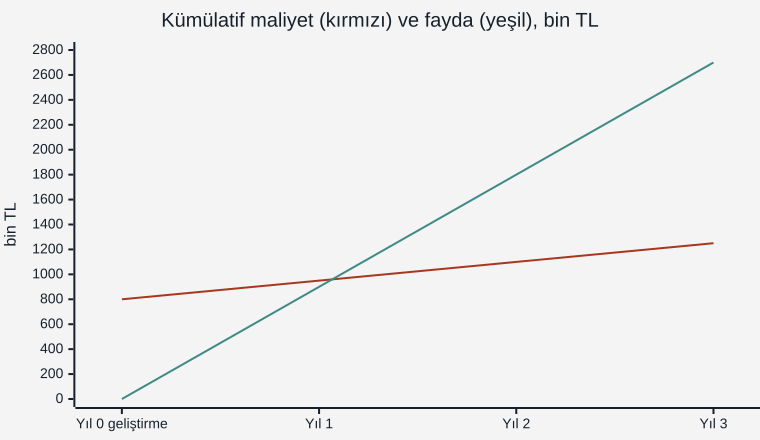

# Konu 04: Proje Başlatma, Paydaş Analizi ve Fizibilite Analizi

Bu bölüm, bir bilgi sistemi projesinin ilk ve en kritik dönüm noktası olan **Proje Başlatma** (*Project Initiation*) evresini, projeden etkilenen aktörleri haritalandıran **Paydaş Analizi**'ni (*Stakeholder Analysis*) ve kaynakların boşa harcanmasını engelleyen **Fizibilite Analizi**'ni (*Feasibility Study*) ele almaktadır. Kütüphane Otomasyonu vaka çalışması üzerinden somutlaştırılan maliyet-fayda analizi ve finansal metrikler (ROI, Payback, NPV), dönem projesinin ilk resmi ara teslimi olan **Teslim 1: Proje Tanımı ve Fizibilite Raporu**'nun temelini oluşturur.

---

## 1. Proje Başlatma Süreci ve Tetikleyicileri

Hiçbir bilgi sistemi projesi durup dururken başlamaz. Bir projenin fitilini ateşleyen daima bir iş ihtiyacı, çözülememiş bir kriz veya yakalanmak istenen stratejik bir fırsattır.

### Projeyi Tetikleyen Üç Temel Unsur

1. **Mevcut Süreçlerdeki Verimsizlikler ve Problemler:**
   - Manuel süreçlerin yol açtığı gecikmeler (Örn: evrakların masadan masaya günlerce dolaşması).
   - Yüksek insan hatası oranları ve veri tutarsızlıkları (Örn: mükerrer kayıtlar, kaybolan envanter).
   - Müşteri şikayetlerinin artması ve hizmet kalitesinin düşmesi.
2. **Yeni İş Fırsatları ve Rekabet Avantajı:**
   - Teknolojik yeniliklerin iş modeline entegrasyonu (Örn: mobil sipariş, yapay zeka destekli öneri sistemleri).
   - Yeni pazarlara açılma veya operasyonel maliyetleri radikal biçimde düşürme arzusu.
3. **Dış ve Yasal Zorunluluklar (Regülasyonlar):**
   - Kişisel Verilerin Korunması Kanunu (KVKK), Avrupa Birliği GDPR veya sektör bazlı mevzuat güncellemeleri.
   - Vergi ve fatura mevzuatında zorunlu hale gelen elektronik dönüşümler (E-Fatura, E-İrsaliye vb.).

### PIECES Problem Tanımlama Çerçevesi (James Wetherbe)

Sistem analistleri mevcut durumdaki eksiklikleri teşhis etmek için **PIECES** çerçevesini kullanır:

- **P - Performance (Performans):** Sistem yeterince hızlı mı? Yanıt süresi ve iş hacmi tatmin edici mi?
- **I - Information (Bilgi):** Üretilen bilgi doğru, zamanında, eksiksiz ve güvenli mi?
- **E - Economics (Ekonomi):** Sürecin maliyeti nedir? Fazla mesai veya kağıt israfı var mı?
- **C - Control (Kontrol & Güvenlik):** Veri yetkisiz erişimlere ve sızıntılara karşı korunuyor mu?
- **E - Efficiency (Verimlilik):** İnsan ve makine kaynakları atıl kalmadan optimum kullanılıyor mu?
- **S - Service (Hizmet Kalitesi):** Sistem son kullanıcıya ve müşteriye güvenilir ve pratik bir deneyim sunuyor mu?

---

## 2. Paydaş Analizi ve Mendelow Güç/İlgi Matrisi

Bir bilgi sisteminden doğrudan veya dolaylı olarak etkilenen ya da sistemi etkileme gücüne sahip tüm kişi, grup veya organizasyonlara **paydaş** (*stakeholder*) denir. Paydaşların doğru analiz edilmemesi, mükemmel kodlanmış sistemlerin bile sahada çöpe gitmesinin en yaygın sebebidir.

### Mendelow Güç/İlgi Matrisi (Stakeholder Grid)

Analistler, paydaşları sahip oldukları **Güç** (karar alma, bütçe onaylama, durdurma yetkisi) ve **İlgi** (sistemin başarısına duydukları merak ve operasyonel temas) düzeylerine göre 4 gruba ayırır:

1. **Yüksek Güç – Yüksek İlgi (Kilit Oyuncular - *Key Players*):**
   - *Örnek:* Proje Sponsoru, Üst Yönetim, İlgili Daire Başkanı.
   - *Yönetim Stratejisi:* **Yakından Yönet (Manage Closely).** Sürekli diyalog halinde olunmalı, kararlara dahil edilmeli ve beklentileri eksiksiz karşılanmalıdır.
2. **Yüksek Güç – Düşük İlgi (Güç Odakları - *Context Setters*):**
   - *Örnek:* Bilgi İşlem Daire Başkanı, Hukuk Müşavirliği, Mali İşler.
   - *Yönetim Stratejisi:* **Memnun Et (Keep Satisfied).** Projeyi detaylarla boğmadan düzenli brifing verilmeli, onayları önceden alınmalı; aksi halde veto edebilirler.
3. **Düşük Güç – Yüksek İlgi (Etkilenen Kullanıcılar - *Show Consideration*):**
   - *Örnek:* Kütüphane Gişe Memurları, Öğrenciler, Mağaza Kasiyerleri.
   - *Yönetim Stratejisi:* **Bilgilendir (Keep Informed).** Süreç boyunca gelişmeler paylaşılmalı, anket ve görüşmelerle fikirleri alınmalı; potansiyel kullanıcı direnci önceden yatıştırılmalıdır.
4. **Düşük Güç – Düşük İlgi (İzlenenler - *Minimal Effort*):**
   - *Örnek:* Genel tedarikçiler, dış ziyaretçiler.
   - *Yönetim Stratejisi:* **İzle (Monitor).** Genel iletişim kanallarıyla rutin duyurular yapılmalı, aşırı kaynak harcanmamalıdır.

---

## 3. Fizibilite (Yapılabilirlik) Analizi Nedir?

Fizibilite analizi, ortaya atılan bir sistem fikrinin teknik, ekonomik, operasyonel ve yasal açılardan **"yapılmaya değer olup olmadığını"** araştıran nesnel bir ön değerlendirme çalışmasıdır.

Fizibilitenin ana amacı projeyi zorla yaptırmak değil; başarısızlığa mahkûm fikirleri **henüz tek bir satır kod yazılmadan ve büyük paralar harcanmadan önce** tespit edip durdurmaktır.

---

## 4. Fizibilitenin Dört Temel Boyutu

### 4.1. Teknik Fizibilite (Technical Feasibility)
> *"Bu sistemi teknik olarak inşa edebilir miyiz?"*

- **Teknoloji ve Altyapı:** Gerekli donanım, bulut sunucuları, veritabanları ve ağ bant genişliği mevcut mu?
- **Teknik Uzmanlık:** Proje ekibi bu teknolojiyi (örneğin React, Spring Boot, Docker, PostgreSQL) kullanacak bilgiye sahip mi? Eğitim gerekecek mi yoksa dış danışmanlık mı alınmalı?
- **Teknoloji Olgunluğu ve Entegrasyon Riski:** Kullanılacak kütüphaneler ve çatılar kararlı mı? Kurumun mevcut eski sistemleriyle (*Legacy Systems*) konuşabilecek API entegrasyonu kurulabilir mi?

### 4.2. Ekonomik Fizibilite (Economic Feasibility)
> *"Bu sistemi inşa etmemiz finansal açıdan mantıklı mı?"*

Ekonomik fizibilite, kapsamlı bir **Maliyet-Fayda Analizi** (*Cost-Benefit Analysis - CBA*) ile yürütülür.

#### Maliyet Türleri

| Kategori | Somut Maliyetler (*Tangible Costs*) | Soyut Maliyetler (*Intangible Costs*) |
| :--- | :--- | :--- |
| **Geliştirme Maliyeti (Tek Seferlik)** | Sunucu donanımı alımı, geliştirici ve analist maaşları, yazılım lisansları, ofis giderleri. | Proje süresince mevcut personelin asıl işlerine odaklanamaması, geçici iş yavaşlamaları. |
| **İşletim Maliyeti (Yinelenen)** | Bulut abonelikleri (AWS/Azure), sunucu elektrik/soğutma giderleri, yıllık bakım sözleşmeleri. | Yeni sisteme alışma döneminde çalışan stresinde geçici artış, personel devir hızı dalgalanması. |

#### Fayda Türleri

| Kategori | Somut Faydalar (*Tangible Benefits*) | Soyut Faydalar (*Intangible Benefits*) |
| :--- | :--- | :--- |
| **Doğrudan Ölçülebilir** | Mesai maliyetlerinde yılda 400.000 TL tasarruf, kayıp envanter oranında %80 düşüş, kağıt ve kargo masraflarında 150.000 TL azalma. | Artan kurumsal prestij ve marka değeri, çalışan memnuniyetinin ve moralinin yükselmesi, daha hızlı ve güvenilir karar alma ortamı. |

#### Temel Finansal Metrikler

1. **Yatırımın Geri Dönüşü (ROI - *Return on Investment*):**
   $$\text{ROI} = \frac{\text{Toplam Net Fayda (Toplam Fayda - Toplam Maliyet)}}{\text{Toplam Maliyet}} \times 100$$
2. **Geri Ödeme Süresi (Payback Period / Başa Baş Noktası):**
   Yatırım maliyetinin, sağlanan kümülatif net tasarruflar ile tamamen sıfırlandığı ve kâra geçildiği süredir. Çoğu kurumsal yazılım projesinde hedef bu sürenin 1–2 yılı aşmamasıdır.
3. **Net Bugünkü Değer (NPV - *Net Present Value*):**
   Paranın zaman değerini (enflasyon ve faiz) hesaba katarak gelecekteki nakit girişlerinin bugünkü değerini hesaplar. NPV > 0 ise proje finansal olarak onay alır.

### 4.3. Operasyonel Fizibilite (Operational Feasibility)
> *"Sistemi inşa edersek kurum içinde kabul görür ve etkin kullanılır mı?"*

- **Kullanıcı Direnci (*User Resistance*):** İnsanlar alışkanlıklarını değiştirmekten korkarlar. Personel "Bu yazılım gelirse ben işsiz mi kalacağım?" kaygısı taşıyor mu?
- **Örgüt Kültürü ve Yönetim Desteği:** Kurum değişime açık mı? Üst yönetim yeni süreci sahipleniyor mu?
- **Eğitim ve Adaptasyon:** Sistemin arayüzü son kullanıcının yetkinliğine uygun mu? Kullanıcılara yeterli eğitim ve teknik destek verilebilecek mi?

### 4.4. Yasal, Etik ve Zaman Fizibilitesi (Legal & Schedule Feasibility)
> *"Önerilen sistem yasal sınırlar içinde mi ve hedeflenen takvime yetişir mi?"*

- **Yasal Uyumluluk (KVKK / GDPR):** Kullanıcıların kimlik, telefon veya adres verileri toplanırken açık rıza alınıyor mu? Veriler nerede saklanıyor?
- **Fikri Mülkiyet ve Lisanslar:** Kullanılan açık kaynak kütüphanelerin lisansları (MIT, Apache, GPL) kurumun ticari modeliyle çelişiyor mu?
- **Zaman (Schedule) Fizibilitesi:** Projenin tamamlanması gereken mutlak bir son tarih (yeni eğitim dönemi başlangıcı, mevzuat yürürlük tarihi vb.) var mı? Bu süre gerçekçi mi?

---

## 5. Karşılaştırmalı Analiz ve Karar Mekanizması

Fizibilite raporunun sonunda yönetim kurulunun önüne üç seçenekten biri konur:

1. **ONAY (GO):** Tüm fizibilite boyutları olumludur. Proje resmiyet kazanır; bütçe, ekip ve takvim tahsis edilir.
2. **REVİZYON (REVISE):** Proje fikri değerlidir ancak bazı boyutlarda aşırı risk vardır (Örn: bütçe aşılmış veya teknoloji çok karmaşık seçilmiştir). Kapsam daraltılır (*Scope Trimming*) veya alternatif mimariyle fizibilite yenilenir.
3. **RET (NO-GO):** Proje teknik olarak yapılamaz, maliyeti getirisinden fazladır veya kullanıcılar tarafından kesinlikle benimsenmeyecektir. Proje derhal sonlandırılır. Bu bir başarısızlık değil; kurumun milyonlarca lirasını kurtaran analitik bir zaferdir.

---

## 6. Vaka Çalışması: Kütüphane Otomasyonu Kapsamlı Fizibilite Raporu

Kütüphane Daire Başkanlığı'nın talebi üzerine analist ekibi tarafından hazırlanan fizibilite raporu aşağıda özetlenmiştir:

### 6.1. Teknik Değerlendirme
- Kütüphanedeki mevcut 12 adet gişe bilgisayarı modern web tarayıcılarını sorunsuz çalıştırmaktadır.
- Üniversitenin Bilgi İşlem Daire Başkanlığı sanal bir Linux sunucusu (Docker destekli) ve PostgreSQL veritabanı alanı tahsis etmiştir.
- Ekip web mimarilerine hakimdir. **Teknik Risk: Düşük.**

### 6.2. Ekonomik Değerlendirme (3 Yıllık Projeksiyon)
- **Başlangıç Geliştirme Maliyeti (Yıl 0):**
  - Analist ve Geliştirici Personel (4 adam/ay): 650.000 TL
  - Donanım ve Barkod/RFID Okuyucular (12 adet): 100.000 TL
  - Altyapı ve Güvenlik Sertifikaları: 50.000 TL
  - **Toplam Başlangıç Maliyeti:** 800.000 TL
- **Yıllık İşletim Maliyeti (Yıl 1–3):**
  - Bulut/Sunucu yedekleme ve bakım: Yıllık 150.000 TL
- **Yıllık Somut Faydalar (Yıl 1–3):**
  - Manuel envanter sayımında tasarruf: Yıllık 350.000 TL
  - Kayıp ve çalıntı kitap oranında azalma: Yıllık 250.000 TL
  - Gecikme cezalarının tahsilat verimliliği: Yıllık 300.000 TL
  - **Toplam Yıllık Fayda:** 900.000 TL / yıl
- **Net Finansal Göstergeler:**
  - Net Yıllık Tasarruf: $900.000 - 150.000 = 750.000\text{ TL/yıl}$
  - Geri Ödeme Süresi (*Payback Period*): $\frac{800.000}{750.000} \approx 1{,}07\text{ Yıl}$ (~13. Ayda başa baş).
  - 3 Yıllık Net Katma Değer: $(3 \times 750.000) - 800.000 = 1.450.000\text{ TL}$.
  - **Ekonomik Karar: Kesinlikle Yapılabilir (Yüksek ROI).**

### 6.3. Operasyonel Değerlendirme
- 25 yıldır kütüphanede çalışan bazı memurlar manuel kartoteks ve defter sistemini terk etmeye çekinmektedir ("Bilgisayar çökerse kayıtlar gider").
- **Eylem Planı:** Sisteme otomatik günlük yedekleme modülü konulacak; personele canlıya geçiş öncesinde 2 tam günlük uygulamalı eğitim verilecek ve ilk ay gişelerde birer stajyer analist destek verecektir. **Operasyonel Risk: Yönetilebilir.**

### 6.4. Yasal ve KVKK Değerlendirmesi
- Öğrencilerin T.C. Kimlik Numarası, telefon ve okuma geçmişi veritabanında şifreli (*AES-256*) saklanacaktır.
- Sisteme ilk girişte KVKK Aydınlatma Metni ve Açık Rıza onayı zorunlu kılınacaktır. **Yasal Risk: Yok.**

### 6.5. Yönetim Kararı
**ONAY (GO).** Proje derhal başlatılmış ve 4 aylık geliştirme takvimi resmileştirilmiştir.

---

## 7. Dönem Projesi: Teslim 1 — Proje Tanımı ve Fizibilite Raporu

Öğrenci takımlarının (3–5 kişi) bu hafta hazırlayacağı ilk resmi teslim dokümanı aşağıdaki standart şablonu takip etmelidir:

### Rapor Formatı ve Zorunlu Bölümler
1. **Kapak ve Takım Künyesi:** Proje adı, takım numarası, üyelerin ad-soyadları, öğrenci numaraları ve üstlendikleri somut roller (İş Analisti, Süreç Analisti, Veri Mimarı, Sistem Mimarı, UI/UX Tasarımcısı).
2. **Proje Tanımı ve Problem Sahası:** Hangi sektör/işletme inceleniyor? Mevcut manuel veya yetersiz sistemdeki darboğazlar nelerdir? (PIECES modeliyle açıklanmalıdır).
3. **Hedefler ve Kapsam:** Geliştirilecek sistem neyi çözecek (kapsam içi), neyi çözmeyecek (kapsam dışı)?
4. **Paydaş Analizi:** Mendelow 2x2 Güç/İlgi matrisi ve paydaş listesi.
5. **Dört Boyutlu Fizibilite Analizi:**
   - *Teknik:* Kullanılacak teknolojiler ve takımın yetkinliği.
   - *Ekonomik:* Varsayımsal geliştirme ve işletim maliyetleri, somut/soyut faydalar ve tahmini ROI hesabı.
   - *Operasyonel:* Hedef kullanıcı kitlesinin kabul düzeyi ve direnç azaltma stratejileri.
   - *Yasal & Etik:* KVKK ve sektörel mevzuat uyum adımları.
6. **Yönetim Özeti ve Karar:** Projenin neden başlatılması gerektiğine dair sonuç gerekçesi.

---

## 8. Sık Yapılan Hatalar ve Psikolojik Tuzaklar

1. **Batık Maliyet Yanılgısı (*Sunk Cost Fallacy*):** *"Projeye zaten 500.000 TL ve 6 ay harcadık, batacağını bilsek bile bitirmek zorundayız."* Geçmişte harcanan ve geri alınamayacak kaynaklar gelecekteki kararları etkilememelidir; zarar neresinden dönülürse kârdır.
2. **Aşırı İyimserlik Yanılgısı (*Optimism Bias*):** Maliyetleri ve geliştirme sürelerini her şeyin kusursuz gideceği varsayımıyla çok düşük tahmin edip, gelirleri ve faydaları abartmak.
3. **Soyut Faydaları Şişirmek:** Projeyi haklı çıkarmak için *"Marka prestijimiz ölçülemez şekilde artacak"* gibi doğrulanması imkansız soyut faydalarla bütçe koparmaya çalışmak.
4. **Yasal Boyutu Sona Bırakmak:** Sistem tamamlandıktan sonra KVKK veya telif hakkı engeline takılıp uygulamanın kapatılması. Yasal fizibilite ilk gün yapılmalıdır.

---

## 9. Bölüm Sonu Değerlendirme Soruları

#### Soru 1: Mendelow Paydaş Matrisi
Mendelow Güç/İlgi Matrisinde **"Yüksek Güce fakat Düşük İlgiye"** sahip bir paydaş grubu (örneğin kurumun Hukuk Müşavirliği veya Bilgi İşlem Daire Başkanı) için önerilen en doğru yönetim stratejisi aşağıdakilerden hangisidir?  
A) Yakından Yönet (Manage Closely)  
B) Memnun Et (Keep Satisfied)  
C) Bilgilendir (Keep Informed)  
D) Minimum Çabayla İzle (Monitor)  
E) Karar Süreçlerinden Tamamen Uzak Tut  
*Cevap: B*

#### Soru 2: Ekonomik Fizibilite
Bir yazılım projesinin başlangıç geliştirme maliyeti 600.000 TL olarak hesaplanmıştır. Sistem canlıya alındıktan sonra işletim giderleri düşüldüğünde kuruma yıllık net 300.000 TL tasarruf sağlayacaktır. Bu projenin **Geri Ödeme Süresi (Payback Period)** ne kadardır?  
A) 6 Ay  
B) 1 Yıl  
C) 2 Yıl  
D) 3 Yıl  
E) 4 Yıl  
*Cevap: C (600.000 / 300.000 = 2 Yıl).*

#### Soru 3: Fizibilite Boyutları
"Yeni tasarlanan muhasebe otomasyonuna karşı şirket çalışanlarının alışkanlıklarından vazgeçmek istememesi ve sisteme direnç göstermesi riski", fizibilite analizinin hangi boyutunda ele alınır?  
A) Teknik Fizibilite  
B) Ekonomik Fizibilite  
C) Operasyonel Fizibilite  
D) Yasal Fizibilite  
E) Takvim Fizibilitesi  
*Cevap: C*

#### Soru 4: Batık Maliyet Yanılgısı
Bir şirket daha önce 2 milyon TL harcadığı bir ERP yazılımının artık kurumun ihtiyaçlarını karşılayamadığını ve tamamlanması halinde bile şirkete zarar ettireceğini tespit etmiştir. Buna rağmen şirket genel müdürü *"O kadar para ve emek döktük, bu proje çöpe atılamaz"* diyerek projeyi sürdürme kararı almıştır. Genel müdürün düştüğü bilişsel tuzak hangisidir?  
A) Kapsam Kayması (*Scope Creep*)  
B) Batık Maliyet Yanılgısı (*Sunk Cost Fallacy*)  
C) Peter İlkesi (*Peter Principle*)  
D) Pareto Kuralı (*80/20 Kuralı*)  
E) Hawthorne Etkisi (*Hawthorne Effect*)  
*Cevap: B*

#### Soru 5: Vaka Analizi
Bir sağlık kuruluşu, hastaların tahlil sonuçlarını yapay zeka ile analiz edip otomatik teşhis öneren bir mobil uygulama geliştirmek istemektedir. Analist ekibi; altyapının yeterli olduğunu (Teknik OK), 1 yılda maliyetini çıkaracağını (Ekonomik OK) ve doktorların sistemi heyecanla beklediğini (Operasyonel OK) görmüştür. Ancak Sağlık Bakanlığı mevzuatının hekim onayı olmaksızın yapay zeka tarafından teşhis çıktısı verilmesini kesin bir dille yasakladığı fark edilmiştir. Bu durumda fizibilite raporunun nihai önerisi ne olmalıdır?  
A) Mevzuat çiğnenmeli ve sistem gizlice yayına alınmalıdır.  
B) Proje doğrudan ONAY almalıdır çünkü teknik ve ekonomik açıdan mükemmeldir.  
C) Proje REVİZYON almalı; doğrudan teşhis koymak yerine hekime 'karar destek önerisi' sunan ve nihai onayı hekime bırakan bir kapsama dönüştürülmelidir.  
D) Doktorlar istifa ettirilmelidir.  
E) Sistem sadece mesai saatleri dışında çalıştırılmalıdır.  
*Cevap: C*

---

*Öğr. Gör. Turgay Taymaz · Afyon Kocatepe Üniversitesi, Sinanpaşa MYO*
*Bu materyal CC BY-NC-SA 4.0 ile lisanslanmıştır. Kullanırken kaynak gösteriniz.*
*Kaynak: https://github.com/ttaymaz/ders-notlari*
