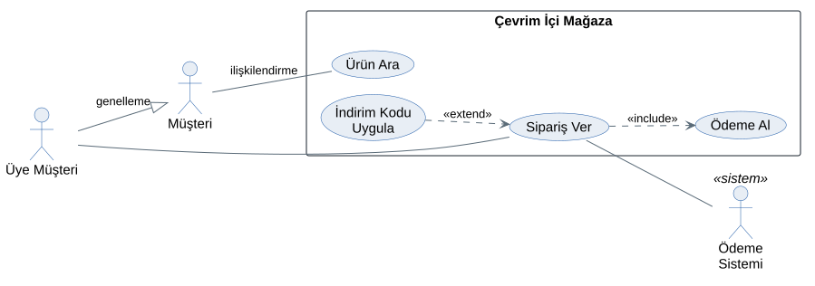
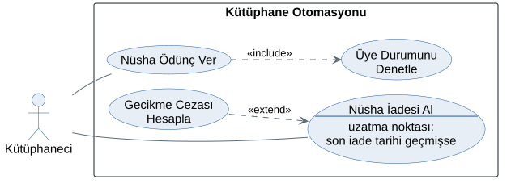
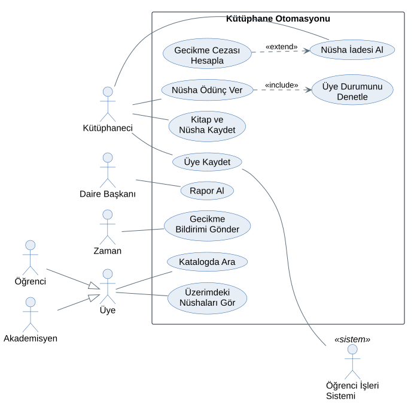

# 5. Hafta: Gereksinim Analizi — UML Use Case Diyagramları ve Senaryolar

## Giriş: "Kitap Ödünç Verilsin" Yeterli mi?

Fizibilite raporu onaylandı; kütüphane otomasyonu başlıyor. Daire Başkanı analiste tek cümle söylüyor: *"Sistem kitap ödünç versin."*

Bu cümle bir yazılımcıya verilse ne yapar? Kaç nüsha verilebileceğini, kaç gün için verileceğini, cezası olan üyeye ne olacağını, barkod okunmazsa ne yapılacağını bilmez. Ya kendi kafasına göre karar verir ya da her soruyu tek tek sormak zorunda kalır. İlki 2. haftadaki hata maliyeti tablosunun en pahalı satırına, ikincisi haftalarca süren yazışmalara yol açar.

Analistin bu haftaki işi, tek cümlelik isteği **test edilebilir gereksinimlere** ve bu gereksinimlerin haritası olan **use case diyagramına** dönüştürmektir. Böylece "sistem NE yapmalı?" sorusu ilk kez ayrıntılı ve yazılı bir cevap alır.

---

## 1. Gereksinim Nedir?

> **Gereksinim**, bir sistemin kullanıcılarının ve paydaşlarının ihtiyacını karşılamak için taşıması gereken bir yetenek, nitelik veya koşuldur.

Gereksinimler analizin ana çıktısıdır. Kaynakları paydaşlar, mevcut süreç, kurumun belgeleri ve mevzuattır.

### Kullanıcı Hikâyesi ile Gereksinimin Farkı

3. haftada kullanıcı hikâyeleri yazdık. Hikâye bir **konuşma davetidir**: kimin neyi neden istediğini söyler ama ayrıntıyı konuşmaya bırakır. Gereksinim ise o konuşmanın **netleşmiş ve doğrulanabilir** hâlidir.

| Kullanıcı hikâyesi | Gereksinim |
| :--- | :--- |
| Bir kütüphaneci olarak nüsha ödünç vermek istiyorum; böylece kayıtlar elle tutulmasın. | FG-04: Sistem, öğrenci üyeye aynı anda en fazla 3 nüsha ödünç verir. |
| | FG-05: Sistem, öğrenci üye için son iade tarihini ödünç tarihinden 15 gün sonrası olarak hesaplar. |

Bir hikâyeden birden çok gereksinim çıkabilir. Hikâyenin kabul ölçütleri yazıldıkça hikâye gereksinime yaklaşır.

---

## 2. Gereksinimin Üç Türü

### 2.1. Fonksiyonel Gereksinim

Sistemin **ne yapacağını** tanımlar: hangi girdiyi alıp hangi işlemi yapacağını ve hangi çıktıyı üreteceğini.

- *Sistem, iade edilen nüshanın gecikme cezasını nüsha başına günlük 2 TL olarak hesaplar.*
- *Sistem, gecikmiş nüshası olan üyeye yeni ödünç vermez.*

### 2.2. Fonksiyonel Olmayan Gereksinim

Adı yanıltıcıdır: fonksiyonu olmayan değil, fonksiyonun **ne kalitede** yerine getirileceğini tanımlayan gereksinimdir. Bu yüzden **kalite gereksinimi** de denir. Yazılım kalitesi ISO/IEC 25010 gibi kalite modellerinde ayrıntılı olarak sınıflandırılır; en sık kullanılan başlıklar şunlardır:

| Başlık | Kütüphane örneği |
| :--- | :--- |
| **Performans** | Barkod okutulduktan sonra ödünç onayı en geç 2 saniyede görünür. |
| **Güvenlik** | Ödünç ve iade işlemlerini yalnızca kütüphaneci rolündeki kullanıcılar yapabilir. |
| **Kullanılabilirlik** | Yeni bir kütüphaneci, 30 dakikalık eğitimden sonra ödünç işlemini yardımsız tamamlayabilir. |
| **Güvenilirlik** | Veritabanı her gece yedeklenir; bir arızada en fazla bir günlük veri kaybolur. |
| **Bakım kolaylığı** | Ödünç süresi ve ceza tutarı kod değiştirmeden ayarlardan değiştirilebilir. |

### 2.3. Kısıt

Çözümü dışarıdan sınırlayan koşuldur. Sistemin kendisinden beklenen bir kalite değil, analistin ve tasarımcının uymak zorunda olduğu bir sınırdır.

- *Sistem üniversitenin mevcut sanal sunucusunda çalışır.* (teknik kısıt)
- *Üyeler için T.C. kimlik numarası tutulmaz.* (4. haftadaki KVKK kararı)
- *Geliştirme dört ayda tamamlanır.* (takvim kısıtı)

En sık karışan çift fonksiyonel olmayan gereksinim ile kısıttır. Ayırt etmenin yolu şu soruyu sormaktır: *Bu koşulu sistemin kendisi mi sağlıyor, yoksa dışarıdan mı dayatılıyor?*

---

## 3. İyi Bir Gereksinimin Özellikleri

ISO/IEC/IEEE 29148 gibi gereksinim mühendisliği standartları iyi bir gereksinimin özelliklerini uzun bir listeyle tanımlar. Uygulamada en sık ihlal edilenler şunlardır:

- **Tek anlamlı:** Okuyan herkes aynı şeyi anlar. "Hızlı", "kolay", "kullanıcı dostu" gibi kelimeler herkese farklı gelir.
- **Doğrulanabilir:** Sağlanıp sağlanmadığı bir testle gösterilebilir.
- **Tutarlı:** Başka bir gereksinimle çelişmez.
- **İzlenebilir:** Bir kimlik numarası (FG-04 gibi) ve bir kaynağı (hangi paydaştan, hangi belgeden geldiği) vardır.
- **Tekil:** Bir cümlede bir gereksinim bulunur. "Sistem ödünç verir ve e-posta gönderir" iki gereksinimdir; biri karşılanmazsa hangisinin eksik olduğu belirsiz kalır.

| Zayıf | Neden zayıf? | Güçlü |
| :--- | :--- | :--- |
| Sistem hızlı olmalı. | Ölçülemez | Arama sonucu 2 saniye içinde gelir. |
| Ceza doğru hesaplanmalı. | "Doğru"nun tanımı yok | Ceza = geciken gün × nüsha sayısı × 2 TL. |
| Sistem güvenli olmalı. | Test edilemez | Üç hatalı girişten sonra hesap 15 dakika kilitlenir. |
| Kullanıcı istediği raporu alabilmeli. | Kapsamı belirsiz | Daire Başkanı aylık ödünç sayısını kategoriye göre listeleyebilir. |

---

## 4. Gereksinim Toplama Teknikleri

Gereksinimler kendiliğinden ortaya çıkmaz; toplanır. Her tekniğin bir gücü ve bir tuzağı vardır, bu yüzden birkaç teknik birlikte kullanılır.

| Teknik | Ne zaman işe yarar? | Tuzağı |
| :--- | :--- | :--- |
| **Mülakat** | Ayrıntıyı ve gerekçeyi öğrenmek | Kullanıcı yaptığını değil, yaptığını sandığını anlatır |
| **Gözlem** | Gerçek iş akışını görmek | Gözlenen kişi izlendiğini bildiği için davranışını değiştirebilir |
| **Anket** | Çok sayıda kullanıcıdan eğilim toplamak | Sorulmayan sorunun cevabı gelmez |
| **Belge inceleme** | Formlar, yönetmelikler, eski raporlar | Belge güncel olmayabilir |
| **Atölye (JAD)** | Farklı paydaşları aynı masada uzlaştırmak | Baskın bir kişi toplantıyı yönlendirebilir |
| **Prototip** | "Görünce anlarım" diyen kullanıcıdan geri bildirim almak | Prototip bitmiş ürün sanılabilir |

JAD (*Joint Application Development*), kullanıcıların, yöneticilerin ve analistlerin yoğun, yönetilen oturumlarda gereksinimleri birlikte çıkardığı bir atölye yöntemidir.

**Kütüphaneden bir örnek:** Mülakatta kütüphaneci ödünç işlemini "kartı okuturum, fişe tarih basarım" diye anlatır. Gözlemde ise her ödünçten önce defterde üyenin eski kayıtlarına baktığını görürsünüz: aslında üyenin geciken kitabı var mı diye kontrol etmektedir. Bu kontrol, mülakatta hiç söylenmemiş bir gereksinimdir ve bu haftanın vakasında **Üye Durumunu Denetle** use case'ine dönüşecektir.

---

## 5. Use Case (Kullanım Senaryosu) Nedir?

Use case yaklaşımını Ivar Jacobson 1980'lerde nesneye yönelik yazılım geliştirme için ortaya koydu; 1990'larda UML'e (*Unified Modeling Language*) girdi. Bu derste **use case** terimini İngilizce bırakıyoruz, çünkü hem literatürde hem iş ilanlarında bu adla geçer. Türkçe karşılığı olarak **kullanım senaryosu** da kullanılır.

> **Use case**, bir aktörün sistemle etkileşerek değer gördüğü bir hedefe ulaşmasını anlatan davranış dizisidir.

- **Aktörün gözünden, fiille adlandırılır:** *Nüsha Ödünç Ver*, *Katalogda Ara*. "Ödünç Modülü" veya "Veritabanı İşlemleri" use case adı değildir.
- **Kullanıcı hedefi seviyesinde yazılır:** Aktörün bir oturuşta tamamlayıp "işimi hallettim" diyebileceği büyüklükte olmalıdır. Alistair Cockburn bu seviyeye *kullanıcı hedefi* (*user goal*) der. "Barkod Okut" bundan küçüktür, "Kütüphaneyi Yönet" bundan büyüktür.
- **Diyagram NE'yi gösterir, NASIL'ı göstermez:** Kimin sistemle neyi yaptığını gösterir; adımların sırasını, ekranları, veriyi göstermez. Sıra ve etkileşim 10. haftada sıralama ve aktivite diyagramlarıyla modellenecek.
- **Asıl gereksinim senaryo metnidir:** Use case diyagramı bir içindekiler tablosudur. Her elipsin arkasında, 8. bölümde göreceğimiz bir senaryo metni bulunur.

---

## 6. Aktör

> **Aktör**, sistemin dışında durup sistemle etkileşen bir **roldür**.

- **Rol, kişi değil:** Kütüphanede çalışan bir personel, kitap ödünç aldığında Üye rolündedir. Aynı kişi iki aktör olabilir.
- **Birincil aktör:** Use case'i başlatır; hedef onundur. *Nüsha Ödünç Ver*'in birincil aktörü Kütüphaneci'dir.
- **İkincil aktör:** Sistemin bir use case'i yerine getirmek için hizmet aldığı dış taraftır. *Üye Kaydet* sırasında üyeliği doğrulayan **Öğrenci İşleri Sistemi** ikincil aktördür.
- **Aktör türleri:** insan, dış sistem ve **zaman**. Her gece kendiliğinden gönderilen gecikme e-postasını bir insan başlatmaz; tetikleyici saattir.

### Paydaş Her Zaman Aktör Değildir

4. haftanın paydaş listesinden aktörleri seçelim:

| Paydaş | Aktör mü? | Neden? |
| :--- | :--- | :--- |
| Kütüphaneciler | Evet | Sistemi her gün doğrudan kullanır |
| Öğrenci ve akademisyen üyeler | Evet | Katalogda arar, kendi ödünçlerini görür |
| Daire Başkanı | Evet | Rapor alır |
| Rektörlük | Hayır | Bütçeyi onaylar ama sistemi kullanmaz |
| Hukuk Müşavirliği | Hayır | Gereksinimi etkiler (KVKK), sistemle etkileşmez |
| Öğrenci İşleri Sistemi | Evet (ikincil) | Sistem ondan veri alır |

Barkod okuyucu da aktör değildir: o bir giriş aygıtıdır, rol Kütüphaneci'nindir.

---

## 7. Use Case Diyagramının Öğeleri ve İlişkileri

Aşağıdaki şema gösterimi tanıtmak için bilerek kütüphane dışından, genel bir çevrim içi mağazadan seçildi:

| Öğe | Gösterim |
| :--- | :--- |
| **Aktör** | Çöp adam; altında rol adı. Dış sistemler için `«sistem»` etiketi eklenebilir. |
| **Use case** | Elips; içinde fiille başlayan ad |
| **Sistem sınırı** | Use case'leri çevreleyen dikdörtgen; üstünde sistemin adı. Aktörler **dışında** durur. |

### Dört İlişki

| İlişki | Gösterim | Anlamı | Kütüphane örneği |
| :--- | :--- | :--- | :--- |
| **İlişkilendirme** | Düz çizgi | Aktör bu use case'e katılır | Kütüphaneci — Nüsha Ödünç Ver |
| **include** | Kesikli ok, `«include»`; temel use case'ten eklenene | Temel use case **her çalıştığında** eklenen de çalışır | Nüsha Ödünç Ver ⇢ Üye Durumunu Denetle |
| **extend** | Kesikli ok, `«extend»`; genişletenden temel use case'e | Genişleten davranış **yalnızca bir koşul gerçekleşirse** araya girer | Gecikme Cezası Hesapla ⇢ Nüsha İadesi Al |
| **Genelleme** | İçi boş üçgen uçlu ok; alt türden üst türe | Alt tür, üst türün katıldığı her use case'e katılır | Öğrenci ▷ Üye |

### include ile extend Nasıl Ayırt Edilir?

En sık yapılan hata bu ikisini karıştırmaktır. Üç soru yeterlidir:

1. **Her seferinde mi, koşullu mu?** Her ödünçte üye durumu denetlenir: *include*. Her iadede ceza hesaplanmaz, yalnızca gecikme varsa: *extend*.
2. **Temel use case eklenen olmadan anlamlı mı?** Nüsha İadesi Al, ceza hesabı olmadan da tamamlanabilir; extend'in temeli kendi başına anlamlıdır. Nüsha Ödünç Ver ise üye denetimi olmadan eksik kalır; include'un temeli eklenen olmadan tamamlanmaz.
3. **Ok nereden çıkıyor?** Cümle kurun: *"Ödünç ver, üye durumunu denetlemeyi **içerir**"* — ok ödünçten çıkar. *"Ceza hesapla, iade almayı **genişletir**"* — ok cezadan çıkar.

### Uzatma Noktası

`extend` ilişkisinde genişletilen use case'in hangi noktada ve hangi koşulda genişletileceği bir **uzatma noktası** (*extension point*) ile adlandırılır. UML'de elipsin içinde bir çizginin altına yazılır:

Burada *Nüsha İadesi Al* use case'inin uzatma noktası "son iade tarihi geçmişse" koşuludur; *Gecikme Cezası Hesapla* yalnızca bu koşulda devreye girer.

### include Ne Zaman Kullanılmalı?

include her küçük adımı ayırmak için kullanılmaz. Şu iki durumdan biri varsa anlamlıdır:

- Aynı davranış **birden çok** use case'te tekrarlanıyorsa (üye denetimi ileride rezervasyonda da gerekebilir),
- Temel use case'i okunmaz hâle getirecek kadar **büyük** ve kendi içinde bütünlüklü bir parça varsa.

Her adımı include ile ayırmak diyagramı bir akış şemasına çevirir; bu, use case diyagramının en yaygın yanlış kullanımıdır.

---

## 8. Senaryo: Diyagramın Arkasındaki Gereksinim

Her use case için yazılı bir **senaryo** (*use case description*) bulunur. Aşağıdaki şablon, Alistair Cockburn'ün *Writing Effective Use Cases* (2001) kitabıyla yaygınlaşan biçimin sadeleştirilmiş hâlidir. Kaynaklarda alan adları biraz değişir; değişmeyen şey **ana akış** ile **alternatif akışların** ayrı yazılmasıdır.

| Alan | Açıklama |
| :--- | :--- |
| **Ad ve kimlik** | Fiille başlayan ad ve numara: UC-03 Nüsha Ödünç Ver |
| **Birincil aktör** | Use case'i başlatan ve hedefi olan aktör |
| **Paydaşlar ve beklentileri** | Sonuçla ilgilenen diğer taraflar ve ne bekledikleri |
| **Ön koşul** | Use case başlamadan önce doğru olması gereken durum |
| **Tetikleyici** | Use case'i başlatan olay |
| **Ana akış** | Her şey yolunda giderse izlenen numaralı adımlar |
| **Alternatif akışlar** | Ana akışın bir adımından ayrılan yollar; ayrıldığı adımın numarasıyla yazılır (3a, 3b…) |
| **Son koşul** | Use case başarıyla bitince doğru olan durum |
| **İş kuralları** | Senaryonun dayandığı kurallara atıf |

Ön koşul ile tetikleyici karıştırılmamalıdır: kütüphanecinin sisteme giriş yapmış olması **ön koşuldur**; üyenin gişeye nüshayla gelmesi **tetikleyicidir**.

İş kurallarının senaryonun içine gömülmek yerine ayrı bir listede tutulup atıfla anılmasının sebebi, aynı kuralın birden çok senaryoda kullanılmasıdır. Kural değiştiğinde (örneğin öğrenci sınırı 3'ten 4'e çıktığında) tek yerde değişir.

---

## 9. Vaka Çalışması: Kütüphane Otomasyonu

### 9.1. Kullanıcı Hikâyelerinden Aktör ve Use Case'e

3. haftanın ürün iş listesindeki hikâyelerden yola çıkalım. Hikâyedeki **rol** aktöre, **ihtiyaç** use case'e dönüşür:

| Hikâye (3. hafta) | Aktör | Use case |
| :--- | :--- | :--- |
| Kütüphaneci olarak yeni kitabı ve nüshalarını barkoduyla kaydetmek | Kütüphaneci | Kitap ve Nüsha Kaydet |
| Üye olarak kataloğu başlık veya yazara göre aramak | Üye | Katalogda Ara |
| Üye olarak üzerimdeki nüshaları ve son iade tarihlerini görmek | Üye | Üzerimdeki Nüshaları Gör |
| Kütüphaneci olarak gecikmelere otomatik e-posta gitmesini istemek | **Zaman** | Gecikme Bildirimi Gönder |

Dördüncü satıra dikkat edin: hikâyede "istiyorum" diyen Kütüphaneci'dir, ama e-postayı her gece başlatan bir insan yoktur. Hikâyenin sahibi ile use case'in birincil aktörü her zaman aynı değildir.

Gözlem ve mülakatlarla listeye şunlar eklenir: *Nüsha Ödünç Ver*, *Nüsha İadesi Al*, *Üye Kaydet*, *Rapor Al* ve bunların parçaları olan *Üye Durumunu Denetle* ile *Gecikme Cezası Hesapla*.

### 9.2. Gereksinim Listesi (Özet)

**İş kuralları**

| Kimlik | Kural |
| :--- | :--- |
| İK-01 | Öğrenci üye aynı anda en fazla 3 nüsha alır; ödünç süresi 15 gündür. |
| İK-02 | Akademisyen üye aynı anda en fazla 10 nüsha alır; ödünç süresi 30 gündür. |
| İK-03 | Gecikme cezası nüsha başına günlük 2 TL'dir. |
| İK-04 | Gecikmiş nüshası veya ödenmemiş cezası olan üye yeni ödünç alamaz. |

**Fonksiyonel gereksinimler (örnekler)**

| Kimlik | Gereksinim | Kaynak |
| :--- | :--- | :--- |
| FG-01 | Sistem, yeni bir kitabı ISBN, başlık, yazar, yayınevi ve basım yılıyla kaydeder. | Hikâye 1 |
| FG-02 | Sistem, bir kitabın her nüshasını ayrı bir barkod numarasıyla kaydeder. | Hikâye 1, 2. hafta krizi |
| FG-03 | Sistem, ödünç öncesinde İK-04'ü denetler. | Gözlem |
| FG-04 | Sistem, ödünçte İK-01 ve İK-02'deki nüsha sınırını uygular. | Daire Başkanı |
| FG-05 | Sistem, son iade tarihini üye türüne göre hesaplar. | İK-01, İK-02 |
| FG-06 | Sistem, iadede gecikme varsa cezayı İK-03'e göre hesaplar. | Daire Başkanı |
| FG-07 | Sistem, her gece son iade tarihi geçmiş nüshaların sahiplerine e-posta gönderir. | Hikâye 4 |

**Fonksiyonel olmayan gereksinimler (örnekler)**

| Kimlik | Gereksinim |
| :--- | :--- |
| FOG-01 | Barkod okutulduktan sonra ödünç onayı en geç 2 saniyede görünür. |
| FOG-02 | Ödünç ve iade işlemlerini yalnızca kütüphaneci rolündeki kullanıcılar yapabilir. |
| FOG-03 | Yeni bir kütüphaneci, 30 dakikalık eğitimden sonra ödünç işlemini yardımsız tamamlayabilir. |

### 9.3. Use Case Diyagramı

- **Aktör genellemesi:** Öğrenci ve Akademisyen, Üye'nin alt türleridir. Aynı use case'lere katıldıkları için ayrı ayrı bağlanmazlar; ama iş kuralları (nüsha sınırı ve süre) farklı olduğu için diyagramda ayrı gösterilirler.
- **Sistem sınırı:** Öğrenci İşleri Sistemi sınırın dışındadır; onu biz yazmıyoruz, yalnızca ondan veri alıyoruz. 1. haftadaki sınır kararı burada aynen korunur ve 6. haftada bağlam diyagramına taşınacaktır.
- **include:** Nüsha Ödünç Ver, her seferinde Üye Durumunu Denetle'yi içerir.
- **extend:** Gecikme Cezası Hesapla, yalnızca son iade tarihi geçmişse Nüsha İadesi Al'ı genişletir.

### 9.4. Senaryo: UC-03 Nüsha Ödünç Ver

| Alan | İçerik |
| :--- | :--- |
| **Birincil aktör** | Kütüphaneci |
| **Paydaşlar ve beklentileri** | Üye: doğru son iade tarihini öğrenmek. Daire Başkanı: nüshaların kime verildiğinin güvenilir biçimde kaydedilmesi. |
| **Ön koşul** | Kütüphaneci sisteme giriş yapmıştır. |
| **Tetikleyici** | Üye, ödünç almak istediği nüshayla gişeye gelir. |
| **İş kuralları** | İK-01, İK-02, İK-04 |

**Ana akış**

1. Kütüphaneci üye kartını okutur.
2. Sistem üyeyi bulur ve **Üye Durumunu Denetle** use case'ini çalıştırır.
3. Sistem üyenin ödünç alabileceğini ve kalan nüsha hakkını gösterir.
4. Kütüphaneci nüshanın barkodunu okutur.
5. Sistem nüshanın rafta olduğunu doğrular.
6. Sistem ödüncü kaydeder, nüshanın durumunu "ödünçte" yapar ve son iade tarihini üye türüne göre hesaplar.
7. Sistem son iade tarihini gösterir; kütüphaneci üyeye bildirir.

**Alternatif akışlar**

- **2a.** Üye bulunamaz veya üyeliği askıdadır: sistem uyarı gösterir, use case biter.
- **3a.** Üyenin gecikmiş nüshası vardır: sistem bu nüshaları listeler, ödünç verilmez.
- **3b.** Üyenin ödenmemiş cezası vardır: sistem tutarı gösterir, ödünç verilmez.
- **3c.** Üyenin nüsha sınırı doludur (öğrenci için 3, akademisyen için 10): sistem uyarır, ödünç verilmez.
- **4a.** Barkod okunamaz: kütüphaneci barkod numarasını elle girer; 5. adımdan devam edilir.
- **5a.** Nüsha sistemde "ödünçte" görünür: sistem o nüshanın son ödünç kaydını gösterir; kütüphaneci iadenin kaydedilip kaydedilmediğini kontrol eder. Bu, 2. haftadaki veri hatalarının senaryodaki karşılığıdır.

**Son koşul:** Yeni bir ödünç kaydı vardır, nüshanın durumu "ödünçte"dir, üyenin üzerindeki nüsha sayısı bir artmıştır.

Adımların her birinde tek bir özne vardır: ya aktör yapar ya sistem. Ekran ayrıntısı ("yeşil düğmeye basar") yazılmaz; ekranlar henüz tasarlanmadı ve 12. haftanın konusu. Alternatif akışların ana akıştan uzun olmasına dikkat edin: sistemin asıl karmaşıklığı burada durur ve her alternatif akış ileride bir test senaryosuna dönüşür.

---

## 10. Dönem Projenize Yansıması

Bu haftanın çıktısı, dönem projesinin **gereksinim analizi paketinin** ilk parçasıdır. Takımınızla:

1. Ürün iş listenizdeki her hikâyeden fonksiyonel gereksinimler çıkarın ve numaralandırın (FG-01, FG-02, …). Her birinin kaynağını yazın.
2. Ölçülebilir fonksiyonel olmayan gereksinimler yazın. "Hızlı", "güvenli", "kolay" gibi kelimeler bir sayıya ya da teste bağlanmadıkça gereksinim sayılmaz.
3. Kısıtları ayrı listeleyin: bütçe, takvim, mevzuat, mevcut altyapı.
4. İş kurallarını numaralı bir liste olarak ayırın.
5. Aktör listesini çıkarın: birincil, ikincil ve varsa zaman aktörü. 4. haftadaki paydaşlarınızdan hangilerinin aktör olmadığını ve nedenini not edin.
6. Use case diyagramını çizin: sistem sınırı, ilişkiler ve gerekiyorsa include, extend, genelleme.
7. En kritik iki use case için tam senaryo yazın: ana akış ve alternatif akışlar.

Bu çıktılar sonraki haftalarda doğrudan kullanılacak: 6. haftada aktörleriniz bağlam diyagramında dış varlıklara, use case'leriniz veri akış diyagramında süreçlere dönüşecek; 7. haftada senaryolarda geçen isimler (üye, nüsha, ödünç) varlık-ilişki modelinin varlıkları olacak. Teslim biçimi için dönem projesi kılavuzuna bakın.

---

## 11. İyi Pratikler ve Sık Yapılan Hatalar

| Hata | Neden Tehlikeli? | Doğru Pratik |
| :--- | :--- | :--- |
| **Adımları use case yapmak** | "Barkod Okut → Üyeyi Bul → Kaydet" zinciri use case diyagramını akış şemasına çevirir. | Use case, aktörün bir oturuşta ulaştığı hedeftir; adımlar senaryo metnine yazılır. |
| **include ile extend'i karıştırmak** | Koşullu davranış include ile çizilirse her seferinde çalışıyormuş gibi okunur. | "Her seferinde mi, koşullu mu?" sorusunu sorun. |
| **Ok yönünü ters çizmek** | Hangi use case'in hangisine bağlı olduğu tersine döner. | Cümle kurun: "... içerir" (include), "... genişletir" (extend). |
| **Kendi sistemini aktör yapmak** | Aktör tanım gereği sistemin dışındadır. | Yalnızca dış kişiler, dış sistemler ve zaman aktör olur. |
| **Veri işlemini use case yapmak** | "Veritabanını Güncelle" hiçbir aktörün hedefi değildir. | Aktörün gözünden, fiille adlandırın. |
| **Senaryosuz diyagram** | Elipsler test edilemez; gereksinim yazılmamış olur. | Kritik her use case için ana ve alternatif akış yazın. |
| **Ölçülemeyen kalite gereksinimi** | "Sistem hızlı olmalı" test edilemez, tartışma yaratır. | Her kalite gereksinimine bir sayı veya bir test bağlayın. |

---

## 12. Kendinizi Deneyin

1. **Gereksinim türü:** Aşağıdakileri fonksiyonel, fonksiyonel olmayan veya kısıt olarak sınıflandırın ve gerekçesini yazın: (a) "Sistem aylık ödünç raporunu kategoriye göre üretir." (b) "Sistem mevcut Linux sunucusunda çalışır." (c) "Rapor ekranı en geç 5 saniyede açılır." (d) "Üyelerin okuma geçmişi iki yıldan uzun saklanmaz."
2. **Gereksinimi iyileştirmek:** "Sistem kullanıcı dostu olmalıdır" cümlesini, test edilebilir iki ayrı gereksinim olarak yeniden yazın.
3. **Aktör mü?** Bir hastane randevu sisteminde şunlardan hangileri aktördür: hasta, doktor, hastane müdürü, Sağlık Bakanlığı'nın merkezî randevu sistemi, SMS sağlayıcısı, sigorta şirketi? Aktör olmayanlar için sebebini yazın.
4. **include mi, extend mi?** Bir e-ticaret sisteminde (a) "Sipariş Ver" ile "Stok Denetle", (b) "Sipariş Ver" ile "Hediye Paketi Ekle" arasındaki ilişkiler hangi türdendir? Ok yönlerini cümle kurarak gerekçelendirin.
5. **Alternatif akış:** UC-03 Nüsha Ödünç Ver senaryosuna, üyenin aynı anda iki nüsha getirdiği ve ikincisinin sınırı aştığı durumu alternatif akış olarak ekleyin. Hangi adımdan ayrılır?
6. **Kendi projeniz:** Takımınızın use case diyagramındaki en büyük use case'i seçin. Cockburn'ün "kullanıcı hedefi" seviyesinde mi, yoksa bölünmesi mi gerekiyor?

---

*Öğr. Gör. Turgay Taymaz · Afyon Kocatepe Üniversitesi*
*Bu materyal CC BY-NC-SA 4.0 ile lisanslanmıştır. Kullanırken kaynak gösteriniz.*
*Kaynak: https://github.com/ttaymaz/ders-notlari*
