# 6. Hafta: Süreç Modelleme — Veri Akış Diyagramları ve Süreç Mantığı

## Giriş: Ceza Hangi Veriden Hesaplanıyor?

Geçen hafta kütüphane otomasyonunun use case diyagramını çizdik. Diyagram kimin sistemle neyi yaptığını gösteriyor: Kütüphaneci nüsha ödünç veriyor, iade alıyor; Üye katalogda arıyor. Ama şu soruların hiçbirine cevap vermiyor:

- Bir üyenin cezası hangi veriden hesaplanıyor?
- Ödünç verirken sistem nereye bakıyor, neyi nereye yazıyor?
- Daire Başkanı'nın raporu hangi kayıtlardan üretiliyor?

Bu sorular verinin **yolculuğu** ile ilgilidir: veri nereden gelir, hangi işte dönüşür, nerede bekler, kime gider? Bu yolculuğu modelleyen araç **Veri Akış Diyagramıdır** (DFD, *Data Flow Diagram*). Bu hafta aynı kütüphaneyi bu kez verinin gözünden çizecek, ardından bir sürecin içindeki karar mantığını karar tablosu ve karar ağacıyla tarif edeceğiz.

---

## 1. Süreç Modelleme ve DFD

DFD, 1970'lerde **yapısal analiz** (*structured analysis*) yaklaşımının temel aracı olarak yaygınlaştı. Tom DeMarco'nun *Structured Analysis and System Specification* (1978) ve Chris Gane ile Trish Sarson'ın *Structured Systems Analysis* (1979) kitapları bugün de kullanılan iki gösterimi tanımladı.

### Üç Model, Üç Soru

| Model | Cevapladığı soru | Göstermediği |
| :--- | :--- | :--- |
| **Use case diyagramı** | Kim sistemle neyi yapar? | Verinin nereden gelip nereye gittiği |
| **Veri akış diyagramı** | Veri nereden gelir, hangi süreçte dönüşür, nerede saklanır? | Adımların sırası, kararlar, döngüler |
| **Akış şeması** | İşlemler hangi sırayla, hangi kararlara göre yapılır? | Verinin nerede saklandığı |

### DFD Akış Şeması Değildir

DFD ile akış şeması en sık karıştırılan iki şemadır. Akış şeması "önce şunu yap, sonra bunu yap, eğer böyleyse şuraya dön" der. DFD'de **"önce" ve "eğer" yoktur**: yalnızca hangi verinin hangi süreçten hangi depoya aktığı gösterilir. "Gecikme varsa ceza hesapla" cümlesindeki koşul DFD'de görünmez; o, sürecin içindeki mantıktır ve bu haftanın 6. bölümünde ayrı araçlarla yazılır.

### Mantıksal ve Fiziksel DFD

- **Mantıksal DFD**, sistemin **ne** yaptığını teknolojiden bağımsız gösterir: "ödünç kaydı D3 Ödünçler deposuna yazılır."
- **Fiziksel DFD**, aynı işin **nasıl** ve neyle yapıldığını gösterir: "ödünç kaydı PostgreSQL'deki `odunc` tablosuna web servisi üzerinden yazılır."

Analiz aşamasında mantıksal DFD çizilir. Fiziksel ayrıntı tasarım aşamasının konusudur ve 11. haftada mimariyle birlikte ele alınacaktır.

---

## 2. DFD'nin Dört Öğesi

| Öğe | Tanım | Gane–Sarson | Yourdon–DeMarco | Adlandırma |
| :--- | :--- | :--- | :--- | :--- |
| **Dış varlık** | Sistemin dışında durup sisteme veri veren veya sistemden veri alan kişi, kurum ya da başka bir sistem | Kare | Dikdörtgen | İsim: *Kütüphaneci*, *Öğrenci İşleri Sistemi* |
| **Süreç** | Gelen veriyi dönüştüren iş | Numaralı, köşeleri yuvarlatılmış kutu | Daire | Fiil + nesne: *Nüsha Ödünç Ver* |
| **Veri deposu** | Verinin bir süreçten diğerine kullanılmak üzere beklediği yer | Sol tarafında kimlik bölmesi olan, bir ucu açık kutu | İki paralel çizgi | Çoğul isim: *D3 Ödünçler* |
| **Veri akışı** | Öğeler arasında hareket eden veri paketi | Etiketli ok | Etiketli ok | İsim: *ödünç işlemi*, *ödünç kaydı* |

Bu derste **Gane–Sarson** gösterimini kullanıyoruz. İki gösterim aynı şeyi çizer, yalnızca şekiller farklıdır; başka bir kaynakta daire şeklinde süreç görürseniz o Yourdon–DeMarco gösterimidir.


### Adlandırma Üzerine

- **Süreç fiil ile** adlandırılır, çünkü bir iş yapar: *Rapor Üret*. "Rapor" bir süreç adı değildir.
- **Akış isim ile** adlandırılır, çünkü taşınan veridir: *ödünç raporu*. "Kaydet" bir akış adı değildir.
- **Depo ne tuttuğunu söyler**, nasıl tuttuğunu değil: *D3 Ödünçler*. "Veritabanı" veya "Excel dosyası" mantıksal DFD'de depo adı değildir.
- Akış adı sürecin içinde **değişir**: sürece *ödünç işlemi* girer, *ödünç kaydı* çıkar. Aynı adla giren ve çıkan akış, sürecin veriyi dönüştürmediğini, yani belki de gereksiz olduğunu gösterir.

---

## 3. DFD'nin Kuralları

### 3.1. Her Süreçte Hem Girdi Hem Çıktı

| Hata | Tanım | Kütüphane örneği |
| :--- | :--- | :--- |
| **Kara delik** | Süreçte yalnızca girdi var, çıktı yok | İade alınıyor ama ne depoya ne kütüphaneciye bir şey gidiyor |
| **Mucize** | Süreçte yalnızca çıktı var, girdi yok | Rapor üretiliyor ama hiçbir depodan okunmuyor |
| **Gri delik** | Girdiler, çıktıyı üretmeye yetmiyor | Ceza hesaplanıyor ama ödünç kaydı (son iade tarihi) okunmuyor |

Gri delik en zor fark edilen hatadır, çünkü şekil olarak doğru görünür. Her süreç için şunu sorun: *Bu çıktıyı üretmek için gereken her bilgi girdiler arasında var mı?*

### 3.2. Her Veri Bir Süreçten Geçer

- **Dış varlıktan veri deposuna** doğrudan akış çizilmez: bir kütüphaneci veriyi depoya kendisi yazamaz; yazan her zaman bir süreçtir.
- **Veri deposundan dış varlığa** doğrudan akış çizilmez: depo veriyi kendiliğinden göndermez.
- **Depodan depoya** doğrudan akış çizilmez: veriyi bir tablodan diğerine taşıyan da bir iştir.
- **Dış varlıktan dış varlığa** akış çizilmez: sistemin dışındaki konuşma sistemi ilgilendirmez.



---

## 4. DFD Seviyeleri ve Dengeleme

DFD **yukarıdan aşağıya ayrıştırma** ile çizilir: önce sistemin tamamı tek kutu olarak, sonra ana süreçleriyle, sonra gerekiyorsa her süreç kendi alt süreçleriyle.

| Seviye | İçerik | Numaralandırma |
| :--- | :--- | :--- |
| **Bağlam diyagramı** | Tüm sistem tek süreç; dış varlıklar ve akışlar. Veri deposu yok. | 0 |
| **Seviye 0** | Ana süreçler, veri depoları ve dış akışlar | 1.0, 2.0, 3.0 … |
| **Seviye 1** | Seviye 0'daki bir sürecin açılması | 3.1, 3.2, 3.3 … |
| **Seviye 2** | Seviye 1'deki bir sürecin açılması (gerekirse) | 3.2.1, 3.2.2 … |

- **Kaç süreç?** Bir diyagramda yaklaşık 7 ± 2 süreç okunabilirlik için pratik bir sınırdır. Kural, George Miller'ın kısa süreli belleğin sınırları üzerine 1956 tarihli makalesinden esinlenen bir uyarıdır, bir yasa değildir.
- **Ne zaman durulur?** Bir süreç tek bir mantıkla (bir karar tablosu veya birkaç satır yapılandırılmış Türkçe) tarif edilebiliyorsa daha fazla açılmaz. Böyle süreçlere **temel süreç** (*functional primitive*) denir.

### Dengeleme (Balancing)

> **Dengeleme:** Bir alt seviye diyagramın dış girdi ve çıktıları, üst seviyede açılan sürecin girdi ve çıktılarıyla **birebir aynı** olmalıdır.

Bağlam diyagramında sisteme giren her veri Seviye 0'da bir sürece girmeli; Seviye 0'da ortaya çıkan her dış akış bağlam diyagramında da bulunmalıdır. Aynı kural Seviye 0 ile Seviye 1 arasında geçerlidir. Dengeleme bozulursa ya bir veri "kaybolmuştur" ya da bir alt seviye, üst seviyede söz verilmemiş bir veriyi dışarıya göndermektedir.

### Okunurluk İçin Tekrar Çizme

Seviye 0 kalabalıklaştığında aynı dış varlık veya veri deposu birden fazla yere çizilebilir; böylece uzun ve kesişen oklar kısalır. Gane–Sarson bu tekrarları özel bir işaretle belirtir (dış varlıkta köşeye çapraz çizgi, depoda kimlik bölmesine ek dikey çizgi). Bu derste tekrar çizilen öğeyi adının yanına **`*`** koyarak işaretliyoruz.

---

## 5. Vaka Çalışması: Kütüphane Otomasyonu

### 5.1. Bağlam Diyagramı



- **Dış varlıklar**, 5. haftanın aktörlerinden gelir: Kütüphaneci, Üye, Daire Başkanı ve Öğrenci İşleri Sistemi. Öğrenci İşleri Sistemi, 1. haftadan beri sınırın dışında bıraktığımız sistemdir.
- **Zaman** burada yoktur. Use case diyagramında gecikme bildirimini başlatan bir aktördü; DFD'de ise zaman veri veren bir dış varlık değildir, bildirim sistemin içinden (D3'teki kayıtlardan) doğar.
- **Öğrenci ve Akademisyen** ayrı dış varlık değildir: sisteme aynı veriyi verir ve aynı veriyi alırlar. Aralarındaki fark iş kurallarındadır (İK-01, İK-02), veri akışında değil.

### 5.2. Seviye 0

Seviye 0'ın süreçleri 5. haftanın use case'lerinden gelir. İki use case, *Katalogda Ara* ile *Üzerimdeki Nüshaları Gör*, burada tek süreçte birleşti: ikisi de aynı dış varlıktan sorgu alıp aynı varlığa sonuç döndürüyor ve aynı depolardan okuyor.

| Süreç | Karşılığı olan use case |
| :--- | :--- |
| 1.0 Üye Kaydet | Üye Kaydet |
| 2.0 Kitap ve Nüsha Kaydet | Kitap ve Nüsha Kaydet |
| 3.0 Nüsha Ödünç Ver | Nüsha Ödünç Ver (+ Üye Durumunu Denetle) |
| 4.0 Nüsha İadesi Al | Nüsha İadesi Al (+ Gecikme Cezası Hesapla) |
| 5.0 Gecikme Bildirimi Gönder | Gecikme Bildirimi Gönder |
| 6.0 Katalog ve Ödünç Sorgula | Katalogda Ara, Üzerimdeki Nüshaları Gör |
| 7.0 Rapor Üret | Rapor Al |

| Depo | Ne tutar? |
| :--- | :--- |
| D1 Üyeler | Üyelik bilgileri, üye türü, iletişim bilgisi |
| D2 Katalog | Kitaplar ve onların nüshaları, nüsha durumu |
| D3 Ödünçler | Ödünç kayıtları: kim, hangi nüsha, ne zaman, son iade tarihi, iade tarihi |
| D4 Cezalar | Gecikme cezaları ve ödeme durumu |

Tek parça çizilmiş bir Seviye 0 onlarca kesişen okla okunmaz hâle geldiği için diyagram üç parçada gösteriliyor. Üç parçanın **tamamı tek bir Seviye 0 diyagramıdır**; tekrar çizilen öğeler `*` ile işaretlidir.

**Kayıt süreçleri (1.0, 2.0)**



**Ödünç ve iade (3.0, 4.0)**



**Bildirim, sorgu ve rapor (5.0, 6.0, 7.0)**



Dikkat edilecek noktalar:

- **3.0 dört depodan okur**, her biri bir iş kuralına hizmet eder: *üye bilgisi* üye türü ve nüsha sınırı için (İK-01, İK-02), *açık ödünçler* gecikmiş nüsha için, *ödenmemiş cezalar* borç için (İK-04), *nüsha durumu* nüshanın rafta olup olmadığı için.
- **4.0 D4'e yazar ama D4'ten okumaz**: ceza, gecikme gününden hesaplanır (İK-03), eski cezalardan değil.
- **5.0'ı bir dış varlık tetiklemez**; girdileri depolardan gelir. Yine de kara delik veya mucize değildir, çünkü hem girdisi hem çıktısı vardır.
- **6.0**, "depodan varlığa doğrudan akış" hatasının doğru çizimidir: üyenin ödünçleri D3'ten doğrudan Üye'ye gitmez, bir sorgu sürecinden geçer.
- **İki yönlü oklar** iki ayrı akıştır; kalabalığı azaltmak için iki oku tek çizgide gösterip iki adla etiketledik.
- **Tartışmaya açık bir eksik:** 2.0 Kitap ve Nüsha Kaydet yalnızca yazar. Aynı ISBN'li kitap ikinci kez girildiğinde mükerrer kaydı fark edebilmesi için D2'den okuması gerekir. DFD'yi eleştirel gözle okumak, onu çizmek kadar önemlidir.

### 5.3. Dengeleme Kontrolü

| Dış varlık | Bağlamda sisteme giren | Seviye 0'da giren süreç | Bağlamda sistemden çıkan | Seviye 0'da çıkan süreç |
| :--- | :--- | :--- | :--- | :--- |
| Kütüphaneci | üyelik başvurusu, yeni kitap ve nüsha, ödünç işlemi, iade işlemi | 1.0, 2.0, 3.0, 4.0 | ödünç sonucu, iade makbuzu | 3.0, 4.0 |
| Üye | sorgu | 6.0 | sorgu sonucu, gecikme bildirimi | 6.0, 5.0 |
| Daire Başkanı | rapor talebi | 7.0 | ödünç raporu | 7.0 |
| Öğrenci İşleri Sistemi | öğrenci durumu | 1.0 | üyelik sorgusu | 1.0 |

Bağlam diyagramındaki on üç akışın her biri Seviye 0'da aynı adla bir sürece bağlıdır; Seviye 0'da bağlamda olmayan bir dış akış yoktur. Diyagramlar dengelidir.

### 5.4. Seviye 1: 3.0 Nüsha Ödünç Ver



| Alt süreç | Ne yapar? | UC-03 karşılığı |
| :--- | :--- | :--- |
| 3.1 Üyeyi Tanı | Üye numarasından üyeyi bulur | Ana akış 1–2, alternatif 2a |
| 3.2 Uygunluğu Denetle | Gecikme, borç ve sınır kurallarını denetler | Ana akış 3, alternatifler 3a–3c |
| 3.3 Nüshayı Doğrula | Nüshanın rafta olduğunu doğrular | Ana akış 4–5, alternatifler 4a, 5a |
| 3.4 Ödüncü Kaydet | Ödünç kaydını ve nüsha durumunu yazar, onayı döndürür | Ana akış 6–7 |

**Dengeleme:** Seviye 0'da 3.0'a giren beş akış (ödünç işlemi, üye bilgisi, açık ödünçler, ödenmemiş cezalar, nüsha durumu) ve 3.0'dan çıkan üç akış (ödünç sonucu, ödünç kaydı, nüsha durumu) Seviye 1'de de aynı adlarla bulunur. *Ödünç sonucu* burada ret ve onay olarak ikiye ayrılmıştır; bu, üst seviyedeki akışın alt seviyede ayrıntılandırılmasıdır ve dengeyi bozmaz.

**Daha fazla açılmalı mı?** 3.2 Uygunluğu Denetle üç iş kuralı içerir ama bu kurallar tek bir karar tablosuyla eksiksiz tarif edilebilir. Bu yüzden 3.2 bir **temel süreçtir** ve Seviye 2'ye açılmaz; mantığı bir sonraki bölümde yazılır.

---

## 6. Süreç Mantığı

DFD bir sürecin **ne** aldığını ve **ne** verdiğini gösterir, içeride **nasıl** karar verdiğini göstermez. Temel süreçlerin mantığı üç araçla yazılır.

### 6.1. Yapılandırılmış Türkçe

Programlama dili değildir; iş biriminin okuyup "evet, kural bu" diyebileceği, sınırlı sayıda kalıpla yazılmış Türkçedir. Kullanılan kalıplar: `EĞER … İSE / DEĞİLSE`, `HER … İÇİN`, `TEKRARLA … TA Kİ`.

```text
3.2 Uygunluğu Denetle
EĞER üyenin gecikmiş nüshası VARSA
    gecikmiş nüshaları listele; ödüncü reddet
DEĞİLSE EĞER üyenin ödenmemiş cezası VARSA
    ceza tutarını göster; ödüncü reddet
DEĞİLSE EĞER üyedeki nüsha sayısı >= üye türünün sınırı İSE
    sınır uyarısı ver; ödüncü reddet
DEĞİLSE
    üyeyi uygun işaretle
```

```text
3.4 Ödüncü Kaydet — son iade tarihinin hesabı
EĞER üye türü = Öğrenci İSE
    son iade tarihi = bugün + 15 gün          (İK-01)
DEĞİLSE
    son iade tarihi = bugün + 30 gün          (İK-02)
ödünç kaydını D3'e yaz
nüsha durumunu "ödünçte" olarak D2'ye yaz
```

Denetimlerin sırası bilinçlidir: önce gecikme, sonra borç, sonra sınır. Kural **ilk engeli** gösterir; bu sıra 5. haftadaki UC-03 senaryosunun 3a, 3b, 3c alternatifleriyle aynıdır. Sınır değerleri (3 ve 10) metne yazılmaz, iş kuralına (İK-01, İK-02) atıf yapılır; kural değiştiğinde tek yerde değişsin diye.

### 6.2. Karar Tablosu

Karar tablosu, bir kararın **tüm** durumlarını eksiksiz gösterir. Dört bölümden oluşur:

| | Kurallar |
| :--- | :--- |
| **Koşullar** (sol üst) | Koşul değerleri: E / H (sağ üst) |
| **Eylemler** (sol alt) | Hangi kuralda hangi eylem: X (sağ alt) |

İki değerli *n* koşul için 2ⁿ kural vardır. 3.2 Uygunluğu Denetle'nin üç koşulu olduğu için 2 × 2 × 2 = 8 kural çıkar:

| | 1 | 2 | 3 | 4 | 5 | 6 | 7 | 8 |
| :--- | :-: | :-: | :-: | :-: | :-: | :-: | :-: | :-: |
| **K1** Gecikmiş nüsha var mı? | E | E | E | E | H | H | H | H |
| **K2** Ödenmemiş ceza var mı? | E | E | H | H | E | E | H | H |
| **K3** Nüsha sınırı dolu mu? | E | H | E | H | E | H | E | H |
| **E1** Reddet, gecikmiş nüshaları listele | X | X | X | X | | | | |
| **E2** Reddet, ceza tutarını göster | | | | | X | X | | |
| **E3** Reddet, sınır uyarısı ver | | | | | | | X | |
| **E4** Uygun, nüsha doğrulamaya geç | | | | | | | | X |

Koşul satırlarını doldurmanın düzenli bir yolu vardır: ilk satır dört E dört H, ikinci satır iki E iki H, üçüncü satır bir E bir H dönüşümlüdür. Böylece hiçbir durum atlanmaz; karar tablosunun asıl değeri de bu **eksiksizliktir**.

### 6.3. Karar Tablosunu Sadeleştirmek

Eylemleri aynı olan iki kural yalnızca tek bir koşulda farklıysa birleştirilir ve o koşula **"–"** (fark etmez) yazılır:

| | 1 | 2 | 3 | 4 |
| :--- | :-: | :-: | :-: | :-: |
| **K1** Gecikmiş nüsha var mı? | E | H | H | H |
| **K2** Ödenmemiş ceza var mı? | – | E | H | H |
| **K3** Nüsha sınırı dolu mu? | – | – | E | H |
| **E1** Reddet, gecikmiş nüshaları listele | X | | | |
| **E2** Reddet, ceza tutarını göster | | X | | |
| **E3** Reddet, sınır uyarısı ver | | | X | |
| **E4** Uygun, nüsha doğrulamaya geç | | | | X |

**Kontrol:** Her "–", iki durumu temsil eder. Sadeleştirilmiş 1. kural 2 × 2 = 4 durumu, 2. kural 2 durumu, 3. ve 4. kurallar birer durumu kapsar: 4 + 2 + 1 + 1 = 8. Toplam 2ⁿ'yi tutmuyorsa bir durum kaybolmuştur.

### 6.4. Karar Ağacı

Aynı mantık, sıralı sorular olarak bir ağaçla da gösterilebilir. Ağacın dört yaprağı, sadeleştirilmiş tablonun dört kuralıdır:



### 6.5. Hangi Araç Ne Zaman?

| Araç | En iyi olduğu durum | Zayıf yanı |
| :--- | :--- | :--- |
| **Yapılandırılmış Türkçe** | Sıralı adımları ve basit kararları iş birimine okutmak | Çok koşullu kararlarda bir durumu atlamak kolaydır |
| **Karar tablosu** | Çok koşullu kararların eksiksiz olduğunu kanıtlamak | Adımların sırasını göstermez |
| **Karar ağacı** | Kararların sırasını görsel olarak anlatmak | Koşul sayısı arttıkça hızla büyür |

Koşul sayısı arttıkça fark belirginleşir: beş koşul 2⁵ = 32 kural demektir. Otuz iki sütunlu bir tablo hâlâ düzenli okunur; otuz iki yapraklı bir ağaç okunmaz.

---

## 7. Dönem Projenize Yansıması

Bu haftanın çıktısı, **gereksinim analizi paketinin** ikinci parçasıdır. Takımınızla:

1. **Bağlam diyagramı** çizin. Dış varlıklarınız 5. haftadaki aktörlerinizle tutarlı olsun; zaman aktörü DFD'de dış varlık değildir.
2. **Seviye 0** çizin: 5–9 süreç, numaralandırılmış (1.0, 2.0 …), veri depoları (D1, D2 …). Use case'leriniz süreçlerin ilk adaylarıdır.
3. En karmaşık sürecinizi **Seviye 1**'e açın.
4. **Dengeleme tablosu** çıkarın: bağlam ↔ Seviye 0 ve Seviye 0 ↔ Seviye 1. Bu, en kolay gözden kaçan tutarsızlıktır.
5. Her süreci kara delik, mucize ve gri delik açısından tek tek kontrol edin.
6. En çok kuralı olan süreç için bir **karar tablosu** (gerekirse sadeleştirilmiş hâliyle) veya yapılandırılmış Türkçe yazın.

Veri depolarınıza dikkat edin: gelecek hafta her deponun içine girip onu varlık-ilişki modelinin varlıklarına ayıracaksınız. Depo adlarınız o hafta varlık adlarınızın başlangıç noktası olacak. Teslim biçimi için dönem projesi kılavuzuna bakın.

---

## 8. İyi Pratikler ve Sık Yapılan Hatalar

| Hata | Neden Tehlikeli? | Doğru Pratik |
| :--- | :--- | :--- |
| **DFD'yi akış şeması gibi çizmek** | Kararlar ve sıra DFD'ye girince verinin yolculuğu görünmez olur. | Koşulları DFD'ye değil, süreç mantığına (karar tablosu) yazın. |
| **Kara delik, mucize, gri delik** | Veri kaybolur ya da yoktan var olur; model gerçekliği yansıtmaz. | Her süreç için "bu çıktıyı üretmek için gereken her şey girdilerde var mı?" diye sorun. |
| **Süreçsiz akış** | Depo veya varlık veriyi kendiliğinden taşıyormuş gibi görünür. | Her akış en az bir ucunda bir süreçle bağlanmalıdır. |
| **Dengelemeyi bozmak** | Üst seviyede söz verilen veri alt seviyede kaybolur ya da yeni bir dış akış ortaya çıkar. | Seviyeler arası akışları bir tabloyla karşılaştırın. |
| **Fiziksel ayrıntı yazmak** | "PostgreSQL", "Excel", "e-posta sunucusu" analiz modelini teknolojiye bağlar. | Mantıksal DFD'de depo ne tuttuğunu, akış ne taşıdığını söylesin. |
| **Belirsiz adlar** | "Veri", "bilgi", "işlem" gibi akış adları hiçbir şey söylemez. | Taşınan veriyi adlandırın: *ödünç kaydı*, *ceza tutarı*. |
| **Eksik karar tablosu** | 2ⁿ kuraldan biri atlanırsa sistem o durumda ne yapacağını bilemez. | Kural sayısını 2ⁿ ile, sadeleştirmeyi kapsanan durum toplamıyla kontrol edin. |

---

## 9. Kendinizi Deneyin

1. **DFD mi, akış şeması mı?** "Kütüphaneci barkodu üç kez okutmayı dener; okunmazsa numarayı elle girer" cümlesi hangi şemada gösterilir? Aynı işin DFD'de görünen kısmı nedir?
2. **Hatayı bulun:** Bir öğrenci Seviye 0'da D4 Cezalar'dan Üye'ye "borç bildirimi" adlı doğrudan bir ok çizmiş. Hangi kural bozuldu? Diyagramı nasıl düzeltirsiniz?
3. **Gri delik:** "4.0 Nüsha İadesi Al" süreci D4'e ceza kaydı yazıyor ama D3'ten hiçbir şey okumuyor. Neden bu bir gri deliktir?
4. **Dengeleme:** Kütüphane Seviye 0'ına üyelere "kitap önerisi" gönderen yeni bir süreç eklensin. Bağlam diyagramında neyi değiştirmeniz gerekir? Değiştirmezseniz hangi kural bozulur?
5. **Karar tablosu:** Kütüphane yeni bir kural getiriyor: "Ödenmemiş cezası 10 TL'nin altındaysa üye yine de ödünç alabilir." Bu kuralı karar tablosuna ekleyin. Kaç kural çıkar? Sadeleştirilmiş tabloyu yazın ve kapsanan durum toplamını kontrol edin.
6. **Kendi projeniz:** Seviye 0'ınızdaki en karmaşık süreç temel süreç midir, yoksa Seviye 1'e açılmalı mı? Kararınızı "tek bir karar tablosuyla tarif edilebilir mi?" sorusuyla gerekçelendirin.

---

*Öğr. Gör. Turgay Taymaz · Afyon Kocatepe Üniversitesi*
*Bu materyal CC BY-NC-SA 4.0 ile lisanslanmıştır. Kullanırken kaynak gösteriniz.*
*Kaynak: https://github.com/ttaymaz/ders-notlari*
