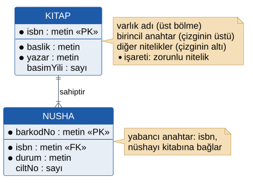
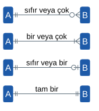
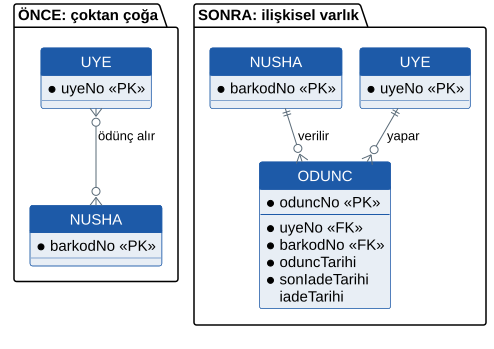
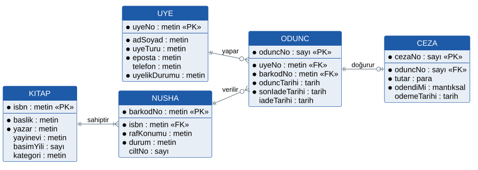

# 7. Hafta: Veri Modelleme — Varlık-İlişki Diyagramları ve Veri Sözlüğü

## Giriş: D2 Katalog Tek Bir Şey mi?

Geçen hafta kütüphanenin veri akış diyagramını çizdik ve dört veri deposu belirledik: D1 Üyeler, D2 Katalog, D3 Ödünçler, D4 Cezalar. Sonunda bir soruyu açık bıraktık: *D2 Katalog tek bir şey mi?*

DFD bu soruya cevap veremez; depoyu bir kutu olarak çizer, içini göstermez. Oysa 2. haftadaki şelale projesini batıran hata tam olarak bu kutunun içindeydi: sistem kitapları yalnızca ISBN ile tanıyordu ve aynı kitabın beş nüshasından hangisinin kimde olduğunu bilemiyordu. Bu bir süreç hatası değil, bir **veri modeli** hatasıydı.

Bu hafta depoların içine giriyoruz: hangi şeylerin kaydı tutulacak, bunların hangi bilgileri var, birbirlerine nasıl bağlılar? Bu soruları **Varlık-İlişki Diyagramı** (ERD, *Entity-Relationship Diagram*) ile cevaplayacak, her verinin anlamını **veri sözlüğüne** yazacağız. Haftanın sonunda ilk yedi haftayı tek bir zincirde birleştiren bir tekrar yapacağız.

---

## 1. Neden Veri Modeli?

- **DFD depoyu gösterir, içini göstermez.** D3 Ödünçler'de hangi bilgilerin tutulduğunu DFD söylemez.
- **Veri süreçlerden uzun yaşar.** Ekranlar, iş akışları, hatta yazılımın kendisi değişir; üye ve ödünç kayıtları yıllarca kalır. Kütüphane on yıl sonra başka bir yazılıma geçse bile bu kayıtları taşımak zorundadır.
- **Yanlış veri modeli pahalıdır.** Veri modelindeki bir hata, üzerine kurulan her ekrana, her sorguya ve her rapora yayılır. 2. haftadaki hata maliyeti tablosunu hatırlayın.

### Mantıksal ve Fiziksel Model

| Model | Soru | Bu dersteki yeri |
| :--- | :--- | :--- |
| **Mantıksal ERD** | Hangi varlıklar, hangi nitelikler, nasıl bağlı? Teknolojiden bağımsız. | Bu hafta |
| **Fiziksel model** | Hangi tablolar, hangi veri türleri, hangi indeksler? Belirli bir veritabanı için. | 13. hafta, normalizasyonla birlikte |

Bu ayrım 6. haftadaki mantıksal ve fiziksel DFD ayrımıyla aynı mantıktadır: analiz neyi, tasarım nasılı söyler.

---

## 2. Varlık ve Nitelik

> **Varlık** (*entity*), kaydı tutulması gereken bir kişi, nesne, olay veya kavramdır. Bir varlığın tek bir kaydına **varlık örneği** denir.

- *UYE* bir kişidir; *20231234 numaralı üye* onun bir örneğidir.
- *NUSHA* bir nesnedir; *barkodu 00012345 olan nüsha* onun bir örneğidir.
- *ODUNC* bir **olaydır**: her ödünç işlemi ayrı bir kayıttır. Öğrencilerin çoğu yalnızca somut nesneleri varlık sayar; olaylar da varlıktır ve çoğu zaman sistemin en çok büyüyen varlığıdır.

Varlıklar bu derste büyük harfle ve tekil yazılır: *UYE*, *ODUNC*. Çoğul ad (*UYELER*) deponun adıdır; varlık tek bir örneği tarif eder.

> **Nitelik** (*attribute*), bir varlığın bir özelliğidir: *adSoyad*, *oduncTarihi*.

| Nitelik türü | Açıklama | Kütüphane örneği |
| :--- | :--- | :--- |
| **Zorunlu** | Her örnekte değeri olmalı | *oduncTarihi* |
| **İsteğe bağlı** | Boş kalabilir | *iadeTarihi*: nüsha iade edilene kadar boştur |
| **Bileşik** | Anlamlı parçalara ayrılabilir | *adSoyad* → *ad* + *soyad* |
| **Türetilmiş** | Başka niteliklerden hesaplanır | *gecikme günü* = bugün − son iade tarihi |

**Türetilmiş nitelik saklanmaz.** Gecikme günü saklansaydı her gün güncellenmesi gerekirdi ve bir gün güncelleme atlandığında veri yanlış kalırdı. Bir istisna bilinçli olarak yapılır: *sonIadeTarihi* ödünç tarihinden hesaplanabilir ama saklanır. Sebebi, ödünç süresi kuralı (İK-01, İK-02) değiştiğinde **eski ödünçlerin** son iade tarihlerinin değişmemesi gerekmesidir. Saklama kararı, verinin hangi andaki kurala göre hesaplandığını korur.

---

## 3. Anahtarlar

| Anahtar | Tanım | Kütüphane örneği |
| :--- | :--- | :--- |
| **Birincil anahtar (PK)** | Varlığın her örneğini tekil olarak tanıyan nitelik; boş olamaz, değişmemeli | *UYE.uyeNo*, *NUSHA.barkodNo* |
| **Aday anahtar** | Birincil anahtar olabilecek her nitelik; aralarından biri seçilir | UYE için *uyeNo* ve *eposta* adaydır; *uyeNo* seçildi |
| **Doğal anahtar** | Gerçek dünyadan gelen değer | *isbn*, *uyeNo* |
| **Yapay anahtar** | Sistemin ürettiği, anlamı olmayan sayı | *oduncNo*, *cezaNo* |
| **Yabancı anahtar (FK)** | Başka bir varlığın birincil anahtarı; iki varlığı bağlar | *NUSHA.isbn*, KITAP'ı işaret eder |

Bir niteliği birincil anahtar seçmeden önce üç soru sorulur: **Hiç değişir mi? Hiç tekrar eder mi? Hiç boş kalır mı?** Telefon numarası üçüne de takılır.

ODUNC'un doğal bir anahtarı yoktur: aynı üye aynı nüshayı farklı zamanlarda iki kez ödünç alabilir, bu yüzden *uyeNo* ile *barkodNo* birlikte bile tekil değildir. Bu yüzden yapay bir *oduncNo* kullanılır.



NUSHA'daki *ciltNo* niteliğine dikkat edin: 3. haftadaki sprint incelemesinde Daire Başkanı "çok ciltli ansiklopedilerimiz için cilt numarası alanı" istemişti. O istek ürün iş listesine eklenmiş ve şimdi veri modeline girmiştir. Her kitap çok ciltli olmadığı için isteğe bağlıdır.

---

## 4. İlişki, Kardinalite ve Katılım

> **İlişki**, varlıklar arasındaki anlamlı bağdır ve fiille adlandırılır: *UYE ödünç **yapar***, *KITAP nüshaya **sahiptir***.

Her ilişki için iki ayrı soru sorulur:

- **Kardinalite (en çok):** Bir örneğe karşı **en fazla** kaç örnek düşer? Bir mi, çok mu?
- **Katılım (en az):** Bir örneğin ilişkiye katılması **zorunlu** mu? En az sıfır mı, bir mi?

| Tür | Anlamı | Kütüphane örneği |
| :--- | :--- | :--- |
| **Bire bir (1:1)** | Bir örneğe karşı en fazla bir örnek | ODUNC — CEZA: bir ödünç en fazla bir ceza doğurur |
| **Bire çok (1:N)** | Bir örneğe karşı birçok örnek | KITAP — NUSHA: bir kitabın birçok nüshası |
| **Çoktan çoğa (M:N)** | İki yönde de birçok örnek | UYE — NUSHA: zaman içinde bir üye birçok nüsha, bir nüsha birçok üye |

---

## 5. Crow's Foot Gösterimi

Bu derste **Crow's Foot** gösterimini kullanıyoruz. Adını "çok" anlamına gelen, kaz ayağına benzeyen simgeden alır; kaynaklarda **IE** (*Information Engineering*) gösterimi olarak da geçer.



**Okuma kuralı:** Bir varlıktan başlayın, çizgi boyunca yürüyün ve **karşı** varlığın yanındaki iki işareti okuyun.

- Karşı varlığa **uzak** olan (içteki) işaret **en azı** verir: daire sıfır, çizgi bir.
- Karşı varlığa **yakın** olan (dıştaki) işaret **en çoğu** verir: çizgi bir, kaz ayağı çok.

| Simge (B ucunda) | Okunuşu |
| :--- | :--- |
| ǁ — çizgi, çizgi | Bir A, **tam bir** B ile ilişkilidir |
| o\| — daire, çizgi | Bir A, **sıfır veya bir** B ile ilişkilidir |
| \|< — çizgi, kaz ayağı | Bir A, **bir veya çok** B ile ilişkilidir |
| o< — daire, kaz ayağı | Bir A, **sıfır veya çok** B ile ilişkilidir |

**Her ilişki iki cümledir.** Kütüphanenin ilişkileri:

| İlişki | Bir yönden | Diğer yönden |
| :--- | :--- | :--- |
| KITAP — NUSHA | Bir kitabın **bir veya çok** nüshası vardır. | Bir nüsha **tam bir** kitaba aittir. |
| UYE — ODUNC | Bir üye **sıfır veya çok** ödünç yapar. | Bir ödünç **tam bir** üyeye aittir. |
| NUSHA — ODUNC | Bir nüsha **sıfır veya çok** kez ödünç verilir. | Bir ödünç **tam bir** nüshaya aittir. |
| ODUNC — CEZA | Bir ödünç **sıfır veya bir** ceza doğurur. | Bir ceza **tam bir** ödünçten doğar. |

"Bir kitabın **bir veya çok** nüshası vardır" cümlesi bir iş kuralına dayanır: kütüphanemizde 2.0 Kitap ve Nüsha Kaydet süreci kitabı en az bir nüshasıyla birlikte kaydeder. Kardinalite analistin tahmini değil, iş biriminin cevabıdır.

### Chen Gösterimi

Varlık-ilişki modelini Peter Chen 1976'da yayımladı. Chen gösterimi ders kitaplarında sık görülür:

| | Crow's Foot | Chen |
| :--- | :--- | :--- |
| **Varlık** | Dikdörtgen; nitelikler içinde satır olarak | Dikdörtgen |
| **Nitelik** | Kutunun içinde | Varlığa çizgiyle bağlı elips |
| **İlişki** | Etiketli çizgi | Eşkenar dörtgen |
| **Kardinalite** | Çizgi uçlarındaki simgeler | Çizgi üzerinde 1, N, M |

Chen gösterimi kavramları anlatmak için açıktır ama nitelik sayısı arttıkça elipslerle kalabalıklaşır; uygulamada ve modelleme araçlarında Crow's Foot daha yaygındır.

---

## 6. Çoktan Çoğa İlişki ve İlişkisel Varlık

UYE ile NUSHA arasında zaman içinde çoktan çoğa bir ilişki vardır: bir üye birçok nüsha ödünç alır, bir nüsha birçok üyeye verilir. Şimdi soralım: **ödünç tarihi, son iade tarihi ve iade tarihi nerede tutulacak?**

- **UYE'de tutulamaz:** Bir üyenin birçok ödüncü vardır. *oduncTarihi1*, *oduncTarihi2*… diye alan açmak "kaç alan yetecek?" sorusunu doğurur; akademisyen için en az on alan gerekir.
- **NUSHA'da tutulamaz:** Bir nüshanın da birçok ödüncü vardır.

Bu bilgi ne üyeye ne nüshaya aittir; **ilişkinin kendisine** aittir. İlişkinin kendi bilgisi varsa o ilişki bir varlıktır. Böyle varlığa **ilişkisel varlık** (*associative entity*) denir:



Çözümün sonunda çoktan çoğa ilişki iki **bire çok** ilişkiye dönüşür: UYE ‖—o< ODUNC ve NUSHA ‖—o< ODUNC. İlişkisel varlık, bağladığı iki varlığın birincil anahtarlarını **yabancı anahtar** olarak taşır. 6. haftadaki D3 Ödünçler deposu tam olarak bu varlığı tutuyordu.

Fiziksel veritabanlarında çoktan çoğa ilişki doğrudan kurulamaz, her zaman bir ara tabloyla çözülür. Bu konu 13. haftada yeniden karşınıza çıkacak.

---

## 7. Vaka Çalışması: Kütüphane Otomasyonu

### 7.1. Depolardan Varlıklara



| DFD deposu | ERD varlığı | Not |
| :--- | :--- | :--- |
| D1 Üyeler | UYE | Öğrenci ve Akademisyen ayrı varlık değil; *uyeTuru* niteliğiyle ayrılır |
| D2 Katalog | **KITAP** ve **NUSHA** | Kitap bir eserdir (ISBN), nüsha fiziksel kopyadır (barkod) |
| D3 Ödünçler | ODUNC | UYE ile NUSHA arasındaki ilişkisel varlık |
| D4 Cezalar | CEZA | Her ceza tek bir ödünçten doğar |

Açılıştaki sorunun cevabı: **D2 Katalog iki varlıktır.** Bir depoda birden çok varlığın tutulması DFD'de hata değildir; DFD veriyi bu ayrıntıda göstermez. Ayrıştırma veri modelinin işidir.

Öğrenci ve Akademisyen için ayrı varlık açılmadı, çünkü tuttukları bilgi aynıdır; farkları yalnızca iş kurallarındadır (nüsha sınırı ve ödünç süresi). Bu fark *uyeTuru* niteliğiyle tutulur ve kurallar 3.2 Uygunluğu Denetle sürecinde uygulanır.

### 7.2. Mantıksal ERD



| Varlık | Birincil anahtar | Yabancı anahtar | Diğer nitelikler |
| :--- | :--- | :--- | :--- |
| UYE | uyeNo | — | adSoyad, uyeTuru, eposta, telefon, uyelikDurumu |
| KITAP | isbn | — | baslik, yazar, yayinevi, basimYili, kategori |
| NUSHA | barkodNo | isbn → KITAP | rafKonumu, durum, ciltNo |
| ODUNC | oduncNo | uyeNo → UYE, barkodNo → NUSHA | oduncTarihi, sonIadeTarihi, iadeTarihi |
| CEZA | cezaNo | oduncNo → ODUNC | tutar, odendiMi, odemeTarihi |

**Tartışmaya açık bir karar: NUSHA.durum gerekli mi?** Bir nüshanın şu an ödünçte olup olmadığı, o nüshanın *iadeTarihi* boş bir ödünç kaydı olup olmadığına bakarak da bulunabilir; yani "ödünçte" durumu türetilebilir. Ama "kayıp" durumu ödünç kayıtlarından çıkarılamaz. Bu yüzden *durum* niteliği tutuldu; bunun bedeli, ödünç ve iade süreçlerinin durumu her seferinde güncellemek zorunda olmasıdır (6. haftada 3.4 ve 4.0'ın D2'ye yazdığı akış buydu).

**Bilinçli sadeleştirmeler:** *yazar* ve *kategori* KITAP'ın nitelikleri olarak tutuldu. Gerçekte bir kitabın birden çok yazarı olabilir; bu, bölüm sonu sorularından birinin konusu.

### 7.3. Kardinalite ile İş Kuralını Ayırmak

"Öğrenci aynı anda en fazla 3 nüsha alır" (İK-01) kuralı ERD'de **yazılmaz**; UYE ile ODUNC arasına "0..3" konmaz. Sebepleri:

1. Sınır üye türüne göre değişir (3 veya 10).
2. Sınır **aynı anda** açık olan ödünçler için geçerlidir; bir üyenin ömür boyu yaptığı ödünç sayısı sınırsızdır.
3. Kural bir işletme politikasıdır ve değişebilir; veri modeli politika değiştiğinde yerinde kalmalıdır.

Kardinalite **yapının doğasını**, iş kuralı **işletmenin politikasını** anlatır. İK-01 veri modelinde değil, 6. haftadaki 3.2 Uygunluğu Denetle sürecinin karar tablosunda uygulanır. Buna karşılık "bir ödünç en fazla bir ceza doğurur" yapının doğasıdır: bir gecikmenin iki cezası olmaz. Bu yüzden ERD'de ODUNC ‖—o| CEZA olarak görünür.

---

## 8. Veri Sözlüğü

> **Veri sözlüğü** (*data dictionary*), sistemdeki her verinin anlamını, biçimini ve kaynağını tek bir yerde tanımlayan belgedir.

Veri sözlüğü olmadan bir geliştirici *durum* alanına "rafta", diğeri "Rafta", üçüncüsü "1" yazar ve üç ekran birbirini anlamaz. Veri sözlüğündeki her "geçerli değer" ileride bir doğrulama kuralına, yani bir teste dönüşür.

### 8.1. Veri Öğeleri

| Öğe | Tanım | Tür ve biçim | Geçerli değerler | Zorunlu | Kaynak |
| :--- | :--- | :--- | :--- | :-: | :--- |
| uyeNo | Öğrenci veya personel numarası | metin, 9–11 rakam | Öğrenci İşleri Sistemi'nde kayıtlı | E | *öğrenci durumu* akışı |
| uyeTuru | Üyenin türü | metin | Öğrenci, Akademisyen | E | *öğrenci durumu* akışı |
| uyelikDurumu | Üyeliğin geçerliliği | metin | aktif, askıda | E | 1.0 Üye Kaydet |
| isbn | Kitabın uluslararası standart numarası | metin, 13 rakam | ISBN-13 kurallarına uygun | E | *yeni kitap ve nüsha* akışı |
| barkodNo | Nüshanın barkodu | metin, 8 rakam | kütüphane içinde benzersiz | E | *yeni kitap ve nüsha* akışı |
| durum | Nüshanın o anki durumu | metin | rafta, ödünçte, kayıp | E | 3.4, 4.0 süreçleri |
| oduncTarihi | Ödüncün yapıldığı gün | tarih | bugünden ileri olamaz | E | 3.4 Ödüncü Kaydet |
| sonIadeTarihi | Nüshanın en geç iade günü | tarih | oduncTarihi + 15 veya 30 gün | E | İK-01, İK-02 |
| iadeTarihi | Nüshanın iade edildiği gün | tarih | oduncTarihi'nden önce olamaz | H | 4.0 Nüsha İadesi Al |
| tutar | Gecikme cezası | para, TL | geciken gün × 2; 0'dan büyük | E | İK-03 |

### 8.2. Veri Akışlarının Bileşimi

DFD'deki akışların hangi veri öğelerinden oluştuğu da veri sözlüğüne yazılır. Tom DeMarco'nun yapısal analiz yönteminden gelen kısa bir gösterim kullanılır:

| İşaret | Anlamı |
| :--- | :--- |
| `=` | … öğelerinden oluşur |
| `+` | ve |
| `[ a \| b ]` | a veya b'den biri |
| `{ a }` | a sıfır veya daha çok kez tekrar eder |
| `( a )` | a isteğe bağlıdır |

```text
ödünç işlemi   = uyeNo + barkodNo
ödünç sonucu   = [ onay | ret ]
onay           = barkodNo + sonIadeTarihi
ret            = retNedeni + { gecikmisBarkodNo } + ( cezaTutari )
iade işlemi    = barkodNo
iade makbuzu   = barkodNo + iadeTarihi + ( cezaTutari )
öğrenci durumu = uyeNo + adSoyad + uyeTuru + eposta
```

*ret* satırını okuyalım: ret nedeni her zaman vardır; gecikmiş nüsha barkodları sıfır veya daha çok kez tekrar eder; ceza tutarı yalnızca borç nedeniyle ret verildiyse bulunur.

Akış bileşimleri dengelemeyi doğrulamanın da yoludur: 6. haftada Seviye 1'deki "ödünç sonucu: ret" ile Seviye 0'daki "ödünç sonucu"nun gerçekten aynı veriyi taşıdığını ancak bu tanım sayesinde gösterebiliriz.

---

## 9. Ara Sınav Öncesi Tekrar: Yedi Haftanın Zinciri

İlk yedi hafta birbirinden bağımsız konular değil, tek bir analiz sürecinin adımlarıdır. Her haftanın çıktısı bir sonrakinin girdisidir:



### Aynı Kavramın Haftalar Boyunca İzi

| Kütüphanede | 1. hafta | 3. hafta | 5. hafta | 6. hafta | 7. hafta |
| :--- | :--- | :--- | :--- | :--- | :--- |
| Kütüphaneci | mevcut süreci elle yürüten kişi | hikâyedeki rol | birincil aktör | dış varlık | — |
| Ödünç verme | bir süreç | Sprint 1'in kapsamı dışında | UC-03 | 3.0 süreci | ODUNC varlığı |
| Üç nüsha kuralı | — | kabul ölçütü | İK-01 | karar tablosu | kardinalite **değil** |
| Öğrenci İşleri Sistemi | dış çevre | — | ikincil aktör | dış varlık | *uyeNo*'nun kaynağı |
| Nüsha | (2. hafta: ISBN krizi) | barkodla kayıt | FG-02 | D2 Katalog | NUSHA varlığı |
| Gecikme cezası | geri besleme örneği | hikâye 3 | extend: Gecikme Cezası Hesapla | 4.0 → D4 | CEZA varlığı |

Bu tabloyu kendi projeniz için de çıkarın. Boş kalan her hücre ya bir eksiğin ya da bilinçli bir kararın işaretidir; hangisi olduğunu söyleyebilmelisiniz.

Ara sınavın biçimi ve kapsamı için ders sayfasına bakın.

---

## 10. Dönem Projenize Yansıması

Bu haftayla birlikte **gereksinim analizi paketinin** bütün parçaları hazırdır: gereksinim listesi, use case diyagramı ve senaryolar, veri akış diyagramları, süreç mantığı, mantıksal ERD ve veri sözlüğü. Takımınızla:

1. DFD'deki her depoyu bir veya daha çok varlığa ayırın.
2. Her varlık için birincil anahtarı seçin ve gerekçesini yazın (doğal mı, yapay mı?). Nitelikleri listeleyin, zorunlu olanları işaretleyin.
3. Her ilişkiyi **iki yönden** cümleye çevirin; sonra Crow's Foot ile çizin.
4. Çoktan çoğa ilişkileri ilişkisel varlıkla çözün.
5. İş kurallarınızın kardinaliteye karışmadığını kontrol edin.
6. Veri sözlüğü hazırlayın: her nitelik için tanım, tür ve biçim, geçerli değerler, zorunluluk ve kaynak; önemli DFD akışları için bileşim.
7. Haftalar arası izlenebilirlik tablosunu çıkarın: aktör → dış varlık, use case → süreç, depo → varlık, iş kuralı → karar tablosu.

Teslim biçimi ve zamanı için dönem projesi kılavuzuna bakın.

---

## 11. İyi Pratikler ve Sık Yapılan Hatalar

| Hata | Neden Tehlikeli? | Doğru Pratik |
| :--- | :--- | :--- |
| **Süreç adını varlık yapmak** | *ÖDÜNÇ VERME* bir iştir, kaydı tutulan şey değildir. | Varlık bir isimdir: *ODUNC*. Fiil görürseniz süreç arayın. |
| **Çoktan çoğayı çözmemek** | İlişkinin bilgisi (tarihler) hiçbir varlığa sığmaz. | İlişkinin bilgisi varsa onu ilişkisel varlık yapın. |
| **Tekrarlayan alan açmak** | *kitap1*, *kitap2*, *kitap3*: kaç alan yetecek, hangisi boş? | Tekrarlayan bilgiyi ayrı bir varlığa taşıyın; bu 13. haftanın ilk normal formunun konusu. |
| **Türetilmiş veriyi saklamak** | *gecikmeGunu* her gün yanlışlanır. | Hesaplanabileni saklamayın; saklıyorsanız gerekçesini yazın (*sonIadeTarihi* gibi). |
| **İş kuralını kardinaliteye yazmak** | "0..3" kural değişince veri modelini bozar. | Kardinaliteyi yapının doğasına göre, kuralı süreç mantığında yazın. |
| **Anahtarsız varlık** | Tekil olarak tanınamayan kayıt güncellenemez, silinemez. | Her varlığa değişmeyen, tekrar etmeyen, boş kalmayan bir birincil anahtar. |
| **Tek yönden okumak** | "Bir üye çok ödünç yapar" doğru, ama "bir ödünç kaç üyeye ait?" sorulmamış. | Her ilişkiyi iki cümle olarak yazın. |

---

## 12. Kendinizi Deneyin

**Bu haftanın konusu**

1. **Varlık mı, nitelik mi?** Kütüphanede *kategori* şu an KITAP'ın bir niteliği. Hangi durumda ayrı bir KATEGORI varlığı olması gerekir? İpucu: kategorilerin bir açıklaması veya bir sorumlu kütüphanecisi olsaydı ne olurdu?
2. **Çoktan çoğa:** Bir kitabın birden çok yazarı, bir yazarın birden çok kitabı olabilir. YAZAR varlığını ekleyip ilişkiyi ilişkisel varlıkla çözün. İlişkisel varlığın kendi niteliği olabilir mi (örneğin yazarların kapaktaki sırası)?
3. **Kardinalite mi, kural mı?** Aşağıdakilerin her biri ERD'ye mi, karar tablosuna mı yazılır? (a) "Bir nüsha aynı anda en fazla bir üyede olabilir." (b) "Ödenmemiş cezası 50 TL'yi aşan üyenin üyeliği askıya alınır." (c) "Her ceza bir ödünçten doğar."
4. **Anahtar seçimi:** Bir spor salonu sistemi için ÜYE varlığında TC kimlik no, telefon, e-posta ve sistemin ürettiği bir numara aday. Hangisini birincil anahtar seçersiniz? 4. haftadaki KVKK tartışmasını da hesaba katın.
5. **Akış bileşimi:** "sorgu sonucu" akışının bileşimini DeMarco gösterimiyle yazın. Hem katalog aramasını hem üyenin kendi ödünçlerini görmesini karşılamalı.

**Tekrar: ilk yedi haftanın bağlantıları**

6. Kütüphanenin 1. haftadaki sistem sınırı kararı 5. haftadaki use case diyagramında ve 6. haftadaki bağlam diyagramında nasıl görünüyor? Sınırın dışında kalan bir öğeyi üç hafta boyunca izleyin.
7. 2. haftadaki ISBN krizi, 3. haftadaki Sprint 1 hikâyesinde ve bu haftanın ERD'sinde nasıl önlendi? Aynı hatanın üç farklı aşamada yakalanmasının maliyetini 2. haftadaki tabloyla karşılaştırın.
8. 4. haftadaki paydaş listesinden hangileri 5. haftada aktör oldu, hangileri olmadı? Olmayanların gereksinimleri sisteme hangi yoldan girdi?
9. "Gecikmiş nüshası olan üye ödünç alamaz" kuralını 3., 5. ve 6. haftalardaki biçimleriyle yan yana yazın: kabul ölçütü, alternatif akış, karar tablosu satırı. Üçü birbiriyle tutarlı mı?
10. Kendi projeniz için izlenebilirlik tablosunu çıkarın. Hiçbir sürece karşılık gelmeyen bir use case'iniz veya hiçbir varlığa dönüşmeyen bir deponuz var mı?

---

*Öğr. Gör. Turgay Taymaz · Afyon Kocatepe Üniversitesi*
*Bu materyal CC BY-NC-SA 4.0 ile lisanslanmıştır. Kullanırken kaynak gösteriniz.*
*Kaynak: https://github.com/ttaymaz/ders-notlari*
